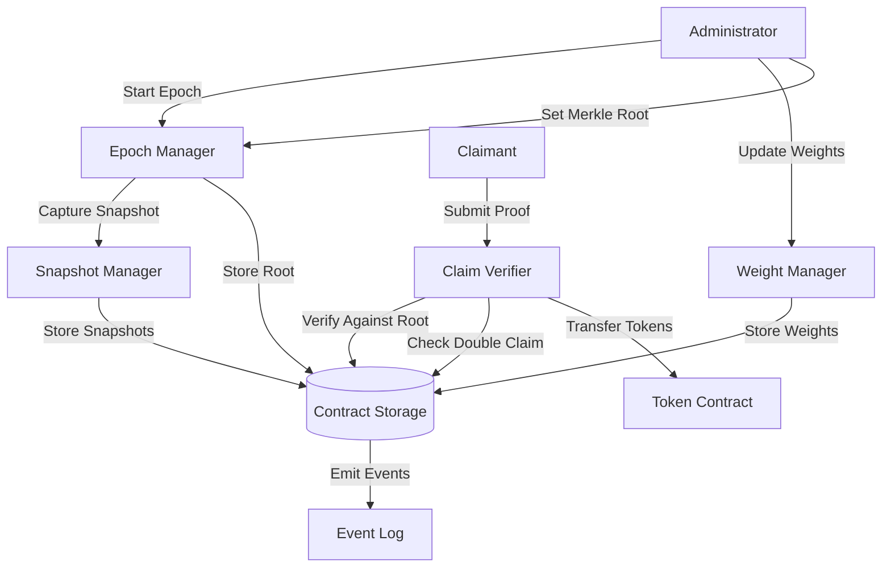

# Design Document: Periodic Reward Distribution

## Overview

The Periodic Reward Distribution contract implements a gas-efficient, Merkle tree-based reward distribution system for Soroban smart contracts. The design uses a pull-based claiming model where claimants provide cryptographic proofs to claim their allocated rewards, avoiding the gas costs of pushing rewards to all recipients.

The contract manages discrete time periods called epochs, each with a snapshot of distribution weights captured at epoch start to prevent gaming. Rewards are calculated off-chain based on these snapshots, and a Merkle root is published on-chain. Claimants then submit Merkle proofs to claim their rewards in a trustless manner.

Key design principles:
- Gas efficiency through Merkle proofs (O(log n) verification vs O(n) distribution)
- Anti-gaming via immutable snapshots at epoch boundaries
- Pull-based claiming to distribute gas costs to beneficiaries
- Comprehensive event emission for transparency and off-chain indexing

## Architecture

### High-Level Components



### Component Responsibilities

1. **Epoch Manager**: Handles epoch lifecycle (start, finalize, store Merkle roots)
2. **Weight Manager**: Manages distribution weight updates between epochs
3. **Snapshot Manager**: Captures and stores immutable weight snapshots at epoch start
4. **Claim Verifier**: Verifies Merkle proofs and processes reward claims
5. **Access Control**: Enforces administrator permissions for privileged operations

### Data Flow

1. **Epoch Initialization**:
   - Admin calls `start_epoch()` → Snapshot captured → EpochStarted event emitted
   
2. **Off-Chain Calculation** (external to contract):
   - System reads snapshot weights
   - Calculates proportional rewards for each claimant
   - Builds Merkle tree from (address, epoch_id, amount) tuples
   - Generates proofs for each claimant
   
3. **Merkle Root Publication**:
   - Admin calls `set_merkle_root(epoch_id, root)` → Root stored → MerkleRootSet event emitted
   
4. **Claiming**:
   - Claimant calls `claim(epoch_id, amount, proof)` → Proof verified → Tokens transferred → Claimed event emitted

## Components and Interfaces

### Data Structures

```rust
#[contracttype]
#[derive(Clone, Debug)]
pub struct EpochInfo {
    pub epoch_id: u64,
    pub start_timestamp: u64,
    pub merkle_root: Option<BytesN<32>>,
    pub total_rewards: i128,
    pub finalized: bool,
}

#[contracttype]
#[derive(Clone, Debug)]
pub struct WeightSnapshot {
    pub epoch_id: u64,
    pub weights: Map<Address, i128>,
    pub total_weight: i128,
}

#[contracttype]
#[derive(Clone)]
pub enum DataKey {
    Admin,
    RewardToken,
    CurrentEpoch,
    EpochInfo(u64),
    WeightSnapshot(u64),
    DistributionWeight(Address),
    ClaimRecord(Address, u64), // (claimant, epoch_id)
    Admins, // Set of admin addresses
}
```

### Core Contract Interface

```rust
pub trait RewardDistribution {
    // Initialization
    fn initialize(env: Env, admin: Address, reward_token: Address);
    
    // Epoch Management (Admin only)
    fn start_epoch(env: Env, total_rewards: i128) -> u64;
    fn set_merkle_root(env: Env, epoch_id: u64, merkle_root: BytesN<32>);
    fn finalize_epoch(env: Env, epoch_id: u64);
    
    // Weight Management (Admin only)
    fn set_weights(env: Env, addresses: Vec<Address>, weights: Vec<i128>);
    fn set_weight(env: Env, address: Address, weight: i128);
    
    // Claiming (Public)
    fn claim(env: Env, claimant: Address, epoch_id: u64, amount: i128, proof: Vec<BytesN<32>>);
    
    // Queries (Public)
    fn get_current_epoch(env: Env) -> u64;
    fn get_epoch_info(env: Env, epoch_id: u64) -> EpochInfo;
    fn get_weight(env: Env, address: Address) -> i128;
    fn get_snapshot_weight(env: Env, epoch_id: u64, address: Address) -> i128;
    fn is_claimed(env: Env, claimant: Address, epoch_id: u64) -> bool;
    fn get_merkle_root(env: Env, epoch_id: u64) -> BytesN<32>;
    
    // Admin Management (Owner only)
    fn add_admin(env: Env, admin: Address);
    fn remove_admin(env: Env, admin: Address);
    fn is_admin(env: Env, address: Address) -> bool;
}
```

### Merkle Proof Verification

```rust
fn verify_merkle_proof(
    env: &Env,
    proof: &Vec<BytesN<32>>,
    root: &BytesN<32>,
    claimant: &Address,
    epoch_id: u64,
    amount: i128,
) -> bool {
    // Construct leaf: sha256(address || epoch_id || amount)
    let mut leaf_data = Bytes::new(env);
    leaf_data.append(&claimant.to_xdr(env));
    leaf_data.append(&epoch_id.to_xdr(env));
    leaf_data.append(&amount.to_xdr(env));
    let mut computed_hash: BytesN<32> = env.crypto().sha256(&leaf_data).into();
    
    // Traverse proof path
    for sibling in proof.iter() {
        let mut combined = Bytes::new(env);
        if computed_hash < sibling {
            combined.append(&computed_hash.clone().into());
            combined.append(&sibling.clone().into());
        } else {
            combined.append(&sibling.clone().into());
            combined.append(&computed_hash.clone().into());
        }
        computed_hash = env.crypto().sha256(&combined).into();
    }
    
    computed_hash == *root
}
```

## Data Models

### Storage Layout

**Instance Storage** (contract-level, persistent):
- `Admin`: Primary owner address
- `RewardToken`: Token contract address for rewards
- `CurrentEpoch`: Current epoch ID counter
- `Admins`: Set of authorized administrator addresses

**Persistent Storage** (long-lived, per-key TTL):
- `EpochInfo(epoch_id)`: Epoch metadata including Merkle root
- `WeightSnapshot(epoch_id)`: Immutable weight snapshot for each epoch
- `DistributionWeight(address)`: Current distribution weight per address
- `ClaimRecord(address, epoch_id)`: Boolean flag indicating if claimed

### Storage Optimization Considerations

1. **Snapshot Storage**: Store snapshots as `Map<Address, i128>` within `WeightSnapshot` struct. For large participant sets, consider storing only deltas from previous snapshot.

2. **Claim Records**: Use boolean flags in persistent storage with appropriate TTL. After epoch expiration + grace period, these can be archived or pruned.

3. **Weight Updates**: Batch updates in `set_weights()` to minimize transaction overhead.

4. **Merkle Root**: Store only 32-byte hash on-chain; full tree lives off-chain.

### Epoch State Machine

```
[IDLE] --start_epoch()--> [ACTIVE]
[ACTIVE] --set_merkle_root()--> [CLAIMABLE]
[CLAIMABLE] --finalize_epoch()--> [FINALIZED]
[FINALIZED] --start_epoch()--> [ACTIVE] (new epoch)
```


## Correctness Properties

*A property is a characteristic or behavior that should hold true across all valid executions of a system—essentially, a formal statement about what the system should do. Properties serve as the bridge between human-readable specifications and machine-verifiable correctness guarantees.*


### Property 1: Epoch ID Uniqueness

*For any* sequence of epoch creations, each epoch SHALL receive a unique identifier that is never reused.

**Validates: Requirements 1.1**

### Property 2: Epoch Start Event Emission

*For any* epoch creation, an EpochStarted event SHALL be emitted containing the correct epoch identifier, timestamp, and total reward amount.

**Validates: Requirements 1.2, 8.1**

### Property 3: Snapshot Capture on Epoch Start

*For any* set of distribution weights, when an epoch is started, a snapshot SHALL be created that exactly matches the current weight values at that moment.

**Validates: Requirements 1.3, 4.1**

### Property 4: Single Active Epoch Invariant

*For any* contract state where an epoch is active, attempting to start a new epoch SHALL fail until the current epoch is finalized.

**Validates: Requirements 1.4**

### Property 5: Merkle Root Persistence

*For any* Merkle root set for an epoch, querying that epoch's root SHALL return the same value (round-trip property).

**Validates: Requirements 1.5**

### Property 6: Valid Proof Verification

*For any* valid Merkle proof constructed from the correct tree for an epoch, the verification function SHALL accept the proof and allow the claim.

**Validates: Requirements 2.1, 9.3**

### Property 7: Successful Claim Token Transfer

*For any* successful claim with a valid proof, the claimant's token balance SHALL increase by exactly the claimed amount.

**Validates: Requirements 2.2**

### Property 8: Claim Event Emission

*For any* successful reward claim, a Claimed event SHALL be emitted containing the correct claimant address, epoch identifier, and claimed amount.

**Validates: Requirements 2.3, 8.2**

### Property 9: Double Claim Prevention

*For any* claimant and epoch, after successfully claiming once, any subsequent claim attempt for the same epoch SHALL fail.

**Validates: Requirements 2.4, 2.6**

### Property 10: Invalid Proof Rejection

*For any* invalid Merkle proof (wrong siblings, incorrect leaf data, or mismatched root), the verification SHALL fail and the transaction SHALL revert.

**Validates: Requirements 2.5, 9.5**

### Property 11: Weight Update Persistence

*For any* weight update operation, querying the weight immediately after SHALL return the newly set value (round-trip property).

**Validates: Requirements 3.1**

### Property 12: Weight Update Timing Constraint

*For any* weight update attempt during an active epoch, the operation SHALL fail; weight updates SHALL only succeed between epochs.

**Validates: Requirements 3.2**

### Property 13: Weight Maximum Validation

*For any* weight update where the total weight exceeds the defined maximum, the operation SHALL fail.

**Validates: Requirements 3.3**

### Property 14: Batch Weight Update Equivalence

*For any* set of addresses and weights, updating them via batch operation SHALL produce the same final state as updating them individually in sequence.

**Validates: Requirements 3.4, 10.4**

### Property 15: Weight Update Event Emission

*For any* weight modification operation, events SHALL be emitted indicating all affected addresses and their new weight values.

**Validates: Requirements 3.5, 8.3**

### Property 16: Snapshot Immutability

*For any* epoch snapshot, changing distribution weights after the snapshot is captured SHALL NOT affect the snapshot data or any claims for that epoch.

**Validates: Requirements 4.2, 4.3, 4.5**

### Property 17: Snapshot Data Integrity

*For any* epoch snapshot, the snapshot data SHALL never change after creation; querying the same snapshot multiple times SHALL always return identical values.

**Validates: Requirements 4.4**

### Property 18: Token Type Compatibility

*For any* valid token contract address, the reward distribution contract SHALL successfully transfer rewards using that token.

**Validates: Requirements 5.5**

### Property 19: Admin List Management

*For any* admin addition or removal operation by the owner, querying the admin list SHALL reflect the change (round-trip property).

**Validates: Requirements 6.1, 6.4**

### Property 20: Access Control Enforcement

*For any* non-admin address attempting to call an administrative function, the transaction SHALL revert with an authorization error.

**Validates: Requirements 6.2, 6.3**

### Property 21: Admin Event Emission

*For any* admin addition or removal operation, an event SHALL be emitted indicating the address and the permission change.

**Validates: Requirements 6.5**

### Property 22: Claim Status Query Accuracy

*For any* claimant and epoch, the claim status query SHALL return true if and only if the claimant has successfully claimed rewards for that epoch.

**Validates: Requirements 7.2**

### Property 23: Merkle Root Set Event Emission

*For any* Merkle root setting operation, a MerkleRootSet event SHALL be emitted containing the correct epoch identifier and root hash.

**Validates: Requirements 8.4**

### Property 24: Leaf Node Format Consistency

*For any* claim verification, the leaf node SHALL be constructed as hash(address || epoch_id || amount) using the specified hash function.

**Validates: Requirements 9.1**

### Property 25: Hash Function Consistency

*For any* Merkle tree operation (leaf construction, path reconstruction), the same hash function (SHA256) SHALL be used throughout.

**Validates: Requirements 9.2**

### Property 26: Variable Length Proof Support

*For any* valid Merkle proof regardless of length (corresponding to different tree depths), the verification SHALL correctly process the proof.

**Validates: Requirements 9.4**

### Property 27: Storage Efficiency

*For any* epoch, the contract SHALL store only the Merkle root (32 bytes) and NOT store individual allocation amounts for each claimant.

**Validates: Requirements 10.2**


## Error Handling

### Error Types

The contract defines the following error conditions:

```rust
#[contracterror]
#[derive(Copy, Clone, Debug, Eq, PartialEq)]
pub enum Error {
    AlreadyInitialized = 1,
    NotInitialized = 2,
    Unauthorized = 3,
    EpochAlreadyActive = 4,
    NoActiveEpoch = 5,
    EpochNotFound = 6,
    EpochNotFinalized = 7,
    InvalidMerkleProof = 8,
    AlreadyClaimed = 9,
    InvalidWeight = 10,
    WeightUpdateDuringEpoch = 11,
    TotalWeightExceeded = 12,
    InvalidEpochState = 13,
    MerkleRootNotSet = 14,
}
```

### Error Handling Strategy

1. **Initialization Errors**:
   - `AlreadyInitialized`: Thrown when attempting to initialize an already initialized contract
   - `NotInitialized`: Thrown when calling functions before contract initialization

2. **Authorization Errors**:
   - `Unauthorized`: Thrown when a non-admin attempts administrative functions
   - Checked via `require_auth()` and admin list verification

3. **Epoch State Errors**:
   - `EpochAlreadyActive`: Thrown when starting a new epoch while one is active
   - `NoActiveEpoch`: Thrown when operations require an active epoch but none exists
   - `EpochNotFound`: Thrown when querying non-existent epoch data
   - `EpochNotFinalized`: Thrown when attempting operations that require finalized epoch
   - `InvalidEpochState`: Thrown for invalid state transitions

4. **Claim Errors**:
   - `InvalidMerkleProof`: Thrown when proof verification fails
   - `AlreadyClaimed`: Thrown when attempting to claim already-claimed rewards
   - `MerkleRootNotSet`: Thrown when attempting to claim before Merkle root is published

5. **Weight Management Errors**:
   - `InvalidWeight`: Thrown for negative or otherwise invalid weight values
   - `WeightUpdateDuringEpoch`: Thrown when attempting weight updates during active epoch
   - `TotalWeightExceeded`: Thrown when total weights exceed maximum allowed

### Error Recovery

- All errors result in transaction reversion with no state changes
- Errors include descriptive messages for debugging and user feedback
- Events are NOT emitted for failed operations
- Failed claims do not mark rewards as claimed
- Failed weight updates do not modify stored weights

### Validation Order

To minimize gas costs, validations are performed in order of computational cost:

1. Initialization check (storage read)
2. Authorization check (storage read + auth verification)
3. State validation (storage reads)
4. Input validation (computation)
5. Cryptographic verification (expensive computation)


## Testing Strategy

### Dual Testing Approach

The testing strategy employs both unit tests and property-based tests to ensure comprehensive coverage:

- **Unit tests**: Verify specific examples, edge cases, error conditions, and integration points
- **Property-based tests**: Verify universal properties across randomized inputs

Both approaches are complementary and necessary. Unit tests catch concrete bugs and validate specific scenarios, while property-based tests verify general correctness across a wide input space.

### Property-Based Testing

**Framework**: Use `proptest` or `quickcheck` for Rust property-based testing

**Configuration**:
- Minimum 100 iterations per property test (due to randomization)
- Each property test references its design document property
- Tag format: `// Feature: periodic-reward-distribution, Property {number}: {property_text}`

**Property Test Coverage**:

Each of the 27 correctness properties defined in this document SHALL be implemented as a property-based test:

1. Property 1: Generate sequences of epoch starts, verify all IDs unique
2. Property 2: Generate epoch starts, verify events emitted with correct data
3. Property 3: Generate random weights, start epoch, verify snapshot matches
4. Property 4: Generate active epoch state, verify new epoch start fails
5. Property 5: Generate random Merkle roots, verify round-trip persistence
6. Property 6: Generate valid Merkle trees and proofs, verify acceptance
7. Property 7: Generate valid claims, verify balance increases correctly
8. Property 8: Generate valid claims, verify events emitted
9. Property 9: Generate claims, attempt duplicate, verify second fails
10. Property 10: Generate invalid proofs (mutated siblings, wrong data), verify rejection
11. Property 11: Generate random weights, update, verify round-trip
12. Property 12: Generate weight updates during active epoch, verify failure
13. Property 13: Generate weights exceeding maximum, verify rejection
14. Property 14: Generate weight sets, compare batch vs individual updates
15. Property 15: Generate weight updates, verify events emitted
16. Property 16: Generate snapshots, modify weights, verify snapshot unchanged
17. Property 17: Generate snapshots, query multiple times, verify identical results
18. Property 18: Generate different token addresses, verify transfers work
19. Property 19: Generate admin add/remove operations, verify round-trip
20. Property 20: Generate non-admin addresses, verify admin function rejection
21. Property 21: Generate admin operations, verify events emitted
22. Property 22: Generate claims, verify status query accuracy
23. Property 23: Generate Merkle root sets, verify events emitted
24. Property 24: Generate claims, verify leaf format consistency
25. Property 25: Generate Merkle operations, verify hash function consistency
26. Property 26: Generate proofs of varying lengths, verify all work
27. Property 27: Generate epochs, verify only root stored (not allocations)

### Unit Testing

**Unit Test Focus Areas**:

1. **Initialization**:
   - Contract initialization with valid parameters
   - Rejection of duplicate initialization
   - Proper storage of initial configuration

2. **Epoch Lifecycle**:
   - Starting first epoch
   - Finalizing epoch
   - Setting Merkle root
   - State transitions

3. **Edge Cases**:
   - Zero weight handling
   - Empty proof arrays
   - Maximum weight boundaries
   - Epoch ID overflow (if applicable)
   - Empty snapshot handling

4. **Integration Points**:
   - Token contract interaction
   - Event emission verification
   - Storage persistence across calls

5. **Error Conditions**:
   - Each error type triggered and verified
   - Error messages are descriptive
   - State remains unchanged after errors

6. **Specific Examples**:
   - Example from requirements (specific addresses, amounts)
   - Known Merkle tree test vectors
   - Boundary value testing

### Test Data Generation

**For Property Tests**:
- Random addresses (valid Soroban addresses)
- Random weights (0 to MAX_WEIGHT)
- Random amounts (0 to MAX_AMOUNT)
- Random Merkle trees (balanced and unbalanced)
- Random proof lengths (1 to MAX_TREE_DEPTH)

**For Unit Tests**:
- Fixed test addresses
- Known Merkle tree test vectors
- Boundary values (0, 1, MAX-1, MAX)
- Specific error-triggering inputs

### Test Environment Setup

```rust
#[cfg(test)]
mod tests {
    use super::*;
    use soroban_sdk::testutils::{Address as _, Ledger};
    use soroban_sdk::{Env, Address, BytesN, Vec};
    
    fn setup_test_env() -> (Env, Address, Address, Address) {
        let env = Env::default();
        let admin = Address::generate(&env);
        let token = Address::generate(&env);
        let contract_id = env.register_contract(None, RewardDistributionContract);
        (env, admin, token, contract_id)
    }
    
    // Helper to create valid Merkle tree and proofs
    fn create_merkle_tree(
        env: &Env,
        epoch_id: u64,
        claims: Vec<(Address, i128)>
    ) -> (BytesN<32>, Vec<Vec<BytesN<32>>>) {
        // Implementation of Merkle tree construction
        // Returns (root, proofs_for_each_claim)
    }
}
```

### Coverage Goals

- **Line coverage**: Minimum 90%
- **Branch coverage**: Minimum 85%
- **Property coverage**: 100% (all 27 properties tested)
- **Error path coverage**: 100% (all error types triggered)

### Continuous Integration

- Run all tests on every commit
- Property tests run with fixed seed for reproducibility
- Separate CI job for extended property testing (1000+ iterations)
- Gas usage benchmarking for key operations

