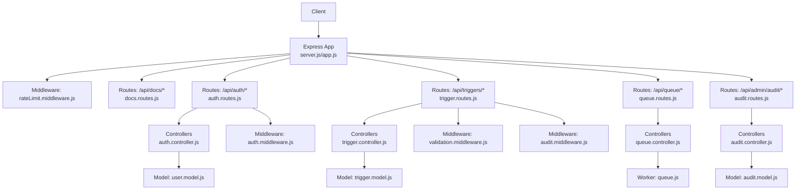
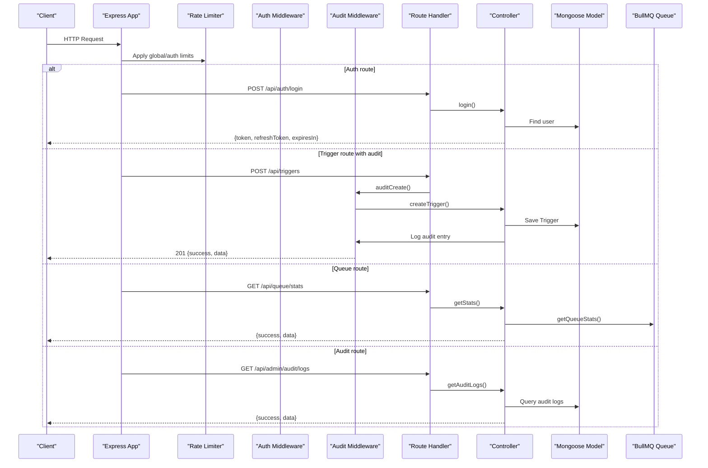
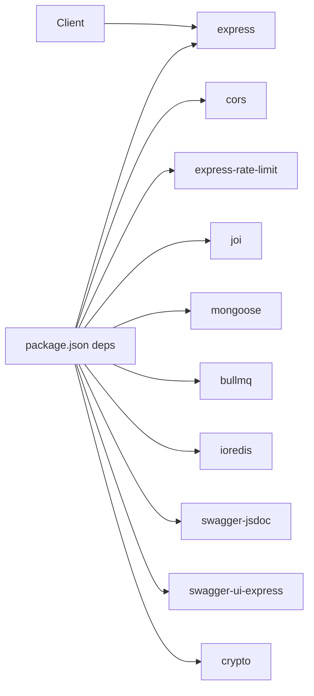
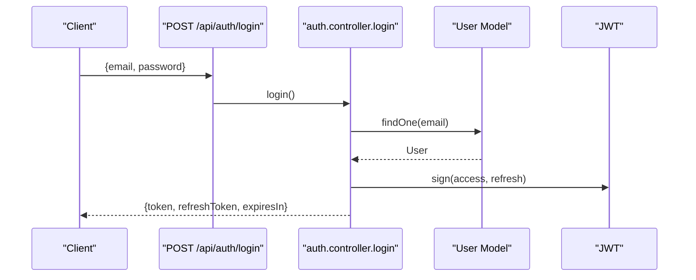
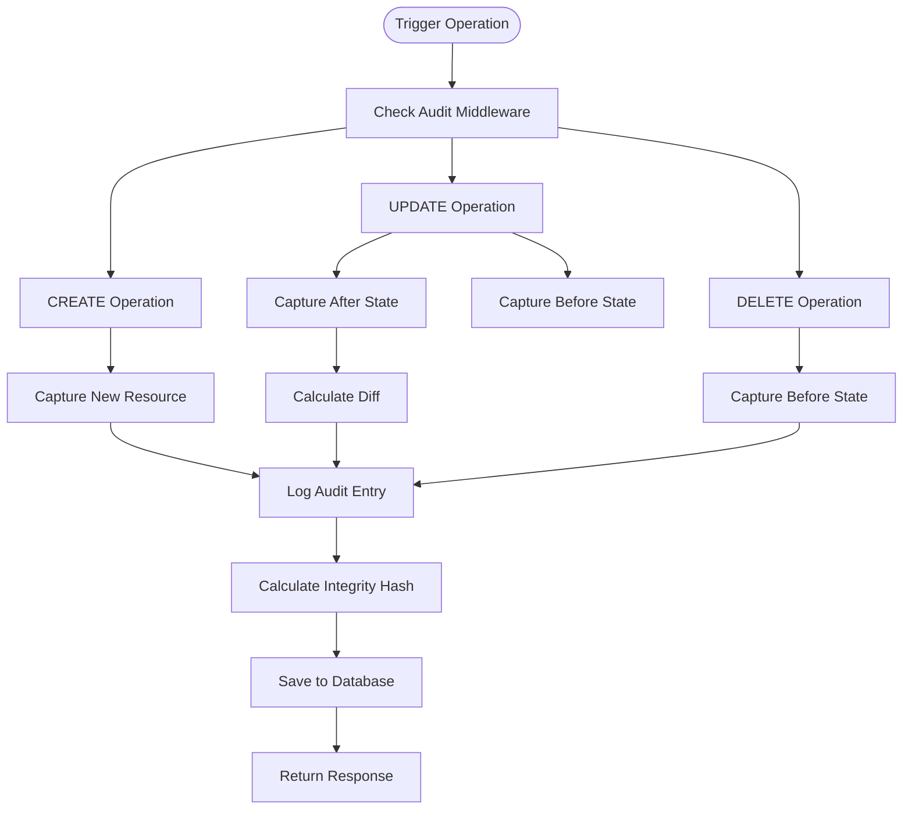
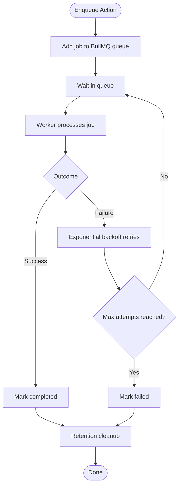

# API Reference

<cite>
**Referenced Files in This Document**
- [server.js](file://backend/src/server.js)
- [app.js](file://backend/src/app.js)
- [docs.routes.js](file://backend/src/routes/docs.routes.js)
- [auth.routes.js](file://backend/src/routes/auth.routes.js)
- [trigger.routes.js](file://backend/src/routes/trigger.routes.js)
- [queue.routes.js](file://backend/src/routes/queue.routes.js)
- [audit.routes.js](file://backend/src/routes/audit.routes.js)
- [auth.controller.js](file://backend/src/controllers/auth.controller.js)
- [trigger.controller.js](file://backend/src/controllers/trigger.controller.js)
- [queue.controller.js](file://backend/src/controllers/queue.controller.js)
- [audit.controller.js](file://backend/src/controllers/audit.controller.js)
- [auth.middleware.js](file://backend/src/middleware/auth.middleware.js)
- [validation.middleware.js](file://backend/src/middleware/validation.middleware.js)
- [rateLimit.middleware.js](file://backend/src/middleware/rateLimit.middleware.js)
- [audit.middleware.js](file://backend/src/middleware/audit.middleware.js)
- [trigger.model.js](file://backend/src/models/trigger.model.js)
- [audit.model.js](file://backend/src/models/audit.model.js)
- [user.model.js](file://backend/src/models/user.model.js)
- [queue.js](file://backend/src/worker/queue.js)
- [appError.js](file://backend/src/utils/appError.js)
- [asyncHandler.js](file://backend/src/utils/asyncHandler.js)
- [package.json](file://backend/package.json)
</cite>

## Update Summary
**Changes Made**
- Added comprehensive audit API documentation with new `/api/admin/audit/*` endpoints
- Enhanced trigger management API with PUT endpoint for updates and audit integration
- Documented advanced filtering capabilities with JSONPath validation
- Added audit middleware documentation for compliance logging
- Updated trigger model documentation with new batching and filtering features

## Table of Contents
1. [Introduction](#introduction)
2. [Project Structure](#project-structure)
3. [Core Components](#core-components)
4. [Architecture Overview](#architecture-overview)
5. [Detailed Component Analysis](#detailed-component-analysis)
6. [Dependency Analysis](#dependency-analysis)
7. [Performance Considerations](#performance-considerations)
8. [Troubleshooting Guide](#troubleshooting-guide)
9. [Conclusion](#conclusion)
10. [Appendices](#appendices)

## Introduction
This document provides comprehensive API documentation for EventHorizon's backend. It covers REST endpoints for trigger management, queue operations, health monitoring, user authentication, and comprehensive audit logging. It also documents OpenAPI/Swagger integration, interactive documentation, rate limiting, security, and client implementation guidelines.

## Project Structure
The backend is an Express application with modular routing, controllers, middleware, models, and workers. Routes are mounted under /api/* and expose:
- Health checks
- Authentication endpoints
- Trigger CRUD operations with audit logging
- Queue administration endpoints
- Comprehensive audit management endpoints
- OpenAPI/Swagger documentation

**Diagram sources**
- [server.js:1-88](file://backend/src/server.js#L1-L88)
- [app.js:1-55](file://backend/src/app.js#L1-L55)
- [docs.routes.js:1-164](file://backend/src/routes/docs.routes.js#L1-L164)
- [auth.routes.js:1-38](file://backend/src/routes/auth.routes.js#L1-L38)
- [trigger.routes.js:1-143](file://backend/src/routes/trigger.routes.js#L1-L143)
- [queue.routes.js:1-104](file://backend/src/routes/queue.routes.js#L1-L104)
- [audit.routes.js:1-337](file://backend/src/routes/audit.routes.js#L1-L337)
- [auth.controller.js:1-82](file://backend/src/controllers/auth.controller.js#L1-L82)
- [trigger.controller.js:1-107](file://backend/src/controllers/trigger.controller.js#L1-L107)
- [queue.controller.js:1-142](file://backend/src/controllers/queue.controller.js#L1-L142)
- [audit.controller.js:1-308](file://backend/src/controllers/audit.controller.js#L1-L308)
- [auth.middleware.js:1-22](file://backend/src/middleware/auth.middleware.js#L1-L22)
- [validation.middleware.js:1-76](file://backend/src/middleware/validation.middleware.js#L1-L76)
- [rateLimit.middleware.js:1-51](file://backend/src/middleware/rateLimit.middleware.js#L1-L51)
- [audit.middleware.js:1-295](file://backend/src/middleware/audit.middleware.js#L1-L295)
- [trigger.model.js:1-137](file://backend/src/models/trigger.model.js#L1-L137)
- [audit.model.js:1-181](file://backend/src/models/audit.model.js#L1-L181)
- [user.model.js:1-20](file://backend/src/models/user.model.js#L1-L20)
- [queue.js:1-164](file://backend/src/worker/queue.js#L1-L164)

**Section sources**
- [server.js:15-32](file://backend/src/server.js#L15-L32)
- [app.js:24-48](file://backend/src/app.js#L24-L48)
- [docs.routes.js:120-164](file://backend/src/routes/docs.routes.js#L120-L164)

## Core Components
- Authentication: JWT-based admin login and refresh token flow.
- Triggers: Manage Soroban event triggers with advanced filtering, batching, and audit logging.
- Queue: BullMQ-backed job queue for asynchronous actions with stats and maintenance.
- Audit: Comprehensive audit logging system with compliance tracking and integrity verification.
- Health: Lightweight GET /api/health for service readiness.
- OpenAPI/Swagger: Interactive docs and JSON spec served under /api/docs.

**Section sources**
- [auth.controller.js:15-82](file://backend/src/controllers/auth.controller.js#L15-L82)
- [trigger.controller.js:6-107](file://backend/src/controllers/trigger.controller.js#L6-L107)
- [queue.controller.js:7-142](file://backend/src/controllers/queue.controller.js#L7-L142)
- [audit.controller.js:6-308](file://backend/src/controllers/audit.controller.js#L6-L308)
- [docs.routes.js:120-164](file://backend/src/routes/docs.routes.js#L120-L164)

## Architecture Overview

**Diagram sources**
- [server.js:15-32](file://backend/src/server.js#L15-L32)
- [rateLimit.middleware.js:31-45](file://backend/src/middleware/rateLimit.middleware.js#L31-L45)
- [auth.middleware.js:5-22](file://backend/src/middleware/auth.middleware.js#L5-L22)
- [audit.middleware.js:114-151](file://backend/src/middleware/audit.middleware.js#L114-L151)
- [auth.controller.js:15-82](file://backend/src/controllers/auth.controller.js#L15-L82)
- [trigger.controller.js:6-28](file://backend/src/controllers/trigger.controller.js#L6-L28)
- [queue.controller.js:7-21](file://backend/src/controllers/queue.controller.js#L7-L21)
- [audit.controller.js:38-102](file://backend/src/controllers/audit.controller.js#L38-102)
- [queue.js:126-143](file://backend/src/worker/queue.js#L126-L143)

## Detailed Component Analysis

### Health Monitoring
- Endpoint: GET /api/health
- Description: Confirms API availability.
- Authentication: Not required.
- Rate limiting: Subject to global limiter.
- Responses:
  - 200 OK: Returns a simple object indicating the service is healthy.

**Section sources**
- [server.js:20-32](file://backend/src/server.js#L20-L32)
- [app.js:28-48](file://backend/src/app.js#L28-L48)

### Authentication
- Base path: /api/auth
- Endpoints:
  - POST /api/auth/login
    - Purpose: Admin login to obtain access and refresh tokens.
    - Authentication: None.
    - Request body:
      - email: string, required, email format
      - password: string, required, min length 8
    - Response:
      - 200 OK: { token, refreshToken, expiresIn }
      - 401 Unauthorized: Invalid credentials.
      - 500 Internal Server Error: Unexpected error.
    - Validation: Joi schema enforces email/password constraints.
    - Security:
      - Access token lifetime is short-lived.
      - Refresh token is used to obtain a new access token.
  - POST /api/auth/refresh
    - Purpose: Obtain a new access token using a valid refresh token.
    - Authentication: None.
    - Request body:
      - refreshToken: string, required
    - Response:
      - 200 OK: { token, expiresIn }
      - 400/401 Unauthorized: Missing or invalid refresh token.
      - 500 Internal Server Error: Unexpected error.

- JWT configuration:
  - Secrets are loaded from environment variables.
  - Access token expires in 1 hour; refresh token expires in 7 days.

**Section sources**
- [auth.routes.js:5-36](file://backend/src/routes/auth.routes.js#L5-L36)
- [auth.controller.js:15-82](file://backend/src/controllers/auth.controller.js#L15-L82)
- [validation.middleware.js:39-42](file://backend/src/middleware/validation.middleware.js#L39-L42)
- [auth.middleware.js:5-22](file://backend/src/middleware/auth.middleware.js#L5-L22)

### Trigger Management
- Base path: /api/triggers
- Endpoints:
  - POST /api/triggers
    - Purpose: Create a new trigger.
    - Authentication: Requires Bearer token.
    - Request body (validated):
      - contractId: string, required
      - eventName: string, required
      - actionType: enum [webhook, discord, email, telegram], default webhook
      - actionUrl: string, URI, required
      - isActive: boolean, default true
      - lastPolledLedger: number, default 0
      - filters: array of filter objects with path, operator, value
      - batchingConfig: object with enabled, windowMs, maxBatchSize, continueOnError
    - Response:
      - 201 Created: { success: true, data: Trigger }
      - 400 Bad Request: Validation errors with details.
      - 500 Internal Server Error: Unexpected error.
    - Notes:
      - Validation middleware applies Joi schema with JSONPath filtering.
      - Audit middleware automatically logs creation with integrity hash.
      - Async error handling wraps controller logic.
  - GET /api/triggers
    - Purpose: List all triggers.
    - Authentication: Requires Bearer token.
    - Response:
      - 200 OK: { success: true, data: [Trigger] }
      - 500 Internal Server Error: Unexpected error.
  - PUT /api/triggers/{id}
    - Purpose: Update an existing trigger configuration.
    - Authentication: Requires Bearer token.
    - Path parameters:
      - id: string, required (MongoDB ObjectId)
    - Request body:
      - Same as create trigger with selective updates
    - Response:
      - 200 OK: { success: true, data: Trigger }
      - 404 Not Found: Trigger not found.
      - 400 Bad Request: Validation errors.
      - 500 Internal Server Error: Unexpected error.
    - Notes:
      - Audit middleware captures before/after states and calculates diffs.
      - Supports partial updates with validation.
  - DELETE /api/triggers/{id}
    - Purpose: Delete a trigger by MongoDB ObjectId.
    - Authentication: Requires Bearer token.
    - Path parameters:
      - id: string, required (MongoDB ObjectId)
    - Response:
      - 204 No Content: Success.
      - 404 Not Found: Trigger not found.
      - 500 Internal Server Error: Unexpected error.
    - Notes:
      - Audit middleware logs deletion with before state capture.

- Data model (selected fields):
  - contractId: string, indexed
  - eventName: string
  - actionType: enum [webhook, discord, email, telegram]
  - actionUrl: string
  - isActive: boolean
  - lastPolledLedger: number
  - retryConfig: { maxRetries, retryIntervalMs }
  - batchingConfig: { enabled, windowMs, maxBatchSize, continueOnError }
  - filters: [{ path, operator, value }]
  - metadata: Map<String,String>
  - timestamps: createdAt, updatedAt
  - Virtuals: healthScore (0–100), healthStatus ("healthy","degraded","critical")

**Section sources**
- [trigger.routes.js:10-143](file://backend/src/routes/trigger.routes.js#L10-L143)
- [trigger.controller.js:6-107](file://backend/src/controllers/trigger.controller.js#L6-L107)
- [validation.middleware.js:29-43](file://backend/src/middleware/validation.middleware.js#L29-L43)
- [audit.middleware.js:114-267](file://backend/src/middleware/audit.middleware.js#L114-L267)
- [auth.middleware.js:5-22](file://backend/src/middleware/auth.middleware.js#L5-L22)
- [trigger.model.js:31-137](file://backend/src/models/trigger.model.js#L31-L137)

### Audit Management
- Base path: /api/admin/audit
- Notes:
  - All audit endpoints require admin access token via x-admin-token header or adminToken query parameter.
  - Admin access must be configured via ADMIN_ACCESS_TOKEN environment variable.
- Endpoints:
  - GET /api/admin/audit/logs
    - Purpose: Retrieve audit logs with advanced filtering and pagination.
    - Authentication: Requires admin access token.
    - Query parameters:
      - resourceId: string, filter by resource ID
      - operation: enum [CREATE, UPDATE, DELETE], filter by operation type
      - userId: string, filter by user ID
      - ipAddress: string, filter by IP address
      - startDate: datetime, filter logs after this date
      - endDate: datetime, filter logs before this date
      - limit: integer, default 50, maximum number of logs
      - skip: integer, default 0, number of logs to skip
    - Response:
      - 200 OK: { success: true, data: { logs, pagination } }
      - 403 Forbidden: Unauthorized admin access
      - 503 Service Unavailable: Admin access not configured
  - GET /api/admin/audit/stats
    - Purpose: Retrieve audit log statistics and analytics.
    - Authentication: Requires admin access token.
    - Query parameters:
      - startDate: datetime, start date for statistics
      - endDate: datetime, end date for statistics
    - Response:
      - 200 OK: { success: true, data: { totalLogs, operationStats, dailyStats, topIPs } }
      - 403 Forbidden: Unauthorized admin access
  - GET /api/admin/audit/resources/{resourceId}/trail
    - Purpose: Retrieve the complete audit trail for a specific resource.
    - Authentication: Requires admin access token.
    - Path parameters:
      - resourceId: string, required
    - Query parameters:
      - operations: comma-separated list of operations (CREATE,UPDATE,DELETE)
      - limit: integer, default 100, maximum number of logs
    - Response:
      - 200 OK: { success: true, data: { resourceId, logs, count } }
      - 403 Forbidden: Unauthorized admin access
      - 404 Not Found: Resource not found
  - GET /api/admin/audit/logs/{logId}/verify
    - Purpose: Verify the integrity hash of a specific audit log entry.
    - Authentication: Requires admin access token.
    - Path parameters:
      - logId: string, required
    - Response:
      - 200 OK: { success: true, data: { logId, integrityValid } }
      - 403 Forbidden: Unauthorized admin access
      - 404 Not Found: Audit log not found
  - GET /api/admin/audit/verify
    - Purpose: Perform bulk integrity verification on audit logs.
    - Authentication: Requires admin access token.
    - Query parameters:
      - startDate: datetime, start date for verification
      - endDate: datetime, end date for verification
      - sampleSize: integer, default 100, number of logs to sample
    - Response:
      - 200 OK: { success: true, data: { sampleSize, validCount, invalidCount, integrityRate, results } }
      - 403 Forbidden: Unauthorized admin access

- Audit model (selected fields):
  - operation: enum [CREATE, UPDATE, DELETE], indexed
  - resourceType: string, default 'Trigger', indexed
  - resourceId: ObjectId, indexed
  - userId: string, indexed
  - userAgent: string
  - ipAddress: string, indexed
  - forwardedFor: string
  - timestamp: Date, default now, indexed
  - changes: { before, after, diff[] }
  - metadata: { endpoint, method, userAgent, sessionId, requestId }
  - integrityHash: string, indexed

**Section sources**
- [audit.routes.js:5-337](file://backend/src/routes/audit.routes.js#L5-L337)
- [audit.controller.js:11-308](file://backend/src/controllers/audit.controller.js#L11-308)
- [audit.middleware.js:8-295](file://backend/src/middleware/audit.middleware.js#L8-L295)
- [audit.model.js:7-181](file://backend/src/models/audit.model.js#L7-L181)

### Queue Operations
- Base path: /api/queue
- Notes:
  - Queue endpoints are guarded by a runtime availability check. If Redis/BullMQ is not available, the system responds with 503 and directs to documentation.
- Endpoints:
  - GET /api/queue/stats
    - Purpose: Retrieve queue statistics (waiting, active, completed, failed, delayed).
    - Authentication: Requires Bearer token.
    - Response:
      - 200 OK: { success: true, data: { waiting, active, completed, failed, delayed, total } }
      - 503 Service Unavailable: Queue system not available.
  - GET /api/queue/jobs
    - Purpose: Fetch jobs filtered by status with pagination.
    - Authentication: Requires Bearer token.
    - Query parameters:
      - status: enum [waiting, active, completed, failed, delayed], default completed
      - limit: integer, default 50
    - Response:
      - 200 OK: { success: true, data: { status, count, jobs: [...] } }
      - 400 Bad Request: Invalid status.
      - 503 Service Unavailable: Queue system not available.
  - POST /api/queue/clean
    - Purpose: Clean old jobs (completed older than 24h, failed older than 7d).
    - Authentication: Requires Bearer token.
    - Response:
      - 200 OK: { success: true, message: "Queue cleaned successfully" }
      - 503 Service Unavailable: Queue system not available.
  - POST /api/queue/jobs/{jobId}/retry
    - Purpose: Retry a failed job by jobId.
    - Authentication: Requires Bearer token.
    - Path parameters:
      - jobId: string, required
    - Response:
      - 200 OK: { success: true, message: "Job retry initiated", data: { jobId } }
      - 404 Not Found: Job not found.
      - 503 Service Unavailable: Queue system not available.

**Section sources**
- [queue.routes.js:13-104](file://backend/src/routes/queue.routes.js#L13-L104)
- [queue.controller.js:7-142](file://backend/src/controllers/queue.controller.js#L7-L142)
- [queue.js:126-163](file://backend/src/worker/queue.js#L126-L163)

### OpenAPI and Interactive Documentation
- Base path: /api/docs
- Endpoints:
  - GET /api/docs/openapi.json
    - Returns the raw OpenAPI 3.0.3 specification as JSON.
  - GET /api/docs/
    - Serves Swagger UI with the OpenAPI spec.
    - Includes tag groups: Health, Triggers, Auth, Audit.
    - Server URL is derived from API_BASE_URL or defaults to http://localhost:PORT.

- Schema components included:
  - Trigger, TriggerInput, AuthCredentials, AuthTokenResponse, ErrorResponse, AuditLog, Pagination.

**Section sources**
- [docs.routes.js:120-164](file://backend/src/routes/docs.routes.js#L120-L164)

## Dependency Analysis

**Diagram sources**
- [package.json:10-26](file://backend/package.json#L10-L26)

**Section sources**
- [package.json:10-26](file://backend/package.json#L10-L26)

## Performance Considerations
- Global rate limiting:
  - Window and max requests configurable via environment variables.
  - Default: 120 requests per 15 minutes per IP.
- Auth-specific rate limiting:
  - Separate window and max for /api/auth endpoints.
  - Default: 20 attempts per 15 minutes.
- Audit logging overhead:
  - Audit middleware uses async logging to avoid blocking responses.
  - Integrity hash calculation occurs on save with SHA-256.
  - Indexes on audit logs optimize query performance.
- Queue tuning:
  - BullMQ default job attempts: 3 with exponential backoff.
  - Completed/failed jobs retention controlled by removeOnComplete/removeOnFail.
- Recommendations:
  - Use pagination (limit) for listing jobs and audit logs.
  - Batch clean operations sparingly.
  - Monitor healthScore and healthStatus on triggers to detect degradation early.
  - Configure ADMIN_ACCESS_TOKEN for audit system functionality.

## Troubleshooting Guide
- Authentication failures:
  - 401 Unauthorized: Missing or malformed Authorization header.
  - 401 Unauthorized: Invalid or expired token.
  - 400/401 Unauthorized: Missing or invalid refresh token during refresh.
- Validation errors:
  - 400 Bad Request: Validation failed with details array indicating field and message.
  - JSONPath validation: Filters must be properly formatted and within security limits.
- Queue unavailability:
  - 503 Service Unavailable: Queue system disabled (no Redis/BullMQ). Check Redis configuration and logs.
- Audit system issues:
  - 403 Forbidden: Missing or invalid admin access token.
  - 503 Service Unavailable: ADMIN_ACCESS_TOKEN not configured in environment.
  - Integrity verification failures indicate potential tampering or data corruption.
- App errors:
  - Controllers use async wrapper and AppError; non-4xx errors return generic 500 with error message.

**Section sources**
- [auth.middleware.js:5-22](file://backend/src/middleware/auth.middleware.js#L5-L22)
- [validation.middleware.js:51-68](file://backend/src/middleware/validation.middleware.js#L51-L68)
- [audit.controller.js:19-33](file://backend/src/controllers/audit.controller.js#L19-33)
- [audit.routes.js:82-83](file://backend/src/routes/audit.routes.js#L82-L83)
- [queue.routes.js:14-23](file://backend/src/routes/queue.routes.js#L14-L23)
- [appError.js:1-16](file://backend/src/utils/appError.js#L1-L16)

## Conclusion
EventHorizon exposes a comprehensive set of REST endpoints for managing triggers, authenticating administrators, inspecting queue state, health checks, and maintaining detailed audit logs. The new audit system provides complete compliance tracking with integrity verification capabilities. OpenAPI/Swagger provides interactive documentation and JSON spec. Rate limiting and JWT-based auth protect endpoints, while BullMQ enables robust asynchronous processing. Clients should respect rate limits, handle 503 for queue/unavailable audit systems, use the provided schemas for request payloads, and implement proper admin access token management for audit functionality.

## Appendices

### Endpoint Catalog
- Health
  - GET /api/health
- Authentication
  - POST /api/auth/login
  - POST /api/auth/refresh
- Triggers
  - POST /api/triggers
  - GET /api/triggers
  - PUT /api/triggers/{id}
  - DELETE /api/triggers/{id}
- Queue
  - GET /api/queue/stats
  - GET /api/queue/jobs
  - POST /api/queue/clean
  - POST /api/queue/jobs/{jobId}/retry
- Audit
  - GET /api/admin/audit/logs
  - GET /api/admin/audit/stats
  - GET /api/admin/audit/resources/{resourceId}/trail
  - GET /api/admin/audit/logs/{logId}/verify
  - GET /api/admin/audit/verify
- Documentation
  - GET /api/docs/openapi.json
  - GET /api/docs/

**Section sources**
- [server.js:20-32](file://backend/src/server.js#L20-L32)
- [auth.routes.js:26-36](file://backend/src/routes/auth.routes.js#L26-L36)
- [trigger.routes.js:58-94](file://backend/src/routes/trigger.routes.js#L58-L94)
- [queue.routes.js:25-101](file://backend/src/routes/queue.routes.js#L25-L101)
- [audit.routes.js:85-335](file://backend/src/routes/audit.routes.js#L85-L335)
- [docs.routes.js:155-162](file://backend/src/routes/docs.routes.js#L155-L162)

### Request/Response Schemas

- TriggerInput
  - contractId: string
  - eventName: string
  - actionType: enum ["webhook","discord","email","telegram"], default "webhook"
  - actionUrl: string (URI)
  - isActive: boolean, default true
  - lastPolledLedger: number, default 0
  - filters: array of filter objects
  - batchingConfig: object with enabled, windowMs, maxBatchSize, continueOnError

- Filter Object
  - path: string (JSONPath expression)
  - operator: enum ["eq","neq","gt","gte","lt","lte","contains","in","exists"]
  - value: mixed type

- Trigger (as stored)
  - Fields: contractId, eventName, actionType, actionUrl, isActive, lastPolledLedger, retryConfig, batchingConfig, filters, metadata, timestamps, healthScore (virtual), healthStatus (virtual)

- AuditLog (as stored)
  - Fields: operation, resourceType, resourceId, userId, userAgent, ipAddress, forwardedFor, timestamp, changes, metadata, integrityHash

- AuthCredentials
  - email: string (email)
  - password: string (min length 8)

- AuthTokenResponse
  - token: string (access)
  - refreshToken: string
  - expiresIn: integer (seconds)

- ErrorResponse
  - error: string

- Pagination
  - total: integer
  - limit: integer
  - skip: integer
  - hasMore: boolean

**Section sources**
- [docs.routes.js:11-118](file://backend/src/routes/docs.routes.js#L11-L118)
- [trigger.model.js:31-137](file://backend/src/models/trigger.model.js#L31-L137)
- [audit.model.js:7-181](file://backend/src/models/audit.model.js#L7-L181)
- [validation.middleware.js:29-43](file://backend/src/middleware/validation.middleware.js#L29-L43)

### Authentication Flow

**Diagram sources**
- [auth.routes.js:26](file://backend/src/routes/auth.routes.js#L26)
- [auth.controller.js:15-52](file://backend/src/controllers/auth.controller.js#L15-L52)
- [user.model.js:3-18](file://backend/src/models/user.model.js#L3-L18)

### Audit Logging Flow

**Diagram sources**
- [audit.middleware.js:114-267](file://backend/src/middleware/audit.middleware.js#L114-L267)
- [audit.model.js:102-124](file://backend/src/models/audit.model.js#L102-L124)

### Rate Limiting Behavior
- Global limiter applies to most routes.
- Auth limiter applies to /api/auth endpoints.
- On limit hit:
  - 429 Too Many Requests with success=false, message, retryAfterSeconds.

**Section sources**
- [rateLimit.middleware.js:31-45](file://backend/src/middleware/rateLimit.middleware.js#L31-L45)

### Queue Data Flow

**Diagram sources**
- [queue.js:91-121](file://backend/src/worker/queue.js#L91-L121)
- [queue.js:126-163](file://backend/src/worker/queue.js#L126-L163)

### Client Implementation Guidelines
- Authentication:
  - Send Authorization: Bearer <token> for protected endpoints.
  - Use /api/auth/refresh to renew access tokens.
- Validation:
  - Match schemas precisely (Joi constraints).
  - JSONPath filters must be properly formatted and within security limits.
- Rate limits:
  - Implement client-side backoff using retryAfterSeconds.
- Queue operations:
  - Expect 503 when Redis is not configured.
  - Use limit parameter to constrain job listings.
- Audit system:
  - Configure ADMIN_ACCESS_TOKEN environment variable for audit endpoints.
  - Use x-admin-token header or adminToken query parameter for admin access.
  - Implement integrity verification for critical operations.
- Error handling:
  - Parse success/error fields and details array for validation errors.
  - Handle 403 Forbidden for unauthorized audit access.
  - Handle 503 Service Unavailable for unconfigured audit system.