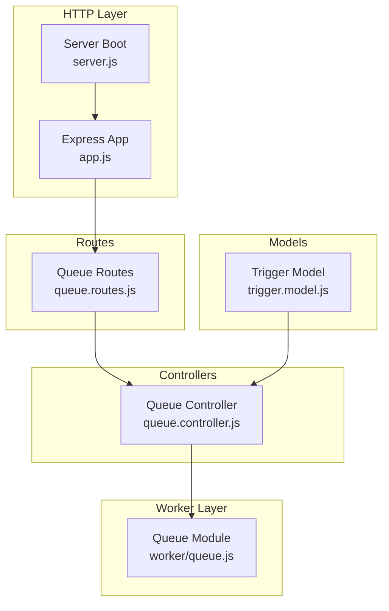
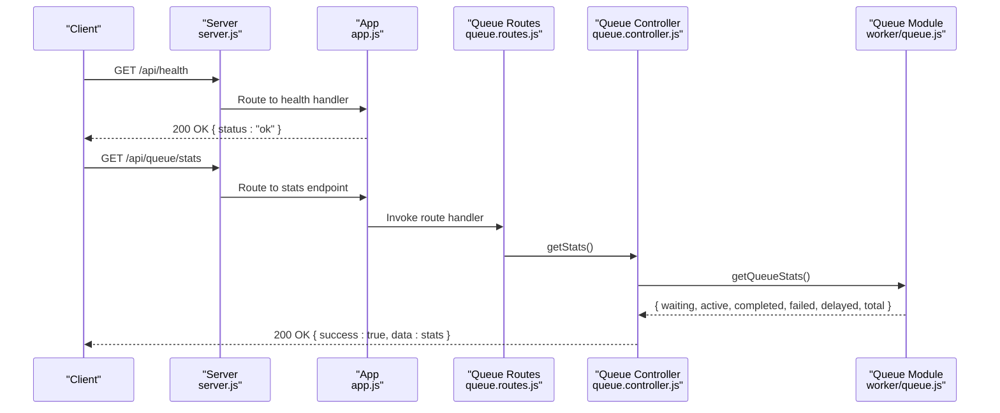
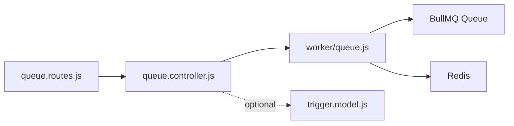

# Health Monitoring API

<cite>
**Referenced Files in This Document**
- [app.js](file://backend/src/app.js)
- [server.js](file://backend/src/server.js)
- [queue.routes.js](file://backend/src/routes/queue.routes.js)
- [queue.controller.js](file://backend/src/controllers/queue.controller.js)
- [queue.js](file://backend/src/worker/queue.js)
- [trigger.model.js](file://backend/src/models/trigger.model.js)
- [queue-usage.js](file://backend/examples/queue-usage.js)
- [queue.test.js](file://backend/__tests__/queue.test.js)
</cite>

## Table of Contents
1. [Introduction](#introduction)
2. [Project Structure](#project-structure)
3. [Core Components](#core-components)
4. [Architecture Overview](#architecture-overview)
5. [Detailed Component Analysis](#detailed-component-analysis)
6. [Dependency Analysis](#dependency-analysis)
7. [Performance Considerations](#performance-considerations)
8. [Troubleshooting Guide](#troubleshooting-guide)
9. [Conclusion](#conclusion)
10. [Appendices](#appendices)

## Introduction
This document provides comprehensive API documentation for health and statistics endpoints in the EventHorizon system. It covers:
- System health checks
- Queue performance metrics and background worker status
- Trigger activation and error rate monitoring
- Operational dashboards and alerting thresholds
- Request/response schemas and integration examples

The system exposes a health endpoint and a queue statistics endpoint. Triggers maintain internal health metrics derived from execution counts and success/failure tracking.

## Project Structure
The health and statistics capabilities are implemented across Express routes, controllers, worker queue utilities, and data models.

**Diagram sources**
- [app.js:25-48](file://backend/src/app.js#L25-L48)
- [server.js:15-32](file://backend/src/server.js#L15-L32)
- [queue.routes.js:1-104](file://backend/src/routes/queue.routes.js#L1-L104)
- [queue.controller.js:1-142](file://backend/src/controllers/queue.controller.js#L1-L142)
- [queue.js:1-164](file://backend/src/worker/queue.js#L1-L164)
- [trigger.model.js:1-80](file://backend/src/models/trigger.model.js#L1-L80)

**Section sources**
- [app.js:25-48](file://backend/src/app.js#L25-L48)
- [server.js:15-32](file://backend/src/server.js#L15-L32)
- [queue.routes.js:1-104](file://backend/src/routes/queue.routes.js#L1-L104)
- [queue.controller.js:1-142](file://backend/src/controllers/queue.controller.js#L1-L142)
- [queue.js:1-164](file://backend/src/worker/queue.js#L1-L164)
- [trigger.model.js:1-80](file://backend/src/models/trigger.model.js#L1-L80)

## Core Components
- Health endpoint: GET /api/health returns a simple status indicator.
- Queue statistics endpoint: GET /api/queue/stats returns current queue backlog and completion metrics.
- Trigger model: Provides computed health score and status derived from execution counters.

Key responsibilities:
- Health endpoint: Validates service availability.
- Queue statistics: Aggregates counts across queue states (waiting, active, completed, failed, delayed).
- Trigger health: Virtual fields compute health score and status from execution tallies.

**Section sources**
- [app.js:29-47](file://backend/src/app.js#L29-L47)
- [server.js:20-32](file://backend/src/server.js#L20-L32)
- [queue.controller.js:7-21](file://backend/src/controllers/queue.controller.js#L7-L21)
- [queue.js:126-143](file://backend/src/worker/queue.js#L126-L143)
- [trigger.model.js:64-77](file://backend/src/models/trigger.model.js#L64-L77)

## Architecture Overview
The health and statistics architecture integrates HTTP routing, controller logic, queue abstraction, and data modeling.

**Diagram sources**
- [server.js:20-32](file://backend/src/server.js#L20-L32)
- [app.js:25-48](file://backend/src/app.js#L25-L48)
- [queue.routes.js:25-37](file://backend/src/routes/queue.routes.js#L25-L37)
- [queue.controller.js:7-21](file://backend/src/controllers/queue.controller.js#L7-L21)
- [queue.js:126-143](file://backend/src/worker/queue.js#L126-L143)

## Detailed Component Analysis

### Health Endpoint
- Path: GET /api/health
- Purpose: Confirm API process availability and readiness.
- Response: JSON object with a status field indicating system health.

Response schema:
- status: string (example value: ok)

Operational notes:
- Returns 200 OK when the server is running.
- No request body is required.

**Section sources**
- [app.js:29-47](file://backend/src/app.js#L29-L47)
- [server.js:20-32](file://backend/src/server.js#L20-L32)

### Queue Statistics Endpoint
- Path: GET /api/queue/stats
- Purpose: Retrieve current queue performance metrics.
- Authentication/Authorization: None specified in route.
- Response: JSON object containing aggregated queue counts and totals.

Response schema:
- success: boolean
- data: object
  - waiting: number
  - active: number
  - completed: number
  - failed: number
  - delayed: number
  - total: number

Behavior:
- Aggregates counts across queue states concurrently.
- Returns 503 Service Unavailable if queue system is not available (Redis not configured).

Integration example:
- See usage pattern in examples and tests.

**Section sources**
- [queue.routes.js:25-37](file://backend/src/routes/queue.routes.js#L25-L37)
- [queue.controller.js:7-21](file://backend/src/controllers/queue.controller.js#L7-L21)
- [queue.js:126-143](file://backend/src/worker/queue.js#L126-L143)
- [queue-usage.js:87-102](file://backend/examples/queue-usage.js#L87-L102)
- [queue.test.js:57-59](file://backend/__tests__/queue.test.js#L57-L59)

### Queue Jobs Endpoint (Supporting Operations)
- Path: GET /api/queue/jobs
- Query parameters:
  - status: string enum [waiting, active, completed, failed, delayed]
  - limit: integer default 50
- Purpose: Retrieve recent jobs filtered by status.
- Response: JSON object with status, count, and jobs array.

Job item schema:
- id: string
- name: string
- data: object
- progress: number | string
- attemptsMade: number
- timestamp: number
- processedOn: number
- finishedOn: number
- failedReason: string

Behavior:
- Returns 400 for invalid status.
- Returns 503 if queue system is unavailable.

**Section sources**
- [queue.routes.js:39-64](file://backend/src/routes/queue.routes.js#L39-L64)
- [queue.controller.js:26-81](file://backend/src/controllers/queue.controller.js#L26-L81)

### Queue Management Endpoints
- Path: POST /api/queue/clean
  - Purpose: Clean old completed and failed jobs.
  - Response: success boolean and message.
- Path: POST /api/queue/jobs/{jobId}/retry
  - Purpose: Retry a failed job by ID.
  - Response: success boolean and data with jobId.
  - Returns 404 if job not found.

Behavior:
- Returns 503 if queue system is unavailable.

**Section sources**
- [queue.routes.js:66-101](file://backend/src/routes/queue.routes.js#L66-L101)
- [queue.controller.js:83-134](file://backend/src/controllers/queue.controller.js#L83-L134)

### Trigger Health Metrics
The Trigger model computes health indicators from execution tallies:
- healthScore: virtual number (0–100) based on total vs failed executions.
- healthStatus: virtual string enum ['healthy', 'degraded', 'critical'].

These metrics support operational dashboards and alerting.

**Section sources**
- [trigger.model.js:30-57](file://backend/src/models/trigger.model.js#L30-L57)
- [trigger.model.js:64-77](file://backend/src/models/trigger.model.js#L64-L77)

### Background Worker Status
The server initializes a BullMQ worker and an event poller during startup. If Redis is unavailable, the worker initialization logs a warning and disables queue features.

Key behaviors:
- Worker creation guarded by try/catch.
- Graceful shutdown on SIGTERM closes worker and database connections.

**Section sources**
- [server.js:44-58](file://backend/src/server.js#L44-L58)
- [server.js:69-78](file://backend/src/server.js#L69-L78)

## Dependency Analysis
The queue statistics pipeline depends on BullMQ via a Redis-backed queue abstraction.

**Diagram sources**
- [queue.routes.js:1-104](file://backend/src/routes/queue.routes.js#L1-L104)
- [queue.controller.js:1-142](file://backend/src/controllers/queue.controller.js#L1-L142)
- [queue.js:1-164](file://backend/src/worker/queue.js#L1-L164)
- [trigger.model.js:1-80](file://backend/src/models/trigger.model.js#L1-L80)

**Section sources**
- [queue.routes.js:1-104](file://backend/src/routes/queue.routes.js#L1-L104)
- [queue.controller.js:1-142](file://backend/src/controllers/queue.controller.js#L1-L142)
- [queue.js:1-164](file://backend/src/worker/queue.js#L1-L164)
- [trigger.model.js:1-80](file://backend/src/models/trigger.model.js#L1-L80)

## Performance Considerations
- Queue stats aggregation uses concurrent count queries to minimize latency.
- Job retrieval supports pagination via limit parameter.
- Queue cleanup retains completed/failed jobs for configurable retention windows.
- Trigger health computations are virtual fields computed on demand.

[No sources needed since this section provides general guidance]

## Troubleshooting Guide
Common scenarios and resolutions:

- Queue system unavailable (503):
  - Cause: Redis not configured or reachable.
  - Resolution: Install and start Redis; verify environment variables; confirm queue routes are loaded.

- Empty or stale statistics:
  - Cause: No jobs processed yet or queue cleaned.
  - Resolution: Enqueue actions; monitor via /api/queue/stats; optionally clean older jobs.

- Job stuck or failing:
  - Use GET /api/queue/jobs with status=failed and limit to inspect recent failures.
  - Use POST /api/queue/jobs/{jobId}/retry to reattempt failed jobs.

- Health check failing:
  - Verify server startup logs; ensure MongoDB connection succeeds; confirm worker initialization.

**Section sources**
- [queue.routes.js:13-23](file://backend/src/routes/queue.routes.js#L13-L23)
- [queue.controller.js:26-81](file://backend/src/controllers/queue.controller.js#L26-L81)
- [queue.controller.js:105-134](file://backend/src/controllers/queue.controller.js#L105-L134)
- [server.js:44-58](file://backend/src/server.js#L44-L58)

## Conclusion
The EventHorizon system provides essential health and statistics capabilities:
- A simple health endpoint for readiness checks.
- Comprehensive queue statistics for monitoring backlog and throughput.
- Trigger-level health metrics for operational visibility.
- Robust queue management endpoints for diagnostics and remediation.

These components enable effective monitoring, alerting, and troubleshooting of trigger activation rates, error rates, queue backlog, and system resource utilization.

[No sources needed since this section summarizes without analyzing specific files]

## Appendices

### API Reference Summary

- GET /api/health
  - Description: Confirm API process availability.
  - Response: { status: string }

- GET /api/queue/stats
  - Description: Retrieve queue performance metrics.
  - Response: { success: boolean, data: { waiting: number, active: number, completed: number, failed: number, delayed: number, total: number } }

- GET /api/queue/jobs
  - Query: status=[waiting|active|completed|failed|delayed], limit=integer
  - Response: { success: boolean, data: { status: string, count: number, jobs: [...] } }

- POST /api/queue/clean
  - Description: Clean old completed and failed jobs.
  - Response: { success: boolean, message: string }

- POST /api/queue/jobs/{jobId}/retry
  - Description: Retry a failed job.
  - Response: { success: boolean, message: string, data: { jobId: string } }

- Trigger Health Fields
  - healthScore: number (0–100)
  - healthStatus: string ['healthy'|'degraded'|'critical']

**Section sources**
- [app.js:29-47](file://backend/src/app.js#L29-L47)
- [queue.routes.js:25-101](file://backend/src/routes/queue.routes.js#L25-L101)
- [queue.controller.js:7-134](file://backend/src/controllers/queue.controller.js#L7-L134)
- [trigger.model.js:64-77](file://backend/src/models/trigger.model.js#L64-L77)

### Example Workflows

- Monitoring queue backlog:
  - Poll GET /api/queue/stats periodically.
  - Alert thresholds: high waiting or failed counts, rising delayed proportion.

- Investigating trigger failures:
  - Use GET /api/queue/jobs with status=failed.
  - Inspect failedReason and retry via POST /api/queue/jobs/{jobId}/retry.

- Verifying system health:
  - Call GET /api/health on startup and after maintenance.
  - Confirm worker initialization logs indicate queue system enabled.

**Section sources**
- [queue-usage.js:87-102](file://backend/examples/queue-usage.js#L87-L102)
- [queue-usage.js:104-140](file://backend/examples/queue-usage.js#L104-L140)
- [queue.test.js:57-59](file://backend/__tests__/queue.test.js#L57-L59)