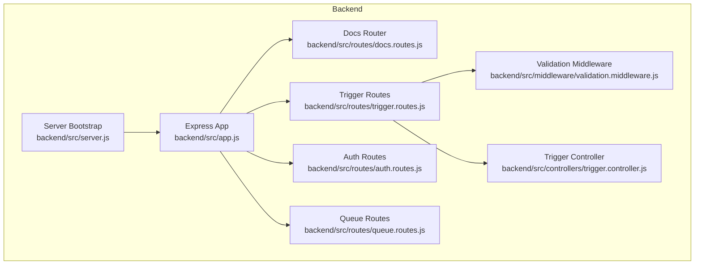
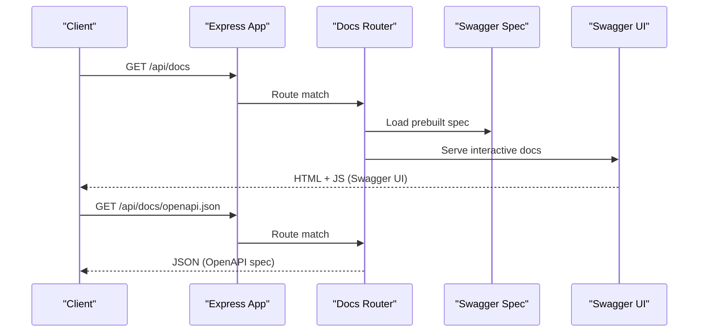
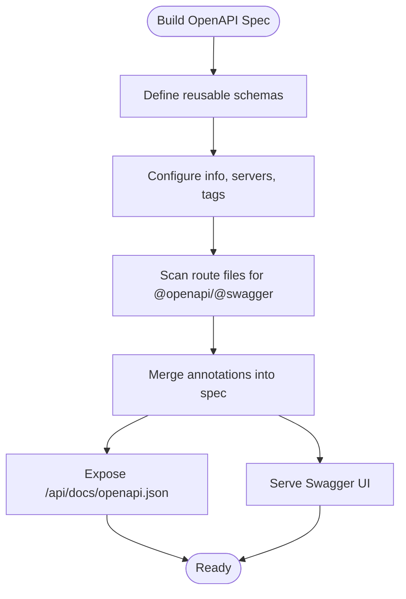
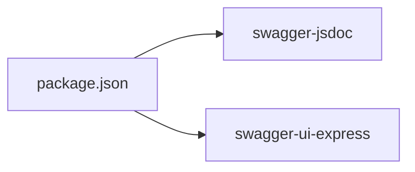

# OpenAPI Integration

<cite>
**Referenced Files in This Document**
- [README.md](file://README.md)
- [backend/package.json](file://backend/package.json)
- [backend/src/app.js](file://backend/src/app.js)
- [backend/src/server.js](file://backend/src/server.js)
- [backend/src/routes/docs.routes.js](file://backend/src/routes/docs.routes.js)
- [backend/src/routes/trigger.routes.js](file://backend/src/routes/trigger.routes.js)
- [backend/src/routes/auth.routes.js](file://backend/src/routes/auth.routes.js)
- [backend/src/routes/queue.routes.js](file://backend/src/routes/queue.routes.js)
- [backend/src/middleware/validation.middleware.js](file://backend/src/middleware/validation.middleware.js)
- [backend/src/controllers/trigger.controller.js](file://backend/src/controllers/trigger.controller.js)
</cite>

## Table of Contents
1. [Introduction](#introduction)
2. [Project Structure](#project-structure)
3. [Core Components](#core-components)
4. [Architecture Overview](#architecture-overview)
5. [Detailed Component Analysis](#detailed-component-analysis)
6. [Dependency Analysis](#dependency-analysis)
7. [Performance Considerations](#performance-considerations)
8. [Troubleshooting Guide](#troubleshooting-guide)
9. [Conclusion](#conclusion)

## Introduction
This document explains the OpenAPI integration for the backend service, including Swagger UI interactive documentation, OpenAPI JSON generation, and API documentation endpoints. It covers how the OpenAPI schema is automatically generated from route annotations, how to use the interactive documentation, how to download the OpenAPI specification, and how to integrate with external documentation tools. It also addresses schema validation, documentation updates, and maintaining API contract consistency.

## Project Structure
The OpenAPI integration is centered around a dedicated documentation route module that:
- Defines reusable OpenAPI components (schemas)
- Generates the OpenAPI specification from annotated route files
- Serves Swagger UI for interactive documentation
- Exposes the raw OpenAPI JSON for external tooling

Key locations:
- Documentation router: [backend/src/routes/docs.routes.js](file://backend/src/routes/docs.routes.js)
- Route annotations for endpoints: [backend/src/routes/trigger.routes.js](file://backend/src/routes/trigger.routes.js), [backend/src/routes/auth.routes.js](file://backend/src/routes/auth.routes.js), [backend/src/routes/queue.routes.js](file://backend/src/routes/queue.routes.js)
- Validation middleware and schemas: [backend/src/middleware/validation.middleware.js](file://backend/src/middleware/validation.middleware.js)
- Controllers implementing endpoints: [backend/src/controllers/trigger.controller.js](file://backend/src/controllers/trigger.controller.js)
- Application bootstrap and route wiring: [backend/src/app.js](file://backend/src/app.js), [backend/src/server.js](file://backend/src/server.js)
- Dependencies for OpenAPI/Swagger: [backend/package.json](file://backend/package.json)

**Diagram sources**
- [backend/src/app.js:16-28](file://backend/src/app.js#L16-L28)
- [backend/src/server.js:15-19](file://backend/src/server.js#L15-L19)
- [backend/src/routes/docs.routes.js:1-164](file://backend/src/routes/docs.routes.js#L1-L164)
- [backend/src/routes/trigger.routes.js:1-92](file://backend/src/routes/trigger.routes.js#L1-L92)
- [backend/src/routes/auth.routes.js:1-38](file://backend/src/routes/auth.routes.js#L1-L38)
- [backend/src/routes/queue.routes.js:1-104](file://backend/src/routes/queue.routes.js#L1-L104)
- [backend/src/middleware/validation.middleware.js:1-49](file://backend/src/middleware/validation.middleware.js#L1-L49)
- [backend/src/controllers/trigger.controller.js:1-72](file://backend/src/controllers/trigger.controller.js#L1-L72)

**Section sources**
- [backend/src/app.js:16-28](file://backend/src/app.js#L16-L28)
- [backend/src/server.js:15-19](file://backend/src/server.js#L15-L19)
- [backend/src/routes/docs.routes.js:1-164](file://backend/src/routes/docs.routes.js#L1-L164)

## Core Components
- OpenAPI specification generator: Uses swagger-jsdoc to scan route files and build a spec from inline @openapi/@swagger annotations.
- Swagger UI integration: Uses swagger-ui-express to serve an interactive documentation site and configure UI options.
- Documentation endpoints:
  - GET /api/docs: serves Swagger UI
  - GET /api/docs/openapi.json: serves the generated OpenAPI JSON

These components are wired in the Express app and exposed under the /api/docs base path.

**Section sources**
- [backend/src/routes/docs.routes.js:120-164](file://backend/src/routes/docs.routes.js#L120-L164)
- [backend/src/app.js:24](file://backend/src/app.js#L24)
- [backend/src/server.js:16](file://backend/src/server.js#L16)

## Architecture Overview
The OpenAPI integration follows a modular pattern:
- The docs router defines reusable schemas and builds the OpenAPI spec by scanning route files.
- The spec is passed to Swagger UI for interactive rendering.
- The same spec is served as JSON for external consumption.

**Diagram sources**
- [backend/src/routes/docs.routes.js:155-162](file://backend/src/routes/docs.routes.js#L155-L162)
- [backend/src/app.js:24](file://backend/src/app.js#L24)

## Detailed Component Analysis

### OpenAPI Specification Generation
The docs router builds the OpenAPI specification by:
- Defining reusable schemas (components) for shared types
- Configuring top-level metadata (title, version, description)
- Declaring servers and tags
- Scanning route files for annotations to include in the spec

Key behaviors:
- The generator scans the server bootstrap file and all route files in the same directory as the docs router.
- The resulting spec is served as JSON and rendered by Swagger UI.

**Diagram sources**
- [backend/src/routes/docs.routes.js:120-153](file://backend/src/routes/docs.routes.js#L120-L153)

**Section sources**
- [backend/src/routes/docs.routes.js:8-118](file://backend/src/routes/docs.routes.js#L8-L118)
- [backend/src/routes/docs.routes.js:120-153](file://backend/src/routes/docs.routes.js#L120-L153)

### Swagger UI Integration
Swagger UI is integrated via swagger-ui-express:
- The UI is served at the root of /api/docs
- Explorer mode is enabled for easier navigation
- The site title is customized for branding

Usage:
- Visit /api/docs in a browser to view interactive documentation
- Use the explorer to navigate endpoints and test requests

**Section sources**
- [backend/src/routes/docs.routes.js:159-162](file://backend/src/routes/docs.routes.js#L159-L162)

### OpenAPI JSON Endpoint
The /api/docs/openapi.json endpoint returns the generated OpenAPI specification as JSON. This enables:
- Integration with external documentation tools
- CI/CD validation of API contracts
- Offline documentation generation

Access:
- GET /api/docs/openapi.json

**Section sources**
- [backend/src/routes/docs.routes.js:155-157](file://backend/src/routes/docs.routes.js#L155-L157)

### Automatic Schema Generation from Route Annotations
Endpoints are documented directly in route files using @openapi/@swagger blocks. Examples:
- Trigger endpoints: creation, listing, and deletion
- Auth endpoints: login and token refresh
- Queue endpoints: stats, jobs, clean, and retry

The generator reads these annotations and includes them in the final spec.

Examples of annotated endpoints:
- Trigger routes: [backend/src/routes/trigger.routes.js:9-91](file://backend/src/routes/trigger.routes.js#L9-L91)
- Auth routes: [backend/src/routes/auth.routes.js:5-36](file://backend/src/routes/auth.routes.js#L5-L36)
- Queue routes: [backend/src/routes/queue.routes.js:25-101](file://backend/src/routes/queue.routes.js#L25-L101)

**Section sources**
- [backend/src/routes/trigger.routes.js:9-91](file://backend/src/routes/trigger.routes.js#L9-L91)
- [backend/src/routes/auth.routes.js:5-36](file://backend/src/routes/auth.routes.js#L5-L36)
- [backend/src/routes/queue.routes.js:25-101](file://backend/src/routes/queue.routes.js#L25-L101)

### Interactive Documentation Features
Swagger UI provides:
- Endpoint browsing and filtering
- Request/response examples
- Schema inspection
- Embedded testing interface (when applicable)

To use:
- Navigate to /api/docs
- Explore tags and endpoints
- Expand operations to view details and examples

**Section sources**
- [backend/src/routes/docs.routes.js:159-162](file://backend/src/routes/docs.routes.js#L159-L162)

### API Testing Capabilities
While Swagger UI supports sending requests, the primary validation path leverages:
- Inline validation middleware for request bodies
- Joi schemas for strict validation
- Consistent error responses for invalid payloads

Validation flow:
- Requests pass through validation middleware before reaching controllers
- On validation failure, a structured error response is returned

**Section sources**
- [backend/src/middleware/validation.middleware.js:24-41](file://backend/src/middleware/validation.middleware.js#L24-L41)
- [backend/src/routes/trigger.routes.js:57-61](file://backend/src/routes/trigger.routes.js#L57-L61)

### Using the Swagger UI
- Start the backend server
- Open /api/docs in a browser
- Browse endpoints, expand operations, and inspect schemas
- Use the embedded explorer to filter by tags (Health, Triggers, Auth, Queue)

**Section sources**
- [README.md:44-46](file://README.md#L44-L46)
- [backend/src/routes/docs.routes.js:159-162](file://backend/src/routes/docs.routes.js#L159-L162)

### Downloading OpenAPI Specifications
- Access the JSON spec at /api/docs/openapi.json
- Save locally for documentation tools or CI validation
- Use the spec to generate client SDKs or mock servers

**Section sources**
- [backend/src/routes/docs.routes.js:155-157](file://backend/src/routes/docs.routes.js#L155-L157)

### Integrating with API Documentation Tools
Common integrations:
- Static site generators: import the OpenAPI JSON to generate static docs
- CI/CD: validate pull requests against the contract
- Mock servers: generate server stubs from the spec
- Client SDKs: auto-generate typed clients

Where to get the spec:
- GET /api/docs/openapi.json

**Section sources**
- [backend/src/routes/docs.routes.js:155-157](file://backend/src/routes/docs.routes.js#L155-L157)

### Schema Validation and Contract Consistency
- Reusable schemas are defined centrally and referenced across endpoints
- Validation middleware ensures payloads conform to Joi schemas
- Consistent error responses improve contract clarity

Best practices:
- Keep shared schemas in the docs router components
- Annotate all endpoints with @openapi/@swagger
- Update schemas and annotations when changing contracts
- Run validation in tests to maintain consistency

**Section sources**
- [backend/src/routes/docs.routes.js:8-118](file://backend/src/routes/docs.routes.js#L8-L118)
- [backend/src/middleware/validation.middleware.js:3-16](file://backend/src/middleware/validation.middleware.js#L3-L16)
- [backend/src/controllers/trigger.controller.js:6-27](file://backend/src/controllers/trigger.controller.js#L6-L27)

## Dependency Analysis
The OpenAPI integration relies on:
- swagger-jsdoc: parses annotations and generates the OpenAPI spec
- swagger-ui-express: serves Swagger UI and exposes the JSON spec
- Express routing: wires the docs router under /api/docs

**Diagram sources**
- [backend/package.json:21-22](file://backend/package.json#L21-L22)

**Section sources**
- [backend/package.json:21-22](file://backend/package.json#L21-L22)

## Performance Considerations
- The OpenAPI spec is built at startup and reused for serving both the UI and JSON. No runtime parsing overhead.
- Keep annotation scopes minimal to reduce scanning time during spec generation.
- Avoid overly complex nested schemas to keep the JSON compact and fast to transfer.

## Troubleshooting Guide
Common issues and resolutions:
- Swagger UI not loading
  - Ensure the docs router is mounted at /api/docs
  - Verify the server is running and reachable
  - Check browser console for network errors
- Missing endpoints in documentation
  - Confirm @openapi/@swagger annotations exist in route files
  - Ensure route files are included in the swagger-jsdoc apis list
- Validation errors on requests
  - Review Joi schemas and adjust payloads accordingly
  - Inspect the error response format for field-level details

**Section sources**
- [backend/src/routes/docs.routes.js:149-153](file://backend/src/routes/docs.routes.js#L149-L153)
- [backend/src/middleware/validation.middleware.js:24-41](file://backend/src/middleware/validation.middleware.js#L24-L41)

## Conclusion
The backend integrates OpenAPI and Swagger UI to deliver interactive, machine-readable API documentation. The spec is generated from inline annotations, served via a dedicated router, and exposed as JSON for external tooling. Combined with validation middleware and centralized schemas, this approach maintains a clear API contract and supports robust documentation workflows.