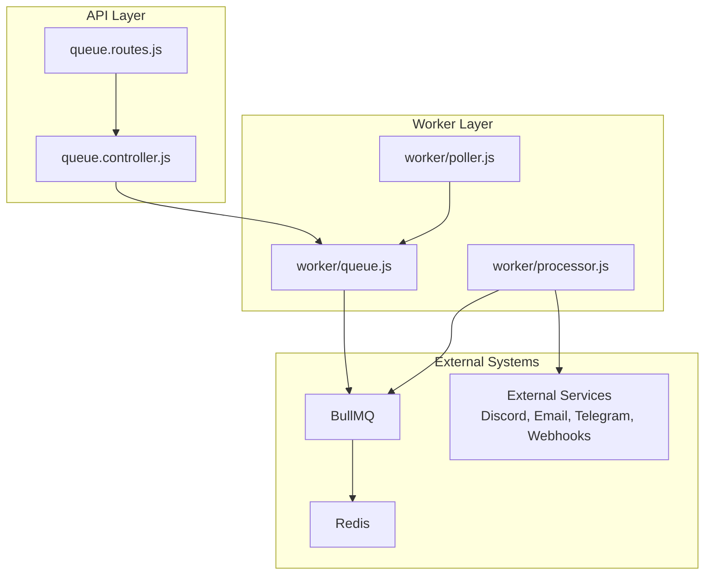
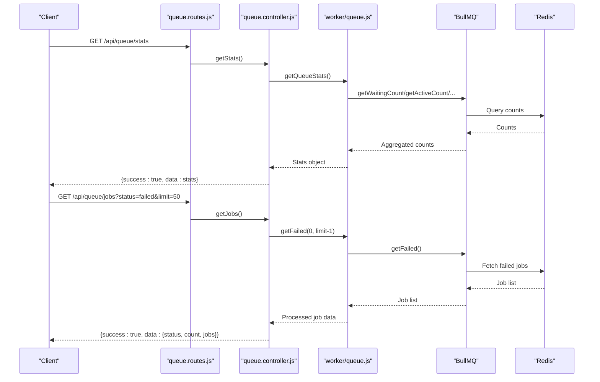
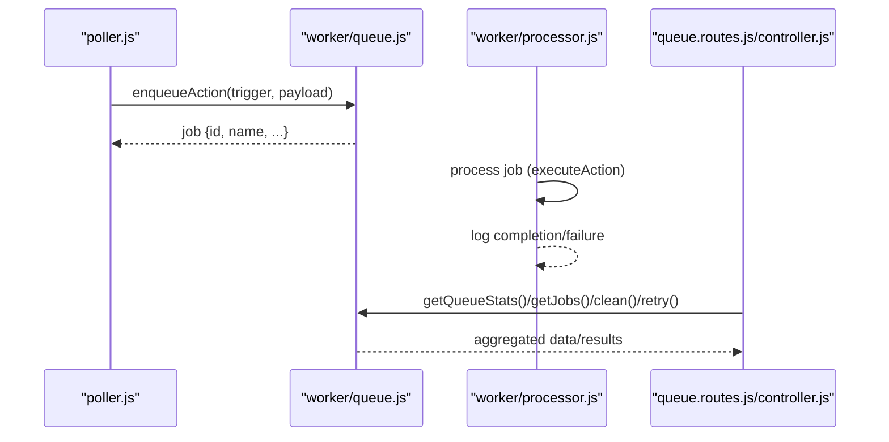
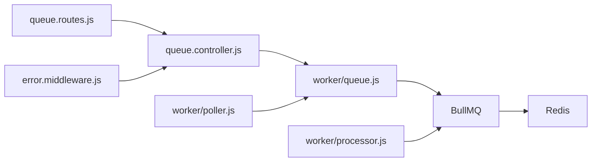

# Queue Operations API

<cite>
**Referenced Files in This Document**
- [queue.controller.js](file://backend/src/controllers/queue.controller.js)
- [queue.routes.js](file://backend/src/routes/queue.routes.js)
- [queue.js](file://backend/src/worker/queue.js)
- [processor.js](file://backend/src/worker/processor.js)
- [poller.js](file://backend/src/worker/poller.js)
- [app.js](file://backend/src/app.js)
- [error.middleware.js](file://backend/src/middleware/error.middleware.js)
- [appError.js](file://backend/src/utils/appError.js)
- [queue-usage.js](file://backend/examples/queue-usage.js)
- [QUICKSTART_QUEUE.md](file://backend/QUICKSTART_QUEUE.md)
- [QUEUE_SETUP.md](file://backend/QUEUE_SETUP.md)
- [REDIS_OPTIONAL.md](file://backend/REDIS_OPTIONAL.md)
- [README.md](file://README.md)
- [MIGRATION_GUIDE.md](file://backend/MIGRATION_GUIDE.md)
</cite>

## Table of Contents
1. [Introduction](#introduction)
2. [Project Structure](#project-structure)
3. [Core Components](#core-components)
4. [Architecture Overview](#architecture-overview)
5. [Detailed Component Analysis](#detailed-component-analysis)
6. [Dependency Analysis](#dependency-analysis)
7. [Performance Considerations](#performance-considerations)
8. [Troubleshooting Guide](#troubleshooting-guide)
9. [Conclusion](#conclusion)
10. [Appendices](#appendices)

## Introduction
This document provides comprehensive API documentation for queue management endpoints in the EventHorizon platform. It covers queue status endpoints, job inspection APIs, administrative operations, queue statistics retrieval, job queue manipulation, and monitoring endpoints. It also documents request/response schemas, error handling patterns, and integration with the background processing system powered by BullMQ and Redis.

The queue system is optional. When Redis is unavailable, the system gracefully falls back to direct execution mode, but queue endpoints return a service-unavailable response and recommend installing Redis.

## Project Structure
The queue operations are implemented as part of the backend Express application:
- Routes define the queue endpoints and include availability checks.
- Controllers implement the business logic for retrieving statistics, listing jobs, cleaning old jobs, and retrying failed jobs.
- Worker modules manage the BullMQ queue, worker pool, and job execution.
- Middleware ensures consistent error handling and logging.



**Diagram sources**
- [queue.routes.js:1-104](file://backend/src/routes/queue.routes.js#L1-L104)
- [queue.controller.js:1-142](file://backend/src/controllers/queue.controller.js#L1-L142)
- [queue.js:1-164](file://backend/src/worker/queue.js#L1-L164)
- [processor.js:1-174](file://backend/src/worker/processor.js#L1-L174)
- [poller.js:1-335](file://backend/src/worker/poller.js#L1-L335)

**Section sources**
- [app.js:24-27](file://backend/src/app.js#L24-L27)
- [queue.routes.js:1-104](file://backend/src/routes/queue.routes.js#L1-L104)
- [queue.controller.js:1-142](file://backend/src/controllers/queue.controller.js#L1-L142)
- [queue.js:1-164](file://backend/src/worker/queue.js#L1-L164)
- [processor.js:1-174](file://backend/src/worker/processor.js#L1-L174)
- [poller.js:1-335](file://backend/src/worker/poller.js#L1-L335)

## Core Components
- Queue routes: Define GET /api/queue/stats, GET /api/queue/jobs, POST /api/queue/clean, and POST /api/queue/jobs/:jobId/retry.
- Queue controller: Implements handlers for statistics, job listing, cleaning, and retry operations with robust error handling.
- Worker queue module: Provides queue abstraction, statistics aggregation, and cleanup routines backed by BullMQ and Redis.
- Worker processor: Runs the BullMQ worker pool that executes jobs with retries, concurrency control, and rate limiting.
- Poller: Enqueues actions into the queue; falls back to direct execution when Redis is unavailable.

Key integration points:
- Availability guard prevents queue endpoints from operating when Redis is not configured.
- Worker pool executes jobs concurrently and logs completion/failure events.
- Poller uses enqueueAction to decouple event detection from external service calls.

**Section sources**
- [queue.routes.js:25-101](file://backend/src/routes/queue.routes.js#L25-L101)
- [queue.controller.js:7-141](file://backend/src/controllers/queue.controller.js#L7-L141)
- [queue.js:43-163](file://backend/src/worker/queue.js#L43-L163)
- [processor.js:102-173](file://backend/src/worker/processor.js#L102-L173)
- [poller.js:59-147](file://backend/src/worker/poller.js#L59-L147)

## Architecture Overview
The queue system follows a producer-consumer model:
- Producer: Poller detects events and enqueues actions.
- Queue: BullMQ with Redis persists jobs.
- Consumer: Worker pool processes jobs concurrently with retries and rate limiting.
- Management API: Endpoints expose queue statistics, job listings, and administrative controls.



**Diagram sources**
- [queue.routes.js:37-64](file://backend/src/routes/queue.routes.js#L37-L64)
- [queue.controller.js:7-81](file://backend/src/controllers/queue.controller.js#L7-L81)
- [queue.js:126-143](file://backend/src/worker/queue.js#L126-L143)

**Section sources**
- [README.md:48-55](file://README.md#L48-L55)
- [QUEUE_SETUP.md:9-18](file://backend/QUEUE_SETUP.md#L9-L18)
- [poller.js:177-310](file://backend/src/worker/poller.js#L177-L310)
- [processor.js:102-173](file://backend/src/worker/processor.js#L102-L173)

## Detailed Component Analysis

### API Endpoints

#### GET /api/queue/stats
- Purpose: Retrieve queue statistics across job states.
- Authentication: None (global rate limiter applies).
- Availability: Requires Redis; otherwise returns 503.
- Response schema:
  - success: boolean
  - data: object
    - waiting: number
    - active: number
    - completed: number
    - failed: number
    - delayed: number
    - total: number

Example response:
```json
{
  "success": true,
  "data": {
    "waiting": 0,
    "active": 0,
    "completed": 0,
    "failed": 0,
    "delayed": 0,
    "total": 0
  }
}
```

**Section sources**
- [queue.routes.js:25-37](file://backend/src/routes/queue.routes.js#L25-L37)
- [queue.controller.js:7-21](file://backend/src/controllers/queue.controller.js#L7-L21)
- [queue.js:126-143](file://backend/src/worker/queue.js#L126-L143)

#### GET /api/queue/jobs
- Purpose: List jobs filtered by status with pagination.
- Query parameters:
  - status: waiting | active | completed | failed | delayed
  - limit: integer, default 50
- Response schema:
  - success: boolean
  - data: object
    - status: string
    - count: number
    - jobs: array of job objects
      - id: string
      - name: string
      - data: object (trigger and event payload)
      - progress: number | string
      - attemptsMade: number
      - timestamp: number
      - processedOn: number
      - finishedOn: number
      - failedReason: string

Example response:
```json
{
  "success": true,
  "data": {
    "status": "failed",
    "count": 1,
    "jobs": [
      {
        "id": "trigger-123-1699172345678",
        "name": "webhook-CXXX...XXX",
        "data": { "trigger": { ... }, "eventPayload": { ... } },
        "progress": 0,
        "attemptsMade": 3,
        "timestamp": 1699172345678,
        "processedOn": 1699172345678,
        "finishedOn": 1699172345678,
        "failedReason": "Invalid webhook URL"
      }
    ]
  }
}
```

**Section sources**
- [queue.routes.js:39-64](file://backend/src/routes/queue.routes.js#L39-L64)
- [queue.controller.js:26-81](file://backend/src/controllers/queue.controller.js#L26-L81)

#### POST /api/queue/clean
- Purpose: Remove old completed and failed jobs to control Redis memory usage.
- Behavior: Removes completed jobs older than 24 hours and failed jobs older than 7 days.
- Response schema:
  - success: boolean
  - message: string

Example response:
```json
{
  "success": true,
  "message": "Queue cleaned successfully"
}
```

**Section sources**
- [queue.routes.js:66-78](file://backend/src/routes/queue.routes.js#L66-L78)
- [queue.controller.js:86-100](file://backend/src/controllers/queue.controller.js#L86-L100)
- [queue.js:148-156](file://backend/src/worker/queue.js#L148-L156)

#### POST /api/queue/jobs/{jobId}/retry
- Purpose: Retry a failed job by reprocessing it.
- Path parameters:
  - jobId: string (required)
- Response schema:
  - success: boolean
  - message: string
  - data: object (contains jobId)

Example response:
```json
{
  "success": true,
  "message": "Job retry initiated",
  "data": { "jobId": "trigger-123-1699172345678" }
}
```

**Section sources**
- [queue.routes.js:80-101](file://backend/src/routes/queue.routes.js#L80-L101)
- [queue.controller.js:105-134](file://backend/src/controllers/queue.controller.js#L105-L134)

### Request/Response Schemas

- Success wrapper:
  - success: boolean
  - data: varies by endpoint
  - message: string (present on clean success)
  - error: string (present on failures)

- Error response:
  - success: false
  - status: number (HTTP status)
  - message: string
  - details: object (optional)
  - stack: string (development only)

- Health check:
  - GET /api/health
  - Response: { status: "ok" }

**Section sources**
- [error.middleware.js:36-53](file://backend/src/middleware/error.middleware.js#L36-L53)
- [appError.js:1-16](file://backend/src/utils/appError.js#L1-L16)
- [app.js:30-48](file://backend/src/app.js#L30-L48)

### Administrative Operations

- Queue statistics retrieval:
  - Use GET /api/queue/stats to monitor queue health and capacity.
  - Ideal for dashboards and alerting systems.

- Job queue manipulation:
  - Use GET /api/queue/jobs to inspect jobs by status and limit results.
  - Use POST /api/queue/jobs/:jobId/retry to recover from transient failures.
  - Use POST /api/queue/clean to prune old jobs and reclaim memory.

- Monitoring endpoints:
  - Combine GET /api/queue/stats with GET /api/queue/jobs to build monitoring views.
  - Optionally integrate Bull Board for a web UI (see QUEUE_SETUP.md).

**Section sources**
- [queue.controller.js:7-134](file://backend/src/controllers/queue.controller.js#L7-L134)
- [queue.js:126-156](file://backend/src/worker/queue.js#L126-L156)
- [QUEUE_SETUP.md:175-202](file://backend/QUEUE_SETUP.md#L175-L202)

### Integration Patterns with Background Processing

- Producer-integration:
  - Poller enqueues actions via enqueueAction, ensuring event detection remains responsive.
  - When Redis is unavailable, poller falls back to direct execution.

- Worker-integration:
  - Worker pool processes jobs concurrently with configurable limits and exponential backoff.
  - Logs provide observability for job lifecycle events.

- API-integration:
  - Queue endpoints are mounted under /api/queue and guarded by availability middleware.
  - Health endpoint (/api/health) confirms API readiness.



**Diagram sources**
- [poller.js:152-173](file://backend/src/worker/poller.js#L152-L173)
- [queue.js:91-121](file://backend/src/worker/queue.js#L91-L121)
- [processor.js:25-97](file://backend/src/worker/processor.js#L25-L97)
- [queue.controller.js:7-134](file://backend/src/controllers/queue.controller.js#L7-L134)

**Section sources**
- [poller.js:59-147](file://backend/src/worker/poller.js#L59-L147)
- [processor.js:102-173](file://backend/src/worker/processor.js#L102-L173)
- [queue.controller.js:7-134](file://backend/src/controllers/queue.controller.js#L7-L134)

## Dependency Analysis
- Route-layer dependency on controller-layer.
- Controller-layer depends on worker-layer queue module.
- Worker-layer depends on BullMQ and Redis.
- Poller depends on worker-layer enqueueAction and optionally on worker-layer queue module.
- Error middleware normalizes all error responses consistently.



**Diagram sources**
- [queue.routes.js:1-104](file://backend/src/routes/queue.routes.js#L1-L104)
- [queue.controller.js:1-142](file://backend/src/controllers/queue.controller.js#L1-L142)
- [queue.js:1-164](file://backend/src/worker/queue.js#L1-L164)
- [processor.js:1-174](file://backend/src/worker/processor.js#L1-L174)
- [poller.js:1-335](file://backend/src/worker/poller.js#L1-L335)
- [error.middleware.js:1-59](file://backend/src/middleware/error.middleware.js#L1-L59)

**Section sources**
- [queue.routes.js:1-104](file://backend/src/routes/queue.routes.js#L1-L104)
- [queue.controller.js:1-142](file://backend/src/controllers/queue.controller.js#L1-L142)
- [queue.js:1-164](file://backend/src/worker/queue.js#L1-L164)
- [processor.js:1-174](file://backend/src/worker/processor.js#L1-L174)
- [poller.js:1-335](file://backend/src/worker/poller.js#L1-L335)
- [error.middleware.js:1-59](file://backend/src/middleware/error.middleware.js#L1-L59)

## Performance Considerations
- Concurrency: Worker pool size is configurable via environment variable. Increase for higher throughput.
- Rate limiting: Built-in limiter throttles job processing to prevent overwhelming external services.
- Retention: Completed jobs retained for 24 hours, failed jobs for 7 days to balance observability and memory usage.
- Backoff: Jobs retry with exponential backoff to handle transient failures.
- Monitoring: Use GET /api/queue/stats and GET /api/queue/jobs to track queue health and adjust concurrency accordingly.

[No sources needed since this section provides general guidance]

## Troubleshooting Guide
Common scenarios and resolutions:
- Redis not available:
  - Symptom: Queue endpoints return 503 with guidance to install Redis.
  - Resolution: Install and start Redis, configure REDIS_HOST/PORT/PASSWORD, restart server.
- Worker not processing jobs:
  - Check worker logs for errors; ensure Redis is reachable.
  - Verify environment variables and worker concurrency.
- High failed job count:
  - Inspect failed jobs via GET /api/queue/jobs?status=failed.
  - Retry specific jobs using POST /api/queue/jobs/{jobId}/retry.
- Cleaning old jobs:
  - Use POST /api/queue/clean to prune completed and failed jobs older than configured retention windows.

**Section sources**
- [queue.routes.js:13-23](file://backend/src/routes/queue.routes.js#L13-L23)
- [REDIS_OPTIONAL.md:67-70](file://backend/REDIS_OPTIONAL.md#L67-L70)
- [MIGRATION_GUIDE.md:180-234](file://backend/MIGRATION_GUIDE.md#L180-L234)
- [QUICKSTART_QUEUE.md:144-181](file://backend/QUICKSTART_QUEUE.md#L144-L181)

## Conclusion
The queue operations API provides essential capabilities for monitoring and administering the BullMQ-based background processing system. With availability guards, standardized error responses, and clear administrative endpoints, operators can maintain visibility into job processing, recover from failures, and optimize performance. While Redis is optional, enabling it unlocks robust background processing, automatic retries, and comprehensive observability.

[No sources needed since this section summarizes without analyzing specific files]

## Appendices

### Endpoint Reference Summary
- GET /api/queue/stats: Queue statistics
- GET /api/queue/jobs: Jobs by status with limit
- POST /api/queue/clean: Cleanup old jobs
- POST /api/queue/jobs/{jobId}/retry: Retry failed job
- GET /api/health: API health check

**Section sources**
- [queue.routes.js:25-101](file://backend/src/routes/queue.routes.js#L25-L101)
- [app.js:30-48](file://backend/src/app.js#L30-L48)

### Example Usage References
- Enqueue actions and monitor queue: [queue-usage.js:9-223](file://backend/examples/queue-usage.js#L9-L223)
- Quick start and expected responses: [QUICKSTART_QUEUE.md:80-142](file://backend/QUICKSTART_QUEUE.md#L80-L142)
- Setup and configuration: [QUEUE_SETUP.md:97-138](file://backend/QUEUE_SETUP.md#L97-L138)