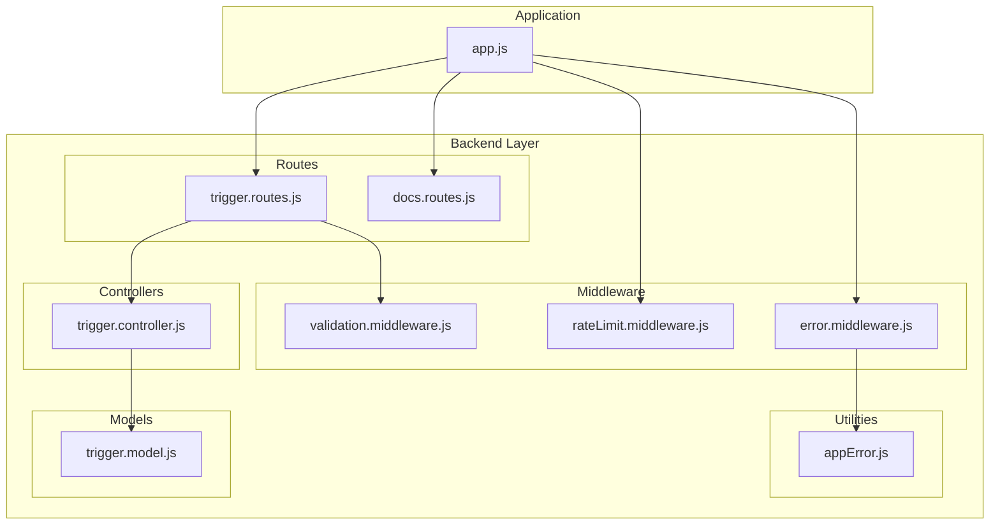
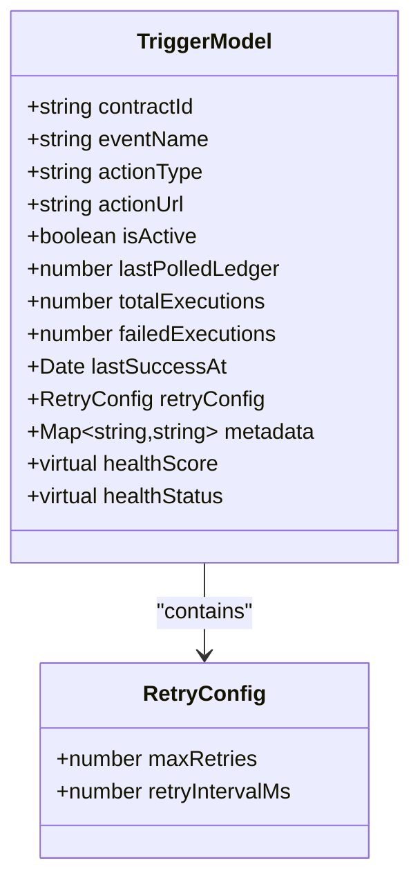
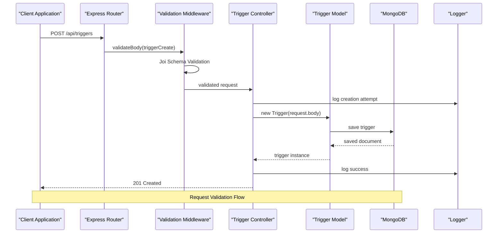
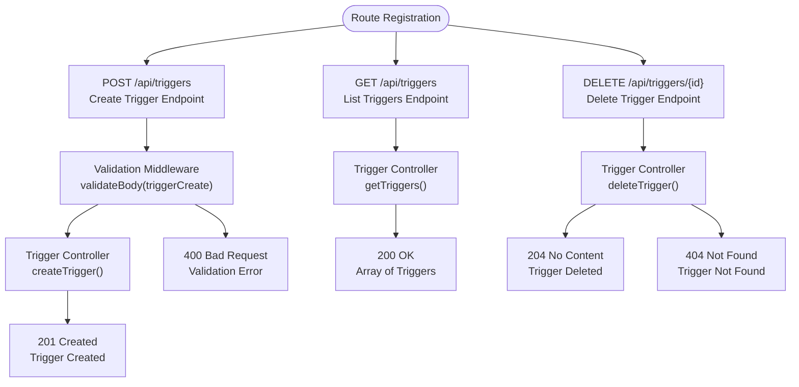
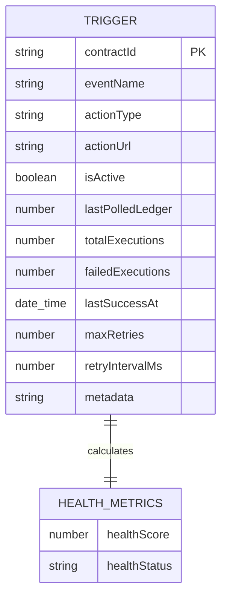
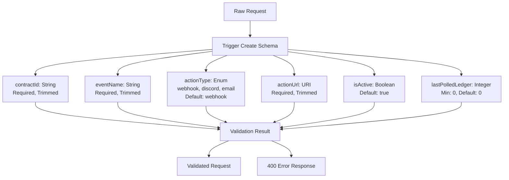
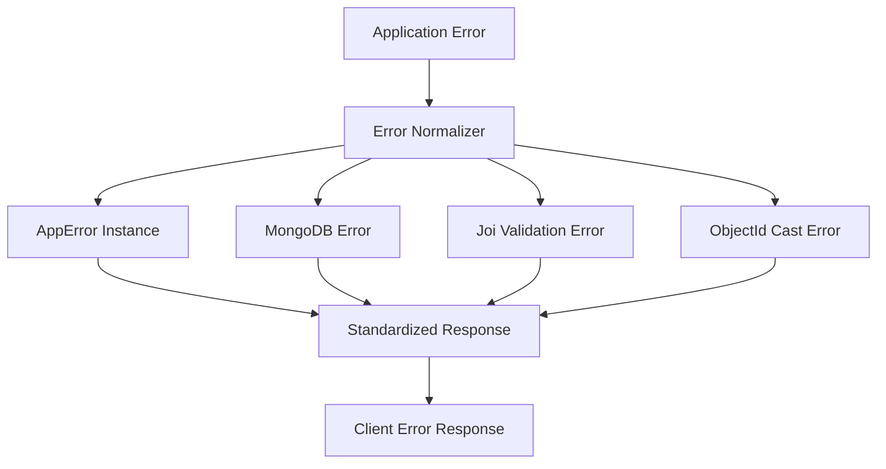
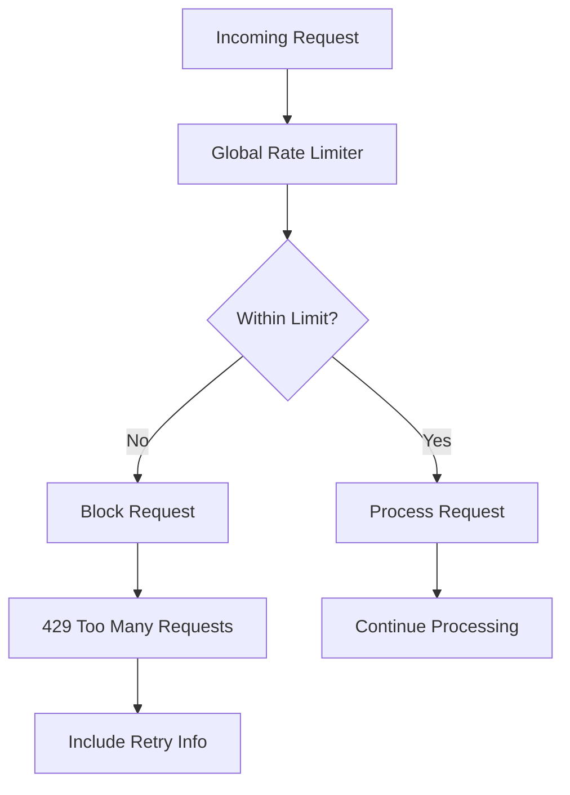
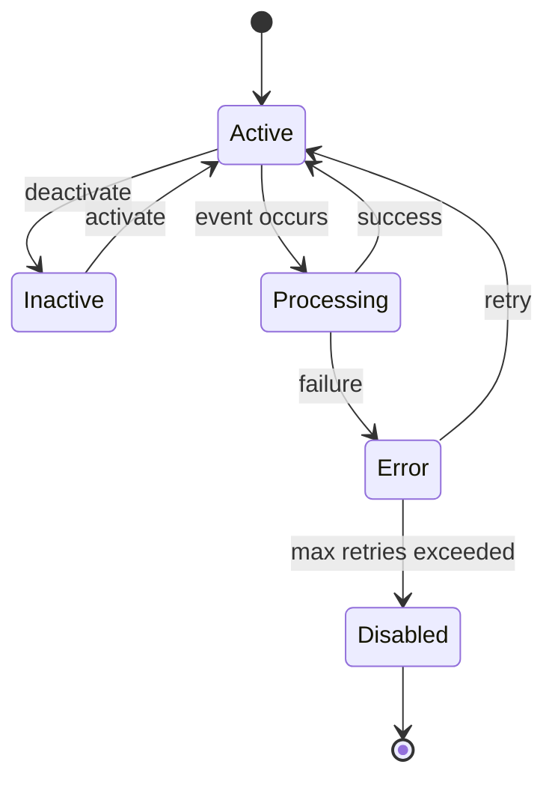

# Trigger Management API

<cite>
**Referenced Files in This Document**
- [trigger.controller.js](file://backend/src/controllers/trigger.controller.js)
- [trigger.routes.js](file://backend/src/routes/trigger.routes.js)
- [trigger.model.js](file://backend/src/models/trigger.model.js)
- [validation.middleware.js](file://backend/src/middleware/validation.middleware.js)
- [rateLimit.middleware.js](file://backend/src/middleware/rateLimit.middleware.js)
- [error.middleware.js](file://backend/src/middleware/error.middleware.js)
- [app.js](file://backend/src/app.js)
- [docs.routes.js](file://backend/src/routes/docs.routes.js)
- [appError.js](file://backend/src/utils/appError.js)
- [trigger.controller.test.js](file://backend/__tests__/trigger.controller.test.js)
</cite>

## Table of Contents
1. [Introduction](#introduction)
2. [Project Structure](#project-structure)
3. [Core Components](#core-components)
4. [Architecture Overview](#architecture-overview)
5. [Detailed Component Analysis](#detailed-component-analysis)
6. [API Reference](#api-reference)
7. [Validation Rules](#validation-rules)
8. [Error Handling](#error-handling)
9. [Rate Limiting](#rate-limiting)
10. [Pagination and Filtering](#pagination-and-filtering)
11. [Trigger Lifecycle Management](#trigger-lifecycle-management)
12. [Security Considerations](#security-considerations)
13. [Troubleshooting Guide](#troubleshooting-guide)
14. [Conclusion](#conclusion)

## Introduction

The Trigger Management API provides comprehensive functionality for managing Soroban event triggers within the EventHorizon system. This API enables developers to register, monitor, and manage event-driven actions that respond to blockchain contract events. The system supports multiple action types including webhooks, Discord notifications, and email alerts, making it versatile for various integration scenarios.

The API follows RESTful principles with standardized response formats, comprehensive validation, and robust error handling. It integrates seamlessly with MongoDB for data persistence and includes built-in rate limiting and logging capabilities.

## Project Structure

The trigger management functionality is organized within the backend/src architecture following a clean separation of concerns:



**Diagram sources**
- [trigger.routes.js:1-92](file://backend/src/routes/trigger.routes.js#L1-L92)
- [trigger.controller.js:1-72](file://backend/src/controllers/trigger.controller.js#L1-L72)
- [trigger.model.js:1-80](file://backend/src/models/trigger.model.js#L1-L80)
- [validation.middleware.js:1-49](file://backend/src/middleware/validation.middleware.js#L1-L49)
- [rateLimit.middleware.js:1-51](file://backend/src/middleware/rateLimit.middleware.js#L1-L51)
- [error.middleware.js:1-59](file://backend/src/middleware/error.middleware.js#L1-L59)
- [app.js:1-55](file://backend/src/app.js#L1-L55)

**Section sources**
- [trigger.routes.js:1-92](file://backend/src/routes/trigger.routes.js#L1-L92)
- [trigger.controller.js:1-72](file://backend/src/controllers/trigger.controller.js#L1-L72)
- [trigger.model.js:1-80](file://backend/src/models/trigger.model.js#L1-L80)
- [app.js:1-55](file://backend/src/app.js#L1-L55)

## Core Components

### Trigger Model

The trigger model defines the core data structure for event monitoring and action execution:



**Diagram sources**
- [trigger.model.js:3-79](file://backend/src/models/trigger.model.js#L3-L79)

### Controller Functions

The trigger controller implements three primary operations:

1. **Create Trigger**: Validates incoming requests and persists new trigger configurations
2. **List Triggers**: Retrieves all configured triggers from the database
3. **Delete Trigger**: Removes triggers by their MongoDB identifier

**Section sources**
- [trigger.controller.js:6-71](file://backend/src/controllers/trigger.controller.js#L6-L71)

## Architecture Overview

The trigger management API follows a layered architecture pattern with clear separation between presentation, business logic, and data access layers:



**Diagram sources**
- [trigger.routes.js:57-61](file://backend/src/routes/trigger.routes.js#L57-L61)
- [validation.middleware.js:24-41](file://backend/src/middleware/validation.middleware.js#L24-L41)
- [trigger.controller.js:6-28](file://backend/src/controllers/trigger.controller.js#L6-L28)

**Section sources**
- [trigger.routes.js:1-92](file://backend/src/routes/trigger.routes.js#L1-L92)
- [validation.middleware.js:1-49](file://backend/src/middleware/validation.middleware.js#L1-L49)
- [trigger.controller.js:1-72](file://backend/src/controllers/trigger.controller.js#L1-L72)

## Detailed Component Analysis

### Route Configuration

The trigger routes define the API endpoints with comprehensive OpenAPI documentation:



**Diagram sources**
- [trigger.routes.js:57-89](file://backend/src/routes/trigger.routes.js#L57-L89)

### Data Model Implementation

The trigger model implements comprehensive schema validation and includes derived properties for monitoring:



**Diagram sources**
- [trigger.model.js:3-79](file://backend/src/models/trigger.model.js#L3-L79)

**Section sources**
- [trigger.routes.js:1-92](file://backend/src/routes/trigger.routes.js#L1-L92)
- [trigger.model.js:1-80](file://backend/src/models/trigger.model.js#L1-L80)

## API Reference

### Base URL
`/api/triggers`

### Authentication
No authentication required for trigger management endpoints.

### Response Format

All responses follow a consistent JSON format:

```json
{
  "success": true,
  "data": {}
}
```

Error responses include additional details:

```json
{
  "success": false,
  "message": "Error description",
  "details": [
    {
      "field": "field.name",
      "message": "Validation error message"
    }
  ]
}
```

### POST /api/triggers - Create Trigger

Creates a new trigger for monitoring Soroban contract events.

**Request Body Schema:**

| Field | Type | Required | Description | Default |
|-------|------|----------|-------------|---------|
| contractId | string | Yes | Soroban contract identifier to monitor | - |
| eventName | string | Yes | Event name emitted by the contract | - |
| actionType | string | No | Action type to execute when triggered | webhook |
| actionUrl | string | Yes | Destination URL or integration endpoint | - |
| isActive | boolean | No | Whether the trigger is active | true |
| lastPolledLedger | number | No | Last ledger processed | 0 |

**Example Request:**
```json
{
  "contractId": "CAXXXXXXXXXXXXXXXXXXXXXXXXXXXXXXXXXXXXXXXXXXXXXXXXXXXXXX",
  "eventName": "SwapExecuted",
  "actionType": "webhook",
  "actionUrl": "https://example.com/webhooks/event-horizon",
  "isActive": true
}
```

**Example Response:**
```json
{
  "success": true,
  "data": {
    "_id": "65b2d7d0844db6b9b17a9ef1",
    "contractId": "CAXXXXXXXXXXXXXXXXXXXXXXXXXXXXXXXXXXXXXXXXXXXXXXXXXXXXXX",
    "eventName": "SwapExecuted",
    "actionType": "webhook",
    "actionUrl": "https://example.com/webhooks/event-horizon",
    "isActive": true,
    "createdAt": "2024-01-25T10:30:00Z",
    "updatedAt": "2024-01-25T10:30:00Z"
  }
}
```

**HTTP Status Codes:**
- 201 Created: Trigger created successfully
- 400 Bad Request: Validation failed
- 500 Internal Server Error: Server error

### GET /api/triggers - List Triggers

Retrieves all configured triggers from the database.

**Query Parameters:**
- None (returns all triggers)

**Example Response:**
```json
{
  "success": true,
  "data": [
    {
      "_id": "65b2d7d0844db6b9b17a9ef1",
      "contractId": "CAXXXXXXXXXXXXXXXXXXXXXXXXXXXXXXXXXXXXXXXXXXXXXXXXXXXXXX",
      "eventName": "SwapExecuted",
      "actionType": "webhook",
      "actionUrl": "https://example.com/webhooks/event-horizon",
      "isActive": true,
      "createdAt": "2024-01-25T10:30:00Z",
      "updatedAt": "2024-01-25T10:30:00Z"
    }
  ]
}
```

**HTTP Status Codes:**
- 200 OK: Triggers retrieved successfully
- 500 Internal Server Error: Server error

### DELETE /api/triggers/{id} - Delete Trigger

Removes a trigger by its MongoDB identifier.

**Path Parameters:**
- id (string): MongoDB ObjectId of the trigger to delete

**Example Response:**
```json
{
  "success": true,
  "message": "Trigger deleted successfully"
}
```

**HTTP Status Codes:**
- 204 No Content: Trigger deleted successfully
- 404 Not Found: Trigger not found
- 500 Internal Server Error: Server error

**Section sources**
- [trigger.routes.js:9-56](file://backend/src/routes/trigger.routes.js#L9-L56)
- [trigger.routes.js:64-88](file://backend/src/routes/trigger.routes.js#L64-L88)
- [docs.routes.js:11-118](file://backend/src/routes/docs.routes.js#L11-L118)

## Validation Rules

### Request Validation Schema

The validation middleware enforces strict input validation using Joi:



**Diagram sources**
- [validation.middleware.js:4-11](file://backend/src/middleware/validation.middleware.js#L4-L11)

### Validation Behavior

- **Field Validation**: All required fields must be present and non-empty
- **Type Validation**: Fields are validated against their specified types
- **Format Validation**: URLs are validated as URIs
- **Enum Validation**: Action types are restricted to predefined values
- **Default Values**: Optional fields receive sensible defaults
- **Error Response**: Validation errors return structured error details

**Section sources**
- [validation.middleware.js:1-49](file://backend/src/middleware/validation.middleware.js#L1-L49)

## Error Handling

### Error Response Format

The error handling middleware provides consistent error responses:



**Diagram sources**
- [error.middleware.js:5-30](file://backend/src/middleware/error.middleware.js#L5-L30)

### Error Types and Handling

| Error Type | Status Code | Description | Response Format |
|------------|-------------|-------------|-----------------|
| AppError | 400/404/500 | Application-specific errors | Standard error response |
| Duplicate Field | 400 | Duplicate values detected | Error with details |
| Validation | 400 | Joi validation failures | Array of validation errors |
| CastError | 400 | Invalid ObjectId format | Specific field error |
| Other | 500 | Unexpected server errors | Generic error response |

**Section sources**
- [error.middleware.js:1-59](file://backend/src/middleware/error.middleware.js#L1-L59)
- [appError.js:1-16](file://backend/src/utils/appError.js#L1-L16)

## Rate Limiting

### Global Rate Limiting

The API implements comprehensive rate limiting to prevent abuse:



**Diagram sources**
- [rateLimit.middleware.js:8-29](file://backend/src/middleware/rateLimit.middleware.js#L8-L29)

### Rate Limit Configuration

| Parameter | Environment Variable | Default Value | Purpose |
|-----------|---------------------|---------------|---------|
| Window Size | RATE_LIMIT_WINDOW_MS | 900,000 ms (15 min) | Time window for counting |
| Max Requests | RATE_LIMIT_MAX | 120 requests | Maximum requests per window |
| Auth Window | AUTH_RATE_LIMIT_WINDOW_MS | 900,000 ms (15 min) | Separate window for auth |
| Auth Limit | AUTH_RATE_LIMIT_MAX | 20 requests | Maximum auth attempts |

**Section sources**
- [rateLimit.middleware.js:1-51](file://backend/src/middleware/rateLimit.middleware.js#L1-L51)
- [app.js:21-22](file://backend/src/app.js#L21-L22)

## Pagination and Filtering

### Current Implementation

The trigger management API currently supports:

- **Complete Retrieval**: The GET endpoint returns all triggers without pagination
- **No Filtering**: No query parameters for filtering or sorting
- **No Pagination**: No limit or offset parameters

### Scalability Considerations

For production deployments with large numbers of triggers, consider:

1. **Pagination Support**: Add limit and offset parameters
2. **Filtering Options**: Support filtering by contractId, eventName, actionType
3. **Sorting**: Enable sorting by creation date or activity metrics
4. **Indexing**: Add database indexes for frequently queried fields

**Section sources**
- [trigger.controller.js:30-44](file://backend/src/controllers/trigger.controller.js#L30-L44)

## Trigger Lifecycle Management

### Trigger States and Metrics

The trigger model includes comprehensive health monitoring:



### Health Monitoring

Triggers automatically calculate health metrics:

| Metric | Calculation | Status Thresholds |
|--------|-------------|-------------------|
| Health Score | (Successful Executions / Total Executions) × 100 | ≥90: Healthy, ≥70: Degraded, <70: Critical |
| Success Count | Total Executions - Failed Executions | Derived metric |
| Health Status | Based on score | Automatic categorization |

**Section sources**
- [trigger.model.js:64-79](file://backend/src/models/trigger.model.js#L64-L79)

## Security Considerations

### Input Validation
- All inputs are validated using Joi schemas
- Unknown fields are stripped from request bodies
- String fields are trimmed to prevent whitespace issues

### Error Handling
- Production environments hide stack traces
- Detailed error information is only shown in development
- Consistent error response format prevents information leakage

### Rate Limiting
- Prevents abuse and DDoS attacks
- Separate limits for authentication endpoints
- Configurable through environment variables

## Troubleshooting Guide

### Common Issues and Solutions

**Issue**: Validation errors when creating triggers
- **Cause**: Missing or invalid required fields
- **Solution**: Ensure contractId, eventName, and actionUrl are provided
- **Reference**: [validation.middleware.js:4-11](file://backend/src/middleware/validation.middleware.js#L4-L11)

**Issue**: 404 Not Found when deleting triggers
- **Cause**: Invalid or non-existent trigger ID
- **Solution**: Verify the MongoDB ObjectId format and existence
- **Reference**: [trigger.controller.js:54-61](file://backend/src/controllers/trigger.controller.js#L54-L61)

**Issue**: Rate limit exceeded
- **Cause**: Too many requests within the time window
- **Solution**: Wait for the reset period or adjust environment variables
- **Reference**: [rateLimit.middleware.js:31-45](file://backend/src/middleware/rateLimit.middleware.js#L31-L45)

**Issue**: Authentication required for endpoints
- **Cause**: Misunderstanding of API design
- **Solution**: No authentication required for trigger endpoints
- **Reference**: [trigger.routes.js:57-89](file://backend/src/routes/trigger.routes.js#L57-L89)

**Section sources**
- [trigger.controller.test.js:36-59](file://backend/__tests__/trigger.controller.test.js#L36-L59)
- [error.middleware.js:32-34](file://backend/src/middleware/error.middleware.js#L32-L34)

## Conclusion

The Trigger Management API provides a robust foundation for event-driven automation in the EventHorizon ecosystem. Its clean architecture, comprehensive validation, and thoughtful error handling make it suitable for production deployment while maintaining developer-friendly characteristics.

Key strengths include:
- **Consistent API Design**: Standardized response formats and error handling
- **Comprehensive Validation**: Strict input validation with clear error messages
- **Health Monitoring**: Built-in metrics for trigger reliability assessment
- **Rate Limiting**: Protection against abuse and resource exhaustion
- **Extensible Design**: Easy to add new action types and monitoring capabilities

Future enhancements could include pagination support, advanced filtering options, and expanded action integrations to further improve scalability and flexibility.