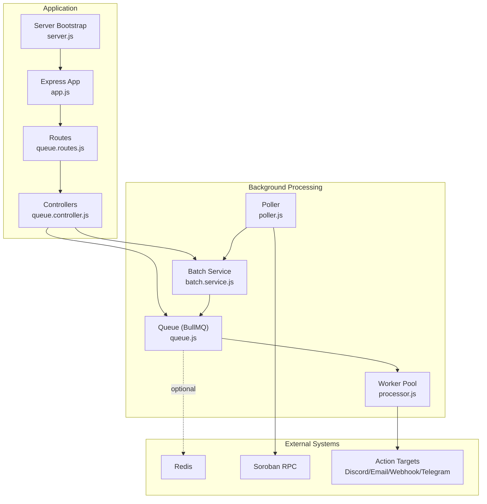
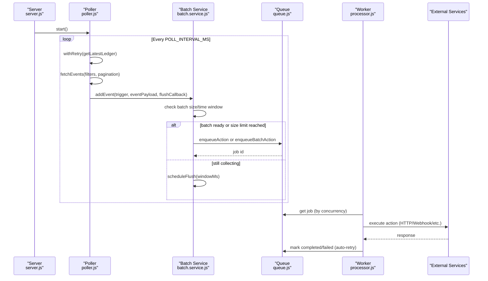
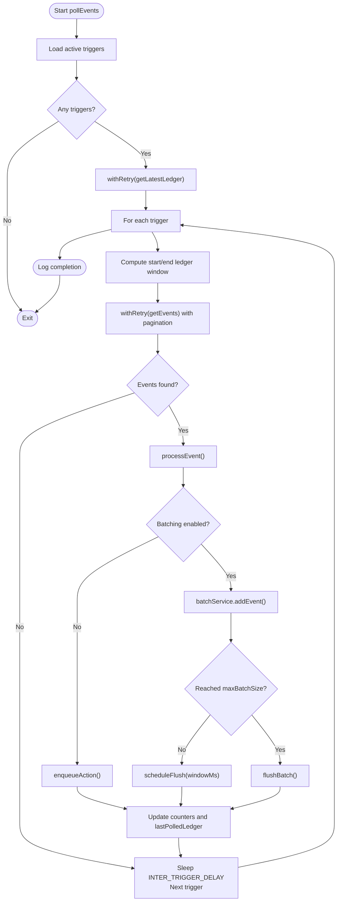
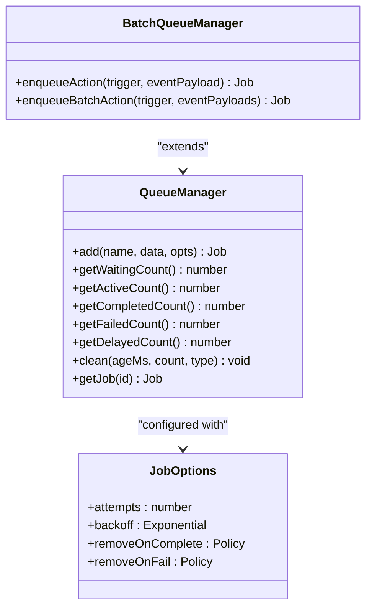
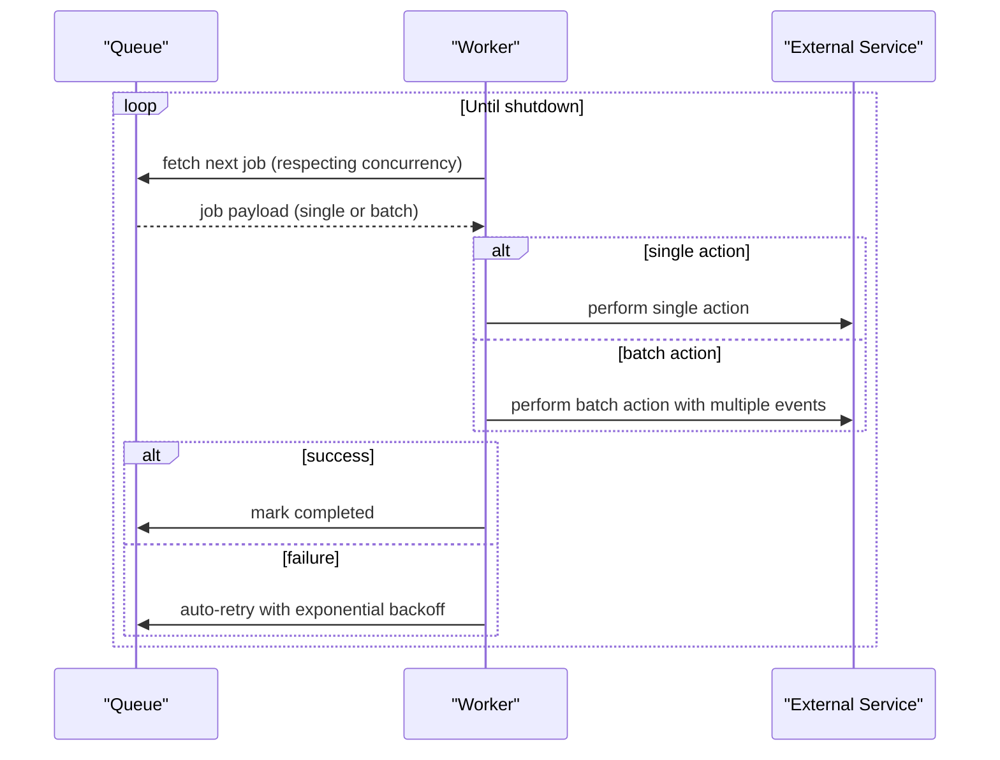
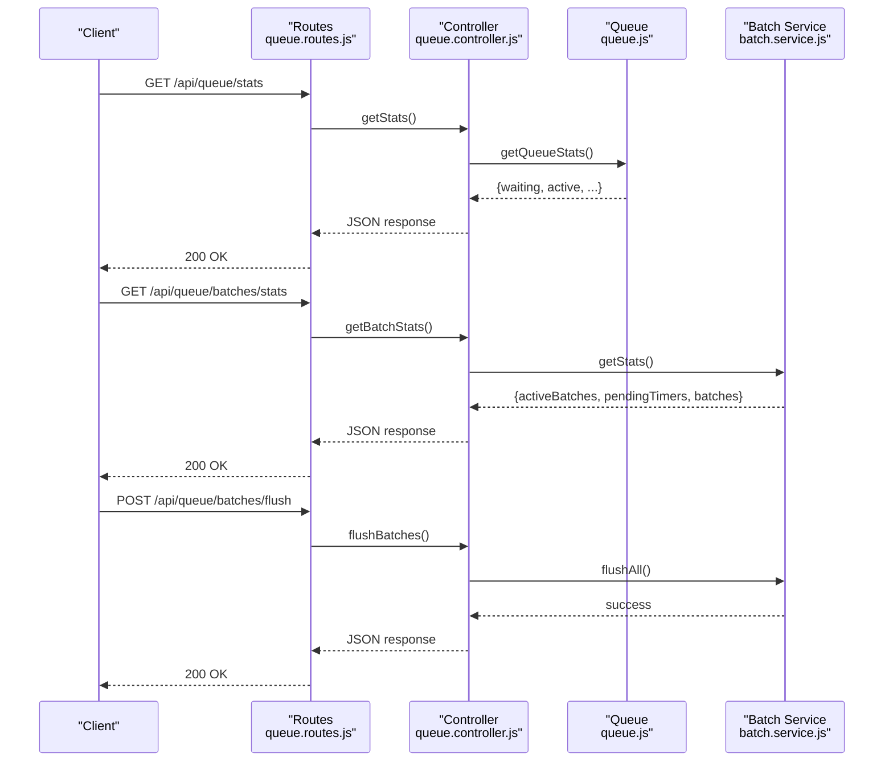
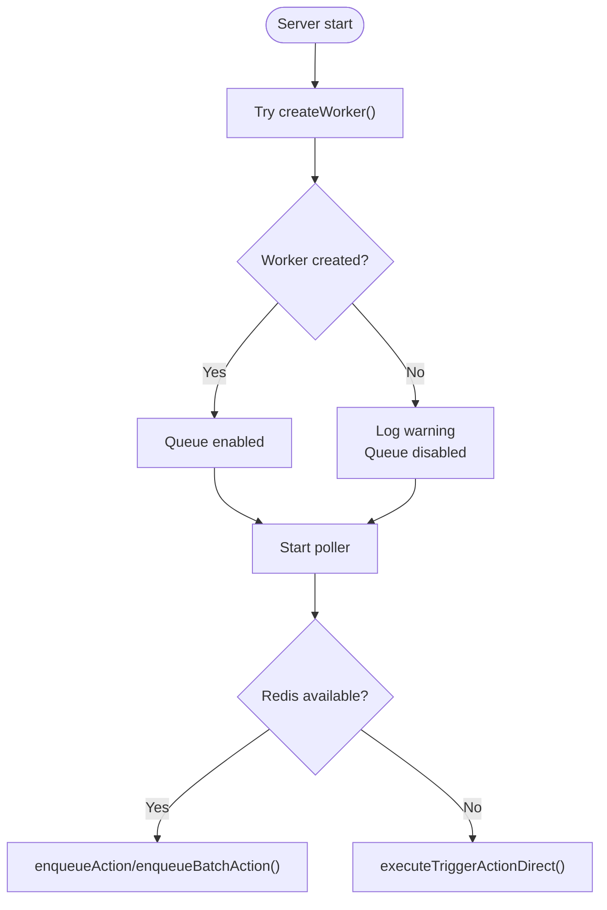
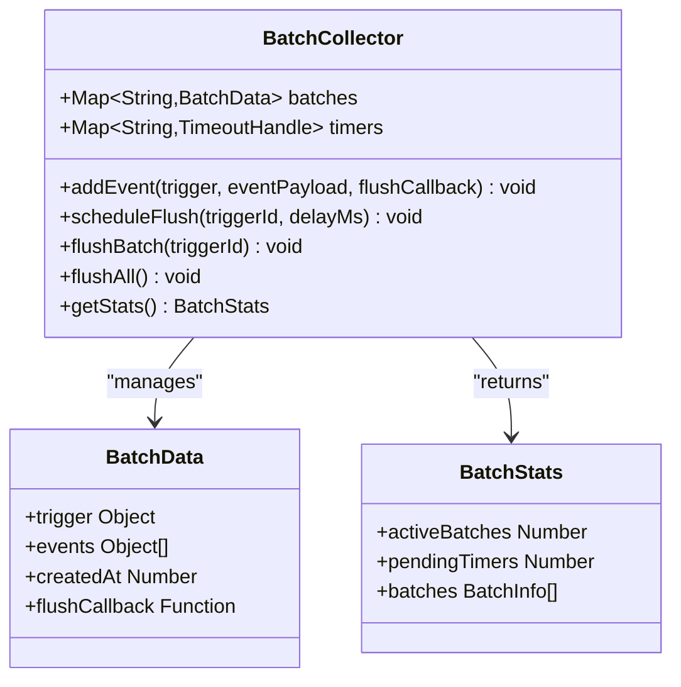
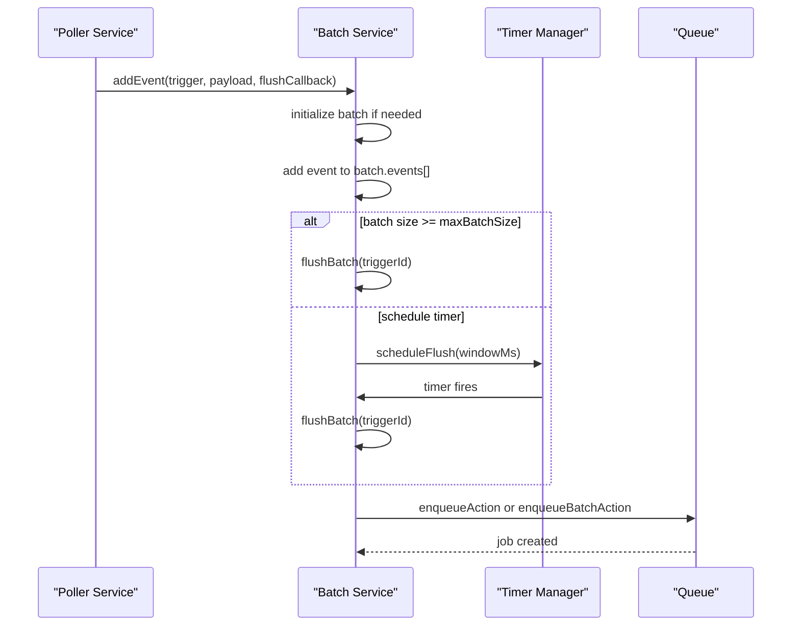
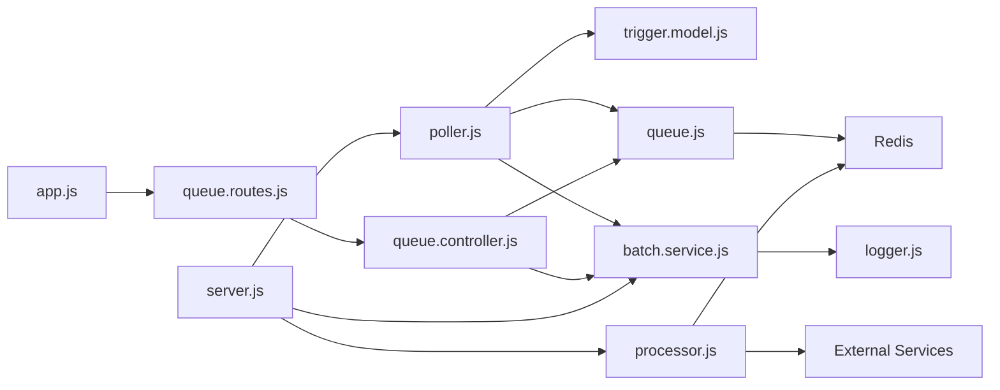

# Background Processing Architecture

<cite>
**Referenced Files in This Document**
- [poller.js](file://backend/src/worker/poller.js)
- [processor.js](file://backend/src/worker/processor.js)
- [queue.js](file://backend/src/worker/queue.js)
- [batch.service.js](file://backend/src/services/batch.service.js)
- [queue.controller.js](file://backend/src/controllers/queue.controller.js)
- [queue.routes.js](file://backend/src/routes/queue.routes.js)
- [server.js](file://backend/src/server.js)
- [app.js](file://backend/src/app.js)
- [trigger.model.js](file://backend/src/models/trigger.model.js)
- [queue-usage.js](file://backend/examples/queue-usage.js)
- [QUICKSTART_QUEUE.md](file://backend/QUICKSTART_QUEUE.md)
- [REDIS_OPTIONAL.md](file://backend/REDIS_OPTIONAL.md)
- [CHANGELOG_QUEUE.md](file://backend/CHANGELOG_QUEUE.md)
- [package.json](file://backend/package.json)
</cite>

## Update Summary
**Changes Made**
- Added comprehensive coverage of the new batch service implementation
- Updated architecture overview to include window-based batching capabilities
- Enhanced polling mechanism documentation with batch processing integration
- Added batch service monitoring and management endpoints
- Updated troubleshooting guide with batch-specific considerations

## Table of Contents
1. [Introduction](#introduction)
2. [Project Structure](#project-structure)
3. [Core Components](#core-components)
4. [Architecture Overview](#architecture-overview)
5. [Detailed Component Analysis](#detailed-component-analysis)
6. [Batch Service Implementation](#batch-service-implementation)
7. [Dependency Analysis](#dependency-analysis)
8. [Performance Considerations](#performance-considerations)
9. [Troubleshooting Guide](#troubleshooting-guide)
10. [Conclusion](#conclusion)
11. [Appendices](#appendices)

## Introduction
This document explains the background processing architecture that powers event-driven actions in the system. It covers the event polling mechanism with exponential backoff, the BullMQ-based queue system, retry strategies for failed jobs, worker concurrency controls, and monitoring capabilities. The architecture now includes enhanced batch processing capabilities through configurable window-based batching, supporting adjustable time windows and maximum batch sizes with automatic flushing mechanisms. It also documents the optional Redis dependency, graceful fallback behavior, scaling considerations, practical examples, and performance optimization techniques.

## Project Structure
The background processing system spans four primary layers:
- Event detection and queuing: handled by the poller
- Batch processing service: manages high-frequency event batching with configurable windows
- Job queue and persistence: handled by BullMQ and Redis
- Worker execution and retries: handled by the worker pool

**Diagram sources**
- [server.js:1-98](file://backend/src/server.js#L1-L98)
- [app.js:1-55](file://backend/src/app.js#L1-L55)
- [queue.routes.js:1-128](file://backend/src/routes/queue.routes.js#L1-L128)
- [queue.controller.js:1-141](file://backend/src/controllers/queue.controller.js#L1-L141)
- [poller.js:1-350](file://backend/src/worker/poller.js#L1-L350)
- [batch.service.js:1-150](file://backend/src/services/batch.service.js#L1-L150)
- [queue.js:1-206](file://backend/src/worker/queue.js#L1-L206)
- [processor.js:1-174](file://backend/src/worker/processor.js#L1-L174)

**Section sources**
- [server.js:1-98](file://backend/src/server.js#L1-L98)
- [app.js:1-55](file://backend/src/app.js#L1-L55)
- [queue.routes.js:1-128](file://backend/src/routes/queue.routes.js#L1-L128)
- [queue.controller.js:1-141](file://backend/src/controllers/queue.controller.js#L1-L141)
- [poller.js:1-350](file://backend/src/worker/poller.js#L1-L350)
- [batch.service.js:1-150](file://backend/src/services/batch.service.js#L1-L150)
- [queue.js:1-206](file://backend/src/worker/queue.js#L1-L206)
- [processor.js:1-174](file://backend/src/worker/processor.js#L1-L174)

## Core Components
- Event Poller: Periodically queries the Soroban network for contract events, processes them through the batch service, and enqueues actions with priority handling.
- Batch Service: Manages high-frequency event processing through configurable window-based batching with adjustable time windows and maximum batch sizes.
- BullMQ Queue: Redis-backed job queue with exponential backoff, retention policies, and monitoring APIs.
- Worker Pool: Concurrency-controlled job processors that execute actions against external services.
- Queue Controller and Routes: Expose queue statistics, job listings, batch statistics, cleaning, and retry operations.

Key behaviors:
- Poller uses exponential backoff for RPC calls and paginates events with inter-page delays.
- Events are processed through the batch service which applies configurable batching rules.
- Actions are enqueued with priority derived from trigger configuration.
- Worker applies rate limiting and configurable concurrency.
- Graceful fallback to direct execution when Redis is unavailable.
- Batch service provides monitoring endpoints for batch statistics and manual flush operations.

**Section sources**
- [poller.js:154-178](file://backend/src/worker/poller.js#L154-L178)
- [batch.service.js:7-150](file://backend/src/services/batch.service.js#L7-L150)
- [queue.js:19-41](file://backend/src/worker/queue.js#L19-L41)
- [processor.js:102-168](file://backend/src/worker/processor.js#L102-L168)
- [queue.controller.js:7-141](file://backend/src/controllers/queue.controller.js#L7-L141)

## Architecture Overview
The system separates concerns across layers to improve reliability and scalability, now enhanced with batch processing capabilities:
- Poller detects events and routes them to the batch service for processing.
- Batch service manages high-frequency events through configurable window-based batching.
- Queue persists jobs and manages retries with exponential backoff.
- Worker pool executes jobs concurrently with rate limiting.
- Optional Redis enables background processing; without Redis, actions execute directly.

**Diagram sources**
- [server.js:44-58](file://backend/src/server.js#L44-L58)
- [poller.js:154-178](file://backend/src/worker/poller.js#L154-L178)
- [batch.service.js:19-50](file://backend/src/services/batch.service.js#L19-L50)
- [queue.js:91-121](file://backend/src/worker/queue.js#L91-L121)
- [processor.js:102-168](file://backend/src/worker/processor.js#L102-L168)

## Detailed Component Analysis

### Event Poller: Enhanced with Batch Processing Integration
The poller now integrates with the batch service for high-frequency event handling:
- Retrieves the latest ledger with exponential backoff for RPC calls.
- Computes a sliding window per trigger bounded by a maximum ledger range.
- Paginates events with inter-page delays to avoid rate limits.
- Routes events through the batch service for configurable batching.
- Enqueues actions with trigger-specific retry configuration.
- Updates per-trigger state only on successful cycles.

**Diagram sources**
- [poller.js:182-350](file://backend/src/worker/poller.js#L182-L350)
- [batch.service.js:19-50](file://backend/src/services/batch.service.js#L19-L50)

**Section sources**
- [poller.js:182-350](file://backend/src/worker/poller.js#L182-L350)
- [poller.js:27-51](file://backend/src/worker/poller.js#L27-L51)
- [poller.js:154-178](file://backend/src/worker/poller.js#L154-L178)

### BullMQ Queue: Enhanced with Batch Support
The queue now supports both individual actions and batch actions:
- Uses Redis-backed BullMQ with default job options including attempts and exponential backoff.
- Applies retention policies for completed and failed jobs.
- Supports both `enqueueAction` for single events and `enqueueBatchAction` for batched events.
- Provides helpers to enqueue actions with priority and job identifiers.
- Exposes queue statistics and cleanup routines.

**Diagram sources**
- [queue.js:19-41](file://backend/src/worker/queue.js#L19-L41)
- [queue.js:91-121](file://backend/src/worker/queue.js#L91-L121)
- [queue.js:164-197](file://backend/src/worker/queue.js#L164-L197)

**Section sources**
- [queue.js:19-41](file://backend/src/worker/queue.js#L19-L41)
- [queue.js:91-121](file://backend/src/worker/queue.js#L91-L121)
- [queue.js:126-143](file://backend/src/worker/queue.js#L126-L143)
- [queue.js:148-156](file://backend/src/worker/queue.js#L148-L156)
- [queue.js:164-197](file://backend/src/worker/queue.js#L164-L197)

### Worker Pool: Enhanced with Batch Processing Support
The worker continues to execute jobs with enhanced support for batch processing:
- Creates a BullMQ Worker bound to the Redis connection.
- Executes jobs with a concurrency level controlled by an environment variable.
- Applies a built-in rate limiter to cap throughput.
- Emits events for completed, failed, and error conditions.
- Processes both individual actions and batch actions seamlessly.

**Diagram sources**
- [processor.js:102-168](file://backend/src/worker/processor.js#L102-L168)

**Section sources**
- [processor.js:102-168](file://backend/src/worker/processor.js#L102-L168)

### Queue Monitoring and Management APIs
The queue controller and routes now include batch-specific monitoring and management:
- Provide endpoints to retrieve queue statistics, list jobs by status, clean old jobs, and retry failed jobs.
- Include endpoints for batch statistics and manual batch flushing.
- Guard endpoints with availability checks when Redis is not configured.

**Diagram sources**
- [queue.routes.js:103-125](file://backend/src/routes/queue.routes.js#L103-L125)
- [queue.controller.js:106-137](file://backend/src/controllers/queue.controller.js#L106-L137)
- [batch.service.js:128-146](file://backend/src/services/batch.service.js#L128-L146)

**Section sources**
- [queue.routes.js:103-125](file://backend/src/routes/queue.routes.js#L103-L125)
- [queue.controller.js:106-137](file://backend/src/controllers/queue.controller.js#L106-L137)

### Optional Redis and Fallback Behavior
The system gracefully degrades when Redis is unavailable:
- Worker initialization is attempted during server bootstrap; on failure, the system logs a warning and proceeds.
- The poller dynamically selects between enqueueing actions or executing them directly.
- Queue-related API endpoints return a service unavailable response when Redis is not configured.
- Batch service continues to operate in-memory even without Redis.

**Diagram sources**
- [server.js:44-58](file://backend/src/server.js#L44-L58)
- [poller.js:55-147](file://backend/src/worker/poller.js#L55-L147)
- [queue.routes.js:13-23](file://backend/src/routes/queue.routes.js#L13-L23)

**Section sources**
- [server.js:44-58](file://backend/src/server.js#L44-L58)
- [poller.js:55-147](file://backend/src/worker/poller.js#L55-L147)
- [REDIS_OPTIONAL.md:1-203](file://backend/REDIS_OPTIONAL.md#L1-L203)

## Batch Service Implementation

### Window-Based Batching Architecture
The batch service provides sophisticated high-frequency event processing through configurable window-based batching:

- **Batch Collector Class**: Manages in-memory batch storage using Maps for efficient lookups and timeouts.
- **Configurable Parameters**: Supports adjustable time windows (1-5 minutes) and maximum batch sizes (1-1000 events).
- **Automatic Flushing**: Triggers flush when either maximum batch size is reached or time window expires.
- **Graceful Error Handling**: Continues processing other events if one fails within a batch.

**Diagram sources**
- [batch.service.js:7-150](file://backend/src/services/batch.service.js#L7-L150)

**Section sources**
- [batch.service.js:7-150](file://backend/src/services/batch.service.js#L7-L150)
- [trigger.model.js:81-102](file://backend/src/models/trigger.model.js#L81-L102)

### Batch Processing Workflow
The batch service implements a sophisticated processing workflow:

1. **Event Collection**: Events are collected in memory batches keyed by trigger ID
2. **Size-Based Triggering**: Flushes immediately when maximum batch size is reached
3. **Time-Based Triggering**: Schedules automatic flush after configurable window
4. **Timer Management**: Clears and resets timers for each new event
5. **Batch Execution**: Executes flush callback with all collected events
6. **Cleanup**: Removes completed batches and clears associated timers

**Diagram sources**
- [batch.service.js:19-50](file://backend/src/services/batch.service.js#L19-L50)
- [batch.service.js:57-69](file://backend/src/services/batch.service.js#L57-L69)
- [batch.service.js:75-106](file://backend/src/services/batch.service.js#L75-L106)

**Section sources**
- [batch.service.js:19-50](file://backend/src/services/batch.service.js#L19-L50)
- [batch.service.js:57-69](file://backend/src/services/batch.service.js#L57-L69)
- [batch.service.js:75-106](file://backend/src/services/batch.service.js#L75-L106)

### Batch Monitoring and Management
The batch service provides comprehensive monitoring capabilities:

- **Statistics Endpoint**: `/api/queue/batches/stats` returns current batch status
- **Manual Flush**: `/api/queue/batches/flush` forces immediate batch processing
- **Graceful Shutdown**: Automatic flush of pending batches during server shutdown
- **Error Tracking**: Logs batch processing errors with trigger and batch information

**Section sources**
- [queue.routes.js:105-125](file://backend/src/routes/queue.routes.js#L105-L125)
- [queue.controller.js:106-137](file://backend/src/controllers/queue.controller.js#L106-L137)
- [server.js:74-80](file://backend/src/server.js#L74-L80)

## Dependency Analysis
- BullMQ and ioredis are optional dependencies; the application remains functional without them.
- The poller depends on the Stellar SDK for RPC interactions and on the trigger model for configuration.
- The worker depends on Redis connectivity and external services for action execution.
- The batch service operates independently of Redis, providing in-memory batch management.

**Diagram sources**
- [poller.js:1-10](file://backend/src/worker/poller.js#L1-L10)
- [trigger.model.js:1-80](file://backend/src/models/trigger.model.js#L1-L80)
- [queue.js:1-3](file://backend/src/worker/queue.js#L1-L3)
- [batch.service.js:1](file://backend/src/services/batch.service.js#L1)
- [processor.js:1-7](file://backend/src/worker/processor.js#L1-L7)
- [queue.controller.js:1](file://backend/src/controllers/queue.controller.js#L1)
- [queue.routes.js:1-11](file://backend/src/routes/queue.routes.js#L1-L11)
- [server.js:44-58](file://backend/src/server.js#L44-L58)
- [app.js:27](file://backend/src/app.js#L27)

**Section sources**
- [package.json:10-22](file://backend/package.json#L10-L22)
- [poller.js:1-10](file://backend/src/worker/poller.js#L1-L10)
- [trigger.model.js:1-80](file://backend/src/models/trigger.model.js#L1-L80)
- [queue.js:1-3](file://backend/src/worker/queue.js#L1-L3)
- [batch.service.js:1](file://backend/src/services/batch.service.js#L1)
- [processor.js:1-7](file://backend/src/worker/processor.js#L1-L7)
- [queue.controller.js:1](file://backend/src/controllers/queue.controller.js#L1)
- [queue.routes.js:1-11](file://backend/src/routes/queue.routes.js#L1-L11)
- [server.js:44-58](file://backend/src/server.js#L44-L58)
- [app.js:27](file://backend/src/app.js#L27)

## Performance Considerations
- Polling cadence: Tune POLL_INTERVAL_MS to balance responsiveness and RPC load.
- Ledger window: MAX_LEDGERS_PER_POLL caps the scanning range per cycle; adjust based on activity and latency.
- Inter-delays: INTER_PAGE_DELAY_MS and INTER_TRIGGER_DELAY_MS prevent rate limiting and spread load.
- Worker concurrency: Increase WORKER_CONCURRENCY to improve throughput; ensure external services can handle the load.
- Rate limiting: The worker's built-in limiter (10/second) prevents bursts; adjust if needed.
- Retention: Completed jobs are kept for 24 hours and failed for 7 days; tune to control Redis memory usage.
- Batch sizing: Configure optimal batch sizes (1-1000 events) and window times (1-300 seconds) based on downstream service capabilities.
- Memory: Batch service maintains in-memory state; monitor memory usage for high-frequency triggers.
- Batch processing overhead: Consider the trade-off between reduced API calls and increased memory usage for batched events.

## Troubleshooting Guide
Common issues and resolutions:
- Redis not running or misconfigured:
  - Symptoms: Worker fails to start; queue endpoints return service unavailable.
  - Resolution: Start Redis, verify connectivity, set REDIS_HOST/PORT/PASSWORD, and restart the server.
- Jobs stuck in waiting:
  - Cause: Worker not running or Redis unreachable.
  - Resolution: Ensure worker is started and Redis is reachable; restart the server if necessary.
- Slow external services:
  - Symptom: Increased queue backlog and long processing times.
  - Resolution: Scale workers, reduce concurrency, or optimize external service calls.
- Poller blocked by slow HTTP:
  - Behavior: Without Redis, poller blocks on HTTP calls.
  - Resolution: Enable Redis and the queue system to offload actions.
- High-frequency event processing issues:
  - Symptom: Memory usage increases with batch service.
  - Resolution: Adjust batchConfig.windowMs and maxBatchSize settings; monitor batch statistics endpoint.
- Batch processing failures:
  - Cause: Individual event failures within a batch.
  - Resolution: Enable batchingConfig.continueOnError to continue processing other events.
- Monitoring:
  - Use queue stats and job listing endpoints to inspect queue health and troubleshoot bottlenecks.
  - Monitor batch statistics endpoint for batch processing health.

**Section sources**
- [QUICKSTART_QUEUE.md:144-181](file://backend/QUICKSTART_QUEUE.md#L144-L181)
- [REDIS_OPTIONAL.md:144-182](file://backend/REDIS_OPTIONAL.md#L144-L182)
- [queue.controller.js:7-141](file://backend/src/controllers/queue.controller.js#L7-L141)
- [batch.service.js:88-96](file://backend/src/services/batch.service.js#L88-L96)

## Conclusion
The background processing architecture cleanly separates event detection from action execution, leveraging BullMQ and Redis for reliability, scalability, and observability. The enhanced batch service implementation provides sophisticated high-frequency event processing through configurable window-based batching, supporting adjustable time windows and maximum batch sizes with automatic flushing mechanisms. The optional Redis design allows safe deployment without Redis, with graceful fallback to direct execution. With proper tuning of polling intervals, worker concurrency, retention policies, and batch configuration, the system can efficiently handle event-driven actions while maintaining resilience and performance.

## Appendices

### Practical Examples
- Enqueueing actions and monitoring the queue:
  - See [queue-usage.js:1-223](file://backend/examples/queue-usage.js#L1-L223) for enqueueing jobs, retrieving stats, and inspecting job details.
- Queue setup quick start:
  - See [QUICKSTART_QUEUE.md:1-253](file://backend/QUICKSTART_QUEUE.md#L1-L253) for installation, configuration, and testing steps.
- Optional Redis behavior:
  - See [REDIS_OPTIONAL.md:1-203](file://backend/REDIS_OPTIONAL.md#L1-L203) for behavior differences and upgrade strategies.
- Batch service testing:
  - See [batch.service.test.js:1-72](file://backend/test/batch.service.test.js#L1-L72) for comprehensive batch service functionality testing.

**Section sources**
- [queue-usage.js:1-223](file://backend/examples/queue-usage.js#L1-L223)
- [QUICKSTART_QUEUE.md:1-253](file://backend/QUICKSTART_QUEUE.md#L1-L253)
- [REDIS_OPTIONAL.md:1-203](file://backend/REDIS_OPTIONAL.md#L1-L203)
- [batch.service.test.js:1-72](file://backend/test/batch.service.test.js#L1-L72)

### Relationship Between Polling Intervals, Job Priorities, and Resource Utilization
- Polling interval:
  - Shorter intervals increase responsiveness but raise RPC and CPU usage.
  - Longer intervals reduce load but may delay action execution.
- Job priorities:
  - Higher-priority triggers enqueue earlier; ensure worker capacity matches priority distribution.
- Resource utilization:
  - Concurrency and rate limiting directly impact CPU and network usage.
  - Retention policies influence Redis memory footprint; adjust based on operational needs.
- Batch processing impact:
  - Configurable batch sizes and windows affect memory usage and processing efficiency.
  - Optimal batch configuration depends on downstream service capabilities and latency requirements.

**Section sources**
- [poller.js:312-329](file://backend/src/worker/poller.js#L312-L329)
- [queue.js:91-121](file://backend/src/worker/queue.js#L91-L121)
- [processor.js:128-136](file://backend/src/worker/processor.js#L128-L136)
- [CHANGELOG_QUEUE.md:180-192](file://backend/CHANGELOG_QUEUE.md#L180-L192)
- [batch.service.js:81-106](file://backend/src/services/batch.service.js#L81-L106)
- [trigger.model.js:81-102](file://backend/src/models/trigger.model.js#L81-L102)