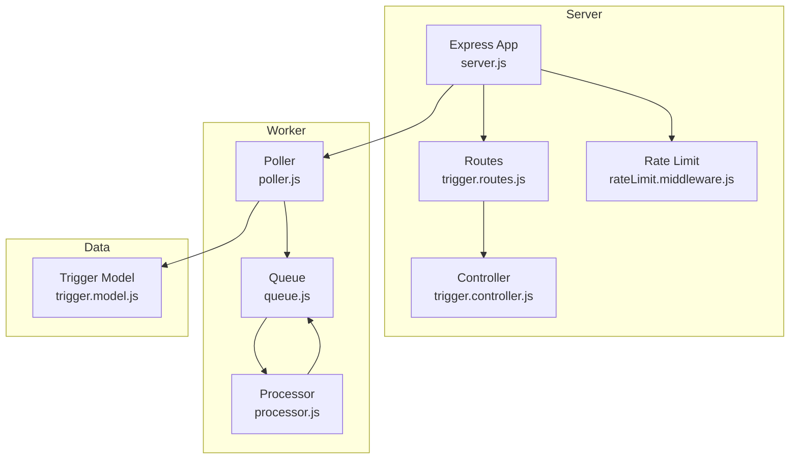
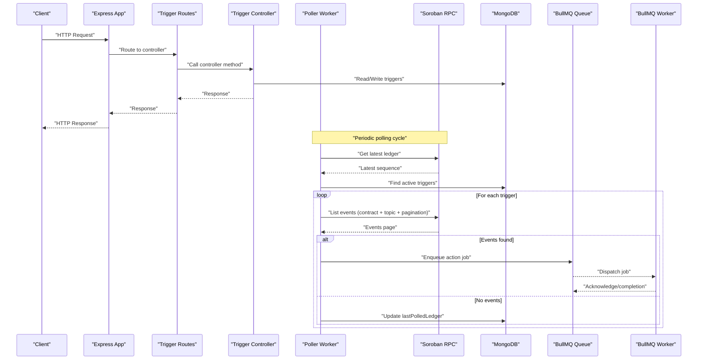
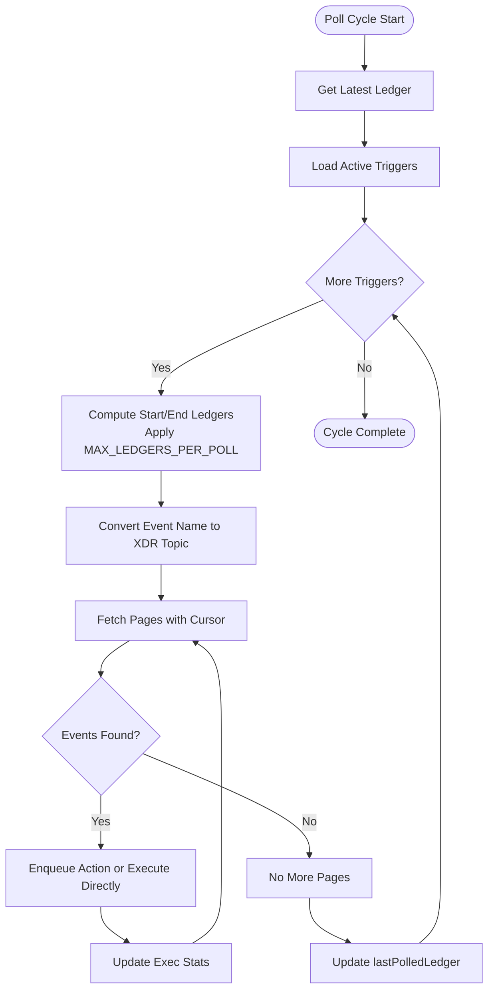
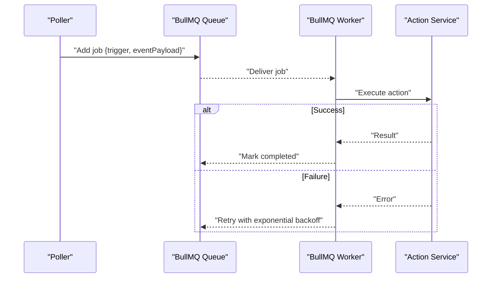
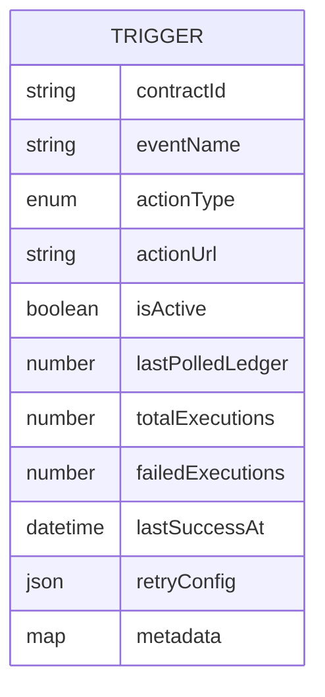
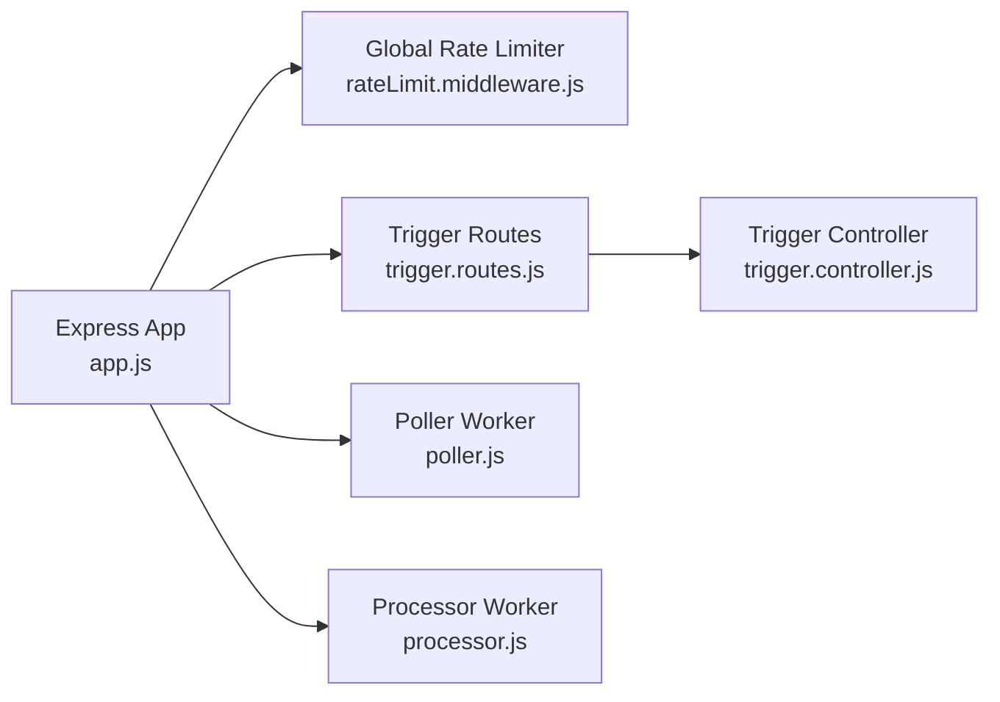
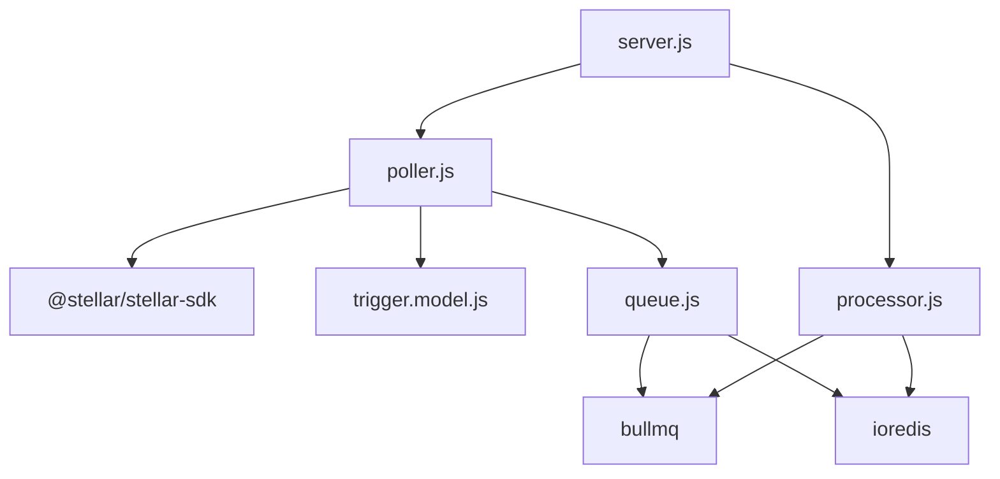

# Event Polling Mechanism

<cite>
**Referenced Files in This Document**
- [poller.js](file://backend/src/worker/poller.js)
- [queue.js](file://backend/src/worker/queue.js)
- [processor.js](file://backend/src/worker/processor.js)
- [trigger.model.js](file://backend/src/models/trigger.model.js)
- [server.js](file://backend/src/server.js)
- [trigger.controller.js](file://backend/src/controllers/trigger.controller.js)
- [trigger.routes.js](file://backend/src/routes/trigger.routes.js)
- [rateLimit.middleware.js](file://backend/src/middleware/rateLimit.middleware.js)
- [app.js](file://backend/src/app.js)
- [queue-usage.js](file://backend/examples/queue-usage.js)
</cite>

## Table of Contents
1. [Introduction](#introduction)
2. [Project Structure](#project-structure)
3. [Core Components](#core-components)
4. [Architecture Overview](#architecture-overview)
5. [Detailed Component Analysis](#detailed-component-analysis)
6. [Dependency Analysis](#dependency-analysis)
7. [Performance Considerations](#performance-considerations)
8. [Troubleshooting Guide](#troubleshooting-guide)
9. [Conclusion](#conclusion)
10. [Appendices](#appendices)

## Introduction
This document explains the event polling mechanism that monitors Soroban smart contract events and executes configured actions. It covers the sliding window polling approach, exponential backoff with retry logic for RPC calls, ledger sequence management, event filtering via XDR topic matching, pagination handling with cursors, and integration with Stellar Soroban RPC endpoints. It also documents polling configuration parameters, rate limiting controls, practical polling cycle examples, error handling strategies, and performance optimization techniques.

## Project Structure
The event polling system spans several modules:
- Poller worker: orchestrates periodic polling, manages ledger windows, paginates events, and dispatches actions.
- Queue and processor: optional background job processing for actions using BullMQ and Redis.
- Trigger model: stores trigger configurations, state, and execution metrics.
- Server bootstrap: initializes the API server, connects to MongoDB, starts the poller and optional worker.

**Diagram sources**
- [server.js:44-58](file://backend/src/server.js#L44-L58)
- [trigger.routes.js:1-92](file://backend/src/routes/trigger.routes.js#L1-L92)
- [trigger.controller.js:1-72](file://backend/src/controllers/trigger.controller.js#L1-L72)
- [rateLimit.middleware.js:1-50](file://backend/src/middleware/rateLimit.middleware.js#L1-L50)
- [poller.js:177-310](file://backend/src/worker/poller.js#L177-L310)
- [queue.js:19-121](file://backend/src/worker/queue.js#L19-L121)
- [processor.js:102-167](file://backend/src/worker/processor.js#L102-L167)
- [trigger.model.js:3-79](file://backend/src/models/trigger.model.js#L3-L79)

**Section sources**
- [server.js:44-58](file://backend/src/server.js#L44-L58)
- [trigger.routes.js:1-92](file://backend/src/routes/trigger.routes.js#L1-L92)
- [trigger.controller.js:1-72](file://backend/src/controllers/trigger.controller.js#L1-L72)
- [rateLimit.middleware.js:1-50](file://backend/src/middleware/rateLimit.middleware.js#L1-L50)
- [poller.js:177-310](file://backend/src/worker/poller.js#L177-L310)
- [queue.js:19-121](file://backend/src/worker/queue.js#L19-L121)
- [processor.js:102-167](file://backend/src/worker/processor.js#L102-L167)
- [trigger.model.js:3-79](file://backend/src/models/trigger.model.js#L3-L79)

## Core Components
- Poller worker: Periodically queries the Soroban RPC for contract events within a sliding ledger window per trigger, applies XDR topic filtering, paginates with cursors, and enqueues actions or executes them directly.
- Queue and Processor: Optional background job system using BullMQ and Redis to execute actions with retries, exponential backoff, and rate limiting.
- Trigger model: Stores trigger configuration, last polled ledger, execution statistics, and per-trigger retry settings.

Key responsibilities:
- Sliding window ledger management per trigger
- Exponential backoff for RPC calls and action execution
- XDR topic-based event filtering
- Pagination with cursor handling
- Rate limiting at the API level and job processing level

**Section sources**
- [poller.js:177-310](file://backend/src/worker/poller.js#L177-L310)
- [queue.js:19-121](file://backend/src/worker/queue.js#L19-L121)
- [processor.js:102-167](file://backend/src/worker/processor.js#L102-L167)
- [trigger.model.js:3-79](file://backend/src/models/trigger.model.js#L3-L79)

## Architecture Overview
The polling architecture integrates API endpoints, trigger persistence, a poller worker, and an optional queue/worker pipeline.

**Diagram sources**
- [server.js:44-58](file://backend/src/server.js#L44-L58)
- [trigger.routes.js:1-92](file://backend/src/routes/trigger.routes.js#L1-L92)
- [trigger.controller.js:1-72](file://backend/src/controllers/trigger.controller.js#L1-L72)
- [poller.js:177-310](file://backend/src/worker/poller.js#L177-L310)
- [queue.js:19-121](file://backend/src/worker/queue.js#L19-L121)
- [processor.js:102-167](file://backend/src/worker/processor.js#L102-L167)

## Detailed Component Analysis

### Poller Worker: Sliding Window, XDR Filtering, Pagination, and Retry Logic
The poller performs a complete polling cycle:
- Retrieves the network tip to cap the sliding window.
- Computes per-trigger start/end ledgers respecting MAX_LEDGERS_PER_POLL.
- Converts the event name to XDR for topic filtering.
- Paginates events using a cursor until fewer than the page size is returned.
- Enqueues actions or executes them directly, tracking execution stats.
- Updates lastPolledLedger upon successful completion.

Exponential backoff for RPC calls:
- Retries on network errors, 429 (rate limit), and 5xx server errors.
- Uses base delay and max retries configurable via environment variables.

Action execution backoff:
- Per-trigger retry configuration supports maxRetries and retryIntervalMs.

**Diagram sources**
- [poller.js:177-310](file://backend/src/worker/poller.js#L177-L310)

**Section sources**
- [poller.js:177-310](file://backend/src/worker/poller.js#L177-L310)
- [poller.js:27-51](file://backend/src/worker/poller.js#L27-L51)
- [poller.js:152-173](file://backend/src/worker/poller.js#L152-L173)

### Queue and Processor: Background Job Execution with Rate Limiting
The queue system:
- Uses BullMQ with Redis for reliable job processing.
- Configures job attempts with exponential backoff and TTL-based cleanup.
- Provides queue statistics and maintenance helpers.

The processor worker:
- Consumes jobs with concurrency control.
- Applies a rate limiter to throttle outbound calls.
- Logs job lifecycle events (completed, failed, error).

**Diagram sources**
- [queue.js:19-121](file://backend/src/worker/queue.js#L19-L121)
- [processor.js:102-167](file://backend/src/worker/processor.js#L102-L167)

**Section sources**
- [queue.js:19-121](file://backend/src/worker/queue.js#L19-L121)
- [processor.js:102-167](file://backend/src/worker/processor.js#L102-L167)

### Trigger Model: State and Metrics
The trigger model persists:
- Contract ID and event name for filtering.
- Action type and target URL/chat ID.
- Activation flag and last polled ledger.
- Execution metrics: totalExecutions, failedExecutions, lastSuccessAt.
- Per-trigger retry configuration.
- Health score and status computed virtually.

**Diagram sources**
- [trigger.model.js:3-79](file://backend/src/models/trigger.model.js#L3-L79)

**Section sources**
- [trigger.model.js:3-79](file://backend/src/models/trigger.model.js#L3-L79)

### API Integration and Rate Limiting
- The Express app mounts rate limit middleware globally and for authentication endpoints.
- Trigger CRUD endpoints are exposed via dedicated routes and controllers.
- The server initializes the poller and optionally the BullMQ worker during startup.

**Diagram sources**
- [app.js:16-53](file://backend/src/app.js#L16-L53)
- [rateLimit.middleware.js:1-50](file://backend/src/middleware/rateLimit.middleware.js#L1-L50)
- [trigger.routes.js:1-92](file://backend/src/routes/trigger.routes.js#L1-L92)
- [trigger.controller.js:1-72](file://backend/src/controllers/trigger.controller.js#L1-L72)
- [server.js:44-58](file://backend/src/server.js#L44-L58)

**Section sources**
- [app.js:16-53](file://backend/src/app.js#L16-L53)
- [rateLimit.middleware.js:1-50](file://backend/src/middleware/rateLimit.middleware.js#L1-L50)
- [trigger.routes.js:1-92](file://backend/src/routes/trigger.routes.js#L1-L92)
- [trigger.controller.js:1-72](file://backend/src/controllers/trigger.controller.js#L1-L72)
- [server.js:44-58](file://backend/src/server.js#L44-L58)

## Dependency Analysis
- Poller depends on:
  - @stellar/stellar-sdk for RPC connectivity and XDR conversion.
  - Trigger model for state and configuration.
  - Queue module for background processing (optional).
- Queue depends on BullMQ and ioredis.
- Processor depends on BullMQ and Redis connection.
- Server composes routes, controllers, poller, and optional worker.

**Diagram sources**
- [poller.js:1-8](file://backend/src/worker/poller.js#L1-L8)
- [trigger.model.js:1](file://backend/src/models/trigger.model.js#L1)
- [queue.js:1-3](file://backend/src/worker/queue.js#L1-L3)
- [processor.js:1-7](file://backend/src/worker/processor.js#L1-L7)
- [server.js:44-58](file://backend/src/server.js#L44-L58)

**Section sources**
- [poller.js:1-8](file://backend/src/worker/poller.js#L1-L8)
- [queue.js:1-3](file://backend/src/worker/queue.js#L1-L3)
- [processor.js:1-7](file://backend/src/worker/processor.js#L1-L7)
- [server.js:44-58](file://backend/src/server.js#L44-L58)

## Performance Considerations
- Sliding window size: Control MAX_LEDGERS_PER_POLL to balance latency and throughput.
- Polling interval: Tune POLL_INTERVAL_MS to match network activity and resource constraints.
- Inter-trigger delay: Use INTER_TRIGGER_DELAY_MS to distribute RPC load across triggers.
- Inter-page delay: Use INTER_PAGE_DELAY_MS to avoid rate limits during pagination.
- Queue concurrency: Adjust WORKER_CONCURRENCY to match downstream service capacity.
- Rate limiting: Configure BullMQ limiter (max per duration) to prevent throttling.
- Backoff tuning: Set RPC_BASE_DELAY_MS and RPC_MAX_RETRIES to handle transient failures efficiently.

[No sources needed since this section provides general guidance]

## Troubleshooting Guide
Common issues and strategies:
- Network timeouts and rate limits:
  - The RPC retry function handles timeouts and 429/5xx errors with exponential backoff.
  - Increase RPC_MAX_RETRIES and RPC_BASE_DELAY_MS if the network is slow or throttling occurs.
- Ledger gaps:
  - The poller computes endLedger as min(start + MAX_LEDGERS_PER_POLL, latestLedgerSequence).
  - If gaps persist, reduce MAX_LEDGERS_PER_POLL to process smaller windows more frequently.
- Event duplication:
  - The poller updates lastPolledLedger only on successful completion of a trigger’s work.
  - If a trigger fails mid-cycle, lastPolledLedger is not updated, ensuring no gap but potential reprocessing.
- Action failures:
  - Per-trigger executeWithRetry uses trigger.retryConfig to retry failed actions.
  - Monitor failedExecutions and healthScore to detect unhealthy triggers.
- Queue backlog:
  - Use getQueueStats to observe waiting/active/completed/failed counts.
  - Scale WORKER_CONCURRENCY or adjust rate limiter settings to improve throughput.

**Section sources**
- [poller.js:27-51](file://backend/src/worker/poller.js#L27-L51)
- [poller.js:152-173](file://backend/src/worker/poller.js#L152-L173)
- [trigger.model.js:64-77](file://backend/src/models/trigger.model.js#L64-L77)
- [queue.js:126-143](file://backend/src/worker/queue.js#L126-L143)

## Conclusion
The event polling mechanism combines a robust sliding window approach with exponential backoff, precise XDR topic filtering, and pagination-aware event retrieval. It integrates seamlessly with optional background job processing to scale action execution while maintaining reliability. Proper configuration of polling parameters and rate limiting ensures efficient operation under varying network conditions.

[No sources needed since this section summarizes without analyzing specific files]

## Appendices

### Polling Configuration Parameters
- SOROBAN_RPC_URL: Soroban RPC endpoint (default: testnet).
- RPC_TIMEOUT_MS: RPC request timeout.
- MAX_LEDGERS_PER_POLL: Maximum ledgers scanned per cycle per trigger.
- RPC_MAX_RETRIES: Maximum RPC retries with exponential backoff.
- RPC_BASE_DELAY_MS: Base delay for RPC exponential backoff.
- POLL_INTERVAL_MS: Interval between polling cycles.
- INTER_TRIGGER_DELAY_MS: Delay between processing different triggers.
- INTER_PAGE_DELAY_MS: Delay between pagination pages.
- REDIS_HOST, REDIS_PORT, REDIS_PASSWORD: Redis connection for queue/worker.
- WORKER_CONCURRENCY: Concurrency for the BullMQ worker.
- RATE_LIMIT_WINDOW_MS, RATE_LIMIT_MAX: Global rate limit window and quota.
- AUTH_RATE_LIMIT_WINDOW_MS, AUTH_RATE_LIMIT_MAX: Authentication-specific rate limits.

**Section sources**
- [poller.js:5-15](file://backend/src/worker/poller.js#L5-L15)
- [poller.js:312-329](file://backend/src/worker/poller.js#L312-L329)
- [processor.js:9-12](file://backend/src/worker/processor.js#L9-L12)
- [rateLimit.middleware.js:31-45](file://backend/src/middleware/rateLimit.middleware.js#L31-L45)
- [server.js:44-58](file://backend/src/server.js#L44-L58)

### Practical Examples
- Creating a trigger via API:
  - Endpoint: POST /api/triggers with body containing contractId, eventName, actionType, actionUrl.
  - See route and controller definitions for request/response shapes.
- Enqueueing actions:
  - Use enqueueAction with trigger and eventPayload.
  - Examples demonstrate enqueueing email and webhook actions.
- Monitoring queue stats:
  - Use getQueueStats to inspect waiting, active, completed, failed, and delayed job counts.

**Section sources**
- [trigger.routes.js:57-62](file://backend/src/routes/trigger.routes.js#L57-L62)
- [trigger.controller.js:6-28](file://backend/src/controllers/trigger.controller.js#L6-L28)
- [queue-usage.js:43-91](file://backend/examples/queue-usage.js#L43-L91)
- [queue.js:126-143](file://backend/src/worker/queue.js#L126-L143)