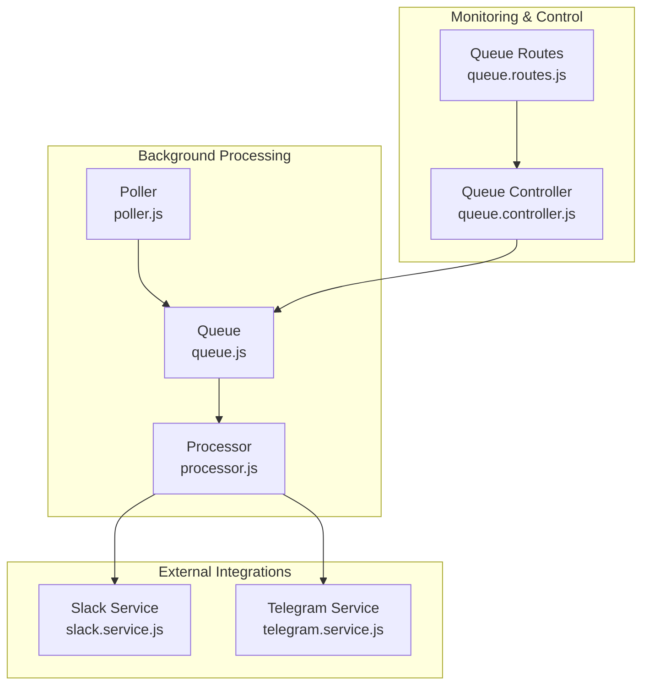
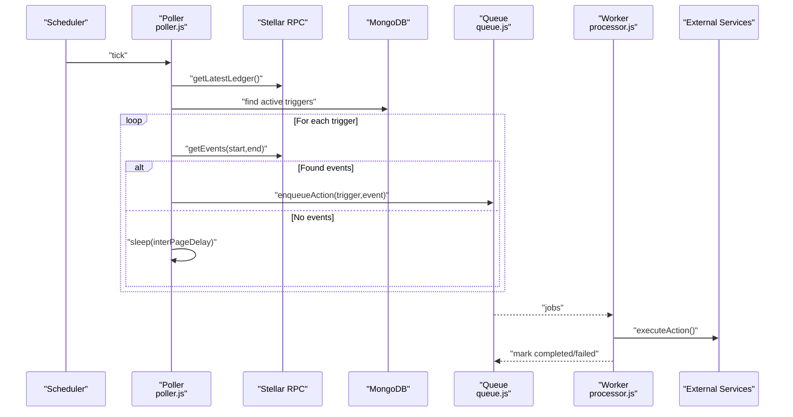
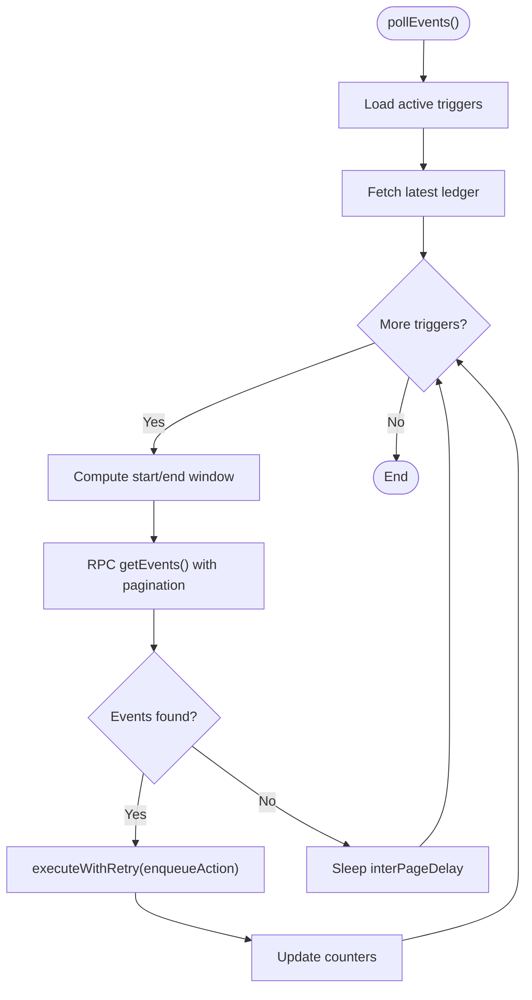
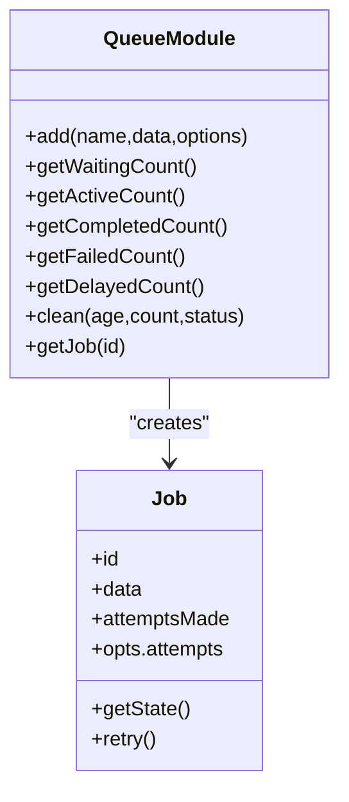
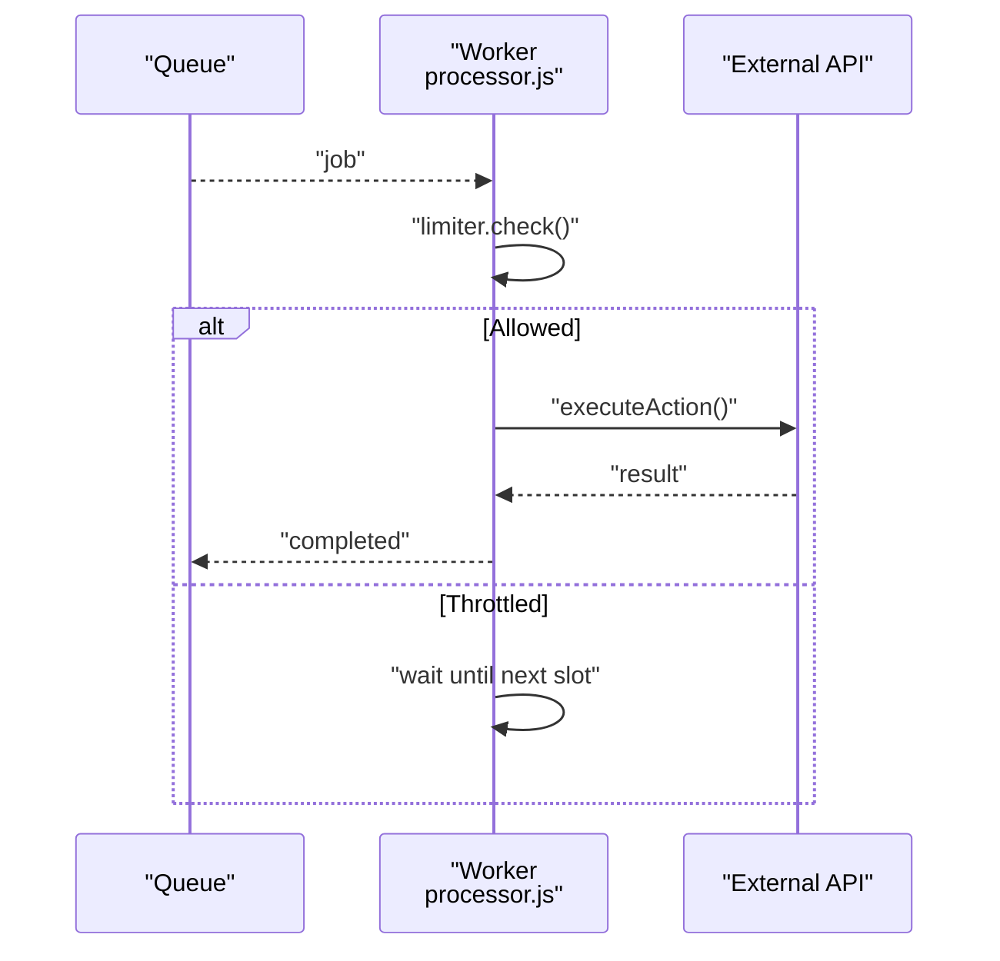
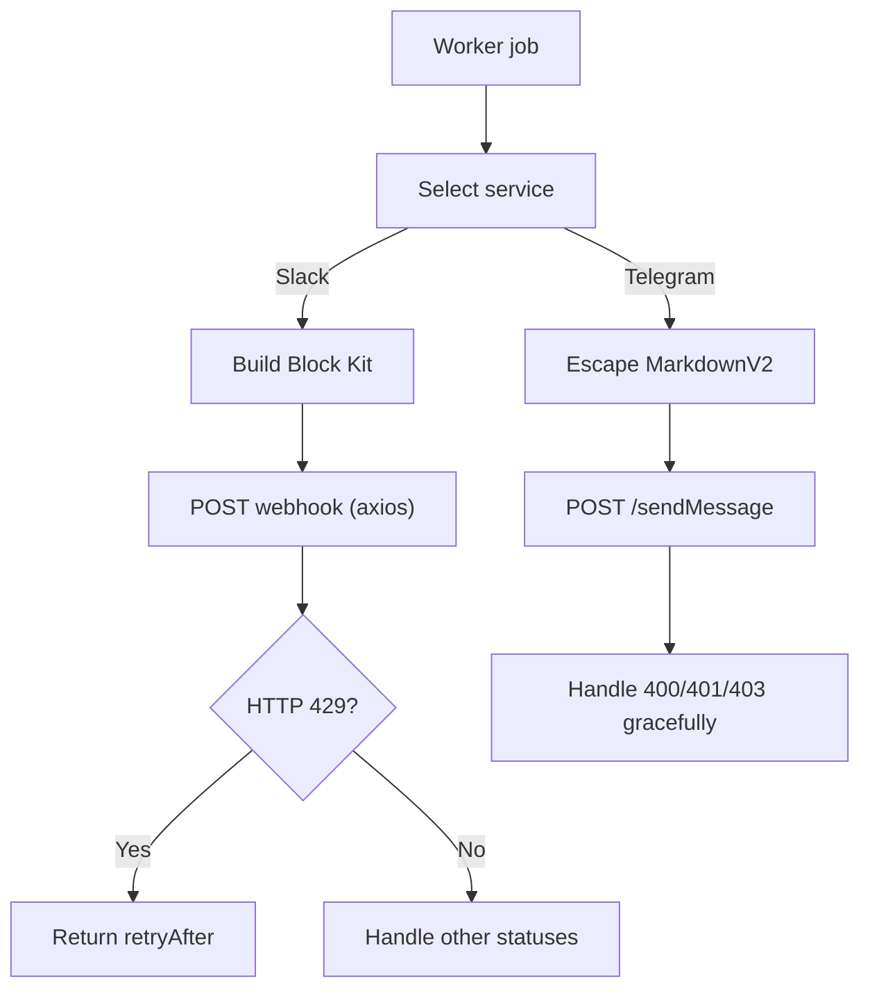
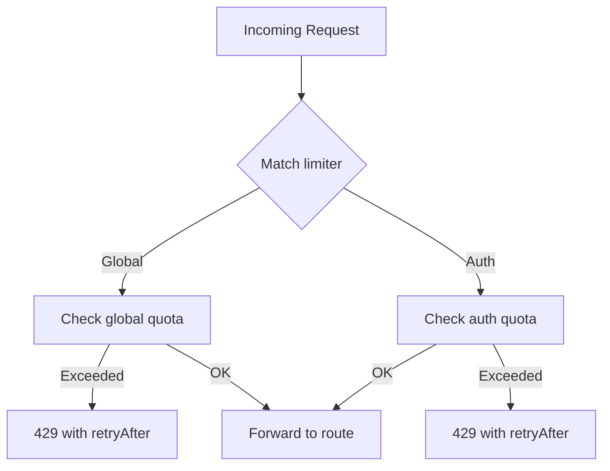
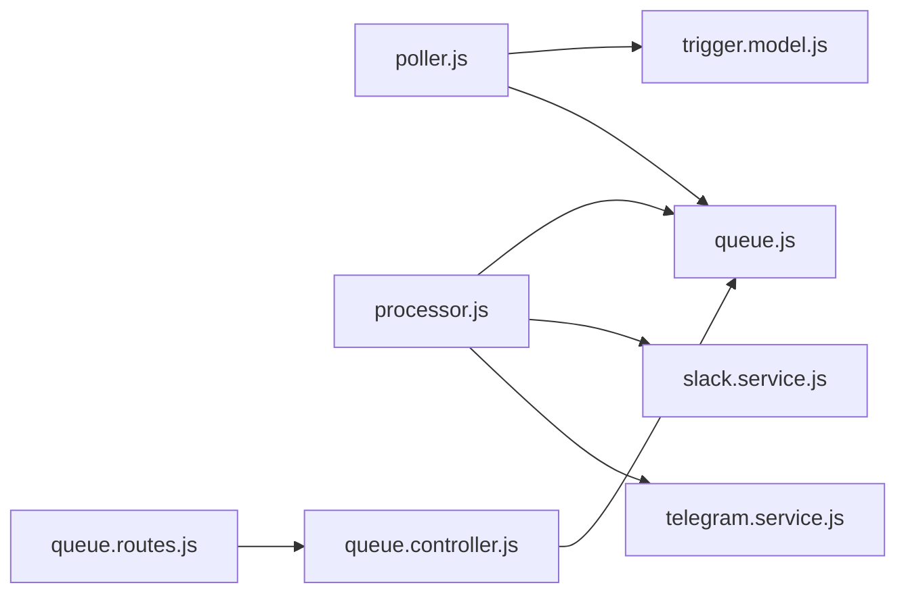

# Performance Optimization

<cite>
**Referenced Files in This Document**
- [poller.js](file://backend/src/worker/poller.js)
- [processor.js](file://backend/src/worker/processor.js)
- [queue.js](file://backend/src/worker/queue.js)
- [rateLimit.middleware.js](file://backend/src/middleware/rateLimit.middleware.js)
- [slack.service.js](file://backend/src/services/slack.service.js)
- [telegram.service.js](file://backend/src/services/telegram.service.js)
- [queue.controller.js](file://backend/src/controllers/queue.controller.js)
- [queue.routes.js](file://backend/src/routes/queue.routes.js)
- [logger.js](file://backend/src/config/logger.js)
- [trigger.model.js](file://backend/src/models/trigger.model.js)
- [queue-usage.js](file://backend/examples/queue-usage.js)
- [queue.test.js](file://backend/__tests__/queue.test.js)
- [slack.test.js](file://backend/__tests__/slack.test.js)
- [telegram.test.js](file://backend/__tests__/telegram.test.js)
- [package.json](file://backend/package.json)
</cite>

## Table of Contents
1. [Introduction](#introduction)
2. [Project Structure](#project-structure)
3. [Core Components](#core-components)
4. [Architecture Overview](#architecture-overview)
5. [Detailed Component Analysis](#detailed-component-analysis)
6. [Dependency Analysis](#dependency-analysis)
7. [Performance Considerations](#performance-considerations)
8. [Troubleshooting Guide](#troubleshooting-guide)
9. [Conclusion](#conclusion)
10. [Appendices](#appendices)

## Introduction
This document provides a comprehensive guide to performance optimization for the background processing system. It focuses on rate limiting strategies, exponential backoff algorithms, concurrency control, resource utilization, polling interval tuning, batch processing, queue monitoring, and operational best practices for high-throughput scenarios. Practical examples and troubleshooting guidance are included to help identify bottlenecks and scale effectively.

## Project Structure
The background processing system is composed of:
- Poller: Periodically queries Stellar Soroban events and dispatches actions.
- Queue: Background job processing powered by BullMQ and Redis.
- Processor: Worker(s) consuming jobs from the queue with concurrency and rate limiting.
- External Services: Slack, Telegram, and generic webhooks.
- Monitoring: Queue statistics and job lifecycle APIs.
- Rate Limiting: Express-based rate limiting for inbound traffic.

**Diagram sources**
- [poller.js:177-310](file://backend/src/worker/poller.js#L177-L310)
- [queue.js:19-41](file://backend/src/worker/queue.js#L19-L41)
- [processor.js:102-168](file://backend/src/worker/processor.js#L102-L168)
- [slack.service.js:97-134](file://backend/src/services/slack.service.js#L97-L134)
- [telegram.service.js:15-57](file://backend/src/services/telegram.service.js#L15-L57)
- [queue.controller.js:7-21](file://backend/src/controllers/queue.controller.js#L7-L21)
- [queue.routes.js:37-101](file://backend/src/routes/queue.routes.js#L37-L101)

**Section sources**
- [poller.js:177-310](file://backend/src/worker/poller.js#L177-L310)
- [queue.js:19-41](file://backend/src/worker/queue.js#L19-L41)
- [processor.js:102-168](file://backend/src/worker/processor.js#L102-L168)
- [queue.controller.js:7-21](file://backend/src/controllers/queue.controller.js#L7-L21)
- [queue.routes.js:37-101](file://backend/src/routes/queue.routes.js#L37-L101)

## Core Components
- Poller: Implements sliding ledger window polling, pagination, exponential backoff for RPC calls, inter-trigger/page delays, and optional background queue dispatch.
- Queue: Centralized job storage with retry/backoff, job retention policies, and statistics.
- Processor: Worker with concurrency and per-interval rate limiting to external APIs.
- External Services: Robust HTTP clients with explicit error handling and rate limit awareness.
- Monitoring: REST endpoints to inspect queue state and manage jobs.

Key performance-relevant configurations:
- Poller: Poll interval, max ledgers per poll, RPC retries and delays, inter-trigger and inter-page delays.
- Queue: Default job attempts, exponential backoff delay, retention windows.
- Processor: Concurrency, per-interval job rate limit.

**Section sources**
- [poller.js:11-16](file://backend/src/worker/poller.js#L11-L16)
- [poller.js:27-51](file://backend/src/worker/poller.js#L27-L51)
- [poller.js:313-323](file://backend/src/worker/poller.js#L313-L323)
- [queue.js:23-36](file://backend/src/worker/queue.js#L23-L36)
- [processor.js:128-135](file://backend/src/worker/processor.js#L128-L135)
- [processor.js:12-12](file://backend/src/worker/processor.js#L12-L12)

## Architecture Overview
The system separates concerns between event discovery and background processing:
- Poller runs periodically to scan for new events and enqueues actions.
- Queue persists jobs and decouples producers from consumers.
- Processor workers consume jobs concurrently with controlled rate limiting.

**Diagram sources**
- [poller.js:177-310](file://backend/src/worker/poller.js#L177-L310)
- [queue.js:91-121](file://backend/src/worker/queue.js#L91-L121)
- [processor.js:25-97](file://backend/src/worker/processor.js#L25-L97)

## Detailed Component Analysis

### Poller: Event Discovery and Dispatch
- Sliding window polling capped by max ledgers per poll.
- Pagination with inter-page delay to avoid rate limits.
- Exponential backoff for RPC calls with retry conditions.
- Optional fallback to direct execution if queue is unavailable.
- Per-trigger retry with configurable intervals.

**Diagram sources**
- [poller.js:177-310](file://backend/src/worker/poller.js#L177-L310)
- [poller.js:27-51](file://backend/src/worker/poller.js#L27-L51)
- [poller.js:152-173](file://backend/src/worker/poller.js#L152-L173)

Practical tuning tips:
- Increase inter-page delay under rate-limited RPC responses.
- Adjust max ledgers per poll to balance freshness vs. load.
- Tune poll interval for target throughput and latency targets.

**Section sources**
- [poller.js:11-16](file://backend/src/worker/poller.js#L11-L16)
- [poller.js:177-310](file://backend/src/worker/poller.js#L177-L310)
- [poller.js:27-51](file://backend/src/worker/poller.js#L27-L51)
- [poller.js:152-173](file://backend/src/worker/poller.js#L152-L173)

### Queue: Background Job Management
- Default job attempts and exponential backoff.
- Retention policies for completed/failed jobs.
- Queue statistics and job lifecycle APIs.
- Priority-based job ordering.

**Diagram sources**
- [queue.js:43-83](file://backend/src/worker/queue.js#L43-L83)
- [queue.js:126-143](file://backend/src/worker/queue.js#L126-L143)

Operational controls:
- Use queue routes to inspect stats and manage jobs.
- Clean old jobs to control Redis memory growth.

**Section sources**
- [queue.js:23-36](file://backend/src/worker/queue.js#L23-L36)
- [queue.js:126-143](file://backend/src/worker/queue.js#L126-L143)
- [queue.controller.js:7-21](file://backend/src/controllers/queue.controller.js#L7-L21)
- [queue.routes.js:37-101](file://backend/src/routes/queue.routes.js#L37-L101)

### Processor: Worker Concurrency and Rate Limiting
- Concurrency controls parallelism.
- Built-in rate limiter throttles job processing per time window.
- Comprehensive error logging and job lifecycle events.

**Diagram sources**
- [processor.js:102-168](file://backend/src/worker/processor.js#L102-L168)

Tuning guidance:
- Increase concurrency cautiously; monitor external API quotas.
- Adjust limiter max/duration to match provider limits.

**Section sources**
- [processor.js:128-135](file://backend/src/worker/processor.js#L128-L135)
- [processor.js:12-12](file://backend/src/worker/processor.js#L12-L12)

### External API Services: Slack and Telegram
- Slack: Block Kit payload building and HTTP posting with explicit 429 handling and structured error reporting.
- Telegram: Message sending with MarkdownV2 escaping and graceful error handling.

**Diagram sources**
- [slack.service.js:13-88](file://backend/src/services/slack.service.js#L13-L88)
- [slack.service.js:97-134](file://backend/src/services/slack.service.js#L97-L134)
- [telegram.service.js:15-57](file://backend/src/services/telegram.service.js#L15-L57)

Best practices:
- Respect provider rate limits; honor retry-after headers.
- Sanitize payloads to avoid escaping/markdown issues.

**Section sources**
- [slack.service.js:13-88](file://backend/src/services/slack.service.js#L13-L88)
- [slack.service.js:97-134](file://backend/src/services/slack.service.js#L97-L134)
- [telegram.service.js:15-57](file://backend/src/services/telegram.service.js#L15-L57)

### Rate Limiting Middleware
- Global and auth-specific rate limiters with configurable windows and caps.
- Structured responses with retry-after hints.

**Diagram sources**
- [rateLimit.middleware.js:31-45](file://backend/src/middleware/rateLimit.middleware.js#L31-L45)

**Section sources**
- [rateLimit.middleware.js:31-45](file://backend/src/middleware/rateLimit.middleware.js#L31-L45)

## Dependency Analysis
- Poller depends on RPC client, MongoDB triggers, and optionally the queue module.
- Queue depends on Redis; worker depends on Redis and external services.
- Controllers and routes depend on queue availability and expose monitoring endpoints.

**Diagram sources**
- [poller.js:1-3](file://backend/src/worker/poller.js#L1-L3)
- [queue.js:1-3](file://backend/src/worker/queue.js#L1-L3)
- [processor.js:1-7](file://backend/src/worker/processor.js#L1-L7)
- [queue.controller.js:1-2](file://backend/src/controllers/queue.controller.js#L1-L2)
- [queue.routes.js:1-3](file://backend/src/routes/queue.routes.js#L1-L3)

**Section sources**
- [poller.js:1-3](file://backend/src/worker/poller.js#L1-L3)
- [queue.js:1-3](file://backend/src/worker/queue.js#L1-L3)
- [processor.js:1-7](file://backend/src/worker/processor.js#L1-L7)
- [queue.controller.js:1-2](file://backend/src/controllers/queue.controller.js#L1-L2)
- [queue.routes.js:1-3](file://backend/src/routes/queue.routes.js#L1-L3)

## Performance Considerations

### Rate Limiting Strategies
- Inbound traffic: Configure global and auth rate limiters with appropriate windows and max values.
- Outbound traffic: Respect provider rate limits; honor retry-after headers and implement exponential backoff.
- Queue processing: Use built-in limiter to throttle job execution per time window.

Tuning guidelines:
- Start conservative; increase max per window gradually while monitoring 429 occurrences.
- Align retry-after with exponential backoff to reduce contention.

**Section sources**
- [rateLimit.middleware.js:31-45](file://backend/src/middleware/rateLimit.middleware.js#L31-L45)
- [slack.service.js:112-116](file://backend/src/services/slack.service.js#L112-L116)
- [processor.js:128-135](file://backend/src/worker/processor.js#L128-L135)

### Exponential Backoff Algorithms
- Poller RPC calls: Exponential backoff with jitter-like progression based on attempt index.
- Queue jobs: Default exponential backoff with fixed delay; tune delay for provider constraints.

Recommendations:
- Use base delay aligned to provider burst capacity.
- Combine with jitter to avoid thundering herd effects.

**Section sources**
- [poller.js:27-51](file://backend/src/worker/poller.js#L27-L51)
- [queue.js:25-28](file://backend/src/worker/queue.js#L25-L28)

### Concurrency Control for External API Calls
- Worker concurrency: Scale up or down based on external API capacity and latency.
- Per-interval rate limiting: Prevent bursts within a time window.

Guidance:
- Monitor external API latency and error rates; adjust concurrency accordingly.
- Use rate limiter max/duration to align with provider limits.

**Section sources**
- [processor.js:12-12](file://backend/src/worker/processor.js#L12-L12)
- [processor.js:128-135](file://backend/src/worker/processor.js#L128-L135)

### Memory Management and CPU Optimization
- Queue retention: Configure completed/failed job retention to cap memory usage.
- Logging: Use logger abstraction to minimize overhead in production.
- Payload size: Cap payload sizes for external services to avoid timeouts and excessive memory.

Practices:
- Regularly clean old jobs to keep Redis memory bounded.
- Avoid logging large payloads in production.

**Section sources**
- [queue.js:29-35](file://backend/src/worker/queue.js#L29-L35)
- [logger.js:1-19](file://backend/src/config/logger.js#L1-L19)

### Polling Interval Tuning and Batch Processing
- Poll interval: Balance responsiveness vs. RPC load.
- Max ledgers per poll: Prevent scanning too far back; reduce churn.
- Inter-page delay: Smooth out RPC usage and reduce rate limit risk.

Batching:
- Process events in pages; apply inter-page delays.
- Use trigger-level retry intervals to avoid tight loops.

**Section sources**
- [poller.js:11-16](file://backend/src/worker/poller.js#L11-L16)
- [poller.js:313-323](file://backend/src/worker/poller.js#L313-L323)

### Queue Performance Monitoring
- Use queue routes to fetch stats and job lists.
- Track waiting, active, completed, failed, delayed counts.
- Clean old jobs to maintain healthy queue metrics.

**Section sources**
- [queue.controller.js:7-21](file://backend/src/controllers/queue.controller.js#L7-L21)
- [queue.routes.js:37-101](file://backend/src/routes/queue.routes.js#L37-L101)

### Practical Examples and Load Testing Methodologies
- Queue usage examples demonstrate enqueueing, monitoring, and job inspection.
- Tests validate queue behavior and payload construction.

Methodology:
- Start with small concurrency and gradually ramp up.
- Measure queue depth, job completion times, and external API error rates.
- Use synthetic loads to simulate peak event frequency.

**Section sources**
- [queue-usage.js:87-102](file://backend/examples/queue-usage.js#L87-L102)
- [queue.test.js:23-68](file://backend/__tests__/queue.test.js#L23-L68)
- [slack.test.js:4-31](file://backend/__tests__/slack.test.js#L4-L31)
- [telegram.test.js:4-23](file://backend/__tests__/telegram.test.js#L4-L23)

## Troubleshooting Guide
Common issues and resolutions:
- Rate limit exceeded (429): Honor retry-after; implement exponential backoff; reduce concurrency or rate limiter settings.
- External API errors: Inspect structured error responses; handle provider-specific codes.
- Queue backlog: Increase worker concurrency; adjust rate limiter; clean old jobs.
- Memory pressure: Reduce retention windows; avoid logging large payloads.
- Poller stalls: Verify RPC connectivity; adjust inter-page delay; confirm trigger state updates.

Monitoring signals:
- Queue stats: Use queue routes to observe growth trends.
- Worker logs: Track completed/failed events and errors.
- Trigger model: Use health score and status to assess reliability.

**Section sources**
- [slack.service.js:112-134](file://backend/src/services/slack.service.js#L112-L134)
- [telegram.service.js:30-57](file://backend/src/services/telegram.service.js#L30-L57)
- [queue.controller.js:7-21](file://backend/src/controllers/queue.controller.js#L7-L21)
- [trigger.model.js:64-77](file://backend/src/models/trigger.model.js#L64-L77)

## Conclusion
The system’s performance hinges on balanced polling cadence, robust retry/backoff, controlled concurrency, and effective queue monitoring. By tuning poll intervals, leveraging exponential backoff, applying rate limits, and maintaining queue hygiene, you can achieve high throughput while preserving reliability and avoiding provider throttling.

## Appendices

### Environment Variables and Defaults
- Poller: Poll interval, max ledgers per poll, RPC retries, base delay, inter-trigger delay, inter-page delay.
- Queue: Default attempts, exponential backoff delay, retention windows.
- Processor: Worker concurrency, Redis connection settings.
- Rate limiting: Global and auth window/max/message.

**Section sources**
- [poller.js:5-16](file://backend/src/worker/poller.js#L5-L16)
- [poller.js:313-323](file://backend/src/worker/poller.js#L313-L323)
- [queue.js:23-36](file://backend/src/worker/queue.js#L23-L36)
- [processor.js:9-12](file://backend/src/worker/processor.js#L9-L12)
- [rateLimit.middleware.js:31-45](file://backend/src/middleware/rateLimit.middleware.js#L31-L45)

### Dependencies Overview
- Core runtime and libraries include BullMQ, ioredis, Axios, and Express.

**Section sources**
- [package.json:10-22](file://backend/package.json#L10-L22)