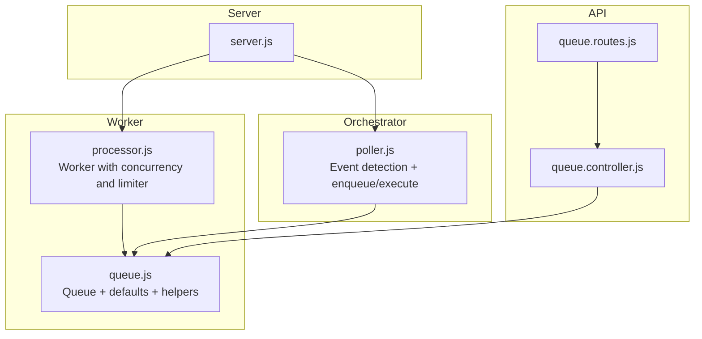
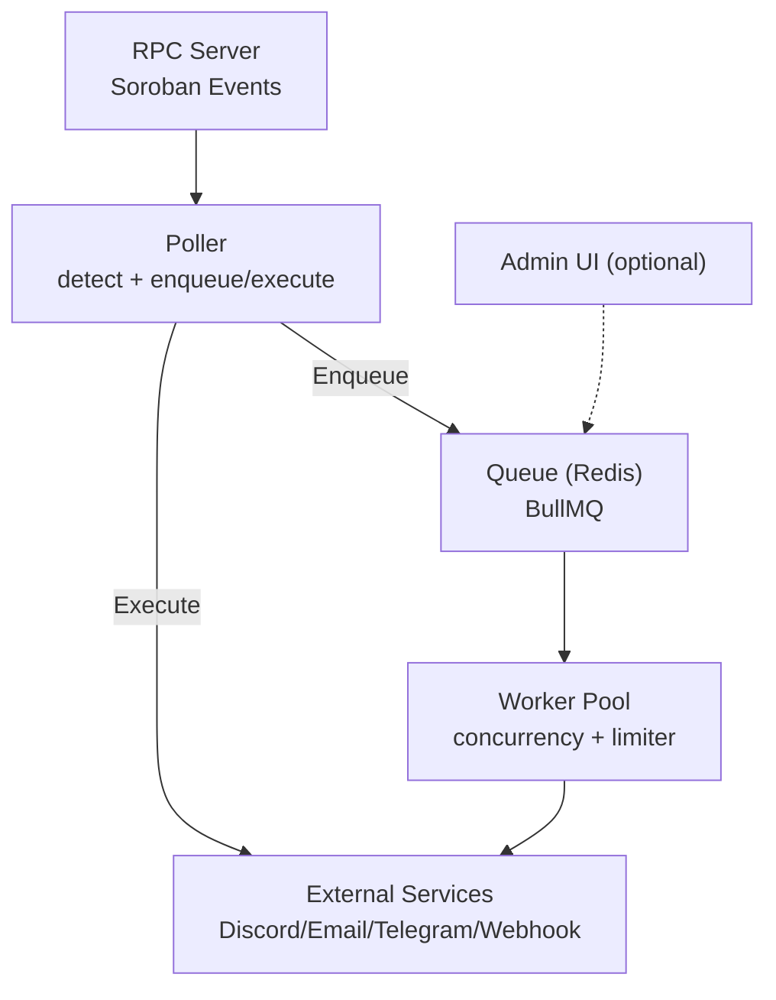
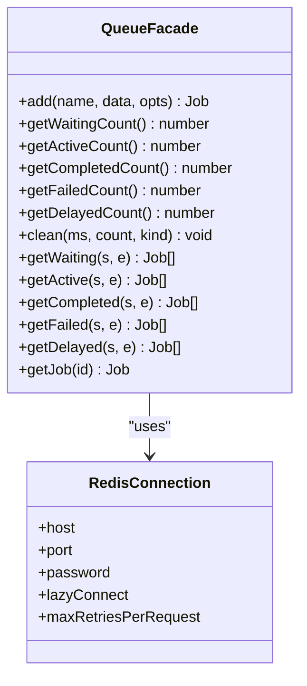
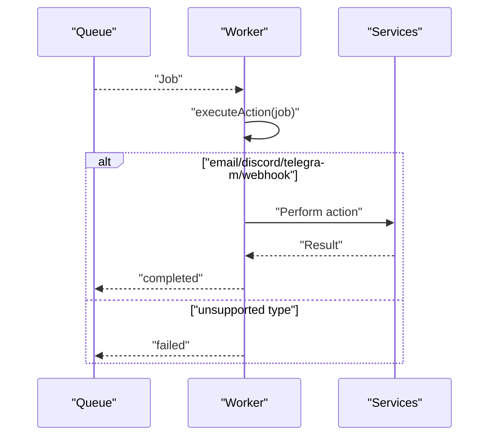
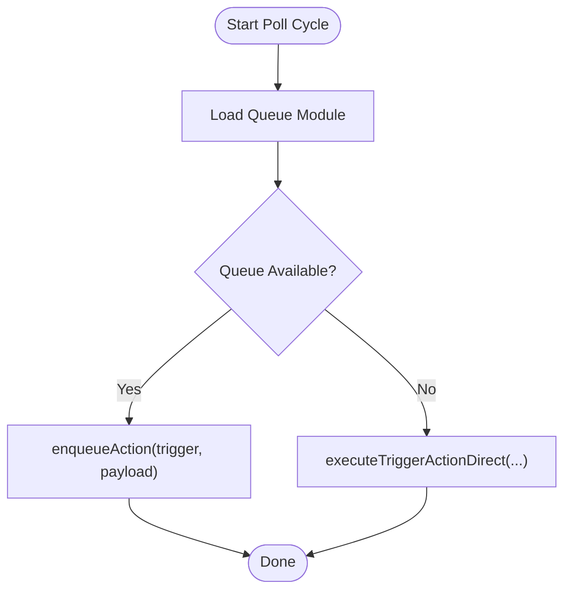
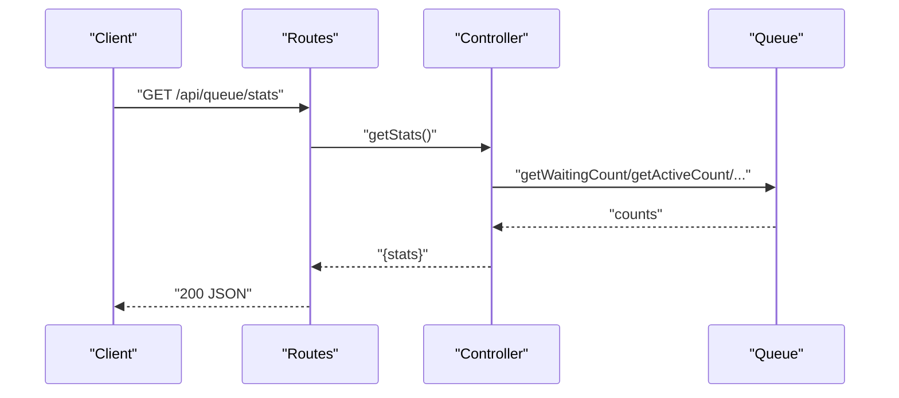
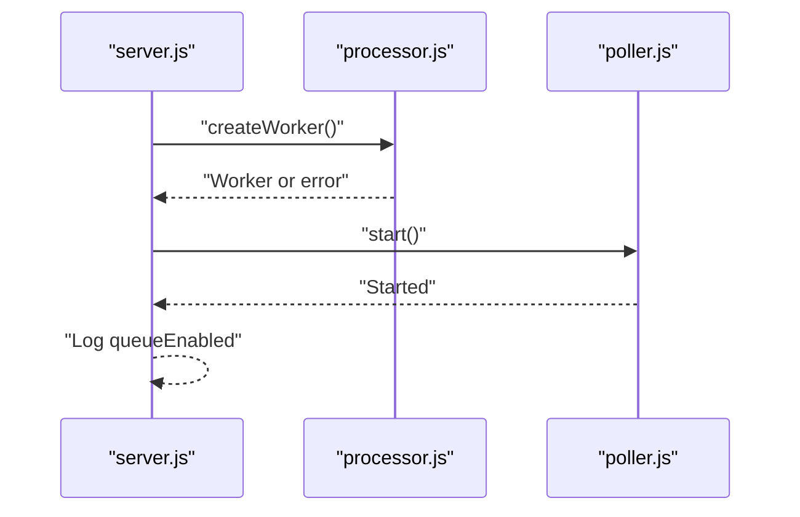
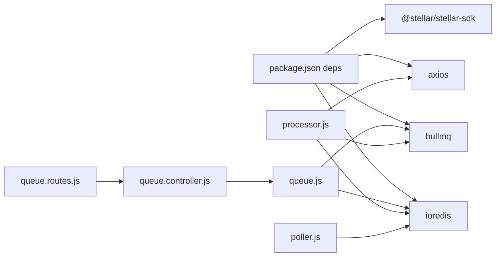

# Queue System Management

<cite>
**Referenced Files in This Document**
- [queue.js](file://backend/src/worker/queue.js)
- [processor.js](file://backend/src/worker/processor.js)
- [poller.js](file://backend/src/worker/poller.js)
- [queue.controller.js](file://backend/src/controllers/queue.controller.js)
- [queue.routes.js](file://backend/src/routes/queue.routes.js)
- [server.js](file://backend/src/server.js)
- [queue-usage.js](file://backend/examples/queue-usage.js)
- [QUICKSTART_QUEUE.md](file://backend/QUICKSTART_QUEUE.md)
- [QUEUE_SETUP.md](file://backend/QUEUE_SETUP.md)
- [REDIS_OPTIONAL.md](file://backend/REDIS_OPTIONAL.md)
- [trigger.model.js](file://backend/src/models/trigger.model.js)
- [queue.test.js](file://backend/__tests__/queue.test.js)
- [package.json](file://backend/package.json)
</cite>

## Table of Contents
1. [Introduction](#introduction)
2. [Project Structure](#project-structure)
3. [Core Components](#core-components)
4. [Architecture Overview](#architecture-overview)
5. [Detailed Component Analysis](#detailed-component-analysis)
6. [Dependency Analysis](#dependency-analysis)
7. [Performance Considerations](#performance-considerations)
8. [Troubleshooting Guide](#troubleshooting-guide)
9. [Conclusion](#conclusion)
10. [Appendices](#appendices)

## Introduction
This document explains the queue system management built with BullMQ and Redis. It covers queue initialization, job creation and enqueuing, Redis integration, graceful fallback when Redis is unavailable, direct execution mode, configuration options, job prioritization and retry policies, monitoring and statistics, and practical examples for setup and scaling. It also documents persistence, lifecycle management, and operational guidance for high-throughput environments.

## Project Structure
The queue system spans several modules:
- Worker queue initializer and job utilities
- Worker processor that executes jobs with retries and concurrency
- Event poller that detects events and enqueues or executes actions
- Queue controller and routes for monitoring and maintenance
- Server bootstrap that conditionally starts the worker and initializes the poller
- Examples and documentation for quick start and optional Redis behavior

**Diagram sources**
- [server.js:1-88](file://backend/src/server.js#L1-L88)
- [processor.js:1-174](file://backend/src/worker/processor.js#L1-L174)
- [queue.js:1-164](file://backend/src/worker/queue.js#L1-L164)
- [poller.js:1-335](file://backend/src/worker/poller.js#L1-L335)
- [queue.routes.js:1-104](file://backend/src/routes/queue.routes.js#L1-L104)
- [queue.controller.js:1-142](file://backend/src/controllers/queue.controller.js#L1-L142)

**Section sources**
- [server.js:1-88](file://backend/src/server.js#L1-L88)
- [processor.js:1-174](file://backend/src/worker/processor.js#L1-L174)
- [queue.js:1-164](file://backend/src/worker/queue.js#L1-L164)
- [poller.js:1-335](file://backend/src/worker/poller.js#L1-L335)
- [queue.routes.js:1-104](file://backend/src/routes/queue.routes.js#L1-L104)
- [queue.controller.js:1-142](file://backend/src/controllers/queue.controller.js#L1-L142)

## Core Components
- Queue initialization and defaults: centralized Redis connection and BullMQ queue with default job options (attempts, backoff, retention).
- Worker processor: BullMQ worker with concurrency and rate limiting, logging on completion/failure/error.
- Poller: detects Soroban events, enqueues actions (background) or executes directly (fallback), with per-trigger retry logic.
- Queue controller and routes: expose monitoring endpoints guarded by availability checks.
- Server bootstrap: conditionally starts the worker and logs queue availability.

Key behaviors:
- Redis availability determines whether the queue system is enabled.
- When Redis is unavailable, the poller switches to direct execution mode.
- The worker uses exponential backoff and configurable concurrency.

**Section sources**
- [queue.js:1-164](file://backend/src/worker/queue.js#L1-L164)
- [processor.js:1-174](file://backend/src/worker/processor.js#L1-L174)
- [poller.js:55-147](file://backend/src/worker/poller.js#L55-L147)
- [queue.controller.js:1-142](file://backend/src/controllers/queue.controller.js#L1-L142)
- [server.js:44-58](file://backend/src/server.js#L44-L58)

## Architecture Overview
The system separates event detection from action execution:
- Poller detects events and either enqueues actions (background) or executes directly (fallback).
- Worker pool processes jobs concurrently with retries and rate limiting.
- Redis persists jobs and enables observability via BullMQ.

**Diagram sources**
- [poller.js:177-335](file://backend/src/worker/poller.js#L177-L335)
- [processor.js:102-168](file://backend/src/worker/processor.js#L102-L168)
- [queue.js:19-41](file://backend/src/worker/queue.js#L19-L41)

## Detailed Component Analysis

### Queue Initialization and Defaults
- Redis connection is lazily established with configurable host, port, and password.
- Queue is created with default job options:
  - Attempts: 3
  - Backoff: exponential with base delay
  - Retention: completed jobs kept for 24 hours, failed jobs for 7 days
- Helper methods wrap queue operations (counts, lists, job lookup).

**Diagram sources**
- [queue.js:19-83](file://backend/src/worker/queue.js#L19-L83)
- [queue.js:9-15](file://backend/src/worker/queue.js#L9-L15)

**Section sources**
- [queue.js:1-164](file://backend/src/worker/queue.js#L1-L164)

### Worker Processor and Retry Policies
- Worker connects to Redis and processes jobs with:
  - Concurrency controlled by environment variable
  - Built-in rate limiter (10 jobs per second)
  - Logging for completed, failed, and error events
- Job execution routes by action type and validates required fields.

**Diagram sources**
- [processor.js:102-168](file://backend/src/worker/processor.js#L102-L168)
- [processor.js:25-97](file://backend/src/worker/processor.js#L25-L97)

**Section sources**
- [processor.js:1-174](file://backend/src/worker/processor.js#L1-L174)

### Event Poller and Fallback Behavior
- Loads queue module if available; otherwise defines a direct execution function.
- For each trigger, fetches events from RPC, paginates, and enqueues or executes actions.
- Uses per-trigger retry logic with configurable max retries and intervals.
- Logs mode (background-queue vs direct-execution) and queue availability.

**Diagram sources**
- [poller.js:55-147](file://backend/src/worker/poller.js#L55-L147)
- [poller.js:177-335](file://backend/src/worker/poller.js#L177-L335)

**Section sources**
- [poller.js:55-147](file://backend/src/worker/poller.js#L55-L147)
- [poller.js:177-335](file://backend/src/worker/poller.js#L177-L335)

### Queue Monitoring and Maintenance
- Controller exposes endpoints:
  - Get stats (waiting, active, completed, failed, delayed)
  - List jobs by status with pagination
  - Clean old jobs
  - Retry a failed job
- Routes guard endpoints with availability checks and return 503 when Redis is not configured.

**Diagram sources**
- [queue.routes.js:13-37](file://backend/src/routes/queue.routes.js#L13-L37)
- [queue.controller.js:7-21](file://backend/src/controllers/queue.controller.js#L7-L21)
- [queue.js:126-143](file://backend/src/worker/queue.js#L126-L143)

**Section sources**
- [queue.controller.js:1-142](file://backend/src/controllers/queue.controller.js#L1-L142)
- [queue.routes.js:1-104](file://backend/src/routes/queue.routes.js#L1-L104)

### Server Bootstrap and Queue Availability
- Server attempts to start the worker; if Redis is unavailable, it logs a warning and continues.
- Poller is started regardless; it adapts to queue availability.
- Health endpoint and logs indicate queueEnabled status.

**Diagram sources**
- [server.js:44-58](file://backend/src/server.js#L44-L58)
- [processor.js:102-168](file://backend/src/worker/processor.js#L102-L168)
- [poller.js:312-335](file://backend/src/worker/poller.js#L312-L335)

**Section sources**
- [server.js:1-88](file://backend/src/server.js#L1-L88)

### Practical Examples and Usage
- Example scripts demonstrate enqueueing actions, monitoring stats, retrieving job details, retrying failed jobs, and listening to job events.
- These examples show how to integrate with the queue facade and interpret job states.

**Section sources**
- [queue-usage.js:1-223](file://backend/examples/queue-usage.js#L1-L223)

## Dependency Analysis
- BullMQ and ioredis are required for queue and worker functionality.
- Express routes conditionally load the queue controller; absence of Redis prevents loading.
- Poller dynamically chooses between enqueue and direct execution.

**Diagram sources**
- [package.json:10-22](file://backend/package.json#L10-L22)
- [queue.js:1-3](file://backend/src/worker/queue.js#L1-L3)
- [processor.js:1-7](file://backend/src/worker/processor.js#L1-L7)
- [poller.js:1-3](file://backend/src/worker/poller.js#L1-L3)
- [queue.routes.js:5-11](file://backend/src/routes/queue.routes.js#L5-L11)

**Section sources**
- [package.json:10-22](file://backend/package.json#L10-L22)
- [queue.js:1-164](file://backend/src/worker/queue.js#L1-L164)
- [processor.js:1-174](file://backend/src/worker/processor.js#L1-L174)
- [poller.js:1-335](file://backend/src/worker/poller.js#L1-L335)
- [queue.routes.js:1-104](file://backend/src/routes/queue.routes.js#L1-L104)

## Performance Considerations
- Concurrency: adjust worker concurrency via environment variable to match workload.
- Rate limiting: built-in limiter caps throughput; tune for target SLAs.
- Retries: exponential backoff reduces thundering herd; configure attempts appropriately.
- Retention: keep completed/failed jobs for observability but set reasonable ages to control memory.
- Scaling: increase worker processes or nodes; ensure Redis availability and capacity.
- Monitoring: use controller endpoints and logs to track queue depth and failure rates.

[No sources needed since this section provides general guidance]

## Troubleshooting Guide
- Redis connectivity: verify Redis is running and reachable; check host/port/password.
- Worker startup: if Redis is missing, worker initialization fails; logs indicate queue system disabled.
- Queue endpoints: when Redis is not configured, endpoints return 503 with guidance.
- High memory usage: reduce concurrency or shorten retention; clean old jobs.
- Jobs failing repeatedly: inspect logs for action-specific errors; validate external service credentials.

**Section sources**
- [REDIS_OPTIONAL.md:144-180](file://backend/REDIS_OPTIONAL.md#L144-L180)
- [server.js:44-58](file://backend/src/server.js#L44-L58)
- [queue.routes.js:13-23](file://backend/src/routes/queue.routes.js#L13-L23)
- [QUEUE_SETUP.md:204-220](file://backend/QUEUE_SETUP.md#L204-L220)

## Conclusion
The queue system provides robust, scalable background processing powered by BullMQ and Redis. It supports graceful fallback when Redis is unavailable, enabling development and testing without Redis. With configurable concurrency, rate limiting, and retention policies, it can be tuned for high-throughput scenarios. Monitoring endpoints and logs offer visibility into queue health and job lifecycle.

[No sources needed since this section summarizes without analyzing specific files]

## Appendices

### Queue Configuration Options
- Environment variables:
  - REDIS_HOST, REDIS_PORT, REDIS_PASSWORD for Redis connection
  - WORKER_CONCURRENCY for worker pool size
- Default job options:
  - Attempts: 3
  - Backoff: exponential with base delay
  - Retention: completed jobs kept for 24 hours, failed jobs for 7 days

**Section sources**
- [queue.js:5-37](file://backend/src/worker/queue.js#L5-L37)
- [processor.js:12-20](file://backend/src/worker/processor.js#L12-L20)
- [QUICKSTART_QUEUE.md:50-72](file://backend/QUICKSTART_QUEUE.md#L50-L72)
- [QUEUE_SETUP.md:66-96](file://backend/QUEUE_SETUP.md#L66-L96)

### Job Prioritization and Retry Policies
- Prioritization: pass priority option when enqueuing; lower numbers mean higher priority.
- Retry policy: default job attempts with exponential backoff; per-trigger retry logic in poller with configurable max retries and intervals.

**Section sources**
- [queue.js:99-103](file://backend/src/worker/queue.js#L99-L103)
- [poller.js:152-173](file://backend/src/worker/poller.js#L152-L173)
- [trigger.model.js:43-52](file://backend/src/models/trigger.model.js#L43-L52)

### Queue Persistence and Lifecycle
- Persistence: jobs stored in Redis; survive worker restarts.
- Lifecycle: waiting -> active -> completed or failed; failed jobs eligible for retry; completed/failed jobs retained per retention settings.

**Section sources**
- [queue.js:23-36](file://backend/src/worker/queue.js#L23-L36)
- [processor.js:102-168](file://backend/src/worker/processor.js#L102-L168)

### Monitoring and Observability
- Controller endpoints: stats, job listing, cleaning, and retry.
- Worker logs: completed, failed, and error events.
- Optional Bull Board UI for queue inspection.

**Section sources**
- [queue.controller.js:1-142](file://backend/src/controllers/queue.controller.js#L1-L142)
- [processor.js:138-159](file://backend/src/worker/processor.js#L138-L159)
- [QUEUE_SETUP.md:175-202](file://backend/QUEUE_SETUP.md#L175-L202)

### Redis Configuration and Connection Pooling
- Connection parameters: host, port, password, lazyConnect, and unlimited retries per request.
- Connection pooling: ioredis manages connections; ensure Redis cluster/replication for HA in production.

**Section sources**
- [queue.js:9-15](file://backend/src/worker/queue.js#L9-L15)
- [processor.js:14-20](file://backend/src/worker/processor.js#L14-L20)
- [REDIS_OPTIONAL.md:115-126](file://backend/REDIS_OPTIONAL.md#L115-L126)

### Practical Examples
- Enqueue actions and monitor queue statistics.
- Retrieve job details, retry failed jobs, and listen to job events.
- Use curl commands to test endpoints and verify queue behavior.

**Section sources**
- [queue-usage.js:1-223](file://backend/examples/queue-usage.js#L1-L223)
- [QUICKSTART_QUEUE.md:78-142](file://backend/QUICKSTART_QUEUE.md#L78-L142)

### Tests and Validation
- Unit tests validate enqueue behavior and statistics aggregation.
- Tests mock queue operations to isolate logic.

**Section sources**
- [queue.test.js:1-69](file://backend/__tests__/queue.test.js#L1-L69)