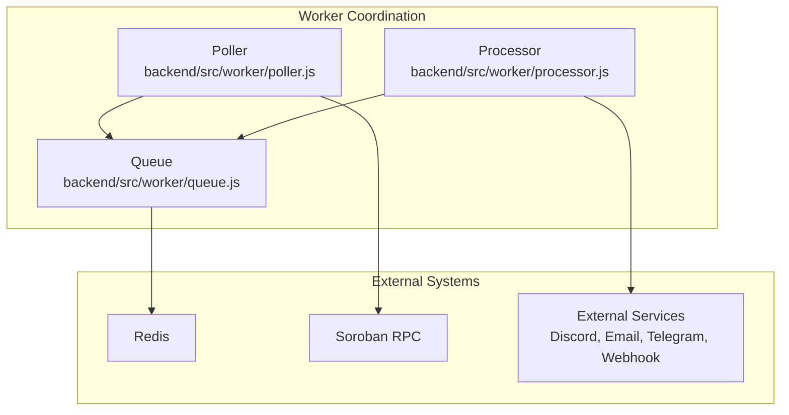
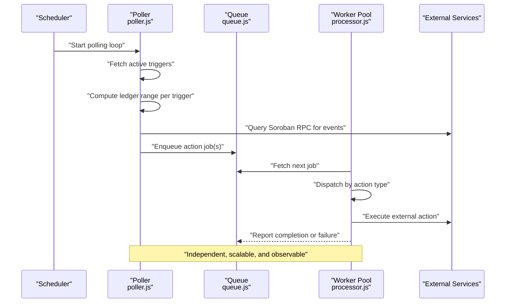
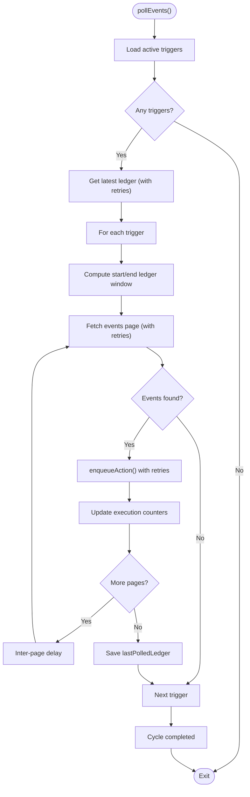
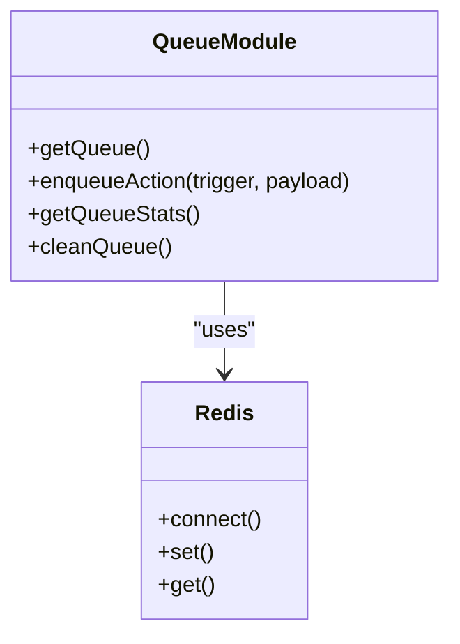
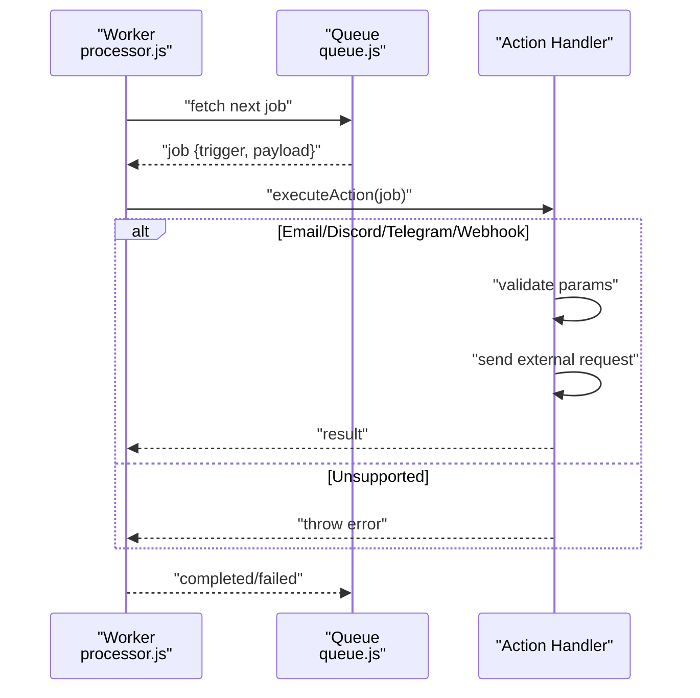
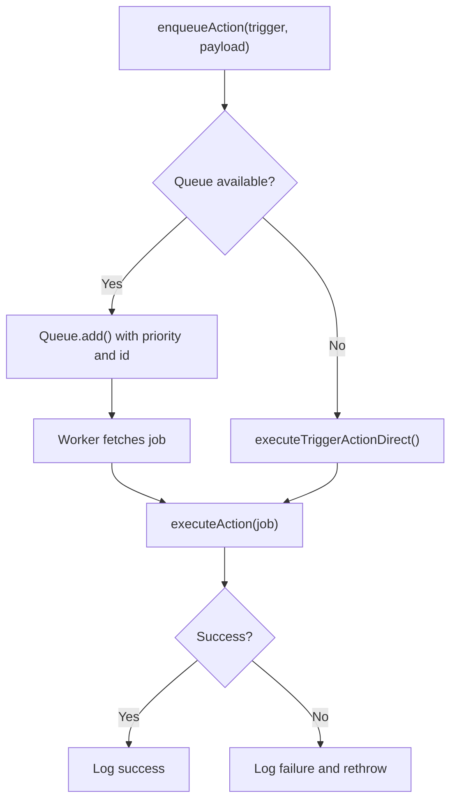
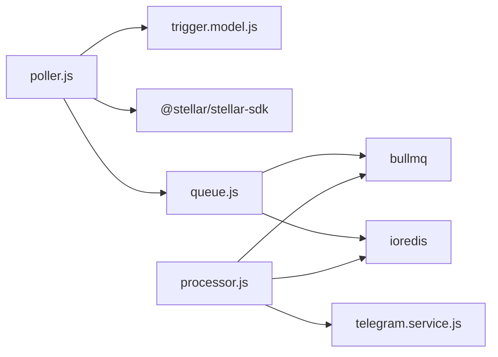

# Worker Coordination

<cite>
**Referenced Files in This Document**
- [poller.js](file://backend/src/worker/poller.js)
- [processor.js](file://backend/src/worker/processor.js)
- [queue.js](file://backend/src/worker/queue.js)
- [queue-usage.js](file://backend/examples/queue-usage.js)
- [trigger.model.js](file://backend/src/models/trigger.model.js)
- [server.js](file://backend/src/server.js)
- [queue.routes.js](file://backend/src/routes/queue.routes.js)
- [telegram.service.js](file://backend/src/services/telegram.service.js)
- [QUICKSTART_QUEUE.md](file://backend/QUICKSTART_QUEUE.md)
- [package.json](file://backend/package.json)
</cite>

## Table of Contents
1. [Introduction](#introduction)
2. [Project Structure](#project-structure)
3. [Core Components](#core-components)
4. [Architecture Overview](#architecture-overview)
5. [Detailed Component Analysis](#detailed-component-analysis)
6. [Dependency Analysis](#dependency-analysis)
7. [Performance Considerations](#performance-considerations)
8. [Troubleshooting Guide](#troubleshooting-guide)
9. [Conclusion](#conclusion)
10. [Appendices](#appendices)

## Introduction
This document explains how worker coordination and job processing work in the EventHorizon backend. It covers the worker startup process, job consumption patterns, concurrent job execution strategies, the action execution pipeline, error handling, and job completion tracking. It also documents the integration between the poller and processor components, job routing logic, action type dispatching, practical configuration examples, performance monitoring, scaling, load balancing, graceful shutdown, and the relationship between polling intervals, worker concurrency, and system resource utilization.

## Project Structure
The worker coordination system spans three primary modules:
- Poller: Periodically queries the Soroban network for contract events and enqueues actions for processing.
- Queue: Redis-backed job queue powered by BullMQ for reliable background processing.
- Processor: Worker pool that consumes jobs from the queue and executes actions.

**Diagram sources**
- [poller.js:177-310](file://backend/src/worker/poller.js#L177-L310)
- [queue.js:1-164](file://backend/src/worker/queue.js#L1-L164)
- [processor.js:102-168](file://backend/src/worker/processor.js#L102-L168)

**Section sources**
- [poller.js:177-310](file://backend/src/worker/poller.js#L177-L310)
- [queue.js:1-164](file://backend/src/worker/queue.js#L1-L164)
- [processor.js:102-168](file://backend/src/worker/processor.js#L102-L168)

## Core Components
- Poller: Queries the Soroban RPC for contract events, filters by trigger configuration, and enqueues actions either directly or via the queue depending on availability.
- Queue: Provides a Redis-backed job queue with retry/backoff, job lifecycle management, and observability APIs.
- Processor: A BullMQ worker pool that processes jobs concurrently, dispatching to action-specific handlers.

Key runtime behaviors:
- Polling cadence and per-trigger ledger windows are configurable.
- Action execution supports retries with per-trigger configuration.
- Queue enables decoupled, resilient processing with exponential backoff and job retention policies.

**Section sources**
- [poller.js:1-335](file://backend/src/worker/poller.js#L1-L335)
- [queue.js:1-164](file://backend/src/worker/queue.js#L1-L164)
- [processor.js:1-174](file://backend/src/worker/processor.js#L1-L174)

## Architecture Overview
The system separates concerns:
- Poller runs on a fixed interval, scanning for events and enqueuing actions.
- Queue persists jobs and ensures delivery even if the processor is temporarily unavailable.
- Processor workers consume jobs concurrently, executing action logic and reporting outcomes.

**Diagram sources**
- [poller.js:177-310](file://backend/src/worker/poller.js#L177-L310)
- [queue.js:91-121](file://backend/src/worker/queue.js#L91-L121)
- [processor.js:102-168](file://backend/src/worker/processor.js#L102-L168)

## Detailed Component Analysis

### Poller: Event Detection and Action Enqueue
Responsibilities:
- Load active triggers from the database.
- Compute per-trigger ledger ranges bounded by a maximum window and the network tip.
- Paginate event results and enqueue actions with retry support.
- Update trigger state (last polled ledger) upon successful processing.

Concurrency and pacing:
- Inter-page and inter-trigger delays prevent rate limiting.
- Per-trigger retry configuration controls action-level resilience.

Action routing:
- If Redis/BullMQ is available, enqueue jobs into the queue.
- If unavailable, execute actions synchronously with built-in routing for supported action types.

Error handling:
- Network-level retries with exponential backoff for RPC calls.
- Per-action retries with configurable attempts and intervals.
- Logging for transient failures and permanent failures.

**Diagram sources**
- [poller.js:177-310](file://backend/src/worker/poller.js#L177-L310)

**Section sources**
- [poller.js:177-310](file://backend/src/worker/poller.js#L177-L310)
- [trigger.model.js:3-62](file://backend/src/models/trigger.model.js#L3-L62)

### Queue: Reliable Background Processing
Responsibilities:
- Provide a Redis-backed queue with BullMQ.
- Define default job options: attempts, exponential backoff, retention policies.
- Expose enqueue and statistics APIs.

Job lifecycle:
- Enqueue with priority and unique identifiers.
- Automatic retry with exponential backoff.
- Cleanup policies for completed and failed jobs.

Observability:
- Counters for waiting, active, completed, failed, delayed jobs.
- APIs to inspect jobs and trigger maintenance.

**Diagram sources**
- [queue.js:1-164](file://backend/src/worker/queue.js#L1-L164)

**Section sources**
- [queue.js:1-164](file://backend/src/worker/queue.js#L1-L164)

### Processor: Concurrent Job Execution
Responsibilities:
- Create a BullMQ worker connected to Redis.
- Consume jobs from the queue and execute action logic based on action type.
- Emit completion and failure events for observability.

Concurrency:
- Configurable concurrency via environment variable.
- Built-in rate limiter to smooth outbound requests.

Action dispatching:
- Supports email, Discord, Telegram, and webhook actions.
- Validates required parameters per action type.

**Diagram sources**
- [processor.js:102-168](file://backend/src/worker/processor.js#L102-L168)
- [queue.js:91-121](file://backend/src/worker/queue.js#L91-L121)

**Section sources**
- [processor.js:1-174](file://backend/src/worker/processor.js#L1-L174)
- [telegram.service.js:1-74](file://backend/src/services/telegram.service.js#L1-L74)

### Action Execution Pipeline and Error Handling
- Poller-level retries: per-trigger configuration controls attempts and intervals.
- Queue-level retries: default attempts with exponential backoff.
- Action-level validation: missing credentials or URLs cause immediate failures.
- Logging: structured logs for successes, failures, and warnings.

**Diagram sources**
- [poller.js:56-147](file://backend/src/worker/poller.js#L56-L147)
- [queue.js:91-121](file://backend/src/worker/queue.js#L91-L121)
- [processor.js:25-97](file://backend/src/worker/processor.js#L25-L97)

**Section sources**
- [poller.js:152-173](file://backend/src/worker/poller.js#L152-L173)
- [queue.js:19-41](file://backend/src/worker/queue.js#L19-L41)
- [processor.js:102-168](file://backend/src/worker/processor.js#L102-L168)

### Job Routing Logic and Action Type Dispatching
Supported action types:
- Email: sends event notifications.
- Discord: posts embeds to webhooks.
- Telegram: sends MarkdownV2-formatted messages via Telegram Bot API.
- Webhook: posts JSON payloads to configured URLs.

Routing is performed by:
- Poller’s direct execution fallback when queue is unavailable.
- Processor’s action dispatcher when jobs are consumed.

Validation:
- Required fields enforced per action type (e.g., bot token/chat ID for Telegram, webhook URL for Discord/webhook).

**Section sources**
- [poller.js:86-146](file://backend/src/worker/poller.js#L86-L146)
- [processor.js:37-96](file://backend/src/worker/processor.js#L37-L96)
- [telegram.service.js:15-57](file://backend/src/services/telegram.service.js#L15-L57)

### Worker Startup Process and Graceful Shutdown
Startup:
- Server initializes MongoDB, optionally starts the BullMQ worker, and starts the poller.
- Graceful shutdown listens for SIGTERM, closes the worker, and disconnects from MongoDB.

Scaling:
- Horizontal scale-out by running multiple instances of the server.
- Vertical scale-up by increasing worker concurrency.

Graceful shutdown:
- Ensures in-flight jobs are completed or retried according to queue policies.

**Section sources**
- [server.js:44-78](file://backend/src/server.js#L44-L78)
- [processor.js:128-136](file://backend/src/worker/processor.js#L128-L136)

## Dependency Analysis
- Poller depends on:
  - Trigger model for configuration and metrics.
  - Stellar RPC client for event retrieval.
  - Optional queue module for background processing.
- Queue depends on Redis via ioredis and exposes a thin wrapper around BullMQ.
- Processor depends on Redis and BullMQ, and integrates with external services via dedicated modules.

**Diagram sources**
- [poller.js:1-10](file://backend/src/worker/poller.js#L1-L10)
- [queue.js:1-7](file://backend/src/worker/queue.js#L1-L7)
- [processor.js:1-7](file://backend/src/worker/processor.js#L1-L7)
- [trigger.model.js:1-80](file://backend/src/models/trigger.model.js#L1-L80)
- [telegram.service.js:1-74](file://backend/src/services/telegram.service.js#L1-L74)

**Section sources**
- [poller.js:1-10](file://backend/src/worker/poller.js#L1-L10)
- [queue.js:1-7](file://backend/src/worker/queue.js#L1-L7)
- [processor.js:1-7](file://backend/src/worker/processor.js#L1-L7)
- [package.json:10-22](file://backend/package.json#L10-L22)

## Performance Considerations
- Polling interval: Controls how frequently the poller scans for events. Lower intervals increase responsiveness but raise RPC load.
- Max ledgers per poll: Limits the size of each scanning window to balance latency and throughput.
- Inter-page and inter-trigger delays: Prevent rate limiting and reduce contention.
- Worker concurrency: Increase to process more jobs simultaneously; tune based on downstream service capacity and Redis performance.
- Queue backoff: Reduces thundering herds of retries; adjust base delay and attempts per action type.
- Rate limiter: Smooths outbound requests from the worker.
- Resource utilization: Monitor CPU, memory, Redis throughput, and external service SLAs.

[No sources needed since this section provides general guidance]

## Troubleshooting Guide
Common issues and remedies:
- Redis not running or misconfigured:
  - Symptoms: Worker fails to start, queue APIs return 503.
  - Resolution: Start Redis, verify connectivity, set correct host/port/password.
- Jobs stuck in waiting:
  - Restart the worker or check Redis connectivity.
- Excessive retries and backlog:
  - Inspect queue stats, adjust worker concurrency, and review external service health.
- Telegram errors:
  - Validate bot token and chat ID; check for blocked chats or malformed MarkdownV2.

Operational checks:
- Use queue stats endpoint to observe queue health.
- Retry failed jobs via the queue API.
- Clean old jobs periodically to manage Redis memory.

**Section sources**
- [server.js:44-55](file://backend/src/server.js#L44-L55)
- [queue.routes.js:14-23](file://backend/src/routes/queue.routes.js#L14-L23)
- [QUICKSTART_QUEUE.md:144-181](file://backend/QUICKSTART_QUEUE.md#L144-L181)
- [telegram.service.js:30-56](file://backend/src/services/telegram.service.js#L30-L56)

## Conclusion
The worker coordination system separates event detection from action execution, enabling scalability and reliability. The poller efficiently discovers events and enqueues actions, while the queue and worker pool provide robust, concurrent processing with built-in retries and observability. Proper configuration of polling intervals, worker concurrency, and queue policies allows operators to balance responsiveness, throughput, and resource utilization.

[No sources needed since this section summarizes without analyzing specific files]

## Appendices

### Practical Configuration Examples
- Environment variables:
  - Redis: REDIS_HOST, REDIS_PORT, REDIS_PASSWORD
  - Worker: WORKER_CONCURRENCY
  - Poller: POLL_INTERVAL_MS, MAX_LEDGERS_PER_POLL, RPC_MAX_RETRIES, RPC_BASE_DELAY_MS, INTER_TRIGGER_DELAY_MS, INTER_PAGE_DELAY_MS
- Example usage:
  - Enqueue jobs and monitor queue statistics using the provided example script.

**Section sources**
- [processor.js:9-12](file://backend/src/worker/processor.js#L9-L12)
- [poller.js:10-15](file://backend/src/worker/poller.js#L10-L15)
- [queue-usage.js:1-223](file://backend/examples/queue-usage.js#L1-L223)

### Job Processing Workflows
- Typical flow:
  - Poller detects events and enqueues jobs.
  - Worker consumes jobs and executes actions.
  - Results are logged; failures are retried automatically.
- Monitoring:
  - Use queue stats and job APIs to track progress and troubleshoot.

**Section sources**
- [poller.js:242-261](file://backend/src/worker/poller.js#L242-L261)
- [queue.js:126-143](file://backend/src/worker/queue.js#L126-L143)
- [queue.routes.js:27-78](file://backend/src/routes/queue.routes.js#L27-L78)

### Worker Scaling and Load Balancing
- Scale horizontally by deploying multiple server instances.
- Tune WORKER_CONCURRENCY per instance to match downstream capacity.
- Ensure Redis is properly sized and network-accessible.

**Section sources**
- [server.js:44-58](file://backend/src/server.js#L44-L58)
- [processor.js:128-136](file://backend/src/worker/processor.js#L128-L136)

### Relationship Between Polling Intervals, Concurrency, and Resource Utilization
- Shorter polling intervals increase RPC calls and CPU usage.
- Higher worker concurrency improves throughput but raises Redis and external service load.
- Optimize by observing queue depth, external service latencies, and Redis metrics.

**Section sources**
- [poller.js:312-329](file://backend/src/worker/poller.js#L312-L329)
- [processor.js:128-136](file://backend/src/worker/processor.js#L128-L136)