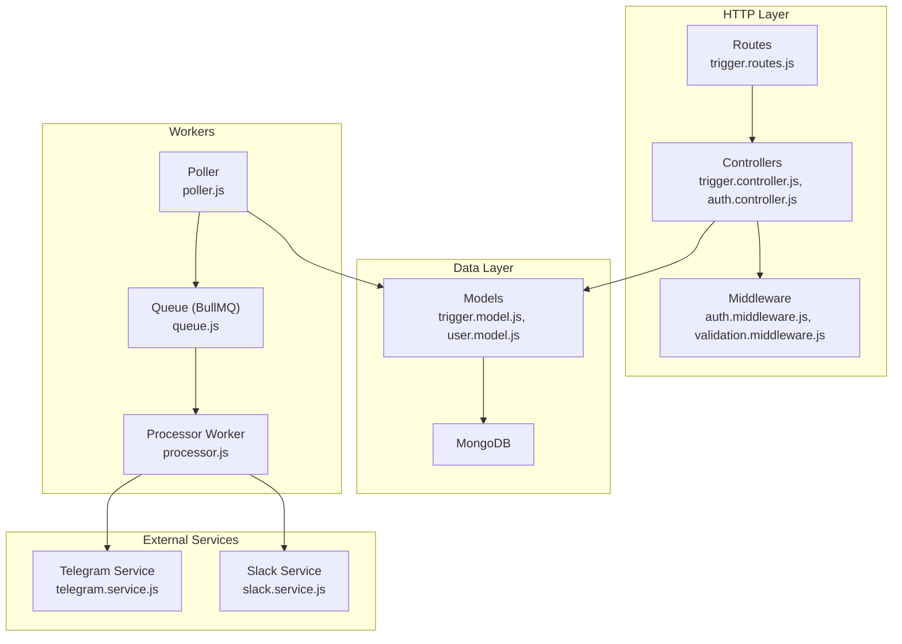
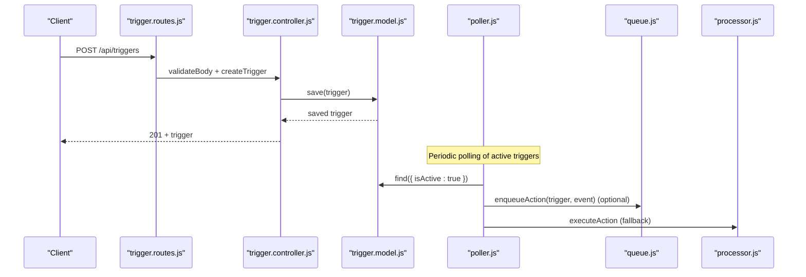
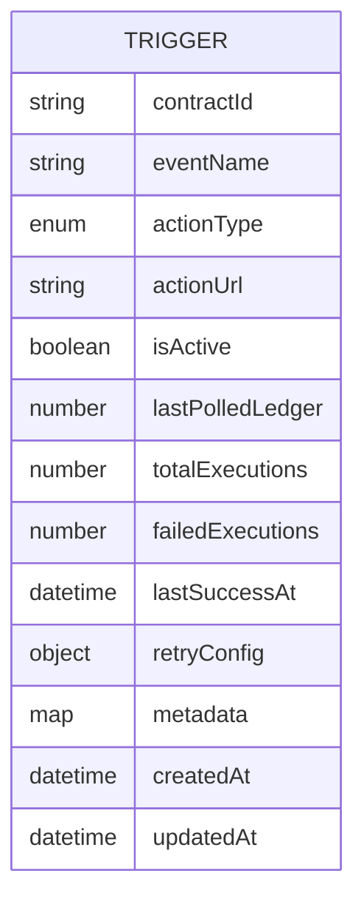
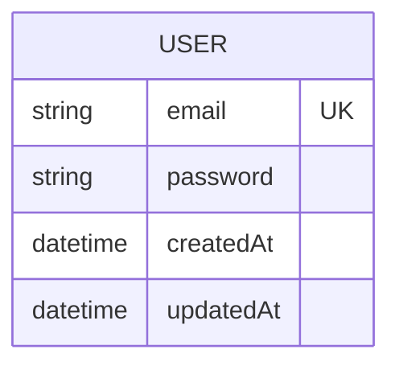
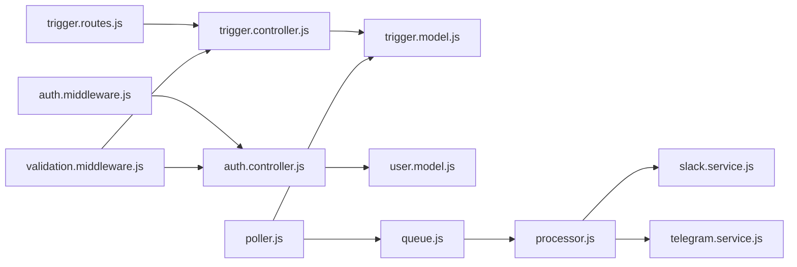

# Data Relationships and Constraints

<cite>
**Referenced Files in This Document**
- [trigger.model.js](file://backend/src/models/trigger.model.js)
- [user.model.js](file://backend/src/models/user.model.js)
- [trigger.controller.js](file://backend/src/controllers/trigger.controller.js)
- [auth.controller.js](file://backend/src/controllers/auth.controller.js)
- [trigger.routes.js](file://backend/src/routes/trigger.routes.js)
- [validation.middleware.js](file://backend/src/middleware/validation.middleware.js)
- [auth.middleware.js](file://backend/src/middleware/auth.middleware.js)
- [poller.js](file://backend/src/worker/poller.js)
- [queue.js](file://backend/src/worker/queue.js)
- [processor.js](file://backend/src/worker/processor.js)
- [slack.service.js](file://backend/src/services/slack.service.js)
- [telegram.service.js](file://backend/src/services/telegram.service.js)
- [app.js](file://backend/src/app.js)
- [package.json](file://backend/package.json)
</cite>

## Table of Contents
1. [Introduction](#introduction)
2. [Project Structure](#project-structure)
3. [Core Components](#core-components)
4. [Architecture Overview](#architecture-overview)
5. [Detailed Component Analysis](#detailed-component-analysis)
6. [Dependency Analysis](#dependency-analysis)
7. [Performance Considerations](#performance-considerations)
8. [Troubleshooting Guide](#troubleshooting-guide)
9. [Conclusion](#conclusion)

## Introduction
This document explains MongoDB data relationships and constraints within the EventHorizon platform, focusing on how triggers and users relate, ownership and permission models, referential integrity, cascading operations, data consistency, indexing strategies, validation rules, business logic constraints, schema evolution, and migration/versioning approaches. It also covers operational aspects such as queue-backed execution, retry policies, and health metrics derived from stored trigger statistics.

## Project Structure
The backend is organized around Express routes, controllers, Mongoose models, middleware, and worker processes. Authentication and authorization are handled via JWT tokens. Triggers are persisted in MongoDB and consumed by a polling worker that optionally uses a Redis-backed queue for background processing.

**Diagram sources**
- [trigger.routes.js:1-92](file://backend/src/routes/trigger.routes.js#L1-L92)
- [trigger.controller.js:1-72](file://backend/src/controllers/trigger.controller.js#L1-L72)
- [auth.controller.js:1-82](file://backend/src/controllers/auth.controller.js#L1-L82)
- [auth.middleware.js:1-22](file://backend/src/middleware/auth.middleware.js#L1-L22)
- [validation.middleware.js:1-49](file://backend/src/middleware/validation.middleware.js#L1-L49)
- [trigger.model.js:1-80](file://backend/src/models/trigger.model.js#L1-L80)
- [user.model.js:1-20](file://backend/src/models/user.model.js#L1-L20)
- [poller.js:1-335](file://backend/src/worker/poller.js#L1-L335)
- [queue.js:1-164](file://backend/src/worker/queue.js#L1-L164)
- [processor.js:1-174](file://backend/src/worker/processor.js#L1-L174)
- [slack.service.js:1-165](file://backend/src/services/slack.service.js#L1-L165)
- [telegram.service.js:1-74](file://backend/src/services/telegram.service.js#L1-L74)

**Section sources**
- [app.js:1-55](file://backend/src/app.js#L1-L55)
- [package.json:1-28](file://backend/package.json#L1-L28)

## Core Components
- Trigger model defines the schema for event triggers, including identifiers, action configuration, lifecycle flags, polling state, and execution statistics. It exposes computed virtuals for health score and status.
- User model defines minimal authentication fields with unique email and password storage.
- Validation middleware enforces strict input constraints for trigger creation and authentication credentials.
- Authentication middleware validates JWT bearer tokens for protected routes.
- Poller reads active triggers, queries Stellar RPC for events, and executes actions either directly or via queue.
- Queue and processor implement background job processing with retries and prioritization.
- Slack and Telegram services encapsulate external integrations.

**Section sources**
- [trigger.model.js:1-80](file://backend/src/models/trigger.model.js#L1-L80)
- [user.model.js:1-20](file://backend/src/models/user.model.js#L1-L20)
- [validation.middleware.js:1-49](file://backend/src/middleware/validation.middleware.js#L1-L49)
- [auth.middleware.js:1-22](file://backend/src/middleware/auth.middleware.js#L1-L22)
- [poller.js:1-335](file://backend/src/worker/poller.js#L1-L335)
- [queue.js:1-164](file://backend/src/worker/queue.js#L1-L164)
- [processor.js:1-174](file://backend/src/worker/processor.js#L1-L174)
- [slack.service.js:1-165](file://backend/src/services/slack.service.js#L1-L165)
- [telegram.service.js:1-74](file://backend/src/services/telegram.service.js#L1-L74)

## Architecture Overview
The system separates concerns across HTTP, data, and workers. Triggers are stored in MongoDB and queried by the poller. Actions are executed either synchronously or asynchronously via Redis/BullMQ. Authentication is enforced via middleware on protected endpoints.

**Diagram sources**
- [trigger.routes.js:1-92](file://backend/src/routes/trigger.routes.js#L1-L92)
- [trigger.controller.js:1-72](file://backend/src/controllers/trigger.controller.js#L1-L72)
- [trigger.model.js:1-80](file://backend/src/models/trigger.model.js#L1-L80)
- [poller.js:1-335](file://backend/src/worker/poller.js#L1-L335)
- [queue.js:1-164](file://backend/src/worker/queue.js#L1-L164)
- [processor.js:1-174](file://backend/src/worker/processor.js#L1-L174)

## Detailed Component Analysis

### Trigger Model and Data Schema
- Fields and constraints:
  - contractId: String, required, indexed for efficient lookup.
  - eventName: String, required.
  - actionType: Enum of supported channels, defaults to webhook.
  - actionUrl: String, required; semantics depend on actionType.
  - isActive: Boolean, default true.
  - lastPolledLedger: Number, default 0.
  - totalExecutions, failedExecutions: Counters for execution metrics.
  - lastSuccessAt: Date for health tracking.
  - retryConfig: Nested object with maxRetries and retryIntervalMs.
  - metadata: Map<String,String>, indexed for potential filtering.
  - timestamps: createdAt/updatedAt managed by Mongoose.
- Computed virtuals:
  - healthScore: derived from totalExecutions and failedExecutions.
  - healthStatus: mapped from healthScore thresholds.

**Diagram sources**
- [trigger.model.js:1-80](file://backend/src/models/trigger.model.js#L1-L80)

**Section sources**
- [trigger.model.js:1-80](file://backend/src/models/trigger.model.js#L1-L80)

### User Model and Authentication
- Fields:
  - email: String, required, unique, lowercased and trimmed.
  - password: String, required.
  - timestamps: createdAt/updatedAt.
- Authentication flow:
  - Login endpoint verifies credentials and issues access and refresh tokens.
  - Auth middleware validates bearer tokens for protected routes.

**Diagram sources**
- [user.model.js:1-20](file://backend/src/models/user.model.js#L1-L20)
- [auth.controller.js:1-82](file://backend/src/controllers/auth.controller.js#L1-L82)
- [auth.middleware.js:1-22](file://backend/src/middleware/auth.middleware.js#L1-L22)

**Section sources**
- [user.model.js:1-20](file://backend/src/models/user.model.js#L1-L20)
- [auth.controller.js:1-82](file://backend/src/controllers/auth.controller.js#L1-L82)
- [auth.middleware.js:1-22](file://backend/src/middleware/auth.middleware.js#L1-L22)

### Relationship Between Triggers and Users
- Current codebase does not define a direct foreign key relationship between Trigger and User in MongoDB.
- Ownership and permission model:
  - Authentication is enforced via JWT bearer tokens for protected endpoints.
  - Authorization is not explicitly implemented in controllers; access control is implicit through route protection.
  - No user association is stored on triggers; therefore, no referential integrity or cascading deletes apply between users and triggers.

Recommendations:
- To enforce ownership and permission:
  - Add a userId field to the Trigger schema referencing the User collection.
  - Enforce per-user isolation in controllers by verifying ownership before mutating triggers.
  - Implement soft-delete or cascade-delete policies at the application level when removing users.

**Section sources**
- [trigger.controller.js:1-72](file://backend/src/controllers/trigger.controller.js#L1-L72)
- [trigger.routes.js:1-92](file://backend/src/routes/trigger.routes.js#L1-L92)
- [auth.middleware.js:1-22](file://backend/src/middleware/auth.middleware.js#L1-L22)

### Referential Integrity, Cascading Operations, and Consistency
- MongoDB lacks foreign key constraints; referential integrity is not enforced at the database level.
- Current behavior:
  - Deleting a trigger is independent of user ownership.
  - No cascading deletes occur when users are removed.
- Consistency requirements:
  - Poller updates trigger state (lastPolledLedger, counters) atomically per trigger update.
  - Queue-based execution ensures eventual consistency between trigger state and action outcomes.

Recommendations:
- Application-level enforcement:
  - Add userId to Trigger and validate ownership on create/update/delete.
  - Implement cascading delete of triggers when a user is removed.
- Operational consistency:
  - Use transactions for multi-document updates if sharding is introduced later.
  - Monitor healthScore and healthStatus for operational insights.

**Section sources**
- [poller.js:248-281](file://backend/src/worker/poller.js#L248-L281)
- [trigger.model.js:65-77](file://backend/src/models/trigger.model.js#L65-L77)

### Indexing Strategies and Query Optimization
- Existing indexes:
  - contractId: single-field index for efficient filtering by contract.
  - metadata: map index for potential filtering by metadata keys.
- Recommended compound indexes for common queries:
  - { contractId, eventName }: frequent filter for event retrieval.
  - { isActive, lastPolledLedger }: supports efficient polling window scans.
  - { contractId, isActive }: targeted polling of active triggers per contract.
- TTL collections:
  - Consider TTL index on createdAt for cleanup of stale triggers if retention is required.

Implementation guidance:
- Define indexes in the schema or via migrations to avoid runtime overhead.
- Monitor slow queries and adjust indexes based on actual workload.

**Section sources**
- [trigger.model.js:3-57](file://backend/src/models/trigger.model.js#L3-L57)
- [poller.js:177-199](file://backend/src/worker/poller.js#L177-L199)

### Data Validation Rules and Business Logic Constraints
- Validation middleware enforces:
  - Trigger creation: required contractId and eventName; optional actionType defaults; actionUrl required; isActive boolean; lastPolledLedger integer >= 0.
  - Auth credentials: email format and minimum password length.
- Business logic constraints:
  - actionType must be one of supported channels; defaults to webhook.
  - retryConfig controls retry behavior during action execution.
  - Poller respects per-trigger lastPolledLedger and bounded polling windows.

**Section sources**
- [validation.middleware.js:1-49](file://backend/src/middleware/validation.middleware.js#L1-L49)
- [trigger.model.js:13-17](file://backend/src/models/trigger.model.js#L13-L17)
- [poller.js:204-217](file://backend/src/worker/poller.js#L204-L217)

### Schema Evolution Patterns
- Backward compatibility:
  - New fields should be optional with sensible defaults.
  - Use explicit default values in schemas to avoid breaking changes.
- Migration strategy:
  - Introduce a version field on triggers to track schema versions.
  - Implement a migration script to populate defaults and transform data when upgrading.
  - Maintain a changelog of schema changes and deprecations.

**Section sources**
- [trigger.model.js:43-52](file://backend/src/models/trigger.model.js#L43-L52)

### Data Migration and Version Management
- Migration approach:
  - Use a dedicated migration script to iterate over existing triggers and set defaults for new fields.
  - Preserve historical data while adding new computed fields (e.g., healthScore) as virtuals.
- Version management:
  - Tag releases with semantic versioning.
  - Maintain a migration guide for breaking changes and deprecations.

**Section sources**
- [MIGRATION_GUIDE.md](file://backend/MIGRATION_GUIDE.md)

## Dependency Analysis
The following diagram highlights module-level dependencies among core components.

**Diagram sources**
- [trigger.routes.js:1-92](file://backend/src/routes/trigger.routes.js#L1-L92)
- [trigger.controller.js:1-72](file://backend/src/controllers/trigger.controller.js#L1-L72)
- [trigger.model.js:1-80](file://backend/src/models/trigger.model.js#L1-L80)
- [auth.controller.js:1-82](file://backend/src/controllers/auth.controller.js#L1-L82)
- [user.model.js:1-20](file://backend/src/models/user.model.js#L1-L20)
- [auth.middleware.js:1-22](file://backend/src/middleware/auth.middleware.js#L1-L22)
- [poller.js:1-335](file://backend/src/worker/poller.js#L1-L335)
- [queue.js:1-164](file://backend/src/worker/queue.js#L1-L164)
- [processor.js:1-174](file://backend/src/worker/processor.js#L1-L174)
- [slack.service.js:1-165](file://backend/src/services/slack.service.js#L1-L165)
- [telegram.service.js:1-74](file://backend/src/services/telegram.service.js#L1-L74)
- [validation.middleware.js:1-49](file://backend/src/middleware/validation.middleware.js#L1-L49)

**Section sources**
- [app.js:1-55](file://backend/src/app.js#L1-L55)
- [package.json:1-28](file://backend/package.json#L1-L28)

## Performance Considerations
- Polling efficiency:
  - Use bounded polling windows per trigger to avoid scanning entire ledgers.
  - Respect per-trigger retryConfig to reduce load spikes.
- Queue-backed execution:
  - Background processing decouples high-latency actions from request handling.
  - Configure worker concurrency and rate limiting to balance throughput and resource usage.
- Indexing:
  - Ensure appropriate indexes exist for contractId, contractId+eventName, and isActive+lastPolledLedger.
- Health metrics:
  - Compute healthScore and healthStatus to monitor reliability trends.

**Section sources**
- [poller.js:177-302](file://backend/src/worker/poller.js#L177-L302)
- [queue.js:1-164](file://backend/src/worker/queue.js#L1-L164)
- [processor.js:1-174](file://backend/src/worker/processor.js#L1-L174)
- [trigger.model.js:65-77](file://backend/src/models/trigger.model.js#L65-L77)

## Troubleshooting Guide
- Authentication failures:
  - Verify JWT presence and validity in Authorization header.
  - Check secrets and expiration settings.
- Trigger creation errors:
  - Validate payload against validation schemas.
  - Ensure actionUrl is present for non-webhook action types.
- Poller issues:
  - Confirm RPC connectivity and timeouts.
  - Review per-trigger counters and lastPolledLedger updates.
- Queue problems:
  - Inspect Redis connectivity and queue stats.
  - Investigate failed job logs and backoff behavior.

**Section sources**
- [auth.middleware.js:1-22](file://backend/src/middleware/auth.middleware.js#L1-L22)
- [validation.middleware.js:1-49](file://backend/src/middleware/validation.middleware.js#L1-L49)
- [poller.js:1-335](file://backend/src/worker/poller.js#L1-L335)
- [queue.js:1-164](file://backend/src/worker/queue.js#L1-L164)
- [processor.js:1-174](file://backend/src/worker/processor.js#L1-L174)

## Conclusion
The EventHorizon platform currently stores triggers and users independently in MongoDB without enforced referential integrity. Ownership and permission are not explicitly modeled at the data layer. The system relies on JWT-based authentication and middleware protection, with optional queue-backed action execution. To strengthen data relationships and constraints, introduce user ownership on triggers, enforce authorization checks, and implement cascading policies. Enhance indexing for common queries, adopt robust validation and retry strategies, and establish a clear schema evolution and migration process to maintain backward compatibility and operational reliability.