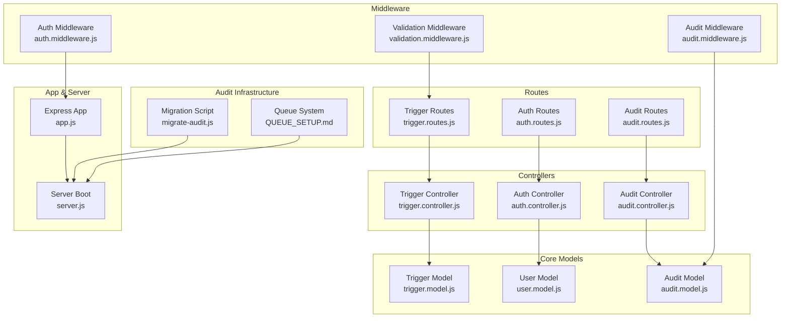
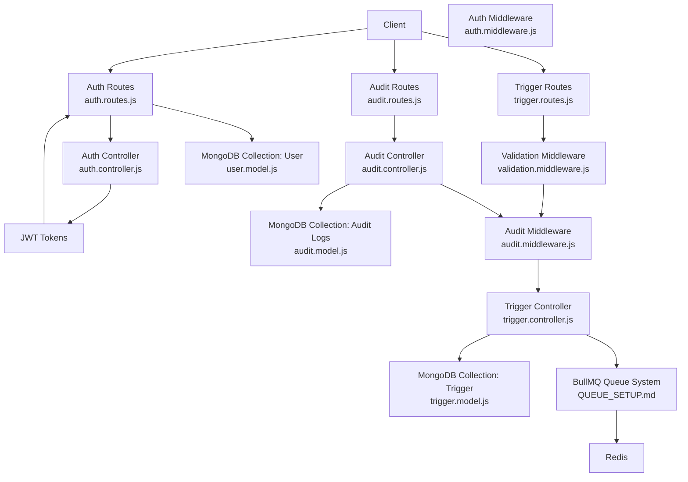
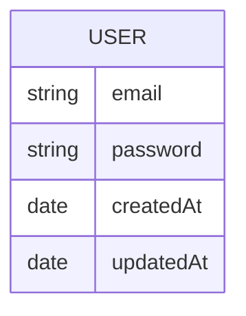
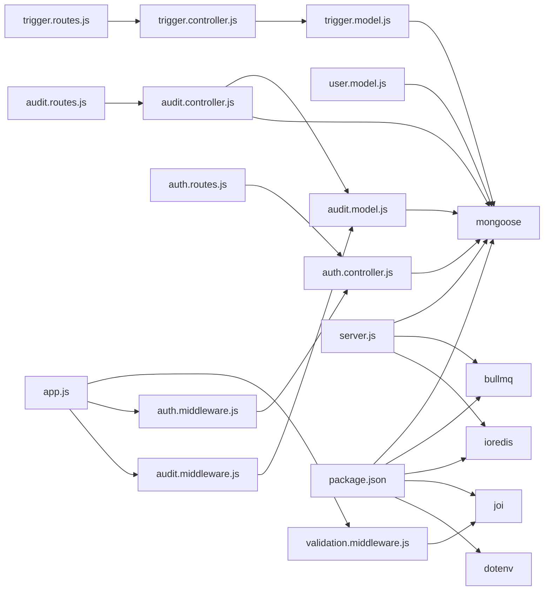

# Database Schema Design

<cite>
**Referenced Files in This Document**
- [trigger.model.js](file://backend/src/models/trigger.model.js)
- [user.model.js](file://backend/src/models/user.model.js)
- [audit.model.js](file://backend/src/models/audit.model.js)
- [validation.middleware.js](file://backend/src/middleware/validation.middleware.js)
- [audit.middleware.js](file://backend/src/middleware/audit.middleware.js)
- [audit.controller.js](file://backend/src/controllers/audit.controller.js)
- [audit.routes.js](file://backend/src/routes/audit.routes.js)
- [trigger.controller.js](file://backend/src/controllers/trigger.controller.js)
- [auth.controller.js](file://backend/src/controllers/auth.controller.js)
- [auth.middleware.js](file://backend/src/middleware/auth.middleware.js)
- [trigger.routes.js](file://backend/src/routes/trigger.routes.js)
- [auth.routes.js](file://backend/src/routes/auth.routes.js)
- [server.js](file://backend/src/server.js)
- [app.js](file://backend/src/app.js)
- [migrate-audit.js](file://backend/scripts/migrate-audit.js)
- [MIGRATION_GUIDE.md](file://backend/MIGRATION_GUIDE.md)
- [QUEUE_SETUP.md](file://backend/QUEUE_SETUP.md)
- [package.json](file://backend/package.json)
</cite>

## Update Summary
**Changes Made**
- Added comprehensive audit model schema documentation with immutable log design
- Documented audit middleware integration for automatic operation tracking
- Added audit controller and routes for compliance and debugging
- Included migration procedures and integrity verification capabilities
- Enhanced security measures with user identification and change diff tracking
- Updated architecture diagrams to reflect new audit infrastructure

## Table of Contents
1. [Introduction](#introduction)
2. [Project Structure](#project-structure)
3. [Core Components](#core-components)
4. [Architecture Overview](#architecture-overview)
5. [Detailed Component Analysis](#detailed-component-analysis)
6. [Dependency Analysis](#dependency-analysis)
7. [Performance Considerations](#performance-considerations)
8. [Troubleshooting Guide](#troubleshooting-guide)
9. [Conclusion](#conclusion)
10. [Appendices](#appendices)

## Introduction
This document describes the MongoDB schema design for the EventHorizon project, focusing on the trigger model, user model, and the newly added audit model. It explains field definitions, data types, validation rules, business constraints, entity relationships, indexing strategies, and performance considerations. It also covers data access patterns, caching strategies, aggregation pipelines, data lifecycle management, retention policies, backup procedures, migration strategies, schema evolution, version management, and data security measures.

## Project Structure
The database-related components are primarily located under backend/src/models and backend/src/controllers, with validation, audit tracking, and routing supporting the schemas. Authentication and authorization are handled via JWT tokens stored in the User collection. Background job processing for trigger actions is implemented separately with BullMQ and Redis. The new audit system provides comprehensive logging infrastructure for compliance and debugging.



**Diagram sources**
- [trigger.model.js:1-80](file://backend/src/models/trigger.model.js#L1-L80)
- [user.model.js:1-20](file://backend/src/models/user.model.js#L1-L20)
- [audit.model.js:1-181](file://backend/src/models/audit.model.js#L1-L181)
- [validation.middleware.js:1-49](file://backend/src/middleware/validation.middleware.js#L1-L49)
- [audit.middleware.js:1-295](file://backend/src/middleware/audit.middleware.js#L1-L295)
- [audit.controller.js:1-308](file://backend/src/controllers/audit.controller.js#L1-L308)
- [trigger.controller.js:1-72](file://backend/src/controllers/trigger.controller.js#L1-L72)
- [auth.controller.js:1-82](file://backend/src/controllers/auth.controller.js#L1-L82)
- [auth.middleware.js:1-22](file://backend/src/middleware/auth.middleware.js#L1-L22)
- [trigger.routes.js:1-143](file://backend/src/routes/trigger.routes.js#L1-L143)
- [auth.routes.js:1-38](file://backend/src/routes/auth.routes.js#L1-L38)
- [audit.routes.js:1-337](file://backend/src/routes/audit.routes.js#L1-L337)
- [app.js:1-55](file://backend/src/app.js#L1-L55)
- [server.js:1-88](file://backend/src/server.js#L1-L88)
- [migrate-audit.js:1-138](file://backend/scripts/migrate-audit.js#L1-L138)
- [QUEUE_SETUP.md:1-250](file://backend/QUEUE_SETUP.md#L1-L250)

**Section sources**
- [trigger.model.js:1-80](file://backend/src/models/trigger.model.js#L1-L80)
- [user.model.js:1-20](file://backend/src/models/user.model.js#L1-L20)
- [audit.model.js:1-181](file://backend/src/models/audit.model.js#L1-L181)
- [validation.middleware.js:1-49](file://backend/src/middleware/validation.middleware.js#L1-L49)
- [audit.middleware.js:1-295](file://backend/src/middleware/audit.middleware.js#L1-L295)
- [audit.controller.js:1-308](file://backend/src/controllers/audit.controller.js#L1-L308)
- [trigger.controller.js:1-72](file://backend/src/controllers/trigger.controller.js#L1-L72)
- [auth.controller.js:1-82](file://backend/src/controllers/auth.controller.js#L1-L82)
- [auth.middleware.js:1-22](file://backend/src/middleware/auth.middleware.js#L1-L22)
- [trigger.routes.js:1-143](file://backend/src/routes/trigger.routes.js#L1-L143)
- [auth.routes.js:1-38](file://backend/src/routes/auth.routes.js#L1-L38)
- [audit.routes.js:1-337](file://backend/src/routes/audit.routes.js#L1-L337)
- [app.js:1-55](file://backend/src/app.js#L1-L55)
- [server.js:1-88](file://backend/src/server.js#L1-L88)
- [migrate-audit.js:1-138](file://backend/scripts/migrate-audit.js#L1-L138)
- [QUEUE_SETUP.md:1-250](file://backend/QUEUE_SETUP.md#L1-L250)

## Core Components
- Trigger Model: Stores event-trigger configurations and execution statistics.
- User Model: Stores admin credentials for authentication and authorization.
- Audit Model: Immutable audit log schema with integrity verification for compliance tracking.
- Validation Middleware: Enforces strict input validation for triggers and auth credentials.
- Audit Middleware: Automatic operation tracking with change diff calculation and user identification.
- Controllers: Implement CRUD operations for triggers, authentication, and audit management.
- Middleware: Provides JWT-based authentication and request validation.
- Routes: Define API endpoints for triggers, authentication, and audit administration.
- Server/App: Initialize MongoDB connection and expose APIs.

**Section sources**
- [trigger.model.js:1-80](file://backend/src/models/trigger.model.js#L1-L80)
- [user.model.js:1-20](file://backend/src/models/user.model.js#L1-L20)
- [audit.model.js:1-181](file://backend/src/models/audit.model.js#L1-L181)
- [validation.middleware.js:1-49](file://backend/src/middleware/validation.middleware.js#L1-L49)
- [audit.middleware.js:1-295](file://backend/src/middleware/audit.middleware.js#L1-L295)
- [audit.controller.js:1-308](file://backend/src/controllers/audit.controller.js#L1-L308)
- [trigger.controller.js:1-72](file://backend/src/controllers/trigger.controller.js#L1-L72)
- [auth.controller.js:1-82](file://backend/src/controllers/auth.controller.js#L1-L82)
- [auth.middleware.js:1-22](file://backend/src/middleware/auth.middleware.js#L1-L22)
- [trigger.routes.js:1-143](file://backend/src/routes/trigger.routes.js#L1-L143)
- [auth.routes.js:1-38](file://backend/src/routes/auth.routes.js#L1-L38)
- [audit.routes.js:1-337](file://backend/src/routes/audit.routes.js#L1-L337)
- [server.js:34-88](file://backend/src/server.js#L34-L88)
- [app.js:16-55](file://backend/src/app.js#L16-L55)

## Architecture Overview
The system uses MongoDB for persistent data and Mongoose ODM for schema modeling. Authentication relies on JWT tokens issued by the Auth controller and validated by the Auth middleware. Trigger actions are executed asynchronously via BullMQ and Redis, separate from the MongoDB schema. The new audit system provides comprehensive logging infrastructure with automatic operation tracking and integrity verification for compliance purposes.



**Diagram sources**
- [auth.routes.js:1-38](file://backend/src/routes/auth.routes.js#L1-L38)
- [auth.controller.js:1-82](file://backend/src/controllers/auth.controller.js#L1-L82)
- [audit.routes.js:1-337](file://backend/src/routes/audit.routes.js#L1-L337)
- [audit.controller.js:1-308](file://backend/src/controllers/audit.controller.js#L1-L308)
- [user.model.js:1-20](file://backend/src/models/user.model.js#L1-L20)
- [trigger.routes.js:1-143](file://backend/src/routes/trigger.routes.js#L1-L143)
- [validation.middleware.js:1-49](file://backend/src/middleware/validation.middleware.js#L1-L49)
- [audit.middleware.js:1-295](file://backend/src/middleware/audit.middleware.js#L1-L295)
- [trigger.controller.js:1-72](file://backend/src/controllers/trigger.controller.js#L1-L72)
- [trigger.model.js:1-80](file://backend/src/models/trigger.model.js#L1-L80)
- [audit.model.js:1-181](file://backend/src/models/audit.model.js#L1-L181)
- [QUEUE_SETUP.md:1-250](file://backend/QUEUE_SETUP.md#L1-L250)

## Detailed Component Analysis

### Trigger Model Schema
The Trigger model defines event-driven actions and operational metrics. It includes:
- contractId: String, required, indexed for fast lookup by contract.
- eventName: String, required.
- actionType: Enum of ['webhook', 'discord', 'email', 'telegram'], default 'webhook'.
- actionUrl: String, required, URI validated.
- isActive: Boolean, default true.
- lastPolledLedger: Number, default 0.
- retryConfig: Nested object with maxRetries and retryIntervalMs.
- metadata: Map<String, String>, indexed for tag-like queries.
- Timestamps: createdAt and updatedAt managed automatically.
- Virtuals: healthScore and healthStatus computed from execution counters.

```mermaid
erDiagram
TRIGGER {
string contractId
string eventName
enum actionType
string actionUrl
boolean isActive
number lastPolledLedger
number retryConfig.maxRetries
number retryConfig.retryIntervalMs
map metadata
date createdAt
date updatedAt
}
```

**Diagram sources**
- [trigger.model.js:3-62](file://backend/src/models/trigger.model.js#L3-L62)

**Section sources**
- [trigger.model.js:1-80](file://backend/src/models/trigger.model.js#L1-L80)
- [validation.middleware.js:4-11](file://backend/src/middleware/validation.middleware.js#L4-L11)
- [trigger.controller.js:6-28](file://backend/src/controllers/trigger.controller.js#L6-L28)

### User Model Schema
The User model stores admin credentials:
- email: String, required, unique, lowercased, trimmed.
- password: String, required.
- Timestamps: createdAt and updatedAt managed automatically.



**Diagram sources**
- [user.model.js:3-18](file://backend/src/models/user.model.js#L3-L18)

**Section sources**
- [user.model.js:1-20](file://backend/src/models/user.model.js#L1-L20)
- [validation.middleware.js:12-16](file://backend/src/middleware/validation.middleware.js#L12-L16)
- [auth.controller.js:15-52](file://backend/src/controllers/auth.controller.js#L15-L52)
- [auth.middleware.js:1-22](file://backend/src/middleware/auth.middleware.js#L1-L22)

### Audit Model Schema
The Audit model provides immutable audit logging for compliance and debugging:
- operation: Enum ['CREATE', 'UPDATE', 'DELETE'], required, indexed for query optimization.
- resourceType: String, default 'Trigger', required, indexed.
- resourceId: ObjectId, required, indexed for resource-specific queries.
- userId: String, indexed, uses hashed IP+User-Agent for privacy-preserving identification.
- userAgent: String, required for context tracking.
- ipAddress: String, required, indexed for network analysis.
- forwardedFor: String for proxy/trust chain information.
- timestamp: Date, default current time, indexed for chronological queries.
- changes: Object containing before/after states and detailed field diffs for updates.
- metadata: Contextual information including endpoint, method, session IDs, and request IDs.
- integrityHash: String, indexed, unique constraint for tamper-evidence verification.
- Compound indexes: Optimized for common query patterns and analytics.

```mermaid
erDiagram
AUDIT_LOG {
string operation
string resourceType
objectId resourceId
string userId
string userAgent
string ipAddress
string forwardedFor
date timestamp
mixed changes.before
mixed changes.after
array changes.diff.field
array changes.diff.oldValue
array changes.diff.newValue
string metadata.endpoint
string metadata.method
string metadata.userAgent
string metadata.sessionId
string metadata.requestId
string integrityHash
}
```

**Diagram sources**
- [audit.model.js:7-90](file://backend/src/models/audit.model.js#L7-L90)

**Section sources**
- [audit.model.js:1-181](file://backend/src/models/audit.model.js#L1-L181)

### Audit Middleware Integration
The audit middleware automatically tracks all write operations:
- Operation mapping: POST→CREATE, PUT/PATCH→UPDATE, DELETE→DELETE.
- User identification: Hashed IP+User-Agent combination for privacy.
- Change diff calculation: Deep comparison of object states for UPDATE operations.
- Asynchronous logging: Non-blocking audit logging that doesn't affect response times.
- State capture: Preserves before/after states for comprehensive audit trails.

**Section sources**
- [audit.middleware.js:1-295](file://backend/src/middleware/audit.middleware.js#L1-L295)

### Audit Controller and Routes
The audit system provides comprehensive administrative endpoints:
- Log retrieval with advanced filtering by resource, operation, user, IP, and date ranges.
- Audit trail for specific resources with pagination and operation filtering.
- Statistics dashboard with operation counts, daily activity trends, and top IP analysis.
- Integrity verification for individual logs and bulk verification sampling.
- Admin-only access control with configurable admin tokens.

**Section sources**
- [audit.controller.js:1-308](file://backend/src/controllers/audit.controller.js#L1-L308)
- [audit.routes.js:1-337](file://backend/src/routes/audit.routes.js#L1-L337)

### Validation Rules and Business Constraints
- Trigger creation requires contractId, eventName, actionUrl, and defaults isActive to true; lastPolledLedger defaults to 0.
- actionType is constrained to predefined values with a default.
- Auth credentials require a valid email and minimum password length.
- Audit logs require operation, resourceType, resourceId, ipAddress, and timestamp fields.
- Validation middleware returns structured error details for invalid requests.

**Section sources**
- [validation.middleware.js:4-16](file://backend/src/middleware/validation.middleware.js#L4-L16)
- [trigger.controller.js:6-28](file://backend/src/controllers/trigger.controller.js#L6-L28)
- [auth.controller.js:15-52](file://backend/src/controllers/auth.controller.js#L15-L52)
- [audit.model.js:80-100](file://backend/src/models/audit.model.js#L80-L100)

### Entity Relationships
- One-to-many relationship between contractId and triggers: multiple triggers can target the same contract.
- Audit logs reference triggers via resourceId with proper population for readable trails.
- No explicit foreign keys in MongoDB; relationships are implicit via resource identifiers.
- User does not directly reference triggers; authentication controls access to trigger endpoints.

**Section sources**
- [trigger.model.js:4-8](file://backend/src/models/trigger.model.js#L4-L8)
- [audit.model.js:23-27](file://backend/src/models/audit.model.js#L23-L27)
- [trigger.controller.js:6-28](file://backend/src/controllers/trigger.controller.js#L6-L28)
- [auth.controller.js:15-52](file://backend/src/controllers/auth.controller.js#L15-L52)

### Indexing Strategies
- contractId: Single-field index to accelerate filtering by contract.
- metadata: Map field indexed to support tag-based queries.
- Unique constraint on email in User collection ensures one account per email.
- Audit collection indexes: compound indexes for resource operations, IP analysis, integrity verification, and analytics optimization.
- Background index creation to minimize downtime during migrations.

**Section sources**
- [trigger.model.js:7-8](file://backend/src/models/trigger.model.js#L7-L8)
- [trigger.model.js:56-57](file://backend/src/models/trigger.model.js#L56-L57)
- [user.model.js](file://backend/src/models/user.model.js#L8)
- [audit.model.js:92-96](file://backend/src/models/audit.model.js#L92-L96)
- [migrate-audit.js:24-41](file://backend/scripts/migrate-audit.js#L24-L41)

### Performance Considerations
- Query patterns:
  - Find triggers by contractId: efficient due to single-field index.
  - Filter by isActive: boolean index recommended for frequent toggling.
  - Tag queries via metadata: leverage Map index for tag-based filtering.
  - Audit queries: optimized compound indexes for resource, operation, and time-based filtering.
- Aggregation pipelines:
  - Compute healthScore and healthStatus using virtuals; consider precomputing for heavy dashboards.
  - Group by actionType or contractId for reporting.
  - Audit statistics: operation counts, daily trends, and IP analysis aggregations.
- Caching:
  - Cache frequently accessed trigger configurations keyed by contractId and eventName.
  - Cache JWT public keys or token introspection results if needed.
- Background processing:
  - Use BullMQ queue for trigger actions to avoid blocking the poller and improve resilience.
  - Audit logging is asynchronous and non-blocking.

**Section sources**
- [trigger.model.js:65-77](file://backend/src/models/trigger.model.js#L65-L77)
- [audit.controller.js:160-227](file://backend/src/controllers/audit.controller.js#L160-L227)
- [QUEUE_SETUP.md:20-27](file://backend/QUEUE_SETUP.md#L20-L27)

### Data Access Patterns
- Create trigger: POST /api/triggers with validated payload (automatically audited).
- List triggers: GET /api/triggers returning all documents.
- Delete trigger: DELETE /api/triggers/:id with 404 handling (automatically audited).
- Update trigger: PUT /api/triggers/:id with audit trail generation (automatically audited).
- Authenticate admin: POST /api/auth/login returning access and refresh tokens.
- Refresh token: POST /api/auth/refresh using refresh token.
- Admin audit logs: GET /api/admin/audit/logs with filtering and pagination.
- Resource audit trail: GET /api/admin/audit/resources/:resourceId/trail.
- Audit statistics: GET /api/admin/audit/stats for compliance analytics.
- Integrity verification: GET /api/admin/audit/logs/:logId/verify and bulk verification.

**Section sources**
- [trigger.routes.js:57-143](file://backend/src/routes/trigger.routes.js#L57-L143)
- [auth.routes.js:26-36](file://backend/src/routes/auth.routes.js#L26-L36)
- [audit.routes.js:85-337](file://backend/src/routes/audit.routes.js#L85-L337)
- [trigger.controller.js:6-71](file://backend/src/controllers/trigger.controller.js#L6-L71)
- [auth.controller.js:15-82](file://backend/src/controllers/auth.controller.js#L15-L82)
- [audit.controller.js:38-308](file://backend/src/controllers/audit.controller.js#L38-L308)

### Caching Strategies
- Application-level caches:
  - Store trigger configurations keyed by contractId+eventName to reduce DB reads.
  - Invalidate cache on trigger updates/deletes.
- Token caching:
  - Cache JWT public keys or token revocation lists if integrating with external systems.
- CDN/static assets:
  - Not applicable for schema data but relevant for static UI resources.
- Audit data caching:
  - Cache frequently accessed audit statistics and reports.

[No sources needed since this section provides general guidance]

### Aggregation Pipelines
- Compute health metrics:
  - Use aggregation to group by contractId and compute success/failure ratios.
- Tag analytics:
  - Unwind metadata tags and compute counts per tag for observability.
- Time-series stats:
  - Bucket executions by time windows for trend analysis.
- Audit analytics:
  - Operation counts, daily activity trends, and top IP analysis aggregations.
- Compliance reporting:
  - Generate audit trails with resource population and change diff analysis.

[No sources needed since this section provides general guidance]

### Data Lifecycle Management, Retention, and Backup
- Trigger data retention:
  - Retain trigger configurations indefinitely; purge only upon explicit deletion.
- Audit log retention:
  - Configure retention policies for audit logs based on compliance requirements.
  - Implement log rotation and archival for long-term storage.
- Execution logs and metrics:
  - Offload detailed execution logs to external systems (e.g., logs DB or object storage).
- Queue job retention:
  - BullMQ jobs retained for 24h (completed) and 7 days (failed); clean periodically.
- Backups:
  - Schedule MongoDB backups (logical or physical) and test restore procedures.
  - For Redis, enable persistence (AOF/RDB) and snapshot backups.
  - Audit collections require special backup considerations due to integrity constraints.

**Section sources**
- [audit.controller.js:172-227](file://backend/src/controllers/audit.controller.js#L172-L227)
- [migrate-audit.js:112-124](file://backend/scripts/migrate-audit.js#L112-L124)
- [QUEUE_SETUP.md:95-96](file://backend/QUEUE_SETUP.md#L95-L96)
- [MIGRATION_GUIDE.md:235-246](file://backend/MIGRATION_GUIDE.md#L235-L246)

### Migration Strategies, Schema Evolution, and Version Management
- Current state:
  - Trigger schema includes nested retryConfig and Map metadata.
  - Audit schema provides immutable logging with integrity verification.
- Evolution approach:
  - Add new fields with defaults; keep backward compatibility.
  - Use optional fields and schema versioning if evolving frequently.
  - Audit model designed for immutability and integrity verification.
- Migration steps:
  - Run migration script to create audit collection indexes and constraints.
  - Configure admin access tokens for audit system.
  - Update poller to enqueue actions instead of executing synchronously.
  - Keep API endpoints unchanged for developer and user continuity.

**Section sources**
- [migrate-audit.js:9-138](file://backend/scripts/migrate-audit.js#L9-L138)
- [audit.model.js:118-124](file://backend/src/models/audit.model.js#L118-L124)
- [MIGRATION_GUIDE.md:25-88](file://backend/MIGRATION_GUIDE.md#L25-L88)
- [server.js:46-58](file://backend/src/server.js#L46-L58)
- [QUEUE_SETUP.md:79-88](file://backend/QUEUE_SETUP.md#L79-L88)

### Data Security Measures and Access Control
- Authentication:
  - Admin login issues access and refresh tokens; verify tokens in middleware.
- Authorization:
  - Protect sensitive endpoints with auth middleware; enforce role-based access if extended.
- Audit security:
  - Immutable audit logs with integrity hash verification prevents tampering.
  - Privacy-preserving user identification using hashed IP+User-Agent.
  - Admin-only access to audit endpoints with configurable tokens.
- Secrets:
  - Store JWT secrets and Redis credentials in environment variables.
  - Store ADMIN_ACCESS_TOKEN for audit system access.
- Transport:
  - Use HTTPS/TLS for API exposure; secure Redis network access.
- Privacy:
  - Avoid storing sensitive data in triggers; keep actionUrl and metadata minimal.
  - Hash user identifiers to protect privacy while maintaining audit capability.

**Section sources**
- [auth.controller.js:5-10](file://backend/src/controllers/auth.controller.js#L5-L10)
- [auth.middleware.js:3-4](file://backend/src/middleware/auth.middleware.js#L3-L4)
- [auth.routes.js:26-36](file://backend/src/routes/auth.routes.js#L26-L36)
- [audit.middleware.js:23-35](file://backend/src/middleware/audit.middleware.js#L23-L35)
- [audit.controller.js:11-33](file://backend/src/controllers/audit.controller.js#L11-L33)
- [audit.model.js:103-124](file://backend/src/models/audit.model.js#L103-L124)
- [server.js:35-42](file://backend/src/server.js#L35-L42)

## Dependency Analysis
- Models depend on Mongoose for schema definition and virtuals.
- Controllers depend on models and middleware for validation and auth.
- Routes depend on controllers and validation middleware.
- Audit middleware depends on trigger model for state capture.
- Server initializes Mongoose connection and loads worker/queue system.
- Package dependencies include mongoose, bullmq, ioredis, joi, dotenv.



**Diagram sources**
- [trigger.model.js](file://backend/src/models/trigger.model.js#L1)
- [user.model.js](file://backend/src/models/user.model.js#L1)
- [audit.model.js](file://backend/src/models/audit.model.js#L1)
- [auth.controller.js:1-2](file://backend/src/controllers/auth.controller.js#L1-L2)
- [audit.controller.js](file://backend/src/controllers/audit.controller.js#L1)
- [trigger.controller.js](file://backend/src/controllers/trigger.controller.js#L1)
- [trigger.routes.js:1-2](file://backend/src/routes/trigger.routes.js#L1-L2)
- [auth.routes.js:1-2](file://backend/src/routes/auth.routes.js#L1-L2)
- [audit.routes.js:1-2](file://backend/src/routes/audit.routes.js#L1-L2)
- [auth.middleware.js](file://backend/src/middleware/auth.middleware.js#L1)
- [audit.middleware.js](file://backend/src/middleware/audit.middleware.js#L1)
- [validation.middleware.js](file://backend/src/middleware/validation.middleware.js#L1)
- [server.js:1-2](file://backend/src/server.js#L1-L2)
- [app.js:1-2](file://backend/src/app.js#L1-L2)
- [package.json:10-26](file://backend/package.json#L10-L26)

**Section sources**
- [package.json:10-26](file://backend/package.json#L10-L26)
- [server.js:1-88](file://backend/src/server.js#L1-L88)
- [app.js:1-55](file://backend/src/app.js#L1-L55)

## Performance Considerations
- Database:
  - Ensure indexes exist for contractId and metadata.Map keys.
  - Use capped collections or TTL for ephemeral logs if needed.
  - Audit collection requires specialized indexing strategy for compliance queries.
- Application:
  - Batch reads/writes for bulk operations.
  - Use lean queries for read-heavy endpoints.
  - Audit logging is asynchronous and non-blocking.
- Queue:
  - Tune worker concurrency and backoff policies.
  - Monitor queue stats and failed job rates.

[No sources needed since this section provides general guidance]

## Troubleshooting Guide
- MongoDB connection failures:
  - Verify MONGO_URI and network connectivity.
- Authentication errors:
  - Confirm JWT secrets and token validity.
- Audit system issues:
  - Check ADMIN_ACCESS_TOKEN configuration for audit endpoints.
  - Verify audit collection indexes exist and are accessible.
  - Monitor audit log creation failures in application logs.
- Queue system issues:
  - Check Redis connectivity and worker logs; restart worker if stuck.

**Section sources**
- [server.js:80-87](file://backend/src/server.js#L80-L87)
- [auth.middleware.js:19-21](file://backend/src/middleware/auth.middleware.js#L19-L21)
- [audit.controller.js:11-33](file://backend/src/controllers/audit.controller.js#L11-L33)
- [audit.middleware.js:100-109](file://backend/src/middleware/audit.middleware.js#L100-L109)
- [QUEUE_SETUP.md:204-220](file://backend/QUEUE_SETUP.md#L204-L220)

## Conclusion
The EventHorizon schema centers on three primary collections: Trigger, User, and Audit Logs. The Trigger model supports contract-based event detection, flexible action delivery, and operational health tracking. The User model secures administrative access via JWT. The new Audit model provides comprehensive immutable logging infrastructure with integrity verification for compliance and debugging. Validation and middleware ensure robust input handling, while the BullMQ queue system offloads asynchronous actions for improved reliability. The audit system enhances security and traceability while maintaining performance through careful indexing and asynchronous processing. Proper indexing, caching, and lifecycle management are essential for performance and maintainability.

## Appendices

### Sample Data Structures
- Trigger document
  - Fields: contractId, eventName, actionType, actionUrl, isActive, lastPolledLedger, retryConfig, metadata, timestamps.
  - Example composition: see [trigger.model.js:3-62](file://backend/src/models/trigger.model.js#L3-L62).
- User document
  - Fields: email, password, timestamps.
  - Example composition: see [user.model.js:3-18](file://backend/src/models/user.model.js#L3-L18).
- Audit log document
  - Fields: operation, resourceType, resourceId, userId, userAgent, ipAddress, forwardedFor, timestamp, changes, metadata, integrityHash.
  - Example composition: see [audit.model.js:7-90](file://backend/src/models/audit.model.js#L7-L90).

**Section sources**
- [trigger.model.js:3-62](file://backend/src/models/trigger.model.js#L3-L62)
- [user.model.js:3-18](file://backend/src/models/user.model.js#L3-L18)
- [audit.model.js:7-90](file://backend/src/models/audit.model.js#L7-L90)

### API Endpoints Related to Schema
- Triggers
  - POST /api/triggers (validated, automatically audited)
  - GET /api/triggers
  - DELETE /api/triggers/:id (automatically audited)
  - PUT /api/triggers/:id (automatically audited)
- Auth
  - POST /api/auth/login
  - POST /api/auth/refresh
- Audit (Admin)
  - GET /api/admin/audit/logs (filtered, paginated)
  - GET /api/admin/audit/resources/:resourceId/trail (audits for specific resource)
  - GET /api/admin/audit/stats (compliance analytics)
  - GET /api/admin/audit/logs/:logId/verify (integrity verification)
  - GET /api/admin/audit/verify (bulk integrity verification)

**Section sources**
- [trigger.routes.js:57-143](file://backend/src/routes/trigger.routes.js#L57-L143)
- [auth.routes.js:26-36](file://backend/src/routes/auth.routes.js#L26-L36)
- [audit.routes.js:85-337](file://backend/src/routes/audit.routes.js#L85-L337)

### Audit Migration Procedures
- Run migration script: `node scripts/migrate-audit.js`
- Configure ADMIN_ACCESS_TOKEN environment variable
- Verify audit collection indexes and constraints
- Test audit logging with trigger operations
- Set up log rotation and archival policies

**Section sources**
- [migrate-audit.js:9-138](file://backend/scripts/migrate-audit.js#L9-L138)