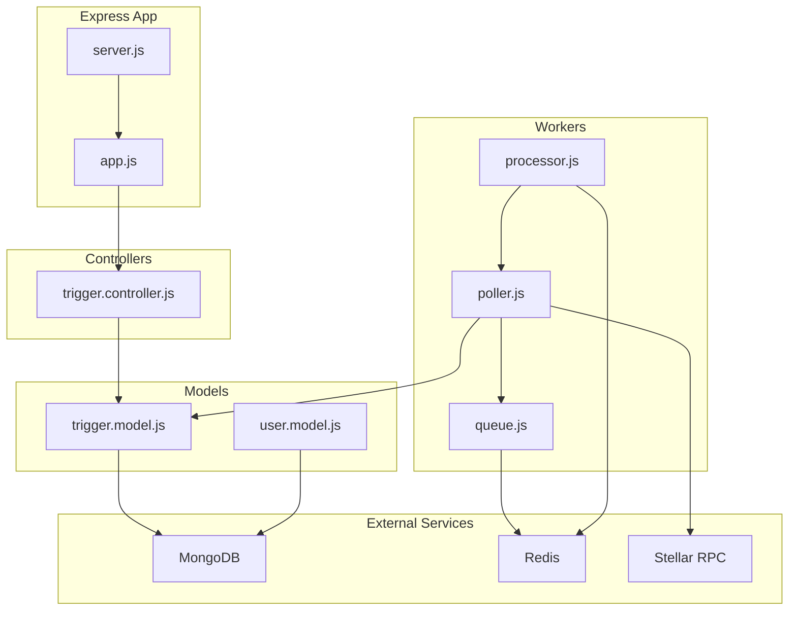
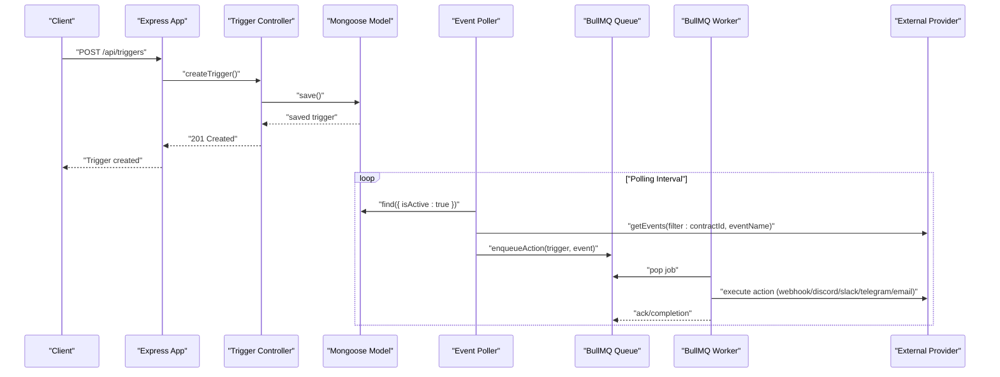
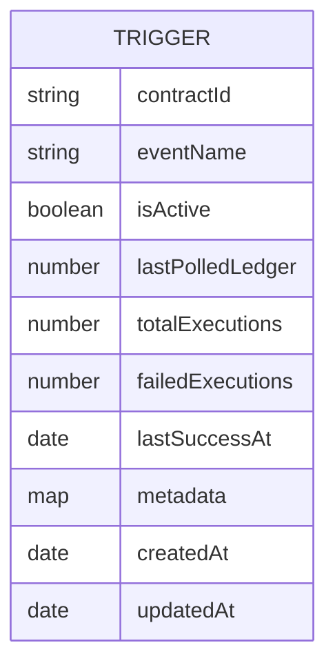
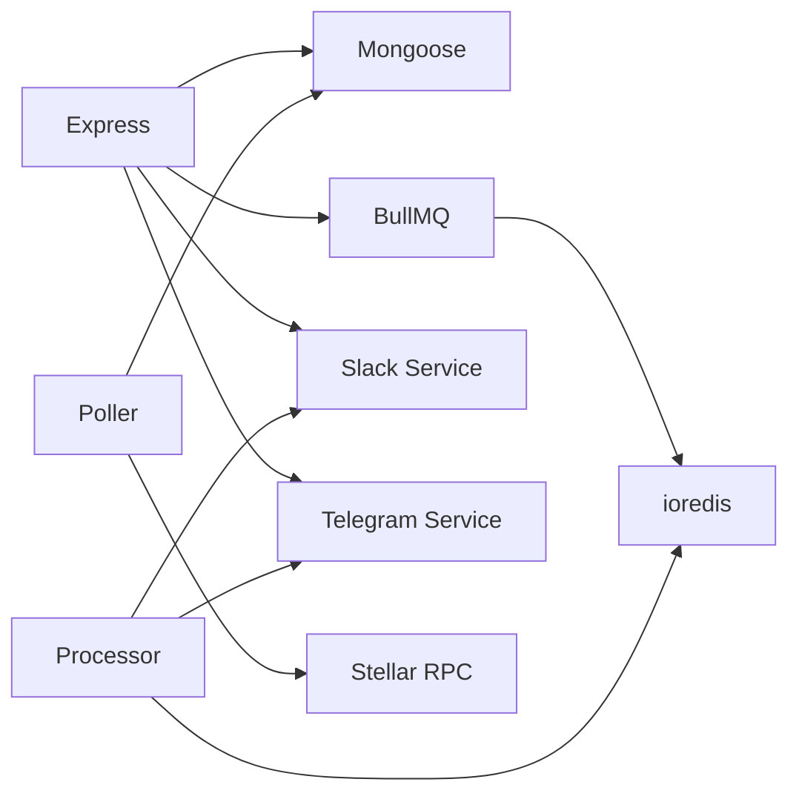

# Performance and Optimization

<cite>
**Referenced Files in This Document**
- [app.js](file://backend/src/app.js)
- [server.js](file://backend/src/server.js)
- [trigger.model.js](file://backend/src/models/trigger.model.js)
- [user.model.js](file://backend/src/models/user.model.js)
- [trigger.controller.js](file://backend/src/controllers/trigger.controller.js)
- [poller.js](file://backend/src/worker/poller.js)
- [processor.js](file://backend/src/worker/processor.js)
- [queue.js](file://backend/src/worker/queue.js)
- [slack.service.js](file://backend/src/services/slack.service.js)
- [telegram.service.js](file://backend/src/services/telegram.service.js)
- [package.json](file://backend/package.json)
</cite>

## Table of Contents
1. [Introduction](#introduction)
2. [Project Structure](#project-structure)
3. [Core Components](#core-components)
4. [Architecture Overview](#architecture-overview)
5. [Detailed Component Analysis](#detailed-component-analysis)
6. [Dependency Analysis](#dependency-analysis)
7. [Performance Considerations](#performance-considerations)
8. [Troubleshooting Guide](#troubleshooting-guide)
9. [Conclusion](#conclusion)
10. [Appendices](#appendices)

## Introduction
This document focuses on database performance optimization and monitoring strategies for the EventHorizon backend. It covers indexing strategies for frequently queried fields, query optimization, aggregation patterns, caching strategies, connection pooling, read replica configurations, write optimization patterns, monitoring metrics, benchmarking, capacity planning, maintenance tasks, cleanup procedures, and troubleshooting. The guidance is grounded in the actual codebase and highlights areas where performance improvements can be made.

## Project Structure
The backend is an Express application using Mongoose for MongoDB and BullMQ with Redis for background job processing. The event poller periodically queries Stellar RPC for contract events, matches them against active triggers, and enqueues actions for background processing.

**Diagram sources**
- [server.js:34-87](file://backend/src/server.js#L34-L87)
- [app.js:24-27](file://backend/src/app.js#L24-L27)
- [trigger.controller.js:1-72](file://backend/src/controllers/trigger.controller.js#L1-L72)
- [trigger.model.js:1-80](file://backend/src/models/trigger.model.js#L1-L80)
- [poller.js:177-310](file://backend/src/worker/poller.js#L177-L310)
- [processor.js:102-167](file://backend/src/worker/processor.js#L102-L167)
- [queue.js:19-41](file://backend/src/worker/queue.js#L19-L41)

**Section sources**
- [server.js:34-87](file://backend/src/server.js#L34-L87)
- [app.js:24-27](file://backend/src/app.js#L24-L27)
- [trigger.model.js:1-80](file://backend/src/models/trigger.model.js#L1-L80)
- [trigger.controller.js:1-72](file://backend/src/controllers/trigger.controller.js#L1-L72)
- [poller.js:177-310](file://backend/src/worker/poller.js#L177-L310)
- [processor.js:102-167](file://backend/src/worker/processor.js#L102-L167)
- [queue.js:19-41](file://backend/src/worker/queue.js#L19-L41)

## Core Components
- Database connectivity and lifecycle are managed in the server bootstrap, connecting to MongoDB and initializing workers.
- Triggers are stored in MongoDB with a dedicated schema optimized for frequent queries and statistics.
- The poller fetches events from Stellar RPC, filters by contractId and eventName, and enqueues actions for background processing.
- BullMQ worker processes actions concurrently with rate limiting and exponential backoff.
- Redis connection is configured lazily and reused across queue and worker instances.

Key performance-relevant observations:
- MongoDB indexes exist for contractId and a metadata field.
- Poller uses paginated RPC queries and configurable delays to avoid rate limits.
- Queue and worker configurations include attempts, backoff, and retention policies.

**Section sources**
- [server.js:34-87](file://backend/src/server.js#L34-L87)
- [trigger.model.js:3-62](file://backend/src/models/trigger.model.js#L3-L62)
- [poller.js:27-51](file://backend/src/worker/poller.js#L27-L51)
- [poller.js:227-277](file://backend/src/worker/poller.js#L227-L277)
- [queue.js:9-15](file://backend/src/worker/queue.js#L9-L15)
- [processor.js:14-20](file://backend/src/worker/processor.js#L14-L20)

## Architecture Overview
The system architecture couples Express routes and controllers with Mongoose models, background job processing via BullMQ/Redis, and external RPC polling. The poller reads from Stellar RPC, filters by contractId and eventName, and enqueues actions. Workers consume jobs and execute provider-specific actions.

**Diagram sources**
- [trigger.controller.js:6-28](file://backend/src/controllers/trigger.controller.js#L6-L28)
- [trigger.model.js:1-80](file://backend/src/models/trigger.model.js#L1-L80)
- [poller.js:177-310](file://backend/src/worker/poller.js#L177-L310)
- [queue.js:91-121](file://backend/src/worker/queue.js#L91-L121)
- [processor.js:25-97](file://backend/src/worker/processor.js#L25-L97)

## Detailed Component Analysis

### Database Indexing Strategies
Current indexes:
- contractId: single-field index to accelerate lookups by contract identifier.
- metadata: indexed Map to support filtered queries on metadata keys.
- timestamps: built-in createdAt/updatedAt virtuals for time-based queries.

Recommended enhancements:
- Compound indexes for common query patterns:
  - (contractId, eventName, isActive) to quickly locate active triggers for a given contract and event.
  - (isActive, createdAt) to efficiently list recent triggers.
- TTL collections for historical event/action logs if retention is required.
- Consider partial indexes for isActive=true to reduce index size and improve selectivity.

**Diagram sources**
- [trigger.model.js:3-62](file://backend/src/models/trigger.model.js#L3-L62)

**Section sources**
- [trigger.model.js:3-62](file://backend/src/models/trigger.model.js#L3-L62)

### Query Optimization Techniques
Observed patterns:
- Poller loads active triggers with a filter for isActive to minimize dataset size.
- Uses pagination with a cursor to avoid large RPC responses and manage memory.
- Applies a sliding ledger window per trigger to avoid scanning the entire history.

Optimization suggestions:
- Add a compound index (contractId, eventName, isActive) to eliminate collection scans when fetching triggers.
- Use projection to limit returned fields for listing endpoints.
- Batch updates for trigger state (lastPolledLedger) to reduce write amplification.
- Consider capped collections for event logs if applicable.

**Section sources**
- [poller.js:179-184](file://backend/src/worker/poller.js#L179-L184)
- [poller.js:227-277](file://backend/src/worker/poller.js#L227-L277)
- [trigger.controller.js:30-44](file://backend/src/controllers/trigger.controller.js#L30-L44)

### Aggregation Pipeline Patterns
Current usage:
- No explicit aggregation pipelines in the codebase.

Recommended patterns:
- Health metrics aggregation:
  - Group by contractId and compute healthScore and healthStatus for dashboards.
- Event frequency analysis:
  - Group by eventName and time buckets to measure event rates.
- Failure analysis:
  - Filter by failedExecutions and lastSuccessAt to identify unhealthy triggers.

These aggregations can feed monitoring dashboards and inform capacity planning.

**Section sources**
- [trigger.model.js:64-77](file://backend/src/models/trigger.model.js#L64-L77)

### Caching Strategies
Observed:
- No in-memory cache for database reads or RPC responses.

Recommendations:
- Application-level caches:
  - Cache active triggers by contractId/eventName to reduce DB queries during polling.
  - Cache provider credentials and tokens if reused across actions.
- Redis-backed caches:
  - Cache recent RPC responses for repeated queries within short intervals.
  - Cache computed health metrics per trigger to avoid recomputation.
- Cache invalidation:
  - Invalidate on trigger updates or deletions.
  - Use TTLs aligned with polling intervals.

**Section sources**
- [poller.js:179-184](file://backend/src/worker/poller.js#L179-L184)
- [trigger.controller.js:30-44](file://backend/src/controllers/trigger.controller.js#L30-L44)

### Database Connection Pooling
Observed:
- Mongoose default connection pool is used without explicit configuration.

Recommendations:
- Configure connection pool size and timeouts based on workload:
  - maxPoolSize and minPoolSize aligned with concurrent workers and polling threads.
  - maxIdleTimeMS and maxLifeTimeMS to manage stale connections.
- Enable connection health checks and retry on transient failures.

**Section sources**
- [server.js:35-42](file://backend/src/server.js#L35-L42)
- [package.json:20](file://backend/package.json#L20)

### Read Replica Configurations
Observed:
- Single MongoDB connection is established.

Recommendations:
- Use replicaSet connection string for high availability and read scaling.
- Route read-heavy queries (listing triggers) to secondary nodes with appropriate read concerns.
- Ensure application logic handles replica lag for eventual consistency.

**Section sources**
- [server.js:35-42](file://backend/src/server.js#L35-L42)

### Write Optimization Patterns
Observed:
- Updates to trigger state occur after successful polling cycles.

Recommendations:
- Batch writes for trigger updates to reduce write frequency.
- Use atomic updates for counters (totalExecutions, failedExecutions) to avoid race conditions.
- Consider idempotent writes with deduplication keys for actions.

**Section sources**
- [poller.js:279-281](file://backend/src/worker/poller.js#L279-L281)

### Monitoring Metrics and Benchmarking
Observed:
- Logging includes operational telemetry for health, polling, queue, and worker activities.

Recommended metrics:
- Database:
  - Query latency and error rates by endpoint and index usage.
  - Collection sizes and growth trends.
- Background Jobs:
  - Job throughput, processing time, retry counts, and failure rates.
- Polling:
  - RPC latency, page iteration time, and event volume per trigger.
- Infrastructure:
  - CPU, memory, and disk usage; Redis queue length and backpressure.

Benchmarking approach:
- Load test with varying numbers of triggers, contracts, and event rates.
- Measure p50/p95/p99 latencies for polling and job processing.
- Stress test under Redis/MongoDB resource constraints.

**Section sources**
- [poller.js:177-310](file://backend/src/worker/poller.js#L177-L310)
- [processor.js:138-159](file://backend/src/worker/processor.js#L138-L159)
- [queue.js:126-143](file://backend/src/worker/queue.js#L126-L143)

### Capacity Planning Guidelines
- Triggers per contract: estimate based on event frequency and retention windows.
- Queue backlog: monitor waiting/active counts and adjust worker concurrency.
- RPC rate limits: tune inter-page and inter-trigger delays to stay within limits.
- Storage: plan for trigger documents and logs; consider TTL-based cleanup.

**Section sources**
- [poller.js:13-15](file://backend/src/worker/poller.js#L13-L15)
- [poller.js:296-298](file://backend/src/worker/poller.js#L296-L298)
- [queue.js:126-143](file://backend/src/worker/queue.js#L126-L143)

### Database Maintenance and Cleanup
Observed:
- Queue cleanup removes completed/failed jobs older than configured thresholds.

Recommended maintenance:
- Database:
  - Periodic compaction and index rebuilds if fragmentation occurs.
  - Archive or purge old trigger logs and metrics.
- Queue:
  - Regular cleanup of completed/failed jobs with tuned retention.
  - Monitor queue depth and adjust worker scaling.

**Section sources**
- [queue.js:148-156](file://backend/src/worker/queue.js#L148-L156)

### Long-Term Performance Considerations
- Horizontal scaling:
  - Run multiple poller instances behind a leader election or partitioning scheme.
  - Scale workers horizontally and shard triggers by contractId ranges.
- Observability:
  - Instrument slow queries and long-running jobs.
  - Set up alerts for queue backlogs, DB connection pool exhaustion, and RPC throttling.
- Security and compliance:
  - Encrypt sensitive fields and restrict access to admin endpoints.

**Section sources**
- [poller.js:312-329](file://backend/src/worker/poller.js#L312-L329)
- [processor.js:102-167](file://backend/src/worker/processor.js#L102-L167)

## Dependency Analysis
The system depends on Express, Mongoose, BullMQ, and Redis. External dependencies include Stellar SDK for RPC and provider services for notifications.

**Diagram sources**
- [package.json:10-23](file://backend/package.json#L10-L23)
- [poller.js:1-10](file://backend/src/worker/poller.js#L1-L10)
- [processor.js:1-8](file://backend/src/worker/processor.js#L1-L8)
- [slack.service.js:1-5](file://backend/src/services/slack.service.js#L1-L5)
- [telegram.service.js:1-5](file://backend/src/services/telegram.service.js#L1-L5)

**Section sources**
- [package.json:10-23](file://backend/package.json#L10-L23)
- [poller.js:1-10](file://backend/src/worker/poller.js#L1-L10)
- [processor.js:1-8](file://backend/src/worker/processor.js#L1-L8)
- [slack.service.js:1-5](file://backend/src/services/slack.service.js#L1-L5)
- [telegram.service.js:1-5](file://backend/src/services/telegram.service.js#L1-L5)

## Performance Considerations
- Indexing:
  - Ensure (contractId, eventName, isActive) and (isActive, createdAt) indexes.
  - Evaluate index selectivity and storage overhead regularly.
- Query patterns:
  - Prefer targeted queries with filters and projections.
  - Use pagination and bounded time windows for polling.
- Background processing:
  - Tune worker concurrency and rate limiter to match provider SLAs.
  - Use exponential backoff and retry policies for transient failures.
- Caching:
  - Cache hot data (active triggers) and provider credentials.
  - Implement cache warming and invalidation strategies.
- Infrastructure:
  - Use replica sets for reads and backups.
  - Monitor and scale Redis and MongoDB independently.

[No sources needed since this section provides general guidance]

## Troubleshooting Guide
Common issues and resolutions:
- MongoDB connection failures:
  - Verify MONGO_URI and network connectivity; check pool exhaustion.
- Polling stalls:
  - Inspect RPC timeouts and rate limits; adjust inter-page and inter-trigger delays.
- Queue backlog growth:
  - Increase worker concurrency or reduce job payload size; review provider SLAs.
- Provider errors:
  - Slack/Telegram errors are handled gracefully; inspect logs for actionable messages.
- Slow trigger listing:
  - Add indexes and reduce projection; consider read replicas.

**Section sources**
- [server.js:80-87](file://backend/src/server.js#L80-L87)
- [poller.js:27-51](file://backend/src/worker/poller.js#L27-L51)
- [poller.js:112-134](file://backend/src/worker/poller.js#L112-L134)
- [slack.service.js:102-134](file://backend/src/services/slack.service.js#L102-L134)
- [telegram.service.js:22-57](file://backend/src/services/telegram.service.js#L22-L57)

## Conclusion
By implementing targeted database indexing, optimizing polling and background job processing, introducing caching, and establishing robust monitoring, EventHorizon can achieve predictable performance at scale. The recommendations align with observed code patterns and highlight practical steps for capacity planning, maintenance, and troubleshooting.

[No sources needed since this section summarizes without analyzing specific files]

## Appendices

### Scaling Strategies
- Horizontal scaling:
  - Multiple poller instances with coordinated state or sharding.
  - Multiple workers per queue with balanced priorities.
- Resource tuning:
  - Adjust worker concurrency and Redis/MongoDB pool sizes.
  - Use autoscaling groups for ephemeral workloads.

[No sources needed since this section provides general guidance]