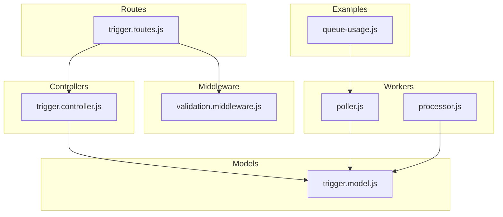
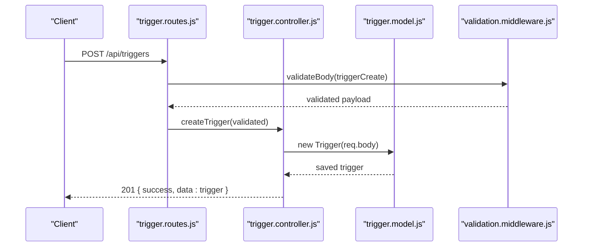
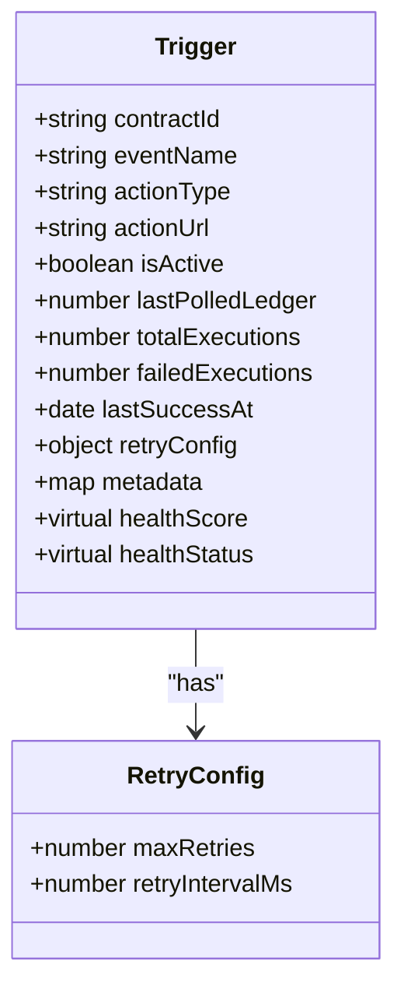
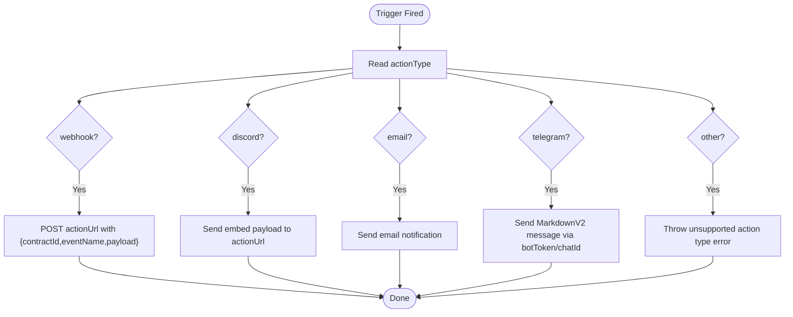
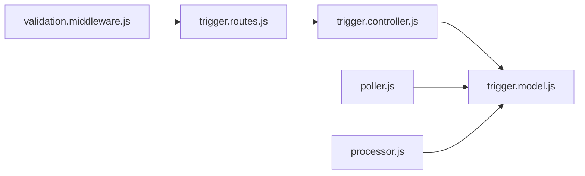

# Trigger Model

<cite>
**Referenced Files in This Document**
- [trigger.model.js](file://backend/src/models/trigger.model.js)
- [validation.middleware.js](file://backend/src/middleware/validation.middleware.js)
- [trigger.controller.js](file://backend/src/controllers/trigger.controller.js)
- [trigger.routes.js](file://backend/src/routes/trigger.routes.js)
- [processor.js](file://backend/src/worker/processor.js)
- [poller.js](file://backend/src/worker/poller.js)
- [queue-usage.js](file://backend/examples/queue-usage.js)
</cite>

## Table of Contents
1. [Introduction](#introduction)
2. [Project Structure](#project-structure)
3. [Core Components](#core-components)
4. [Architecture Overview](#architecture-overview)
5. [Detailed Component Analysis](#detailed-component-analysis)
6. [Dependency Analysis](#dependency-analysis)
7. [Performance Considerations](#performance-considerations)
8. [Troubleshooting Guide](#troubleshooting-guide)
9. [Conclusion](#conclusion)

## Introduction
This document provides comprehensive data model documentation for the Trigger schema used to configure event-driven actions upon Soroban contract events. It covers field definitions, validation rules, indexing strategies, health metrics, retry configuration, and the relationship between actionType enum values and notification delivery mechanisms. It also includes examples of trigger configurations and operational guidance.

## Project Structure
The Trigger model is defined in the backend under the Mongoose models directory and is consumed by controllers, routes, and workers. Validation is enforced via a dedicated middleware that defines allowable fields and defaults.

**Diagram sources**
- [trigger.model.js](file://backend/src/models/trigger.model.js)
- [trigger.controller.js](file://backend/src/controllers/trigger.controller.js)
- [trigger.routes.js](file://backend/src/routes/trigger.routes.js)
- [validation.middleware.js](file://backend/src/middleware/validation.middleware.js)
- [processor.js](file://backend/src/worker/processor.js)
- [poller.js](file://backend/src/worker/poller.js)
- [queue-usage.js](file://backend/examples/queue-usage.js)

**Section sources**
- [trigger.model.js](file://backend/src/models/trigger.model.js)
- [validation.middleware.js](file://backend/src/middleware/validation.middleware.js)
- [trigger.controller.js](file://backend/src/controllers/trigger.controller.js)
- [trigger.routes.js](file://backend/src/routes/trigger.routes.js)
- [processor.js](file://backend/src/worker/processor.js)
- [poller.js](file://backend/src/worker/poller.js)
- [queue-usage.js](file://backend/examples/queue-usage.js)

## Core Components
This section documents the Trigger schema fields, their types, constraints, defaults, and usage. It also explains health metrics and retry configuration.

- contractId
  - Type: String
  - Required: Yes
  - Index: Yes
  - Description: Identifier of the Soroban contract associated with the trigger.
  - Constraints: Must be present; typically a non-empty string.

- eventName
  - Type: String
  - Required: Yes
  - Description: Name of the event to watch for on the contract.

- actionType
  - Type: String
  - Required: No
  - Default: webhook
  - Enum: ["webhook", "discord", "email", "telegram"]
  - Description: Determines the delivery mechanism for the triggered action.

- actionUrl
  - Type: String
  - Required: Yes
  - Description: Endpoint or resource URL used by the selected actionType. For webhook, this is the HTTP endpoint. For discord, this is the webhook URL. For email, this is often an email address. For telegram, bot token/chatId are handled separately in the worker.

- isActive
  - Type: Boolean
  - Default: true
  - Description: Enables or disables the trigger.

- lastPolledLedger
  - Type: Number
  - Default: 0
  - Description: Tracks the last ledger processed during polling to avoid reprocessing.

- totalExecutions
  - Type: Number
  - Default: 0
  - Description: Cumulative count of action executions attempted.

- failedExecutions
  - Type: Number
  - Default: 0
  - Description: Cumulative count of failed action executions.

- lastSuccessAt
  - Type: Date
  - Optional: true
  - Description: Timestamp of the most recent successful action execution.

- retryConfig
  - Type: Object
  - Subfields:
    - maxRetries: Number, default 3
    - retryIntervalMs: Number, default 5000
  - Description: Defines retry policy for action execution failures.

- metadata
  - Type: Map<String, String>
  - Index: Yes
  - Description: Arbitrary key-value pairs for custom attributes.

- Virtual Properties
  - healthScore: Computed percentage of successful executions out of totalExecutions; returns 100 when totalExecutions is zero.
  - healthStatus: String derived from healthScore:
    - healthy: score >= 90
    - degraded: score >= 70
    - critical: score < 70

- Additional Schema Options
  - timestamps: true
  - toJSON/toObject virtuals: true

Notes on validation:
- The Mongoose schema defines enums for actionType including "telegram".
- The validation middleware schema excludes "telegram" from the allowed values for create requests.

**Section sources**
- [trigger.model.js](file://backend/src/models/trigger.model.js)
- [validation.middleware.js](file://backend/src/middleware/validation.middleware.js)

## Architecture Overview
The Trigger model integrates with the API layer, validation, and background workers. The worker executes actions based on actionType and supports retries and queue-based processing.

**Diagram sources**
- [trigger.routes.js](file://backend/src/routes/trigger.routes.js)
- [validation.middleware.js](file://backend/src/middleware/validation.middleware.js)
- [trigger.controller.js](file://backend/src/controllers/trigger.controller.js)
- [trigger.model.js](file://backend/src/models/trigger.model.js)

## Detailed Component Analysis

### Trigger Data Model
The Trigger schema defines the persisted structure and computed virtuals for health monitoring.

**Diagram sources**
- [trigger.model.js](file://backend/src/models/trigger.model.js)

**Section sources**
- [trigger.model.js](file://backend/src/models/trigger.model.js)

### Validation Rules and Business Constraints
- Required fields for creation: contractId, eventName, actionUrl.
- actionType must be one of the allowed values; default is applied if omitted.
- actionUrl must be a valid URI when actionType is webhook/discord.
- isActive defaults to true; lastPolledLedger defaults to 0.
- Mongoose schema enforces enum including "telegram"; validation middleware excludes "telegram" for create requests.

**Section sources**
- [validation.middleware.js](file://backend/src/middleware/validation.middleware.js)
- [trigger.model.js](file://backend/src/models/trigger.model.js)

### Indexing Strategies
- contractId: Indexed to optimize queries filtering by contract.
- metadata: Indexed as a Map of String to String to enable efficient lookups by keys.
- createdAt/updatedAt: Provided by timestamps option.

These indexes improve query performance for common filter patterns and metadata searches.

**Section sources**
- [trigger.model.js](file://backend/src/models/trigger.model.js)

### Health Metrics System
- healthScore: Computed as round((totalExecutions - failedExecutions) / totalExecutions * 100); equals 100 when totalExecutions is zero.
- healthStatus: 
  - healthy if healthScore >= 90
  - degraded if healthScore >= 70
  - critical otherwise

These virtuals provide a quick operational health assessment without requiring external computations.

**Section sources**
- [trigger.model.js](file://backend/src/models/trigger.model.js)

### Retry Configuration
- maxRetries: Defaults to 3; controls the number of retry attempts after initial failure.
- retryIntervalMs: Defaults to 5000; interval between retries in milliseconds.
- Execution uses these values to schedule retries and update failure counts.

**Section sources**
- [trigger.model.js](file://backend/src/models/trigger.model.js)
- [poller.js](file://backend/src/worker/poller.js)

### Notification Delivery Mechanisms and Relationship to actionType
The worker selects the delivery method based on actionType:
- webhook: Sends an HTTP POST to actionUrl with payload containing contractId, eventName, and payload.
- discord: Posts a rich embed payload to actionUrl (Discord webhook URL).
- email: Sends an email notification via the email service.
- telegram: Sends a MarkdownV2-formatted message using botToken and chatId.

Constraints:
- actionUrl is required for webhook and discord.
- telegram requires botToken and chatId to be available to the worker (handled in the worker logic).
- Unsupported actionType values cause an error.

**Diagram sources**
- [processor.js](file://backend/src/worker/processor.js)
- [poller.js](file://backend/src/worker/poller.js)

**Section sources**
- [processor.js](file://backend/src/worker/processor.js)
- [poller.js](file://backend/src/worker/poller.js)

### Examples of Trigger Configurations
Below are example configurations demonstrating different actionType values and their intended delivery mechanisms. These examples are derived from the queue usage example and worker logic.

- Webhook
  - actionType: webhook
  - actionUrl: HTTPS endpoint for receiving event notifications
  - payload delivered: contractId, eventName, payload

- Discord
  - actionType: discord
  - actionUrl: Discord webhook URL
  - payload delivered: rich embed with event details

- Email
  - actionType: email
  - actionUrl: recipient email address
  - payload delivered: via email service

- Telegram
  - actionType: telegram
  - botToken and chatId: handled by worker logic
  - payload delivered: MarkdownV2 message

Note: The validation middleware excludes "telegram" for create requests, while the Mongoose schema includes it. The worker supports "telegram".

**Section sources**
- [queue-usage.js](file://backend/examples/queue-usage.js)
- [processor.js](file://backend/src/worker/processor.js)
- [validation.middleware.js](file://backend/src/middleware/validation.middleware.js)
- [trigger.model.js](file://backend/src/models/trigger.model.js)

## Dependency Analysis
The Trigger model depends on Mongoose for schema definition and virtuals. Controllers and routes depend on the model and validation middleware. Workers depend on the model and services for delivery.

**Diagram sources**
- [validation.middleware.js](file://backend/src/middleware/validation.middleware.js)
- [trigger.routes.js](file://backend/src/routes/trigger.routes.js)
- [trigger.controller.js](file://backend/src/controllers/trigger.controller.js)
- [trigger.model.js](file://backend/src/models/trigger.model.js)
- [poller.js](file://backend/src/worker/poller.js)
- [processor.js](file://backend/src/worker/processor.js)

**Section sources**
- [trigger.model.js](file://backend/src/models/trigger.model.js)
- [validation.middleware.js](file://backend/src/middleware/validation.middleware.js)
- [trigger.controller.js](file://backend/src/controllers/trigger.controller.js)
- [trigger.routes.js](file://backend/src/routes/trigger.routes.js)
- [processor.js](file://backend/src/worker/processor.js)
- [poller.js](file://backend/src/worker/poller.js)

## Performance Considerations
- Indexes on contractId and metadata improve query performance for filtering and lookup scenarios.
- Using BullMQ for background processing reduces latency and improves reliability for external HTTP calls.
- Health metrics are computed virtually; consider caching or periodic aggregation if frequent reads are required.
- Retries introduce backoff behavior; tune maxRetries and retryIntervalMs to balance reliability and cost.

[No sources needed since this section provides general guidance]

## Troubleshooting Guide
Common issues and resolutions:
- Validation errors on creation:
  - Ensure contractId, eventName, and actionUrl are provided.
  - actionType must be one of the allowed values; default is applied if omitted.
  - actionUrl must be a valid URI for webhook/discord.

- Unsupported action type:
  - The worker throws an error for unknown actionType values.

- Missing credentials for delivery:
  - webhook/discord require actionUrl.
  - telegram requires botToken and chatId to be available to the worker.

- Queue processing issues:
  - Verify Redis connectivity and worker logs.
  - Inspect failed jobs and retry as needed.

**Section sources**
- [validation.middleware.js](file://backend/src/middleware/validation.middleware.js)
- [processor.js](file://backend/src/worker/processor.js)
- [poller.js](file://backend/src/worker/poller.js)
- [MIGRATION_GUIDE.md](file://backend/MIGRATION_GUIDE.md)

## Conclusion
The Trigger model provides a robust foundation for configuring event-driven actions against Soroban contracts. Its schema, validation rules, indexing, health metrics, and retry configuration collectively support reliable, observable, and scalable event processing. The actionType enum maps directly to supported delivery mechanisms, enabling flexible integrations with webhooks, Discord, email, and Telegram.