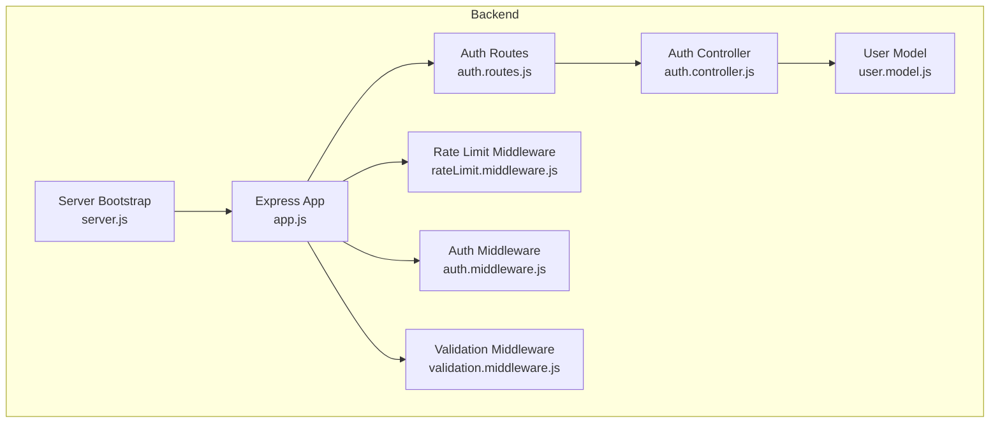
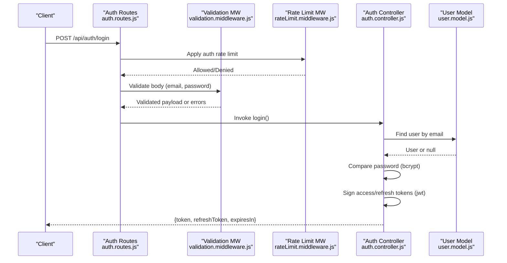
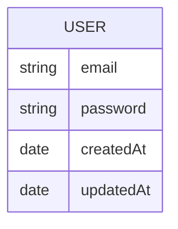
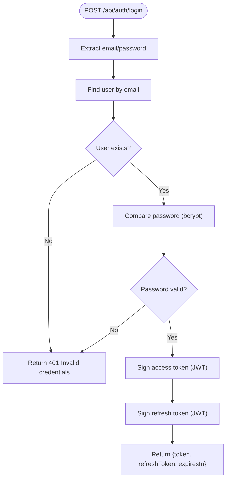
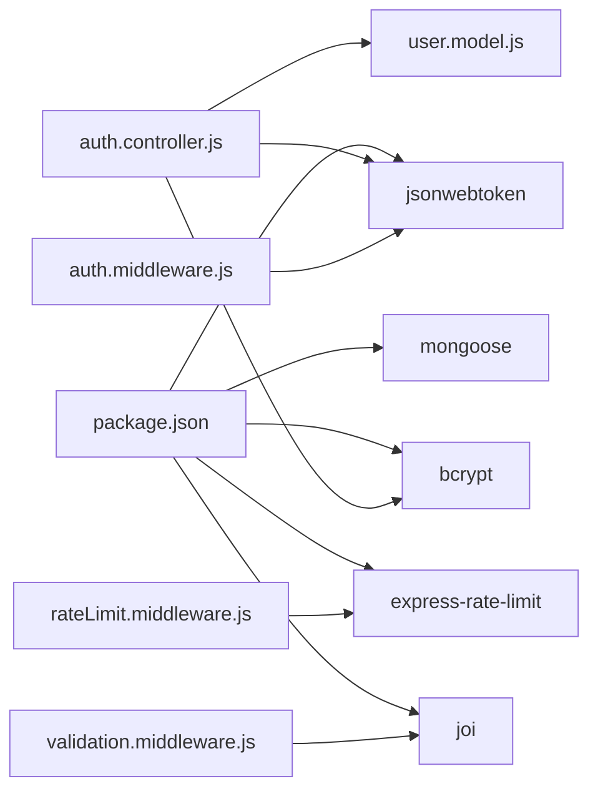

# User Model

<cite>
**Referenced Files in This Document**
- [user.model.js](file://backend/src/models/user.model.js)
- [auth.controller.js](file://backend/src/controllers/auth.controller.js)
- [auth.middleware.js](file://backend/src/middleware/auth.middleware.js)
- [auth.routes.js](file://backend/src/routes/auth.routes.js)
- [validation.middleware.js](file://backend/src/middleware/validation.middleware.js)
- [rateLimit.middleware.js](file://backend/src/middleware/rateLimit.middleware.js)
- [app.js](file://backend/src/app.js)
- [server.js](file://backend/src/server.js)
- [package.json](file://backend/package.json)
</cite>

## Table of Contents
1. [Introduction](#introduction)
2. [Project Structure](#project-structure)
3. [Core Components](#core-components)
4. [Architecture Overview](#architecture-overview)
5. [Detailed Component Analysis](#detailed-component-analysis)
6. [Dependency Analysis](#dependency-analysis)
7. [Performance Considerations](#performance-considerations)
8. [Troubleshooting Guide](#troubleshooting-guide)
9. [Conclusion](#conclusion)
10. [Appendices](#appendices)

## Introduction
This document provides comprehensive data model documentation for the User schema used in authentication and authorization. It covers user registration fields, authentication credentials, session management via short-lived access tokens and refresh tokens, and security-related attributes. It also explains password hashing, validation rules, unique constraints, and integration with authentication middleware. Role-based access control, API key management, and audit trail requirements are discussed conceptually, along with best practices for extending the current minimal model.

## Project Structure
The User model and authentication stack are implemented in the backend service under the Express application. The relevant files include:
- User model definition
- Authentication controller implementing login and token refresh
- Authentication middleware verifying access tokens
- Route bindings for authentication endpoints
- Validation middleware enforcing request schemas
- Rate limiting middleware protecting authentication endpoints
- Application bootstrap wiring middleware and routes

**Diagram sources**
- [user.model.js:1-20](file://backend/src/models/user.model.js#L1-L20)
- [auth.controller.js:1-82](file://backend/src/controllers/auth.controller.js#L1-L82)
- [auth.middleware.js:1-22](file://backend/src/middleware/auth.middleware.js#L1-L22)
- [auth.routes.js:1-38](file://backend/src/routes/auth.routes.js#L1-L38)
- [validation.middleware.js:1-49](file://backend/src/middleware/validation.middleware.js#L1-L49)
- [rateLimit.middleware.js:1-51](file://backend/src/middleware/rateLimit.middleware.js#L1-L51)
- [app.js:1-55](file://backend/src/app.js#L1-L55)
- [server.js:1-20](file://backend/src/server.js#L1-L20)

**Section sources**
- [user.model.js:1-20](file://backend/src/models/user.model.js#L1-L20)
- [auth.controller.js:1-82](file://backend/src/controllers/auth.controller.js#L1-L82)
- [auth.middleware.js:1-22](file://backend/src/middleware/auth.middleware.js#L1-L22)
- [auth.routes.js:1-38](file://backend/src/routes/auth.routes.js#L1-L38)
- [validation.middleware.js:1-49](file://backend/src/middleware/validation.middleware.js#L1-L49)
- [rateLimit.middleware.js:1-51](file://backend/src/middleware/rateLimit.middleware.js#L1-L51)
- [app.js:1-55](file://backend/src/app.js#L1-L55)
- [server.js:1-20](file://backend/src/server.js#L1-L20)

## Core Components
- User Schema: Defines email and password fields with required, unique, and normalization constraints. Includes timestamps for creation/update.
- Authentication Controller: Implements login and refresh token endpoints, integrates bcrypt for password comparison, and jwt for signed tokens.
- Authentication Middleware: Extracts and validates bearer tokens for protected routes.
- Validation Middleware: Enforces schema-based validation for request bodies, including authentication credentials.
- Rate Limit Middleware: Applies global and authentication-specific rate limits.
- Routing: Exposes login and refresh endpoints under /api/auth.

Key model and security attributes:
- Email: required, unique, lowercased, trimmed.
- Password: required; hashed externally before persistence.
- Access Token: short-lived, signed with a secret.
- Refresh Token: longer-lived, signed with a separate secret.
- Validation: email format and minimum password length enforced.

**Section sources**
- [user.model.js:3-18](file://backend/src/models/user.model.js#L3-L18)
- [auth.controller.js:5-10](file://backend/src/controllers/auth.controller.js#L5-L10)
- [auth.controller.js:15-52](file://backend/src/controllers/auth.controller.js#L15-L52)
- [auth.controller.js:57-82](file://backend/src/controllers/auth.controller.js#L57-L82)
- [auth.middleware.js:5-22](file://backend/src/middleware/auth.middleware.js#L5-L22)
- [validation.middleware.js:12-16](file://backend/src/middleware/validation.middleware.js#L12-L16)
- [rateLimit.middleware.js:39-45](file://backend/src/middleware/rateLimit.middleware.js#L39-L45)
- [auth.routes.js:26-36](file://backend/src/routes/auth.routes.js#L26-L36)

## Architecture Overview
The authentication flow integrates route handlers, validation, controller logic, middleware, and the user model. Requests to authentication endpoints are rate-limited and validated before reaching the controller, which performs credential verification and token issuance.

**Diagram sources**
- [auth.routes.js:26](file://backend/src/routes/auth.routes.js#L26)
- [validation.middleware.js:24-41](file://backend/src/middleware/validation.middleware.js#L24-L41)
- [rateLimit.middleware.js:39-45](file://backend/src/middleware/rateLimit.middleware.js#L39-L45)
- [auth.controller.js:15-52](file://backend/src/controllers/auth.controller.js#L15-L52)
- [user.model.js:19](file://backend/src/models/user.model.js#L19)

**Section sources**
- [auth.routes.js:26](file://backend/src/routes/auth.routes.js#L26)
- [validation.middleware.js:24-41](file://backend/src/middleware/validation.middleware.js#L24-L41)
- [rateLimit.middleware.js:39-45](file://backend/src/middleware/rateLimit.middleware.js#L39-L45)
- [auth.controller.js:15-52](file://backend/src/controllers/auth.controller.js#L15-L52)
- [user.model.js:19](file://backend/src/models/user.model.js#L19)

## Detailed Component Analysis

### User Schema
The User schema defines the core identity fields and metadata:
- email: string, required, unique, lowercased, trimmed
- password: string, required
- timestamps: createdAt, updatedAt automatically managed by Mongoose

**Diagram sources**
- [user.model.js:3-18](file://backend/src/models/user.model.js#L3-L18)

**Section sources**
- [user.model.js:3-18](file://backend/src/models/user.model.js#L3-L18)

### Authentication Controller
Responsibilities:
- Login: Validates presence of email/password, finds user by email, compares password, signs access and refresh tokens, returns token and expiry.
- Refresh Token: Verifies refresh token against refresh secret, reissues access token.

Security and behavior:
- Uses bcrypt to compare passwords.
- Issues access tokens with short expiration and refresh tokens with longer expiration.
- Returns structured JSON responses; handles invalid credentials and server errors.

**Diagram sources**
- [auth.controller.js:15-52](file://backend/src/controllers/auth.controller.js#L15-L52)

**Section sources**
- [auth.controller.js:5-10](file://backend/src/controllers/auth.controller.js#L5-L10)
- [auth.controller.js:15-52](file://backend/src/controllers/auth.controller.js#L15-L52)
- [auth.controller.js:57-82](file://backend/src/controllers/auth.controller.js#L57-L82)

### Authentication Middleware
Responsibilities:
- Extracts Authorization header, verifies bearer token signature against configured secret.
- Attaches decoded user info to request for downstream routes.
- Returns unauthorized for missing/invalid/expired tokens.

Integration:
- Applied globally to protect routes after authentication middleware is registered.

**Section sources**
- [auth.middleware.js:5-22](file://backend/src/middleware/auth.middleware.js#L5-L22)

### Validation Middleware
Responsibilities:
- Provides schema for authentication credentials: email (required, email format, trimmed) and password (required, min length).
- Converts and strips unknown fields for body requests.
- Returns structured validation errors with field and message details.

**Section sources**
- [validation.middleware.js:12-16](file://backend/src/middleware/validation.middleware.js#L12-L16)
- [validation.middleware.js:24-41](file://backend/src/middleware/validation.middleware.js#L24-L41)

### Rate Limit Middleware
Responsibilities:
- Global rate limiter applies to all requests.
- Authentication rate limiter applies specifically to /api/auth routes.
- Returns standardized error response with retry-after seconds when exceeded.

**Section sources**
- [rateLimit.middleware.js:31-45](file://backend/src/middleware/rateLimit.middleware.js#L31-L45)

### Routing and Bootstrapping
- Routes bind POST /api/auth/login and POST /api/auth/refresh to controller actions.
- Authentication endpoints are rate-limited at the application level.
- Authentication middleware is applied to protected routes.

**Section sources**
- [auth.routes.js:26-36](file://backend/src/routes/auth.routes.js#L26-L36)
- [app.js:22](file://backend/src/app.js#L22)
- [server.js:16](file://backend/src/server.js#L16)

## Dependency Analysis
External libraries and their roles:
- bcrypt: password hashing and comparison
- jsonwebtoken: signing and verifying JWTs for access and refresh tokens
- joi: schema validation for request bodies
- mongoose: ODM for MongoDB, enabling schema definition and model creation
- express-rate-limit: rate limiting for global and auth endpoints

**Diagram sources**
- [package.json:10-22](file://backend/package.json#L10-L22)
- [auth.controller.js:1-3](file://backend/src/controllers/auth.controller.js#L1-L3)
- [auth.middleware.js:1](file://backend/src/middleware/auth.middleware.js#L1)
- [validation.middleware.js:1](file://backend/src/middleware/validation.middleware.js#L1)
- [rateLimit.middleware.js:1](file://backend/src/middleware/rateLimit.middleware.js#L1)
- [user.model.js:1](file://backend/src/models/user.model.js#L1)

**Section sources**
- [package.json:10-22](file://backend/package.json#L10-L22)

## Performance Considerations
- Token Lifetimes: Short-lived access tokens reduce exposure windows; refresh tokens provide controlled renewal.
- Hashing Cost: bcrypt cost can be tuned for acceptable login latency while maintaining security.
- Rate Limiting: Separate auth rate limiter reduces brute-force attempts on login.
- Indexing: Unique index on email supports efficient lookup during authentication.
- Payload Size: Keep token payloads minimal to reduce network overhead.

[No sources needed since this section provides general guidance]

## Troubleshooting Guide
Common issues and resolutions:
- Invalid Credentials: Returned when user does not exist or password comparison fails.
- Missing or Invalid Bearer Token: Unauthorized responses when Authorization header is absent or token is invalid/expired.
- Validation Errors: Structured validation failures for malformed or missing fields in request bodies.
- Too Many Requests: Auth rate limiter blocks repeated attempts; client should retry after the indicated seconds.

Operational checks:
- Verify JWT secrets are configured in environment variables.
- Ensure bcrypt is installed and compatible with Node.js runtime.
- Confirm rate limit thresholds match deployment needs.

**Section sources**
- [auth.controller.js:21-30](file://backend/src/controllers/auth.controller.js#L21-L30)
- [auth.middleware.js:9-21](file://backend/src/middleware/auth.middleware.js#L9-L21)
- [validation.middleware.js:31-37](file://backend/src/middleware/validation.middleware.js#L31-L37)
- [rateLimit.middleware.js:18-28](file://backend/src/middleware/rateLimit.middleware.js#L18-L28)

## Conclusion
The User model and authentication stack implement a minimal yet secure foundation for admin login and session management. The design leverages bcrypt for password handling, JWT for tokens, Joi for validation, and express-rate-limit for protection. Extending the model to support role-based access control, API keys, and audit trails requires careful consideration of schema changes, middleware updates, and security policies.

[No sources needed since this section summarizes without analyzing specific files]

## Appendices

### Field Definitions and Constraints
- email
  - Type: string
  - Required: true
  - Unique: true
  - Normalization: lowercased, trimmed
  - Validation: email format enforced by validator
- password
  - Type: string
  - Required: true
  - Stored securely via hashing (bcrypt)
- timestamps
  - createdAt: automatic
  - updatedAt: automatic

**Section sources**
- [user.model.js:5-11](file://backend/src/models/user.model.js#L5-L11)
- [user.model.js:12-15](file://backend/src/models/user.model.js#L12-L15)
- [validation.middleware.js:13-14](file://backend/src/middleware/validation.middleware.js#L13-L14)

### Token Lifecycle
- Access Token
  - Purpose: Short-lived authentication for protected routes
  - Expiration: Configurable (e.g., hours)
  - Secret: Environment-configurable
- Refresh Token
  - Purpose: Renew access tokens without re-entering credentials
  - Expiration: Longer-lived (e.g., days)
  - Secret: Separate environment-configurable secret

**Section sources**
- [auth.controller.js:5-10](file://backend/src/controllers/auth.controller.js#L5-L10)
- [auth.controller.js:32-42](file://backend/src/controllers/auth.controller.js#L32-L42)
- [auth.controller.js:58-78](file://backend/src/controllers/auth.controller.js#L58-L78)

### Validation Rules Summary
- Authentication Credentials
  - email: required, string, email format, trimmed
  - password: required, minimum length enforced

**Section sources**
- [validation.middleware.js:12-16](file://backend/src/middleware/validation.middleware.js#L12-L16)

### Security Best Practices
- Secrets Management
  - Store JWT secrets in environment variables; rotate periodically.
- Password Handling
  - Enforce strong password policies; consider multi-factor authentication.
- Token Storage
  - Store refresh tokens securely (e.g., httpOnly cookies) when applicable.
- Audit and Monitoring
  - Log authentication events and anomalies; monitor rate limit triggers.
- Least Privilege
  - Define roles and scopes; gate endpoints accordingly.

[No sources needed since this section provides general guidance]