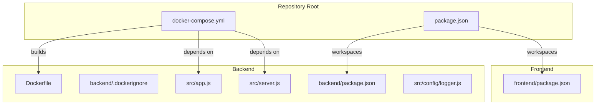
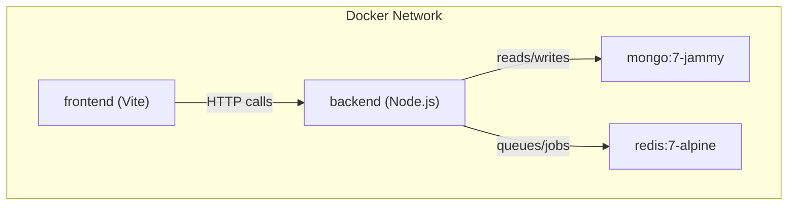
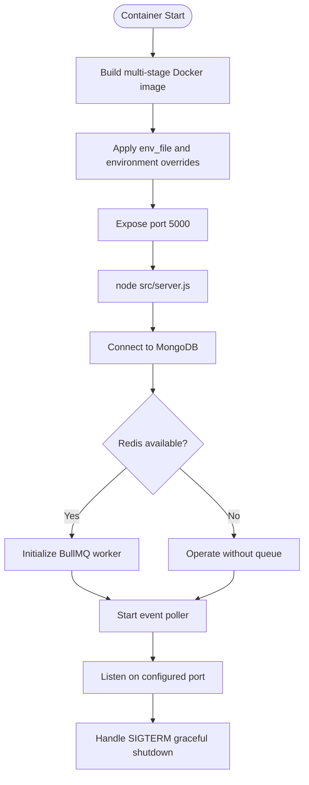
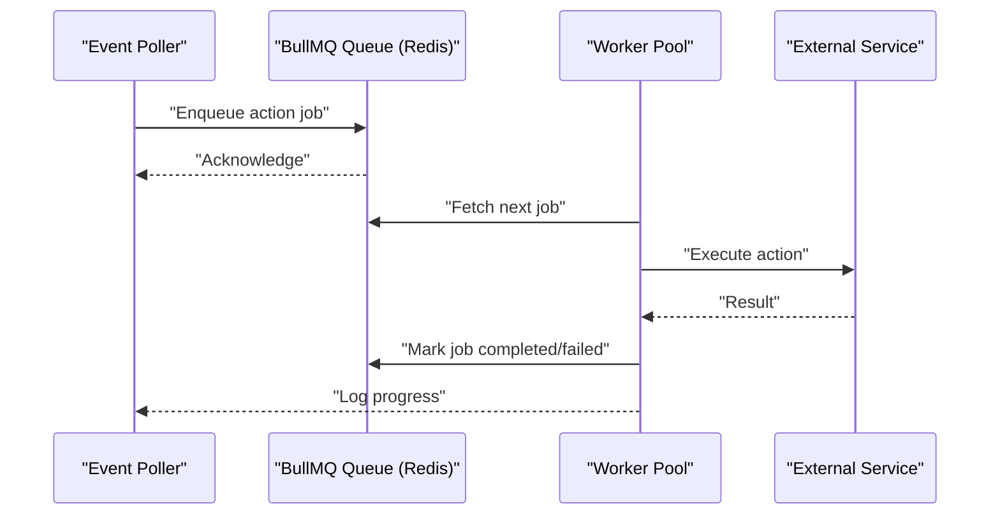
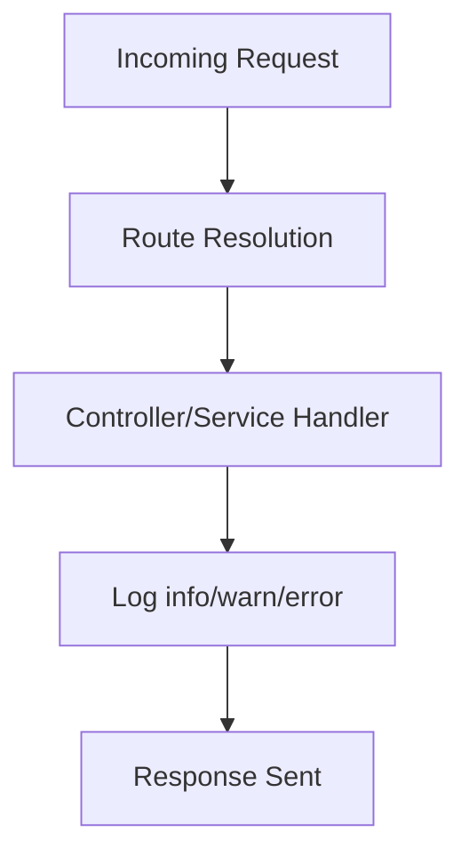
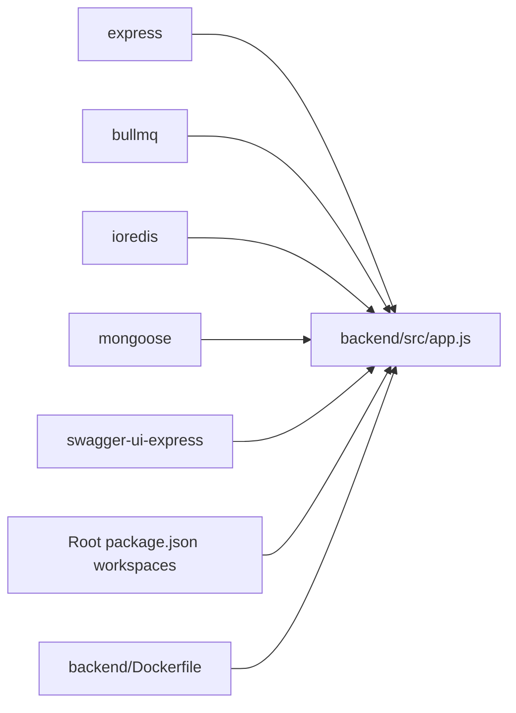

# Deployment and Operations

<cite>
**Referenced Files in This Document**
- [docker-compose.yml](file://docker-compose.yml)
- [backend/Dockerfile](file://backend/Dockerfile)
- [backend/.dockerignore](file://backend/.dockerignore)
- [backend/package.json](file://backend/package.json)
- [package.json](file://package.json)
- [backend/src/app.js](file://backend/src/app.js)
- [backend/src/server.js](file://backend/src/server.js)
- [backend/src/config/logger.js](file://backend/src/config/logger.js)
- [README.md](file://README.md)
- [backend/QUEUE_SETUP.md](file://backend/QUEUE_SETUP.md)
- [backend/MIGRATION_GUIDE.md](file://backend/MIGRATION_GUIDE.md)
- [backend/QUICKSTART_QUEUE.md](file://backend/QUICKSTART_QUEUE.md)
- [backend/REDIS_OPTIONAL.md](file://backend/REDIS_OPTIONAL.md)
</cite>

## Table of Contents
1. [Introduction](#introduction)
2. [Project Structure](#project-structure)
3. [Core Components](#core-components)
4. [Architecture Overview](#architecture-overview)
5. [Detailed Component Analysis](#detailed-component-analysis)
6. [Dependency Analysis](#dependency-analysis)
7. [Performance Considerations](#performance-considerations)
8. [Troubleshooting Guide](#troubleshooting-guide)
9. [Production Deployment Best Practices](#production-deployment-best-practices)
10. [Monitoring and Alerting](#monitoring-and-alerting)
11. [Maintenance Procedures](#maintenance-procedures)
12. [Security Considerations](#security-considerations)
13. [Backup and Disaster Recovery](#backup-and-disaster-recovery)
14. [Migration and Upgrade Procedures](#migration-and-upgrade-procedures)
15. [Operational Runbooks](#operational-runbooks)
16. [Conclusion](#conclusion)

## Introduction
This document provides comprehensive guidance for deploying and operating the EventHorizon platform. It covers Docker-based deployment, environment configuration, infrastructure requirements, multi-service orchestration with MongoDB and Redis, scaling and load-balancing strategies, production best practices, monitoring and alerting, maintenance, troubleshooting, performance optimization, capacity planning, security, backup and disaster recovery, migration and upgrade procedures, and operational runbooks.

## Project Structure
EventHorizon is a monorepo with workspaces for backend and frontend. The backend is a Node.js/Express application that integrates with MongoDB for persistence and optionally Redis via BullMQ for background job processing. The repository includes a Docker Compose setup for local development and a multi-stage Dockerfile for production builds.

**Diagram sources**
- [docker-compose.yml](file://docker-compose.yml)
- [backend/Dockerfile](file://backend/Dockerfile)
- [backend/.dockerignore](file://backend/.dockerignore)
- [backend/package.json](file://backend/package.json)
- [package.json](file://package.json)
- [backend/src/app.js](file://backend/src/app.js)
- [backend/src/server.js](file://backend/src/server.js)
- [backend/src/config/logger.js](file://backend/src/config/logger.js)

**Section sources**
- [docker-compose.yml](file://docker-compose.yml)
- [backend/Dockerfile](file://backend/Dockerfile)
- [backend/.dockerignore](file://backend/.dockerignore)
- [backend/package.json](file://backend/package.json)
- [package.json](file://package.json)

## Core Components
- Backend service: Node.js/Express application exposing health checks, API routes, and queue monitoring endpoints when Redis is available.
- MongoDB: Primary data store for triggers and users.
- Redis: Optional queue backend for reliable background job processing via BullMQ.
- Frontend: Vite/React dashboard for managing triggers (development mode).

Key runtime behaviors:
- Health endpoint: Confirms API process availability.
- Graceful shutdown: SIGTERM closes workers and database connections.
- Logger: Structured logging with environment-aware verbosity.
- Queue fallback: If Redis is unavailable, the system operates without background processing.

**Section sources**
- [backend/src/app.js](file://backend/src/app.js)
- [backend/src/server.js](file://backend/src/server.js)
- [backend/src/config/logger.js](file://backend/src/config/logger.js)
- [backend/REDIS_OPTIONAL.md](file://backend/REDIS_OPTIONAL.md)

## Architecture Overview
The system consists of three primary containers orchestrated by Docker Compose:
- MongoDB: Persistent storage for application data.
- Redis: In-memory store for job queues and caching.
- Backend: Application server with optional queue worker and event poller.
- Frontend: Development server for the dashboard.

**Diagram sources**
- [docker-compose.yml](file://docker-compose.yml)

**Section sources**
- [docker-compose.yml](file://docker-compose.yml)

## Detailed Component Analysis

### Backend Container
- Build: Multi-stage Dockerfile with non-root user and minimal production image.
- Entrypoint: Starts the Express server.
- Environment: Exposes production-ready defaults and accepts overrides via env_file and environment variables.
- Ports: Publishes the application port with host binding controlled by an environment variable.
- Dependencies: Express, BullMQ, ioredis, mongoose, swagger-ui-express, and others.

**Diagram sources**
- [backend/Dockerfile](file://backend/Dockerfile)
- [backend/src/server.js](file://backend/src/server.js)
- [backend/REDIS_OPTIONAL.md](file://backend/REDIS_OPTIONAL.md)

**Section sources**
- [backend/Dockerfile](file://backend/Dockerfile)
- [backend/src/server.js](file://backend/src/server.js)
- [backend/REDIS_OPTIONAL.md](file://backend/REDIS_OPTIONAL.md)

### Queue System (BullMQ + Redis)
- Purpose: Decouple event detection from external action execution for reliability, retries, and observability.
- Configuration: Host, port, password, and worker concurrency are configurable via environment variables.
- Endpoints: Queue statistics, job listing, cleanup, and retry.
- Monitoring: Optional web UI via Bull Board; logs provide job lifecycle visibility.

**Diagram sources**
- [backend/QUEUE_SETUP.md](file://backend/QUEUE_SETUP.md)

**Section sources**
- [backend/QUEUE_SETUP.md](file://backend/QUEUE_SETUP.md)
- [backend/MIGRATION_GUIDE.md](file://backend/MIGRATION_GUIDE.md)
- [backend/QUICKSTART_QUEUE.md](file://backend/QUICKSTART_QUEUE.md)

### Health and Logging
- Health endpoint: Lightweight readiness/liveness indicator.
- Logger: Structured console logging with severity levels and environment filtering.

**Diagram sources**
- [backend/src/app.js](file://backend/src/app.js)
- [backend/src/config/logger.js](file://backend/src/config/logger.js)

**Section sources**
- [backend/src/app.js](file://backend/src/app.js)
- [backend/src/config/logger.js](file://backend/src/config/logger.js)

## Dependency Analysis
- Runtime dependencies (backend):
  - Express for HTTP routing and middleware.
  - BullMQ and ioredis for queue processing.
  - Mongoose for MongoDB connectivity.
  - Swagger UI for API documentation.
- Workspace dependencies:
  - Root package defines workspaces for backend and frontend.
- Docker:
  - Multi-stage build reduces attack surface and image size.
  - .dockerignore excludes test files and development artifacts.

**Diagram sources**
- [backend/package.json](file://backend/package.json)
- [package.json](file://package.json)
- [backend/Dockerfile](file://backend/Dockerfile)

**Section sources**
- [backend/package.json](file://backend/package.json)
- [package.json](file://package.json)
- [backend/Dockerfile](file://backend/Dockerfile)

## Performance Considerations
- Queue concurrency: Tune worker concurrency to match workload and external service limits.
- Backoff and retries: Automatic retries with exponential backoff reduce transient failure impact.
- Rate limiting: Built-in rate limiters protect downstream systems.
- Memory and CPU: Redis adds memory overhead; monitor utilization and scale accordingly.
- Scaling horizontally: Run multiple backend instances behind a load balancer; ensure shared Redis and MongoDB.

[No sources needed since this section provides general guidance]

## Troubleshooting Guide
Common deployment and runtime issues:
- Redis connection failures: Verify Redis is reachable and credentials are correct.
- Jobs stuck in waiting: Inspect worker logs and restart the backend container.
- High memory usage: Lower concurrency or prune old jobs.
- Failed jobs: Review logs and validate external service credentials.
- Graceful shutdown: Ensure SIGTERM handling completes active jobs and closes DB connections.

**Section sources**
- [backend/QUEUE_SETUP.md](file://backend/QUEUE_SETUP.md)
- [backend/MIGRATION_GUIDE.md](file://backend/MIGRATION_GUIDE.md)
- [backend/QUICKSTART_QUEUE.md](file://backend/QUICKSTART_QUEUE.md)
- [backend/REDIS_OPTIONAL.md](file://backend/REDIS_OPTIONAL.md)
- [backend/src/server.js](file://backend/src/server.js)

## Production Deployment Best Practices
- Use managed databases:
  - MongoDB Atlas or equivalent for high availability and backups.
  - Managed Redis (e.g., AWS ElastiCache, Azure Cache, GCP Memorystore) for resilience.
- Security hardening:
  - Enforce TLS for Redis and MongoDB.
  - Use secrets management for URIs and passwords.
  - Restrict network access to internal VPC and apply firewall rules.
- Environment segregation:
  - Separate environments (staging/production) with distinct Redis and MongoDB instances.
- Resource sizing:
  - Provision adequate CPU/memory for the backend and Redis based on expected job throughput.
- Networking:
  - Place backend behind a reverse proxy/load balancer; configure health checks against the health endpoint.

[No sources needed since this section provides general guidance]

## Monitoring and Alerting
- Health endpoint: Use for basic liveness/readiness probes.
- Queue metrics: Expose queue statistics and integrate with monitoring dashboards.
- Logs: Centralize application logs and correlate with Redis/MongoDB logs.
- Alerts:
  - High failed job counts.
  - Elevated latency or timeouts to external services.
  - Redis memory pressure or eviction events.
  - Database connection pool exhaustion.

**Section sources**
- [backend/src/app.js](file://backend/src/app.js)
- [backend/QUEUE_SETUP.md](file://backend/QUEUE_SETUP.md)

## Maintenance Procedures
- Routine tasks:
  - Periodic pruning of old completed/failed jobs.
  - Review and rotate secrets.
  - Patch Node.js base images and dependencies regularly.
- Capacity planning:
  - Track queue backlog and worker utilization trends.
  - Scale Redis and backend instances based on observed load.
- Database maintenance:
  - Indexes and collection organization for triggers/users.
  - Backup verification and restore drills.

**Section sources**
- [backend/QUEUE_SETUP.md](file://backend/QUEUE_SETUP.md)
- [backend/MIGRATION_GUIDE.md](file://backend/MIGRATION_GUIDE.md)

## Security Considerations
- Secrets management:
  - Store sensitive environment variables externally (CI/CD secrets vaults).
- Network security:
  - Isolate MongoDB and Redis in private subnets.
  - Use VPN or bastion hosts for administrative access.
- Transport security:
  - Enable TLS for Redis and MongoDB.
- Least privilege:
  - Run backend as a non-root user inside the container.
- Input validation and rate limiting:
  - Middleware enforces rate limits and validates requests.

**Section sources**
- [backend/Dockerfile](file://backend/Dockerfile)
- [backend/src/server.js](file://backend/src/server.js)
- [backend/src/app.js](file://backend/src/app.js)

## Backup and Disaster Recovery
- MongoDB:
  - Use automated backups (cloud provider or self-managed) with point-in-time recovery.
  - Validate periodic restores in non-production environments.
- Redis:
  - Enable AOF/RDB persistence; snapshot and replicate as appropriate.
  - Maintain offsite backups of Redis snapshots.
- DR scenarios:
  - Failover to secondary region with updated DNS/CNAME.
  - Restore latest backups and replay logs where applicable.
  - Orchestrate failback after resolving the incident.

[No sources needed since this section provides general guidance]

## Migration and Upgrade Procedures
- From direct execution to queue-based processing:
  - Install Redis and configure environment variables.
  - Restart backend; verify worker starts and queue stats endpoint responds.
- Rolling upgrades:
  - Use blue/green deployments or rolling restarts with zero-downtime strategy.
  - Ensure Redis remains available during transitions.
- Rollback:
  - Stop backend, revert to previous image, and restart.
  - If necessary, disable queue-related initialization and rely on direct execution.

**Section sources**
- [backend/MIGRATION_GUIDE.md](file://backend/MIGRATION_GUIDE.md)
- [backend/QUICKSTART_QUEUE.md](file://backend/QUICKSTART_QUEUE.md)
- [backend/REDIS_OPTIONAL.md](file://backend/REDIS_OPTIONAL.md)

## Operational Runbooks

### Initial Deployment (Docker Compose)
- Prepare environment variables and secrets.
- Start services with Docker Compose; confirm health endpoint responses.
- Validate MongoDB and Redis connectivity.

**Section sources**
- [docker-compose.yml](file://docker-compose.yml)
- [README.md](file://README.md)

### Scaling Out
- Horizontal scaling:
  - Run multiple backend replicas behind a load balancer.
  - Ensure shared Redis and MongoDB are highly available.
- Vertical scaling:
  - Increase CPU/memory for backend and Redis based on metrics.

**Section sources**
- [docker-compose.yml](file://docker-compose.yml)
- [backend/QUEUE_SETUP.md](file://backend/QUEUE_SETUP.md)

### Queue Management
- Monitor queue statistics and job statuses.
- Clean old jobs periodically to control Redis memory.
- Retry failed jobs after resolving root causes.

**Section sources**
- [backend/QUEUE_SETUP.md](file://backend/QUEUE_SETUP.md)
- [backend/MIGRATION_GUIDE.md](file://backend/MIGRATION_GUIDE.md)

### Graceful Shutdown and Restart
- Send SIGTERM to backend; verify worker and DB connections close cleanly.
- Restart backend; confirm queue worker initializes and poller resumes.

**Section sources**
- [backend/src/server.js](file://backend/src/server.js)

### Redis Outage Handling
- If Redis becomes unreachable, the system degrades to direct execution mode.
- Investigate Redis connectivity and restart backend after Redis is restored.

**Section sources**
- [backend/REDIS_OPTIONAL.md](file://backend/REDIS_OPTIONAL.md)

### Database Connectivity Issues
- Verify MongoDB URI and credentials.
- Check network connectivity and firewall rules.
- Restart backend after resolving connectivity.

**Section sources**
- [backend/src/server.js](file://backend/src/server.js)

## Conclusion
EventHorizon’s deployment model leverages Docker Compose for local development and a multi-stage Dockerfile for production. The backend integrates MongoDB for persistence and Redis via BullMQ for resilient, scalable background processing. By following the operational runbooks, best practices, and troubleshooting steps outlined here, teams can deploy, monitor, and maintain a reliable, secure, and scalable EventHorizon platform.