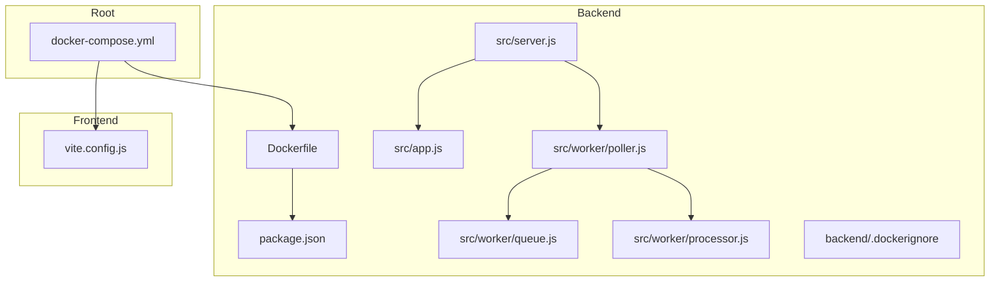
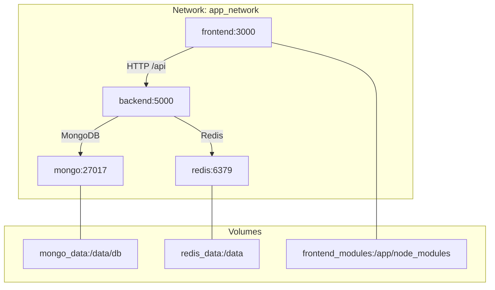
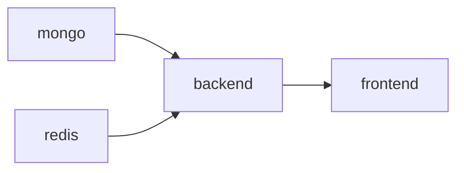

# Docker Deployment

<cite>
**Referenced Files in This Document**
- [docker-compose.yml](file://docker-compose.yml)
- [backend/Dockerfile](file://backend/Dockerfile)
- [backend/.dockerignore](file://backend/.dockerignore)
- [backend/package.json](file://backend/package.json)
- [backend/src/server.js](file://backend/src/server.js)
- [backend/src/app.js](file://backend/src/app.js)
- [backend/src/worker/queue.js](file://backend/src/worker/queue.js)
- [backend/src/worker/processor.js](file://backend/src/worker/processor.js)
- [backend/src/worker/poller.js](file://backend/src/worker/poller.js)
- [backend/REDIS_OPTIONAL.md](file://backend/REDIS_OPTIONAL.md)
- [frontend/vite.config.js](file://frontend/vite.config.js)
- [README.md](file://README.md)
</cite>

## Table of Contents
1. [Introduction](#introduction)
2. [Project Structure](#project-structure)
3. [Core Components](#core-components)
4. [Architecture Overview](#architecture-overview)
5. [Detailed Component Analysis](#detailed-component-analysis)
6. [Dependency Analysis](#dependency-analysis)
7. [Performance Considerations](#performance-considerations)
8. [Troubleshooting Guide](#troubleshooting-guide)
9. [Conclusion](#conclusion)
10. [Appendices](#appendices)

## Introduction
This document provides comprehensive Docker-based deployment guidance for the EventHorizon platform. It covers a multi-container architecture with MongoDB, Redis, a Node.js backend, and a Vite/React frontend. You will learn how docker-compose.yml defines services, networking, volumes, and environment variables; how the backend Dockerfile builds a secure, production-ready container; how ports are mapped and services depend on each other; and how to deploy, manage, and troubleshoot the system. Volume persistence for MongoDB and Redis is documented, along with inter-service communication patterns.

## Project Structure
The deployment spans three primary directories:
- backend: Node.js/Express server, worker, and queue system
- frontend: Vite/React dashboard
- root: docker-compose orchestration and shared configuration

**Diagram sources**
- [docker-compose.yml](file://docker-compose.yml)
- [backend/Dockerfile](file://backend/Dockerfile)
- [backend/package.json](file://backend/package.json)
- [backend/src/server.js](file://backend/src/server.js)
- [backend/src/app.js](file://backend/src/app.js)
- [backend/src/worker/queue.js](file://backend/src/worker/queue.js)
- [backend/src/worker/processor.js](file://backend/src/worker/processor.js)
- [backend/src/worker/poller.js](file://backend/src/worker/poller.js)
- [backend/.dockerignore](file://backend/.dockerignore)
- [frontend/vite.config.js](file://frontend/vite.config.js)

**Section sources**
- [docker-compose.yml](file://docker-compose.yml)
- [backend/Dockerfile](file://backend/Dockerfile)
- [backend/package.json](file://backend/package.json)
- [backend/src/server.js](file://backend/src/server.js)
- [backend/src/app.js](file://backend/src/app.js)
- [backend/src/worker/queue.js](file://backend/src/worker/queue.js)
- [backend/src/worker/processor.js](file://backend/src/worker/processor.js)
- [backend/src/worker/poller.js](file://backend/src/worker/poller.js)
- [backend/.dockerignore](file://backend/.dockerignore)
- [frontend/vite.config.js](file://frontend/vite.config.js)

## Core Components
- MongoDB service: persistent database for triggers and related data
- Redis service: optional queue backend for background job processing
- Backend service: Express server, health checks, API routes, worker, and poller
- Frontend service: Vite dev server with proxy to backend API

Key runtime characteristics:
- Backend exposes port 5000 and binds to the host port via an environment variable with a default fallback
- Frontend runs on port 3000 and proxies API calls to the backend service name
- Both MongoDB and Redis persist data via named volumes
- Inter-service DNS names are used for internal communication

**Section sources**
- [docker-compose.yml](file://docker-compose.yml)
- [backend/src/server.js](file://backend/src/server.js)
- [backend/src/app.js](file://backend/src/app.js)
- [frontend/vite.config.js](file://frontend/vite.config.js)

## Architecture Overview
The system uses a dedicated bridge network for internal service communication. The backend connects to MongoDB and optionally Redis. The frontend communicates with the backend via the internal network. Persistent volumes ensure data survives container recreation.

**Diagram sources**
- [docker-compose.yml](file://docker-compose.yml)
- [backend/src/server.js](file://backend/src/server.js)
- [backend/src/worker/queue.js](file://backend/src/worker/queue.js)
- [backend/src/worker/processor.js](file://backend/src/worker/processor.js)
- [frontend/vite.config.js](file://frontend/vite.config.js)

## Detailed Component Analysis

### MongoDB Service
- Image: official mongo 7 image
- Persistence: mounted volume for database storage
- Network: joins app_network
- Initialization: sets initial database name for convenience

Operational notes:
- Data persists across restarts under the named volume
- Internal DNS name for connections is the service name

**Section sources**
- [docker-compose.yml](file://docker-compose.yml)

### Redis Service
- Image: official redis 7 Alpine
- Persistence: mounted volume for Redis data
- Network: joins app_network
- Optional: backend gracefully degrades if Redis is unreachable

Behavioral implications:
- When Redis is unavailable, the backend poller executes actions synchronously
- When Redis is present, BullMQ workers process actions asynchronously

**Section sources**
- [docker-compose.yml](file://docker-compose.yml)
- [backend/REDIS_OPTIONAL.md](file://backend/REDIS_OPTIONAL.md)
- [backend/src/worker/poller.js](file://backend/src/worker/poller.js)

### Backend Service
- Build: multi-stage Dockerfile with separate dependency and runtime stages
- Security: runs as a non-root user
- Ports: exposes 5000; host binding controlled by an environment variable with a default
- Dependencies: connects to MongoDB and optionally Redis
- Environment: loads variables from a shared .env file and sets service-specific overrides
- Health: serves a simple health endpoint
- Worker: initializes BullMQ worker when Redis is available; otherwise logs graceful fallback

Build and runtime highlights:
- Multi-stage build minimizes runtime image size
- Production user ensures least privilege
- Exposed port aligns with container port and frontend proxy

**Section sources**
- [docker-compose.yml](file://docker-compose.yml)
- [backend/Dockerfile](file://backend/Dockerfile)
- [backend/.dockerignore](file://backend/.dockerignore)
- [backend/package.json](file://backend/package.json)
- [backend/src/server.js](file://backend/src/server.js)
- [backend/src/app.js](file://backend/src/app.js)
- [backend/src/worker/queue.js](file://backend/src/worker/queue.js)
- [backend/src/worker/processor.js](file://backend/src/worker/processor.js)

### Frontend Service
- Base image: Node.js Alpine
- Working directory: application root
- Volume mounts:
  - Source code bind mount for development iteration
  - Node modules volume to persist installed packages
- Command: installs dependencies and starts Vite dev server with host binding
- Proxy: forwards API requests to backend service name and port
- Port: publishes 3000 to the host

Development workflow:
- Changes to frontend code are reflected instantly via the bind mount
- Node modules are cached in a named volume for faster rebuilds

**Section sources**
- [docker-compose.yml](file://docker-compose.yml)
- [frontend/vite.config.js](file://frontend/vite.config.js)

### Inter-Service Communication Patterns
- Backend to MongoDB: uses the MongoDB URI configured in environment variables
- Backend to Redis: uses host and port from environment variables
- Frontend to Backend: Vite proxy targets the backend service name and port
- DNS resolution: services communicate using their service names within the compose network

**Section sources**
- [docker-compose.yml](file://docker-compose.yml)
- [backend/src/server.js](file://backend/src/server.js)
- [backend/src/worker/queue.js](file://backend/src/worker/queue.js)
- [frontend/vite.config.js](file://frontend/vite.config.js)

## Dependency Analysis
Service dependencies and startup order:
- backend depends_on mongo and redis
- frontend depends_on backend
- Compose ensures dependencies are started before the depending service

**Diagram sources**
- [docker-compose.yml](file://docker-compose.yml)

**Section sources**
- [docker-compose.yml](file://docker-compose.yml)

## Performance Considerations
- Redis enables asynchronous background processing and retries; without Redis, the poller executes actions synchronously, which can block the poller during slow external calls
- Worker concurrency is configurable via environment variables and defaults to a reasonable value
- Queue cleanup policies keep completed and failed jobs for bounded retention
- Frontend development uses bind mounts for fast iteration; production deployments should use optimized images and static builds

[No sources needed since this section provides general guidance]

## Troubleshooting Guide
Common Docker issues and resolutions:
- Backend fails to connect to MongoDB
  - Verify MONGO_URI matches the MongoDB service name and database name
  - Ensure the mongo service is healthy and the volume is mounted
- Backend fails to connect to Redis
  - Confirm REDIS_HOST and REDIS_PORT match the Redis service name and port
  - Check that Redis is healthy; if unavailable, the backend will fall back to synchronous execution
- Frontend cannot reach API
  - Confirm VITE_API_URL points to the backend service name and port
  - Ensure the frontend depends_on backend and the network is correctly configured
- Port conflicts
  - Adjust the host port mapping for backend if 5000 is in use
  - Adjust the frontend port mapping if 3000 is in use
- Slow development rebuilds
  - Clear node_modules cache by removing the frontend_modules volume if necessary
- Health checks
  - Use the backend health endpoint to confirm the server is running and whether the queue system is enabled

**Section sources**
- [docker-compose.yml](file://docker-compose.yml)
- [backend/src/server.js](file://backend/src/server.js)
- [backend/src/worker/poller.js](file://backend/src/worker/poller.js)
- [frontend/vite.config.js](file://frontend/vite.config.js)

## Conclusion
The Docker deployment provides a robust, reproducible environment for EventHorizon. MongoDB and Redis persist data across restarts, the backend runs securely as a non-root user, and the frontend integrates seamlessly with the backend via a proxy. Optional Redis enables scalable background processing, while graceful fallback ensures functionality without Redis. Following the deployment steps and using the troubleshooting guidance will help you maintain a reliable, high-performance system.

[No sources needed since this section summarizes without analyzing specific files]

## Appendices

### Step-by-Step Deployment Instructions
- Prepare environment
  - Copy environment files as needed and set required variables
  - Ensure prerequisites are met per project documentation
- Build and start services
  - Bring up the stack with compose
  - Wait for all services to become healthy
- Access the system
  - Open the frontend in a browser
  - Use the backend API and health endpoints
- Scale and optimize
  - Consider enabling Redis for production-grade background processing
  - Tune worker concurrency and queue retention policies

**Section sources**
- [README.md](file://README.md)
- [docker-compose.yml](file://docker-compose.yml)

### Container Management Commands
- Start services
  - Bring up the stack in detached mode
- View logs
  - Inspect logs for individual services
- Stop services
  - Gracefully shut down the stack
- Rebuild backend
  - Rebuild the backend image after code changes
- Clean volumes (if needed)
  - Remove named volumes to reset persisted data

Note: Replace placeholders with your actual service names and compose project name as appropriate.

**Section sources**
- [docker-compose.yml](file://docker-compose.yml)

### Backend Dockerfile Build Process
- Multi-stage build
  - Stage 1: install production dependencies only
  - Stage 2: copy dependencies and source, set non-root user, expose port, and run the server
- Security hardening
  - Creates a dedicated non-root user and switches to it at runtime
- Runtime configuration
  - Sets production environment and exposes the application port

**Section sources**
- [backend/Dockerfile](file://backend/Dockerfile)
- [backend/.dockerignore](file://backend/.dockerignore)
- [backend/package.json](file://backend/package.json)

### Volume Persistence
- MongoDB
  - Persists data under the mongo_data volume at the database path
- Redis
  - Persists data under the redis_data volume
- Frontend
  - Persists node_modules under the frontend_modules volume to speed up rebuilds

**Section sources**
- [docker-compose.yml](file://docker-compose.yml)

### Network Configuration
- Bridge network
  - Services communicate over a single bridge network
- DNS names
  - Use service names as hostnames for internal communication

**Section sources**
- [docker-compose.yml](file://docker-compose.yml)

### Inter-Service Communication Patterns
- Backend to MongoDB
  - Uses MONGO_URI configured in environment variables
- Backend to Redis
  - Uses REDIS_HOST and REDIS_PORT configured in environment variables
- Frontend to Backend
  - Vite proxy forwards /api requests to the backend service name and port

**Section sources**
- [docker-compose.yml](file://docker-compose.yml)
- [backend/src/server.js](file://backend/src/server.js)
- [backend/src/worker/queue.js](file://backend/src/worker/queue.js)
- [frontend/vite.config.js](file://frontend/vite.config.js)