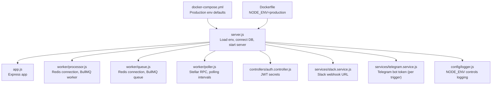
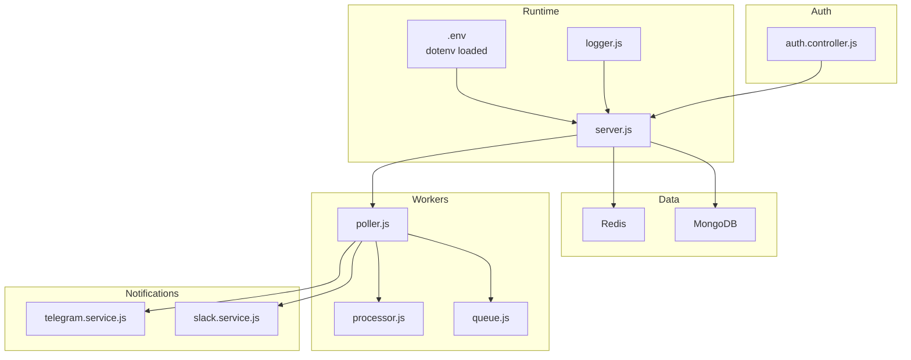
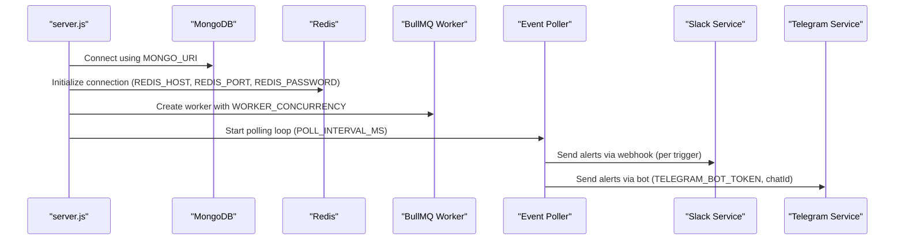
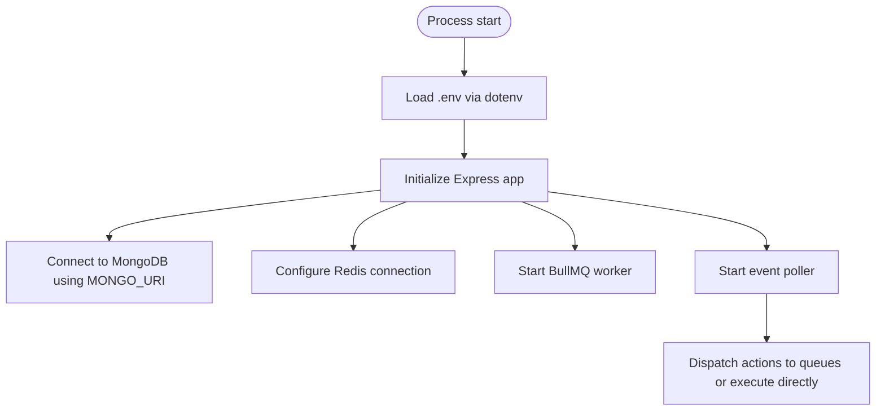
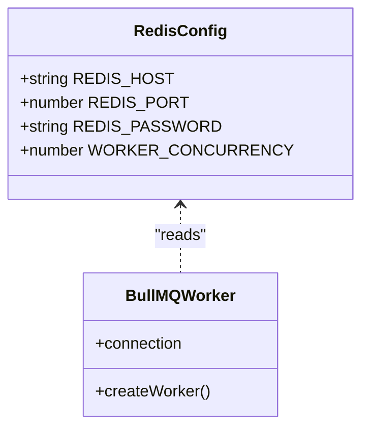
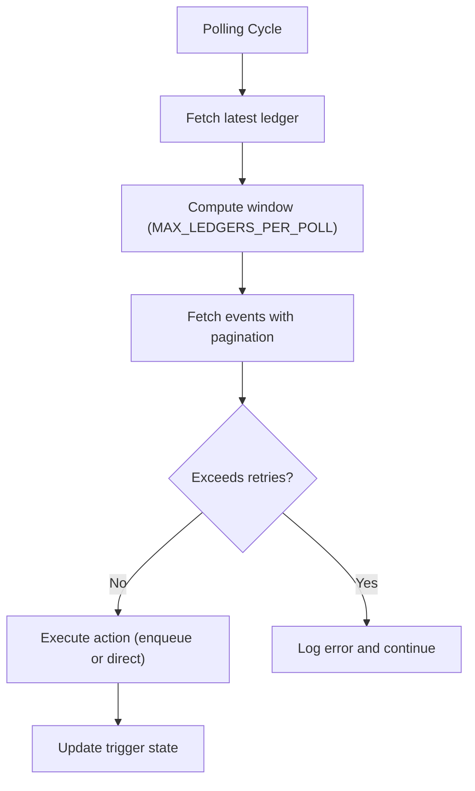
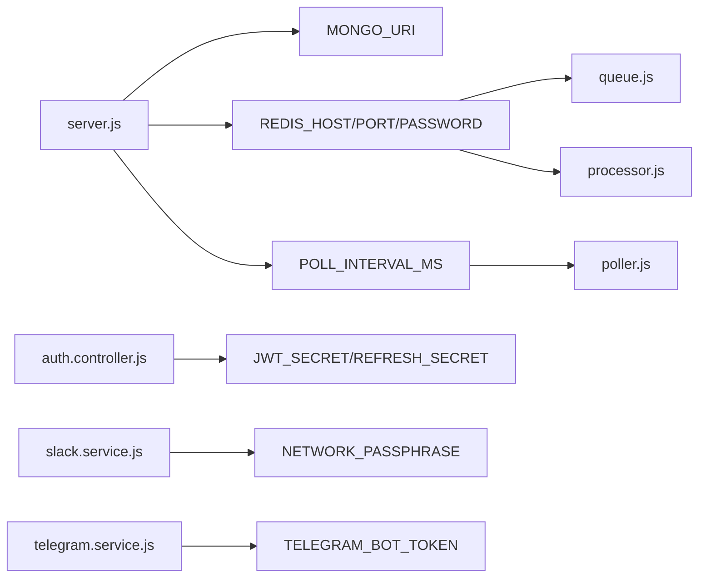

# Environment Configuration

<cite>
**Referenced Files in This Document**
- [server.js](file://backend/src/server.js)
- [app.js](file://backend/src/app.js)
- [logger.js](file://backend/src/config/logger.js)
- [queue.js](file://backend/src/worker/queue.js)
- [processor.js](file://backend/src/worker/processor.js)
- [poller.js](file://backend/src/worker/poller.js)
- [auth.controller.js](file://backend/src/controllers/auth.controller.js)
- [slack.service.js](file://backend/src/services/slack.service.js)
- [telegram.service.js](file://backend/src/services/telegram.service.js)
- [docker-compose.yml](file://docker-compose.yml)
- [Dockerfile](file://backend/Dockerfile)
- [package.json](file://backend/package.json)
</cite>

## Table of Contents
1. [Introduction](#introduction)
2. [Project Structure](#project-structure)
3. [Core Components](#core-components)
4. [Architecture Overview](#architecture-overview)
5. [Detailed Component Analysis](#detailed-component-analysis)
6. [Dependency Analysis](#dependency-analysis)
7. [Performance Considerations](#performance-considerations)
8. [Troubleshooting Guide](#troubleshooting-guide)
9. [Conclusion](#conclusion)
10. [Appendices](#appendices)

## Introduction
This document explains how environment variables are configured and managed across the backend service. It catalogs required environment variables for MongoDB connection, Redis configuration, authentication secrets, and notification services. It also provides guidance for secure configuration management, highlights differences between development and production environments, and offers templates for local development, staging, and production deployments.

## Project Structure
The backend loads environment variables early in the boot process and uses them across multiple subsystems:
- Application bootstrap loads environment variables and starts the Express server.
- Database connectivity uses a MongoDB URI from an environment variable.
- Redis is used for background job processing via BullMQ; its connection parameters are read from environment variables.
- Authentication relies on JWT secrets stored in environment variables.
- Notification services (Slack, Telegram) rely on credentials supplied per-trigger or via environment variables.
- Container orchestration defines environment defaults for production.

**Diagram sources**
- [server.js:1-88](file://backend/src/server.js#L1-L88)
- [app.js:1-55](file://backend/src/app.js#L1-L55)
- [processor.js:1-174](file://backend/src/worker/processor.js#L1-L174)
- [queue.js:1-164](file://backend/src/worker/queue.js#L1-L164)
- [poller.js:1-335](file://backend/src/worker/poller.js#L1-L335)
- [auth.controller.js:1-82](file://backend/src/controllers/auth.controller.js#L1-L82)
- [slack.service.js:1-165](file://backend/src/services/slack.service.js#L1-L165)
- [telegram.service.js:1-74](file://backend/src/services/telegram.service.js#L1-L74)
- [logger.js:1-19](file://backend/src/config/logger.js#L1-L19)
- [docker-compose.yml:1-70](file://docker-compose.yml#L1-L70)
- [Dockerfile:1-25](file://backend/Dockerfile#L1-L25)

**Section sources**
- [server.js:1-88](file://backend/src/server.js#L1-L88)
- [docker-compose.yml:1-70](file://docker-compose.yml#L1-L70)
- [Dockerfile:1-25](file://backend/Dockerfile#L1-L25)

## Core Components
This section enumerates environment variables used across the backend and explains their roles.

- MongoDB
  - MONGO_URI: Connection string for MongoDB.
  - Used by: [server.js:35-36](file://backend/src/server.js#L35-L36)

- Redis (BullMQ)
  - REDIS_HOST: Redis hostname or IP.
  - REDIS_PORT: Redis port.
  - REDIS_PASSWORD: Optional Redis password.
  - WORKER_CONCURRENCY: Optional worker concurrency for BullMQ.
  - Used by: [queue.js:5-15](file://backend/src/worker/queue.js#L5-L15), [processor.js:9-12](file://backend/src/worker/processor.js#L9-L12)

- Authentication
  - JWT_SECRET: Secret for signing access tokens.
  - JWT_REFRESH_SECRET: Secret for signing refresh tokens.
  - Used by: [auth.controller.js:5-7](file://backend/src/controllers/auth.controller.js#L5-L7)

- Notifications
  - TELEGRAM_BOT_TOKEN: Telegram bot token (required for Telegram actions).
  - NETWORK_PASSPHRASE: Slack service uses this to annotate messages.
  - Used by: [poller.js:115-115](file://backend/src/worker/poller.js#L115-L115), [slack.service.js:29-29](file://backend/src/services/slack.service.js#L29-L29)

- Logging and Debugging
  - NODE_ENV: Controls logging verbosity and behavior.
  - Used by: [logger.js:12-14](file://backend/src/config/logger.js#L12-L14), [server.js:63-63](file://backend/src/server.js#L63-L63), [Dockerfile:11-11](file://backend/Dockerfile#L11-L11)

- Polling and RPC
  - SOROBAN_RPC_URL: RPC endpoint for Stellar.
  - RPC_TIMEOUT_MS: Request timeout for RPC calls.
  - POLL_INTERVAL_MS: Interval between polling cycles.
  - MAX_LEDGERS_PER_POLL: Maximum ledgers scanned per cycle.
  - RPC_MAX_RETRIES: Max retries for RPC calls.
  - RPC_BASE_DELAY_MS: Base delay for exponential backoff on RPC.
  - INTER_TRIGGER_DELAY_MS: Delay between processing different triggers.
  - INTER_PAGE_DELAY_MS: Delay between RPC pagination pages.
  - Used by: [poller.js:5-15](file://backend/src/worker/poller.js#L5-L15), [poller.js:312-313](file://backend/src/worker/poller.js#L312-L313)

- Server
  - PORT: Listening port for the server.
  - Used by: [server.js:6-6](file://backend/src/server.js#L6-L6)

- dotenv
  - The application loads environment variables from a .env file via dotenv.
  - Used by: [server.js:2-2](file://backend/src/server.js#L2-L2), [package.json:5-8](file://backend/package.json#L5-L8)

**Section sources**
- [server.js:35-36](file://backend/src/server.js#L35-L36)
- [queue.js:5-15](file://backend/src/worker/queue.js#L5-L15)
- [processor.js:9-12](file://backend/src/worker/processor.js#L9-L12)
- [auth.controller.js:5-7](file://backend/src/controllers/auth.controller.js#L5-L7)
- [slack.service.js:29-29](file://backend/src/services/slack.service.js#L29-L29)
- [poller.js:5-15](file://backend/src/worker/poller.js#L5-L15)
- [poller.js:115-115](file://backend/src/worker/poller.js#L115-L115)
- [logger.js:12-14](file://backend/src/config/logger.js#L12-L14)
- [Dockerfile:11-11](file://backend/Dockerfile#L11-L11)
- [server.js:6-6](file://backend/src/server.js#L6-L6)
- [server.js:2-2](file://backend/src/server.js#L2-L2)
- [package.json:5-8](file://backend/package.json#L5-L8)

## Architecture Overview
The environment configuration underpins three major subsystems:
- Database connectivity (MongoDB)
- Background job processing (Redis/BullMQ)
- Event polling and notifications (Stellar RPC, Slack, Telegram)

**Diagram sources**
- [server.js:1-88](file://backend/src/server.js#L1-L88)
- [queue.js:1-164](file://backend/src/worker/queue.js#L1-L164)
- [processor.js:1-174](file://backend/src/worker/processor.js#L1-L174)
- [poller.js:1-335](file://backend/src/worker/poller.js#L1-L335)
- [auth.controller.js:1-82](file://backend/src/controllers/auth.controller.js#L1-L82)
- [slack.service.js:1-165](file://backend/src/services/slack.service.js#L1-L165)
- [telegram.service.js:1-74](file://backend/src/services/telegram.service.js#L1-L74)
- [logger.js:1-19](file://backend/src/config/logger.js#L1-L19)

## Detailed Component Analysis

### MongoDB Connection
- Purpose: Establish a persistent connection to the database using the provided URI.
- Variables:
  - MONGO_URI: Required.
- Behavior:
  - Connection is attempted during server startup; on failure, the process exits with a non-zero code.
  - Logs show a masked URI for safety.
- Security:
  - Ensure the URI includes appropriate credentials and TLS settings in production.
  - Avoid committing the URI to version control.

**Section sources**
- [server.js:35-42](file://backend/src/server.js#L35-L42)

### Redis and BullMQ Queue
- Purpose: Enable background job processing for event actions.
- Variables:
  - REDIS_HOST: Host or IP address of Redis.
  - REDIS_PORT: Port number.
  - REDIS_PASSWORD: Optional password.
  - WORKER_CONCURRENCY: Optional worker concurrency.
- Behavior:
  - A Redis client is created lazily.
  - A named queue is initialized with default job options (attempts, backoff, retention).
  - A worker is created to process jobs with concurrency and retry limits.
- Security:
  - Prefer a protected Redis instance with password authentication and network isolation.
  - Use TLS if supported by your Redis provider.

**Section sources**
- [queue.js:5-15](file://backend/src/worker/queue.js#L5-L15)
- [queue.js:19-41](file://backend/src/worker/queue.js#L19-L41)
- [processor.js:9-20](file://backend/src/worker/processor.js#L9-L20)
- [processor.js:102-136](file://backend/src/worker/processor.js#L102-L136)

### Authentication Secrets
- Purpose: Securely sign and verify JWT tokens for authentication.
- Variables:
  - JWT_SECRET: Required for access tokens.
  - JWT_REFRESH_SECRET: Required for refresh tokens.
- Behavior:
  - Access tokens expire in one hour; refresh tokens expire in seven days.
  - Defaults are applied if variables are missing, but this is insecure.
- Security:
  - Generate long, random secrets and rotate them periodically.
  - Store in a secrets manager or environment vault in production.

**Section sources**
- [auth.controller.js:5-10](file://backend/src/controllers/auth.controller.js#L5-L10)

### Notification Credentials
- Slack
  - Slack webhook URL is provided per trigger; the service reads it from the trigger configuration.
  - The service uses NETWORK_PASSPHRASE to annotate messages.
- Telegram
  - TELEGRAM_BOT_TOKEN is required for Telegram actions and is read from environment variables in the poller fallback path.
  - chatId is provided per trigger.
- Security:
  - Treat webhook URLs and bot tokens as secrets.
  - Limit webhook scopes and permissions where possible.
  - Rotate tokens and revoke unused ones.

**Section sources**
- [slack.service.js:142-159](file://backend/src/services/slack.service.js#L142-L159)
- [slack.service.js:29-29](file://backend/src/services/slack.service.js#L29-L29)
- [poller.js:115-115](file://backend/src/worker/poller.js#L115-L115)

### Logging and Debugging
- Purpose: Control log verbosity and behavior based on environment.
- Variables:
  - NODE_ENV: Controls debug logging and server logs.
- Behavior:
  - Debug logs are emitted only outside production.
  - Server logs include environment and queue availability.
- Security:
  - Avoid logging sensitive data; the MongoDB connection logs mask the URI.

**Section sources**
- [logger.js:12-14](file://backend/src/config/logger.js#L12-L14)
- [server.js:60-66](file://backend/src/server.js#L60-L66)

### Polling and RPC
- Purpose: Poll the Stellar network for contract events and dispatch actions.
- Variables:
  - SOROBAN_RPC_URL: RPC endpoint.
  - RPC_TIMEOUT_MS: Request timeout.
  - POLL_INTERVAL_MS: Interval between polling cycles.
  - MAX_LEDGERS_PER_POLL: Window size per cycle.
  - RPC_MAX_RETRIES: Retry attempts for RPC calls.
  - RPC_BASE_DELAY_MS: Exponential backoff base delay.
  - INTER_TRIGGER_DELAY_MS: Delay between triggers.
  - INTER_PAGE_DELAY_MS: Delay between pagination pages.
- Behavior:
  - Uses exponential backoff for transient failures.
  - Falls back to direct execution if the queue is unavailable.

**Section sources**
- [poller.js:5-15](file://backend/src/worker/poller.js#L5-L15)
- [poller.js:312-313](file://backend/src/worker/poller.js#L312-L313)

### Server and dotenv
- Purpose: Configure runtime behavior and load environment variables.
- Variables:
  - PORT: Listening port.
- Behavior:
  - dotenv loads variables from a .env file.
  - Scripts define start and dev commands.

**Section sources**
- [server.js:2-2](file://backend/src/server.js#L2-L2)
- [server.js:6-6](file://backend/src/server.js#L6-L6)
- [package.json:5-8](file://backend/package.json#L5-L8)

## Architecture Overview

**Diagram sources**
- [server.js:35-58](file://backend/src/server.js#L35-L58)
- [queue.js:5-15](file://backend/src/worker/queue.js#L5-L15)
- [processor.js:102-136](file://backend/src/worker/processor.js#L102-L136)
- [poller.js:115-115](file://backend/src/worker/poller.js#L115-L115)
- [slack.service.js:142-159](file://backend/src/services/slack.service.js#L142-L159)
- [telegram.service.js:15-27](file://backend/src/services/telegram.service.js#L15-L27)

## Detailed Component Analysis

### Environment Variable Loading Flow
- The application loads environment variables from a .env file at startup.
- Subsystems then read required variables to configure themselves.

**Diagram sources**
- [server.js:2-2](file://backend/src/server.js#L2-L2)
- [server.js:35-58](file://backend/src/server.js#L35-L58)
- [queue.js:5-15](file://backend/src/worker/queue.js#L5-L15)
- [processor.js:102-136](file://backend/src/worker/processor.js#L102-L136)
- [poller.js:312-313](file://backend/src/worker/poller.js#L312-L313)

**Section sources**
- [server.js:2-2](file://backend/src/server.js#L2-L2)
- [server.js:35-58](file://backend/src/server.js#L35-L58)

### Redis Connection and Worker Configuration
- Redis connection parameters are read from environment variables.
- Worker concurrency and retry behavior are configurable.

**Diagram sources**
- [queue.js:5-15](file://backend/src/worker/queue.js#L5-L15)
- [processor.js:9-20](file://backend/src/worker/processor.js#L9-L20)
- [processor.js:102-136](file://backend/src/worker/processor.js#L102-L136)

**Section sources**
- [queue.js:5-15](file://backend/src/worker/queue.js#L5-L15)
- [processor.js:9-20](file://backend/src/worker/processor.js#L9-L20)

### Polling and Retry Configuration
- Polling behavior is tuned via environment variables for stability and performance.

**Diagram sources**
- [poller.js:177-310](file://backend/src/worker/poller.js#L177-L310)
- [poller.js:27-51](file://backend/src/worker/poller.js#L27-L51)

**Section sources**
- [poller.js:5-15](file://backend/src/worker/poller.js#L5-L15)
- [poller.js:177-310](file://backend/src/worker/poller.js#L177-L310)

## Dependency Analysis
- The server depends on environment variables for database and Redis connectivity.
- The poller depends on RPC and polling tuning variables.
- The worker depends on Redis configuration.
- The auth controller depends on JWT secrets.
- Notification services depend on per-trigger or environment-provided credentials.

**Diagram sources**
- [server.js:35-36](file://backend/src/server.js#L35-L36)
- [queue.js:5-15](file://backend/src/worker/queue.js#L5-L15)
- [processor.js:9-12](file://backend/src/worker/processor.js#L9-L12)
- [poller.js:5-15](file://backend/src/worker/poller.js#L5-L15)
- [auth.controller.js:5-7](file://backend/src/controllers/auth.controller.js#L5-L7)
- [slack.service.js:29-29](file://backend/src/services/slack.service.js#L29-L29)
- [telegram.service.js:15-18](file://backend/src/services/telegram.service.js#L15-L18)

**Section sources**
- [server.js:35-36](file://backend/src/server.js#L35-L36)
- [poller.js:5-15](file://backend/src/worker/poller.js#L5-L15)
- [queue.js:5-15](file://backend/src/worker/queue.js#L5-L15)
- [processor.js:9-12](file://backend/src/worker/processor.js#L9-L12)
- [auth.controller.js:5-7](file://backend/src/controllers/auth.controller.js#L5-L7)
- [slack.service.js:29-29](file://backend/src/services/slack.service.js#L29-L29)
- [telegram.service.js:15-18](file://backend/src/services/telegram.service.js#L15-L18)

## Performance Considerations
- Redis
  - Tune WORKER_CONCURRENCY to match CPU and memory capacity.
  - Ensure Redis is on a low-latency network path to the backend.
- Polling
  - Adjust POLL_INTERVAL_MS, MAX_LEDGERS_PER_POLL, and delays to balance responsiveness and RPC load.
  - Use exponential backoff and retry limits to avoid thundering herds.
- Logging
  - Avoid excessive debug logging in production to reduce I/O overhead.

[No sources needed since this section provides general guidance]

## Troubleshooting Guide
- MongoDB connection fails
  - Verify MONGO_URI correctness and network accessibility.
  - Check credentials and TLS settings.
  - Review masked URI logs for hints.
- Redis connection fails
  - Confirm REDIS_HOST, REDIS_PORT, and REDIS_PASSWORD.
  - Ensure Redis is reachable and not rate-limited.
- Authentication issues
  - Ensure JWT_SECRET and JWT_REFRESH_SECRET are set and consistent across instances.
- Notification delivery problems
  - For Slack: verify webhook URL and permissions.
  - For Telegram: verify TELEGRAM_BOT_TOKEN and chatId.
- Polling stalls or RPC errors
  - Increase RPC_MAX_RETRIES and RPC_BASE_DELAY_MS.
  - Reduce POLL_INTERVAL_MS or MAX_LEDGERS_PER_POLL to lower load.

**Section sources**
- [server.js:80-87](file://backend/src/server.js#L80-L87)
- [queue.js:5-15](file://backend/src/worker/queue.js#L5-L15)
- [processor.js:102-136](file://backend/src/worker/processor.js#L102-L136)
- [poller.js:27-51](file://backend/src/worker/poller.js#L27-L51)
- [slack.service.js:97-134](file://backend/src/services/slack.service.js#L97-L134)
- [telegram.service.js:15-57](file://backend/src/services/telegram.service.js#L15-L57)

## Conclusion
Environment variables are central to configuring the backend’s database, queue, authentication, notifications, and polling behavior. For secure and reliable operation, define all required variables, avoid hardcoding secrets, and tailor settings per environment. Use the provided templates and guidance to deploy consistently across local, staging, and production.

[No sources needed since this section summarizes without analyzing specific files]

## Appendices

### A. Environment Variable Reference
- Database
  - MONGO_URI: MongoDB connection string
- Redis
  - REDIS_HOST: Redis host
  - REDIS_PORT: Redis port
  - REDIS_PASSWORD: Redis password (optional)
  - WORKER_CONCURRENCY: Worker concurrency (optional)
- Authentication
  - JWT_SECRET: Access token secret
  - JWT_REFRESH_SECRET: Refresh token secret
- Notifications
  - TELEGRAM_BOT_TOKEN: Telegram bot token (per trigger)
  - NETWORK_PASSPHRASE: Slack annotation network identifier
- Logging and Server
  - NODE_ENV: Application environment (e.g., production)
  - PORT: Server port
- Polling and RPC
  - SOROBAN_RPC_URL: RPC endpoint
  - RPC_TIMEOUT_MS: RPC timeout
  - POLL_INTERVAL_MS: Polling interval
  - MAX_LEDGERS_PER_POLL: Ledger window per cycle
  - RPC_MAX_RETRIES: RPC retry attempts
  - RPC_BASE_DELAY_MS: RPC backoff base delay
  - INTER_TRIGGER_DELAY_MS: Inter-trigger delay
  - INTER_PAGE_DELAY_MS: Inter-page delay

**Section sources**
- [server.js:35-36](file://backend/src/server.js#L35-L36)
- [queue.js:5-15](file://backend/src/worker/queue.js#L5-L15)
- [processor.js:9-12](file://backend/src/worker/processor.js#L9-L12)
- [auth.controller.js:5-7](file://backend/src/controllers/auth.controller.js#L5-L7)
- [slack.service.js:29-29](file://backend/src/services/slack.service.js#L29-L29)
- [poller.js:5-15](file://backend/src/worker/poller.js#L5-L15)
- [logger.js:12-14](file://backend/src/config/logger.js#L12-L14)
- [server.js:6-6](file://backend/src/server.js#L6-L6)

### B. Development vs Production Differences
- Development
  - NODE_ENV typically unset or set to a non-production value.
  - Debug logging enabled; less strict timeouts.
  - Local Redis and MongoDB recommended.
- Production
  - NODE_ENV set to production.
  - Strict logging, hardened secrets, and robust retry/backoff.
  - Redis and MongoDB behind firewalls; TLS enabled.

**Section sources**
- [logger.js:12-14](file://backend/src/config/logger.js#L12-L14)
- [Dockerfile:11-11](file://backend/Dockerfile#L11-L11)
- [docker-compose.yml:32-36](file://docker-compose.yml#L32-L36)

### C. Deployment Templates

- Local Development (.env)
  - Set MONGO_URI to a local MongoDB instance.
  - Set REDIS_HOST/PORT to a local Redis instance.
  - Set JWT_SECRET/JWT_REFRESH_SECRET to strong random values.
  - Set SOROBAN_RPC_URL to a local or testnet endpoint.
  - Set TELEGRAM_BOT_TOKEN and NETWORK_PASSPHRASE as needed for testing.

- Staging
  - Use a managed MongoDB and Redis instance.
  - Enforce TLS and network segmentation.
  - Use dedicated secrets management for JWT and notification credentials.

- Production
  - Use managed services with backups and monitoring.
  - Enforce strict IAM and VPC rules for Redis and MongoDB.
  - Use secrets managers for all credentials; avoid committing to repositories.

[No sources needed since this section provides general guidance]

### D. Best Practices for Secret Management
- Never commit secrets to version control.
- Use environment-specific secret stores or vaults.
- Rotate secrets regularly and revoke unused ones.
- Limit credential scope and permissions.
- Mask sensitive values in logs (already partially handled for MongoDB URI).

[No sources needed since this section provides general guidance]