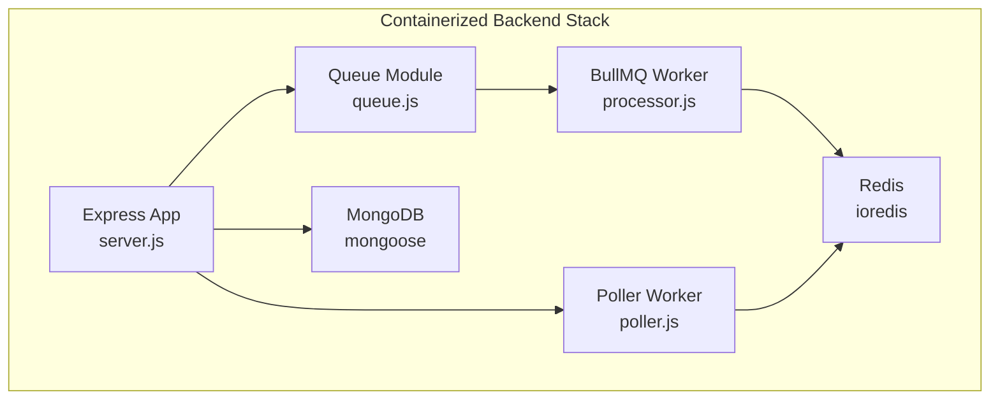
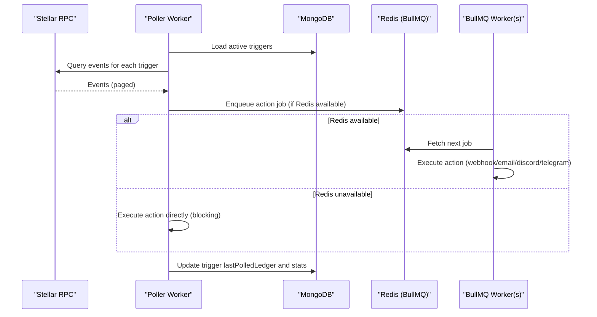
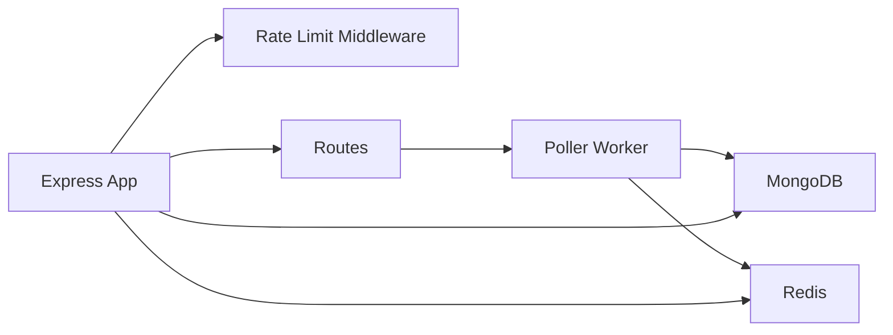

# Infrastructure and Scaling

<cite>
**Referenced Files in This Document**
- [backend/package.json](file://backend/package.json)
- [docker-compose.yml](file://docker-compose.yml)
- [backend/Dockerfile](file://backend/Dockerfile)
- [backend/src/server.js](file://backend/src/server.js)
- [backend/src/app.js](file://backend/src/app.js)
- [backend/src/middleware/rateLimit.middleware.js](file://backend/src/middleware/rateLimit.middleware.js)
- [backend/src/config/logger.js](file://backend/src/config/logger.js)
- [backend/src/models/trigger.model.js](file://backend/src/models/trigger.model.js)
- [backend/src/worker/queue.js](file://backend/src/worker/queue.js)
- [backend/src/worker/processor.js](file://backend/src/worker/processor.js)
- [backend/src/worker/poller.js](file://backend/src/worker/poller.js)
- [backend/src/routes/queue.routes.js](file://backend/src/routes/queue.routes.js)
- [backend/QUICKSTART_QUEUE.md](file://backend/QUICKSTART_QUEUE.md)
- [backend/REDIS_OPTIONAL.md](file://backend/REDIS_OPTIONAL.md)
</cite>

## Table of Contents
1. [Introduction](#introduction)
2. [Project Structure](#project-structure)
3. [Core Components](#core-components)
4. [Architecture Overview](#architecture-overview)
5. [Detailed Component Analysis](#detailed-component-analysis)
6. [Dependency Analysis](#dependency-analysis)
7. [Performance Considerations](#performance-considerations)
8. [Troubleshooting Guide](#troubleshooting-guide)
9. [Conclusion](#conclusion)
10. [Appendices](#appendices)

## Introduction
This document provides comprehensive infrastructure requirements and scaling strategies for the EventHorizon backend service, queue system, and database components. It covers minimum hardware requirements, resource allocation recommendations, performance characteristics, and practical scaling approaches for horizontal and vertical growth. It also details load balancing, auto-scaling, capacity planning, Redis and MongoDB scaling options, high availability setups, monitoring, and cost optimization strategies for production deployments.

## Project Structure
The EventHorizon backend is a Node.js/Express application packaged as a Docker image and orchestrated with Docker Compose. It integrates:
- Express application with rate limiting and logging middleware
- MongoDB for persistence
- Redis for background job processing via BullMQ
- A poller worker that queries the Stellar Testnet RPC for contract events and enqueues actions or executes them directly when Redis is unavailable

**Diagram sources**
- [backend/src/server.js:1-88](file://backend/src/server.js#L1-L88)
- [backend/src/worker/poller.js:1-335](file://backend/src/worker/poller.js#L1-L335)
- [backend/src/worker/queue.js:1-164](file://backend/src/worker/queue.js#L1-L164)
- [backend/src/worker/processor.js:1-174](file://backend/src/worker/processor.js#L1-L174)

**Section sources**
- [docker-compose.yml:1-70](file://docker-compose.yml#L1-L70)
- [backend/Dockerfile:1-25](file://backend/Dockerfile#L1-L25)
- [backend/package.json:1-28](file://backend/package.json#L1-L28)

## Core Components
- Express application with CORS, JSON parsing, request logging, global and auth-specific rate limits, and error handling.
- MongoDB model for Triggers with indexing and computed health metrics.
- Poller worker that periodically queries the Stellar RPC for contract events, paginates results, and enqueues actions or executes them directly.
- BullMQ queue backed by Redis for reliable, concurrent background processing with retries and observability.
- Rate limiting middleware configurable via environment variables.
- Logging utility with info/warn/error/debug levels.

Key runtime dependencies and ports:
- Application port 5000 exposed by the backend container.
- MongoDB and Redis containers managed by Docker Compose.
- BullMQ worker concurrency controlled by an environment variable.

**Section sources**
- [backend/src/app.js:1-55](file://backend/src/app.js#L1-L55)
- [backend/src/server.js:1-88](file://backend/src/server.js#L1-L88)
- [backend/src/middleware/rateLimit.middleware.js:1-51](file://backend/src/middleware/rateLimit.middleware.js#L1-L51)
- [backend/src/config/logger.js:1-19](file://backend/src/config/logger.js#L1-L19)
- [backend/src/models/trigger.model.js:1-80](file://backend/src/models/trigger.model.js#L1-L80)
- [backend/src/worker/poller.js:1-335](file://backend/src/worker/poller.js#L1-L335)
- [backend/src/worker/queue.js:1-164](file://backend/src/worker/queue.js#L1-L164)
- [backend/src/worker/processor.js:1-174](file://backend/src/worker/processor.js#L1-L174)
- [backend/src/routes/queue.routes.js:1-104](file://backend/src/routes/queue.routes.js#L1-L104)

## Architecture Overview
The system architecture centers around an Express API that orchestrates two primary subsystems:
- Poller worker: Queries Stellar RPC, detects events, and enqueues actions or executes them directly.
- BullMQ worker pool: Consumes jobs from Redis, executes actions concurrently, and handles retries.

**Diagram sources**
- [backend/src/worker/poller.js:177-335](file://backend/src/worker/poller.js#L177-L335)
- [backend/src/worker/queue.js:91-121](file://backend/src/worker/queue.js#L91-L121)
- [backend/src/worker/processor.js:25-97](file://backend/src/worker/processor.js#L25-L97)
- [backend/src/models/trigger.model.js:18-57](file://backend/src/models/trigger.model.js#L18-L57)

## Detailed Component Analysis

### Express Application and Rate Limiting
- The Express app initializes CORS, JSON body parsing, request logging, and rate limiting.
- Global and auth-specific rate limiters are configurable via environment variables.
- Health endpoint returns a simple status payload.

Operational implications:
- Plan CPU/memory for concurrent connections and middleware overhead.
- Tune rate limits per deployment stage to balance throughput and abuse protection.

**Section sources**
- [backend/src/app.js:1-55](file://backend/src/app.js#L1-L55)
- [backend/src/middleware/rateLimit.middleware.js:1-51](file://backend/src/middleware/rateLimit.middleware.js#L1-L51)
- [backend/src/server.js:20-32](file://backend/src/server.js#L20-L32)

### Poller Worker (Stellar RPC Integration)
- Periodic polling with exponential backoff for RPC calls.
- Pagination support with configurable delays between pages and between triggers.
- Sliding ledger window capped by a maximum number of ledgers per poll.
- Graceful fallback to direct execution when Redis is unavailable.

Scaling considerations:
- Increase POLL_INTERVAL_MS to reduce RPC load under high trigger counts.
- Adjust MAX_LEDGERS_PER_POLL to balance latency vs. event coverage.
- Use INTER_PAGE_DELAY_MS and INTER_TRIGGER_DELAY_MS to avoid rate limits.

**Section sources**
- [backend/src/worker/poller.js:177-335](file://backend/src/worker/poller.js#L177-L335)

### BullMQ Queue and Worker Pool
- Queue default job options include retries with exponential backoff and retention policies for completed/failed jobs.
- Worker concurrency is configurable and limited via a limiter to prevent external service saturation.
- Queue APIs expose stats, job listing, cleaning, and retry mechanisms.

Scaling considerations:
- Increase WORKER_CONCURRENCY for higher throughput when Redis and external services can handle it.
- Monitor queue stats to size workers appropriately.
- Use job priorities and retention settings to manage long-term queue health.

**Section sources**
- [backend/src/worker/queue.js:19-41](file://backend/src/worker/queue.js#L19-L41)
- [backend/src/worker/queue.js:126-143](file://backend/src/worker/queue.js#L126-L143)
- [backend/src/worker/processor.js:102-168](file://backend/src/worker/processor.js#L102-L168)

### MongoDB Model and Persistence
- Triggers are indexed on contractId and metadata for efficient lookups.
- Virtual fields compute health score and status for operational visibility.
- Stats counters track executions and failures.

Scaling considerations:
- Use appropriate indexes and collection sizing for high trigger counts.
- Consider sharding and replica sets for large datasets and HA.

**Section sources**
- [backend/src/models/trigger.model.js:1-80](file://backend/src/models/trigger.model.js#L1-L80)

### Redis and Queue Availability
- Redis is optional; the system gracefully degrades to direct execution when unavailable.
- Queue endpoints return 503 when Redis is not configured.
- Recommended to provision managed Redis for production reliability.

**Section sources**
- [backend/REDIS_OPTIONAL.md:1-203](file://backend/REDIS_OPTIONAL.md#L1-L203)
- [backend/src/routes/queue.routes.js:13-23](file://backend/src/routes/queue.routes.js#L13-L23)

## Dependency Analysis
Runtime dependencies and their roles:
- BullMQ and ioredis: Queue and Redis client for background processing.
- Mongoose: MongoDB ODM for trigger persistence.
- Axios: HTTP client for webhook actions.
- Express and related middleware: Web framework and CORS/rate limiting.
- Swagger modules: API documentation.

**Diagram sources**
- [backend/package.json:10-22](file://backend/package.json#L10-L22)
- [backend/src/app.js:16-27](file://backend/src/app.js#L16-L27)
- [backend/src/server.js:34-58](file://backend/src/server.js#L34-L58)

**Section sources**
- [backend/package.json:1-28](file://backend/package.json#L1-L28)
- [backend/src/app.js:1-55](file://backend/src/app.js#L1-L55)

## Performance Considerations

### Minimum Hardware Requirements (Per Container)
- Backend container
  - vCPU: 1–2 vCPU
  - Memory: 512 MB–1 GB (2 GB recommended for production)
  - Disk: 1–2 GB ephemeral storage plus persistent volumes for logs
- MongoDB container
  - vCPU: 1–2 vCPU
  - Memory: 1–2 GB
  - Disk: 10–50 GB depending on trigger volume and retention
- Redis container
  - vCPU: 1 vCPU
  - Memory: 512 MB–1 GB
  - Disk: 5–10 GB for dataset and snapshots

Notes:
- These are baseline estimates; actual sizing depends on workload, queue depth, and concurrency.

### Resource Allocation Recommendations
- Backend
  - CPU: Scale cores linearly with worker concurrency and trigger count.
  - Memory: Allocate headroom for Node.js heap and concurrent HTTP operations.
- MongoDB
  - Use wiredTiger cache aligned with available RAM; monitor page faults.
- Redis
  - Prefer dedicated memory allocation; enable AOF/RDB with appropriate persistence.

### Performance Benchmarks (Guidelines)
- Poller throughput: Expect hundreds to thousands of events per minute depending on RPC latency and pagination.
- Queue processing: Throughput scales with worker concurrency and external service rates.
- External actions: Webhook/Telegram/Discord/Email latency dominates end-to-end performance.

### Horizontal vs. Vertical Scaling
- Backend
  - Vertical: Increase CPU/memory to support higher concurrency and larger queues.
  - Horizontal: Run multiple replicas behind a load balancer; ensure shared Redis/Mongo.
- Queue system
  - Vertical: Increase Redis memory and CPU; tune worker concurrency per instance.
  - Horizontal: Run multiple worker processes/containers; Redis remains single-point but durable.
- Database
  - Vertical: Upgrade VM/storage tier; optimize indexes and collections.
  - Horizontal: Use MongoDB replica set and sharding; ensure consistent reads/writes.

### Load Balancing and Auto-Scaling
- Load balancing
  - Place a reverse proxy/load balancer in front of backend replicas.
  - Sticky sessions are not required; keep stateless except for Redis/Mongo.
- Auto-scaling
  - Scale on CPU utilization or request latency.
  - For queue-driven workloads, scale on queue depth or worker backlog.

### Capacity Planning Methodology
- Measure current queue depth and processing lag.
- Project growth in triggers and event frequency.
- Account for retries and retention windows.
- Plan buffer for peak bursts and maintenance windows.

### Redis Scaling Options
- Standalone (development): Single Redis instance.
- High Availability:
  - Redis Sentinel for failover.
  - Redis Cluster for sharding and partition tolerance.
  - Managed Redis (e.g., AWS ElastiCache, GCP Memorystore) for production.
- Persistence
  - Enable AOF/RDB with appropriate snapshot intervals.
- Memory tuning
  - Use maxmemory with eviction policies suited to your workload.

### MongoDB Scaling Options
- Replica Set for high availability and read scaling.
- Sharding for large datasets and high write throughput.
- Index optimization for contractId and metadata fields.
- Connection pooling and read preferences for performance.

### Monitoring and Metrics
- Application
  - Health endpoint for liveness/readiness checks.
  - Request rate, latency, error rate, and 5xx breakdown.
- Queue
  - Queue depths (waiting/active/completed/failed/delayed).
  - Worker backlog and job completion time.
- Database
  - Connection pool usage, slow queries, index hit ratio.
- Infrastructure
  - CPU, memory, disk IO, and network utilization.
  - Redis memory, evictions, and latency.
  - MongoDB opcounters, repl lag, and cache hit ratio.

### Cost Optimization Strategies
- Use reserved/committed use instances for predictable workloads.
- Right-size containers and autoscaling thresholds to avoid overprovisioning.
- Use managed databases and caching to reduce operational overhead.
- Consolidate services where feasible; separate Redis/Mongo for isolation and HA.

### Cloud Provider Recommendations
- Compute: Kubernetes Engine/AKS/ECS with cluster autoscaler.
- Database: Managed MongoDB Atlas or equivalent.
- Cache: Managed Redis (ElastiCache/GCP Memorystore/Azure Cache).
- Observability: Cloud-native logging and metrics platforms.

[No sources needed since this section provides general guidance]

## Troubleshooting Guide

Common issues and resolutions:
- Redis connectivity failures
  - Verify Redis host/port/password and network reachability.
  - Check Redis logs and memory usage.
- Queue endpoints return 503
  - Ensure Redis is configured and reachable; confirm environment variables.
- Workers not processing jobs
  - Confirm worker concurrency and external service quotas.
  - Inspect job logs and retry history.
- Poller stalls or RPC errors
  - Adjust polling interval and pagination delays.
  - Implement exponential backoff and retry on transient errors.
- Health checks failing
  - Confirm MongoDB connectivity and Redis availability.

**Section sources**
- [backend/QUICKSTART_QUEUE.md:144-181](file://backend/QUICKSTART_QUEUE.md#L144-L181)
- [backend/REDIS_OPTIONAL.md:184-193](file://backend/REDIS_OPTIONAL.md#L184-L193)
- [backend/src/worker/poller.js:27-51](file://backend/src/worker/poller.js#L27-L51)

## Conclusion
EventHorizon’s architecture supports flexible scaling through Redis-backed BullMQ workers, a poller that can operate with or without Redis, and MongoDB for persistence. For production, deploy managed Redis and MongoDB, implement horizontal scaling with load balancing, and use auto-scaling based on queue depth and CPU metrics. Monitor queue stats, database performance, and external action latencies to maintain reliability and cost efficiency.

[No sources needed since this section summarizes without analyzing specific files]

## Appendices

### Environment Variables and Tunables
- Backend
  - PORT: Application port (default 5000)
  - NODE_ENV: Environment mode
  - RATE_LIMIT_WINDOW_MS, RATE_LIMIT_MAX, RATE_LIMIT_MESSAGE: Global rate limit
  - AUTH_RATE_LIMIT_WINDOW_MS, AUTH_RATE_LIMIT_MAX, AUTH_RATE_LIMIT_MESSAGE: Auth rate limit
  - POLL_INTERVAL_MS: Poller interval
  - MAX_LEDGERS_PER_POLL: Max ledgers scanned per poll
  - RPC_MAX_RETRIES, RPC_BASE_DELAY_MS: RPC retry policy
  - INTER_PAGE_DELAY_MS, INTER_TRIGGER_DELAY_MS: Poller pacing
  - SOROBAN_RPC_URL: RPC endpoint
  - RPC_TIMEOUT_MS: RPC timeout
- Redis/BullMQ
  - REDIS_HOST, REDIS_PORT, REDIS_PASSWORD: Redis connection
  - WORKER_CONCURRENCY: Worker pool size
- MongoDB
  - MONGO_URI: Database connection string

**Section sources**
- [backend/src/server.js:34-42](file://backend/src/server.js#L34-L42)
- [backend/src/middleware/rateLimit.middleware.js:31-45](file://backend/src/middleware/rateLimit.middleware.js#L31-L45)
- [backend/src/worker/poller.js:10-16](file://backend/src/worker/poller.js#L10-L16)
- [backend/src/worker/processor.js:12,131-134](file://backend/src/worker/processor.js#L12,L131-L134)
- [backend/src/worker/queue.js:5-7](file://backend/src/worker/queue.js#L5-L7)
- [backend/src/models/trigger.model.js:43-57](file://backend/src/models/trigger.model.js#L43-L57)