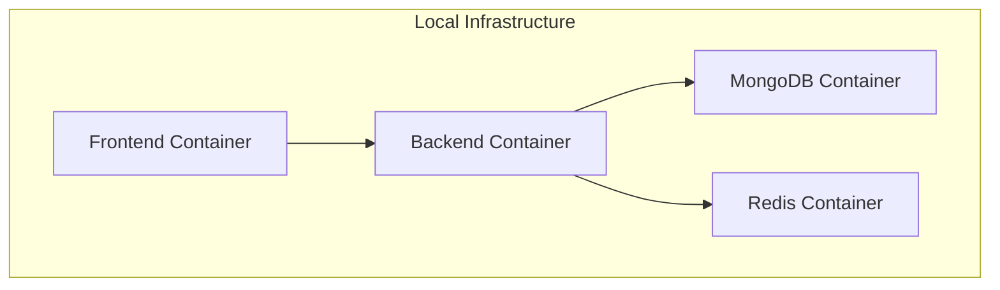
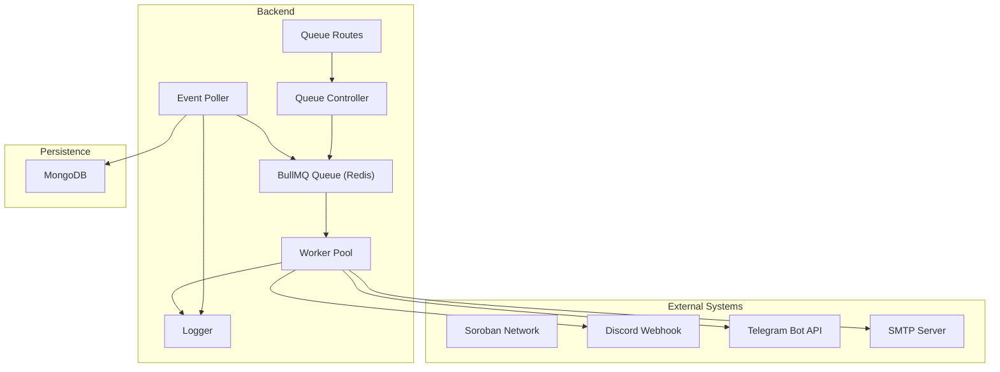
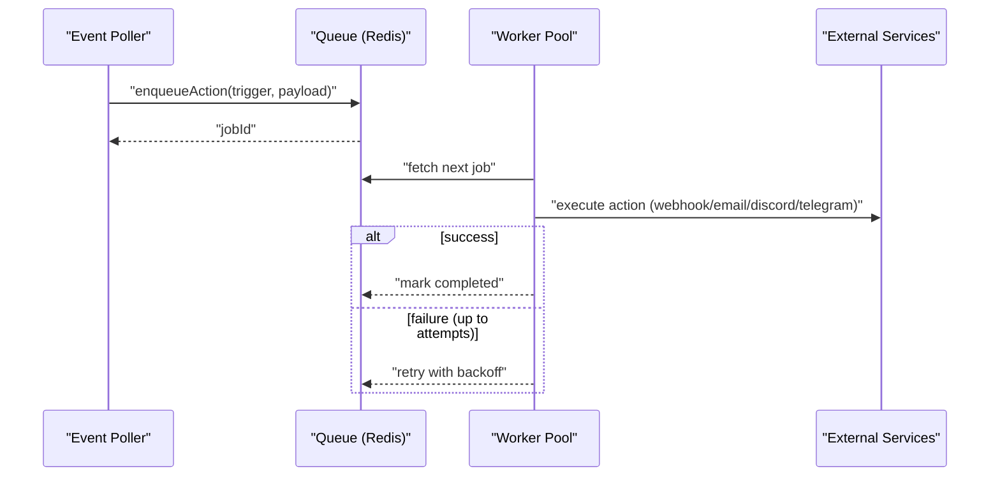
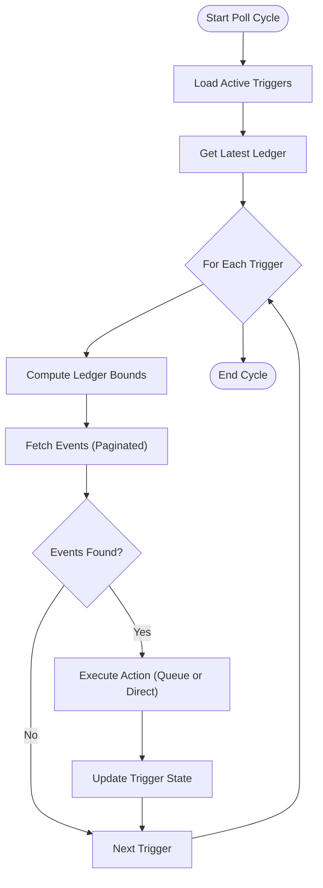
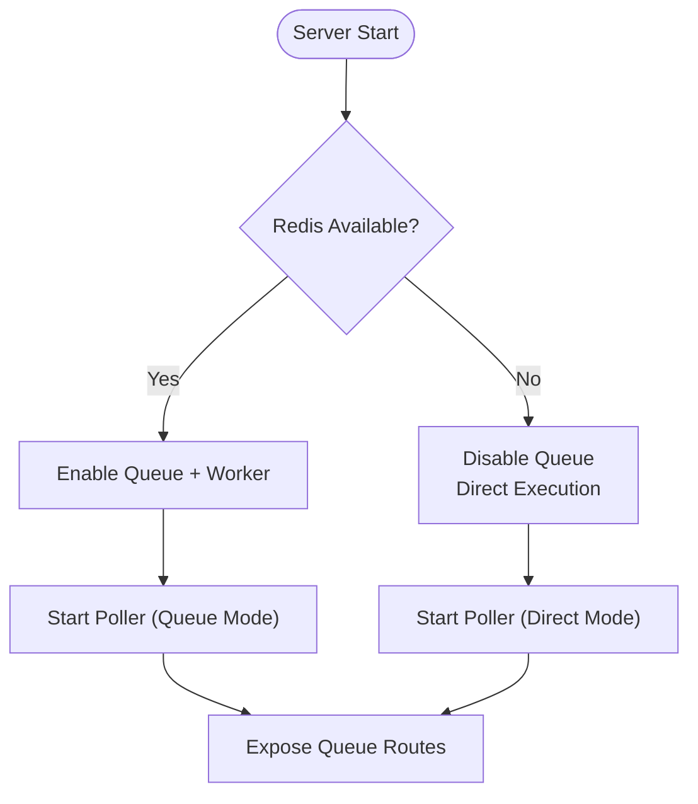
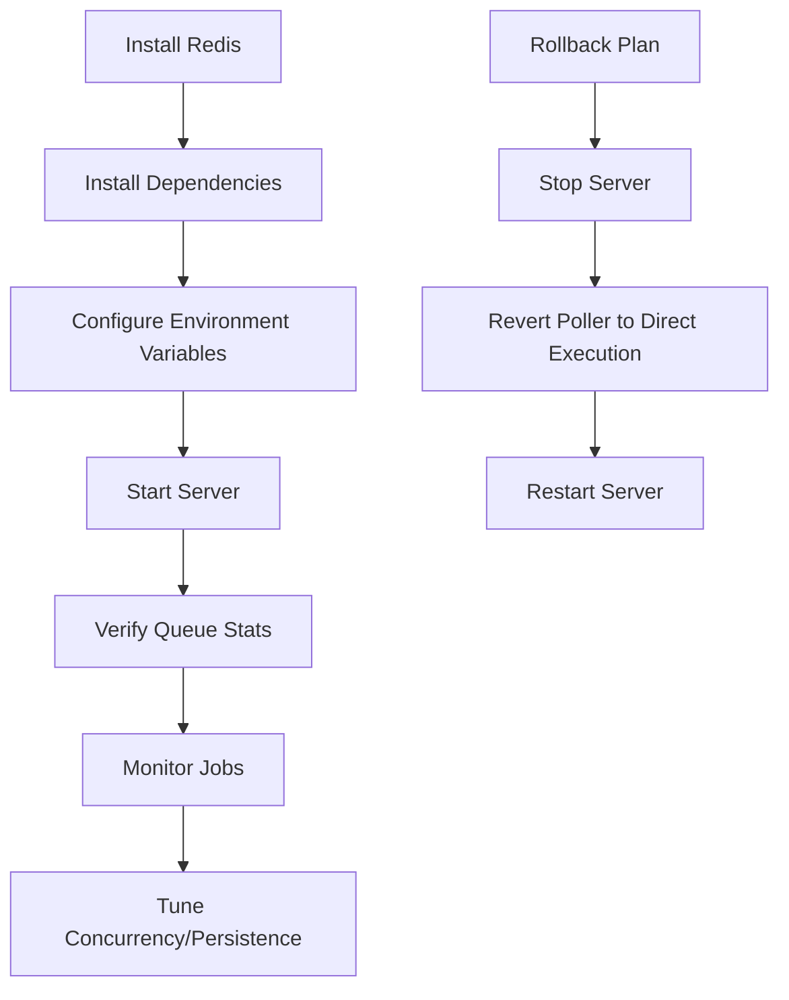
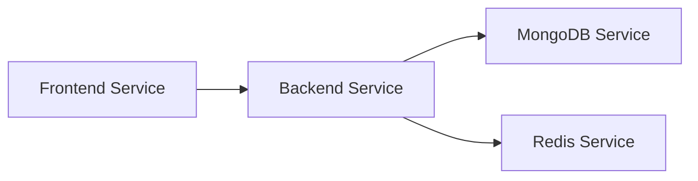

# Maintenance and Upgrades

<cite>
**Referenced Files in This Document**
- [README.md](file://README.md)
- [docker-compose.yml](file://docker-compose.yml)
- [backend/Dockerfile](file://backend/Dockerfile)
- [backend/package.json](file://backend/package.json)
- [backend/MIGRATION_GUIDE.md](file://backend/MIGRATION_GUIDE.md)
- [backend/QUICKSTART_QUEUE.md](file://backend/QUICKSTART_QUEUE.md)
- [backend/QUEUE_SETUP.md](file://backend/QUEUE_SETUP.md)
- [backend/REDIS_OPTIONAL.md](file://backend/REDIS_OPTIONAL.md)
- [backend/src/config/logger.js](file://backend/src/config/logger.js)
- [backend/src/app.js](file://backend/src/app.js)
- [backend/src/server.js](file://backend/src/server.js)
- [backend/src/worker/queue.js](file://backend/src/worker/queue.js)
- [backend/src/worker/processor.js](file://backend/src/worker/processor.js)
- [backend/src/worker/poller.js](file://backend/src/worker/poller.js)
- [backend/src/controllers/queue.controller.js](file://backend/src/controllers/queue.controller.js)
- [backend/src/routes/queue.routes.js](file://backend/src/routes/queue.routes.js)
</cite>

## Table of Contents
1. [Introduction](#introduction)
2. [Project Structure](#project-structure)
3. [Core Components](#core-components)
4. [Architecture Overview](#architecture-overview)
5. [Detailed Component Analysis](#detailed-component-analysis)
6. [Dependency Analysis](#dependency-analysis)
7. [Performance Considerations](#performance-considerations)
8. [Troubleshooting Guide](#troubleshooting-guide)
9. [Conclusion](#conclusion)
10. [Appendices](#appendices)

## Introduction
This document provides comprehensive guidance for maintaining and upgrading the EventHorizon system. It covers routine maintenance tasks such as database cleanup, log rotation, and system updates; migration and upgrade procedures; rollback strategies; backup and restore procedures for MongoDB and Redis; security patching and vulnerability management; capacity planning and performance tuning; disaster recovery and business continuity; and operational runbooks for system administrators.

## Project Structure
The EventHorizon system consists of:
- Backend: Node.js/Express server with BullMQ-based background job processing, MongoDB for persistence, and optional Redis for queueing.
- Frontend: Vite/React dashboard for managing triggers.
- Contracts: Rust-based Soroban contracts for testing and production use cases.
- Docker Compose: Orchestration for local development and deployment of MongoDB, Redis, and the backend.

**Diagram sources**
- [docker-compose.yml:1-70](file://docker-compose.yml#L1-L70)

**Section sources**
- [README.md:10-17](file://README.md#L10-L17)
- [docker-compose.yml:1-70](file://docker-compose.yml#L1-L70)

## Core Components
- Event Poller: Periodically queries the Soroban network for contract events and enqueues actions or executes them directly depending on Redis availability.
- BullMQ Queue: Redis-backed job queue enabling guaranteed delivery, retries, concurrency control, and observability.
- Worker Pool: Processes jobs concurrently with built-in rate limiting and logging.
- Queue Controller and Routes: Provide monitoring endpoints for queue statistics, job listings, cleaning, and retry operations.
- Logging: Structured logging for info, warn, error, and debug levels.
- Graceful Degradation: Falls back to direct execution when Redis is unavailable.

Key maintenance-relevant behaviors:
- Queue retention policies for completed and failed jobs.
- Automatic retries with exponential backoff.
- Health checks and graceful shutdown handling.
- Environment-driven configuration for Redis, concurrency, and polling intervals.

**Section sources**
- [backend/src/worker/poller.js:177-335](file://backend/src/worker/poller.js#L177-L335)
- [backend/src/worker/queue.js:19-164](file://backend/src/worker/queue.js#L19-L164)
- [backend/src/worker/processor.js:102-174](file://backend/src/worker/processor.js#L102-L174)
- [backend/src/controllers/queue.controller.js:7-142](file://backend/src/controllers/queue.controller.js#L7-L142)
- [backend/src/routes/queue.routes.js:13-104](file://backend/src/routes/queue.routes.js#L13-L104)
- [backend/src/config/logger.js:1-19](file://backend/src/config/logger.js#L1-L19)
- [backend/src/server.js:44-78](file://backend/src/server.js#L44-L78)

## Architecture Overview
The system architecture separates event detection from action execution via a queue. Redis provides durability and concurrency; MongoDB persists triggers and related state. The frontend communicates with the backend via REST APIs.

**Diagram sources**
- [backend/src/worker/poller.js:55-147](file://backend/src/worker/poller.js#L55-L147)
- [backend/src/worker/queue.js:19-83](file://backend/src/worker/queue.js#L19-L83)
- [backend/src/worker/processor.js:25-97](file://backend/src/worker/processor.js#L25-L97)
- [backend/src/controllers/queue.controller.js:1-142](file://backend/src/controllers/queue.controller.js#L1-L142)
- [backend/src/routes/queue.routes.js:1-104](file://backend/src/routes/queue.routes.js#L1-L104)

## Detailed Component Analysis

### Queue Lifecycle and Maintenance
- Enqueue actions with priority and job ID.
- Retrieve counts per queue state and compute totals.
- Clean old jobs according to retention policies.
- Retry failed jobs via API.

**Diagram sources**
- [backend/src/worker/queue.js:91-121](file://backend/src/worker/queue.js#L91-L121)
- [backend/src/worker/processor.js:102-136](file://backend/src/worker/processor.js#L102-L136)
- [backend/src/worker/poller.js:152-173](file://backend/src/worker/poller.js#L152-L173)

**Section sources**
- [backend/src/worker/queue.js:126-164](file://backend/src/worker/queue.js#L126-L164)
- [backend/src/worker/processor.js:138-160](file://backend/src/worker/processor.js#L138-L160)
- [backend/src/controllers/queue.controller.js:7-142](file://backend/src/controllers/queue.controller.js#L7-L142)

### Polling and Retry Strategy
- Polls for events with exponential backoff and pagination.
- Executes actions via queue (background) or directly (fallback).
- Tracks execution metrics and persists last polled ledger.

**Diagram sources**
- [backend/src/worker/poller.js:177-335](file://backend/src/worker/poller.js#L177-L335)

**Section sources**
- [backend/src/worker/poller.js:27-51](file://backend/src/worker/poller.js#L27-L51)
- [backend/src/worker/poller.js:177-335](file://backend/src/worker/poller.js#L177-L335)

### Graceful Degradation and Redis Availability
- If Redis is unavailable, the queue system is disabled and actions are executed synchronously.
- Queue endpoints return a service-unavailable response with guidance.

**Diagram sources**
- [backend/src/server.js:44-55](file://backend/src/server.js#L44-L55)
- [backend/src/worker/poller.js:55-147](file://backend/src/worker/poller.js#L55-L147)
- [backend/src/routes/queue.routes.js:13-23](file://backend/src/routes/queue.routes.js#L13-L23)

**Section sources**
- [backend/src/server.js:44-55](file://backend/src/server.js#L44-L55)
- [backend/REDIS_OPTIONAL.md:21-70](file://backend/REDIS_OPTIONAL.md#L21-L70)
- [backend/src/routes/queue.routes.js:13-23](file://backend/src/routes/queue.routes.js#L13-L23)

### Migration and Upgrade Procedures
- Migration to BullMQ queue system requires Redis installation and environment configuration.
- Rollback reverts to direct execution by removing worker initialization and using the previous execution path.
- Production checklist includes Redis persistence, password/security settings, monitoring, and concurrency tuning.

**Diagram sources**
- [backend/MIGRATION_GUIDE.md:25-145](file://backend/MIGRATION_GUIDE.md#L25-L145)
- [backend/QUICKSTART_QUEUE.md:15-80](file://backend/QUICKSTART_QUEUE.md#L15-L80)
- [backend/QUEUE_SETUP.md:58-78](file://backend/QUEUE_SETUP.md#L58-L78)

**Section sources**
- [backend/MIGRATION_GUIDE.md:25-145](file://backend/MIGRATION_GUIDE.md#L25-L145)
- [backend/QUICKSTART_QUEUE.md:15-80](file://backend/QUICKSTART_QUEUE.md#L15-L80)
- [backend/QUEUE_SETUP.md:58-78](file://backend/QUEUE_SETUP.md#L58-L78)

### Backup and Restore Procedures

#### MongoDB
- Use volume mounts for persistent data in Docker Compose.
- Recommended procedure:
  - Stop the backend service.
  - Back up the MongoDB data directory mounted as a named volume.
  - Restore by replacing the data directory contents and restarting the service.
- Validate connectivity and application health after restoration.

**Section sources**
- [docker-compose.yml:10-11](file://docker-compose.yml#L10-L11)
- [backend/src/server.js:34-42](file://backend/src/server.js#L34-L42)

#### Redis
- Use volume mounts for Redis persistence in Docker Compose.
- Recommended procedure:
  - Stop the backend and Redis services.
  - Back up the Redis data directory mounted as a named volume.
  - Restore by replacing the data directory contents and restarting Redis.
  - Restart the backend to reinitialize the queue.
- Validate Redis connectivity and queue functionality.

**Section sources**
- [docker-compose.yml:19-20](file://docker-compose.yml#L19-L20)
- [backend/src/worker/queue.js:9-15](file://backend/src/worker/queue.js#L9-L15)
- [backend/src/worker/processor.js:14-20](file://backend/src/worker/processor.js#L14-L20)

### Security Patching and Vulnerability Management
- Keep Node.js runtime and dependencies updated regularly.
- Review and update packages defined in the backend’s package manifest.
- Apply OS-level updates to hosts running containers.
- Rotate secrets and environment variables periodically.
- Enable Redis password and TLS in production environments.
- Restrict network exposure of Redis and MongoDB.

**Section sources**
- [backend/package.json:10-26](file://backend/package.json#L10-L26)
- [backend/QUEUE_SETUP.md:221-227](file://backend/QUEUE_SETUP.md#L221-L227)
- [backend/REDIS_OPTIONAL.md:106-114](file://backend/REDIS_OPTIONAL.md#L106-L114)

### Capacity Planning and Performance Tuning
- Concurrency: Adjust worker concurrency via environment variable to match workload.
- Retries and backoff: Tune attempts and delays to balance reliability and resource usage.
- Retention: Configure retention windows for completed and failed jobs to control storage growth.
- Rate limiting: Adjust the worker limiter to prevent throttling external services.
- Polling cadence: Tune polling interval and ledger window size to reduce RPC load.
- Scaling: Horizontally scale workers behind a load balancer or use multiple backend instances.

**Section sources**
- [backend/src/worker/processor.js:128-136](file://backend/src/worker/processor.js#L128-L136)
- [backend/src/worker/queue.js:23-37](file://backend/src/worker/queue.js#L23-L37)
- [backend/src/worker/poller.js:312-329](file://backend/src/worker/poller.js#L312-L329)
- [backend/QUEUE_SETUP.md:229-234](file://backend/QUEUE_SETUP.md#L229-L234)

### Disaster Recovery and Business Continuity
- Maintain backups for MongoDB and Redis data volumes.
- Document environment variables and configuration for quick rebuilds.
- Use Docker Compose to orchestrate recovery and validate service health.
- Establish monitoring and alerting for queue failures and backend downtime.
- Define RTO/RPO targets and test restoration procedures periodically.

**Section sources**
- [docker-compose.yml:62-70](file://docker-compose.yml#L62-L70)
- [backend/src/server.js:69-78](file://backend/src/server.js#L69-L78)

### Operational Runbooks

#### Routine Maintenance Tasks
- Database cleanup:
  - Use the queue clean endpoint to remove old completed and failed jobs.
  - Monitor queue statistics to assess growth and adjust retention.
- Log rotation:
  - Route application logs to a centralized logging system.
  - Use container log drivers or external log collectors to manage disk usage.
- System updates:
  - Update Node.js and dependencies per the backend package manifest.
  - Validate changes in a staging environment before production deployment.

**Section sources**
- [backend/src/controllers/queue.controller.js:86-100](file://backend/src/controllers/queue.controller.js#L86-L100)
- [backend/src/worker/queue.js:148-156](file://backend/src/worker/queue.js#L148-L156)
- [backend/package.json:10-26](file://backend/package.json#L10-L26)

#### Change Management Procedures
- Use feature flags or environment toggles for gradual rollouts.
- Perform smoke tests and health checks after changes.
- Document rollback steps and rehearse them in staging.

**Section sources**
- [backend/REDIS_OPTIONAL.md:156-182](file://backend/REDIS_OPTIONAL.md#L156-L182)
- [backend/MIGRATION_GUIDE.md:135-145](file://backend/MIGRATION_GUIDE.md#L135-L145)

#### Emergency Response Protocols
- Immediate actions:
  - Check backend health endpoint and container status.
  - Verify Redis connectivity and queue availability.
  - Inspect worker logs for errors and failed jobs.
- Escalation:
  - Promote degraded mode if Redis remains unavailable.
  - Initiate rollback to a known-good configuration if necessary.

**Section sources**
- [backend/src/app.js:48-48](file://backend/src/app.js#L48-L48)
- [backend/src/server.js:44-55](file://backend/src/server.js#L44-L55)
- [backend/src/worker/processor.js:154-159](file://backend/src/worker/processor.js#L154-L159)

## Dependency Analysis
The backend depends on MongoDB for persistence and optionally Redis for queueing. Docker Compose defines service dependencies and shared networking.

**Diagram sources**
- [docker-compose.yml:24-43](file://docker-compose.yml#L24-L43)

**Section sources**
- [docker-compose.yml:24-43](file://docker-compose.yml#L24-L43)
- [backend/src/server.js:34-42](file://backend/src/server.js#L34-L42)

## Performance Considerations
- Queue retention reduces long-term storage costs but may impact historical analysis; tune retention windows accordingly.
- Worker concurrency should align with external service rate limits and available CPU/memory.
- Polling frequency and ledger window size influence RPC load; monitor network utilization.
- Graceful shutdown ensures workers finish in-flight jobs before termination.

**Section sources**
- [backend/src/worker/queue.js:29-35](file://backend/src/worker/queue.js#L29-L35)
- [backend/src/worker/processor.js:131-135](file://backend/src/worker/processor.js#L131-L135)
- [backend/src/server.js:69-78](file://backend/src/server.js#L69-L78)

## Troubleshooting Guide
- Redis connection refused:
  - Verify Redis is running and reachable.
  - Check environment variables for host, port, and password.
- Worker not starting:
  - Inspect backend logs for Redis-related errors.
  - Confirm BullMQ worker initialization and queue availability.
- High failed job count:
  - Use the queue jobs endpoint to inspect failed jobs.
  - Validate external service credentials and endpoints.
- Queue endpoints return service unavailable:
  - Install and configure Redis; restart the backend.

**Section sources**
- [backend/MIGRATION_GUIDE.md:182-217](file://backend/MIGRATION_GUIDE.md#L182-L217)
- [backend/QUICKSTART_QUEUE.md:144-181](file://backend/QUICKSTART_QUEUE.md#L144-L181)
- [backend/src/routes/queue.routes.js:13-23](file://backend/src/routes/queue.routes.js#L13-L23)

## Conclusion
This guide consolidates operational practices for EventHorizon, emphasizing resilient queueing, observability, and robust change management. By following the documented procedures for migrations, backups, security, performance tuning, and emergency response, administrators can maintain a reliable and scalable system.

## Appendices

### Maintenance Schedule Examples
- Daily:
  - Review queue statistics and failed job counts.
  - Rotate logs and archive metrics.
- Weekly:
  - Clean old queue jobs and audit retention settings.
  - Validate MongoDB and Redis backups.
- Monthly:
  - Update dependencies and test upgrades in staging.
  - Conduct disaster recovery drills.

### Environment Variables Reference
- Redis:
  - REDIS_HOST, REDIS_PORT, REDIS_PASSWORD
  - WORKER_CONCURRENCY
- Polling:
  - POLL_INTERVAL_MS, MAX_LEDGERS_PER_POLL, RPC_MAX_RETRIES, RPC_BASE_DELAY_MS
- External Services:
  - SOROBAN_RPC_URL, TELEGRAM_BOT_TOKEN

**Section sources**
- [backend/QUEUE_SETUP.md:81-89](file://backend/QUEUE_SETUP.md#L81-L89)
- [backend/QUICKSTART_QUEUE.md:50-62](file://backend/QUICKSTART_QUEUE.md#L50-L62)
- [backend/src/worker/poller.js:10-16](file://backend/src/worker/poller.js#L10-L16)
- [backend/src/worker/processor.js:9-12](file://backend/src/worker/processor.js#L9-L12)