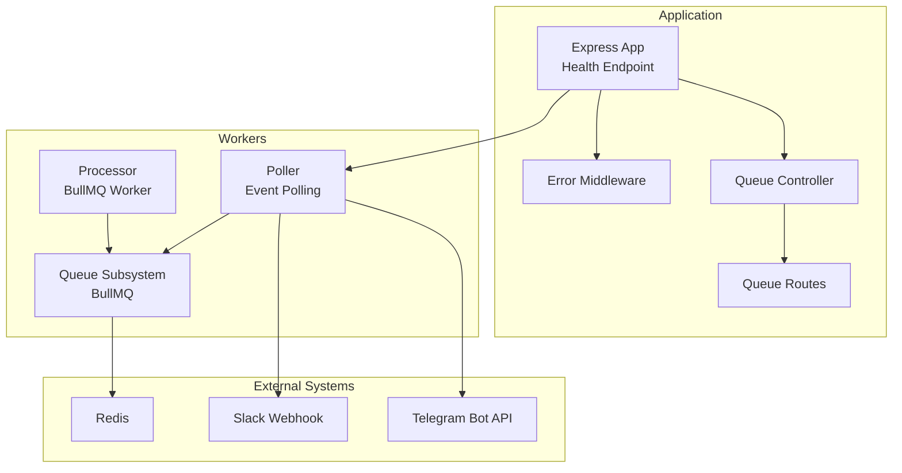
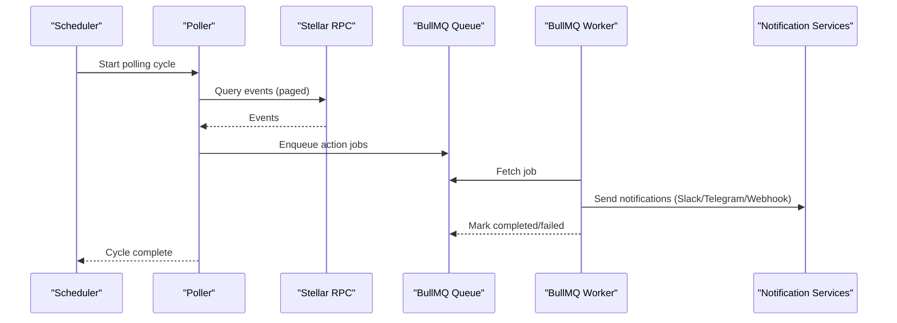
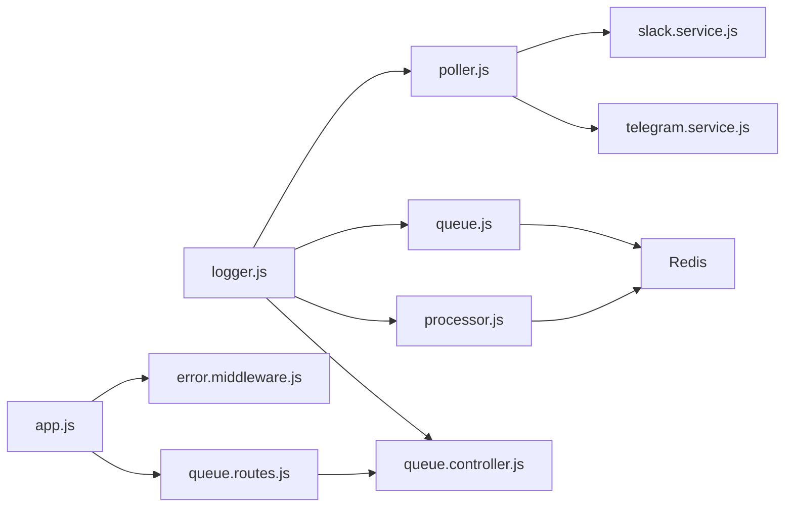

# Monitoring and Alerting

<cite>
**Referenced Files in This Document**
- [logger.js](file://backend/src/config/logger.js)
- [app.js](file://backend/src/app.js)
- [error.middleware.js](file://backend/src/middleware/error.middleware.js)
- [queue.js](file://backend/src/worker/queue.js)
- [processor.js](file://backend/src/worker/processor.js)
- [poller.js](file://backend/src/worker/poller.js)
- [queue.controller.js](file://backend/src/controllers/queue.controller.js)
- [queue.routes.js](file://backend/src/routes/queue.routes.js)
- [slack.service.js](file://backend/src/services/slack.service.js)
- [telegram.service.js](file://backend/src/services/telegram.service.js)
- [Dockerfile](file://backend/Dockerfile)
- [docker-compose.yml](file://docker-compose.yml)
- [MIGRATION_GUIDE.md](file://backend/MIGRATION_GUIDE.md)
- [package.json](file://backend/package.json)
</cite>

## Table of Contents
1. [Introduction](#introduction)
2. [Project Structure](#project-structure)
3. [Core Components](#core-components)
4. [Architecture Overview](#architecture-overview)
5. [Detailed Component Analysis](#detailed-component-analysis)
6. [Dependency Analysis](#dependency-analysis)
7. [Performance Considerations](#performance-considerations)
8. [Troubleshooting Guide](#troubleshooting-guide)
9. [Conclusion](#conclusion)
10. [Appendices](#appendices)

## Introduction
This document describes how to set up system monitoring and alerting for the EventHorizon backend. It covers logging configuration, log aggregation strategies, monitoring dashboards, key performance indicators (KPIs), integration with Prometheus, Grafana, and APM tools, alerting thresholds and notification channels, incident response procedures, health checks, uptime monitoring, performance baselines, log rotation and retention, and security considerations for monitoring data. It also provides templates for common monitoring scenarios and troubleshooting workflows.

## Project Structure
The monitoring-relevant parts of the backend are organized around:
- Logging configuration and usage across workers and controllers
- Queue subsystem (BullMQ) for asynchronous job processing
- Poller that periodically queries blockchain events and dispatches actions
- Queue management endpoints for observability
- Notification services for Slack and Telegram
- Application bootstrap and health endpoint

**Diagram sources**
- [app.js:24-48](file://backend/src/app.js#L24-L48)
- [queue.controller.js:1-142](file://backend/src/controllers/queue.controller.js#L1-L142)
- [queue.routes.js:1-104](file://backend/src/routes/queue.routes.js#L1-L104)
- [poller.js:177-335](file://backend/src/worker/poller.js#L177-L335)
- [processor.js:102-174](file://backend/src/worker/processor.js#L102-L174)
- [queue.js:19-83](file://backend/src/worker/queue.js#L19-L83)

**Section sources**
- [app.js:1-55](file://backend/src/app.js#L1-L55)
- [docker-compose.yml:1-70](file://docker-compose.yml#L1-L70)
- [Dockerfile:1-25](file://backend/Dockerfile#L1-L25)

## Core Components
- Logging: Centralized logger writes to stdout/stderr with timestamps and levels. Used extensively in workers and controllers.
- Queue subsystem: BullMQ-backed queue with counts, job retrieval, and cleanup. Provides statistics and retry capabilities.
- Poller: Periodic event polling against a Stellar RPC with exponential backoff, pagination, and per-trigger retry logic.
- Processor: BullMQ worker that executes actions (email, Discord, Telegram, webhook) with robust error logging.
- Notification services: Slack and Telegram services with graceful error handling and payload construction.
- Health endpoint: Lightweight GET /api/health returning a simple status payload.

Key monitoring touchpoints:
- Queue statistics and job lifecycle
- Poller cycles and per-trigger execution metrics
- Worker completion/failure events
- Error middleware normalization and response logging
- Health endpoint for uptime checks

**Section sources**
- [logger.js:1-19](file://backend/src/config/logger.js#L1-L19)
- [queue.js:126-163](file://backend/src/worker/queue.js#L126-L163)
- [poller.js:177-335](file://backend/src/worker/poller.js#L177-L335)
- [processor.js:102-174](file://backend/src/worker/processor.js#L102-L174)
- [slack.service.js:97-160](file://backend/src/services/slack.service.js#L97-L160)
- [telegram.service.js:15-74](file://backend/src/services/telegram.service.js#L15-L74)
- [app.js:28-48](file://backend/src/app.js#L28-L48)

## Architecture Overview
The monitoring architecture leverages stdout/stderr for logs, BullMQ for observability via counts and job metadata, and external notification channels for alerts. Health checks are exposed via a dedicated endpoint. The system can optionally integrate with Prometheus/Grafana and APM tools.

**Diagram sources**
- [poller.js:177-335](file://backend/src/worker/poller.js#L177-L335)
- [queue.js:91-121](file://backend/src/worker/queue.js#L91-L121)
- [processor.js:102-174](file://backend/src/worker/processor.js#L102-L174)
- [slack.service.js:97-160](file://backend/src/services/slack.service.js#L97-L160)
- [telegram.service.js:15-74](file://backend/src/services/telegram.service.js#L15-L74)

## Detailed Component Analysis

### Logging Configuration
- Logger provides info/warn/error/debug methods and writes to stdout/stderr with ISO timestamps.
- Debug logs are only emitted outside production environments.
- Used pervasively in poller, processor, queue subsystem, and controllers.

Recommended practices:
- Forward stdout/stderr to a log collector (e.g., Fluent Bit, Vector, Logstash).
- Tag logs with service, container, and environment for aggregation.
- Rotate and retain logs at the collector level.

**Section sources**
- [logger.js:1-19](file://backend/src/config/logger.js#L1-L19)

### Queue Monitoring and Management
- Queue exposes counts for waiting, active, completed, failed, delayed, and total jobs.
- Supports retrieving recent jobs by status and cleaning old jobs.
- Provides manual retry for failed jobs.

KPIs:
- Queue depth (waiting + delayed)
- Throughput (completed per interval)
- Failure rate (failed/total)
- Backlog growth trend

Operational controls:
- Scheduled cleanup of completed/failed jobs
- Manual retry for transient failures
- Health route guards for queue availability

**Section sources**
- [queue.js:126-163](file://backend/src/worker/queue.js#L126-L163)
- [queue.controller.js:1-142](file://backend/src/controllers/queue.controller.js#L1-L142)
- [queue.routes.js:1-104](file://backend/src/routes/queue.routes.js#L1-L104)

### Poller Monitoring
- Periodic polling with exponential backoff and pagination.
- Per-trigger execution counters and last-success tracking.
- Per-cycle logging of processed triggers and found events.

KPIs:
- Polling frequency adherence
- Found events per cycle
- Execution success vs. permanent failure
- RPC latency and retry counts

**Section sources**
- [poller.js:177-335](file://backend/src/worker/poller.js#L177-L335)

### Worker Monitoring
- Worker listens for completed/failed/error events and logs with rich metadata.
- Configurable concurrency and rate limiting.
- Attempts and backoff are logged for visibility.

KPIs:
- Jobs completed per interval
- Jobs failed per interval
- Worker error rate
- Concurrency utilization

**Section sources**
- [processor.js:102-174](file://backend/src/worker/processor.js#L102-L174)

### Notification Services Monitoring
- Slack: Builds Block Kit payloads and handles HTTP errors gracefully.
- Telegram: Escapes MarkdownV2 and handles common API errors.

KPIs:
- Delivery success rate per channel
- Rate limit handling and retry behavior
- Latency for external API calls

**Section sources**
- [slack.service.js:97-160](file://backend/src/services/slack.service.js#L97-L160)
- [telegram.service.js:15-74](file://backend/src/services/telegram.service.js#L15-L74)

### Health Endpoint
- GET /api/health returns a simple JSON status payload.
- Use for uptime monitoring and readiness probes.

**Section sources**
- [app.js:28-48](file://backend/src/app.js#L28-L48)

### Error Handling and Observability
- Error middleware normalizes errors and enriches responses with details in development.
- Logs include stack traces in development and sanitized messages in production.

**Section sources**
- [error.middleware.js:1-59](file://backend/src/middleware/error.middleware.js#L1-L59)

## Dependency Analysis

**Diagram sources**
- [logger.js:1-19](file://backend/src/config/logger.js#L1-L19)
- [poller.js:177-335](file://backend/src/worker/poller.js#L177-L335)
- [processor.js:102-174](file://backend/src/worker/processor.js#L102-L174)
- [queue.js:19-83](file://backend/src/worker/queue.js#L19-L83)
- [queue.controller.js:1-142](file://backend/src/controllers/queue.controller.js#L1-L142)
- [slack.service.js:97-160](file://backend/src/services/slack.service.js#L97-L160)
- [telegram.service.js:15-74](file://backend/src/services/telegram.service.js#L15-L74)
- [app.js:1-55](file://backend/src/app.js#L1-L55)
- [error.middleware.js:1-59](file://backend/src/middleware/error.middleware.js#L1-L59)
- [queue.routes.js:1-104](file://backend/src/routes/queue.routes.js#L1-L104)

**Section sources**
- [package.json:10-26](file://backend/package.json#L10-L26)
- [docker-compose.yml:3-43](file://docker-compose.yml#L3-L43)

## Performance Considerations
- Queue throughput: Monitor completed jobs per interval and adjust worker concurrency and rate limiter settings accordingly.
- Polling cadence: Tune POLL_INTERVAL_MS and MAX_LEDGERS_PER_POLL to balance responsiveness and RPC load.
- Backoff and retries: Exponential backoff in the poller reduces RPC pressure; ensure retry intervals are sufficient for transient failures.
- Cleanup policy: Configure removeOnComplete/removeOnFail retention to control Redis memory usage.
- Container isolation: Run backend and workers in separate containers for resource control; expose health checks for orchestrators.

[No sources needed since this section provides general guidance]

## Troubleshooting Guide
Common scenarios and steps:
- No queue stats or queue routes return 503:
  - Verify Redis connectivity and credentials.
  - Confirm queue subsystem initialization and BullMQ availability.
- High failure rate in worker:
  - Inspect failed job details and attempts; use retryJob endpoint for transient failures.
  - Review external service credentials (Slack/Telegram/webhook URLs).
- Poller not finding events:
  - Check RPC URL and timeouts; verify network reachability.
  - Confirm contractId and event name XDR encoding.
- Health check failing:
  - Validate application startup and route registration.
  - Check container logs and port exposure.

**Section sources**
- [queue.routes.js:14-23](file://backend/src/routes/queue.routes.js#L14-L23)
- [queue.controller.js:105-134](file://backend/src/controllers/queue.controller.js#L105-L134)
- [poller.js:177-335](file://backend/src/worker/poller.js#L177-L335)
- [app.js:28-48](file://backend/src/app.js#L28-L48)

## Conclusion
The EventHorizon backend provides built-in logging, queue observability, and health checks suitable for operational monitoring. By forwarding logs to a centralized collector, instrumenting queue metrics, and integrating external alerting and dashboards, teams can establish comprehensive monitoring and alerting. Operational controls like scheduled cleanup, manual retries, and health checks support reliable incident response.

[No sources needed since this section summarizes without analyzing specific files]

## Appendices

### Monitoring KPIs and Metrics
- Queue processing rates:
  - Jobs completed per minute/hour
  - Waiting/delayed backlog growth
- Error rates:
  - Worker failure rate
  - Poller execution failure rate
  - External delivery failure rate (Slack/Telegram)
- System health:
  - Uptime (health endpoint)
  - Worker and queue subsystem availability
  - RPC request latency and retry counts

[No sources needed since this section provides general guidance]

### Log Aggregation Strategies
- Collect stdout/stderr from backend and worker containers.
- Tag logs with service, container, and environment.
- Forward to a log aggregator (e.g., Elasticsearch, Loki, Splunk).
- Apply log rotation and retention policies at the collector.

[No sources needed since this section provides general guidance]

### Dashboard Implementation Templates
- Queue dashboard:
  - Panels for waiting, active, completed, failed, delayed counts
  - Throughput and failure rate over time
- Poller dashboard:
  - Polling cycles per hour, events found per cycle
  - Per-trigger success/failure counters
- Worker dashboard:
  - Completed/failed jobs per interval
  - Worker error rate and concurrency utilization
- External delivery dashboard:
  - Slack/Telegram delivery success rate and latency

[No sources needed since this section provides general guidance]

### Alerting Thresholds and Channels
- Thresholds:
  - Queue backlog exceeds N jobs for M minutes
  - Worker failure rate > X%
  - Health endpoint down for Y checks
  - Poller execution failure rate > Z%
- Channels:
  - Slack webhooks for team notifications
  - Telegram bots for on-call paging
  - PagerDuty/Jira for incident tickets

[No sources needed since this section provides general guidance]

### Incident Response Procedures
- Immediate actions:
  - Check health endpoint and container status
  - Inspect recent failed jobs and logs
  - Verify external service credentials and quotas
- Mitigation:
  - Retry failed jobs via queue API
  - Scale workers or reduce concurrency
  - Pause triggers temporarily if needed
- Postmortem:
  - Capture logs, metrics, and timeline
  - Update thresholds and runbooks

[No sources needed since this section provides general guidance]

### Security Considerations
- Restrict access to queue admin endpoints to trusted IPs.
- Store secrets (Slack webhook URLs, Telegram tokens, Redis credentials) in secure vaults.
- Audit logs for sensitive data; redact where necessary.
- Use non-root users in containers and minimal base images.

**Section sources**
- [Dockerfile:13-20](file://backend/Dockerfile#L13-L20)

### Integration Notes
- Prometheus/Grafana:
  - Expose metrics endpoints or scrape logs for queue/job metrics.
  - Visualize KPIs and set up alerts.
- APM:
  - Instrument key endpoints and worker execution spans.
  - Correlate traces with logs for debugging.

**Section sources**
- [MIGRATION_GUIDE.md:256-262](file://backend/MIGRATION_GUIDE.md#L256-L262)