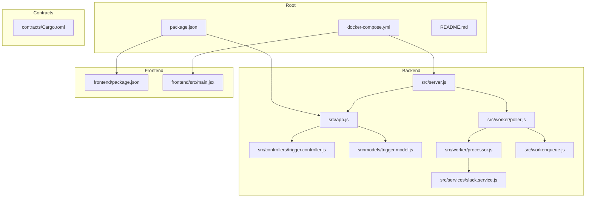
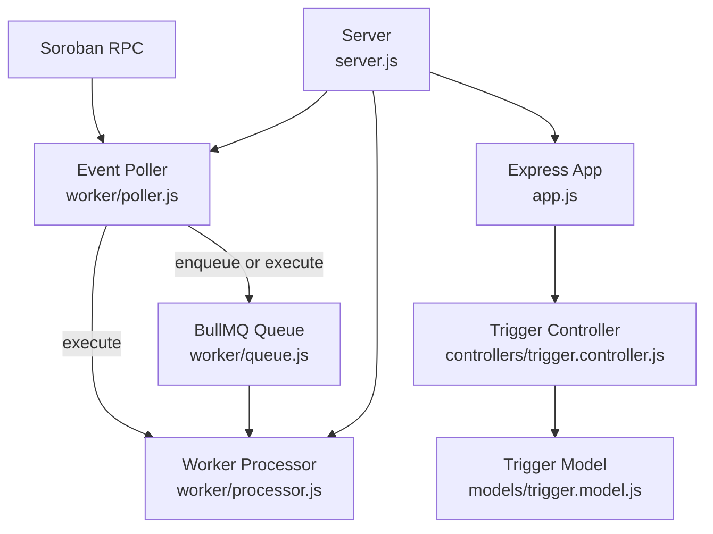
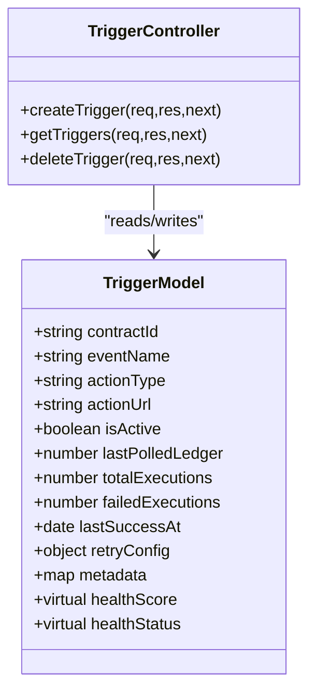
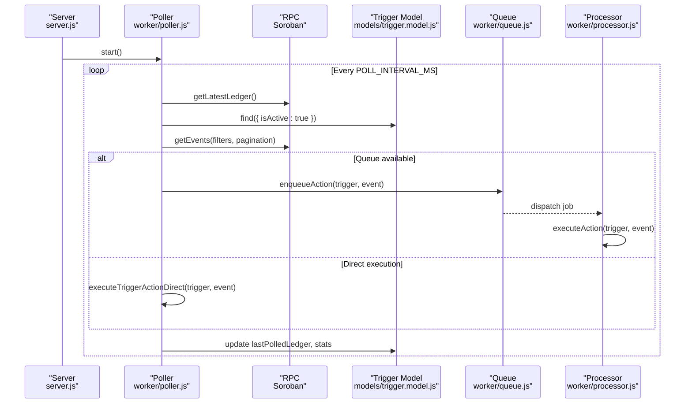
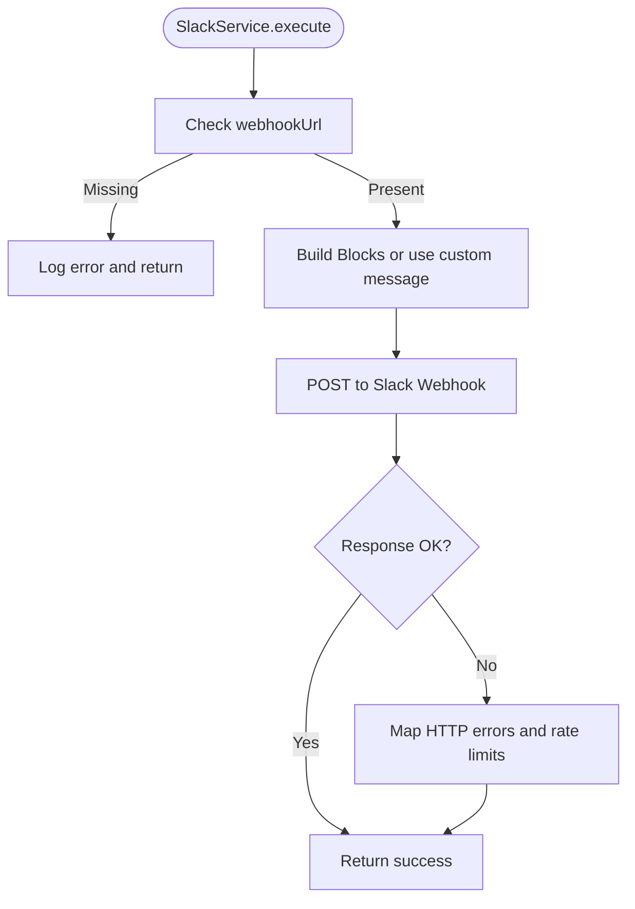
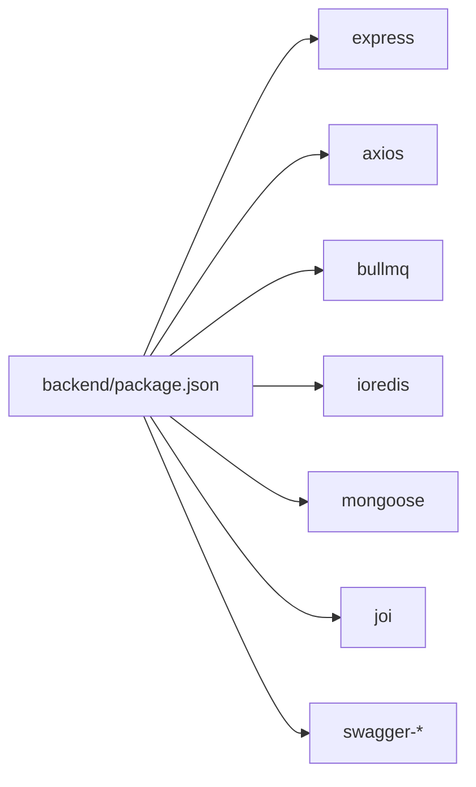
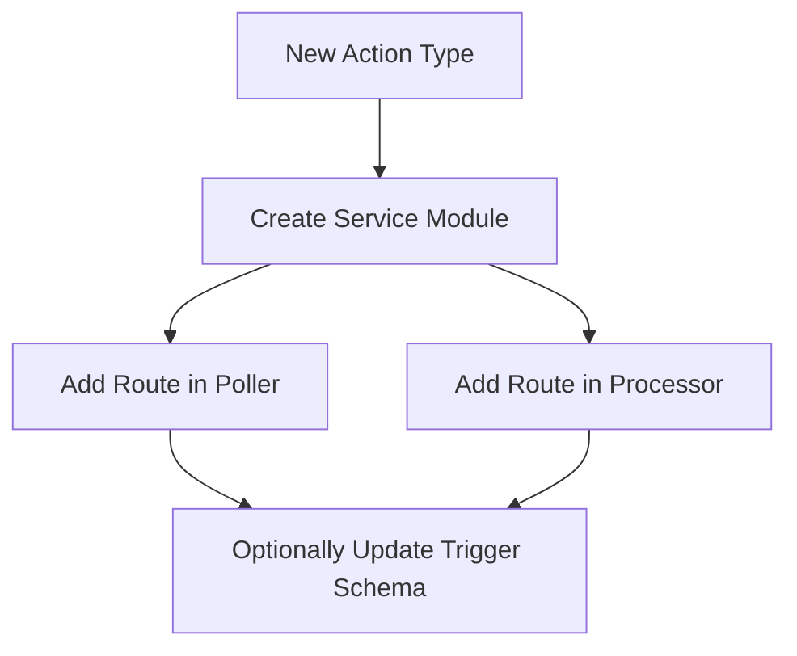

# Development Guide

<cite>
**Referenced Files in This Document**
- [README.md](file://README.md)
- [package.json](file://package.json)
- [backend/package.json](file://backend/package.json)
- [frontend/package.json](file://frontend/package.json)
- [docker-compose.yml](file://docker-compose.yml)
- [backend/src/app.js](file://backend/src/app.js)
- [backend/src/server.js](file://backend/src/server.js)
- [backend/src/controllers/trigger.controller.js](file://backend/src/controllers/trigger.controller.js)
- [backend/src/models/trigger.model.js](file://backend/src/models/trigger.model.js)
- [backend/src/services/slack.service.js](file://backend/src/services/slack.service.js)
- [backend/src/worker/processor.js](file://backend/src/worker/processor.js)
- [backend/src/worker/poller.js](file://backend/src/worker/poller.js)
- [backend/src/worker/queue.js](file://backend/src/worker/queue.js)
- [backend/__tests__/trigger.controller.test.js](file://backend/__tests__/trigger.controller.test.js)
- [backend/__tests__/slack.test.js](file://backend/__tests__/slack.test.js)
</cite>

## Table of Contents
1. [Introduction](#introduction)
2. [Project Structure](#project-structure)
3. [Core Components](#core-components)
4. [Architecture Overview](#architecture-overview)
5. [Detailed Component Analysis](#detailed-component-analysis)
6. [Dependency Analysis](#dependency-analysis)
7. [Performance Considerations](#performance-considerations)
8. [Troubleshooting Guide](#troubleshooting-guide)
9. [Conclusion](#conclusion)
10. [Appendices](#appendices)

## Introduction
EventHorizon is a decentralized “If-This-Then-That” (IFTTT) platform that listens for specific events emitted by Stellar Soroban smart contracts and triggers real-world Web2 actions such as webhooks, Discord, Slack, Telegram, and email notifications. It consists of:
- A Node.js/Express backend with a MongoDB-backed trigger store and a BullMQ-based background job system
- A Vite/React frontend dashboard for managing triggers
- A set of Rust-based Soroban contracts under the contracts directory for testing and demonstration

The platform supports optional Redis-backed background processing for guaranteed delivery, concurrency control, and job monitoring. It also exposes interactive API documentation and queue statistics endpoints.

## Project Structure
The repository is organized as a monorepo with workspaces for backend and frontend, plus a contracts directory containing multiple Rust-based contracts.

**Diagram sources**
- [package.json:1-30](file://package.json#L1-L30)
- [backend/src/app.js:1-55](file://backend/src/app.js#L1-L55)
- [backend/src/server.js:1-88](file://backend/src/server.js#L1-L88)
- [backend/src/controllers/trigger.controller.js:1-72](file://backend/src/controllers/trigger.controller.js#L1-L72)
- [backend/src/models/trigger.model.js:1-80](file://backend/src/models/trigger.model.js#L1-L80)
- [backend/src/worker/processor.js:1-174](file://backend/src/worker/processor.js#L1-L174)
- [backend/src/worker/poller.js:1-335](file://backend/src/worker/poller.js#L1-L335)
- [backend/src/worker/queue.js:1-164](file://backend/src/worker/queue.js#L1-L164)
- [backend/src/services/slack.service.js:1-165](file://backend/src/services/slack.service.js#L1-L165)
- [docker-compose.yml:1-70](file://docker-compose.yml#L1-L70)
- [frontend/package.json:1-32](file://frontend/package.json#L1-L32)

**Section sources**
- [README.md:10-17](file://README.md#L10-L17)
- [package.json:6-14](file://package.json#L6-L14)
- [backend/src/app.js:16-55](file://backend/src/app.js#L16-L55)
- [backend/src/server.js:34-88](file://backend/src/server.js#L34-L88)
- [docker-compose.yml:24-60](file://docker-compose.yml#L24-L60)

## Core Components
- Backend Express app and server: Initializes middleware, routes, database connection, and starts the event poller and optional BullMQ worker.
- Trigger model: Defines trigger schema, health metrics, and retry configuration.
- Trigger controller: CRUD operations for triggers with structured logging and error handling.
- Worker poller: Polls Soroban RPC for events, filters by contract and event name, and enqueues actions or executes directly.
- Worker queue: BullMQ queue abstraction with job lifecycle and statistics.
- Worker processor: Consumes jobs from the queue and executes actions per action type.
- Slack service: Builds Slack Block Kit payloads and sends alerts via webhooks.

Key runtime behaviors:
- Health endpoint at /api/health
- API docs at /api/docs and /api/docs/openapi.json
- Queue stats at /api/queue/stats (via queue module)
- Optional Redis-backed background processing

**Section sources**
- [backend/src/app.js:18-52](file://backend/src/app.js#L18-L52)
- [backend/src/server.js:34-88](file://backend/src/server.js#L34-L88)
- [backend/src/models/trigger.model.js:3-79](file://backend/src/models/trigger.model.js#L3-L79)
- [backend/src/controllers/trigger.controller.js:6-71](file://backend/src/controllers/trigger.controller.js#L6-L71)
- [backend/src/worker/poller.js:177-335](file://backend/src/worker/poller.js#L177-L335)
- [backend/src/worker/queue.js:19-164](file://backend/src/worker/queue.js#L19-L164)
- [backend/src/worker/processor.js:102-174](file://backend/src/worker/processor.js#L102-L174)
- [backend/src/services/slack.service.js:13-160](file://backend/src/services/slack.service.js#L13-L160)

## Architecture Overview
The system architecture integrates a polling loop with a background job system. The poller queries the Soroban RPC for events matching active triggers, then enqueues actions or executes them directly depending on Redis availability. The processor consumes jobs and performs the configured action.

**Diagram sources**
- [backend/src/worker/poller.js:177-335](file://backend/src/worker/poller.js#L177-L335)
- [backend/src/worker/queue.js:19-164](file://backend/src/worker/queue.js#L19-L164)
- [backend/src/worker/processor.js:102-174](file://backend/src/worker/processor.js#L102-L174)
- [backend/src/controllers/trigger.controller.js:1-72](file://backend/src/controllers/trigger.controller.js#L1-L72)
- [backend/src/models/trigger.model.js:1-80](file://backend/src/models/trigger.model.js#L1-L80)
- [backend/src/app.js:16-55](file://backend/src/app.js#L16-L55)
- [backend/src/server.js:34-88](file://backend/src/server.js#L34-L88)

## Detailed Component Analysis

### Trigger Model and Controller
The trigger model defines the schema for stored triggers, including contract identifiers, event names, action type, target URL, activation flag, polling progress, execution statistics, and retry configuration. It also computes health metrics as virtual fields.

The controller provides:
- Create trigger with structured logging and success response
- List triggers with a standardized payload wrapper
- Delete trigger with 404 handling via AppError

**Diagram sources**
- [backend/src/models/trigger.model.js:3-79](file://backend/src/models/trigger.model.js#L3-L79)
- [backend/src/controllers/trigger.controller.js:6-71](file://backend/src/controllers/trigger.controller.js#L6-L71)

**Section sources**
- [backend/src/models/trigger.model.js:3-79](file://backend/src/models/trigger.model.js#L3-L79)
- [backend/src/controllers/trigger.controller.js:6-71](file://backend/src/controllers/trigger.controller.js#L6-L71)

### Polling Workflow
The poller fetches the latest ledger, iterates active triggers, determines per-trigger ledger windows, paginates Soroban events, and enqueues actions or executes them directly. It tracks execution statistics and applies per-trigger retry configuration.

**Diagram sources**
- [backend/src/server.js:57-58](file://backend/src/server.js#L57-L58)
- [backend/src/worker/poller.js:177-335](file://backend/src/worker/poller.js#L177-L335)
- [backend/src/models/trigger.model.js:26-57](file://backend/src/models/trigger.model.js#L26-L57)
- [backend/src/worker/queue.js:91-121](file://backend/src/worker/queue.js#L91-L121)
- [backend/src/worker/processor.js:25-97](file://backend/src/worker/processor.js#L25-L97)

**Section sources**
- [backend/src/worker/poller.js:177-335](file://backend/src/worker/poller.js#L177-L335)
- [backend/src/worker/queue.js:91-121](file://backend/src/worker/queue.js#L91-L121)
- [backend/src/worker/processor.js:25-97](file://backend/src/worker/processor.js#L25-L97)

### Slack Notification Service
The Slack service builds a Block Kit payload from a Soroban event and posts it to a Slack webhook. It handles rate limiting and various Slack API error responses.

**Diagram sources**
- [backend/src/services/slack.service.js:142-160](file://backend/src/services/slack.service.js#L142-L160)
- [backend/src/services/slack.service.js:97-134](file://backend/src/services/slack.service.js#L97-L134)

**Section sources**
- [backend/src/services/slack.service.js:13-160](file://backend/src/services/slack.service.js#L13-L160)

### Testing Approach
- Built-in Node.js test runner is configured in the backend package script.
- Unit tests validate controller behavior and error propagation.
- Contract-style tests demonstrate Slack payload generation and optional live webhook posting when credentials are present.

Recommended practices:
- Use the built-in test runner for unit tests.
- Mock external dependencies (e.g., MongoDB, Redis) in tests.
- For integration tests, spin up minimal containers via docker-compose and run tests against them.

**Section sources**
- [backend/package.json:8](file://backend/package.json#L8)
- [backend/__tests__/trigger.controller.test.js:16-59](file://backend/__tests__/trigger.controller.test.js#L16-L59)
- [backend/__tests__/slack.test.js:4-57](file://backend/__tests__/slack.test.js#L4-L57)

## Dependency Analysis
Runtime dependencies include Express, BullMQ, Axios, Mongoose, Joi, and Swagger for API documentation. Development dependencies include Nodemon for hot reloading in development.

**Diagram sources**
- [backend/package.json:10-26](file://backend/package.json#L10-L26)

**Section sources**
- [backend/package.json:10-26](file://backend/package.json#L10-L26)

## Performance Considerations
- Polling cadence and ledger window size: Tune POLL_INTERVAL_MS and MAX_LEDGERS_PER_POLL to balance responsiveness and RPC load.
- Backoff and retries: The poller and queue both apply exponential backoff and configurable attempts.
- Concurrency: Adjust WORKER_CONCURRENCY to control parallelism of background job processing.
- Rate limiting: Global and per-route rate limit middleware are applied at the Express layer.
- Pagination and delays: Inter-page and inter-trigger delays reduce RPC pressure.

[No sources needed since this section provides general guidance]

## Troubleshooting Guide
Common issues and remedies:
- MongoDB connection failures: Verify MONGO_URI and local database availability.
- Redis unavailability: If Redis is not available, the system falls back to direct execution; enable Redis for background processing.
- Slack rate limits: The Slack service detects 429 responses and logs retry-after guidance.
- Queue stats: Use the queue statistics exposed by the queue module to monitor job counts and health.
- Graceful shutdown: SIGTERM closes workers and database connections cleanly.

**Section sources**
- [backend/src/server.js:35-87](file://backend/src/server.js#L35-L87)
- [backend/src/worker/poller.js:59-70](file://backend/src/worker/poller.js#L59-L70)
- [backend/src/services/slack.service.js:112-133](file://backend/src/services/slack.service.js#L112-L133)
- [backend/src/worker/queue.js:126-143](file://backend/src/worker/queue.js#L126-L143)

## Conclusion
EventHorizon provides a modular, extensible framework for reacting to Soroban contract events. The backend offers robust polling, resilient background processing, and standardized APIs, while the frontend enables easy trigger management. Extensibility is achieved by adding new action types in the poller/processor and corresponding services.

[No sources needed since this section summarizes without analyzing specific files]

## Appendices

### Development Environment Setup
- Prerequisites: Node.js (v18+), MongoDB, Redis (optional), Rust/Soroban CLI.
- Environment variables: Copy .env.example to .env in root and subdirectories; configure SOROBAN_RPC_URL and MONGO_URI.
- Local startup:
  - Install dependencies across workspaces
  - Start backend and frontend in separate terminals
- API documentation: Swagger UI at /api/docs; OpenAPI JSON at /api/docs/openapi.json
- Queue monitoring: Stats endpoint via queue module

**Section sources**
- [README.md:19-46](file://README.md#L19-L46)
- [package.json:10-14](file://package.json#L10-L14)
- [backend/src/app.js:24-28](file://backend/src/app.js#L24-L28)

### Build and Run
- Backend: start via Node or dev with Nodemon; Docker Compose runs MongoDB, Redis, backend, and frontend.
- Frontend: Vite dev server; preview production build locally.
- Docker Compose: Spins up mongo, redis, backend, and frontend; backend connects to mongo and redis; frontend proxies API to backend.

**Section sources**
- [backend/package.json:6-8](file://backend/package.json#L6-L8)
- [frontend/package.json:7](file://frontend/package.json#L7)
- [docker-compose.yml:24-60](file://docker-compose.yml#L24-L60)

### Coding Standards and Contribution Guidelines
- Use the built-in Node.js test runner for unit tests.
- Keep controllers thin; delegate business logic to services and models.
- Centralize logging and error handling via shared utilities and middleware.
- Add new action types by extending the poller’s action routing and the processor’s job executor.
- For pull requests, ensure tests pass, document changes, and keep diffs focused.

[No sources needed since this section provides general guidance]

### Testing Strategies
- Unit tests: Validate controller responses and error propagation.
- Integration tests: Use docker-compose to provision DB and Redis, then run tests against the backend.
- Contract testing: Use the boilerplate contracts to simulate events and verify trigger behavior.

**Section sources**
- [backend/__tests__/trigger.controller.test.js:16-59](file://backend/__tests__/trigger.controller.test.js#L16-L59)
- [backend/__tests__/slack.test.js:4-57](file://backend/__tests__/slack.test.js#L4-L57)
- [README.md:57-62](file://README.md#L57-L62)

### Extending Notification Services
To add a new notification channel:
- Define a new service module similar to Slack service with payload building and sending logic.
- Extend the poller’s direct execution branch to route the new action type.
- Extend the processor’s job executor to handle the new action type.
- Update trigger schema and controller logic if new configuration fields are needed.

**Diagram sources**
- [backend/src/services/slack.service.js:13-160](file://backend/src/services/slack.service.js#L13-L160)
- [backend/src/worker/poller.js:77-147](file://backend/src/worker/poller.js#L77-L147)
- [backend/src/worker/processor.js:25-97](file://backend/src/worker/processor.js#L25-L97)

### Modifying Trigger Logic
To modify trigger behavior:
- Update the trigger model schema if new fields are required.
- Modify the poller to change event filtering or retry logic.
- Adjust the controller to enforce new validation rules or expose new endpoints.

**Section sources**
- [backend/src/models/trigger.model.js:3-79](file://backend/src/models/trigger.model.js#L3-L79)
- [backend/src/worker/poller.js:201-298](file://backend/src/worker/poller.js#L201-L298)
- [backend/src/controllers/trigger.controller.js:6-71](file://backend/src/controllers/trigger.controller.js#L6-L71)

### Debugging Techniques
- Enable verbose logging via the logger configuration.
- Inspect queue statistics to diagnose bottlenecks.
- Use the health endpoint to confirm service readiness.
- For Slack, log generated Block Kit payloads to verify formatting.

**Section sources**
- [backend/src/app.js:8-14](file://backend/src/app.js#L8-L14)
- [backend/src/worker/queue.js:126-143](file://backend/src/worker/queue.js#L126-L143)
- [backend/src/app.js:48](file://backend/src/app.js#L48)
- [backend/src/services/slack.service.js:27-87](file://backend/src/services/slack.service.js#L27-L87)

### Continuous Integration and Quality Assurance
- Use the built-in test runner for CI jobs.
- Optionally integrate ESLint and lint scripts for frontend.
- Provision test environments with docker-compose in CI pipelines.
- Monitor queue stats and health endpoints in staging.

**Section sources**
- [backend/package.json:8](file://backend/package.json#L8)
- [frontend/package.json:9](file://frontend/package.json#L9)
- [docker-compose.yml:1-70](file://docker-compose.yml#L1-L70)