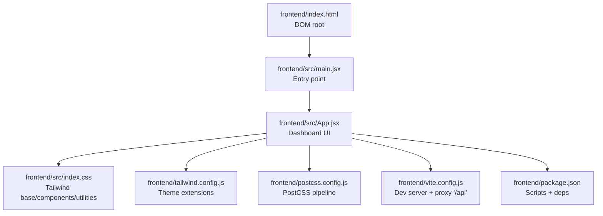
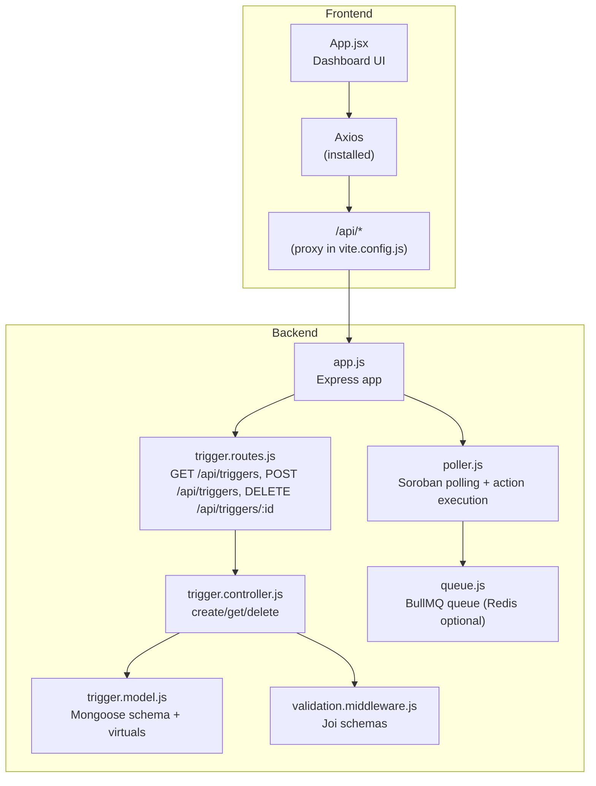
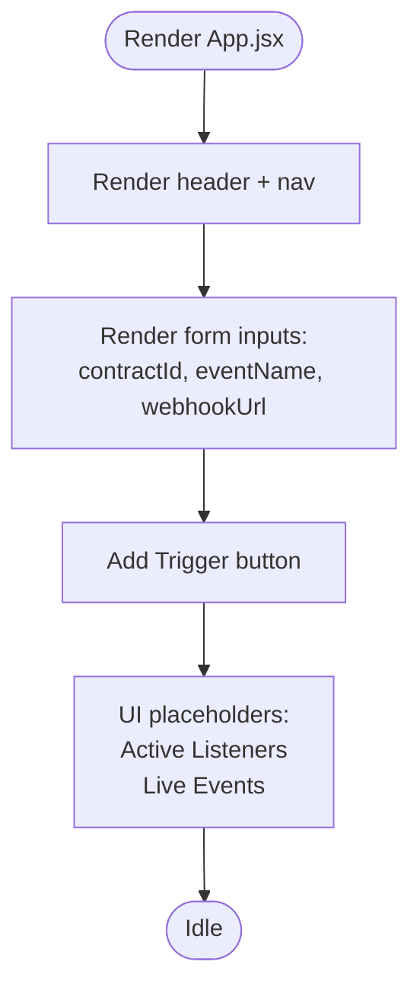
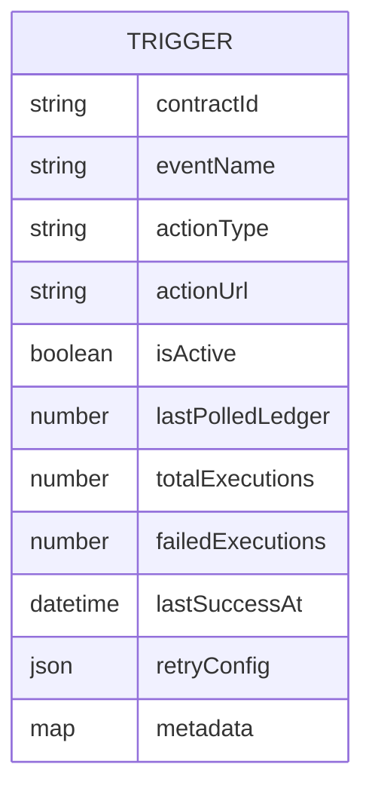
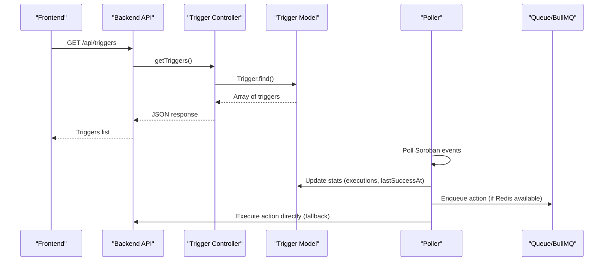
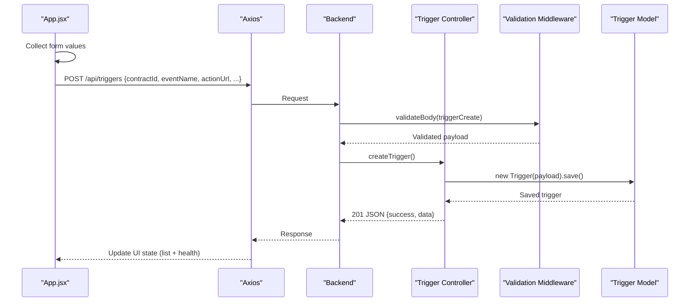
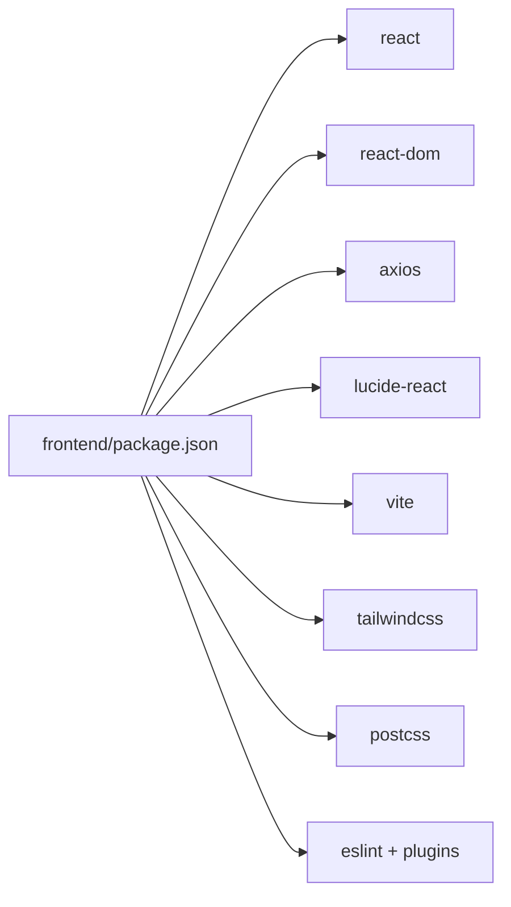

# Frontend Dashboard

<cite>
**Referenced Files in This Document**
- [main.jsx](file://frontend/src/main.jsx)
- [App.jsx](file://frontend/src/App.jsx)
- [index.html](file://frontend/index.html)
- [index.css](file://frontend/src/index.css)
- [tailwind.config.js](file://frontend/tailwind.config.js)
- [postcss.config.js](file://frontend/postcss.config.js)
- [vite.config.js](file://frontend/vite.config.js)
- [package.json](file://frontend/package.json)
- [trigger.controller.js](file://backend/src/controllers/trigger.controller.js)
- [trigger.routes.js](file://backend/src/routes/trigger.routes.js)
- [trigger.model.js](file://backend/src/models/trigger.model.js)
- [validation.middleware.js](file://backend/src/middleware/validation.middleware.js)
- [poller.js](file://backend/src/worker/poller.js)
- [queue.js](file://backend/src/worker/queue.js)
- [app.js](file://backend/src/app.js)
- [README.md](file://README.md)
</cite>

## Table of Contents
1. [Introduction](#introduction)
2. [Project Structure](#project-structure)
3. [Core Components](#core-components)
4. [Architecture Overview](#architecture-overview)
5. [Detailed Component Analysis](#detailed-component-analysis)
6. [Dependency Analysis](#dependency-analysis)
7. [Performance Considerations](#performance-considerations)
8. [Troubleshooting Guide](#troubleshooting-guide)
9. [Conclusion](#conclusion)
10. [Appendices](#appendices)

## Introduction
This document describes the frontend dashboard application built with React and Vite for managing EventHorizon triggers. It explains the component architecture, state management, user interaction patterns, and how the dashboard integrates with backend APIs to visualize trigger status, health metrics, statistics, and live events. It also covers development workflow, build process, browser compatibility, performance optimization, accessibility, and error handling in the frontend context.

## Project Structure
The frontend is a Vite/React application bootstrapped with React 18 and styled with Tailwind CSS. The entry point renders the root App component inside a strict React mode. The dashboard currently provides:
- A form to create new triggers (contract ID, event name, webhook URL)
- A section to list active triggers
- A live events log panel

**Diagram sources**
- [main.jsx:1-11](file://frontend/src/main.jsx#L1-L11)
- [App.jsx:1-99](file://frontend/src/App.jsx#L1-L99)
- [index.html:1-14](file://frontend/index.html#L1-L14)
- [index.css:1-31](file://frontend/src/index.css#L1-L31)
- [tailwind.config.js:1-17](file://frontend/tailwind.config.js#L1-L17)
- [postcss.config.js:1-7](file://frontend/postcss.config.js#L1-L7)
- [vite.config.js:1-14](file://frontend/vite.config.js#L1-L14)
- [package.json:1-32](file://frontend/package.json#L1-L32)

**Section sources**
- [main.jsx:1-11](file://frontend/src/main.jsx#L1-L11)
- [index.html:1-14](file://frontend/index.html#L1-L14)
- [index.css:1-31](file://frontend/src/index.css#L1-L31)
- [tailwind.config.js:1-17](file://frontend/tailwind.config.js#L1-L17)
- [postcss.config.js:1-7](file://frontend/postcss.config.js#L1-L7)
- [vite.config.js:1-14](file://frontend/vite.config.js#L1-L14)
- [package.json:1-32](file://frontend/package.json#L1-L32)

## Core Components
- App component manages local form state for contract ID, event name, and webhook URL. It renders:
  - A creation form section with three inputs and an Add Trigger button
  - An Active Listeners section (placeholder for trigger list)
  - A Live Events section (placeholder for real-time logs)
- Styling leverages Tailwind utilities with a dark theme and custom color extensions.
- The Vite dev server proxies API requests under /api to the backend.

Key implementation references:
- App state and form rendering: [App.jsx:1-99](file://frontend/src/App.jsx#L1-L99)
- Entry point mounting: [main.jsx:1-11](file://frontend/src/main.jsx#L1-L11)
- Dev proxy configuration: [vite.config.js:7-12](file://frontend/vite.config.js#L7-L12)
- Tailwind base and theme: [index.css:1-31](file://frontend/src/index.css#L1-L31), [tailwind.config.js:7-13](file://frontend/tailwind.config.js#L7-L13)

**Section sources**
- [App.jsx:1-99](file://frontend/src/App.jsx#L1-L99)
- [main.jsx:1-11](file://frontend/src/main.jsx#L1-L11)
- [vite.config.js:7-12](file://frontend/vite.config.js#L7-L12)
- [index.css:1-31](file://frontend/src/index.css#L1-L31)
- [tailwind.config.js:7-13](file://frontend/tailwind.config.js#L7-L13)

## Architecture Overview
The frontend dashboard communicates with the backend via REST endpoints. The backend exposes trigger management endpoints and a health endpoint. The worker polls Soroban events and executes actions, optionally via a Redis-backed queue.

**Diagram sources**
- [App.jsx:1-99](file://frontend/src/App.jsx#L1-L99)
- [vite.config.js:7-12](file://frontend/vite.config.js#L7-L12)
- [app.js:24-27](file://backend/src/app.js#L24-L27)
- [trigger.routes.js:1-92](file://backend/src/routes/trigger.routes.js#L1-L92)
- [trigger.controller.js:1-72](file://backend/src/controllers/trigger.controller.js#L1-L72)
- [trigger.model.js:1-80](file://backend/src/models/trigger.model.js#L1-L80)
- [validation.middleware.js:1-49](file://backend/src/middleware/validation.middleware.js#L1-L49)
- [poller.js:1-335](file://backend/src/worker/poller.js#L1-L335)
- [queue.js:1-164](file://backend/src/worker/queue.js#L1-L164)

## Detailed Component Analysis

### Dashboard UI Component (App.jsx)
The App component is a single-page layout with:
- Header navigation
- New Trigger form with three inputs and an Add Trigger button
- Active Listeners section (placeholder)
- Live Events section (placeholder)

State management:
- Uses React useState hooks to manage form inputs locally.

Styling:
- Dark theme with Tailwind utilities and custom color extensions.

Integration points:
- The Add Trigger button is present but does not yet submit to the backend.
- The Active Listeners and Live Events sections are placeholders awaiting data fetching and streaming.

**Diagram sources**
- [App.jsx:1-99](file://frontend/src/App.jsx#L1-L99)

**Section sources**
- [App.jsx:1-99](file://frontend/src/App.jsx#L1-L99)

### API Integration and Data Model
The backend defines the trigger resource and endpoints:
- POST /api/triggers: create a trigger with validation
- GET /api/triggers: list all triggers
- DELETE /api/triggers/:id: delete a trigger
- Validation ensures required fields and defaults
- Trigger model includes health metrics and configuration fields

**Diagram sources**
- [trigger.model.js:3-62](file://backend/src/models/trigger.model.js#L3-L62)

**Section sources**
- [trigger.routes.js:1-92](file://backend/src/routes/trigger.routes.js#L1-L92)
- [trigger.controller.js:1-72](file://backend/src/controllers/trigger.controller.js#L1-L72)
- [validation.middleware.js:3-16](file://backend/src/middleware/validation.middleware.js#L3-L16)
- [trigger.model.js:3-79](file://backend/src/models/trigger.model.js#L3-L79)

### Real-Time Updates and Worker Behavior
The worker periodically polls Soroban for events matching active triggers, executes actions (optionally via Redis queue), and updates trigger statistics. The frontend can poll the triggers endpoint to refresh the Active Listeners view.

**Diagram sources**
- [trigger.routes.js:62-62](file://backend/src/routes/trigger.routes.js#L62-L62)
- [trigger.controller.js:30-44](file://backend/src/controllers/trigger.controller.js#L30-L44)
- [poller.js:177-310](file://backend/src/worker/poller.js#L177-L310)
- [queue.js:91-121](file://backend/src/worker/queue.js#L91-L121)

**Section sources**
- [trigger.controller.js:30-44](file://backend/src/controllers/trigger.controller.js#L30-L44)
- [poller.js:177-310](file://backend/src/worker/poller.js#L177-L310)
- [queue.js:91-121](file://backend/src/worker/queue.js#L91-L121)

### Form Submission Flow (Conceptual)
The Add Trigger form exists in the UI but does not yet submit to the backend. The following sequence illustrates how submission should work once integrated.

**Diagram sources**
- [App.jsx:33-67](file://frontend/src/App.jsx#L33-L67)
- [trigger.routes.js:57-61](file://backend/src/routes/trigger.routes.js#L57-L61)
- [trigger.controller.js:6-28](file://backend/src/controllers/trigger.controller.js#L6-L28)
- [validation.middleware.js:24-41](file://backend/src/middleware/validation.middleware.js#L24-L41)
- [trigger.model.js:3-62](file://backend/src/models/trigger.model.js#L3-L62)

## Dependency Analysis
Frontend dependencies and scripts:
- React and React DOM for UI
- Axios for HTTP requests
- lucide-react for icons
- Vite with React plugin for dev/build
- Tailwind CSS with PostCSS autoprefixer

**Diagram sources**
- [package.json:12-30](file://frontend/package.json#L12-L30)

**Section sources**
- [package.json:12-30](file://frontend/package.json#L12-L30)

## Performance Considerations
- Use React.lazy and Suspense for future route-based code splitting when adding new views.
- Debounce frequent UI updates (e.g., polling intervals) to reduce re-renders.
- Virtualize long lists in the Active Listeners section to avoid rendering overhead.
- Minimize heavy computations in render; memoize derived values.
- Prefer efficient Tailwind utilities and avoid deeply nested structures.
- Enable production builds with Vite for optimized assets and tree-shaking.

## Troubleshooting Guide
Common frontend issues and resolutions:
- API requests fail: Verify the dev proxy target matches the backend URL and port. Check CORS on the backend.
- Styles not applied: Ensure Tailwind directives are present and PostCSS runs during build.
- Build fails: Confirm Node.js version meets prerequisites and dependencies are installed.
- Missing icons: Ensure lucide-react is imported and available.

Backend integration checks:
- Health endpoint: GET /api/health should return a 200 OK response.
- Triggers endpoint: GET /api/triggers should return a JSON array of triggers.
- Validation errors: If creating a trigger fails, inspect the validation error details returned by the backend.

**Section sources**
- [vite.config.js:7-12](file://frontend/vite.config.js#L7-L12)
- [app.js:28-48](file://backend/src/app.js#L28-L48)
- [trigger.routes.js:36-62](file://backend/src/routes/trigger.routes.js#L36-L62)
- [validation.middleware.js:18-41](file://backend/src/middleware/validation.middleware.js#L18-L41)

## Conclusion
The frontend dashboard provides a foundation for trigger management with a clean, dark-themed UI and responsive layout. It currently displays placeholders for active triggers and live events. Integrating the Add Trigger form with the backend, implementing polling for trigger lists, and connecting the Live Events panel to backend logs will complete the dashboard’s core functionality. The backend’s robust validation, worker-driven execution, and optional queue system provide a strong foundation for reliable automation.

## Appendices

### API Definitions
- Base URL: http://localhost:3000/api (proxied by Vite dev server)
- Health: GET /api/health
- Triggers:
  - POST /api/triggers (request body validated)
  - GET /api/triggers
  - DELETE /api/triggers/:id

**Section sources**
- [app.js:28-48](file://backend/src/app.js#L28-L48)
- [trigger.routes.js:1-92](file://backend/src/routes/trigger.routes.js#L1-L92)
- [validation.middleware.js:3-16](file://backend/src/middleware/validation.middleware.js#L3-L16)

### Development Workflow and Build Process
- Install dependencies: npm install (in root) and ensure frontend dependencies are installed.
- Start dev server: npm run dev:frontend (from root) or cd frontend && npm run dev.
- Build for production: npm run build (from frontend).
- Preview build: npm run preview (from frontend).
- Lint: npm run lint (from frontend).

Environment variables:
- VITE_API_URL controls the proxy target for /api in Vite.

**Section sources**
- [README.md:32-42](file://README.md#L32-L42)
- [vite.config.js:7-12](file://frontend/vite.config.js#L7-L12)
- [package.json:6-11](file://frontend/package.json#L6-L11)

### Browser Compatibility and Accessibility
- Target modern browsers; ensure polyfills if supporting older environments.
- Use semantic HTML and ARIA attributes where appropriate.
- Maintain sufficient color contrast for dark theme elements.
- Provide keyboard navigation and focus indicators.
- Test tab order and screen reader compatibility.

### Responsive Design Notes
- The layout uses Tailwind’s responsive utilities (e.g., md:grid-cols-3) to adapt to larger screens.
- Ensure touch-friendly input sizes and spacing on mobile devices.