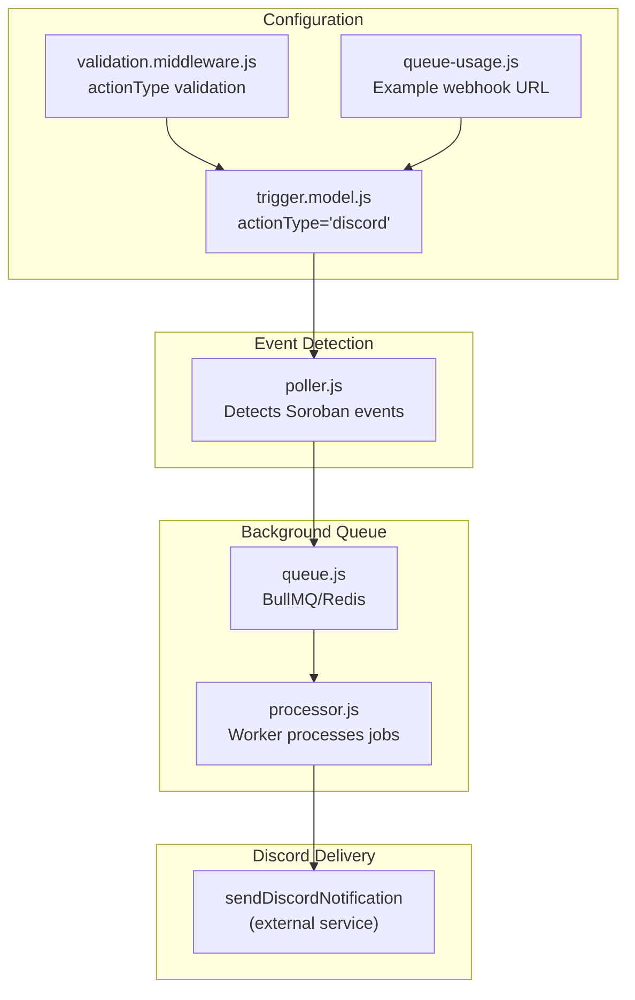
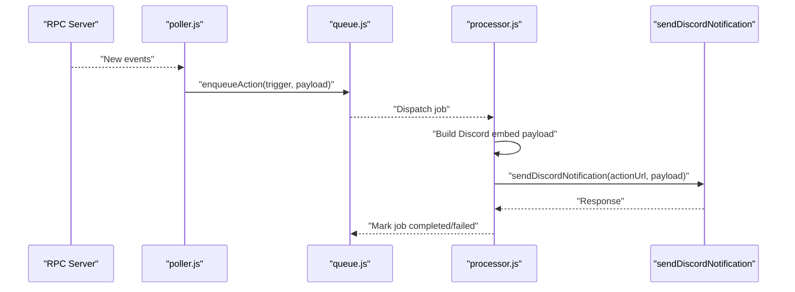
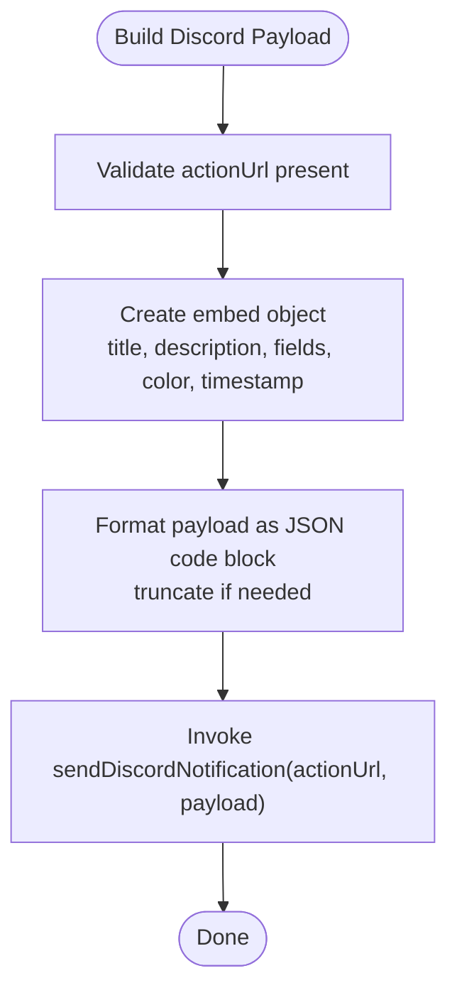
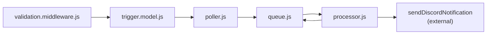

# Discord Integration

<cite>
**Referenced Files in This Document**
- [poller.js](file://backend/src/worker/poller.js)
- [processor.js](file://backend/src/worker/processor.js)
- [queue.js](file://backend/src/worker/queue.js)
- [trigger.model.js](file://backend/src/models/trigger.model.js)
- [validation.middleware.js](file://backend/src/middleware/validation.middleware.js)
- [queue-usage.js](file://backend/examples/queue-usage.js)
- [QUEUE_SETUP.md](file://backend/QUEUE_SETUP.md)
- [MIGRATION_GUIDE.md](file://backend/MIGRATION_GUIDE.md)
</cite>

## Table of Contents
1. [Introduction](#introduction)
2. [Project Structure](#project-structure)
3. [Core Components](#core-components)
4. [Architecture Overview](#architecture-overview)
5. [Detailed Component Analysis](#detailed-component-analysis)
6. [Dependency Analysis](#dependency-analysis)
7. [Performance Considerations](#performance-considerations)
8. [Troubleshooting Guide](#troubleshooting-guide)
9. [Conclusion](#conclusion)
10. [Appendices](#appendices)

## Introduction
This document explains how Discord notifications are integrated into the EventHorizon system. It covers webhook URL setup, embed message formatting, payload construction, error handling, rate limiting behavior, and operational guidance. The integration leverages a background queue (BullMQ/Redis) to reliably deliver Discord embeds when Soroban contract events are detected.

## Project Structure
The Discord integration spans several backend modules:
- Worker poller: detects events and enqueues actions
- Background queue: persists and processes actions asynchronously
- Worker processor: executes actions (including Discord)
- Trigger model: defines action configuration (including Discord)
- Validation middleware: ensures correct trigger creation
- Examples: demonstrate webhook URL usage and queue operations

**Diagram sources**
- [poller.js:1-335](file://backend/src/worker/poller.js#L1-L335)
- [processor.js:1-174](file://backend/src/worker/processor.js#L1-L174)
- [queue.js:1-164](file://backend/src/worker/queue.js#L1-L164)
- [trigger.model.js:1-80](file://backend/src/models/trigger.model.js#L1-L80)
- [validation.middleware.js:1-49](file://backend/src/middleware/validation.middleware.js#L1-L49)
- [queue-usage.js:1-223](file://backend/examples/queue-usage.js#L1-L223)

**Section sources**
- [poller.js:1-335](file://backend/src/worker/poller.js#L1-L335)
- [processor.js:1-174](file://backend/src/worker/processor.js#L1-L174)
- [queue.js:1-164](file://backend/src/worker/queue.js#L1-L164)
- [trigger.model.js:1-80](file://backend/src/models/trigger.model.js#L1-L80)
- [validation.middleware.js:1-49](file://backend/src/middleware/validation.middleware.js#L1-L49)
- [queue-usage.js:1-223](file://backend/examples/queue-usage.js#L1-L223)

## Core Components
- Trigger model supports actionType 'discord' and requires actionUrl. It also tracks execution statistics.
- Validation middleware enforces allowed action types and validates actionUrl as a URI.
- Poller constructs a minimal Discord embed payload and invokes the Discord delivery function.
- Processor builds a similar embed payload and sends it to Discord via the same function.
- Queue manages job lifecycle, retries, and observability.

Key implementation references:
- Trigger definition and actionType enum: [trigger.model.js:13-17](file://backend/src/models/trigger.model.js#L13-L17)
- Validation schema for actionType and actionUrl: [validation.middleware.js:7-8](file://backend/src/middleware/validation.middleware.js#L7-L8)
- Poller Discord payload construction and dispatch: [poller.js:93-109](file://backend/src/worker/poller.js#L93-L109)
- Processor Discord payload construction and dispatch: [processor.js:45-66](file://backend/src/worker/processor.js#L45-L66)
- Queue configuration and job enqueue: [queue.js:91-121](file://backend/src/worker/queue.js#L91-L121)

**Section sources**
- [trigger.model.js:13-17](file://backend/src/models/trigger.model.js#L13-L17)
- [validation.middleware.js:7-8](file://backend/src/middleware/validation.middleware.js#L7-L8)
- [poller.js:93-109](file://backend/src/worker/poller.js#L93-L109)
- [processor.js:45-66](file://backend/src/worker/processor.js#L45-L66)
- [queue.js:91-121](file://backend/src/worker/queue.js#L91-L121)

## Architecture Overview
The system detects Soroban events, enqueues a job, and asynchronously sends a Discord embed. The queue ensures resilience against transient failures and external service outages.

**Diagram sources**
- [poller.js:177-309](file://backend/src/worker/poller.js#L177-L309)
- [queue.js:91-121](file://backend/src/worker/queue.js#L91-L121)
- [processor.js:25-97](file://backend/src/worker/processor.js#L25-L97)

**Section sources**
- [poller.js:177-309](file://backend/src/worker/poller.js#L177-L309)
- [queue.js:91-121](file://backend/src/worker/queue.js#L91-L121)
- [processor.js:25-97](file://backend/src/worker/processor.js#L25-L97)

## Detailed Component Analysis

### Discord Embed Payload Construction
Both the poller and processor construct a minimal embed payload containing:
- Title: derived from the event name
- Description: derived from the contract identifier
- Fields: a single field named "Payload" with a JSON code block
- Color: a consistent brand color
- Timestamp: ISO string for the current time

**Diagram sources**
- [poller.js:97-109](file://backend/src/worker/poller.js#L97-L109)
- [processor.js:50-65](file://backend/src/worker/processor.js#L50-L65)

**Section sources**
- [poller.js:97-109](file://backend/src/worker/poller.js#L97-L109)
- [processor.js:50-65](file://backend/src/worker/processor.js#L50-L65)

### Trigger Configuration for Discord
- actionType must be 'discord'
- actionUrl must be a valid URI and will be used as the Discord webhook URL
- The trigger model tracks execution metrics and health status

References:
- Enum enforcement: [trigger.model.js:13-17](file://backend/src/models/trigger.model.js#L13-L17)
- Validation schema: [validation.middleware.js:7-8](file://backend/src/middleware/validation.middleware.js#L7-L8)
- Example webhook URL usage: [queue-usage.js:10-17](file://backend/examples/queue-usage.js#L10-L17)

**Section sources**
- [trigger.model.js:13-17](file://backend/src/models/trigger.model.js#L13-L17)
- [validation.middleware.js:7-8](file://backend/src/middleware/validation.middleware.js#L7-L8)
- [queue-usage.js:10-17](file://backend/examples/queue-usage.js#L10-L17)

### Background Queue and Worker
- Jobs are enqueued with optional priority and deduplication identifiers
- The worker runs concurrently and applies exponential backoff on failures
- Queue retention policies keep completed and failed jobs for diagnostics

References:
- Enqueue action: [queue.js:91-121](file://backend/src/worker/queue.js#L91-L121)
- Worker concurrency and limiter: [processor.js:128-136](file://backend/src/worker/processor.js#L128-L136)
- Queue defaults and retention: [queue.js:23-36](file://backend/src/worker/queue.js#L23-L36)

**Section sources**
- [queue.js:91-121](file://backend/src/worker/queue.js#L91-L121)
- [processor.js:128-136](file://backend/src/worker/processor.js#L128-L136)
- [queue.js:23-36](file://backend/src/worker/queue.js#L23-L36)

### Error Handling and Resilience
- Poller and processor validate presence of actionUrl and throw descriptive errors if missing
- The queue retries failed jobs with exponential backoff and configurable attempts
- The worker emits logs on completion and failure for observability

References:
- Missing actionUrl checks: [poller.js:94-96](file://backend/src/worker/poller.js#L94-L96), [processor.js:46-48](file://backend/src/worker/processor.js#L46-L48)
- Queue retry/backoff: [queue.js:24-28](file://backend/src/worker/queue.js#L24-L28)
- Worker error logging: [processor.js:115-126](file://backend/src/worker/processor.js#L115-L126)

**Section sources**
- [poller.js:94-96](file://backend/src/worker/poller.js#L94-L96)
- [processor.js:46-48](file://backend/src/worker/processor.js#L46-L48)
- [queue.js:24-28](file://backend/src/worker/queue.js#L24-L28)
- [processor.js:115-126](file://backend/src/worker/processor.js#L115-L126)

## Dependency Analysis
The Discord integration depends on:
- Trigger model for configuration
- Validation middleware for input correctness
- Queue and worker for asynchronous processing
- External Discord webhook endpoint for delivery

**Diagram sources**
- [trigger.model.js:1-80](file://backend/src/models/trigger.model.js#L1-L80)
- [validation.middleware.js:1-49](file://backend/src/middleware/validation.middleware.js#L1-L49)
- [poller.js:1-335](file://backend/src/worker/poller.js#L1-L335)
- [queue.js:1-164](file://backend/src/worker/queue.js#L1-L164)
- [processor.js:1-174](file://backend/src/worker/processor.js#L1-L174)

**Section sources**
- [trigger.model.js:1-80](file://backend/src/models/trigger.model.js#L1-L80)
- [validation.middleware.js:1-49](file://backend/src/middleware/validation.middleware.js#L1-L49)
- [poller.js:1-335](file://backend/src/worker/poller.js#L1-L335)
- [queue.js:1-164](file://backend/src/worker/queue.js#L1-L164)
- [processor.js:1-174](file://backend/src/worker/processor.js#L1-L174)

## Performance Considerations
- Embed payload size: The payload includes a JSON code block of the event payload. The processor truncates the serialized payload to a fixed length before embedding to avoid oversized requests.
- Queue concurrency: Worker concurrency can be tuned via an environment variable to balance throughput and resource usage.
- Retries: The queue applies exponential backoff to reduce pressure on external services during transient failures.

References:
- Payload truncation: [processor.js](file://backend/src/worker/processor.js#L57)
- Concurrency tuning: [processor.js:12-12](file://backend/src/worker/processor.js#L12-L12)
- Backoff configuration: [queue.js:25-27](file://backend/src/worker/queue.js#L25-L27)

**Section sources**
- [processor.js](file://backend/src/worker/processor.js#L57)
- [processor.js:12-12](file://backend/src/worker/processor.js#L12-L12)
- [queue.js:25-27](file://backend/src/worker/queue.js#L25-L27)

## Troubleshooting Guide
Common issues and resolutions:
- Missing actionUrl for Discord: The system throws a descriptive error. Ensure the trigger’s actionUrl is set to a valid Discord webhook URL.
- Queue not processing jobs: Verify Redis connectivity and worker logs. Confirm Redis is running and accessible.
- High failed job counts: Inspect failed jobs and their reasons. Validate the Discord webhook URL and external service availability.
- Monitoring queue state: Use queue statistics and optionally integrate a web UI for queue monitoring.

References:
- Missing actionUrl error: [poller.js:94-96](file://backend/src/worker/poller.js#L94-L96), [processor.js:46-48](file://backend/src/worker/processor.js#L46-L48)
- Redis troubleshooting: [MIGRATION_GUIDE.md:180-233](file://backend/MIGRATION_GUIDE.md#L180-L233)
- Queue monitoring: [QUEUE_SETUP.md:165-202](file://backend/QUEUE_SETUP.md#L165-L202)

**Section sources**
- [poller.js:94-96](file://backend/src/worker/poller.js#L94-L96)
- [processor.js:46-48](file://backend/src/worker/processor.js#L46-L48)
- [MIGRATION_GUIDE.md:180-233](file://backend/MIGRATION_GUIDE.md#L180-L233)
- [QUEUE_SETUP.md:165-202](file://backend/QUEUE_SETUP.md#L165-L202)

## Conclusion
The Discord integration in EventHorizon is designed for reliability and simplicity. It constructs a concise embed payload, enqueues jobs via BullMQ/Redis, and handles failures gracefully with retries and logging. By validating trigger configuration and monitoring queue health, teams can maintain robust notifications for Soroban contract events.

## Appendices

### Practical Examples
- Example trigger configuration with a Discord webhook URL: [queue-usage.js:10-17](file://backend/examples/queue-usage.js#L10-L17)
- Enqueue a Discord notification: [queue-usage.js:27-34](file://backend/examples/queue-usage.js#L27-L34)

**Section sources**
- [queue-usage.js:10-17](file://backend/examples/queue-usage.js#L10-L17)
- [queue-usage.js:27-34](file://backend/examples/queue-usage.js#L27-L34)