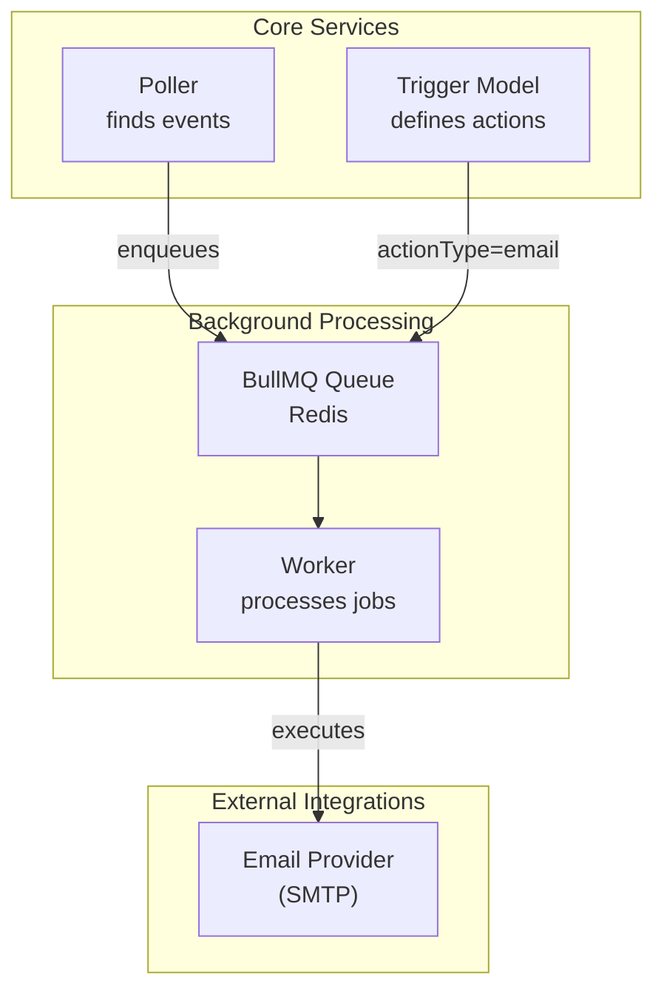
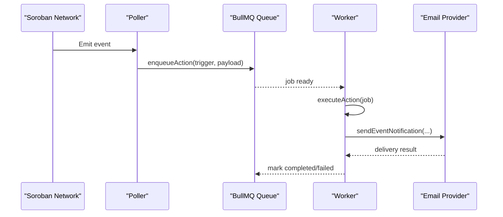
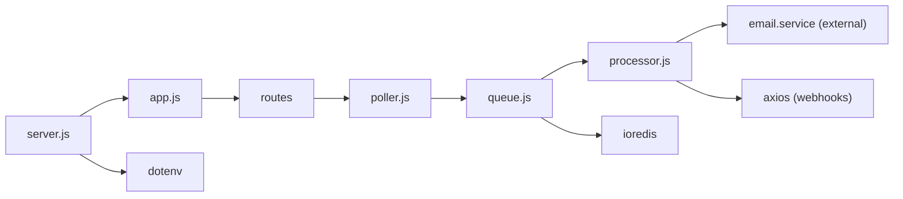

# Email Notifications

<cite>
**Referenced Files in This Document**
- [package.json](file://backend/package.json)
- [server.js](file://backend/src/server.js)
- [app.js](file://backend/src/app.js)
- [queue.js](file://backend/src/worker/queue.js)
- [processor.js](file://backend/src/worker/processor.js)
- [poller.js](file://backend/src/worker/poller.js)
- [trigger.model.js](file://backend/src/models/trigger.model.js)
- [queue-usage.js](file://backend/examples/queue-usage.js)
- [CHANGELOG_QUEUE.md](file://backend/CHANGELOG_QUEUE.md)
- [QUEUE_SETUP.md](file://backend/QUEUE_SETUP.md)
- [MIGRATION_GUIDE.md](file://backend/MIGRATION_GUIDE.md)
- [QUICKSTART_QUEUE.md](file://backend/QUICKSTART_QUEUE.md)
</cite>

## Table of Contents
1. [Introduction](#introduction)
2. [Project Structure](#project-structure)
3. [Core Components](#core-components)
4. [Architecture Overview](#architecture-overview)
5. [Detailed Component Analysis](#detailed-component-analysis)
6. [Dependency Analysis](#dependency-analysis)
7. [Performance Considerations](#performance-considerations)
8. [Troubleshooting Guide](#troubleshooting-guide)
9. [Conclusion](#conclusion)
10. [Appendices](#appendices)

## Introduction
This document explains how email notifications are integrated into the EventHorizon system. It covers the background job pipeline that queues and processes email actions, the trigger model that defines email actions, and operational guidance for configuring and troubleshooting email delivery. The system supports background processing via BullMQ and Redis, and integrates with external services for sending emails.

## Project Structure
The email notification feature is implemented using a background job system:
- Triggers define actions (including email).
- Events are polled from the Soroban network.
- Matching events enqueue jobs to a BullMQ queue.
- A worker processes jobs and executes the appropriate action (email, Discord, Telegram, webhook).

**Diagram sources**
- [queue.js:1-164](file://backend/src/worker/queue.js#L1-L164)
- [processor.js:1-174](file://backend/src/worker/processor.js#L1-L174)
- [poller.js:1-335](file://backend/src/worker/poller.js#L1-L335)
- [trigger.model.js:1-80](file://backend/src/models/trigger.model.js#L1-L80)

**Section sources**
- [queue.js:1-164](file://backend/src/worker/queue.js#L1-L164)
- [processor.js:1-174](file://backend/src/worker/processor.js#L1-L174)
- [poller.js:1-335](file://backend/src/worker/poller.js#L1-L335)
- [trigger.model.js:1-80](file://backend/src/models/trigger.model.js#L1-L80)

## Core Components
- Trigger model: Defines actionType and actionUrl, including email actions.
- Queue system: BullMQ with Redis for reliable job processing.
- Worker: Processes jobs and dispatches to action handlers.
- Poller: Detects events and enqueues jobs for matching triggers.
- Example usage: Demonstrates enqueueing email notifications.

Key implementation references:
- Trigger model with actionType enum including email.
- Queue configuration with retry/backoff and retention policies.
- Worker switch-case routing for email actions.
- Poller enqueueing actions with retry logic.
- Example enqueueing an email action.

**Section sources**
- [trigger.model.js:13-21](file://backend/src/models/trigger.model.js#L13-L21)
- [queue.js:19-41](file://backend/src/worker/queue.js#L19-L41)
- [processor.js:25-96](file://backend/src/worker/processor.js#L25-L96)
- [poller.js:152-173](file://backend/src/worker/poller.js#L152-L173)
- [queue-usage.js:36-59](file://backend/examples/queue-usage.js#L36-L59)

## Architecture Overview
The email notification flow is event-driven and asynchronous:
1. An event occurs on-chain.
2. The poller detects the event and checks active triggers.
3. Matching triggers enqueue jobs to the BullMQ queue.
4. The worker picks up the job and executes the email action handler.
5. The handler sends the email via an external provider configured for SMTP.

**Diagram sources**
- [poller.js:152-173](file://backend/src/worker/poller.js#L152-L173)
- [queue.js:91-121](file://backend/src/worker/queue.js#L91-L121)
- [processor.js:25-96](file://backend/src/worker/processor.js#L25-L96)

## Detailed Component Analysis

### Trigger Model and Email Actions
- actionType supports email alongside other integrations.
- actionUrl holds the recipient email address for email actions.
- Retry configuration controls transient failure handling.

Implementation highlights:
- Enum includes email.
- actionUrl is required for email triggers.
- Retry settings per trigger.

**Section sources**
- [trigger.model.js:13-21](file://backend/src/models/trigger.model.js#L13-L21)
- [trigger.model.js:43-52](file://backend/src/models/trigger.model.js#L43-L52)

### Background Queue and Worker
- Queue uses BullMQ with Redis, configured with attempts, backoff, and retention.
- Worker consumes jobs, logs outcomes, and routes to action handlers.
- Concurrency and rate limiting are configurable.

Operational notes:
- Default attempts and exponential backoff reduce thundering herds.
- Retention policies keep completed/failed jobs for diagnostics.
- Worker emits logs for completed/failed/error states.

**Section sources**
- [queue.js:19-41](file://backend/src/worker/queue.js#L19-L41)
- [queue.js:126-143](file://backend/src/worker/queue.js#L126-L143)
- [processor.js:102-136](file://backend/src/worker/processor.js#L102-L136)
- [processor.js:138-167](file://backend/src/worker/processor.js#L138-L167)

### Poller and Job Enqueueing
- Poller fetches events from the Soroban RPC and enqueues matching triggers.
- Supports direct execution fallback if Redis/BullMQ is unavailable.
- Includes per-trigger retry logic with delays.

**Section sources**
- [poller.js:59-76](file://backend/src/worker/poller.js#L59-L76)
- [poller.js:152-173](file://backend/src/worker/poller.js#L152-L173)
- [poller.js:312-329](file://backend/src/worker/poller.js#L312-L329)

### Example Usage: Enqueueing Email Notifications
- Demonstrates constructing a trigger with actionType email and a recipient email address.
- Enqueues the job and logs completion.

**Section sources**
- [queue-usage.js:36-59](file://backend/examples/queue-usage.js#L36-L59)

### SMTP Configuration and Email Provider Integration
- The worker routes email jobs to a dedicated email service handler.
- The repository does not include an SMTP client or email provider-specific code; email delivery is delegated to the email service handler module.
- Environment variables for external services are referenced in the migration guide and quickstart documents.

Operational guidance:
- Configure SMTP credentials and provider settings in the email service handler module.
- Ensure Redis connectivity for background processing.
- Use environment variables for SMTP credentials and provider endpoints.

**Section sources**
- [processor.js:4-6](file://backend/src/worker/processor.js#L4-L6)
- [processor.js:38-43](file://backend/src/worker/processor.js#L38-L43)
- [MIGRATION_GUIDE.md:226-226](file://backend/MIGRATION_GUIDE.md#L226-L226)
- [QUICKSTART_QUEUE.md:226-231](file://backend/QUICKSTART_QUEUE.md#L226-L231)

### Authentication and TLS
- The repository does not implement SMTP authentication or TLS configuration directly.
- These are typically configured within the email service handler module and environment variables.

**Section sources**
- [processor.js:4-6](file://backend/src/worker/processor.js#L4-L6)

### Email Content Formatting and Attachments
- The repository does not include HTML templates, CSS styling, or attachment handling for emails.
- Email content formatting and attachments are implemented in the email service handler module.

**Section sources**
- [processor.js:4-6](file://backend/src/worker/processor.js#L4-L6)

### Bulk Email Handling
- Jobs are enqueued per trigger match; bulk sending is achieved by creating multiple triggers or by batching within the email service handler.
- Backoff and retry policies apply per job.

**Section sources**
- [poller.js:152-173](file://backend/src/worker/poller.js#L152-L173)
- [queue.js:23-36](file://backend/src/worker/queue.js#L23-L36)

## Dependency Analysis
External dependencies relevant to email notifications:
- BullMQ and ioredis for background job processing.
- Axios for outbound HTTP calls (webhooks).
- Dotenv for environment variable loading.

**Diagram sources**
- [server.js:1-88](file://backend/src/server.js#L1-L88)
- [app.js:1-55](file://backend/src/app.js#L1-L55)
- [poller.js:1-335](file://backend/src/worker/poller.js#L1-L335)
- [queue.js:1-164](file://backend/src/worker/queue.js#L1-L164)
- [processor.js:1-174](file://backend/src/worker/processor.js#L1-L174)
- [package.json:10-26](file://backend/package.json#L10-L26)

**Section sources**
- [package.json:10-26](file://backend/package.json#L10-L26)
- [server.js:1-88](file://backend/src/server.js#L1-L88)
- [app.js:1-55](file://backend/src/app.js#L1-L55)

## Performance Considerations
- Queue backoff and retry reduce load during transient failures.
- Retention policies keep completed/failed jobs for diagnostics but can consume storage.
- Worker concurrency and rate limiter balance throughput and provider limits.
- Polling intervals and per-trigger retry intervals influence latency and resource usage.

Recommendations:
- Tune worker concurrency and rate limiter based on provider capacity.
- Adjust retry attempts and backoff for provider-specific limits.
- Monitor queue statistics to detect bottlenecks.

**Section sources**
- [queue.js:23-36](file://backend/src/worker/queue.js#L23-L36)
- [queue.js:148-156](file://backend/src/worker/queue.js#L148-L156)
- [processor.js:128-135](file://backend/src/worker/processor.js#L128-L135)
- [poller.js:152-173](file://backend/src/worker/poller.js#L152-L173)

## Troubleshooting Guide
Common issues and resolutions:
- Queue system disabled: If Redis is unavailable, the system falls back to direct execution. Check logs for queue initialization warnings and ensure Redis is reachable.
- SMTP credentials incorrect: Review migration guide for credential-related errors and verify environment variables.
- External service credentials missing: The quickstart guide indicates verifying external service credentials (Discord webhook, SMTP, etc.).
- Job failures: Inspect worker logs for error messages and attempts remaining. Use queue statistics and job listeners to diagnose.

Operational steps:
- Verify Redis connectivity and BullMQ queue availability.
- Confirm SMTP credentials and provider configuration.
- Use queue monitoring and job listeners to track progress and failures.

**Section sources**
- [server.js:46-55](file://backend/src/server.js#L46-L55)
- [poller.js:64-68](file://backend/src/worker/poller.js#L64-L68)
- [MIGRATION_GUIDE.md:226-226](file://backend/MIGRATION_GUIDE.md#L226-L226)
- [QUICKSTART_QUEUE.md:218-218](file://backend/QUICKSTART_QUEUE.md#L218-L218)

## Conclusion
Email notifications in EventHorizon are integrated through a robust background job pipeline using BullMQ and Redis. Triggers define email actions, events enqueue jobs, and workers execute email delivery via an external email service handler. Operational readiness depends on proper SMTP configuration, environment variable management, and queue/worker tuning for reliability and performance.

## Appendices

### Practical Examples
- Enqueue an email notification using the example script.
- Observe queue statistics and job details for diagnostics.

**Section sources**
- [queue-usage.js:36-59](file://backend/examples/queue-usage.js#L36-L59)
- [queue-usage.js:87-102](file://backend/examples/queue-usage.js#L87-L102)
- [queue-usage.js:104-140](file://backend/examples/queue-usage.js#L104-L140)

### Deliverability and Spam Considerations
- Use reputable email providers and ensure domain alignment.
- Configure SPF/DKIM/DMARC records.
- Avoid spammy subject lines and content.
- Respect provider rate limits and implement backoff.

[No sources needed since this section provides general guidance]