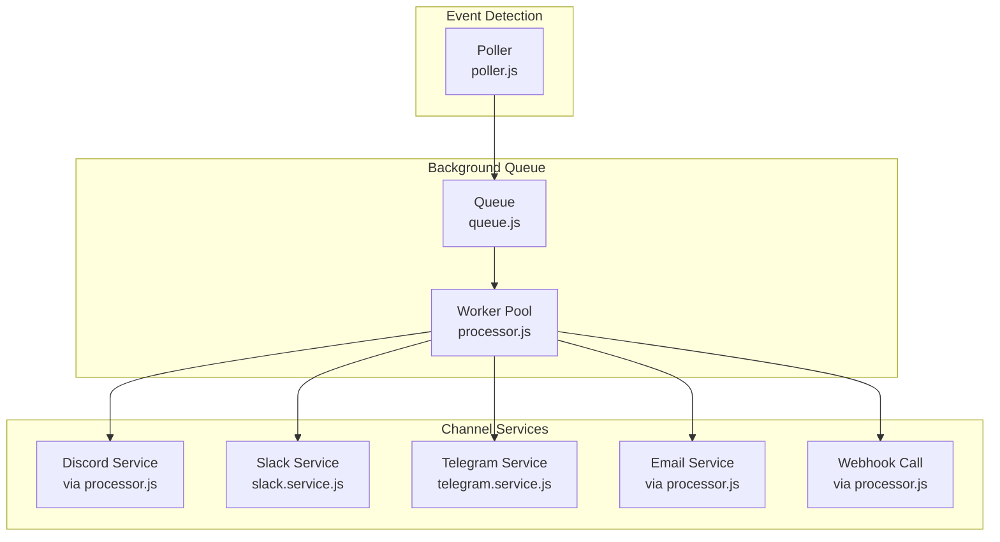
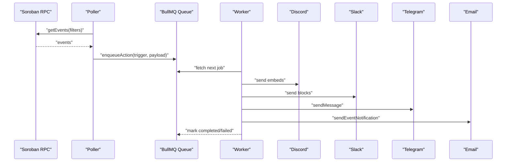
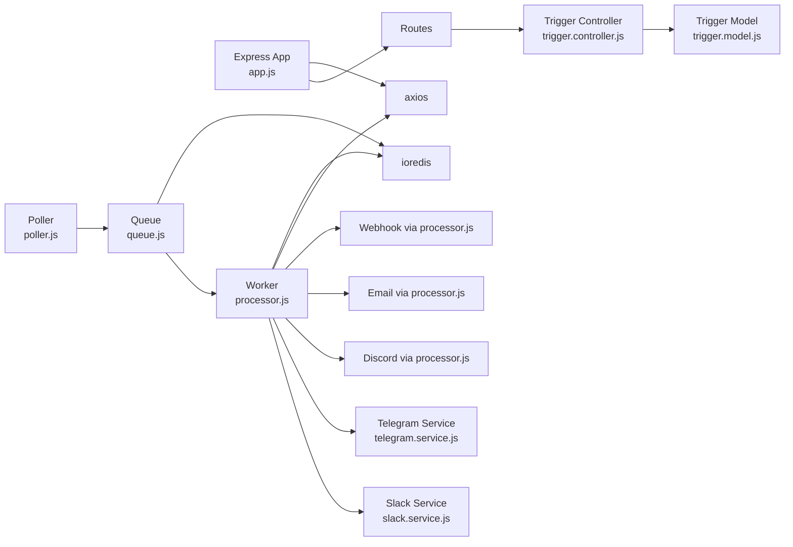

# Notification Services

<cite>
**Referenced Files in This Document**
- [slack.service.js](file://backend/src/services/slack.service.js)
- [telegram.service.js](file://backend/src/services/telegram.service.js)
- [poller.js](file://backend/src/worker/poller.js)
- [processor.js](file://backend/src/worker/processor.js)
- [queue.js](file://backend/src/worker/queue.js)
- [trigger.model.js](file://backend/src/models/trigger.model.js)
- [trigger.controller.js](file://backend/src/controllers/trigger.controller.js)
- [app.js](file://backend/src/app.js)
- [package.json](file://backend/package.json)
- [QUICKSTART_QUEUE.md](file://backend/QUICKSTART_QUEUE.md)
- [QUEUE_SETUP.md](file://backend/QUEUE_SETUP.md)
- [MIGRATION_GUIDE.md](file://backend/MIGRATION_GUIDE.md)
- [slack.test.js](file://backend/__tests__/slack.test.js)
- [telegram.test.js](file://backend/__tests__/telegram.test.js)
</cite>

## Table of Contents
1. [Introduction](#introduction)
2. [Project Structure](#project-structure)
3. [Core Components](#core-components)
4. [Architecture Overview](#architecture-overview)
5. [Detailed Component Analysis](#detailed-component-analysis)
6. [Dependency Analysis](#dependency-analysis)
7. [Performance Considerations](#performance-considerations)
8. [Troubleshooting Guide](#troubleshooting-guide)
9. [Conclusion](#conclusion)
10. [Appendices](#appendices)

## Introduction
This document explains how EventHorizon integrates with multiple notification channels: Discord, Slack, Telegram, Webhooks, and Email. It covers the webhook delivery mechanisms, Discord embed formatting, Slack Block Kit integration, Telegram message formatting, and email notification setup. It also documents the service architecture, configuration options, customization capabilities, rate limiting, retry policies, monitoring, and best practices for reliable delivery.

## Project Structure
The notification pipeline is implemented as follows:
- Event detection and queuing: Poller detects Soroban contract events and enqueues actions.
- Background processing: A BullMQ worker pool executes actions with retries and rate limiting.
- Channel-specific services: Dedicated services format and deliver notifications to Discord, Slack, Telegram, and via email/webhooks.

**Diagram sources**
- [poller.js:177-335](file://backend/src/worker/poller.js#L177-L335)
- [queue.js:19-83](file://backend/src/worker/queue.js#L19-L83)
- [processor.js:102-174](file://backend/src/worker/processor.js#L102-L174)
- [slack.service.js:6-165](file://backend/src/services/slack.service.js#L6-L165)
- [telegram.service.js:6-74](file://backend/src/services/telegram.service.js#L6-L74)

**Section sources**
- [poller.js:177-335](file://backend/src/worker/poller.js#L177-L335)
- [queue.js:19-83](file://backend/src/worker/queue.js#L19-L83)
- [processor.js:102-174](file://backend/src/worker/processor.js#L102-L174)

## Core Components
- Trigger model defines supported action types and retry configuration.
- Poller enqueues actions for background processing and handles retries.
- Queue persists jobs in Redis with retention and cleanup policies.
- Worker executes actions with concurrency and rate limiting.
- Channel services encapsulate formatting and delivery specifics.

Key configuration points:
- Environment variables for Redis connectivity and worker concurrency.
- Trigger-level retry configuration for per-trigger resilience.
- Channel-specific credentials and identifiers (e.g., Discord webhook URL, Telegram bot token/chat ID).

**Section sources**
- [trigger.model.js:13-57](file://backend/src/models/trigger.model.js#L13-L57)
- [poller.js:152-173](file://backend/src/worker/poller.js#L152-L173)
- [queue.js:19-83](file://backend/src/worker/queue.js#L19-L83)
- [processor.js:128-136](file://backend/src/worker/processor.js#L128-L136)

## Architecture Overview
The system separates concerns across detection, queuing, and execution:
- Poller queries the Soroban RPC, matches triggers, and enqueues actions.
- Queue stores jobs in Redis with automatic retries and retention.
- Worker processes jobs concurrently with a built-in rate limiter.

**Diagram sources**
- [poller.js:177-335](file://backend/src/worker/poller.js#L177-L335)
- [queue.js:91-121](file://backend/src/worker/queue.js#L91-L121)
- [processor.js:25-97](file://backend/src/worker/processor.js#L25-L97)

## Detailed Component Analysis

### Discord Embed Formatting
- Processor builds a compact embed payload with title, description, and a JSON-formatted payload field.
- Timestamp is included for context.
- Delivery uses the external Discord service invoked by the worker.

Customization:
- Adjust color, fields, and timestamp in the processor’s payload builder.
- Ensure the actionUrl points to a valid Discord webhook.

Rate limiting and error handling:
- External service rate limits are handled by the underlying HTTP client; monitor external service responses.

**Section sources**
- [processor.js:45-66](file://backend/src/worker/processor.js#L45-L66)

### Slack Block Kit Integration
- Service builds a rich Blocks payload with header, severity/context, contract info, and formatted payload.
- Supports optional custom message override; otherwise, generates Blocks.
- Handles Slack-specific HTTP errors and rate limiting signals.

Formatting highlights:
- Severity emojis and header text adapt to event severity.
- Payload is rendered as a code block.
- Slack date tokens are obfuscated to avoid false positives.

**Section sources**
- [slack.service.js:13-88](file://backend/src/services/slack.service.js#L13-L88)
- [slack.service.js:97-134](file://backend/src/services/slack.service.js#L97-L134)
- [slack.service.js:142-159](file://backend/src/services/slack.service.js#L142-L159)

### Telegram Message Formatting
- Service sends MarkdownV2-formatted messages via the Telegram Bot API.
- Provides character escaping for MarkdownV2 special characters.
- Validates required parameters and handles common API errors.

Customization:
- Modify message template in the worker for Telegram action type.
- Escape additional characters if your payloads include more special symbols.

**Section sources**
- [telegram.service.js:15-57](file://backend/src/services/telegram.service.js#L15-L57)
- [telegram.service.js:66-70](file://backend/src/services/telegram.service.js#L66-L70)
- [processor.js:68-80](file://backend/src/worker/processor.js#L68-L80)

### Webhook Delivery Mechanisms
- Processor posts a simple JSON payload containing contractId, eventName, and payload to the configured actionUrl.
- Used as a generic integration point for custom endpoints.

Customization:
- Define actionUrl per trigger to route to your own webhook endpoint.
- Ensure the endpoint accepts JSON and responds appropriately.

**Section sources**
- [processor.js:82-92](file://backend/src/worker/processor.js#L82-L92)

### Email Notification Setup
- Processor invokes an email service to send notifications.
- The email service is imported but not present in the provided backend/src/services directory; ensure it is implemented and configured.

Customization:
- Provide email credentials and templates via the email service.
- Integrate with your SMTP provider or email API.

**Section sources**
- [processor.js:38-43](file://backend/src/worker/processor.js#L38-L43)

### Trigger Model and Retry Configuration
- Supports action types: webhook, discord, email, telegram.
- Includes retryConfig with maxRetries and retryIntervalMs.
- Tracks execution statistics and health metrics.

**Section sources**
- [trigger.model.js:13-57](file://backend/src/models/trigger.model.js#L13-L57)
- [trigger.model.js:64-79](file://backend/src/models/trigger.model.js#L64-L79)

### Poller and Retry Logic
- Poller iterates active triggers, fetches events, and enqueues actions.
- executeWithRetry applies trigger-level retries with configurable intervals.
- Maintains per-trigger execution counters and last success timestamp.

**Section sources**
- [poller.js:177-335](file://backend/src/worker/poller.js#L177-L335)
- [poller.js:152-173](file://backend/src/worker/poller.js#L152-L173)

### Queue and Worker
- Queue persists jobs in Redis with default job options (attempts, backoff, retention).
- Worker runs with configurable concurrency and a built-in rate limiter (10 per second).
- Emits logs for completed, failed, and error events.

**Section sources**
- [queue.js:19-83](file://backend/src/worker/queue.js#L19-L83)
- [processor.js:128-136](file://backend/src/worker/processor.js#L128-L136)
- [processor.js:138-160](file://backend/src/worker/processor.js#L138-L160)

## Dependency Analysis
External dependencies relevant to notifications:
- Axios for HTTP calls to external services.
- BullMQ and ioredis for background job processing.
- Express for API endpoints and rate limiting middleware.

**Diagram sources**
- [app.js:16-55](file://backend/src/app.js#L16-L55)
- [trigger.controller.js:1-72](file://backend/src/controllers/trigger.controller.js#L1-L72)
- [trigger.model.js:1-80](file://backend/src/models/trigger.model.js#L1-L80)
- [poller.js:59-147](file://backend/src/worker/poller.js#L59-L147)
- [queue.js:19-83](file://backend/src/worker/queue.js#L19-L83)
- [processor.js:102-174](file://backend/src/worker/processor.js#L102-L174)
- [slack.service.js:1-165](file://backend/src/services/slack.service.js#L1-L165)
- [telegram.service.js:1-74](file://backend/src/services/telegram.service.js#L1-L74)
- [package.json:10-26](file://backend/package.json#L10-L26)

**Section sources**
- [package.json:10-26](file://backend/package.json#L10-L26)

## Performance Considerations
- Concurrency: Tune WORKER_CONCURRENCY to balance throughput and external service quotas.
- Rate limiting: Worker includes a built-in limiter (10 per second); adjust if needed.
- Retries: Default 3 attempts with exponential backoff; customize per trigger via retryConfig.
- Queue retention: Completed jobs kept for 24 hours, failed for 7 days; clean periodically.
- Monitoring: Use queue stats endpoints and Bull Board for visibility.

[No sources needed since this section provides general guidance]

## Troubleshooting Guide
Common issues and resolutions:
- Redis not running: Start Redis and verify with redis-cli ping.
- Worker not processing jobs: Check worker logs and ensure Redis connectivity.
- High failed job counts: Inspect external service credentials and endpoints.
- Rate limiting: External services may throttle; implement backoff and consider lowering concurrency.

Operational commands and endpoints:
- Check queue stats: GET /api/queue/stats
- List failed jobs: GET /api/queue/jobs?status=failed&limit=50
- Retry a failed job: POST /api/queue/jobs/{jobId}/retry
- Clean old jobs: POST /api/queue/clean

**Section sources**
- [MIGRATION_GUIDE.md:180-254](file://backend/MIGRATION_GUIDE.md#L180-L254)
- [QUICKSTART_QUEUE.md:144-208](file://backend/QUICKSTART_QUEUE.md#L144-L208)
- [QUEUE_SETUP.md:99-139](file://backend/QUEUE_SETUP.md#L99-L139)

## Conclusion
EventHorizon provides a robust, extensible notification framework. By leveraging BullMQ for reliable background processing, the system decouples event detection from external service calls, enabling retries, rate limiting, and observability. Channel-specific services encapsulate formatting and delivery, allowing straightforward customization and integration with Discord, Slack, Telegram, Webhooks, and Email.

[No sources needed since this section summarizes without analyzing specific files]

## Appendices

### Configuration Options
Environment variables:
- REDIS_HOST, REDIS_PORT, REDIS_PASSWORD: Redis connection.
- WORKER_CONCURRENCY: Worker pool size.
- SOROBAN_RPC_URL, RPC_TIMEOUT_MS, POLL_INTERVAL_MS: Poller behavior.
- TELEGRAM_BOT_TOKEN: Required for Telegram notifications.
- NETWORK_PASSPHRASE: Used by Slack service for network context.

Trigger-level configuration:
- actionType: One of webhook, discord, email, telegram.
- actionUrl: Discord webhook URL or generic webhook endpoint.
- retryConfig: maxRetries and retryIntervalMs.

**Section sources**
- [QUEUE_SETUP.md:66-72](file://backend/QUEUE_SETUP.md#L66-L72)
- [poller.js:5-16](file://backend/src/worker/poller.js#L5-L16)
- [telegram.service.js:15-18](file://backend/src/services/telegram.service.js#L15-L18)
- [slack.service.js:29](file://backend/src/services/slack.service.js#L29)
- [trigger.model.js:13-57](file://backend/src/models/trigger.model.js#L13-L57)

### Practical Examples
- Creating a trigger: POST /api/triggers with actionType and actionUrl.
- Testing Slack: Use the Slack service test script to validate Block Kit generation and webhook delivery.
- Testing Telegram: Use the Telegram service test script to validate MarkdownV2 escaping and message delivery.

**Section sources**
- [trigger.controller.js:6-28](file://backend/src/controllers/trigger.controller.js#L6-L28)
- [slack.test.js:1-58](file://backend/__tests__/slack.test.js#L1-L58)
- [telegram.test.js:1-41](file://backend/__tests__/telegram.test.js#L1-L41)

### Monitoring and Observability
- Queue statistics: GET /api/queue/stats.
- Job listings: GET /api/queue/jobs?status={status}&limit=N.
- Cleaning jobs: POST /api/queue/clean.
- Optional Bull Board UI for queue monitoring.

**Section sources**
- [QUEUE_SETUP.md:99-139](file://backend/QUEUE_SETUP.md#L99-L139)
- [QUICKSTART_QUEUE.md:80-142](file://backend/QUICKSTART_QUEUE.md#L80-L142)