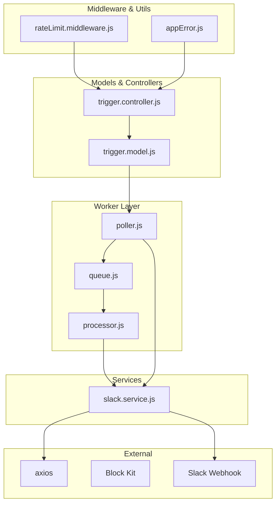
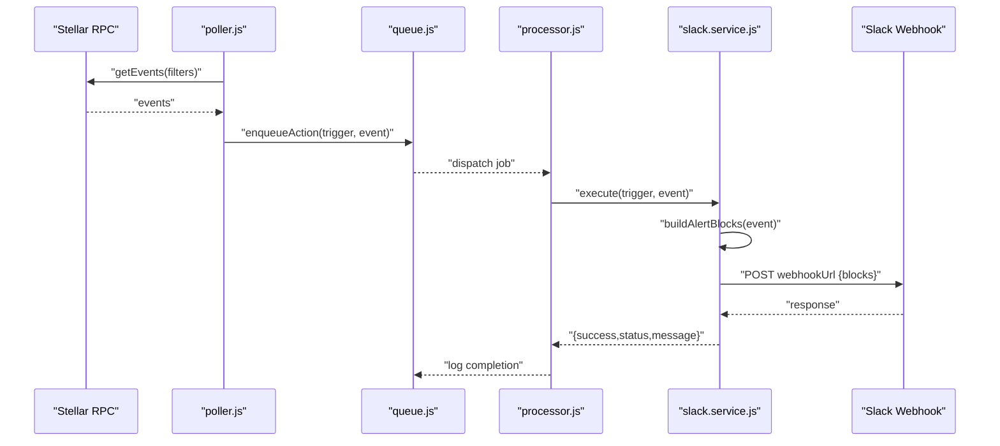
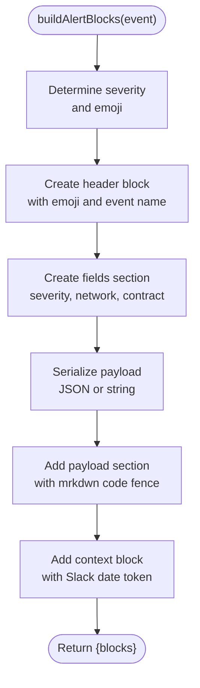
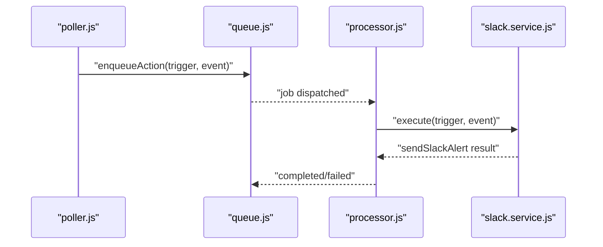
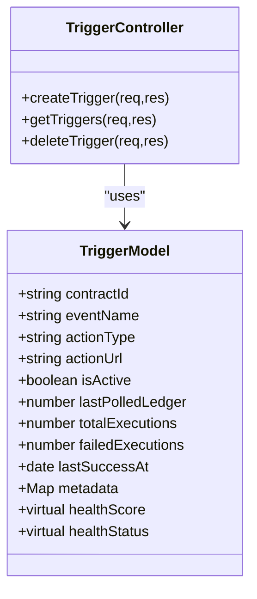
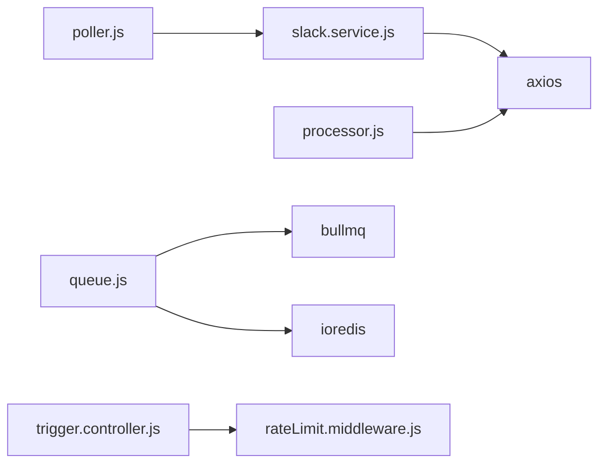

# Slack Block Kit Integration

<cite>
**Referenced Files in This Document**
- [slack.service.js](file://backend/src/services/slack.service.js)
- [slack.test.js](file://backend/__tests__/slack.test.js)
- [poller.js](file://backend/src/worker/poller.js)
- [processor.js](file://backend/src/worker/processor.js)
- [queue.js](file://backend/src/worker/queue.js)
- [trigger.model.js](file://backend/src/models/trigger.model.js)
- [trigger.controller.js](file://backend/src/controllers/trigger.controller.js)
- [rateLimit.middleware.js](file://backend/src/middleware/rateLimit.middleware.js)
- [appError.js](file://backend/src/utils/appError.js)
- [package.json](file://backend/package.json)
</cite>

## Table of Contents
1. [Introduction](#introduction)
2. [Project Structure](#project-structure)
3. [Core Components](#core-components)
4. [Architecture Overview](#architecture-overview)
5. [Detailed Component Analysis](#detailed-component-analysis)
6. [Dependency Analysis](#dependency-analysis)
7. [Performance Considerations](#performance-considerations)
8. [Troubleshooting Guide](#troubleshooting-guide)
9. [Conclusion](#conclusion)
10. [Appendices](#appendices)

## Introduction
This document explains how the backend integrates with Slack using Block Kit to deliver rich, formatted notifications for Soroban contract events. It covers the payload builder, Block Kit sections and context elements, severity-based formatting and emoji integration, timestamp handling, markdown rendering, and practical examples. It also documents error handling for Slack API responses, rate limiting behavior, permission requirements, and troubleshooting common formatting issues.

## Project Structure
The Slack integration spans several modules:
- Services: Slack payload building and sending
- Worker: Background job processing and direct execution fallback
- Queue: Job queuing via Redis/BullMQ
- Models and Controllers: Trigger configuration and lifecycle
- Middleware and Utilities: Rate limiting and error handling
- Tests: Example payload generation and optional live webhook tests

**Diagram sources**
- [poller.js:111-146](file://backend/src/worker/poller.js#L111-L146)
- [queue.js:19-83](file://backend/src/worker/queue.js#L19-L83)
- [processor.js:102-136](file://backend/src/worker/processor.js#L102-L136)
- [slack.service.js:13-87](file://backend/src/services/slack.service.js#L13-L87)
- [trigger.model.js:3-62](file://backend/src/models/trigger.model.js#L3-L62)
- [trigger.controller.js:6-71](file://backend/src/controllers/trigger.controller.js#L6-L71)
- [rateLimit.middleware.js:31-45](file://backend/src/middleware/rateLimit.middleware.js#L31-L45)
- [appError.js:1-16](file://backend/src/utils/appError.js#L1-L16)

**Section sources**
- [package.json:10-26](file://backend/package.json#L10-L26)
- [slack.service.js:13-87](file://backend/src/services/slack.service.js#L13-L87)
- [poller.js:111-146](file://backend/src/worker/poller.js#L111-L146)
- [queue.js:19-83](file://backend/src/worker/queue.js#L19-L83)
- [processor.js:102-136](file://backend/src/worker/processor.js#L102-L136)
- [trigger.model.js:3-62](file://backend/src/models/trigger.model.js#L3-L62)
- [trigger.controller.js:6-71](file://backend/src/controllers/trigger.controller.js#L6-L71)
- [rateLimit.middleware.js:31-45](file://backend/src/middleware/rateLimit.middleware.js#L31-L45)
- [appError.js:1-16](file://backend/src/utils/appError.js#L1-L16)

## Core Components
- SlackService: Builds Block Kit payloads and sends them to Slack webhooks, including severity-based formatting, emoji, header, fields, code-block rendering, and contextual timestamp.
- Worker Poller: Discovers active triggers, fetches Soroban events, and enqueues or executes actions.
- Worker Processor: Executes actions based on trigger type, including Slack alerts.
- Queue: Background job queue for actions using BullMQ and Redis.
- Trigger Model and Controller: Define and manage triggers, including action configuration and retry settings.

Key Slack payload features:
- Header section with emoji and event name
- Fields layout for severity, network, and contract
- Code block rendering for event payload
- Context element with Slack date token for timestamp

**Section sources**
- [slack.service.js:13-87](file://backend/src/services/slack.service.js#L13-L87)
- [poller.js:111-146](file://backend/src/worker/poller.js#L111-L146)
- [processor.js:102-136](file://backend/src/worker/processor.js#L102-L136)
- [queue.js:19-83](file://backend/src/worker/queue.js#L19-L83)
- [trigger.model.js:3-62](file://backend/src/models/trigger.model.js#L3-L62)
- [trigger.controller.js:6-71](file://backend/src/controllers/trigger.controller.js#L6-L71)

## Architecture Overview
The system polls for Soroban events, matches triggers, and enqueues actions. The worker processes jobs and invokes SlackService to build and send Block Kit messages.

**Diagram sources**
- [poller.js:177-302](file://backend/src/worker/poller.js#L177-L302)
- [queue.js:91-121](file://backend/src/worker/queue.js#L91-L121)
- [processor.js:102-136](file://backend/src/worker/processor.js#L102-L136)
- [slack.service.js:142-159](file://backend/src/services/slack.service.js#L142-L159)

## Detailed Component Analysis

### SlackService: Block Kit Builder and Sender
Responsibilities:
- Build a Block Kit payload from an event object
- Severity-based formatting and emoji selection
- Header section with event name and emoji
- Fields layout for severity, network, and contract
- Code block rendering for payload
- Context element with Slack date token for timestamp
- Send rich notifications via Slack Webhook
- Handle Slack API errors and rate limiting

Severity and emoji mapping:
- Info: default emoji
- Warning: warning emoji
- Error/Critical: critical emoji

Header section:
- Uses a header block with plain_text and emoji enabled

Fields layout:
- Three-column mrkdwn fields for severity, network, and contract

Code block rendering:
- Serializes payload to JSON or string and wraps in a section with mrkdwn code fence

Timestamp handling:
- Adds a context block with Slack’s date token to render human-friendly timestamps

Error handling:
- Handles 429 with retry-after, invalid payload, permission/action prohibited, channel not found, and archived channels
- Returns structured results for downstream handling

**Diagram sources**
- [slack.service.js:13-87](file://backend/src/services/slack.service.js#L13-L87)

**Section sources**
- [slack.service.js:13-87](file://backend/src/services/slack.service.js#L13-L87)
- [slack.service.js:97-134](file://backend/src/services/slack.service.js#L97-L134)
- [slack.service.js:142-159](file://backend/src/services/slack.service.js#L142-L159)

### Worker Poller and Processor: Action Execution
Execution flow:
- Poller discovers active triggers and fetches events
- Enqueues actions or falls back to direct execution
- Processor routes to SlackService for Slack actions
- Worker applies concurrency and retry limits

**Diagram sources**
- [poller.js:111-146](file://backend/src/worker/poller.js#L111-L146)
- [queue.js:91-121](file://backend/src/worker/queue.js#L91-L121)
- [processor.js:102-136](file://backend/src/worker/processor.js#L102-L136)
- [slack.service.js:142-159](file://backend/src/services/slack.service.js#L142-L159)

**Section sources**
- [poller.js:111-146](file://backend/src/worker/poller.js#L111-L146)
- [queue.js:91-121](file://backend/src/worker/queue.js#L91-L121)
- [processor.js:102-136](file://backend/src/worker/processor.js#L102-L136)
- [slack.service.js:142-159](file://backend/src/services/slack.service.js#L142-L159)

### Trigger Model and Controller: Configuration and Lifecycle
- Triggers define contractId, eventName, actionType, actionUrl, and retryConfig
- Controller handles creation, retrieval, and deletion of triggers
- Health metrics (healthScore, healthStatus) computed from execution stats

**Diagram sources**
- [trigger.model.js:3-79](file://backend/src/models/trigger.model.js#L3-L79)
- [trigger.controller.js:6-71](file://backend/src/controllers/trigger.controller.js#L6-L71)

**Section sources**
- [trigger.model.js:3-79](file://backend/src/models/trigger.model.js#L3-L79)
- [trigger.controller.js:6-71](file://backend/src/controllers/trigger.controller.js#L6-L71)

### Testing Slack Payload Generation
- Unit-style test demonstrates payload generation for a mock event
- Optional live webhook test when environment variable is present

**Section sources**
- [slack.test.js:4-31](file://backend/__tests__/slack.test.js#L4-L31)
- [slack.test.js:33-57](file://backend/__tests__/slack.test.js#L33-L57)

## Dependency Analysis
External dependencies relevant to Slack integration:
- axios: HTTP client for Slack webhook posting
- bullmq/ioredis: Background job queue for actions
- express-rate-limit: Global and auth rate limiting for API endpoints

**Diagram sources**
- [slack.service.js:1](file://backend/src/services/slack.service.js#L1)
- [processor.js:3](file://backend/src/worker/processor.js#L3)
- [poller.js:74](file://backend/src/worker/poller.js#L74)
- [queue.js:1](file://backend/src/worker/queue.js#L1)
- [trigger.controller.js:1](file://backend/src/controllers/trigger.controller.js#L1)
- [rateLimit.middleware.js:1](file://backend/src/middleware/rateLimit.middleware.js#L1)
- [package.json:10-26](file://backend/package.json#L10-L26)

**Section sources**
- [package.json:10-26](file://backend/package.json#L10-L26)
- [slack.service.js:1](file://backend/src/services/slack.service.js#L1)
- [processor.js:3](file://backend/src/worker/processor.js#L3)
- [poller.js:74](file://backend/src/worker/poller.js#L74)
- [queue.js:1](file://backend/src/worker/queue.js#L1)
- [trigger.controller.js:1](file://backend/src/controllers/trigger.controller.js#L1)
- [rateLimit.middleware.js:1](file://backend/src/middleware/rateLimit.middleware.js#L1)

## Performance Considerations
- Payload size: Slack webhook payloads are generally limited around 100KB; the service serializes payloads to JSON or string and wraps in a code block. Keep payloads concise to avoid truncation or rejection.
- Concurrency and backoff: The worker runs with configurable concurrency and exponential backoff for jobs. Adjust worker concurrency and queue retention policies to balance throughput and resource usage.
- Rate limiting: The worker includes a built-in limiter to throttle outgoing HTTP requests. Slack rate limiting is handled separately with retry-after support.

[No sources needed since this section provides general guidance]

## Troubleshooting Guide
Common Slack API errors and resolutions:
- 429 Rate Limited: The service detects retry-after and returns a structured result. Consider reducing send rate or increasing retry windows.
- 400 Invalid payload: Indicates malformed Block Kit or payload structure. Verify the blocks array and mrkdwn formatting.
- 403 Action prohibited: The app lacks permissions or the action is blocked. Review Slack app permissions and workspace settings.
- 404 Channel not found: The target channel does not exist or was deleted. Confirm the webhook URL/channel configuration.
- 410 Channel archived: The channel is archived. Unarchive or update the webhook URL.

Worker and queue issues:
- Queue unavailable: If Redis is not configured, the system falls back to direct execution. Install Redis to enable background processing.
- Job failures: Inspect worker logs for errors and remaining attempts. Adjust retryConfig in triggers.

Environment and configuration:
- WEBHOOK_URL: Required for Slack actions. Ensure it is set in trigger configuration or environment.
- NETWORK_PASSPHRASE: Used for network identification in the payload.
- POLL_INTERVAL_MS, MAX_LEDGERS_PER_POLL: Tune polling cadence and window size for your workload.

**Section sources**
- [slack.service.js:97-134](file://backend/src/services/slack.service.js#L97-L134)
- [poller.js:59-76](file://backend/src/worker/poller.js#L59-L76)
- [trigger.model.js:43-57](file://backend/src/models/trigger.model.js#L43-L57)

## Conclusion
The Slack integration leverages Block Kit to produce rich, readable notifications with severity-aware formatting, emoji, structured fields, code block rendering, and contextual timestamps. The worker and queue system ensures reliable delivery with retries and backoff. Proper configuration of webhooks, permissions, and environment variables is essential for robust operation.

[No sources needed since this section summarizes without analyzing specific files]

## Appendices

### Practical Examples and Templates
- Rich message template outline:
  - Header: Event name with emoji
  - Fields: Severity, Network, Contract
  - Section: Event Payload in code block
  - Context: Timestamp using Slack date token

- Custom formatting options:
  - Override message: Provide a custom message in trigger.action.message to bypass Block Kit generation.
  - Severity mapping: Use event.severity to select emoji and styling cues.

- Error handling for Slack API responses:
  - Structured results include success flag, status code, and message for downstream handling.
  - Rate limit handling returns retry-after seconds for backoff strategies.

**Section sources**
- [slack.service.js:13-87](file://backend/src/services/slack.service.js#L13-L87)
- [slack.service.js:97-134](file://backend/src/services/slack.service.js#L97-L134)
- [slack.service.js:142-159](file://backend/src/services/slack.service.js#L142-L159)
- [trigger.controller.js:6-28](file://backend/src/controllers/trigger.controller.js#L6-L28)