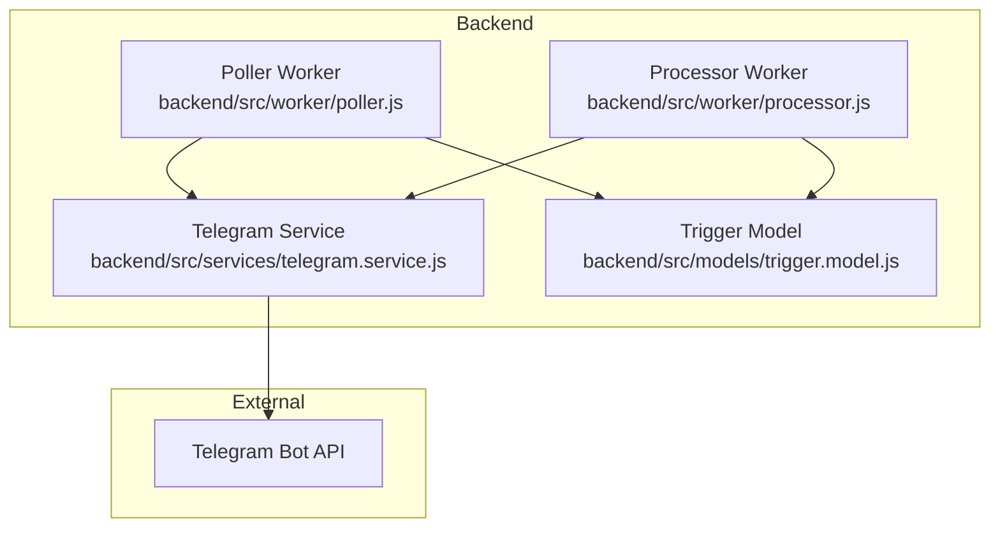
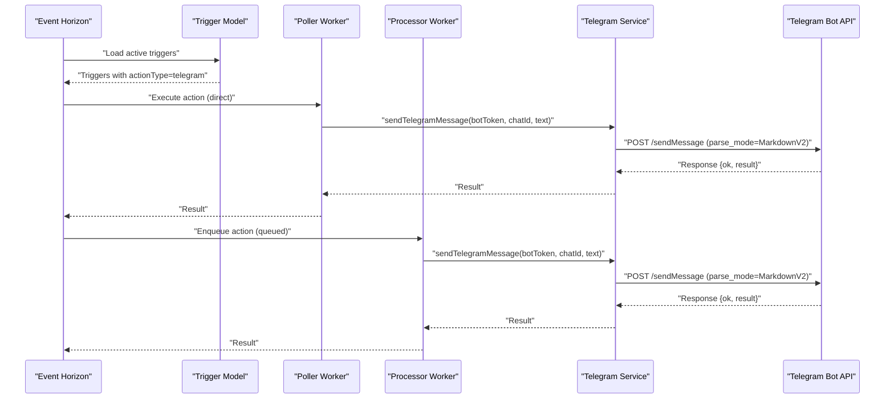
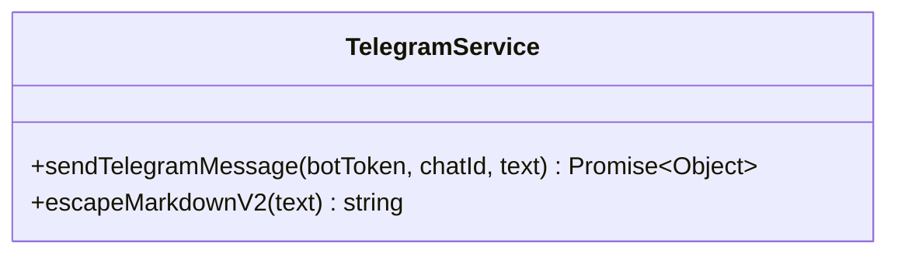
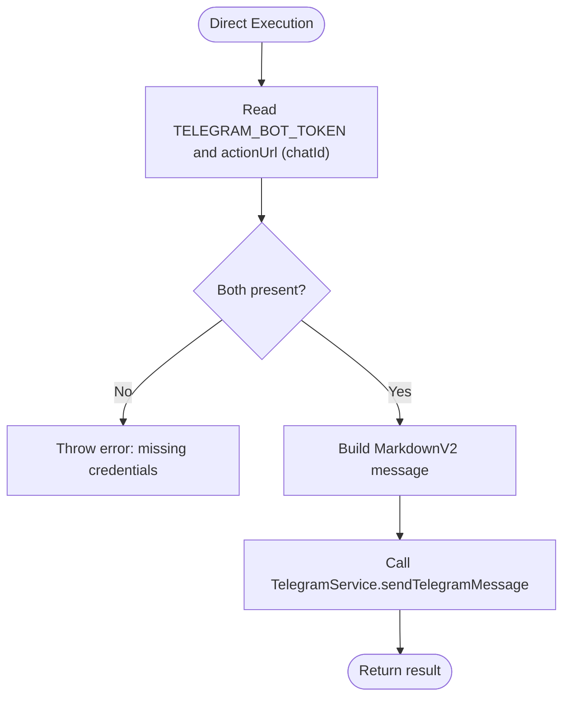
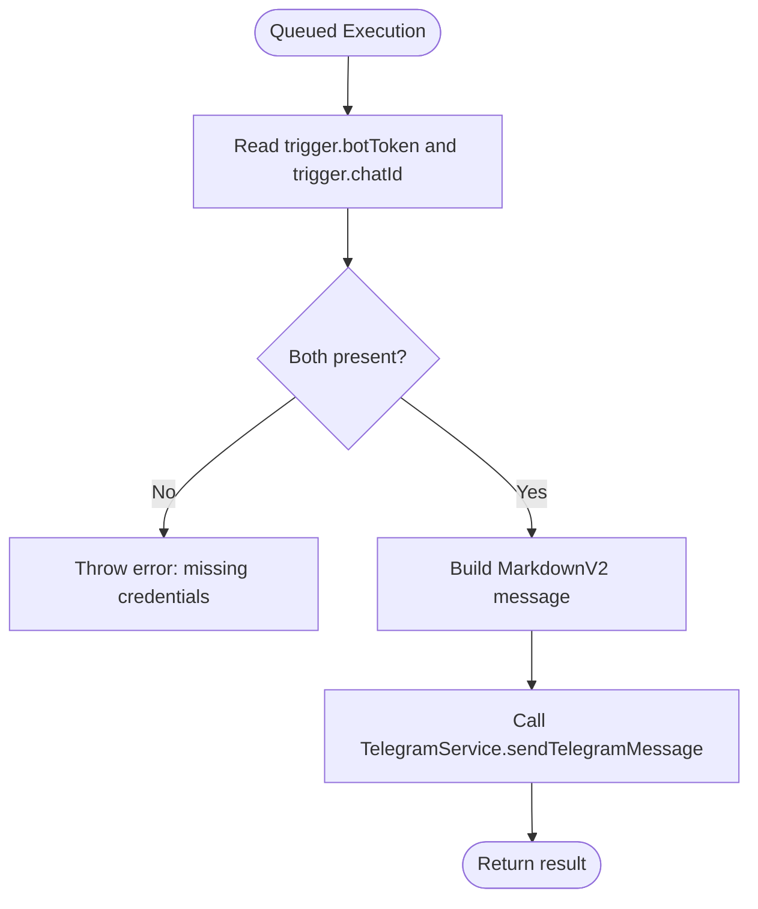
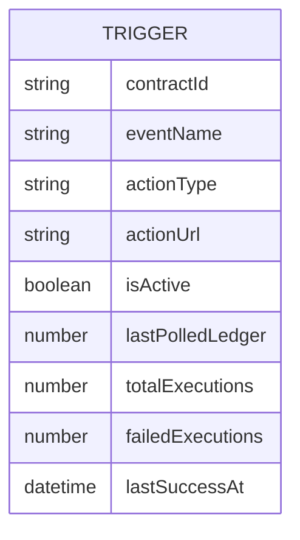
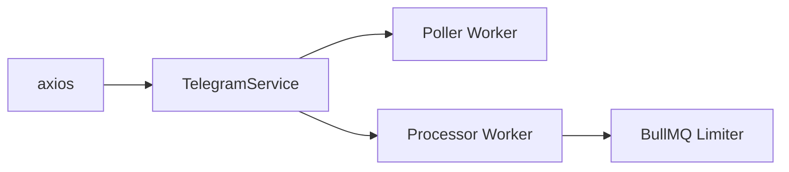

# Telegram Notifications

<cite>
**Referenced Files in This Document**
- [telegram.service.js](file://backend/src/services/telegram.service.js)
- [telegram.test.js](file://backend/__tests__/telegram.test.js)
- [poller.js](file://backend/src/worker/poller.js)
- [processor.js](file://backend/src/worker/processor.js)
- [trigger.model.js](file://backend/src/models/trigger.model.js)
- [package.json](file://backend/package.json)
- [README.md](file://README.md)
</cite>

## Table of Contents
1. [Introduction](#introduction)
2. [Project Structure](#project-structure)
3. [Core Components](#core-components)
4. [Architecture Overview](#architecture-overview)
5. [Detailed Component Analysis](#detailed-component-analysis)
6. [Dependency Analysis](#dependency-analysis)
7. [Performance Considerations](#performance-considerations)
8. [Troubleshooting Guide](#troubleshooting-guide)
9. [Conclusion](#conclusion)

## Introduction
This document explains the Telegram notification integration in EventHorizon. It covers how the system integrates with the Telegram Bot API, message formatting using MarkdownV2, chat ID management, and delivery confirmation. It also documents bot token configuration, permission handling, rate limiting behavior, and practical examples for formatted messages and attachments. Finally, it provides troubleshooting guidance for common delivery issues.

## Project Structure
The Telegram integration spans three primary areas:
- Service layer: Telegram API client and MarkdownV2 escaping logic
- Worker layer: Trigger-driven execution in both direct and queued modes
- Model layer: Trigger configuration storage and action routing

**Diagram sources**
- [telegram.service.js:1-74](file://backend/src/services/telegram.service.js#L1-L74)
- [poller.js:1-335](file://backend/src/worker/poller.js#L1-L335)
- [processor.js:1-174](file://backend/src/worker/processor.js#L1-L174)
- [trigger.model.js:1-80](file://backend/src/models/trigger.model.js#L1-L80)

**Section sources**
- [README.md:19-63](file://README.md#L19-L63)
- [package.json:10-28](file://backend/package.json#L10-L28)

## Core Components
- TelegramService: Encapsulates Telegram Bot API communication and MarkdownV2 escaping.
- Poller Worker: Executes actions synchronously when queue is unavailable; supports Telegram action routing.
- Processor Worker: Executes actions asynchronously via BullMQ; supports Telegram action routing.
- Trigger Model: Stores trigger configuration including action type and routing details.

Key responsibilities:
- Validate inputs and build Telegram sendMessage requests with MarkdownV2.
- Escape special characters for MarkdownV2 compatibility.
- Route Telegram actions based on environment variables or stored trigger fields.
- Return structured results for success/failure handling.

**Section sources**
- [telegram.service.js:6-74](file://backend/src/services/telegram.service.js#L6-L74)
- [poller.js:77-147](file://backend/src/worker/poller.js#L77-L147)
- [processor.js:25-97](file://backend/src/worker/processor.js#L25-L97)
- [trigger.model.js:13-21](file://backend/src/models/trigger.model.js#L13-L21)

## Architecture Overview
The system supports two execution modes for Telegram actions:
- Direct execution (fallback): When Redis/BullMQ is unavailable, actions are executed immediately within the poller.
- Queued execution (recommended): Actions are enqueued and processed by workers with concurrency and retry controls.

**Diagram sources**
- [poller.js:77-147](file://backend/src/worker/poller.js#L77-L147)
- [processor.js:25-97](file://backend/src/worker/processor.js#L25-L97)
- [telegram.service.js:15-57](file://backend/src/services/telegram.service.js#L15-L57)

## Detailed Component Analysis

### TelegramService
Responsibilities:
- Send messages to Telegram via sendMessage with parse_mode set to MarkdownV2.
- Validate required inputs (botToken, chatId, text).
- Escape special characters for MarkdownV2 compliance.
- Provide structured error responses for common Telegram API errors.

**Diagram sources**
- [telegram.service.js:6-74](file://backend/src/services/telegram.service.js#L6-L74)

**Section sources**
- [telegram.service.js:15-57](file://backend/src/services/telegram.service.js#L15-L57)
- [telegram.service.js:66-70](file://backend/src/services/telegram.service.js#L66-L70)

### Poller Worker (Direct Execution)
Behavior:
- Routes actionType=telegram to TelegramService.
- Reads botToken from environment and chatId from actionUrl.
- Builds a MarkdownV2-formatted message and sends it.
- Returns structured results for success/failure.

**Diagram sources**
- [poller.js:114-131](file://backend/src/worker/poller.js#L114-L131)
- [telegram.service.js:15-57](file://backend/src/services/telegram.service.js#L15-L57)

**Section sources**
- [poller.js:77-147](file://backend/src/worker/poller.js#L77-L147)

### Processor Worker (Queued Execution)
Behavior:
- Routes actionType=telegram to TelegramService.
- Reads botToken and chatId from trigger fields.
- Builds a MarkdownV2-formatted message and sends it.
- Applies concurrency and retry limits via BullMQ.

**Diagram sources**
- [processor.js:68-80](file://backend/src/worker/processor.js#L68-L80)
- [telegram.service.js:15-57](file://backend/src/services/telegram.service.js#L15-L57)

**Section sources**
- [processor.js:25-97](file://backend/src/worker/processor.js#L25-L97)

### Trigger Model and Routing
- actionType includes telegram alongside webhook, discord, and email.
- actionUrl is used as chatId for telegram triggers in direct execution.
- In queued execution, botToken and chatId are stored in the trigger document.

**Diagram sources**
- [trigger.model.js:3-62](file://backend/src/models/trigger.model.js#L3-L62)

**Section sources**
- [trigger.model.js:13-21](file://backend/src/models/trigger.model.js#L13-L21)
- [poller.js:114-131](file://backend/src/worker/poller.js#L114-L131)
- [processor.js:68-80](file://backend/src/worker/processor.js#L68-L80)

## Dependency Analysis
- TelegramService depends on axios for HTTP requests.
- Workers depend on TelegramService for messaging.
- Direct execution path loads TelegramService locally; queued execution imports it from the service module.
- Rate limiting is handled by BullMQ limiter configuration in the processor.

**Diagram sources**
- [telegram.service.js:1](file://backend/src/services/telegram.service.js#L1)
- [processor.js:128-136](file://backend/src/worker/processor.js#L128-L136)

**Section sources**
- [package.json:10-28](file://backend/package.json#L10-L28)
- [processor.js:128-136](file://backend/src/worker/processor.js#L128-L136)

## Performance Considerations
- Concurrency and rate limiting:
  - Processor worker sets a limiter allowing a burst of 10 jobs per second. Tune WORKER_CONCURRENCY and limiter settings according to expected load.
- Retry strategy:
  - Triggers support configurable maxRetries and retryIntervalMs. Adjust these to balance responsiveness and external API pressure.
- Network and timeouts:
  - Poller uses exponential backoff for RPC calls; similar patterns apply to external API calls.

Practical tips:
- Monitor queue stats and failed jobs to detect throttling or credential issues.
- Keep message sizes reasonable to reduce API latency and potential rate limits.

**Section sources**
- [processor.js:128-136](file://backend/src/worker/processor.js#L128-L136)
- [trigger.model.js:43-52](file://backend/src/models/trigger.model.js#L43-L52)
- [poller.js:27-51](file://backend/src/worker/poller.js#L27-L51)

## Troubleshooting Guide
Common Telegram delivery issues and resolutions:
- Invalid Bot Token (HTTP 401):
  - Cause: Incorrect or revoked bot token.
  - Resolution: Verify TELEGRAM_BOT_TOKEN in environment or trigger fields; regenerate token if needed.
- Chat not found (HTTP 400):
  - Cause: Invalid chatId or user never started the bot.
  - Resolution: Confirm chatId is correct; ensure the user started the bot or joined the group/channel.
- Bot blocked by user (HTTP 403):
  - Cause: User blocked the bot.
  - Resolution: Prompt user to unblock the bot; use a different chatId.
- Malformed MarkdownV2 (HTTP 400):
  - Cause: Unescaped special characters in the message text.
  - Resolution: Use TelegramService.escapeMarkdownV2 to sanitize user-provided content.

Delivery confirmation:
- Successful sendMessage returns an ok flag and a result object. The service returns structured data for failures to avoid crashes.

Environment variables:
- TELEGRAM_BOT_TOKEN: Required for direct execution mode.
- TELEGRAM_CHAT_ID: Required for direct execution mode; corresponds to actionUrl in triggers.

Tests:
- The Telegram test suite validates MarkdownV2 escaping and optionally performs an actual API call if tokens are provided.

**Section sources**
- [telegram.service.js:31-56](file://backend/src/services/telegram.service.js#L31-L56)
- [telegram.test.js:4-39](file://backend/__tests__/telegram.test.js#L4-L39)
- [poller.js:114-131](file://backend/src/worker/poller.js#L114-L131)
- [processor.js:68-80](file://backend/src/worker/processor.js#L68-L80)

## Conclusion
EventHorizon’s Telegram integration provides robust, configurable notifications using the Telegram Bot API with MarkdownV2 formatting and safe character escaping. It supports both immediate execution and background processing with retries and rate limiting. By correctly configuring bot tokens and chat IDs, escaping dynamic content, and monitoring delivery outcomes, teams can reliably automate Telegram alerts for Soroban contract events.