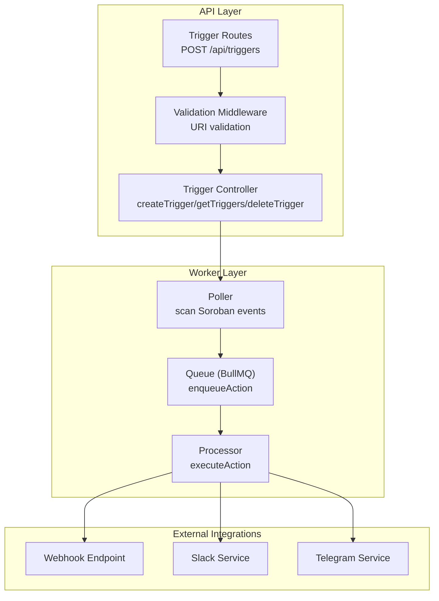
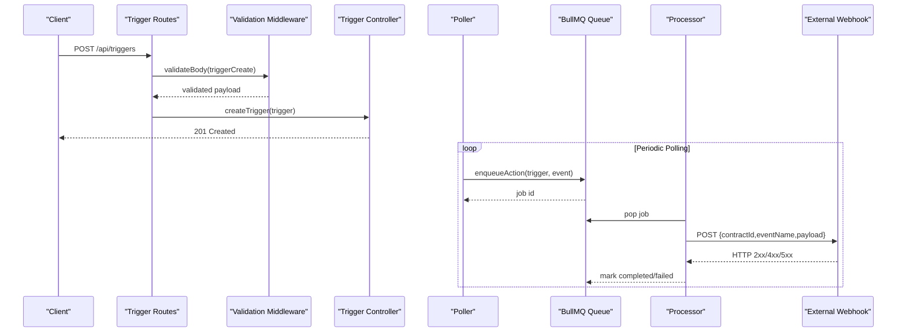
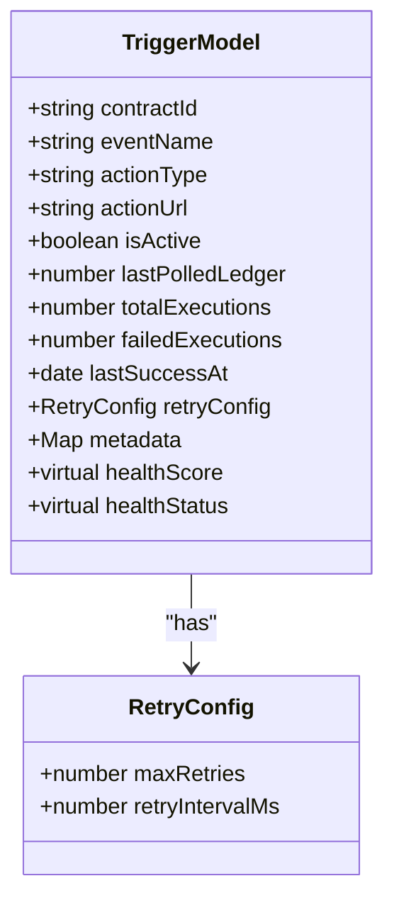
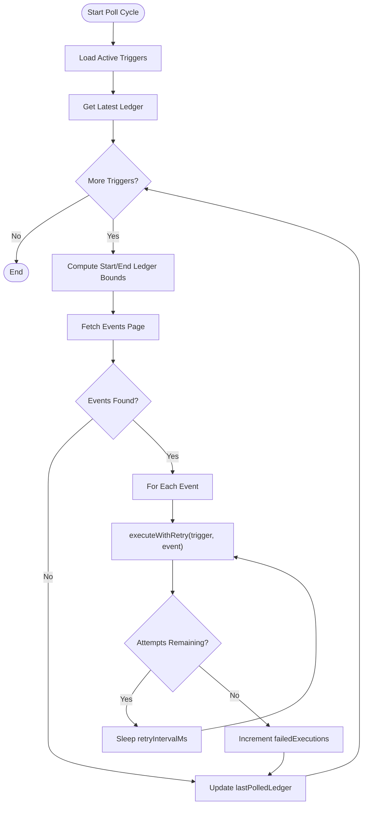
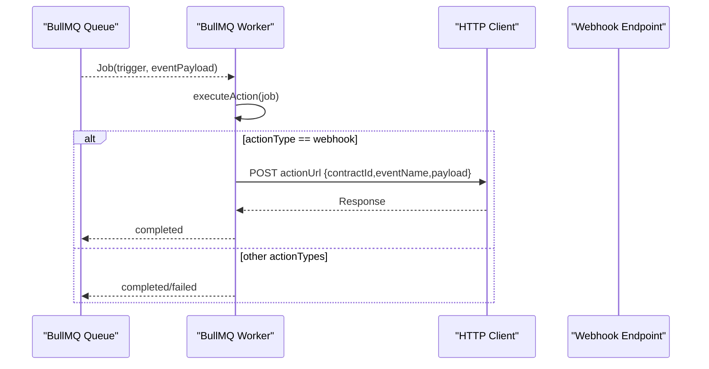
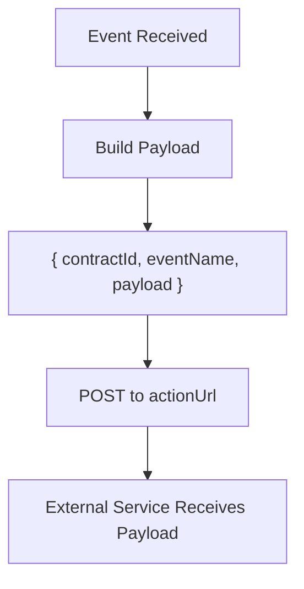
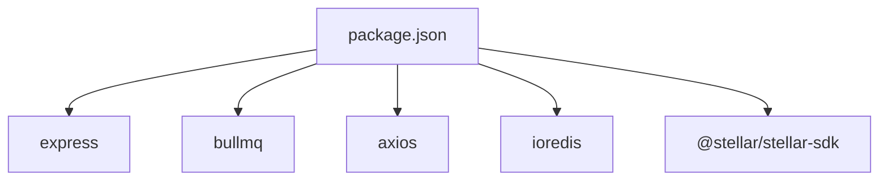

# Webhook Delivery

<cite>
**Referenced Files in This Document**
- [trigger.controller.js](file://backend/src/controllers/trigger.controller.js)
- [trigger.model.js](file://backend/src/models/trigger.model.js)
- [validation.middleware.js](file://backend/src/middleware/validation.middleware.js)
- [trigger.routes.js](file://backend/src/routes/trigger.routes.js)
- [poller.js](file://backend/src/worker/poller.js)
- [queue.js](file://backend/src/worker/queue.js)
- [processor.js](file://backend/src/worker/processor.js)
- [slack.service.js](file://backend/src/services/slack.service.js)
- [telegram.service.js](file://backend/src/services/telegram.service.js)
- [rateLimit.middleware.js](file://backend/src/middleware/rateLimit.middleware.js)
- [app.js](file://backend/src/app.js)
- [server.js](file://backend/src/server.js)
- [queue-usage.js](file://backend/examples/queue-usage.js)
- [package.json](file://backend/package.json)
</cite>

## Table of Contents
1. [Introduction](#introduction)
2. [Project Structure](#project-structure)
3. [Core Components](#core-components)
4. [Architecture Overview](#architecture-overview)
5. [Detailed Component Analysis](#detailed-component-analysis)
6. [Dependency Analysis](#dependency-analysis)
7. [Performance Considerations](#performance-considerations)
8. [Troubleshooting Guide](#troubleshooting-guide)
9. [Conclusion](#conclusion)
10. [Appendices](#appendices)

## Introduction
This document explains the webhook delivery mechanisms in the system. It covers the generic webhook service architecture, HTTP request handling, and payload formatting for external integrations. It also documents webhook URL validation, request signing considerations, payload transformation from Soroban events, delivery patterns, retry logic with exponential backoff, and failure handling strategies. Practical examples demonstrate configuration, custom payload formatting, and integration with external services. Security considerations, rate limiting, and monitoring approaches for reliable delivery are included.

## Project Structure
The webhook pipeline spans several modules:
- Triggers: persisted configurations with action targets and retry settings
- Poller: scans the Soroban network for matching events and enqueues actions
- Queue: background job system (BullMQ) for reliable delivery
- Processor: executes queued actions and performs HTTP webhook deliveries
- Validation: ensures webhook URLs are valid during trigger creation
- Services: optional integrations (Slack, Telegram) and helpers
- Rate limiting: protects the API and downstream systems
- Examples: usage patterns for queue operations and webhook delivery

**Diagram sources**
- [trigger.routes.js:1-92](file://backend/src/routes/trigger.routes.js#L1-L92)
- [validation.middleware.js:1-49](file://backend/src/middleware/validation.middleware.js#L1-L49)
- [trigger.controller.js:1-72](file://backend/src/controllers/trigger.controller.js#L1-L72)
- [poller.js:1-335](file://backend/src/worker/poller.js#L1-L335)
- [queue.js:1-164](file://backend/src/worker/queue.js#L1-L164)
- [processor.js:1-174](file://backend/src/worker/processor.js#L1-L174)
- [slack.service.js:1-165](file://backend/src/services/slack.service.js#L1-L165)
- [telegram.service.js:1-74](file://backend/src/services/telegram.service.js#L1-L74)

**Section sources**
- [trigger.routes.js:1-92](file://backend/src/routes/trigger.routes.js#L1-L92)
- [validation.middleware.js:1-49](file://backend/src/middleware/validation.middleware.js#L1-L49)
- [trigger.controller.js:1-72](file://backend/src/controllers/trigger.controller.js#L1-L72)
- [poller.js:1-335](file://backend/src/worker/poller.js#L1-L335)
- [queue.js:1-164](file://backend/src/worker/queue.js#L1-L164)
- [processor.js:1-174](file://backend/src/worker/processor.js#L1-L174)
- [slack.service.js:1-165](file://backend/src/services/slack.service.js#L1-L165)
- [telegram.service.js:1-74](file://backend/src/services/telegram.service.js#L1-L74)

## Core Components
- Trigger model defines webhook configuration, including actionUrl, actionType, retryConfig, and health metrics.
- Validation middleware enforces URI correctness for webhook URLs.
- Poller queries Soroban events, filters by contractId and eventName, and enqueues actions with retry logic.
- Queue (BullMQ) persists jobs with exponential backoff and configurable attempts.
- Processor executes actions, including HTTP POST to webhook URLs with standardized payload.
- Rate limiting protects the API and downstream systems.

**Section sources**
- [trigger.model.js:1-80](file://backend/src/models/trigger.model.js#L1-L80)
- [validation.middleware.js:1-49](file://backend/src/middleware/validation.middleware.js#L1-L49)
- [poller.js:149-174](file://backend/src/worker/poller.js#L149-L174)
- [queue.js:19-41](file://backend/src/worker/queue.js#L19-L41)
- [processor.js:25-97](file://backend/src/worker/processor.js#L25-L97)
- [rateLimit.middleware.js:1-51](file://backend/src/middleware/rateLimit.middleware.js#L1-L51)

## Architecture Overview
The webhook delivery architecture follows a publish-subscribe-like pattern:
- Triggers are created with actionType set to webhook and a valid actionUrl.
- The poller periodically queries Soroban events and enqueues jobs into the queue.
- The worker processes jobs concurrently with rate limiting and logs outcomes.
- For webhook actions, the processor sends an HTTP POST to the configured endpoint with a standardized payload.

**Diagram sources**
- [trigger.routes.js:57-61](file://backend/src/routes/trigger.routes.js#L57-L61)
- [validation.middleware.js:24-41](file://backend/src/middleware/validation.middleware.js#L24-L41)
- [trigger.controller.js:6-28](file://backend/src/controllers/trigger.controller.js#L6-L28)
- [poller.js:149-174](file://backend/src/worker/poller.js#L149-L174)
- [queue.js:91-121](file://backend/src/worker/queue.js#L91-L121)
- [processor.js:82-92](file://backend/src/worker/processor.js#L82-L92)

## Detailed Component Analysis

### Trigger Model and Validation
- The trigger model supports actionType with webhook as default and requires actionUrl.
- Validation middleware enforces actionUrl as a URI and actionType from a predefined set.
- Health metrics (totalExecutions, failedExecutions, lastSuccessAt) and a derived healthScore/status are computed.

**Diagram sources**
- [trigger.model.js:3-79](file://backend/src/models/trigger.model.js#L3-L79)

**Section sources**
- [trigger.model.js:1-80](file://backend/src/models/trigger.model.js#L1-L80)
- [validation.middleware.js:3-16](file://backend/src/middleware/validation.middleware.js#L3-L16)

### Polling and Retry Logic
- The poller fetches events from the Soroban RPC with pagination and applies exponential backoff for transient failures.
- For each matching event, it enqueues an action with trigger-specific retryConfig (maxRetries and retryIntervalMs).
- If the queue is unavailable, the poller falls back to direct execution with the same routing logic.

**Diagram sources**
- [poller.js:177-310](file://backend/src/worker/poller.js#L177-L310)
- [poller.js:149-174](file://backend/src/worker/poller.js#L149-L174)

**Section sources**
- [poller.js:177-310](file://backend/src/worker/poller.js#L177-L310)
- [poller.js:149-174](file://backend/src/worker/poller.js#L149-L174)

### Queue and Worker Processing
- Queue configuration sets default attempts and exponential backoff delay.
- Worker processes jobs concurrently with a built-in limiter (per second) and logs completed/failed events.
- For webhook actions, the processor posts a standardized payload to actionUrl.

**Diagram sources**
- [queue.js:19-41](file://backend/src/worker/queue.js#L19-L41)
- [processor.js:25-97](file://backend/src/worker/processor.js#L25-L97)

**Section sources**
- [queue.js:19-41](file://backend/src/worker/queue.js#L19-L41)
- [processor.js:25-97](file://backend/src/worker/processor.js#L25-L97)

### Payload Formatting for Webhooks
- The processor constructs a simple JSON payload containing contractId, eventName, and the raw eventPayload.
- This payload is suitable for most external services and can be extended per integration needs.

**Diagram sources**
- [processor.js:87-91](file://backend/src/worker/processor.js#L87-L91)

**Section sources**
- [processor.js:87-91](file://backend/src/worker/processor.js#L87-L91)

### Request Signing and Security
- The current implementation does not apply request signing for webhook deliveries.
- Recommendations:
  - Add HMAC signatures using a shared secret header (e.g., X-Signature-256) derived from the payload and secret.
  - Validate Content-Type and enforce HTTPS endpoints.
  - Support signature verification in external services to ensure authenticity and integrity.

[No sources needed since this section provides general guidance]

### URL Validation and Configuration
- During trigger creation, actionUrl is validated as a URI.
- The trigger model stores actionUrl and actionType, enabling webhook configuration persistence.

**Section sources**
- [validation.middleware.js:8](file://backend/src/middleware/validation.middleware.js#L8)
- [trigger.model.js:18-21](file://backend/src/models/trigger.model.js#L18-L21)

### Delivery Patterns and Retry Strategies
- Poller-level retry: attempts are controlled by trigger.retryConfig (maxRetries, retryIntervalMs).
- Queue-level retry: BullMQ default attempts and exponential backoff are applied automatically.
- Backpressure: worker limiter controls throughput to avoid overwhelming external endpoints.

**Section sources**
- [poller.js:149-174](file://backend/src/worker/poller.js#L149-L174)
- [queue.js:23-36](file://backend/src/worker/queue.js#L23-L36)
- [processor.js:131-134](file://backend/src/worker/processor.js#L131-L134)

### Failure Handling and Monitoring
- Poller increments failedExecutions on permanent failure and logs errors.
- Queue retains failed jobs for inspection and cleanup policies are applied.
- Worker emits completed/failed/error events for observability.

**Section sources**
- [poller.js:249-260](file://backend/src/worker/poller.js#L249-L260)
- [queue.js:148-156](file://backend/src/worker/queue.js#L148-L156)
- [processor.js:138-159](file://backend/src/worker/processor.js#L138-L159)

### Practical Examples
- Creating a webhook trigger via API with validation.
- Enqueueing webhook jobs and inspecting queue statistics.
- Monitoring job progress and retrying failed jobs.

**Section sources**
- [trigger.routes.js:57-61](file://backend/src/routes/trigger.routes.js#L57-L61)
- [queue-usage.js:61-85](file://backend/examples/queue-usage.js#L61-L85)
- [queue-usage.js:87-102](file://backend/examples/queue-usage.js#L87-L102)
- [queue-usage.js:142-163](file://backend/examples/queue-usage.js#L142-L163)

## Dependency Analysis
- Core runtime dependencies include Express, BullMQ, Axios, Stellar SDK, and rate limiting.
- The system integrates Redis for queue persistence and background processing.
- Optional integrations (Slack, Telegram) share similar payload construction patterns.

**Diagram sources**
- [package.json:10-22](file://backend/package.json#L10-L22)

**Section sources**
- [package.json:10-22](file://backend/package.json#L10-L22)

## Performance Considerations
- Concurrency: Worker concurrency and per-second limiter balance throughput and downstream stability.
- Backoff: Exponential backoff in the queue reduces pressure on failing endpoints.
- Pagination: Poller paginates events to avoid large responses and manage memory usage.
- Rate limiting: Global and auth rate limits protect the API and reduce upstream load.

[No sources needed since this section provides general guidance]

## Troubleshooting Guide
- Webhook endpoint returns 4xx/5xx:
  - Inspect worker logs for error messages and attempts remaining.
  - Verify endpoint availability and TLS configuration.
- Queue backlog grows:
  - Increase worker concurrency or adjust per-second limiter.
  - Review external endpoint performance and consider scaling.
- Validation errors on trigger creation:
  - Ensure actionUrl is a valid URI and actionType is supported.
- Permanent failures:
  - Check trigger.retryConfig and queue cleanup policies.
  - Investigate external endpoint behavior and rate limits.

**Section sources**
- [processor.js:116-126](file://backend/src/worker/processor.js#L116-L126)
- [validation.middleware.js:32-37](file://backend/src/middleware/validation.middleware.js#L32-L37)
- [queue.js:148-156](file://backend/src/worker/queue.js#L148-L156)

## Conclusion
The webhook delivery system combines robust event polling, resilient queue-backed processing, and standardized payload formatting. It provides configurable retries, built-in rate limiting, and observability hooks to ensure reliable external integrations. Extending the system with request signing and custom payload transformations is straightforward and aligns with the existing modular architecture.

## Appendices

### API Definitions
- Create a webhook trigger:
  - Method: POST
  - Path: /api/triggers
  - Body fields: contractId, eventName, actionType (default webhook), actionUrl (URI), isActive, lastPolledLedger
  - Validation: actionUrl must be a URI; actionType must be one of webhook, discord, email

**Section sources**
- [trigger.routes.js:57-61](file://backend/src/routes/trigger.routes.js#L57-L61)
- [validation.middleware.js:3-16](file://backend/src/middleware/validation.middleware.js#L3-L16)

### Environment Variables
- Poller and worker:
  - POLL_INTERVAL_MS, MAX_LEDGERS_PER_POLL, RPC_MAX_RETRIES, RPC_BASE_DELAY_MS, INTER_TRIGGER_DELAY_MS, INTER_PAGE_DELAY_MS
- Queue:
  - REDIS_HOST, REDIS_PORT, REDIS_PASSWORD, WORKER_CONCURRENCY
- Rate limiting:
  - RATE_LIMIT_WINDOW_MS, RATE_LIMIT_MAX, RATE_LIMIT_MESSAGE
  - AUTH_RATE_LIMIT_WINDOW_MS, AUTH_RATE_LIMIT_MAX, AUTH_RATE_LIMIT_MESSAGE

**Section sources**
- [poller.js:10-15](file://backend/src/worker/poller.js#L10-L15)
- [queue.js:5-7](file://backend/src/worker/queue.js#L5-L7)
- [rateLimit.middleware.js:31-45](file://backend/src/middleware/rateLimit.middleware.js#L31-L45)