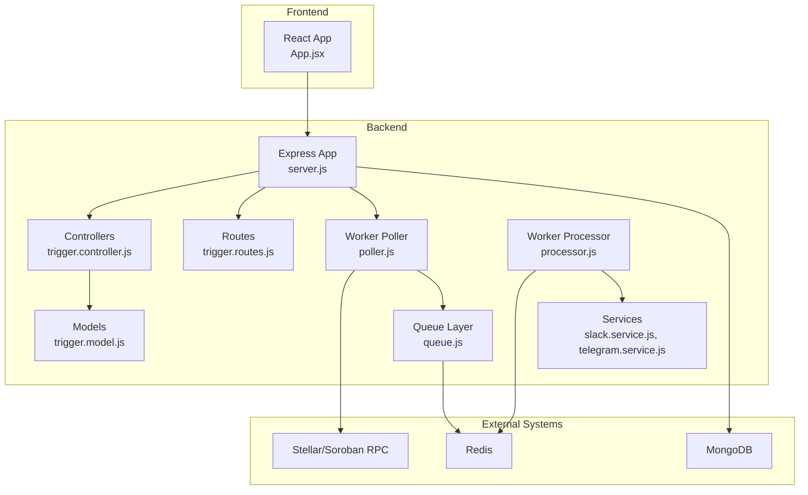
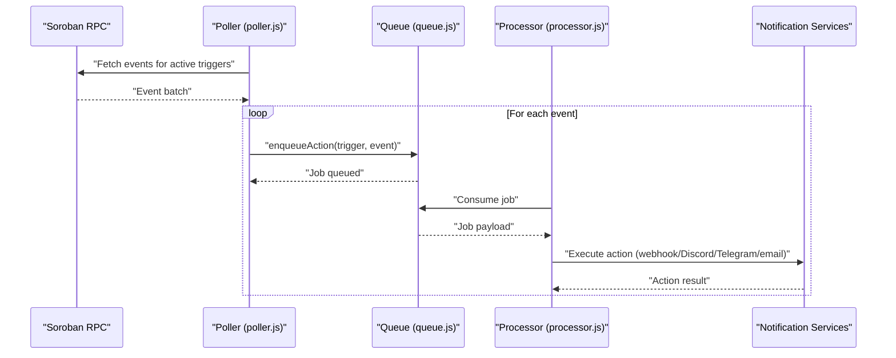
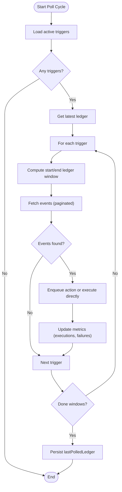
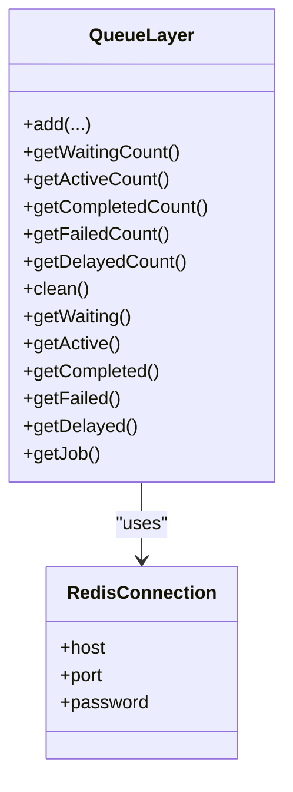
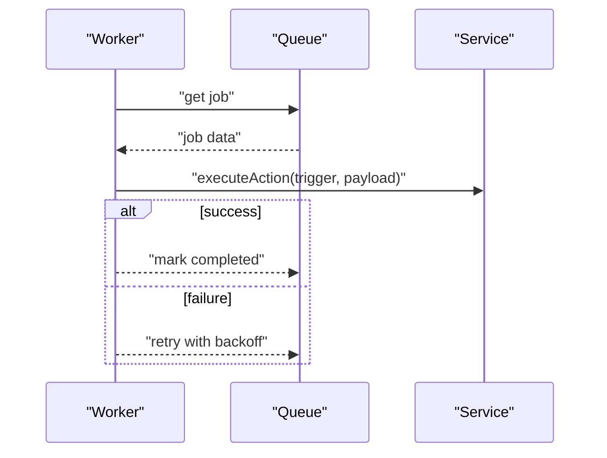
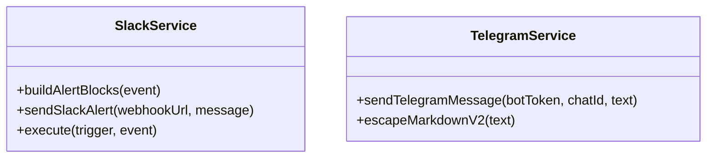
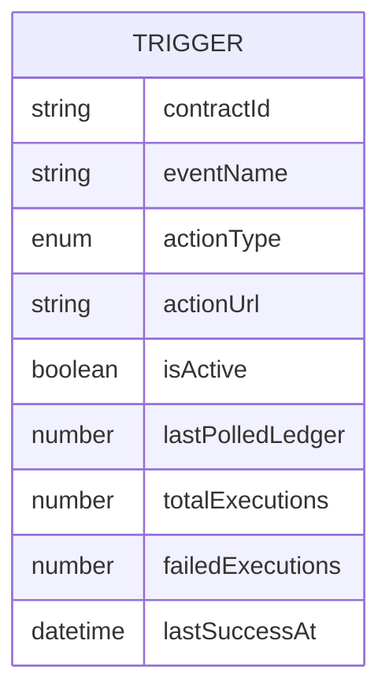
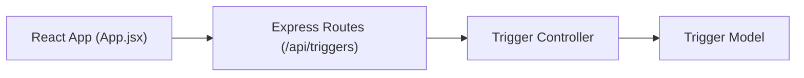
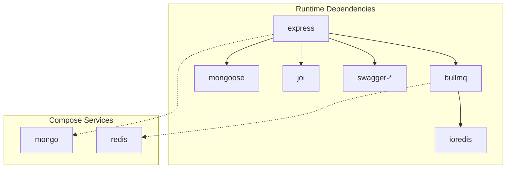
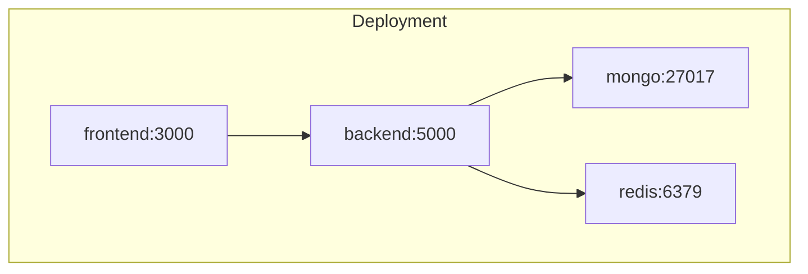

# Architecture Overview

<cite>
**Referenced Files in This Document**
- [backend/src/server.js](file://backend/src/server.js)
- [backend/src/app.js](file://backend/src/app.js)
- [backend/package.json](file://backend/package.json)
- [backend/src/worker/poller.js](file://backend/src/worker/poller.js)
- [backend/src/worker/queue.js](file://backend/src/worker/queue.js)
- [backend/src/worker/processor.js](file://backend/src/worker/processor.js)
- [backend/src/controllers/trigger.controller.js](file://backend/src/controllers/trigger.controller.js)
- [backend/src/models/trigger.model.js](file://backend/src/models/trigger.model.js)
- [backend/src/routes/trigger.routes.js](file://backend/src/routes/trigger.routes.js)
- [backend/src/middleware/validation.middleware.js](file://backend/src/middleware/validation.middleware.js)
- [backend/src/services/slack.service.js](file://backend/src/services/slack.service.js)
- [backend/src/services/telegram.service.js](file://backend/src/services/telegram.service.js)
- [frontend/src/App.jsx](file://frontend/src/App.jsx)
- [frontend/package.json](file://frontend/package.json)
- [docker-compose.yml](file://docker-compose.yml)
</cite>

## Table of Contents
1. [Introduction](#introduction)
2. [Project Structure](#project-structure)
3. [Core Components](#core-components)
4. [Architecture Overview](#architecture-overview)
5. [Detailed Component Analysis](#detailed-component-analysis)
6. [Dependency Analysis](#dependency-analysis)
7. [Performance Considerations](#performance-considerations)
8. [Troubleshooting Guide](#troubleshooting-guide)
9. [Conclusion](#conclusion)
10. [Appendices](#appendices)

## Introduction
EventHorizon is an event-driven monitoring and notification platform for the Soroban blockchain. It observes smart contract events, evaluates configured triggers, and executes actions (webhooks, Discord, Telegram, email) through a robust queue system. The system is split into a frontend for user interaction and a backend that handles API, polling, queueing, and notifications. Technology stack choices include Node.js/Express for the backend, React for the frontend, MongoDB for persistence, and Redis/BullMQ for queuing.

## Project Structure
The repository is organized into three primary areas:
- Backend: Express server, controllers, models, routes, workers (poller, queue, processor), services, and middleware.
- Contracts: Rust-based smart contracts for various DeFi and governance use cases.
- Frontend: React application for creating and managing triggers.

**Diagram sources**
- [backend/src/server.js:1-88](file://backend/src/server.js#L1-L88)
- [backend/src/app.js:1-55](file://backend/src/app.js#L1-L55)
- [backend/src/controllers/trigger.controller.js:1-72](file://backend/src/controllers/trigger.controller.js#L1-L72)
- [backend/src/models/trigger.model.js:1-80](file://backend/src/models/trigger.model.js#L1-L80)
- [backend/src/routes/trigger.routes.js:1-92](file://backend/src/routes/trigger.routes.js#L1-L92)
- [backend/src/worker/poller.js:1-335](file://backend/src/worker/poller.js#L1-L335)
- [backend/src/worker/queue.js:1-164](file://backend/src/worker/queue.js#L1-L164)
- [backend/src/worker/processor.js:1-174](file://backend/src/worker/processor.js#L1-L174)
- [backend/src/services/slack.service.js:1-165](file://backend/src/services/slack.service.js#L1-L165)
- [backend/src/services/telegram.service.js:1-74](file://backend/src/services/telegram.service.js#L1-L74)
- [frontend/src/App.jsx:1-99](file://frontend/src/App.jsx#L1-L99)

**Section sources**
- [backend/src/server.js:1-88](file://backend/src/server.js#L1-L88)
- [backend/src/app.js:1-55](file://backend/src/app.js#L1-L55)
- [docker-compose.yml:1-70](file://docker-compose.yml#L1-L70)

## Core Components
- Express Application: Initializes middleware, routes, health checks, and integrates the queue worker and poller on startup.
- Trigger Model: Defines trigger schema persisted in MongoDB, including event targeting, action configuration, and health metrics.
- Poller: Periodically queries Soroban RPC for contract events, filters by trigger criteria, and enqueues actions or executes directly if queue is unavailable.
- Queue Layer: BullMQ-backed queue abstraction exposing enqueue and stats APIs.
- Processor: Background worker consuming jobs from the queue and executing actions via services.
- Controllers and Routes: REST endpoints for creating/listing/deleting triggers and OpenAPI documentation.
- Services: Integrations for Slack, Telegram, Discord, and email notifications.
- Frontend: Minimal React UI for creating triggers and observing status.

**Section sources**
- [backend/src/models/trigger.model.js:1-80](file://backend/src/models/trigger.model.js#L1-L80)
- [backend/src/worker/poller.js:1-335](file://backend/src/worker/poller.js#L1-L335)
- [backend/src/worker/queue.js:1-164](file://backend/src/worker/queue.js#L1-L164)
- [backend/src/worker/processor.js:1-174](file://backend/src/worker/processor.js#L1-L174)
- [backend/src/controllers/trigger.controller.js:1-72](file://backend/src/controllers/trigger.controller.js#L1-L72)
- [backend/src/routes/trigger.routes.js:1-92](file://backend/src/routes/trigger.routes.js#L1-L92)
- [backend/src/services/slack.service.js:1-165](file://backend/src/services/slack.service.js#L1-L165)
- [backend/src/services/telegram.service.js:1-74](file://backend/src/services/telegram.service.js#L1-L74)
- [frontend/src/App.jsx:1-99](file://frontend/src/App.jsx#L1-L99)

## Architecture Overview
EventHorizon follows an event-driven architecture:
- Smart contract events are polled from Soroban RPC.
- For each matching trigger, an action is enqueued or executed directly.
- The queue decouples event ingestion from action execution, enabling retries, backoff, and concurrency control.
- Notifications are delivered via external services (webhook, Discord, Telegram, email).

**Diagram sources**
- [backend/src/worker/poller.js:177-310](file://backend/src/worker/poller.js#L177-L310)
- [backend/src/worker/queue.js:91-121](file://backend/src/worker/queue.js#L91-L121)
- [backend/src/worker/processor.js:25-97](file://backend/src/worker/processor.js#L25-L97)

## Detailed Component Analysis

### Poller: Event Discovery and Action Enqueue
- Polling cadence and per-trigger windows are configurable.
- Uses exponential backoff for RPC calls and paginates event results.
- Determines action execution path: queue-based or direct execution with service-specific handlers.
- Updates trigger state (last polled ledger) and tracks execution metrics.

**Diagram sources**
- [backend/src/worker/poller.js:177-310](file://backend/src/worker/poller.js#L177-L310)

**Section sources**
- [backend/src/worker/poller.js:1-335](file://backend/src/worker/poller.js#L1-L335)

### Queue Layer: BullMQ Integration
- Provides a singleton queue with default job options (attempts, backoff, retention).
- Exposes enqueue and statistics APIs for monitoring.
- Handles cleanup of completed/failed jobs.

**Diagram sources**
- [backend/src/worker/queue.js:1-164](file://backend/src/worker/queue.js#L1-L164)

**Section sources**
- [backend/src/worker/queue.js:1-164](file://backend/src/worker/queue.js#L1-L164)

### Processor: Background Job Execution
- Worker consumes jobs with concurrency control and rate limiting.
- Executes actions based on trigger type and logs outcomes.
- Emits completion and failure events for observability.

**Diagram sources**
- [backend/src/worker/processor.js:102-168](file://backend/src/worker/processor.js#L102-L168)

**Section sources**
- [backend/src/worker/processor.js:1-174](file://backend/src/worker/processor.js#L1-L174)

### Notification Services
- Slack: Builds rich Block Kit payloads and sends via webhook with error handling.
- Telegram: Sends MarkdownV2 messages via Bot API with escaping and graceful error handling.
- Additional services (Discord, email) are integrated similarly in the poller’s direct execution path.

**Diagram sources**
- [backend/src/services/slack.service.js:1-165](file://backend/src/services/slack.service.js#L1-L165)
- [backend/src/services/telegram.service.js:1-74](file://backend/src/services/telegram.service.js#L1-L74)

**Section sources**
- [backend/src/services/slack.service.js:1-165](file://backend/src/services/slack.service.js#L1-L165)
- [backend/src/services/telegram.service.js:1-74](file://backend/src/services/telegram.service.js#L1-L74)

### API and Data Model
- REST endpoints for triggers with validation middleware.
- Trigger model includes event targeting, action configuration, and health metrics.

**Diagram sources**
- [backend/src/models/trigger.model.js:3-79](file://backend/src/models/trigger.model.js#L3-L79)

**Section sources**
- [backend/src/controllers/trigger.controller.js:1-72](file://backend/src/controllers/trigger.controller.js#L1-L72)
- [backend/src/routes/trigger.routes.js:1-92](file://backend/src/routes/trigger.routes.js#L1-L92)
- [backend/src/middleware/validation.middleware.js:1-49](file://backend/src/middleware/validation.middleware.js#L1-L49)
- [backend/src/models/trigger.model.js:1-80](file://backend/src/models/trigger.model.js#L1-L80)

### Frontend: User Interaction
- Minimal React UI for creating triggers and viewing status/logs.
- Communicates with the backend API exposed by the Express server.

**Diagram sources**
- [frontend/src/App.jsx:1-99](file://frontend/src/App.jsx#L1-L99)
- [backend/src/routes/trigger.routes.js:1-92](file://backend/src/routes/trigger.routes.js#L1-L92)
- [backend/src/controllers/trigger.controller.js:1-72](file://backend/src/controllers/trigger.controller.js#L1-L72)
- [backend/src/models/trigger.model.js:1-80](file://backend/src/models/trigger.model.js#L1-L80)

**Section sources**
- [frontend/src/App.jsx:1-99](file://frontend/src/App.jsx#L1-L99)
- [frontend/package.json:1-32](file://frontend/package.json#L1-L32)

## Dependency Analysis
- Backend runtime dependencies include Express, BullMQ, ioredis, Mongoose, Joi, and Swagger for docs.
- Docker Compose defines MongoDB and Redis services and links them to the backend and frontend.

**Diagram sources**
- [backend/package.json:10-26](file://backend/package.json#L10-L26)
- [docker-compose.yml:1-70](file://docker-compose.yml#L1-L70)

**Section sources**
- [backend/package.json:1-28](file://backend/package.json#L1-L28)
- [docker-compose.yml:1-70](file://docker-compose.yml#L1-L70)

## Performance Considerations
- Polling throttling: Inter-page and inter-trigger delays reduce RPC pressure.
- Pagination: Controlled page sizes prevent oversized responses.
- Queue backpressure: Worker concurrency and rate limiter cap throughput.
- Retries: Exponential backoff reduces thundering herds and respects upstream limits.
- Persistence: Indexes on contractId and metadata improve query performance.
- Observability: Logging and queue stats enable capacity planning and tuning.

[No sources needed since this section provides general guidance]

## Troubleshooting Guide
- Queue disabled: If Redis is unavailable, the poller falls back to direct execution. Check Redis connectivity and environment variables.
- Poller errors: Inspect RPC timeouts, rate limits, and pagination cursors. Verify SOROBAN_RPC_URL and timeouts.
- Worker failures: Review job attempts, backoff behavior, and service-specific error logs (Slack/Telegram).
- Validation errors: Ensure trigger creation payloads conform to schemas (contractId, eventName, actionType, actionUrl).
- Health checks: Use the /api/health endpoint to confirm backend availability.

**Section sources**
- [backend/src/worker/poller.js:59-147](file://backend/src/worker/poller.js#L59-L147)
- [backend/src/worker/processor.js:138-159](file://backend/src/worker/processor.js#L138-L159)
- [backend/src/middleware/validation.middleware.js:24-41](file://backend/src/middleware/validation.middleware.js#L24-L41)
- [backend/src/app.js:28-48](file://backend/src/app.js#L28-L48)

## Conclusion
EventHorizon implements a scalable, event-driven pipeline for monitoring Soroban smart contract events. The separation of concerns between the frontend, backend API, poller, queue, and processors enables fault tolerance and extensibility. With Redis/BullMQ for asynchronous processing and MongoDB for persistence, the system can evolve to support additional notification channels and advanced scheduling patterns.

[No sources needed since this section summarizes without analyzing specific files]

## Appendices

### System Boundaries and Deployment Topology
- Internal boundaries: Frontend (HTTP client), Backend API (REST), Poller (background), Queue (Redis), Processor (background), External Services (Slack, Telegram, Discord, email).
- Deployment topology: Docker Compose orchestrates MongoDB, Redis, backend, and frontend containers with explicit dependencies and networking.

**Diagram sources**
- [docker-compose.yml:24-60](file://docker-compose.yml#L24-L60)