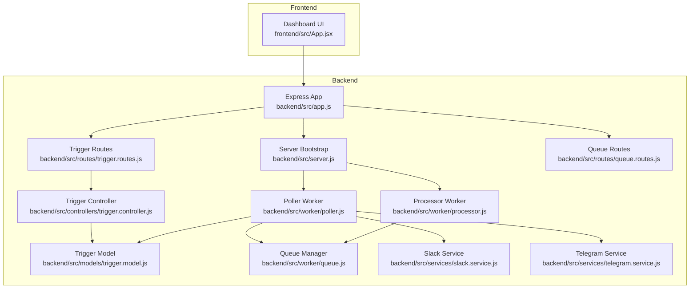
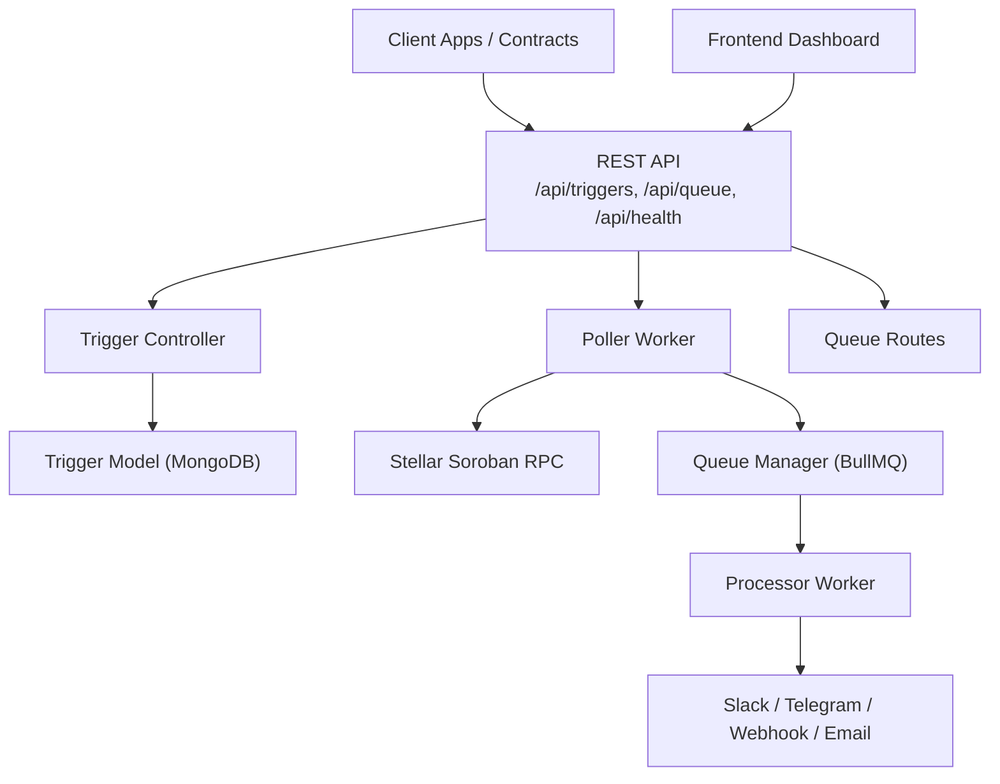
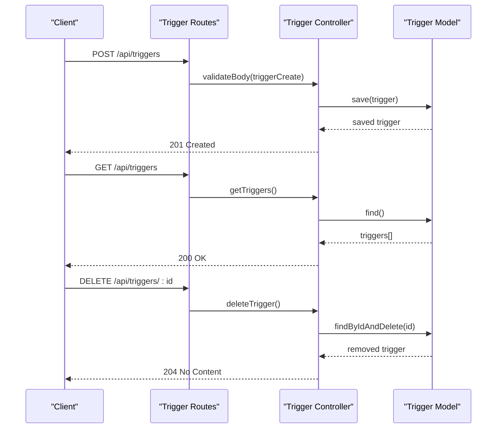
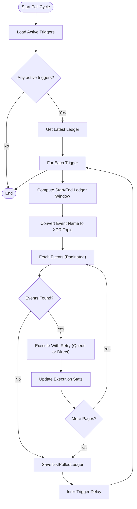
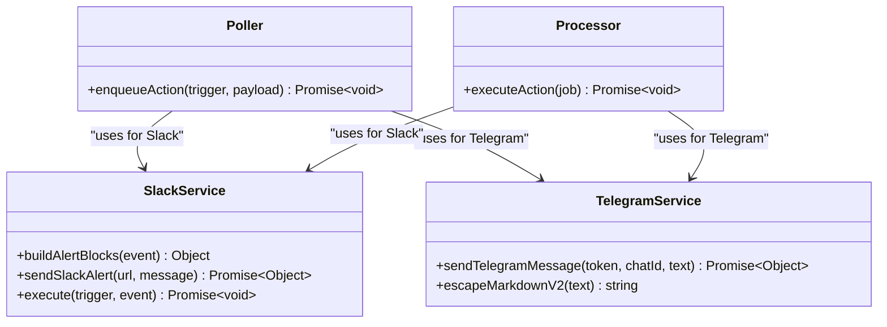
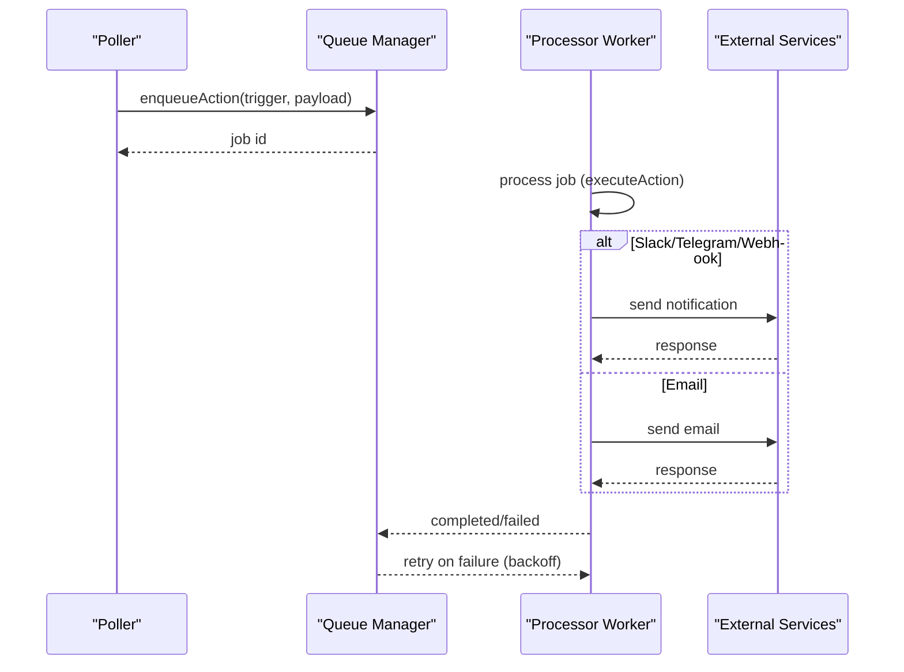
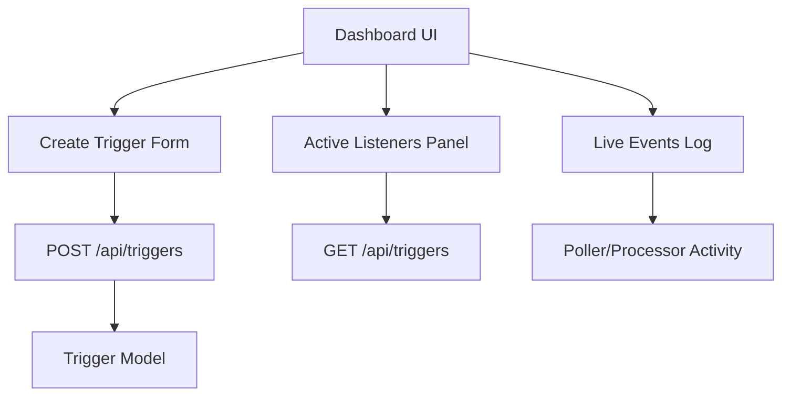
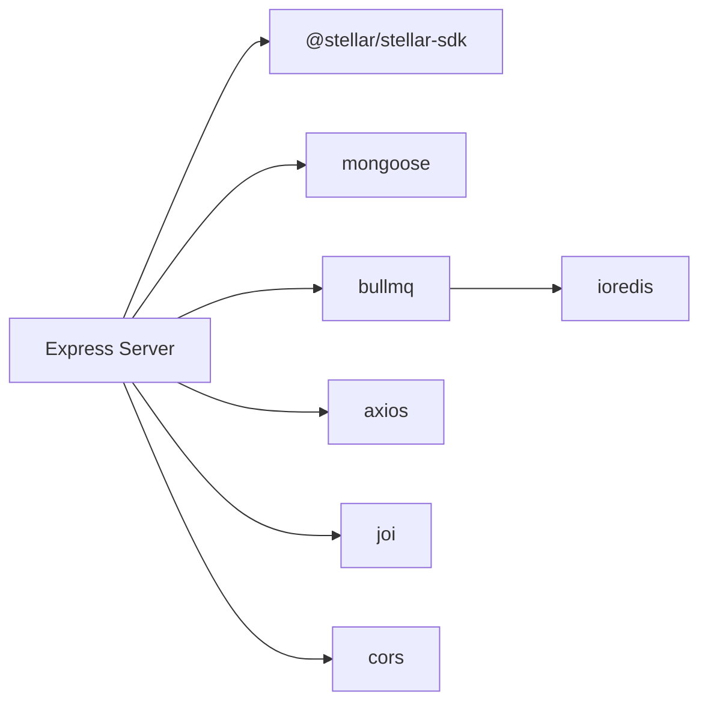

# Core Features

<cite>
**Referenced Files in This Document**
- [README.md](file://README.md)
- [backend/src/app.js](file://backend/src/app.js)
- [backend/src/server.js](file://backend/src/server.js)
- [backend/src/models/trigger.model.js](file://backend/src/models/trigger.model.js)
- [backend/src/controllers/trigger.controller.js](file://backend/src/controllers/trigger.controller.js)
- [backend/src/routes/trigger.routes.js](file://backend/src/routes/trigger.routes.js)
- [backend/src/middleware/validation.middleware.js](file://backend/src/middleware/validation.middleware.js)
- [backend/src/worker/poller.js](file://backend/src/worker/poller.js)
- [backend/src/worker/queue.js](file://backend/src/worker/queue.js)
- [backend/src/worker/processor.js](file://backend/src/worker/processor.js)
- [backend/src/services/slack.service.js](file://backend/src/services/slack.service.js)
- [backend/src/services/telegram.service.js](file://backend/src/services/telegram.service.js)
- [backend/src/routes/queue.routes.js](file://backend/src/routes/queue.routes.js)
- [backend/package.json](file://backend/package.json)
- [frontend/src/App.jsx](file://frontend/src/App.jsx)
</cite>

## Table of Contents
1. [Introduction](#introduction)
2. [Project Structure](#project-structure)
3. [Core Components](#core-components)
4. [Architecture Overview](#architecture-overview)
5. [Detailed Component Analysis](#detailed-component-analysis)
6. [Dependency Analysis](#dependency-analysis)
7. [Performance Considerations](#performance-considerations)
8. [Troubleshooting Guide](#troubleshooting-guide)
9. [Conclusion](#conclusion)
10. [Appendices](#appendices)

## Introduction
EventHorizon is a decentralized “If-This-Then-That” (IFTTT) platform that monitors Soroban smart contracts for specific events and triggers Web2 actions such as webhooks, Discord messages, Slack alerts, Telegram messages, and email notifications. It provides:
- Trigger management: creation, listing, and deletion of event triggers.
- Multi-channel notification system with robust error handling and rate-limit awareness.
- Event polling with topic-based filtering and pagination.
- Background processing with queue management, retries, and concurrency control.
- A minimal frontend dashboard for trigger visualization and live event logs.

## Project Structure
The repository is organized into three primary areas:
- Backend: Express server, API routes, controllers, models, workers, services, and middleware.
- Contracts: Example and production-ready Soroban contracts for testing and integration.
- Frontend: React/Vite dashboard for trigger creation and monitoring.

**Diagram sources**
- [backend/src/app.js:1-55](file://backend/src/app.js#L1-L55)
- [backend/src/server.js:1-88](file://backend/src/server.js#L1-L88)
- [backend/src/models/trigger.model.js:1-80](file://backend/src/models/trigger.model.js#L1-L80)
- [backend/src/controllers/trigger.controller.js:1-72](file://backend/src/controllers/trigger.controller.js#L1-L72)
- [backend/src/routes/trigger.routes.js:1-92](file://backend/src/routes/trigger.routes.js#L1-L92)
- [backend/src/worker/poller.js:1-335](file://backend/src/worker/poller.js#L1-L335)
- [backend/src/worker/queue.js:1-164](file://backend/src/worker/queue.js#L1-L164)
- [backend/src/worker/processor.js:1-174](file://backend/src/worker/processor.js#L1-L174)
- [backend/src/services/slack.service.js:1-165](file://backend/src/services/slack.service.js#L1-L165)
- [backend/src/services/telegram.service.js:1-74](file://backend/src/services/telegram.service.js#L1-L74)
- [backend/src/routes/queue.routes.js:1-104](file://backend/src/routes/queue.routes.js#L1-L104)
- [frontend/src/App.jsx:1-99](file://frontend/src/App.jsx#L1-L99)

**Section sources**
- [README.md:1-63](file://README.md#L1-L63)
- [backend/src/app.js:1-55](file://backend/src/app.js#L1-L55)
- [backend/src/server.js:1-88](file://backend/src/server.js#L1-L88)
- [frontend/src/App.jsx:1-99](file://frontend/src/App.jsx#L1-L99)

## Core Components
- Trigger model: Defines schema, indexes, health metrics, and metadata for event triggers.
- Trigger controller and routes: Manage CRUD operations for triggers with validation.
- Poller worker: Periodically queries Soroban events, applies topic-based filtering, paginates results, and executes actions with retries.
- Queue manager and processor: Optional BullMQ-based background processing with retries, backoff, and concurrency.
- Notification services: Slack, Telegram, and placeholder for email.
- Frontend dashboard: Minimal UI for creating triggers and viewing live logs.

**Section sources**
- [backend/src/models/trigger.model.js:1-80](file://backend/src/models/trigger.model.js#L1-L80)
- [backend/src/controllers/trigger.controller.js:1-72](file://backend/src/controllers/trigger.controller.js#L1-L72)
- [backend/src/routes/trigger.routes.js:1-92](file://backend/src/routes/trigger.routes.js#L1-L92)
- [backend/src/worker/poller.js:1-335](file://backend/src/worker/poller.js#L1-L335)
- [backend/src/worker/queue.js:1-164](file://backend/src/worker/queue.js#L1-L164)
- [backend/src/worker/processor.js:1-174](file://backend/src/worker/processor.js#L1-L174)
- [backend/src/services/slack.service.js:1-165](file://backend/src/services/slack.service.js#L1-L165)
- [backend/src/services/telegram.service.js:1-74](file://backend/src/services/telegram.service.js#L1-L74)
- [frontend/src/App.jsx:1-99](file://frontend/src/App.jsx#L1-L99)

## Architecture Overview
EventHorizon’s runtime architecture consists of:
- An Express server exposing REST APIs and health endpoints.
- A poller worker that periodically queries Soroban RPC for contract events.
- A queue-backed processor worker that executes actions asynchronously.
- A MongoDB-backed trigger registry storing configuration and health metrics.
- Optional Redis/BullMQ for reliable background job processing.

**Diagram sources**
- [backend/src/app.js:24-27](file://backend/src/app.js#L24-L27)
- [backend/src/server.js:44-58](file://backend/src/server.js#L44-L58)
- [backend/src/worker/poller.js:177-310](file://backend/src/worker/poller.js#L177-L310)
- [backend/src/worker/queue.js:19-41](file://backend/src/worker/queue.js#L19-L41)
- [backend/src/worker/processor.js:102-167](file://backend/src/worker/processor.js#L102-L167)
- [backend/src/routes/queue.routes.js:1-104](file://backend/src/routes/queue.routes.js#L1-L104)
- [frontend/src/App.jsx:1-99](file://frontend/src/App.jsx#L1-L99)

## Detailed Component Analysis

### Trigger Management System
- Creation: Validates input schema and persists a new trigger with defaults and indexes.
- Listing: Returns all triggers for administrative oversight.
- Deletion: Removes a trigger by ID with logging and error handling.
- Activation/deactivation: Not exposed via dedicated endpoints; toggling is supported by modifying the trigger record and re-polling.

**Diagram sources**
- [backend/src/routes/trigger.routes.js:57-89](file://backend/src/routes/trigger.routes.js#L57-L89)
- [backend/src/controllers/trigger.controller.js:6-71](file://backend/src/controllers/trigger.controller.js#L6-L71)
- [backend/src/middleware/validation.middleware.js:3-16](file://backend/src/middleware/validation.middleware.js#L3-L16)
- [backend/src/models/trigger.model.js:3-62](file://backend/src/models/trigger.model.js#L3-L62)

**Section sources**
- [backend/src/routes/trigger.routes.js:1-92](file://backend/src/routes/trigger.routes.js#L1-L92)
- [backend/src/controllers/trigger.controller.js:1-72](file://backend/src/controllers/trigger.controller.js#L1-L72)
- [backend/src/middleware/validation.middleware.js:1-49](file://backend/src/middleware/validation.middleware.js#L1-L49)
- [backend/src/models/trigger.model.js:1-80](file://backend/src/models/trigger.model.js#L1-L80)

### Event Polling Mechanism (Soroban)
- Polling cadence: Controlled by an interval environment variable.
- Ledger window: Uses a sliding window bounded by the latest ledger and a configurable maximum per cycle.
- Topic filtering: Converts event names to XDR symbols for precise topic-based filtering.
- Pagination: Iterates pages until fewer than the page size is returned.
- Action execution: Enqueues actions via queue if available; otherwise executes directly with built-in retry logic per trigger.

**Diagram sources**
- [backend/src/worker/poller.js:177-310](file://backend/src/worker/poller.js#L177-L310)

**Section sources**
- [backend/src/worker/poller.js:1-335](file://backend/src/worker/poller.js#L1-L335)

### Multi-Channel Notification System
- Supported channels: webhook, Discord, Slack, Telegram, email.
- Slack: Builds rich Block Kit payloads and handles common HTTP errors.
- Telegram: Sends MarkdownV2-formatted messages and escapes special characters.
- Discord: Formats embeds with event payload and contract context.
- Email: Placeholder present in model and queue execution path; requires an email service module.

**Diagram sources**
- [backend/src/services/slack.service.js:6-162](file://backend/src/services/slack.service.js#L6-L162)
- [backend/src/services/telegram.service.js:6-73](file://backend/src/services/telegram.service.js#L6-L73)
- [backend/src/worker/poller.js:59-147](file://backend/src/worker/poller.js#L59-L147)
- [backend/src/worker/processor.js:25-97](file://backend/src/worker/processor.js#L25-L97)

**Section sources**
- [backend/src/services/slack.service.js:1-165](file://backend/src/services/slack.service.js#L1-L165)
- [backend/src/services/telegram.service.js:1-74](file://backend/src/services/telegram.service.js#L1-L74)
- [backend/src/worker/poller.js:59-147](file://backend/src/worker/poller.js#L59-L147)
- [backend/src/worker/processor.js:1-174](file://backend/src/worker/processor.js#L1-L174)
- [backend/src/models/trigger.model.js:13-17](file://backend/src/models/trigger.model.js#L13-L17)

### Background Processing Architecture (Queue and Retry)
- Queue: BullMQ with Redis; jobs include trigger and payload with priority and unique identifiers.
- Retries: Built-in exponential backoff and configurable attempts; queue default attempts and backoff are defined.
- Concurrency: Worker concurrency controlled by environment variable; rate limiter limits bursts.
- Monitoring: Queue routes expose stats, job listings, cleaning, and retry endpoints.

**Diagram sources**
- [backend/src/worker/queue.js:91-121](file://backend/src/worker/queue.js#L91-L121)
- [backend/src/worker/processor.js:102-167](file://backend/src/worker/processor.js#L102-L167)
- [backend/src/worker/poller.js:152-173](file://backend/src/worker/poller.js#L152-L173)
- [backend/src/routes/queue.routes.js:25-101](file://backend/src/routes/queue.routes.js#L25-L101)

**Section sources**
- [backend/src/worker/queue.js:1-164](file://backend/src/worker/queue.js#L1-L164)
- [backend/src/worker/processor.js:1-174](file://backend/src/worker/processor.js#L1-L174)
- [backend/src/routes/queue.routes.js:1-104](file://backend/src/routes/queue.routes.js#L1-L104)

### Frontend Dashboard Capabilities
- Trigger creation form: Inputs for contract ID, event name, and webhook URL.
- Active listeners panel: Placeholder for listing active triggers.
- Live events log: Placeholder for streaming worker logs and polling activity.

**Diagram sources**
- [frontend/src/App.jsx:25-93](file://frontend/src/App.jsx#L25-L93)
- [backend/src/routes/trigger.routes.js:57-62](file://backend/src/routes/trigger.routes.js#L57-L62)

**Section sources**
- [frontend/src/App.jsx:1-99](file://frontend/src/App.jsx#L1-L99)
- [backend/src/routes/trigger.routes.js:1-92](file://backend/src/routes/trigger.routes.js#L1-L92)

## Dependency Analysis
- External libraries:
  - @stellar/stellar-sdk for RPC interactions.
  - bullmq and ioredis for queueing and background processing.
  - mongoose for MongoDB persistence.
  - express, cors, joi for server, CORS, and validation.
  - axios for HTTP notifications.
- Optional Redis enables background processing; without it, the system falls back to direct execution with per-trigger retries.

**Diagram sources**
- [backend/package.json:10-26](file://backend/package.json#L10-L26)
- [backend/src/server.js:44-58](file://backend/src/server.js#L44-L58)
- [backend/src/worker/queue.js:1-3](file://backend/src/worker/queue.js#L1-L3)

**Section sources**
- [backend/package.json:1-28](file://backend/package.json#L1-L28)
- [backend/src/server.js:1-88](file://backend/src/server.js#L1-L88)

## Performance Considerations
- Polling cadence and window size: Tune POLL_INTERVAL_MS and MAX_LEDGERS_PER_POLL to balance responsiveness and RPC load.
- Inter-page and inter-trigger delays: Respect INTER_PAGE_DELAY_MS and INTER_TRIGGER_DELAY_MS to avoid rate limits.
- Queue concurrency: Adjust WORKER_CONCURRENCY and rate limiter to control burstiness.
- Retries: Per-trigger retryConfig reduces permanent failures but increases latency under transient errors.
- Pagination: Efficiently processes batches of events; ensure downstream services can handle throughput.

[No sources needed since this section provides general guidance]

## Troubleshooting Guide
- Health checks: Use the /api/health endpoint to confirm service availability.
- Validation errors: Creation requests failing validation return structured error details.
- Queue unavailability: Queue routes return 503 when Redis is not configured; install and start Redis to enable background processing.
- Poller errors: Inspect logs for RPC failures and retry behavior; ensure SOROBAN_RPC_URL and timeouts are set appropriately.
- Slack/Telegram errors: The services handle common HTTP errors and return structured responses; verify credentials and permissions.

**Section sources**
- [backend/src/app.js:28-48](file://backend/src/app.js#L28-L48)
- [backend/src/middleware/validation.middleware.js:18-41](file://backend/src/middleware/validation.middleware.js#L18-L41)
- [backend/src/routes/queue.routes.js:14-23](file://backend/src/routes/queue.routes.js#L14-L23)
- [backend/src/worker/poller.js:27-51](file://backend/src/worker/poller.js#L27-L51)
- [backend/src/services/slack.service.js:97-134](file://backend/src/services/slack.service.js#L97-L134)
- [backend/src/services/telegram.service.js:15-57](file://backend/src/services/telegram.service.js#L15-L57)

## Conclusion
EventHorizon provides a robust foundation for automating Web2 actions in response to Soroban smart contract events. Its modular design supports extensibility, reliability, and observability. While the current implementation focuses on webhook, Discord, Slack, Telegram, and email channels, the architecture readily accommodates additional integrations. Operators should tune polling and queue configurations to match their environment and workload.

[No sources needed since this section summarizes without analyzing specific files]

## Appendices

### Practical Examples and Use Cases
- Swap execution alert: Create a trigger for a swap-related event on a DEX contract and route it to a Slack channel for trading alerts.
- Liquidity provision notification: Monitor liquidity events and send a Telegram message to a team chat for operational updates.
- Vesting milestone webhook: Listen for token vesting events and POST a payload to an internal webhook for accounting reconciliation.
- Staking reward webhook: Subscribe to staking reward events and forward them to a webhook for downstream analytics.

[No sources needed since this section provides general guidance]

### Feature Limitations and Notes
- Activation/deactivation endpoints are not exposed; toggling relies on modifying trigger records and re-polling behavior.
- Email service is not implemented in the current backend; an email service module is required for email actions.
- The frontend dashboard is minimal and primarily for demonstration; production dashboards can integrate with the triggers API.

**Section sources**
- [backend/src/models/trigger.model.js:22-25](file://backend/src/models/trigger.model.js#L22-L25)
- [backend/src/worker/poller.js:77-147](file://backend/src/worker/poller.js#L77-L147)
- [frontend/src/App.jsx:1-99](file://frontend/src/App.jsx#L1-L99)