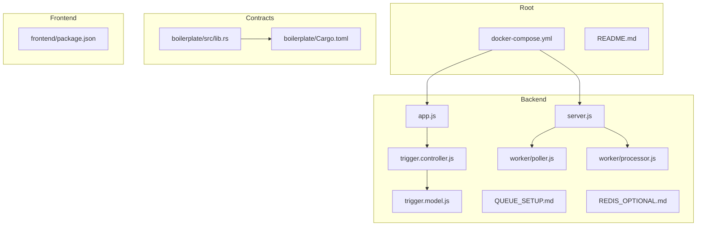
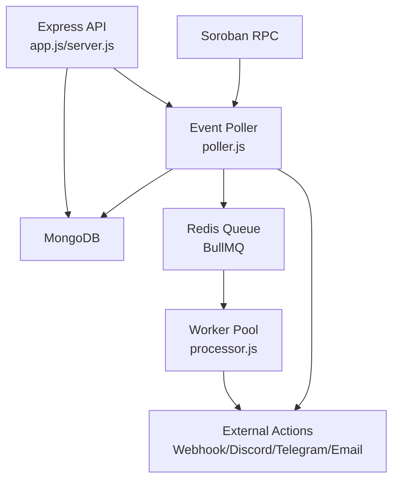
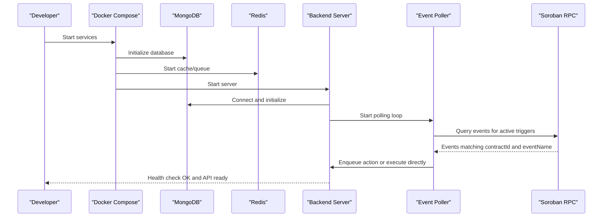
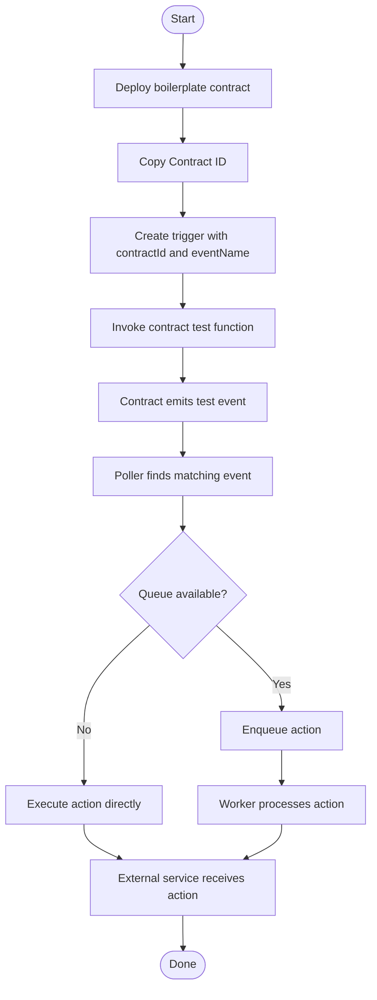
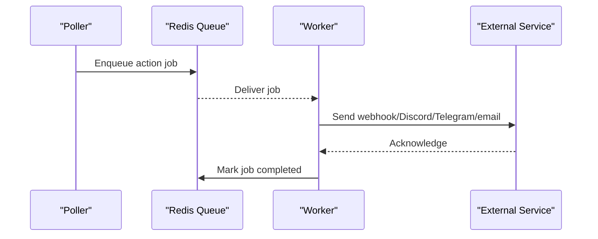
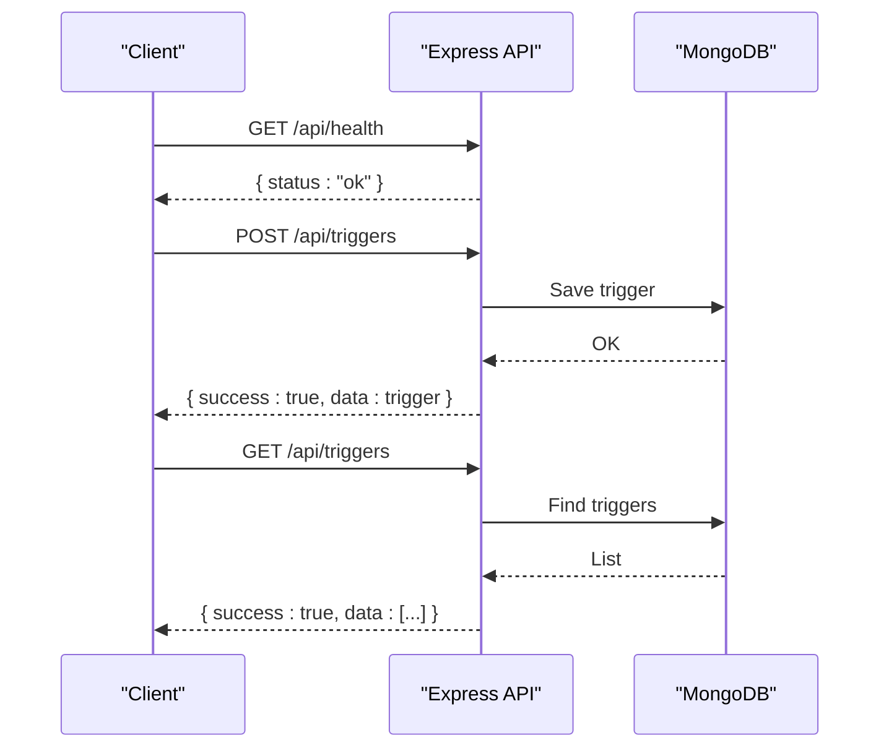
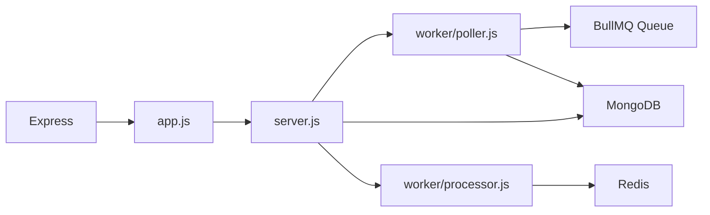

# Getting Started

<cite>
**Referenced Files in This Document**
- [README.md](file://README.md)
- [docker-compose.yml](file://docker-compose.yml)
- [backend/Dockerfile](file://backend/Dockerfile)
- [backend/package.json](file://backend/package.json)
- [backend/src/server.js](file://backend/src/server.js)
- [backend/src/app.js](file://backend/src/app.js)
- [backend/src/models/trigger.model.js](file://backend/src/models/trigger.model.js)
- [backend/src/controllers/trigger.controller.js](file://backend/src/controllers/trigger.controller.js)
- [backend/src/worker/poller.js](file://backend/src/worker/poller.js)
- [backend/src/worker/processor.js](file://backend/src/worker/processor.js)
- [backend/QUEUE_SETUP.md](file://backend/QUEUE_SETUP.md)
- [backend/REDIS_OPTIONAL.md](file://backend/REDIS_OPTIONAL.md)
- [contracts/boilerplate/Cargo.toml](file://contracts/boilerplate/Cargo.toml)
- [contracts/boilerplate/src/lib.rs](file://contracts/boilerplate/src/lib.rs)
</cite>

## Table of Contents
1. [Introduction](#introduction)
2. [Project Structure](#project-structure)
3. [Core Components](#core-components)
4. [Architecture Overview](#architecture-overview)
5. [Detailed Component Analysis](#detailed-component-analysis)
6. [Dependency Analysis](#dependency-analysis)
7. [Performance Considerations](#performance-considerations)
8. [Troubleshooting Guide](#troubleshooting-guide)
9. [Conclusion](#conclusion)
10. [Appendices](#appendices)

## Introduction
EventHorizon is a decentralized “If This Then That” (IFTTT) platform that listens for events emitted by Stellar Soroban smart contracts and triggers real-world Web2 actions such as webhooks, Discord notifications, or emails. This guide helps you install and run EventHorizon locally using Docker Compose, configure environment variables, deploy and test with the boilerplate contract, and verify system health. It also covers optional background job processing with Redis and provides troubleshooting tips.

## Project Structure
At a high level, the repository is organized into:
- backend: Node.js/Express server, worker poller, queue processor, and API routes
- frontend: Vite/React dashboard for managing triggers
- contracts: Rust-based Soroban contracts (including a boilerplate contract for testing)
- Root: Docker Compose orchestration, README, and top-level scripts

**Diagram sources**
- [docker-compose.yml:1-70](file://docker-compose.yml#L1-L70)
- [backend/src/server.js:1-88](file://backend/src/server.js#L1-L88)
- [backend/src/app.js:1-55](file://backend/src/app.js#L1-L55)
- [backend/src/models/trigger.model.js:1-80](file://backend/src/models/trigger.model.js#L1-L80)
- [backend/src/controllers/trigger.controller.js:1-72](file://backend/src/controllers/trigger.controller.js#L1-L72)
- [backend/src/worker/poller.js:1-335](file://backend/src/worker/poller.js#L1-L335)
- [backend/src/worker/processor.js:1-174](file://backend/src/worker/processor.js#L1-L174)
- [backend/QUEUE_SETUP.md:1-250](file://backend/QUEUE_SETUP.md#L1-L250)
- [backend/REDIS_OPTIONAL.md:1-203](file://backend/REDIS_OPTIONAL.md#L1-L203)
- [contracts/boilerplate/Cargo.toml:1-14](file://contracts/boilerplate/Cargo.toml#L1-L14)
- [contracts/boilerplate/src/lib.rs:1-18](file://contracts/boilerplate/src/lib.rs#L1-L18)

**Section sources**
- [README.md:10-17](file://README.md#L10-L17)
- [docker-compose.yml:1-70](file://docker-compose.yml#L1-L70)

## Core Components
- Backend server: Initializes Express app, connects to MongoDB, starts the event poller, and optionally the BullMQ worker. It exposes health checks and API endpoints.
- Event poller: Periodically queries the Soroban RPC for contract events, filters by contractId and eventName, and enqueues actions or executes them directly.
- Queue processor (BullMQ): Processes queued actions concurrently with retries and rate limiting when Redis is available.
- Trigger model: Stores trigger configurations, execution stats, and health metrics.
- Frontend: React/Vite dashboard for managing triggers and viewing queue stats.
- Boilerplate contract: Minimal Rust contract emitting a test event for quick validation.

**Section sources**
- [backend/src/server.js:34-67](file://backend/src/server.js#L34-L67)
- [backend/src/worker/poller.js:177-335](file://backend/src/worker/poller.js#L177-L335)
- [backend/src/worker/processor.js:102-174](file://backend/src/worker/processor.js#L102-L174)
- [backend/src/models/trigger.model.js:3-80](file://backend/src/models/trigger.model.js#L3-L80)
- [README.md:12-14](file://README.md#L12-L14)
- [contracts/boilerplate/src/lib.rs:9-14](file://contracts/boilerplate/src/lib.rs#L9-L14)

## Architecture Overview
The system polls the Soroban network for events, matches them against active triggers, and either enqueues actions for background processing (with Redis/BullMQ) or executes them synchronously (fallback). Actions are delivered to external services (webhooks, Discord, Telegram, email).

**Diagram sources**
- [backend/src/worker/poller.js:177-335](file://backend/src/worker/poller.js#L177-L335)
- [backend/src/worker/processor.js:102-174](file://backend/src/worker/processor.js#L102-L174)
- [backend/src/server.js:34-67](file://backend/src/server.js#L34-L67)

## Detailed Component Analysis

### Installation and Quick Start with Docker Compose
Follow these steps to run EventHorizon locally using Docker Compose:
1. Ensure prerequisites:
   - Docker and Docker Compose installed on your machine
2. Start the stack:
   - Bring up MongoDB, Redis, backend, and frontend containers
3. Verify services:
   - Backend health endpoint responds
   - Frontend is reachable at the configured port
4. Configure environment variables:
   - Provide SOROBAN_RPC_URL and MONGO_URI via .env
   - Optionally configure Redis variables if enabling background processing
5. Test with the boilerplate contract:
   - Deploy the boilerplate contract and copy its Contract ID
   - Create a trigger using the Contract ID and the event name emitted by the contract
   - Invoke the contract’s test function to emit the event
   - Observe the backend logs or webhook for the triggered action

**Diagram sources**
- [docker-compose.yml:1-70](file://docker-compose.yml#L1-L70)
- [backend/src/server.js:34-67](file://backend/src/server.js#L34-L67)
- [backend/src/worker/poller.js:177-335](file://backend/src/worker/poller.js#L177-L335)

**Section sources**
- [README.md:19-46](file://README.md#L19-L46)
- [docker-compose.yml:1-70](file://docker-compose.yml#L1-L70)
- [backend/Dockerfile:1-25](file://backend/Dockerfile#L1-L25)
- [backend/package.json:1-28](file://backend/package.json#L1-L28)

### Environment Variables and Configuration
Key environment variables:
- SOROBAN_RPC_URL: Soroban RPC endpoint (e.g., testnet)
- MONGO_URI: MongoDB connection string
- REDIS_HOST, REDIS_PORT, REDIS_PASSWORD: Redis connection details (optional)
- WORKER_CONCURRENCY: Number of concurrent workers (BullMQ)
- POLL_INTERVAL_MS: Polling interval for event checking
- RPC timeouts and retry settings are configurable via environment variables in the poller

Configure .env files in the root and backend directories with appropriate values. The backend Dockerfile sets NODE_ENV=production and runs as a non-root user.

**Section sources**
- [README.md:27-31](file://README.md#L27-L31)
- [backend/src/server.js:34-67](file://backend/src/server.js#L34-L67)
- [backend/src/worker/poller.js:5-16](file://backend/src/worker/poller.js#L5-L16)
- [backend/src/worker/processor.js:9-12](file://backend/src/worker/processor.js#L9-L12)
- [backend/Dockerfile:11-20](file://backend/Dockerfile#L11-L20)

### Smart Contract Deployment and Trigger Activation
Quick workflow using the boilerplate contract:
1. Build and deploy the boilerplate contract using the Soroban CLI
2. Copy the resulting Contract ID
3. Create a trigger via the API or dashboard using:
   - contractId: the copied Contract ID
   - eventName: the event name emitted by the contract (e.g., the test event)
   - actionType and actionUrl: choose webhook/Discord/Telegram/email
4. Invoke the contract’s test function to emit the event
5. Observe the backend logs or the external action being triggered

**Diagram sources**
- [contracts/boilerplate/src/lib.rs:9-14](file://contracts/boilerplate/src/lib.rs#L9-L14)
- [backend/src/worker/poller.js:177-335](file://backend/src/worker/poller.js#L177-L335)
- [backend/src/worker/processor.js:102-174](file://backend/src/worker/processor.js#L102-L174)

**Section sources**
- [README.md:57-62](file://README.md#L57-L62)
- [contracts/boilerplate/Cargo.toml:1-14](file://contracts/boilerplate/Cargo.toml#L1-L14)
- [contracts/boilerplate/src/lib.rs:9-14](file://contracts/boilerplate/src/lib.rs#L9-L14)

### Background Job Processing with Redis (Optional)
BullMQ with Redis enables reliable background processing:
- Guaranteed delivery, retries, concurrency control, and monitoring
- Graceful fallback to direct execution when Redis is unavailable
- Queue endpoints for stats, job listing, cleaning, and retry

**Diagram sources**
- [backend/src/worker/poller.js:55-147](file://backend/src/worker/poller.js#L55-L147)
- [backend/src/worker/processor.js:102-174](file://backend/src/worker/processor.js#L102-L174)
- [backend/QUEUE_SETUP.md:11-27](file://backend/QUEUE_SETUP.md#L11-L27)

**Section sources**
- [README.md:48-55](file://README.md#L48-L55)
- [backend/QUEUE_SETUP.md:1-250](file://backend/QUEUE_SETUP.md#L1-L250)
- [backend/REDIS_OPTIONAL.md:1-203](file://backend/REDIS_OPTIONAL.md#L1-L203)

### API Endpoints and Health Checks
- Health check: GET /api/health
- Triggers: CRUD endpoints for managing triggers
- Queue monitoring: Stats, job listing, cleanup, and retry endpoints (when Redis is available)

**Diagram sources**
- [backend/src/app.js:24-52](file://backend/src/app.js#L24-L52)
- [backend/src/controllers/trigger.controller.js:6-72](file://backend/src/controllers/trigger.controller.js#L6-L72)
- [backend/src/models/trigger.model.js:3-80](file://backend/src/models/trigger.model.js#L3-L80)

**Section sources**
- [backend/src/app.js:28-48](file://backend/src/app.js#L28-L48)
- [backend/src/controllers/trigger.controller.js:6-72](file://backend/src/controllers/trigger.controller.js#L6-L72)
- [backend/src/models/trigger.model.js:3-80](file://backend/src/models/trigger.model.js#L3-L80)

## Dependency Analysis
- Runtime dependencies include Express, Mongoose, BullMQ, ioredis, Axios, and Swagger UI
- The poller depends on the Soroban SDK to query events and on the queue or direct execution paths
- The processor depends on Redis connectivity and environment variables for concurrency and rate limiting

**Diagram sources**
- [backend/package.json:10-26](file://backend/package.json#L10-L26)
- [backend/src/server.js:12-18](file://backend/src/server.js#L12-L18)
- [backend/src/app.js:16-27](file://backend/src/app.js#L16-L27)
- [backend/src/worker/poller.js:1-335](file://backend/src/worker/poller.js#L1-L335)
- [backend/src/worker/processor.js:1-174](file://backend/src/worker/processor.js#L1-L174)

**Section sources**
- [backend/package.json:10-26](file://backend/package.json#L10-L26)
- [backend/src/server.js:12-18](file://backend/src/server.js#L12-L18)
- [backend/src/app.js:16-27](file://backend/src/app.js#L16-L27)

## Performance Considerations
- Use Redis/BullMQ for high reliability and concurrency; otherwise expect synchronous, blocking execution
- Tune worker concurrency and rate limits according to external service capabilities
- Monitor queue stats and adjust POLL_INTERVAL_MS and retry settings
- Keep the poller window size reasonable to avoid long scans

[No sources needed since this section provides general guidance]

## Troubleshooting Guide
Common issues and resolutions:
- MongoDB connection failures: verify MONGO_URI and container health
- Redis connectivity problems: ensure Redis is running and reachable; confirm host/port/password
- No queue endpoints: Redis not configured; fallback to direct execution
- Poller stuck or slow: reduce concurrency, increase intervals, or enable Redis
- External action failures: inspect logs for specific errors and validate credentials

Verification steps:
- Health check endpoint returns success
- Poller logs show event collection and action execution
- Queue stats endpoint available when Redis is configured
- Frontend dashboard loads and allows trigger creation

**Section sources**
- [backend/src/server.js:34-87](file://backend/src/server.js#L34-L87)
- [backend/REDIS_OPTIONAL.md:204-220](file://backend/REDIS_OPTIONAL.md#L204-L220)
- [backend/QUEUE_SETUP.md:204-220](file://backend/QUEUE_SETUP.md#L204-L220)

## Conclusion
You can run EventHorizon quickly with Docker Compose, configure environment variables, and validate the setup using the boilerplate contract. For production-grade reliability, enable Redis and monitor queue performance. Use the health checks and API endpoints to verify system status and manage triggers.

[No sources needed since this section summarizes without analyzing specific files]

## Appendices

### Appendix A: Environment Variables Reference
- SOROBAN_RPC_URL: Soroban RPC endpoint
- MONGO_URI: MongoDB connection string
- REDIS_HOST, REDIS_PORT, REDIS_PASSWORD: Redis connection details
- WORKER_CONCURRENCY: Worker concurrency for BullMQ
- POLL_INTERVAL_MS: Polling interval for event checks
- RPC timeouts and retry parameters are configurable in the poller module

**Section sources**
- [README.md:27-31](file://README.md#L27-L31)
- [backend/src/worker/poller.js:5-16](file://backend/src/worker/poller.js#L5-L16)
- [backend/src/worker/processor.js:9-12](file://backend/src/worker/processor.js#L9-L12)