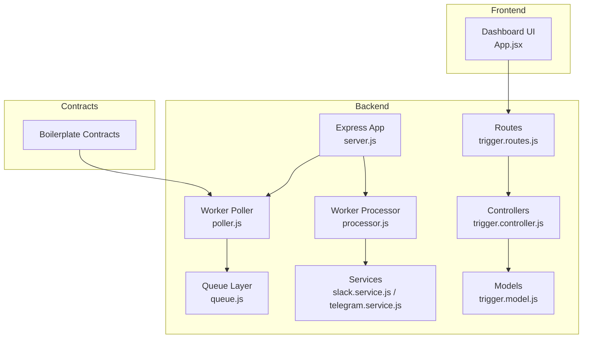
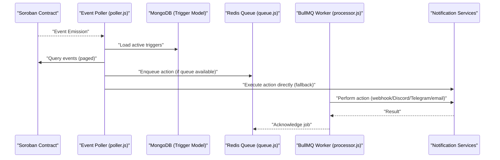
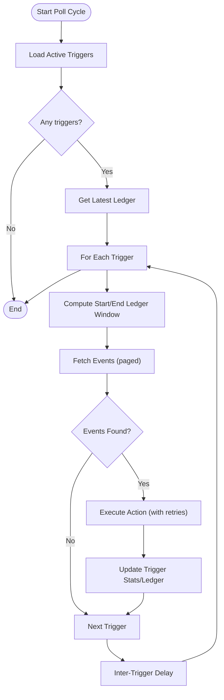
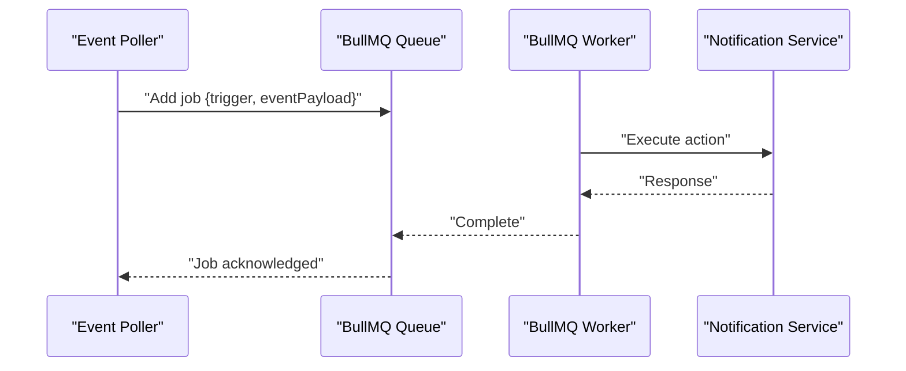
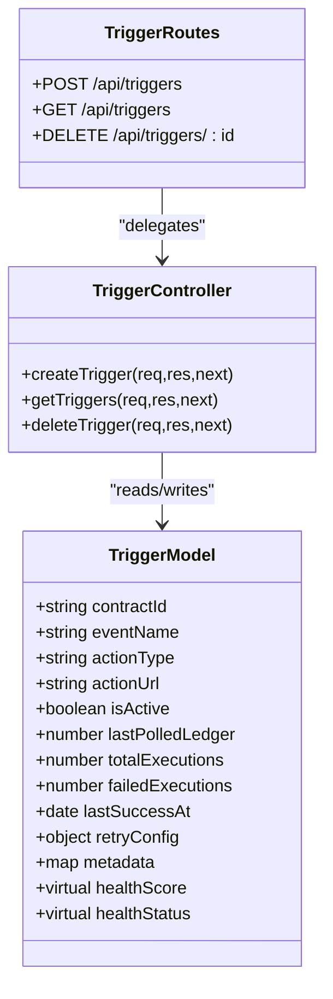
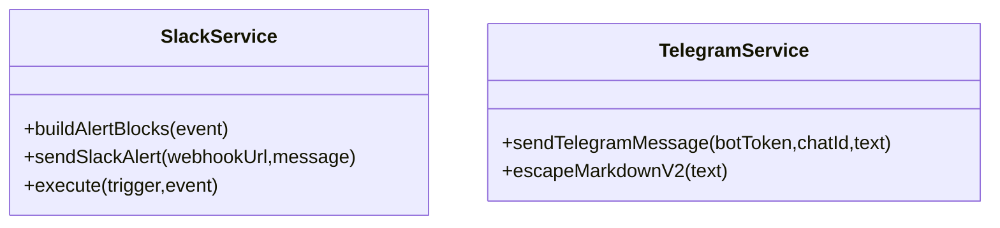
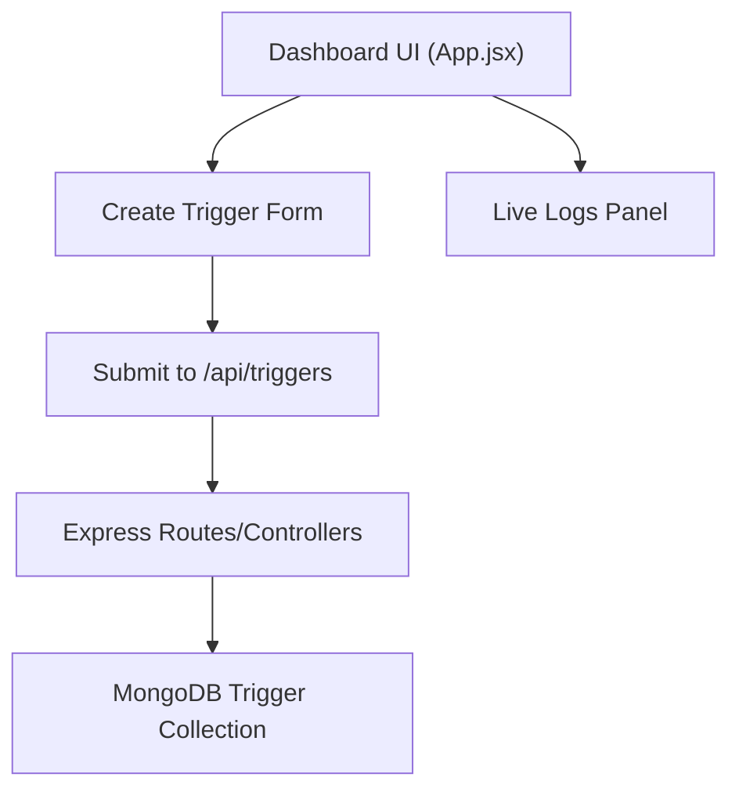
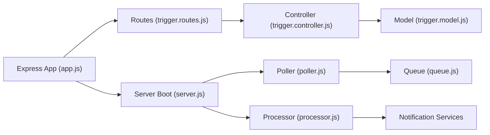

# Project Overview

<cite>
**Referenced Files in This Document**
- [README.md](file://README.md)
- [backend/src/server.js](file://backend/src/server.js)
- [backend/src/app.js](file://backend/src/app.js)
- [backend/src/worker/poller.js](file://backend/src/worker/poller.js)
- [backend/src/worker/processor.js](file://backend/src/worker/processor.js)
- [backend/src/worker/queue.js](file://backend/src/worker/queue.js)
- [backend/src/models/trigger.model.js](file://backend/src/models/trigger.model.js)
- [backend/src/controllers/trigger.controller.js](file://backend/src/controllers/trigger.controller.js)
- [backend/src/routes/trigger.routes.js](file://backend/src/routes/trigger.routes.js)
- [backend/src/services/slack.service.js](file://backend/src/services/slack.service.js)
- [backend/src/services/telegram.service.js](file://backend/src/services/telegram.service.js)
- [frontend/src/App.jsx](file://frontend/src/App.jsx)
- [backend/package.json](file://backend/package.json)
</cite>

## Table of Contents
1. [Introduction](#introduction)
2. [Project Structure](#project-structure)
3. [Core Components](#core-components)
4. [Architecture Overview](#architecture-overview)
5. [Detailed Component Analysis](#detailed-component-analysis)
6. [Dependency Analysis](#dependency-analysis)
7. [Performance Considerations](#performance-considerations)
8. [Troubleshooting Guide](#troubleshooting-guide)
9. [Conclusion](#conclusion)
10. [Appendices](#appendices)

## Introduction
EventHorizon is a decentralized “If This Then That” (IFTTT) platform that listens for specific events emitted by Stellar Soroban smart contracts and triggers real-world Web2 actions such as webhooks, Discord notifications, or emails. It enables developers and users to automate off-chain workflows in response to on-chain activity, bridging the gap between blockchain events and traditional application integrations.

At its core, EventHorizon implements an event-driven architecture:
- Smart contracts emit events on-chain.
- An event poller continuously scans the network for those events.
- Matching triggers activate worker-based actions, either directly or via a background job queue.
- Users manage triggers through a simple dashboard.

This design supports both beginner-friendly automation and robust production-grade reliability with retry logic, rate limiting, and optional Redis-backed job processing.

## Project Structure
The repository is organized into three primary areas:
- backend: Node.js/Express server, API routes, controllers, models, workers, and services.
- contracts: Example and boilerplate Soroban smart contracts for testing and demonstration.
- frontend: Vite/React dashboard for creating and managing triggers.

**Diagram sources**
- [backend/src/server.js:1-88](file://backend/src/server.js#L1-L88)
- [backend/src/routes/trigger.routes.js:1-92](file://backend/src/routes/trigger.routes.js#L1-L92)
- [backend/src/controllers/trigger.controller.js:1-72](file://backend/src/controllers/trigger.controller.js#L1-L72)
- [backend/src/models/trigger.model.js:1-80](file://backend/src/models/trigger.model.js#L1-L80)
- [backend/src/worker/poller.js:1-335](file://backend/src/worker/poller.js#L1-L335)
- [backend/src/worker/processor.js:1-174](file://backend/src/worker/processor.js#L1-L174)
- [backend/src/worker/queue.js:1-164](file://backend/src/worker/queue.js#L1-L164)
- [backend/src/services/slack.service.js:1-165](file://backend/src/services/slack.service.js#L1-L165)
- [backend/src/services/telegram.service.js:1-74](file://backend/src/services/telegram.service.js#L1-L74)
- [frontend/src/App.jsx:1-99](file://frontend/src/App.jsx#L1-L99)

**Section sources**
- [README.md:10-17](file://README.md#L10-L17)
- [backend/src/server.js:15-67](file://backend/src/server.js#L15-L67)
- [frontend/src/App.jsx:25-93](file://frontend/src/App.jsx#L25-L93)

## Core Components
- Triggers: Configurations stored in MongoDB that define which contract events should activate actions. They include contractId, eventName, actionType, actionUrl, retry policies, and operational metrics.
- Event Poller: A worker that periodically queries the Soroban network for events matching active triggers, then executes actions either directly or via the queue.
- Worker Processor: A BullMQ-based worker that consumes queued actions, performs retries, and handles external API calls with concurrency control.
- Queue Layer: Optional Redis-backed job queue enabling guaranteed delivery, retries, and monitoring.
- Notification Services: Built-in handlers for Discord, Slack, Telegram, and email notifications.
- Frontend Dashboard: A React interface for creating and viewing triggers and live logs.

Practical value proposition:
- Reduce manual intervention by automating off-chain reactions to on-chain events.
- Compose complex workflows by chaining multiple triggers and actions.
- Maintain observability with built-in metrics, health scoring, and queue stats.

Common use cases:
- Notify operators when a critical governance vote passes.
- Dispatch webhooks to internal systems upon liquidity provision events.
- Post alerts to Discord/Slack/Telegram channels when user claims rewards.
- Trigger email confirmations or marketing campaigns on specific contract events.

**Section sources**
- [backend/src/models/trigger.model.js:3-62](file://backend/src/models/trigger.model.js#L3-L62)
- [backend/src/worker/poller.js:177-310](file://backend/src/worker/poller.js#L177-L310)
- [backend/src/worker/processor.js:102-167](file://backend/src/worker/processor.js#L102-L167)
- [backend/src/worker/queue.js:19-121](file://backend/src/worker/queue.js#L19-L121)
- [backend/src/services/slack.service.js:142-159](file://backend/src/services/slack.service.js#L142-L159)
- [backend/src/services/telegram.service.js:15-70](file://backend/src/services/telegram.service.js#L15-L70)
- [frontend/src/App.jsx:25-93](file://frontend/src/App.jsx#L25-L93)

## Architecture Overview
EventHorizon follows an event-driven, observer-like pattern:
- Smart contracts emit events.
- The poller observes the chain and matches events against registered triggers.
- Actions are executed either synchronously (direct execution) or asynchronously (via BullMQ queue).
- The processor worker ensures resilience and controlled concurrency.

**Diagram sources**
- [backend/src/worker/poller.js:177-310](file://backend/src/worker/poller.js#L177-L310)
- [backend/src/worker/queue.js:91-121](file://backend/src/worker/queue.js#L91-L121)
- [backend/src/worker/processor.js:25-97](file://backend/src/worker/processor.js#L25-L97)
- [backend/src/models/trigger.model.js:1-80](file://backend/src/models/trigger.model.js#L1-L80)

## Detailed Component Analysis

### Event Poller (Observer Pattern Implementation)
The poller implements an observer-like loop that:
- Loads active triggers from the database.
- Queries the Soroban RPC for events within sliding ledger windows per trigger.
- Filters events by contractId and eventName.
- Executes actions with retry logic and updates trigger state.

Key behaviors:
- Sliding window polling per trigger to avoid reprocessing and reduce load.
- Exponential backoff for RPC calls and per-trigger retries.
- Pagination-aware event fetching with inter-page delays.
- Fallback to direct execution if Redis/BullMQ is unavailable.

**Diagram sources**
- [backend/src/worker/poller.js:177-310](file://backend/src/worker/poller.js#L177-L310)

**Section sources**
- [backend/src/worker/poller.js:177-310](file://backend/src/worker/poller.js#L177-L310)
- [backend/src/worker/poller.js:59-147](file://backend/src/worker/poller.js#L59-L147)

### Worker Processor and Queue Layer
The queue layer and worker provide:
- Guaranteed delivery with retries and exponential backoff.
- Concurrency control and rate limiting for external APIs.
- Rich monitoring endpoints for queue stats.
- Graceful degradation when Redis is unavailable (direct execution).

**Diagram sources**
- [backend/src/worker/queue.js:91-121](file://backend/src/worker/queue.js#L91-L121)
- [backend/src/worker/processor.js:25-97](file://backend/src/worker/processor.js#L25-L97)

**Section sources**
- [backend/src/worker/queue.js:19-121](file://backend/src/worker/queue.js#L19-L121)
- [backend/src/worker/processor.js:102-167](file://backend/src/worker/processor.js#L102-L167)

### Trigger Management (API and Model)
Triggers are persisted in MongoDB and managed via Express routes and controllers:
- Create/delete/list triggers.
- Validation middleware ensures correct payload structure.
- Trigger model includes health metrics and retry configuration.

**Diagram sources**
- [backend/src/models/trigger.model.js:3-79](file://backend/src/models/trigger.model.js#L3-L79)
- [backend/src/controllers/trigger.controller.js:6-71](file://backend/src/controllers/trigger.controller.js#L6-L71)
- [backend/src/routes/trigger.routes.js:57-89](file://backend/src/routes/trigger.routes.js#L57-L89)

**Section sources**
- [backend/src/models/trigger.model.js:3-79](file://backend/src/models/trigger.model.js#L3-L79)
- [backend/src/controllers/trigger.controller.js:6-71](file://backend/src/controllers/trigger.controller.js#L6-L71)
- [backend/src/routes/trigger.routes.js:57-89](file://backend/src/routes/trigger.routes.js#L57-L89)

### Notification Services
Built-in services handle popular Web2 channels:
- Slack: Builds rich Block Kit messages and handles rate limits.
- Telegram: Sends MarkdownV2-formatted messages and escapes special characters.
- Email and Discord: Additional integrations supported in the poller’s direct execution path.

**Diagram sources**
- [backend/src/services/slack.service.js:6-162](file://backend/src/services/slack.service.js#L6-L162)
- [backend/src/services/telegram.service.js:6-73](file://backend/src/services/telegram.service.js#L6-L73)

**Section sources**
- [backend/src/services/slack.service.js:142-159](file://backend/src/services/slack.service.js#L142-L159)
- [backend/src/services/telegram.service.js:15-70](file://backend/src/services/telegram.service.js#L15-L70)

### Frontend Dashboard
The React dashboard provides:
- A form to create new triggers with contractId, eventName, and webhookUrl.
- A live log panel showing worker activity.
- Placeholder for active listeners and future enhancements.

**Diagram sources**
- [frontend/src/App.jsx:25-93](file://frontend/src/App.jsx#L25-L93)
- [backend/src/routes/trigger.routes.js:57-89](file://backend/src/routes/trigger.routes.js#L57-L89)
- [backend/src/controllers/trigger.controller.js:6-28](file://backend/src/controllers/trigger.controller.js#L6-L28)

**Section sources**
- [frontend/src/App.jsx:25-93](file://frontend/src/App.jsx#L25-L93)
- [backend/src/routes/trigger.routes.js:57-89](file://backend/src/routes/trigger.routes.js#L57-L89)

## Dependency Analysis
High-level dependencies:
- Express app initializes routes, logging, and error handling.
- Server boots the poller and optionally the BullMQ worker.
- Poller depends on MongoDB for trigger state and optionally Redis for queue.
- Worker depends on Redis and BullMQ for job processing.
- Services depend on external APIs (Slack, Telegram, HTTP).

**Diagram sources**
- [backend/src/app.js:16-54](file://backend/src/app.js#L16-L54)
- [backend/src/server.js:44-58](file://backend/src/server.js#L44-L58)
- [backend/src/routes/trigger.routes.js:1-92](file://backend/src/routes/trigger.routes.js#L1-L92)
- [backend/src/controllers/trigger.controller.js:1-72](file://backend/src/controllers/trigger.controller.js#L1-L72)
- [backend/src/models/trigger.model.js:1-80](file://backend/src/models/trigger.model.js#L1-L80)
- [backend/src/worker/poller.js:59-147](file://backend/src/worker/poller.js#L59-L147)
- [backend/src/worker/processor.js:102-167](file://backend/src/worker/processor.js#L102-L167)
- [backend/src/worker/queue.js:19-121](file://backend/src/worker/queue.js#L19-L121)

**Section sources**
- [backend/package.json:10-22](file://backend/package.json#L10-L22)
- [backend/src/app.js:16-54](file://backend/src/app.js#L16-L54)
- [backend/src/server.js:44-58](file://backend/src/server.js#L44-L58)

## Performance Considerations
- Polling cadence and window sizing: Tune POLL_INTERVAL_MS and MAX_LEDGERS_PER_POLL to balance responsiveness and RPC load.
- Inter-request delays: INTER_TRIGGER_DELAY_MS and INTER_PAGE_DELAY_MS prevent rate limiting.
- Queue concurrency: Adjust WORKER_CONCURRENCY and external API rate limiter to match provider limits.
- Retry strategy: Per-trigger retryConfig and BullMQ default attempts provide resilience without overwhelming downstream services.
- Monitoring: Use queue stats endpoints to track backlog and adjust capacity.

[No sources needed since this section provides general guidance]

## Troubleshooting Guide
- Redis unavailable: The system falls back to direct execution. Verify Redis connectivity or disable queue features.
- Rate limits: External services (Slack, Telegram, webhooks) may throttle requests; configure retry intervals and monitor queue stats.
- Missing credentials: Ensure TELEGRAM_BOT_TOKEN and actionUrl/chatId are set for Telegram triggers.
- Health checks: Use /api/health to confirm the API is running; use /api/queue/stats to inspect queue status.
- Logging: Review server logs for RPC failures, action execution outcomes, and worker errors.

**Section sources**
- [backend/src/worker/poller.js:59-84](file://backend/src/worker/poller.js#L59-L84)
- [backend/src/worker/processor.js:145-159](file://backend/src/worker/processor.js#L145-L159)
- [backend/src/server.js:69-78](file://backend/src/server.js#L69-L78)

## Conclusion
EventHorizon delivers a production-ready bridge between Soroban smart contracts and Web2 automation. Its event-driven architecture, robust retry logic, and optional queue-based processing make it suitable for both prototyping and scaling. Developers can quickly register triggers, observe live events, and compose reliable workflows that react to on-chain activity.

[No sources needed since this section summarizes without analyzing specific files]

## Appendices

### Practical Examples and Use Cases
- Governance automation: Emit a webhook when a quorum threshold is met.
- DeFi notifications: Post Discord alerts when liquidity is added or removed.
- Rewards claiming: Send email confirmations when users claim yield.
- Cross-chain updates: Trigger Slack messages when cross-chain transfers settle.

[No sources needed since this section provides general guidance]