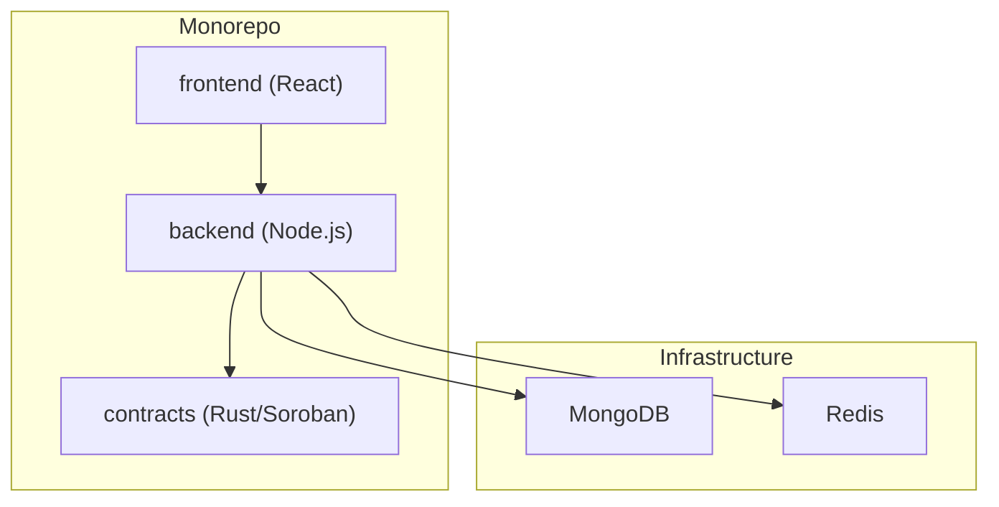
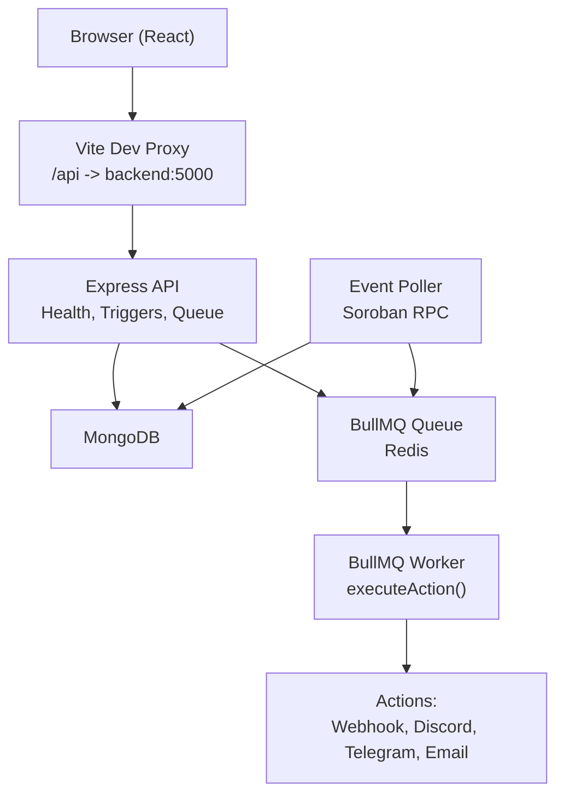
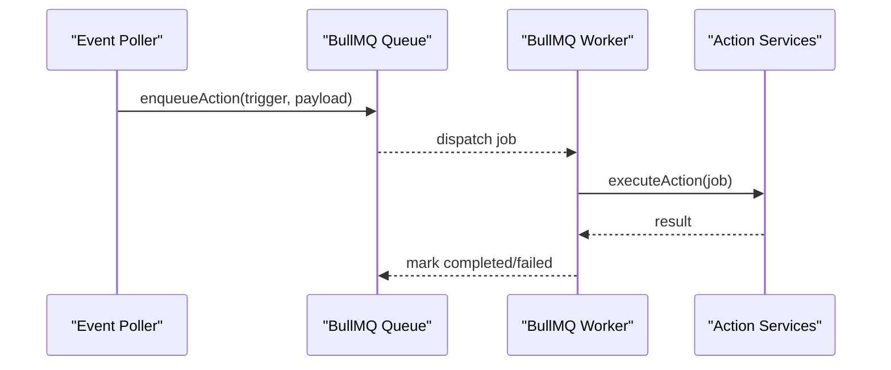
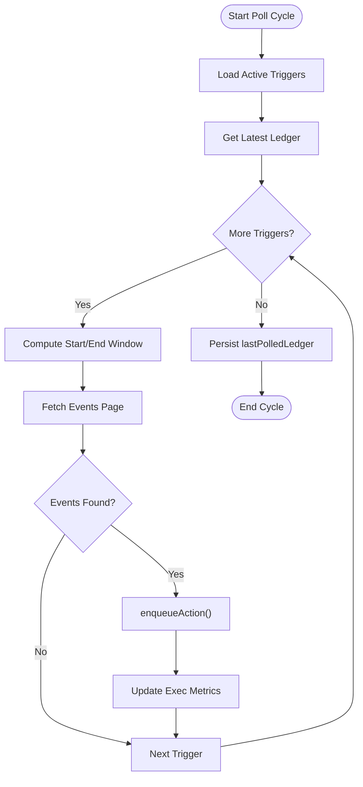
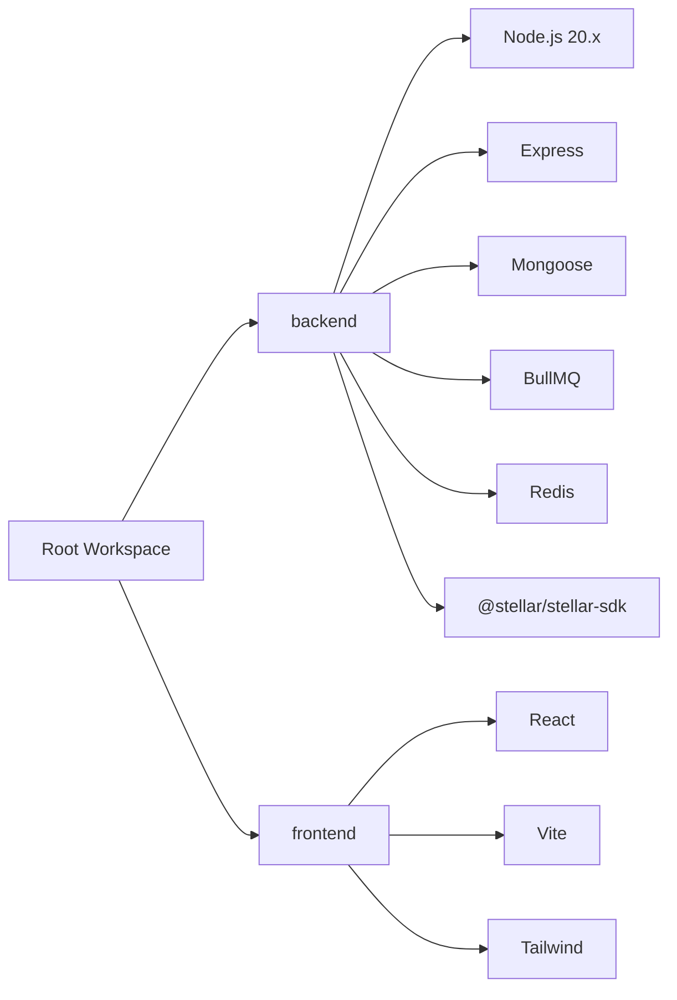

# Technology Stack

<cite>
**Referenced Files in This Document**
- [package.json](file://package.json)
- [backend/package.json](file://backend/package.json)
- [frontend/package.json](file://frontend/package.json)
- [docker-compose.yml](file://docker-compose.yml)
- [backend/Dockerfile](file://backend/Dockerfile)
- [backend/src/app.js](file://backend/src/app.js)
- [backend/src/server.js](file://backend/src/server.js)
- [backend/src/worker/queue.js](file://backend/src/worker/queue.js)
- [backend/src/worker/processor.js](file://backend/src/worker/processor.js)
- [backend/src/worker/poller.js](file://backend/src/worker/poller.js)
- [backend/src/models/trigger.model.js](file://backend/src/models/trigger.model.js)
- [backend/src/services/slack.service.js](file://backend/src/services/slack.service.js)
- [frontend/vite.config.js](file://frontend/vite.config.js)
- [frontend/tailwind.config.js](file://frontend/tailwind.config.js)
- [contracts/Cargo.toml](file://contracts/Cargo.toml)
</cite>

## Table of Contents
1. [Introduction](#introduction)
2. [Project Structure](#project-structure)
3. [Core Components](#core-components)
4. [Architecture Overview](#architecture-overview)
5. [Detailed Component Analysis](#detailed-component-analysis)
6. [Dependency Analysis](#dependency-analysis)
7. [Performance Considerations](#performance-considerations)
8. [Security Considerations](#security-considerations)
9. [Maintenance and Upgrade Strategies](#maintenance-and-upgrade-strategies)
10. [Troubleshooting Guide](#troubleshooting-guide)
11. [Conclusion](#conclusion)

## Introduction
This document describes the complete technology stack powering EventHorizon, a decentralized automation platform for Soroban smart contract events. It covers backend technologies (Node.js, Express, Mongoose, BullMQ), frontend technologies (React, Vite, Tailwind CSS), blockchain technologies (Rust, Soroban SDK), infrastructure (MongoDB, Redis, Docker), and operational concerns such as performance, security, and upgrades.

## Project Structure
EventHorizon is organized as a monorepo with workspaces for backend and frontend, plus a Rust workspace for smart contracts. Docker Compose orchestrates MongoDB, Redis, the backend service, and the frontend development server.

**Diagram sources**
- [docker-compose.yml:1-70](file://docker-compose.yml#L1-L70)
- [backend/src/server.js:34-59](file://backend/src/server.js#L34-L59)

**Section sources**
- [package.json:6-9](file://package.json#L6-L9)
- [docker-compose.yml:1-70](file://docker-compose.yml#L1-L70)

## Core Components
- Backend runtime and framework
  - Node.js 20.x (Dockerfile uses node:20-alpine)
  - Express web framework
  - Mongoose ODM for MongoDB
  - BullMQ for background job processing with Redis
  - @stellar/stellar-sdk for Soroban RPC interactions
- Frontend
  - React 18 with JSX transform via @vitejs/plugin-react-swc
  - Vite 4.x for dev/build tooling
  - Tailwind CSS 3.x for styling
- Blockchain
  - Rust workspace with LTO and optimized release profile
  - Soroban SDK via @stellar/stellar-sdk
- Infrastructure
  - MongoDB 7.x (container)
  - Redis 7.x (container)
  - Docker Compose orchestration

**Section sources**
- [backend/Dockerfile:1-25](file://backend/Dockerfile#L1-L25)
- [backend/package.json:10-26](file://backend/package.json#L10-L26)
- [frontend/package.json:12-30](file://frontend/package.json#L12-L30)
- [contracts/Cargo.toml:19-27](file://contracts/Cargo.toml#L19-L27)
- [docker-compose.yml:4-22](file://docker-compose.yml#L4-L22)

## Architecture Overview
The system polls Soroban testnet for contract events, persists trigger configurations in MongoDB, enqueues actions in Redis via BullMQ, and executes them asynchronously. The frontend proxies API requests to the backend.

**Diagram sources**
- [frontend/vite.config.js:7-12](file://frontend/vite.config.js#L7-L12)
- [backend/src/app.js:24-28](file://backend/src/app.js#L24-L28)
- [backend/src/server.js:34-59](file://backend/src/server.js#L34-L59)
- [backend/src/worker/poller.js:312-329](file://backend/src/worker/poller.js#L312-L329)
- [backend/src/worker/queue.js:19-41](file://backend/src/worker/queue.js#L19-L41)
- [backend/src/worker/processor.js:102-168](file://backend/src/worker/processor.js#L102-L168)

## Detailed Component Analysis

### Backend Runtime and Framework (Node.js + Express)
- Node.js 20.x runtime with Alpine Linux for minimal footprint and non-root user execution.
- Express app initializes CORS, JSON parsing, logging, rate limiting, and registers routes.
- Health endpoint exposed for monitoring.
- Graceful shutdown on SIGTERM closes workers and database connections.

**Section sources**
- [backend/Dockerfile:1-25](file://backend/Dockerfile#L1-L25)
- [backend/src/app.js:16-54](file://backend/src/app.js#L16-L54)
- [backend/src/server.js:60-79](file://backend/src/server.js#L60-L79)

### Database Layer (MongoDB + Mongoose)
- MongoDB connection established at startup; logs connection details and errors.
- Trigger model defines schema for contractId, eventName, actionType, actionUrl, activation state, polling progress, execution metrics, and retry configuration.
- Virtual fields compute healthScore and healthStatus.

**Section sources**
- [backend/src/server.js:35-42](file://backend/src/server.js#L35-L42)
- [backend/src/models/trigger.model.js:3-62](file://backend/src/models/trigger.model.js#L3-L62)

### Background Job Processing (BullMQ + Redis)
- Queue configuration with exponential backoff, completion/failure retention windows, and job deduplication via jobId.
- Worker supports concurrency, rate limiting, and emits lifecycle events (completed, failed, error).
- Action execution routes: email, Discord, Telegram, webhook; missing required fields produce explicit errors.

**Diagram sources**
- [backend/src/worker/poller.js:152-173](file://backend/src/worker/poller.js#L152-L173)
- [backend/src/worker/queue.js:91-121](file://backend/src/worker/queue.js#L91-L121)
- [backend/src/worker/processor.js:25-97](file://backend/src/worker/processor.js#L25-L97)

**Section sources**
- [backend/src/worker/queue.js:19-41](file://backend/src/worker/queue.js#L19-L41)
- [backend/src/worker/processor.js:102-168](file://backend/src/worker/processor.js#L102-L168)

### Event Polling and Soroban Integration
- Poller fetches active triggers, computes sliding ledger window per trigger, paginates events, and enqueues actions.
- Uses @stellar/stellar-sdk RPC client with exponential backoff and retry policies.
- Supports two modes: queue-backed (recommended) and direct execution (fallback).
- Exposes configuration via environment variables for RPC URL, timeouts, polling intervals, and rate limits.

**Diagram sources**
- [backend/src/worker/poller.js:177-302](file://backend/src/worker/poller.js#L177-L302)

**Section sources**
- [backend/src/worker/poller.js:5-16](file://backend/src/worker/poller.js#L5-L16)
- [backend/src/worker/poller.js:177-302](file://backend/src/worker/poller.js#L177-L302)

### Frontend (React + Vite + Tailwind CSS)
- React 18 with JSX transform via @vitejs/plugin-react-swc.
- Vite dev server runs on port 3000 with proxy to backend API.
- Tailwind CSS configured with custom colors and content paths.

**Section sources**
- [frontend/package.json:12-17](file://frontend/package.json#L12-L17)
- [frontend/vite.config.js:1-14](file://frontend/vite.config.js#L1-L14)
- [frontend/tailwind.config.js:1-17](file://frontend/tailwind.config.js#L1-L17)

### Blockchain Contracts (Rust + Soroban)
- Rust workspace with members for various contract types.
- Release profile enables LTO, size optimization, panic abort, and incremental disabled for faster builds.

**Section sources**
- [contracts/Cargo.toml:1-17](file://contracts/Cargo.toml#L1-L17)
- [contracts/Cargo.toml:19-27](file://contracts/Cargo.toml#L19-L27)

## Dependency Analysis
- Backend dependencies include Express, Mongoose, BullMQ, ioredis, @stellar/stellar-sdk, Joi, Swagger, and rate limiting.
- Frontend dependencies include React, React DOM, Axios, and Tailwind CSS with Vite toolchain.
- Root workspace ties together backend and frontend scripts for development and installation.

**Diagram sources**
- [package.json:6-9](file://package.json#L6-L9)
- [backend/package.json:10-26](file://backend/package.json#L10-L26)
- [frontend/package.json:12-30](file://frontend/package.json#L12-L30)

**Section sources**
- [package.json:10-14](file://package.json#L10-L14)
- [backend/package.json:10-26](file://backend/package.json#L10-L26)
- [frontend/package.json:12-30](file://frontend/package.json#L12-L30)

## Performance Considerations
- Polling window sizing and pagination reduce RPC load and memory usage.
- Exponential backoff and retry policies mitigate transient network errors.
- BullMQ job retention windows balance observability and storage costs.
- Worker concurrency and rate limiter prevent overload of external services.
- MongoDB indexing on contractId and metadata map keys improves query performance.
- Docker multi-stage build reduces production image size and attack surface.

**Section sources**
- [backend/src/worker/poller.js:10-16](file://backend/src/worker/poller.js#L10-L16)
- [backend/src/worker/queue.js:23-36](file://backend/src/worker/queue.js#L23-L36)
- [backend/src/worker/processor.js:128-135](file://backend/src/worker/processor.js#L128-L135)
- [backend/src/models/trigger.model.js:7,56](file://backend/src/models/trigger.model.js#L7,L56)
- [backend/Dockerfile:1-25](file://backend/Dockerfile#L1-L25)

## Security Considerations
- Non-root user in Docker image reduces privilege exposure.
- Environment-driven configuration for Redis credentials and RPC URLs.
- Rate limiting middleware protects endpoints from abuse.
- HTTPS and CORS policies should be enforced in production deployments.
- Secrets management (tokens, webhook URLs) should be externalized via environment variables or secret managers.

**Section sources**
- [backend/Dockerfile:13-20](file://backend/Dockerfile#L13-L20)
- [backend/src/worker/processor.js:9-12](file://backend/src/worker/processor.js#L9-L12)
- [backend/src/app.js:18-22](file://backend/src/app.js#L18-L22)

## Maintenance and Upgrade Strategies
- Version alignment
  - Node.js 20.x across Dockerfile, backend, and frontend toolchains.
  - Express and Mongoose major versions aligned with LTS stability goals.
  - BullMQ and ioredis versions support Redis Streams and modern connection handling.
- Upgrade paths
  - Backend: Pin patch/minor versions in CI; test BullMQ migration scripts if upgrading BullMQ major versions; validate Redis connectivity and queue retention policies.
  - Frontend: Lock Vite and plugin versions; run linting and build tests; verify Tailwind purging behavior.
  - Contracts: Use Cargo workspace updates; compile and test all member contracts; validate LTO impact on build times.
- Operational hygiene
  - Regular queue cleanup jobs to manage completed/failed job retention.
  - Monitor worker backpressure and adjust concurrency and rate limits.
  - Rotate MongoDB and Redis backups; monitor disk usage in Docker named volumes.

**Section sources**
- [backend/Dockerfile:2](file://backend/Dockerfile#L2)
- [backend/package.json:13,18](file://backend/package.json#L13,L18)
- [frontend/package.json:29](file://frontend/package.json#L29)
- [contracts/Cargo.toml:19-27](file://contracts/Cargo.toml#L19-L27)

## Troubleshooting Guide
- MongoDB connection failures
  - Verify MONGO_URI and network connectivity from backend container.
  - Check logs for connection errors and exit status.
- Redis and BullMQ issues
  - Ensure REDIS_HOST/PORT/PASSWORD are set; confirm queue availability and worker startup logs.
  - Inspect queue statistics and job counts for stuck or failing jobs.
- Poller errors
  - Review RPC URL, timeouts, and retry configuration; check rate limit responses from Soroban RPC.
  - Validate trigger configuration (actionUrl, tokens) and action-specific service endpoints.
- Frontend proxy problems
  - Confirm VITE_API_URL and port forwarding; ensure backend is reachable at /api.

**Section sources**
- [backend/src/server.js:80-87](file://backend/src/server.js#L80-L87)
- [backend/src/worker/queue.js:9-15](file://backend/src/worker/queue.js#L9-L15)
- [backend/src/worker/poller.js:312-329](file://backend/src/worker/poller.js#L312-L329)
- [frontend/vite.config.js:7-12](file://frontend/vite.config.js#L7-L12)

## Conclusion
EventHorizon combines a modern Node.js backend with robust background processing, a reactive React frontend, and a Rust-based smart contract suite. The stack emphasizes reliability (exponential backoff, queue retention), scalability (BullMQ concurrency, pagination), and operational simplicity (Docker Compose). Adhering to the upgrade and maintenance strategies outlined here will keep the system secure, performant, and maintainable over time.