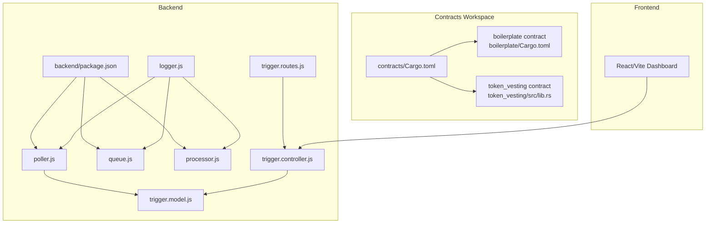
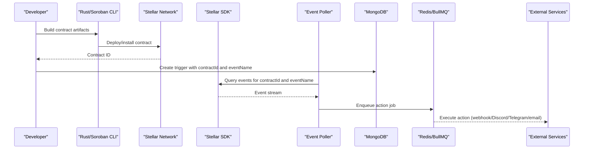
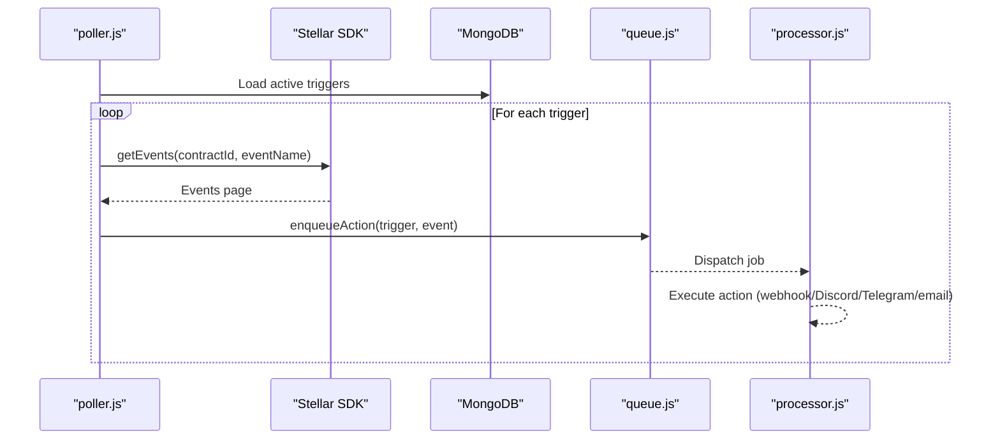
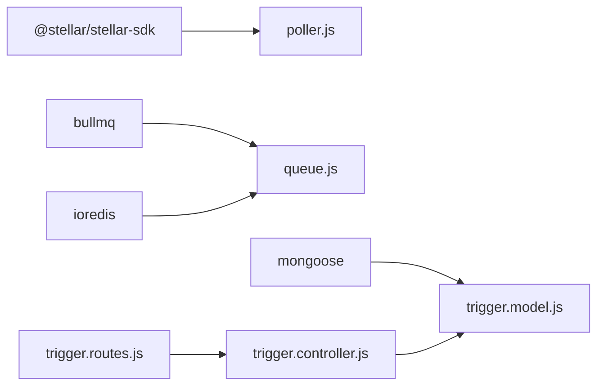

# Contract Deployment Procedures

<cite>
**Referenced Files in This Document**
- [README.md](file://README.md)
- [contracts/Cargo.toml](file://contracts/Cargo.toml)
- [backend/package.json](file://backend/package.json)
- [backend/src/config/logger.js](file://backend/src/config/logger.js)
- [backend/src/worker/poller.js](file://backend/src/worker/poller.js)
- [backend/src/worker/queue.js](file://backend/src/worker/queue.js)
- [backend/src/worker/processor.js](file://backend/src/worker/processor.js)
- [backend/src/models/trigger.model.js](file://backend/src/models/trigger.model.js)
- [backend/src/controllers/trigger.controller.js](file://backend/src/controllers/trigger.controller.js)
- [backend/src/routes/trigger.routes.js](file://backend/src/routes/trigger.routes.js)
- [backend/QUEUE_SETUP.md](file://backend/QUEUE_SETUP.md)
- [contracts/boilerplate/src/lib.rs](file://contracts/boilerplate/src/lib.rs)
- [contracts/boilerplate/Cargo.toml](file://contracts/boilerplate/Cargo.toml)
- [contracts/token_vesting/src/lib.rs](file://contracts/token_vesting/src/lib.rs)
</cite>

## Table of Contents
1. [Introduction](#introduction)
2. [Project Structure](#project-structure)
3. [Core Components](#core-components)
4. [Architecture Overview](#architecture-overview)
5. [Detailed Component Analysis](#detailed-component-analysis)
6. [Dependency Analysis](#dependency-analysis)
7. [Performance Considerations](#performance-considerations)
8. [Troubleshooting Guide](#troubleshooting-guide)
9. [Conclusion](#conclusion)
10. [Appendices](#appendices)

## Introduction
This document describes the complete workflow for deploying Soroban contracts in EventHorizon, including building contracts with Rust and the Soroban CLI, configuring networks for testnet and mainnet, installing contracts, setting up contract IDs and triggers, and configuring administrative permissions and initial state. It also provides step-by-step deployment guides per environment, troubleshooting tips, best practices for lifecycle management, and guidance for upgrades and backward compatibility.

## Project Structure
EventHorizon comprises:
- Contracts workspace under contracts/ containing multiple Rust-based Soroban contracts
- Backend Node.js server that polls Soroban events and executes actions
- Frontend dashboard for managing triggers (not required for deployment but used to configure triggers)

**Diagram sources**
- [contracts/Cargo.toml:1-27](file://contracts/Cargo.toml#L1-L27)
- [contracts/boilerplate/Cargo.toml:1-14](file://contracts/boilerplate/Cargo.toml#L1-L14)
- [contracts/token_vesting/src/lib.rs:1-155](file://contracts/token_vesting/src/lib.rs#L1-L155)
- [backend/package.json:1-28](file://backend/package.json#L1-L28)
- [backend/src/worker/poller.js:1-335](file://backend/src/worker/poller.js#L1-L335)
- [backend/src/worker/queue.js:1-164](file://backend/src/worker/queue.js#L1-L164)
- [backend/src/worker/processor.js:1-174](file://backend/src/worker/processor.js#L1-L174)
- [backend/src/models/trigger.model.js:1-80](file://backend/src/models/trigger.model.js#L1-L80)
- [backend/src/controllers/trigger.controller.js:1-72](file://backend/src/controllers/trigger.controller.js#L1-L72)
- [backend/src/routes/trigger.routes.js:1-92](file://backend/src/routes/trigger.routes.js#L1-L92)
- [backend/src/config/logger.js:1-19](file://backend/src/config/logger.js#L1-L19)

**Section sources**
- [README.md:10-17](file://README.md#L10-L17)
- [contracts/Cargo.toml:1-27](file://contracts/Cargo.toml#L1-L27)
- [backend/package.json:1-28](file://backend/package.json#L1-L28)

## Core Components
- Contracts workspace: A Rust workspace with multiple contracts. Each contract defines its own crate-type and dependencies. The boilerplate contract demonstrates emitting a test event that EventHorizon can detect.
- Backend worker: Polls Soroban for events, enqueues actions (webhook, Discord, Telegram, email), and executes them either directly or via Redis/BullMQ.
- Trigger management: MongoDB-backed triggers define contractId, eventName, actionType, and retry behavior. The dashboard can be used to manage triggers.

Key deployment-relevant elements:
- Network configuration for RPC endpoints and timeouts
- Queue system for background job processing
- Trigger persistence and health metrics
- Logging and error reporting

**Section sources**
- [contracts/boilerplate/src/lib.rs:1-18](file://contracts/boilerplate/src/lib.rs#L1-L18)
- [backend/src/worker/poller.js:5-16](file://backend/src/worker/poller.js#L5-L16)
- [backend/src/worker/queue.js:1-164](file://backend/src/worker/queue.js#L1-L164)
- [backend/src/models/trigger.model.js:3-62](file://backend/src/models/trigger.model.js#L3-L62)
- [backend/src/config/logger.js:1-19](file://backend/src/config/logger.js#L1-L19)

## Architecture Overview
The deployment pipeline integrates contract development, installation, and runtime monitoring:

**Diagram sources**
- [backend/src/worker/poller.js:177-310](file://backend/src/worker/poller.js#L177-L310)
- [backend/src/worker/queue.js:91-121](file://backend/src/worker/queue.js#L91-L121)
- [backend/src/models/trigger.model.js:3-62](file://backend/src/models/trigger.model.js#L3-L62)
- [backend/src/controllers/trigger.controller.js:6-28](file://backend/src/controllers/trigger.controller.js#L6-L28)

## Detailed Component Analysis

### Contract Compilation and Installation
- Build contracts using Rust and the Soroban CLI within the contracts workspace.
- The contracts workspace is defined in the top-level Cargo manifest, enabling building all members in one go.
- After successful build, install the contract on-chain to obtain a persistent Contract ID.

Recommended steps:
1. Navigate to the contracts directory and build all members using the workspace configuration.
2. Use the Soroban CLI to install the built artifact on the target network.
3. Capture the returned Contract ID for use in triggers.

References:
- Workspace definition and release profile for optimized builds
- Boilerplate contract example for emitting test events

**Section sources**
- [contracts/Cargo.toml:1-27](file://contracts/Cargo.toml#L1-L27)
- [contracts/boilerplate/Cargo.toml:1-14](file://contracts/boilerplate/Cargo.toml#L1-L14)
- [contracts/boilerplate/src/lib.rs:9-14](file://contracts/boilerplate/src/lib.rs#L9-L14)

### Network Configuration for Testnet and Mainnet
- The backend reads the RPC URL from an environment variable and sets a default testnet endpoint.
- Adjust RPC settings for testnet vs mainnet by changing the RPC URL and related timeouts.

Key environment variables and defaults:
- SOROBAN_RPC_URL: default points to testnet; override for mainnet
- RPC timeouts and retry behavior are configurable

**Section sources**
- [backend/src/worker/poller.js:5-8](file://backend/src/worker/poller.js#L5-L8)
- [README.md:27-31](file://README.md#L27-L31)

### Setting Up Contract IDs and Triggers
- Store the Contract ID returned during installation.
- Create a trigger in the database with:
  - contractId: the installed Contract ID
  - eventName: the event to watch for
  - actionType: webhook, discord, email, or telegram
  - actionUrl: destination URL or service-specific identifiers
  - Optional: retryConfig, priority, and metadata

The trigger model supports indexing and virtual health metrics for monitoring.

**Section sources**
- [backend/src/models/trigger.model.js:3-62](file://backend/src/models/trigger.model.js#L3-L62)
- [backend/src/controllers/trigger.controller.js:6-28](file://backend/src/controllers/trigger.controller.js#L6-L28)
- [backend/src/routes/trigger.routes.js:9-62](file://backend/src/routes/trigger.routes.js#L9-L62)

### Administrative Permissions and Initial State
- Contracts may enforce authorization checks (e.g., requiring specific addresses to call privileged functions).
- Initialize contracts with appropriate state (e.g., recipient, token, amounts, timestamps) via initializer functions.
- Emit events from contracts to signal state changes for EventHorizon to consume.

Examples:
- Token vesting contract initializes vesting schedules and emits events upon claims.
- Boilerplate contract emits a test event suitable for verification.

**Section sources**
- [contracts/token_vesting/src/lib.rs:31-63](file://contracts/token_vesting/src/lib.rs#L31-L63)
- [contracts/token_vesting/src/lib.rs:74-103](file://contracts/token_vesting/src/lib.rs#L74-L103)
- [contracts/boilerplate/src/lib.rs:9-14](file://contracts/boilerplate/src/lib.rs#L9-L14)

### Step-by-Step Deployment Guides

#### Testnet Deployment
1. Prepare environment:
   - Set SOROBAN_RPC_URL to the testnet endpoint.
   - Ensure prerequisites (Node.js, MongoDB, Redis optional) are installed.
2. Build contracts:
   - Use the workspace Cargo configuration to compile all member contracts.
3. Install contract:
   - Use the Soroban CLI to install the compiled artifact on testnet.
   - Record the returned Contract ID.
4. Configure trigger:
   - Create a trigger with the Contract ID and desired eventName.
   - Choose actionType and set actionUrl accordingly.
5. Verify:
   - Invoke the contract’s function that emits the watched event.
   - Confirm the backend logs and external service receive the action.

**Section sources**
- [README.md:27-31](file://README.md#L27-L31)
- [backend/src/worker/poller.js:177-310](file://backend/src/worker/poller.js#L177-L310)
- [backend/src/models/trigger.model.js:3-62](file://backend/src/models/trigger.model.js#L3-L62)

#### Mainnet Deployment
1. Prepare environment:
   - Change SOROBAN_RPC_URL to a mainnet endpoint.
   - Review RPC timeouts and retry settings for mainnet latency.
2. Build and install:
   - Repeat build and install steps on mainnet.
   - Capture the Contract ID.
3. Configure trigger:
   - Create the trigger with the mainnet Contract ID.
4. Monitor:
   - Observe queue and action execution logs for reliability and performance.

**Section sources**
- [backend/src/worker/poller.js:5-8](file://backend/src/worker/poller.js#L5-L8)
- [backend/QUEUE_SETUP.md:81-96](file://backend/QUEUE_SETUP.md#L81-L96)

### Runtime Event Polling and Action Execution
- The poller queries events for each active trigger, paginates results, and executes actions with retry logic.
- Actions are enqueued to Redis via BullMQ for background processing, or executed directly if Redis is unavailable.

**Diagram sources**
- [backend/src/worker/poller.js:177-310](file://backend/src/worker/poller.js#L177-L310)
- [backend/src/worker/queue.js:91-121](file://backend/src/worker/queue.js#L91-L121)
- [backend/src/worker/processor.js:25-97](file://backend/src/worker/processor.js#L25-L97)

**Section sources**
- [backend/src/worker/poller.js:177-310](file://backend/src/worker/poller.js#L177-L310)
- [backend/src/worker/queue.js:1-164](file://backend/src/worker/queue.js#L1-L164)
- [backend/src/worker/processor.js:1-174](file://backend/src/worker/processor.js#L1-L174)

### Contract Upgrade Procedures and Backward Compatibility
- Upgrades typically involve installing a new contract version and updating triggers to point to the new Contract ID.
- Maintain backward compatibility by:
  - Keeping the same event signatures and names
  - Avoiding breaking changes to public APIs
  - Introducing new functions alongside legacy ones during transition
- After migration, update triggers to the new Contract ID and validate event emission and action execution.

[No sources needed since this section provides general guidance]

## Dependency Analysis
- Backend depends on the Stellar SDK for RPC interactions and on BullMQ/Redis for background job processing.
- Contracts depend on the Soroban SDK and define their own crate-type for deployment targets.
- Triggers persist in MongoDB and are managed via controller and route handlers.

**Diagram sources**
- [backend/package.json:10-22](file://backend/package.json#L10-L22)
- [backend/src/worker/poller.js:1-10](file://backend/src/worker/poller.js#L1-L10)
- [backend/src/worker/queue.js:1-15](file://backend/src/worker/queue.js#L1-L15)
- [backend/src/models/trigger.model.js:1-3](file://backend/src/models/trigger.model.js#L1-L3)

**Section sources**
- [backend/package.json:10-22](file://backend/package.json#L10-L22)
- [backend/src/models/trigger.model.js:1-3](file://backend/src/models/trigger.model.js#L1-L3)

## Performance Considerations
- Tune polling intervals and ledger window sizes to balance responsiveness and RPC load.
- Use Redis/BullMQ for high-volume action execution to avoid blocking the event poller.
- Adjust worker concurrency and rate limiting to match downstream service capacity.
- Monitor queue statistics and health metrics for triggers to detect bottlenecks.

[No sources needed since this section provides general guidance]

## Troubleshooting Guide
Common issues and resolutions:
- RPC connectivity failures: Verify SOROBAN_RPC_URL and network reachability; the poller implements exponential backoff.
- Missing Redis: The system falls back to direct execution; install Redis to enable background processing.
- Queue stuck jobs: Check worker logs and restart the server; adjust concurrency and retention policies.
- Trigger not firing: Confirm contractId and eventName match; ensure the contract emits the expected event.
- Action failures: Inspect action-specific credentials and URLs; review retry configuration.

**Section sources**
- [backend/src/worker/poller.js:27-51](file://backend/src/worker/poller.js#L27-L51)
- [backend/src/worker/poller.js:59-76](file://backend/src/worker/poller.js#L59-L76)
- [backend/QUEUE_SETUP.md:204-220](file://backend/QUEUE_SETUP.md#L204-L220)
- [backend/src/models/trigger.model.js:64-77](file://backend/src/models/trigger.model.js#L64-L77)

## Conclusion
Deploying Soroban contracts in EventHorizon involves building and installing contracts, capturing Contract IDs, registering triggers, and configuring network and queue settings. The backend’s poller and queue system provide robust event detection and action execution. Follow environment-specific configurations, maintain backward compatibility during upgrades, and monitor performance and health metrics for reliable operations.

[No sources needed since this section summarizes without analyzing specific files]

## Appendices

### Appendix A: Environment Variables Reference
- SOROBAN_RPC_URL: RPC endpoint for the target network
- RPC_TIMEOUT_MS, RPC_MAX_RETRIES, RPC_BASE_DELAY_MS: Poller retry and timeout settings
- REDIS_HOST, REDIS_PORT, REDIS_PASSWORD: Redis connection settings
- WORKER_CONCURRENCY: Concurrent job processing threads
- POLL_INTERVAL_MS: Interval between polling cycles

**Section sources**
- [backend/src/worker/poller.js:5-16](file://backend/src/worker/poller.js#L5-L16)
- [backend/src/worker/processor.js:9-12](file://backend/src/worker/processor.js#L9-L12)
- [backend/QUEUE_SETUP.md:83-88](file://backend/QUEUE_SETUP.md#L83-L88)

### Appendix B: Example Contract Event Emission
- The boilerplate contract emits a test event suitable for verifying deployment and trigger configuration.

**Section sources**
- [contracts/boilerplate/src/lib.rs:9-14](file://contracts/boilerplate/src/lib.rs#L9-L14)