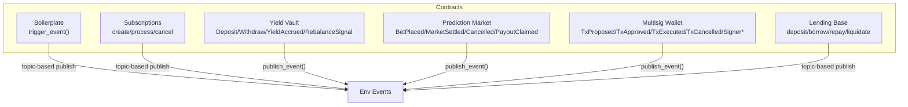
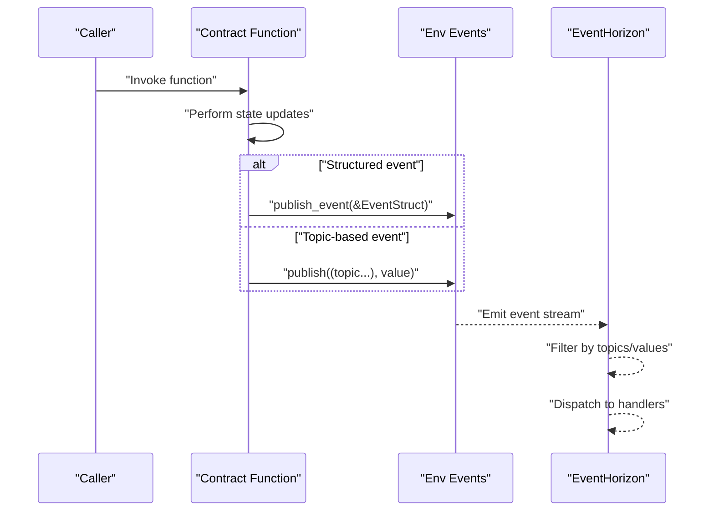
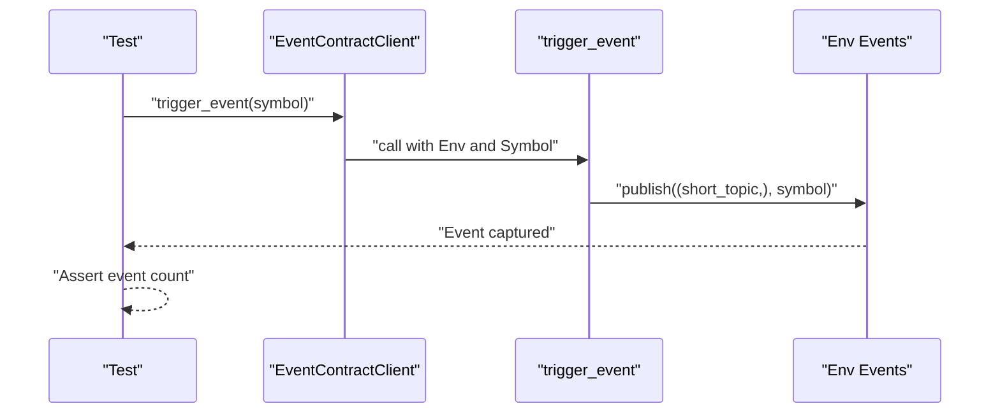
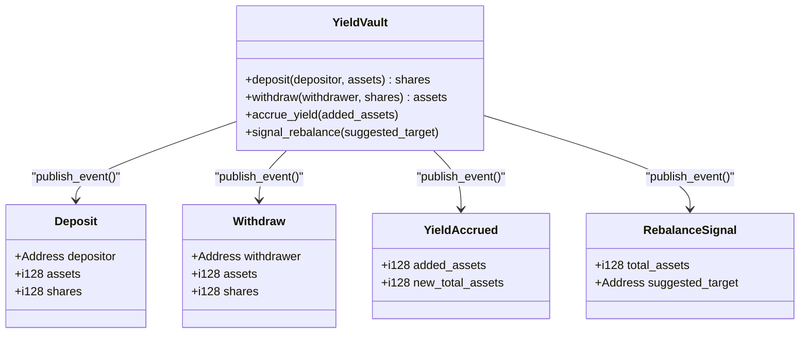
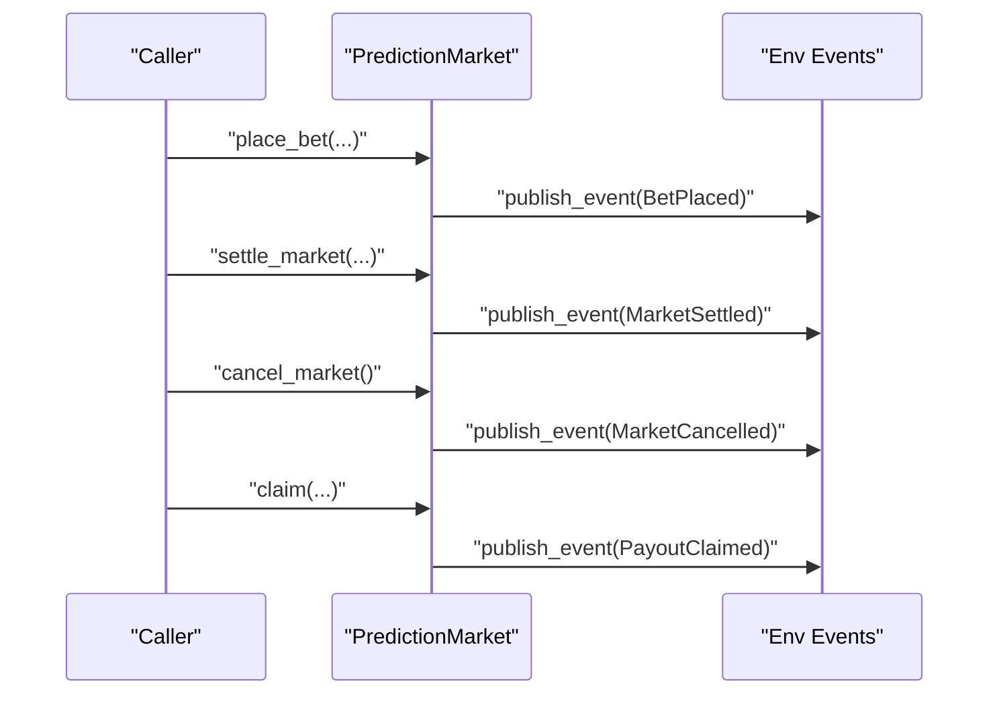
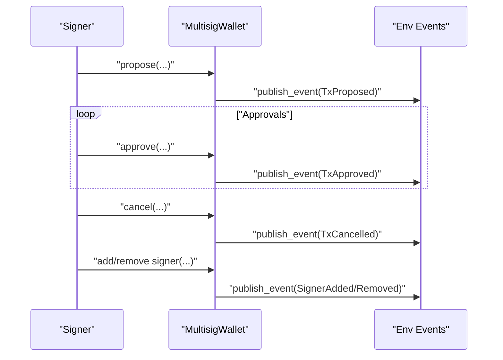
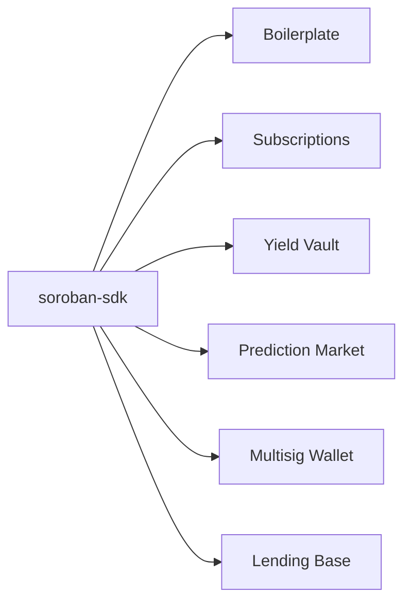

# Event Emission Patterns

<cite>
**Referenced Files in This Document**
- [lib.rs](file://contracts/boilerplate/src/lib.rs)
- [test.rs](file://contracts/boilerplate/src/test.rs)
- [lib.rs](file://contracts/subscriptions/src/lib.rs)
- [lib.rs](file://contracts/yield_vault/src/lib.rs)
- [lib.rs](file://contracts/prediction_market/src/lib.rs)
- [lib.rs](file://contracts/multisig_wallet/src/lib.rs)
- [lib.rs](file://contracts/lending_base/src/lib.rs)
- [Cargo.toml](file://contracts/boilerplate/Cargo.toml)
</cite>

## Table of Contents
1. [Introduction](#introduction)
2. [Project Structure](#project-structure)
3. [Core Components](#core-components)
4. [Architecture Overview](#architecture-overview)
5. [Detailed Component Analysis](#detailed-component-analysis)
6. [Dependency Analysis](#dependency-analysis)
7. [Performance Considerations](#performance-considerations)
8. [Troubleshooting Guide](#troubleshooting-guide)
9. [Conclusion](#conclusion)

## Introduction
This document explains event emission patterns in EventHorizon’s Soroban smart contracts. It focuses on how to emit events using the SDK’s event system, including topic-based publishing with env.events().publish() and strongly-typed events via contractevent. It also covers best practices for event naming, topic organization, payload structure, filtering strategies, and debugging techniques grounded in the repository’s contracts and tests.

## Project Structure
Event emission occurs across multiple contracts. The boilerplate contract demonstrates minimal topic-based event emission. Other contracts showcase structured event types and advanced topic combinations:
- Boilerplate: Demonstrates env.events().publish() with a short topic and a value.
- Subscriptions: Emits topic-based events with multiple topic components and values.
- Yield Vault: Uses contractevent structs published via env.events().publish_event().
- Prediction Market: Emits strongly typed events for betting, settlement, cancellation, and payouts.
- Multisig Wallet: Emits strongly typed events for governance lifecycle events.
- Lending Base: Emits topic-based events for deposit, borrow, repay, and liquidation.



**Diagram sources**
- [lib.rs:11-14](file://contracts/boilerplate/src/lib.rs#L11-L14)
- [lib.rs:67-70](file://contracts/subscriptions/src/lib.rs#L67-L70)
- [lib.rs:102-105](file://contracts/subscriptions/src/lib.rs#L102-L105)
- [lib.rs](file://contracts/yield_vault/src/lib.rs#L93)
- [lib.rs](file://contracts/yield_vault/src/lib.rs#L118)
- [lib.rs](file://contracts/yield_vault/src/lib.rs#L139)
- [lib.rs](file://contracts/yield_vault/src/lib.rs#L148)
- [lib.rs](file://contracts/prediction_market/src/lib.rs#L114)
- [lib.rs](file://contracts/prediction_market/src/lib.rs#L134)
- [lib.rs](file://contracts/prediction_market/src/lib.rs#L142)
- [lib.rs](file://contracts/prediction_market/src/lib.rs#L195)
- [lib.rs](file://contracts/multisig_wallet/src/lib.rs#L91)
- [lib.rs](file://contracts/multisig_wallet/src/lib.rs#L108)
- [lib.rs](file://contracts/multisig_wallet/src/lib.rs#L147)
- [lib.rs](file://contracts/multisig_wallet/src/lib.rs#L178)
- [lib.rs](file://contracts/multisig_wallet/src/lib.rs#L196)
- [lib.rs](file://contracts/lending_base/src/lib.rs#L65)
- [lib.rs](file://contracts/lending_base/src/lib.rs#L102)
- [lib.rs](file://contracts/lending_base/src/lib.rs#L124)
- [lib.rs:155-158](file://contracts/lending_base/src/lib.rs#L155-L158)

**Section sources**
- [lib.rs:11-14](file://contracts/boilerplate/src/lib.rs#L11-L14)
- [lib.rs:67-70](file://contracts/subscriptions/src/lib.rs#L67-L70)
- [lib.rs:102-105](file://contracts/subscriptions/src/lib.rs#L102-L105)
- [lib.rs](file://contracts/yield_vault/src/lib.rs#L93)
- [lib.rs](file://contracts/yield_vault/src/lib.rs#L118)
- [lib.rs](file://contracts/yield_vault/src/lib.rs#L139)
- [lib.rs](file://contracts/yield_vault/src/lib.rs#L148)
- [lib.rs](file://contracts/prediction_market/src/lib.rs#L114)
- [lib.rs](file://contracts/prediction_market/src/lib.rs#L134)
- [lib.rs](file://contracts/prediction_market/src/lib.rs#L142)
- [lib.rs](file://contracts/prediction_market/src/lib.rs#L195)
- [lib.rs](file://contracts/multisig_wallet/src/lib.rs#L91)
- [lib.rs](file://contracts/multisig_wallet/src/lib.rs#L108)
- [lib.rs](file://contracts/multisig_wallet/src/lib.rs#L147)
- [lib.rs](file://contracts/multisig_wallet/src/lib.rs#L178)
- [lib.rs](file://contracts/multisig_wallet/src/lib.rs#L196)
- [lib.rs](file://contracts/lending_base/src/lib.rs#L65)
- [lib.rs](file://contracts/lending_base/src/lib.rs#L102)
- [lib.rs](file://contracts/lending_base/src/lib.rs#L124)
- [lib.rs:155-158](file://contracts/lending_base/src/lib.rs#L155-L158)

## Core Components
- Topic-based publishing: Contracts publish events with one or more topic components followed by a value. Examples include:
  - Single short topic with a Symbol value.
  - Multiple topic components including identifiers and addresses.
- Strongly typed events: Contracts define #[contractevent] structs and publish them via env.events().publish_event() for richer payloads and better off-chain parsing.

Key patterns observed:
- Minimal boilerplate event emission with env.events().publish((topic,), value).
- Multi-topic events combining action, ID, and identity for precise filtering.
- Structured events carrying fields like addresses, amounts, and enumerations.

**Section sources**
- [lib.rs:11-14](file://contracts/boilerplate/src/lib.rs#L11-L14)
- [lib.rs:67-70](file://contracts/subscriptions/src/lib.rs#L67-L70)
- [lib.rs:102-105](file://contracts/subscriptions/src/lib.rs#L102-L105)
- [lib.rs](file://contracts/yield_vault/src/lib.rs#L93)
- [lib.rs](file://contracts/yield_vault/src/lib.rs#L118)
- [lib.rs](file://contracts/yield_vault/src/lib.rs#L139)
- [lib.rs](file://contracts/yield_vault/src/lib.rs#L148)
- [lib.rs](file://contracts/prediction_market/src/lib.rs#L114)
- [lib.rs](file://contracts/prediction_market/src/lib.rs#L134)
- [lib.rs](file://contracts/prediction_market/src/lib.rs#L142)
- [lib.rs](file://contracts/prediction_market/src/lib.rs#L195)
- [lib.rs](file://contracts/multisig_wallet/src/lib.rs#L91)
- [lib.rs](file://contracts/multisig_wallet/src/lib.rs#L108)
- [lib.rs](file://contracts/multisig_wallet/src/lib.rs#L147)
- [lib.rs](file://contracts/multisig_wallet/src/lib.rs#L178)
- [lib.rs](file://contracts/multisig_wallet/src/lib.rs#L196)
- [lib.rs](file://contracts/lending_base/src/lib.rs#L65)
- [lib.rs](file://contracts/lending_base/src/lib.rs#L102)
- [lib.rs](file://contracts/lending_base/src/lib.rs#L124)
- [lib.rs:155-158](file://contracts/lending_base/src/lib.rs#L155-L158)

## Architecture Overview
The event emission architecture centers on the Soroban SDK’s env.events() interface. Contracts emit events during state transitions. Off-chain systems (EventHorizon) subscribe to emitted events and react accordingly.



**Diagram sources**
- [lib.rs](file://contracts/yield_vault/src/lib.rs#L93)
- [lib.rs](file://contracts/prediction_market/src/lib.rs#L114)
- [lib.rs:102-105](file://contracts/subscriptions/src/lib.rs#L102-L105)
- [lib.rs:11-14](file://contracts/boilerplate/src/lib.rs#L11-L14)

## Detailed Component Analysis

### Boilerplate Contract: Minimal Topic-Based Event
- Purpose: Demonstrates the simplest form of event emission using env.events().publish() with a short topic and a Symbol value.
- Pattern: Single topic tuple with a Symbol value.
- Testing: The test registers the contract, invokes the function, and asserts a single emitted event.



**Diagram sources**
- [lib.rs:11-14](file://contracts/boilerplate/src/lib.rs#L11-L14)
- [test.rs:12-16](file://contracts/boilerplate/src/test.rs#L12-L16)

**Section sources**
- [lib.rs:11-14](file://contracts/boilerplate/src/lib.rs#L11-L14)
- [test.rs:12-16](file://contracts/boilerplate/src/test.rs#L12-L16)
- [Cargo.toml:9-10](file://contracts/boilerplate/Cargo.toml#L9-L10)

### Subscriptions Contract: Multi-Tier Topic-Based Events
- Purpose: Emits events for lifecycle actions with rich topic composition.
- Patterns:
  - Created: (Symbol "created", subscription_id, subscriber)
  - Payment processed: (Symbol "payment_processed", subscription_id, subscriber, provider)
  - Cancellation: (Symbol "cancel", subscription_id)
- Filtering: Off-chain consumers can filter by topic components to route actions (e.g., “created” vs. “payment_processed”).

```mermaid
flowchart TD
Start(["Emit Lifecycle Event"]) --> Choose["Choose Action"]
Choose --> |Create| T1["Publish (\"created\", id, subscriber)"]
Choose --> |Pay| T2["Publish (\"payment_processed\", id, subscriber, provider)"]
Choose --> |Cancel| T3["Publish (\"cancel\", id)"]
T1 --> End(["Event Stream"])
T2 --> End
T3 --> End
```

**Diagram sources**
- [lib.rs:67-70](file://contracts/subscriptions/src/lib.rs#L67-L70)
- [lib.rs:102-105](file://contracts/subscriptions/src/lib.rs#L102-L105)
- [lib.rs:116-119](file://contracts/subscriptions/src/lib.rs#L116-L119)

**Section sources**
- [lib.rs:67-70](file://contracts/subscriptions/src/lib.rs#L67-L70)
- [lib.rs:102-105](file://contracts/subscriptions/src/lib.rs#L102-L105)
- [lib.rs:116-119](file://contracts/subscriptions/src/lib.rs#L116-L119)

### Yield Vault Contract: Structured Events via publish_event
- Purpose: Publishes strongly typed events for financial operations.
- Events: Deposit, Withdraw, YieldAccrued, RebalanceSignal.
- Pattern: Define #[contractevent] structs and call env.events().publish_event(&EventStruct).



**Diagram sources**
- [lib.rs:25-51](file://contracts/yield_vault/src/lib.rs#L25-L51)
- [lib.rs](file://contracts/yield_vault/src/lib.rs#L93)
- [lib.rs](file://contracts/yield_vault/src/lib.rs#L118)
- [lib.rs](file://contracts/yield_vault/src/lib.rs#L139)
- [lib.rs](file://contracts/yield_vault/src/lib.rs#L148)

**Section sources**
- [lib.rs:25-51](file://contracts/yield_vault/src/lib.rs#L25-L51)
- [lib.rs](file://contracts/yield_vault/src/lib.rs#L93)
- [lib.rs](file://contracts/yield_vault/src/lib.rs#L118)
- [lib.rs](file://contracts/yield_vault/src/lib.rs#L139)
- [lib.rs](file://contracts/yield_vault/src/lib.rs#L148)

### Prediction Market Contract: Structured Events for Betting and Settlement
- Purpose: Emits events for betting, settlement, cancellation, and payouts.
- Events: BetPlaced, MarketSettled, MarketCancelled, PayoutClaimed.
- Pattern: Use env.events().publish_event(&EventStruct) for rich payloads.



**Diagram sources**
- [lib.rs](file://contracts/prediction_market/src/lib.rs#L114)
- [lib.rs](file://contracts/prediction_market/src/lib.rs#L134)
- [lib.rs](file://contracts/prediction_market/src/lib.rs#L142)
- [lib.rs](file://contracts/prediction_market/src/lib.rs#L195)

**Section sources**
- [lib.rs:36-57](file://contracts/prediction_market/src/lib.rs#L36-L57)
- [lib.rs](file://contracts/prediction_market/src/lib.rs#L114)
- [lib.rs](file://contracts/prediction_market/src/lib.rs#L134)
- [lib.rs](file://contracts/prediction_market/src/lib.rs#L142)
- [lib.rs](file://contracts/prediction_market/src/lib.rs#L195)

### Multisig Wallet Contract: Governance Lifecycle Events
- Purpose: Emits events for governance actions such as proposing transactions, approvals, executions, cancellations, and signer changes.
- Events: TxProposed, TxApproved, TxExecuted, TxCancelled, SignerAdded, SignerRemoved.
- Pattern: Use env.events().publish_event(&EventStruct) for structured payloads.



**Diagram sources**
- [lib.rs](file://contracts/multisig_wallet/src/lib.rs#L147)
- [lib.rs](file://contracts/multisig_wallet/src/lib.rs#L178)
- [lib.rs](file://contracts/multisig_wallet/src/lib.rs#L196)
- [lib.rs](file://contracts/multisig_wallet/src/lib.rs#L91)
- [lib.rs](file://contracts/multisig_wallet/src/lib.rs#L108)

**Section sources**
- [lib.rs:46-57](file://contracts/multisig_wallet/src/lib.rs#L46-L57)
- [lib.rs](file://contracts/multisig_wallet/src/lib.rs#L147)
- [lib.rs](file://contracts/multisig_wallet/src/lib.rs#L178)
- [lib.rs](file://contracts/multisig_wallet/src/lib.rs#L196)
- [lib.rs](file://contracts/multisig_wallet/src/lib.rs#L91)
- [lib.rs](file://contracts/multisig_wallet/src/lib.rs#L108)

### Lending Base Contract: Topic-Based Events for Financial Actions
- Purpose: Emits topic-based events for deposit, borrow, repay, and liquidation actions.
- Patterns:
  - (Symbol "deposit", user) with amount
  - (Symbol "borrow", user) with amount
  - (Symbol "repay", user) with amount
  - (Symbol "liquidat", user) with (liquidator, collateral)

```mermaid
flowchart TD
D["deposit_collateral(user, amount)"] --> ED["publish ((\"deposit\", user), amount)"]
B["borrow(user, amount)"] --> EB["publish ((\"borrow\", user), amount)"]
R["repay(user, amount)"] --> ER["publish ((\"repay\", user), amount)"]
L["liquidate(liquidator, user)"] --> EL["publish ((\"liquidat\", user), (liquidator, collateral))"]
```

**Diagram sources**
- [lib.rs](file://contracts/lending_base/src/lib.rs#L65)
- [lib.rs](file://contracts/lending_base/src/lib.rs#L102)
- [lib.rs](file://contracts/lending_base/src/lib.rs#L124)
- [lib.rs:155-158](file://contracts/lending_base/src/lib.rs#L155-L158)

**Section sources**
- [lib.rs](file://contracts/lending_base/src/lib.rs#L65)
- [lib.rs](file://contracts/lending_base/src/lib.rs#L102)
- [lib.rs](file://contracts/lending_base/src/lib.rs#L124)
- [lib.rs:155-158](file://contracts/lending_base/src/lib.rs#L155-L158)

## Dependency Analysis
- SDK dependency: All contracts rely on the Soroban SDK crate for event emission APIs.
- Event emission APIs:
  - env.events().publish(): For topic-based events with tuples and values.
  - env.events().publish_event(&EventStruct): For strongly typed events defined with #[contractevent].
- Coupling:
  - Contracts emit events independently; off-chain consumers subscribe to topics and parse payloads.
  - No circular dependencies among contracts; event emission is a unidirectional flow.



**Diagram sources**
- [Cargo.toml:9-10](file://contracts/boilerplate/Cargo.toml#L9-L10)

**Section sources**
- [Cargo.toml:9-10](file://contracts/boilerplate/Cargo.toml#L9-L10)

## Performance Considerations
- Event volume: Emit only necessary events to avoid bloating logs and increasing off-chain indexing costs.
- Payload size: Prefer compact topic tuples for lightweight filtering; use structured events when richer payloads are required.
- Filtering cost: Off-chain consumers should index by common topics to minimize scanning overhead.

## Troubleshooting Guide
Common pitfalls and debugging techniques:
- Missing event capture:
  - Ensure the test harness or off-chain consumer subscribes to the correct topics.
  - Verify the contract invocation path emits events during state changes.
- Incorrect topic composition:
  - Confirm the exact tuple order and types used in env.events().publish().
  - Validate that topic components align with off-chain filters.
- Structured event mismatches:
  - Ensure #[contractevent] fields match the emitted payload shape.
  - Confirm the event struct is published via env.events().publish_event(&EventStruct).
- Debugging steps:
  - Use SDK test utilities to enumerate emitted events and inspect counts and shapes.
  - Reproduce scenarios in unit tests to assert event presence and structure.

Practical references:
- Minimal event emission and assertion in boilerplate test.
- Structured event emission in yield vault, prediction market, and multisig wallet.

**Section sources**
- [test.rs:12-16](file://contracts/boilerplate/src/test.rs#L12-L16)
- [lib.rs](file://contracts/yield_vault/src/lib.rs#L93)
- [lib.rs](file://contracts/yield_vault/src/lib.rs#L118)
- [lib.rs](file://contracts/yield_vault/src/lib.rs#L139)
- [lib.rs](file://contracts/yield_vault/src/lib.rs#L148)
- [lib.rs](file://contracts/prediction_market/src/lib.rs#L114)
- [lib.rs](file://contracts/prediction_market/src/lib.rs#L134)
- [lib.rs](file://contracts/prediction_market/src/lib.rs#L142)
- [lib.rs](file://contracts/prediction_market/src/lib.rs#L195)
- [lib.rs](file://contracts/multisig_wallet/src/lib.rs#L91)
- [lib.rs](file://contracts/multisig_wallet/src/lib.rs#L108)
- [lib.rs](file://contracts/multisig_wallet/src/lib.rs#L147)
- [lib.rs](file://contracts/multisig_wallet/src/lib.rs#L178)
- [lib.rs](file://contracts/multisig_wallet/src/lib.rs#L196)

## Conclusion
Event emission in EventHorizon follows two complementary patterns:
- Topic-based events for lightweight, flexible filtering with env.events().publish().
- Structured events via #[contractevent] for rich, strongly typed payloads with env.events().publish_event().

Adopt clear naming conventions, organized topic hierarchies, and consistent payload structures. Use tests to validate event emission and off-chain filtering strategies. These practices ensure reliable, maintainable event-driven integrations across contracts.