# Smart Contract Integration

<cite>
**Referenced Files in This Document**
- [poller.js](file://backend/src/worker/poller.js)
- [queue.js](file://backend/src/worker/queue.js)
- [processor.js](file://backend/src/worker/processor.js)
- [trigger.model.js](file://backend/src/models/trigger.model.js)
- [trigger.controller.js](file://backend/src/controllers/trigger.controller.js)
- [lib.rs (boilerplate)](file://contracts/boilerplate/src/lib.rs)
- [lib.rs (event_proxy)](file://contracts/event_proxy/src/lib.rs)
- [lib.rs (gas_estimator)](file://contracts/gas_estimator/src/lib.rs)
- [lib.rs (emitter_registry)](file://contracts/emitter_registry/src/lib.rs)
- [lib.rs (soulbound_badge)](file://contracts/soulbound_badge/src/lib.rs)
- [lib.rs (escrow)](file://contracts/escrow/src/lib.rs)
- [lib.rs (lending_base)](file://contracts/lending_base/src/lib.rs)
- [lib.rs (nft_factory)](file://contracts/nft_factory/src/lib.rs)
- [lib.rs (token_vesting)](file://contracts/token_vesting/src/lib.rs)
- [test.rs (event_proxy)](file://contracts/event_proxy/src/test.rs)
- [test.rs (gas_estimator)](file://contracts/gas_estimator/src/test.rs)
- [test.rs (emitter_registry)](file://contracts/emitter_registry/src/test.rs)
- [lib.rs (yield_vault)](file://contracts/yield_vault/src/lib.rs)
- [README.md](file://README.md)
- [REDIS_OPTIONAL.md](file://backend/REDIS_OPTIONAL.md)
- [QUEUE_SETUP.md](file://backend/QUEUE_SETUP.md)
- [package.json](file://backend/package.json)
</cite>

## Update Summary
**Changes Made**
- Added comprehensive documentation for new contract modules: event_proxy, gas_estimator, emitter_registry, and soulbound_badge
- Enhanced existing contract documentation with new features and security enhancements
- Updated event emission patterns to include advanced topics and standardized event formats
- Added new sections covering multi-signature governance, gas estimation, and NFT royalty systems
- Expanded practical examples with real-world use cases from the new contracts

## Table of Contents
1. [Introduction](#introduction)
2. [Project Structure](#project-structure)
3. [Core Components](#core-components)
4. [Architecture Overview](#architecture-overview)
5. [Detailed Component Analysis](#detailed-component-analysis)
6. [New Contract Modules](#new-contract-modules)
7. [Enhanced Existing Contracts](#enhanced-existing-contracts)
8. [Advanced Event Emission Patterns](#advanced-event-emission-patterns)
9. [Multi-Signature Governance Integration](#multi-signature-governance-integration)
10. [Gas Estimation and Resource Management](#gas-estimation-and-resource-management)
11. [NFT Royalty and Metadata Systems](#nft-royalty-and-metadata-systems)
12. [Dependency Analysis](#dependency-analysis)
13. [Performance Considerations](#performance-considerations)
14. [Troubleshooting Guide](#troubleshooting-guide)
15. [Conclusion](#conclusion)
16. [Appendices](#appendices)

## Introduction
This document explains how EventHorizon integrates with Soroban smart contracts to listen for on-chain events and trigger Web2 actions. It covers event emission patterns in Rust contracts, topic-based filtering via Soroban RPC, pagination support for event retrieval, and the implementation of the event poller worker including exponential backoff and retry strategies. The framework now supports advanced contract patterns including multi-signature governance, gas estimation, NFT royalty systems, and comprehensive event monitoring configurations.

## Project Structure
EventHorizon comprises:
- A backend that polls Soroban for contract events and dispatches actions
- A comprehensive set of example contracts demonstrating advanced event emission patterns
- A React frontend for managing triggers (outside the scope of this document)

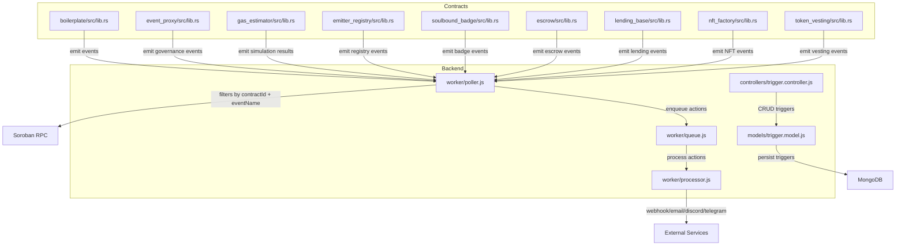

**Diagram sources**
- [poller.js:177-310](file://backend/src/worker/poller.js#L177-L310)
- [queue.js:91-121](file://backend/src/worker/queue.js#L91-L121)
- [processor.js:25-96](file://backend/src/worker/processor.js#L25-L96)
- [trigger.model.js:3-62](file://backend/src/models/trigger.model.js#L3-L62)
- [trigger.controller.js:6-28](file://backend/src/controllers/trigger.controller.js#L6-L28)
- [lib.rs (boilerplate):8-14](file://contracts/boilerplate/src/lib.rs#L8-L14)
- [lib.rs (event_proxy):49-84](file://contracts/event_proxy/src/lib.rs#L49-L84)
- [lib.rs (gas_estimator):15-22](file://contracts/gas_estimator/src/lib.rs#L15-L22)
- [lib.rs (emitter_registry):96-102](file://contracts/emitter_registry/src/lib.rs#L96-L102)
- [lib.rs (soulbound_badge):44-64](file://contracts/soulbound_badge/src/lib.rs#L44-L64)
- [lib.rs (escrow):120-126](file://contracts/escrow/src/lib.rs#L120-L126)
- [lib.rs (lending_base):74-113](file://contracts/lending_base/src/lib.rs#L74-113)
- [lib.rs (nft_factory):130-143](file://contracts/nft_factory/src/lib.rs#L130-L143)
- [lib.rs (token_vesting):98-104](file://contracts/token_vesting/src/lib.rs#L98-L104)

**Section sources**
- [README.md:10-17](file://README.md#L10-L17)
- [package.json:10-22](file://backend/package.json#L10-L22)

## Core Components
- Event poller worker: queries Soroban RPC for contract events, applies topic-based filters, paginates results, and enqueues actions.
- Queue and worker: optional background processing with retries and concurrency control.
- Trigger model and controller: define and manage event triggers and their retry behavior.
- Advanced contract ecosystem: comprehensive set of example contracts demonstrating multi-signature governance, gas estimation, NFT royalty systems, and sophisticated event emission patterns.

**Section sources**
- [poller.js:177-310](file://backend/src/worker/poller.js#L177-L310)
- [queue.js:91-121](file://backend/src/worker/queue.js#L91-L121)
- [processor.js:25-96](file://backend/src/worker/processor.js#L25-L96)
- [trigger.model.js:3-62](file://backend/src/models/trigger.model.js#L3-L62)
- [trigger.controller.js:6-28](file://backend/src/controllers/trigger.controller.js#L6-L28)
- [lib.rs (boilerplate):8-14](file://contracts/boilerplate/src/lib.rs#L8-L14)

## Architecture Overview
EventHorizon's integration architecture consists of:
- Contracts emitting events with topics
- Poller querying Soroban RPC with contractId and eventName filters
- Pagination and per-trigger ledger windows
- Optional queueing and worker execution with retries

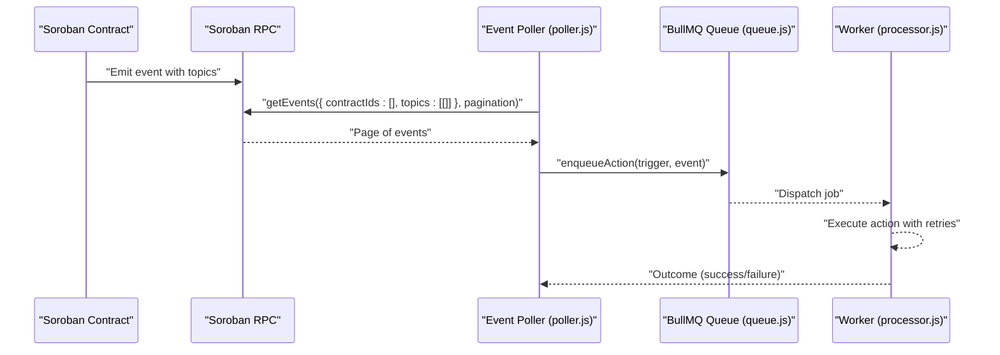

**Diagram sources**
- [poller.js:227-277](file://backend/src/worker/poller.js#L227-L277)
- [queue.js:91-121](file://backend/src/worker/queue.js#L91-L121)
- [processor.js:25-96](file://backend/src/worker/processor.js#L25-L96)

## Detailed Component Analysis

### Event Emission Patterns in Soroban Contracts
- Topic-based events: Contracts publish events with topics that EventHorizon can filter by. The boilerplate contract emits a symbol-based topic, while the yield vault defines typed events.
- Advanced event patterns: New contracts demonstrate sophisticated event emission including multi-topic events, standardized NFT events, and governance-related events.
- Structured event data: Contracts now emit structured event data with rich metadata for comprehensive monitoring and processing.

Practical example locations:
- Basic symbol topic event: [lib.rs (boilerplate):11-14](file://contracts/boilerplate/src/lib.rs#L11-L14)
- Multi-topic governance events: [lib.rs (event_proxy):49-84](file://contracts/event_proxy/src/lib.rs#L49-L84)
- Gas estimation results: [lib.rs (gas_estimator):15-22](file://contracts/gas_estimator/src/lib.rs#L15-L22)
- NFT standardized events: [lib.rs (nft_factory):130-143](file://contracts/nft_factory/src/lib.rs#L130-L143)

**Section sources**
- [lib.rs (boilerplate):8-14](file://contracts/boilerplate/src/lib.rs#L8-L14)
- [lib.rs (event_proxy):49-84](file://contracts/event_proxy/src/lib.rs#L49-L84)
- [lib.rs (gas_estimator):15-22](file://contracts/gas_estimator/src/lib.rs#L15-L22)
- [lib.rs (nft_factory):130-143](file://contracts/nft_factory/src/lib.rs#L130-L143)

### Topic-Based Filtering and Event Retrieval
- Filter construction: The poller builds a filter with contractId and a topics array containing the encoded event name (converted to XDR symbol).
- Pagination: The poller iterates pages using the last event id as a cursor until fewer than the page size is returned.
- Ledger windowing: For each trigger, the poller computes a sliding window from lastPolledLedger to the network tip, capped by a configurable maximum.

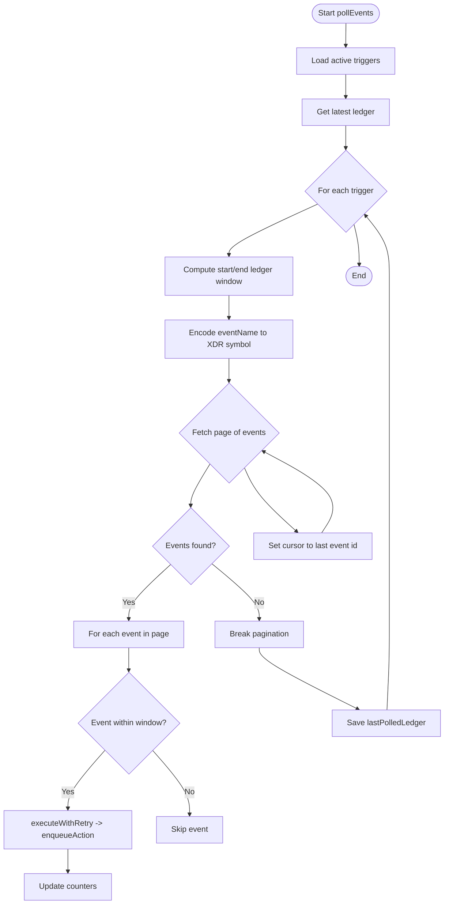

**Diagram sources**
- [poller.js:177-310](file://backend/src/worker/poller.js#L177-L310)

**Section sources**
- [poller.js:204-298](file://backend/src/worker/poller.js#L204-L298)

### Pagination Support for Event Retrieval
- Page size: The poller requests up to 100 events per page.
- Cursor-based pagination: Uses the last event id from a page to fetch the next page.
- Inter-page delay: A small delay prevents rate limiting against the RPC.

**Section sources**
- [poller.js:227-277](file://backend/src/worker/poller.js#L227-L277)

### Event Poller Worker Implementation Details
- RPC configuration: Timeout and RPC URL are configurable.
- Retry with exponential backoff: Network errors, 429, and 5xx are retried with exponential backoff.
- Trigger-level retries: Each action execution supports configurable maxRetries and retryIntervalMs.
- Direct vs queue execution: If Redis is unavailable, actions execute synchronously with limited retry behavior.

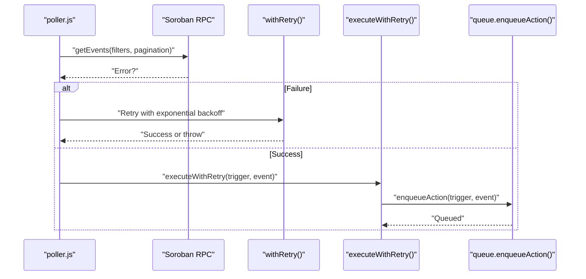

**Diagram sources**
- [poller.js:27-51](file://backend/src/worker/poller.js#L27-L51)
- [poller.js:152-173](file://backend/src/worker/poller.js#L152-L173)
- [poller.js:227-277](file://backend/src/worker/poller.js#L227-L277)
- [queue.js:91-121](file://backend/src/worker/queue.js#L91-L121)

**Section sources**
- [poller.js:5-16](file://backend/src/worker/poller.js#L5-L16)
- [poller.js:27-51](file://backend/src/worker/poller.js#L27-L51)
- [poller.js:152-173](file://backend/src/worker/poller.js#L152-L173)
- [poller.js:312-329](file://backend/src/worker/poller.js#L312-L329)

### Queue and Worker: Background Processing and Retries
- Queue: Persistent job storage via Redis with default retry attempts and exponential backoff.
- Worker: Concurrent processing with rate limiting and logging; handles action execution per trigger type.
- Fallback behavior: Without Redis, the poller executes actions directly with minimal retry logic.

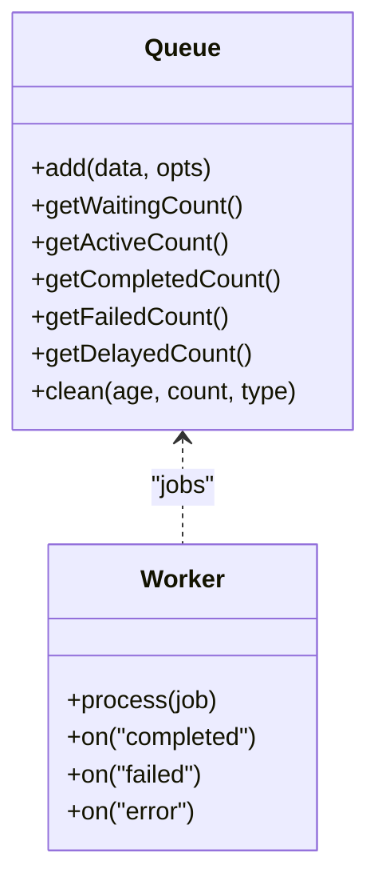

**Diagram sources**
- [queue.js:19-83](file://backend/src/worker/queue.js#L19-L83)
- [processor.js:102-167](file://backend/src/worker/processor.js#L102-L167)

**Section sources**
- [queue.js:19-83](file://backend/src/worker/queue.js#L19-L83)
- [processor.js:102-167](file://backend/src/worker/processor.js#L102-L167)
- [REDIS_OPTIONAL.md:1-203](file://backend/REDIS_OPTIONAL.md#L1-L203)

### Trigger Model and Controller
- Trigger schema: Stores contractId, eventName, actionType, actionUrl, activation flag, lastPolledLedger, and execution statistics.
- Retry configuration: Per-trigger retry settings override defaults.
- CRUD endpoints: Create, list, and delete triggers.

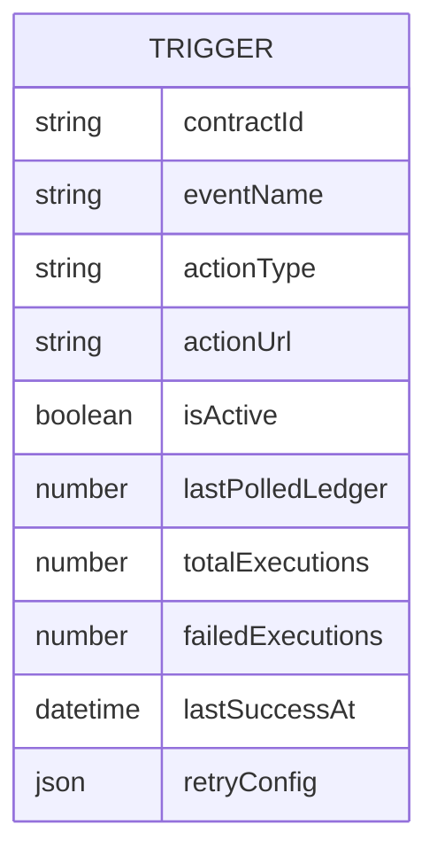

**Diagram sources**
- [trigger.model.js:3-62](file://backend/src/models/trigger.model.js#L3-L62)

**Section sources**
- [trigger.model.js:3-62](file://backend/src/models/trigger.model.js#L3-L62)
- [trigger.controller.js:6-28](file://backend/src/controllers/trigger.controller.js#L6-L28)

### Contract Deployment and Testing Using the Boilerplate
- Deployment: Build and deploy the boilerplate contract using the Soroban CLI.
- Testing: Use the built-in test to verify event emission.
- Integration: Add a trigger with the contractId and event name, emit the event from the contract, and observe the backend action.

Practical example locations:
- Emitting an event: [lib.rs (boilerplate):11-14](file://contracts/boilerplate/src/lib.rs#L11-L14)
- Verifying emission in tests: [test.rs (boilerplate):7-16](file://contracts/boilerplate/src/test.rs#L7-L16)
- Integration steps: [README.md:57-62](file://README.md#L57-L62)

**Section sources**
- [lib.rs (boilerplate):8-14](file://contracts/boilerplate/src/lib.rs#L8-L14)
- [test.rs (boilerplate):7-16](file://contracts/boilerplate/src/test.rs#L7-L16)
- [README.md:57-62](file://README.md#L57-L62)

## New Contract Modules

### Event Proxy Contract
The Event Proxy contract provides a multi-signature governance mechanism for executing contract actions with time delays and approval thresholds.

**Key Features:**
- Multi-signature approval system with configurable thresholds
- Time-lock mechanism for delayed execution
- Comprehensive event emission for governance actions
- Secure signer management with authorization checks

**Event Emission Patterns:**
- EventProposed: Emitted when a new event is scheduled
- EventApproved: Emitted when a signer approves an event
- EventQueued: Emitted when an event reaches threshold and enters time-lock
- EventExecuted: Emitted when an event is successfully executed
- EventCancelled: Emitted when an event is cancelled
- SignerAdded/Removed: Emitted for signer management actions
- TimelockUpdated: Emitted when time-lock delay is modified

**Section sources**
- [lib.rs (event_proxy):49-84](file://contracts/event_proxy/src/lib.rs#L49-L84)
- [lib.rs (event_proxy):169-302](file://contracts/event_proxy/src/lib.rs#L169-L302)
- [test.rs (event_proxy):86-135](file://contracts/event_proxy/src/test.rs#L86-L135)

### Gas Estimator Contract
The Gas Estimator contract provides safe simulation capabilities for cross-contract calls without reverting the parent transaction.

**Key Features:**
- Safe simulation using try_invoke_contract
- Batch simulation support
- Non-reverting execution model
- Comprehensive event emission for simulation results

**Event Emission Patterns:**
- SimResultEvent: Emitted after every simulated call with success/failure status
- SimResult: Structured result data for correlation with RPC measurements

**Section sources**
- [lib.rs (gas_estimator):15-22](file://contracts/gas_estimator/src/lib.rs#L15-L22)
- [lib.rs (gas_estimator):28-70](file://contracts/gas_estimator/src/lib.rs#L28-L70)
- [test.rs (gas_estimator):41-69](file://contracts/gas_estimator/src/test.rs#L41-L69)

### Emitter Registry Contract
The Emitter Registry provides decentralized governance for contract verification and whitelist management.

**Key Features:**
- DAO-style governance with voting power
- Proposal system for adding/removing contracts
- Emergency removal capability for security committee
- Comprehensive metadata storage for verified contracts

**Event Emission Patterns:**
- prop_new: Emitted for new proposals with proposal ID and action type
- vote: Emitted for voting activities with support and voting power
- wl_upd: Emitted for whitelist updates with verification status and metadata

**Section sources**
- [lib.rs (emitter_registry):96-102](file://contracts/emitter_registry/src/lib.rs#L96-L102)
- [lib.rs (emitter_registry):140-144](file://contracts/emitter_registry/src/lib.rs#L140-L144)
- [lib.rs (emitter_registry):204-209](file://contracts/emitter_registry/src/lib.rs#L204-L209)
- [test.rs (emitter_registry):6-62](file://contracts/emitter_registry/src/test.rs#L6-L62)

### Soulbound Badge Contract
The Soulbound Badge contract implements non-transferable digital badges with expiration and revocation capabilities.

**Key Features:**
- Immutable badge ownership (soulbound)
- Expiration date support
- Revocation capability
- Bulk issuance functionality
- Comprehensive error handling

**Event Emission Patterns:**
- BadgeIssued: Emitted for new badge creation with holder and metadata
- MetadataUpdated: Emitted for badge metadata changes
- BadgeRevoked: Emitted for badge revocation events

**Section sources**
- [lib.rs (soulbound_badge):44-64](file://contracts/soulbound_badge/src/lib.rs#L44-L64)
- [lib.rs (soulbound_badge):101-127](file://contracts/soulbound_badge/src/lib.rs#L101-L127)
- [lib.rs (soulbound_badge):147-159](file://contracts/soulbound_badge/src/lib.rs#L147-L159)

## Enhanced Existing Contracts

### Escrow Contract Enhancements
The Escrow contract now includes comprehensive fee management, dispute resolution, and auto-resolution capabilities.

**New Features:**
- Platform and arbitrator fee configuration
- Multi-party dispute resolution with evidence handling
- Auto-resolution after unlock time expiration
- Comprehensive settlement finalization with fee calculations

**Enhanced Event Emission:**
- escrow_created: Enhanced with detailed escrow information
- escrow_disputed: Emitted with evidence hash for dispute tracking
- escrow_resolved: Comprehensive resolution details with decision outcomes

**Section sources**
- [lib.rs (escrow):79-126](file://contracts/escrow/src/lib.rs#L79-L126)
- [lib.rs (escrow):149-184](file://contracts/escrow/src/lib.rs#L149-L184)
- [lib.rs (escrow):205-216](file://contracts/escrow/src/lib.rs#L205-L216)

### Lending Base Protocol Enhancements
The Lending Protocol now includes priority liquidation, external price feeds, and comprehensive health monitoring.

**New Features:**
- Priority liquidation with health factor consideration
- External price feed integration via PriceFeed interface
- Low health alert system with margin thresholds
- Enhanced interest accumulation with time-based calculations

**Enhanced Event Emission:**
- PriorityLiquidation: Emitted with health factor for priority liquidations
- LowHealth: Emitted when users approach liquidation thresholds
- deposit/borrow/repay: Enhanced with user-specific topics

**Section sources**
- [lib.rs (lending_base):177-209](file://contracts/lending_base/src/lib.rs#L177-L209)
- [lib.rs (lending_base):233-243](file://contracts/lending_base/src/lib.rs#L233-L243)
- [lib.rs (lending_base):280-299](file://contracts/lending_base/src/lib.rs#L280-L299)

### NFT Factory Enhancements
The NFT Factory now includes comprehensive royalty systems, batch operations, and standardized event emissions.

**New Features:**
- Advanced royalty system with per-token and default royalty settings
- Batch minting and transfer operations
- Comprehensive error handling with custom error types
- Standardized NFT events following ERC-721 patterns

**Enhanced Event Emission:**
- Transfer: Standardized transfer events with proper NFT semantics
- MetadataUpdated: Emitted for metadata changes
- RoyaltyPaid: Comprehensive royalty payment events with recipient and amount details

**Section sources**
- [lib.rs (nft_factory):145-185](file://contracts/nft_factory/src/lib.rs#L145-L185)
- [lib.rs (nft_factory):262-282](file://contracts/nft_factory/src/lib.rs#L262-L282)

### Token Vesting Enhancements
The Token Vesting contract now includes comprehensive clawback functionality and improved state management.

**New Features:**
- Clawback administration for reclaiming unvested tokens
- Enhanced state protection against re-entrancy attacks
- Improved calculation precision with overflow handling
- Comprehensive informational queries

**Enhanced Event Emission:**
- vesting_claimed: Emitted for successful claims with claim amounts
- vesting_clawed_back: Emitted for clawback operations with reclaimed amounts

**Section sources**
- [lib.rs (token_vesting):106-135](file://contracts/token_vesting/src/lib.rs#L106-L135)
- [lib.rs (token_vesting):137-157](file://contracts/token_vesting/src/lib.rs#L137-L157)

## Advanced Event Emission Patterns

### Multi-Tier Topic Events
Modern contracts implement sophisticated topic hierarchies for granular filtering:

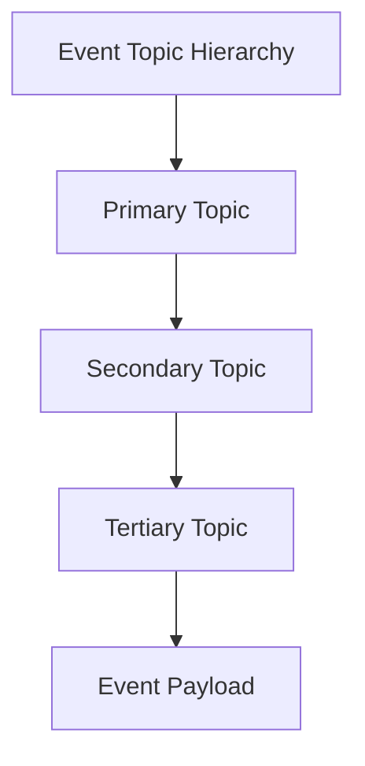

**Examples:**
- Governance events: `["EventProxy", "EventProposed", event_id]`
- NFT events: `["Transfer", from_address, to_address]`
- Escrow events: `["escrow_resolved", escrow_id, decision]`

### Standardized Event Formats
Contracts now follow standardized event formats for interoperability:

- **Transfer events**: Topic-based with sender, recipient, and token_id
- **Metadata events**: Topic-based with token_id and metadata URI  
- **Governance events**: Topic-based with proposal_id and action type
- **Financial events**: Topic-based with user addresses and amounts

**Section sources**
- [lib.rs (nft_factory):130-143](file://contracts/nft_factory/src/lib.rs#L130-L143)
- [lib.rs (event_proxy):58-67](file://contracts/event_proxy/src/lib.rs#L58-L67)
- [lib.rs (escrow):120-126](file://contracts/escrow/src/lib.rs#L120-L126)

## Multi-Signature Governance Integration

### Event Proxy Governance Flow
The Event Proxy enables secure multi-signature governance with time delays:

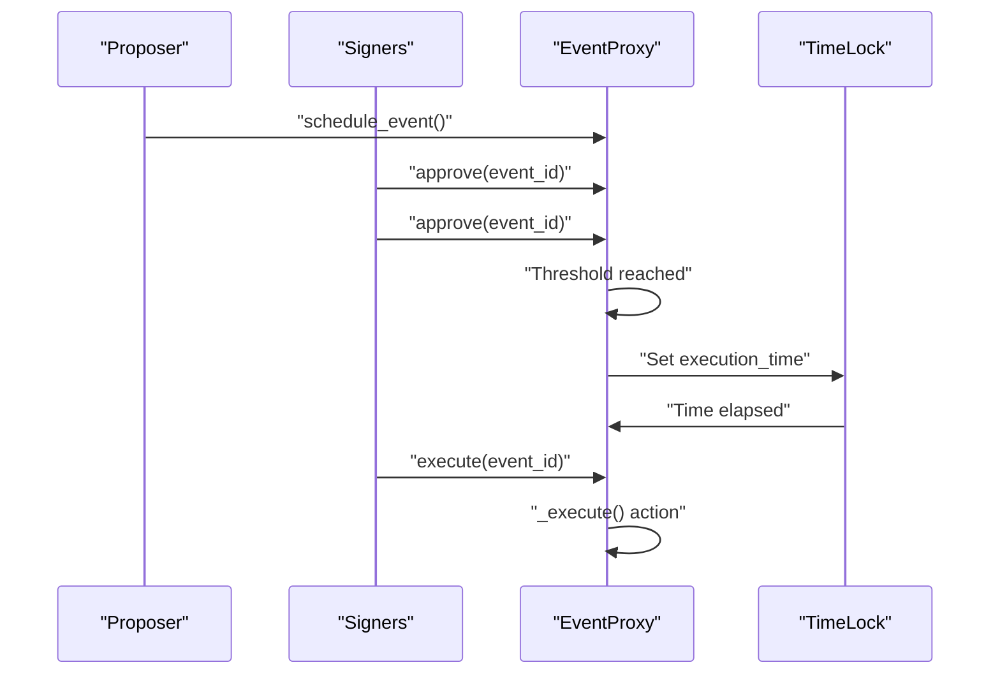

**Section sources**
- [lib.rs (event_proxy):169-302](file://contracts/event_proxy/src/lib.rs#L169-L302)
- [test.rs (event_proxy):86-135](file://contracts/event_proxy/src/test.rs#L86-L135)

### Governance Event Monitoring
EventHorizon can monitor governance activities through standardized event patterns:

- **Proposal Lifecycle**: Track proposal creation, voting, and execution
- **Approval Tracking**: Monitor individual signer approvals
- **Time Lock Management**: Track execution timing and delays
- **Emergency Actions**: Monitor emergency removals and administrative actions

**Section sources**
- [lib.rs (emitter_registry):96-102](file://contracts/emitter_registry/src/lib.rs#L96-L102)
- [lib.rs (event_proxy):257-277](file://contracts/event_proxy/src/lib.rs#L257-L277)

## Gas Estimation and Resource Management

### Safe Simulation Pattern
The Gas Estimator contract demonstrates safe simulation without transaction reversion:

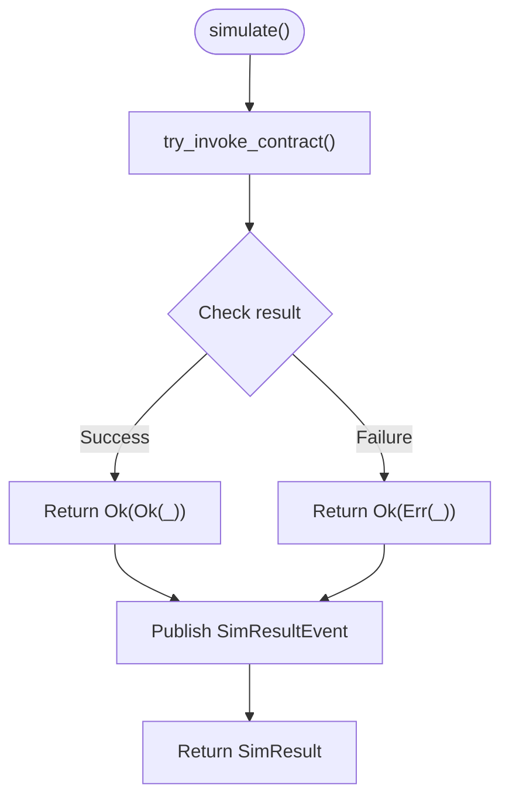

**Benefits:**
- Prevents parent transaction reversion on child failures
- Provides comprehensive resource usage data via RPC
- Enables correlation between simulation results and host-reported metrics

**Section sources**
- [lib.rs (gas_estimator):28-53](file://contracts/gas_estimator/src/lib.rs#L28-L53)
- [test.rs (gas_estimator):58-69](file://contracts/gas_estimator/src/test.rs#L58-L69)

### Batch Simulation Operations
The Gas Estimator supports efficient batch simulation for multiple contract calls:

- **Individual Failure Isolation**: Failed simulations don't abort the batch
- **Comprehensive Results**: Returns structured results for each call
- **Resource Optimization**: Reduces RPC round-trips for multiple simulations

**Section sources**
- [lib.rs (gas_estimator):55-70](file://contracts/gas_estimator/src/lib.rs#L55-L70)
- [test.rs (gas_estimator):74-95](file://contracts/gas_estimator/src/test.rs#L74-L95)

## NFT Royalty and Metadata Systems

### Comprehensive Royalty Framework
The NFT Factory implements a sophisticated royalty system:

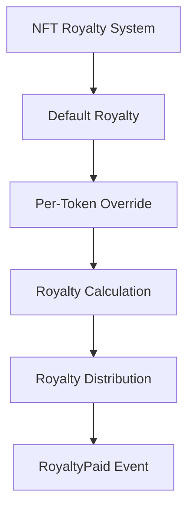

**Features:**
- **Default Royalty Settings**: Collection-wide royalty configuration
- **Per-Token Customization**: Individual token royalty overrides
- **Basis Point Precision**: 0-10000 basis point range for 0-100% royalties
- **Standardized Events**: Comprehensive royalty payment notifications

**Section sources**
- [lib.rs (nft_factory):21-29](file://contracts/nft_factory/src/lib.rs#L21-L29)
- [lib.rs (nft_factory):262-282](file://contracts/nft_factory/src/lib.rs#L262-L282)

### Standardized NFT Events
The NFT Factory follows standardized event patterns for interoperability:

- **Transfer Events**: Topic-based with proper NFT semantics
- **Metadata Events**: Emitted for metadata updates and changes
- **Royalty Events**: Comprehensive royalty payment notifications
- **Batch Operations**: Efficient batch minting and transfer events

**Section sources**
- [lib.rs (nft_factory):130-143](file://contracts/nft_factory/src/lib.rs#L130-L143)
- [lib.rs (nft_factory):240-260](file://contracts/nft_factory/src/lib.rs#L240-L260)

## Dependency Analysis
- Backend runtime dependencies include the Stellar SDK for RPC, BullMQ and ioredis for queueing, and Express for HTTP.
- The poller depends on the trigger model for configuration and on the queue/worker for action execution.
- Contracts depend on the Soroban SDK for event emission and cross-contract communication.

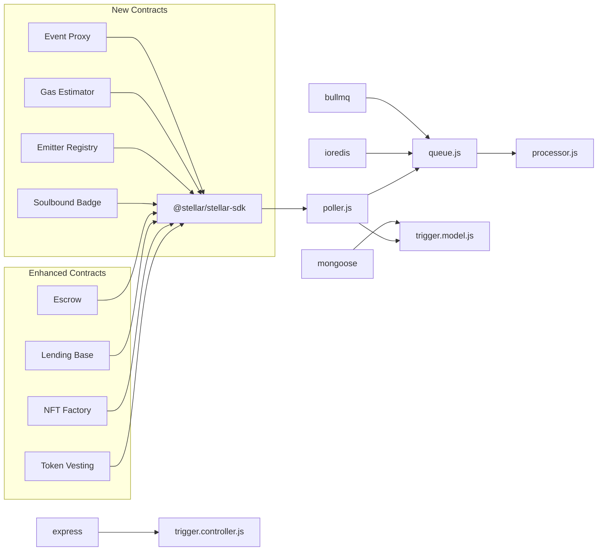

**Diagram sources**
- [package.json:10-22](file://backend/package.json#L10-L22)
- [poller.js:1-8](file://backend/src/worker/poller.js#L1-L8)
- [trigger.model.js](file://backend/src/models/trigger.model.js#L1)
- [trigger.controller.js](file://backend/src/controllers/trigger.controller.js#L1)
- [queue.js:1-3](file://backend/src/worker/queue.js#L1-L3)
- [processor.js:1-7](file://backend/src/worker/processor.js#L1-L7)

**Section sources**
- [package.json:10-22](file://backend/package.json#L10-L22)

## Performance Considerations
- Polling cadence: Tune POLL_INTERVAL_MS to balance responsiveness and RPC load.
- Window size: Adjust MAX_LEDGERS_PER_POLL to control per-cycle scanning breadth.
- Backoff and retries: The poller and action execution both use exponential backoff to handle transient failures.
- Queue concurrency: Increase WORKER_CONCURRENCY to improve throughput when Redis is available.
- Rate limiting: The worker includes a built-in rate limiter to avoid overwhelming external services.
- Pagination delays: INTER_PAGE_DELAY_MS helps avoid RPC throttling.
- **New considerations**: Event proxy time-lock delays, gas estimator simulation overhead, and NFT factory batch operations.

## Troubleshooting Guide
Common issues and resolutions:
- Redis not available: The system gracefully falls back to direct execution. Install and configure Redis to enable background processing.
- RPC timeouts or rate limits: The poller retries with exponential backoff; verify RPC_TIMEOUT_MS and network connectivity.
- Action failures: Inspect worker logs for error details; ensure actionUrl and credentials are correct.
- Queue stuck jobs: Use the queue API endpoints to inspect and retry failed jobs.
- **New troubleshooting**: Event proxy threshold validation, gas estimator simulation failures, NFT factory overflow errors, and soulbound badge transfer restrictions.

**Section sources**
- [REDIS_OPTIONAL.md:1-203](file://backend/REDIS_OPTIONAL.md#L1-L203)
- [poller.js:27-51](file://backend/src/worker/poller.js#L27-L51)
- [processor.js:145-151](file://backend/src/worker/processor.js#L145-L151)
- [QUEUE_SETUP.md:204-228](file://backend/QUEUE_SETUP.md#L204-L228)

## Conclusion
EventHorizon provides a robust, extensible framework for integrating Soroban smart contracts with Web2 systems. With the addition of advanced contract modules including multi-signature governance, gas estimation, NFT royalty systems, and comprehensive event monitoring, the framework now supports enterprise-grade smart contract integration. The expanded contract ecosystem demonstrates practical patterns for secure multi-signature operations, resource-efficient simulations, and sophisticated event emission strategies that ensure reliable automation across diverse contract designs.

## Appendices

### Practical Examples Index
- Basic event emission: [lib.rs (boilerplate):11-14](file://contracts/boilerplate/src/lib.rs#L11-L14)
- Multi-signature governance: [lib.rs (event_proxy):169-302](file://contracts/event_proxy/src/lib.rs#L169-L302)
- Gas estimation simulation: [lib.rs (gas_estimator):28-70](file://contracts/gas_estimator/src/lib.rs#L28-L70)
- NFT royalty system: [lib.rs (nft_factory):262-282](file://contracts/nft_factory/src/lib.rs#L262-L282)
- Escrow settlement: [lib.rs (escrow):271-320](file://contracts/escrow/src/lib.rs#L271-L320)
- Lending health monitoring: [lib.rs (lending_base):280-299](file://contracts/lending_base/src/lib.rs#L280-L299)
- Token vesting claims: [lib.rs (token_vesting):78-104](file://contracts/token_vesting/src/lib.rs#L78-L104)
- Polling and filtering: [poller.js:227-277](file://backend/src/worker/poller.js#L227-L277)
- Enqueueing actions: [queue.js:91-121](file://backend/src/worker/queue.js#L91-L121)
- Executing actions: [processor.js:25-96](file://backend/src/worker/processor.js#L25-L96)
- Creating triggers: [trigger.controller.js:6-28](file://backend/src/controllers/trigger.controller.js#L6-L28)
- Trigger persistence: [trigger.model.js:3-62](file://backend/src/models/trigger.model.js#L3-L62)

**Section sources**
- [lib.rs (boilerplate):11-14](file://contracts/boilerplate/src/lib.rs#L11-L14)
- [lib.rs (event_proxy):169-302](file://contracts/event_proxy/src/lib.rs#L169-L302)
- [lib.rs (gas_estimator):28-70](file://contracts/gas_estimator/src/lib.rs#L28-L70)
- [lib.rs (nft_factory):262-282](file://contracts/nft_factory/src/lib.rs#L262-L282)
- [lib.rs (escrow):271-320](file://contracts/escrow/src/lib.rs#L271-L320)
- [lib.rs (lending_base):280-299](file://contracts/lending_base/src/lib.rs#L280-L299)
- [lib.rs (token_vesting):78-104](file://contracts/token_vesting/src/lib.rs#L78-L104)
- [poller.js:227-277](file://backend/src/worker/poller.js#L227-L277)
- [queue.js:91-121](file://backend/src/worker/queue.js#L91-L121)
- [processor.js:25-96](file://backend/src/worker/processor.js#L25-L96)
- [trigger.controller.js:6-28](file://backend/src/controllers/trigger.controller.js#L6-L28)
- [trigger.model.js:3-62](file://backend/src/models/trigger.model.js#L3-L62)