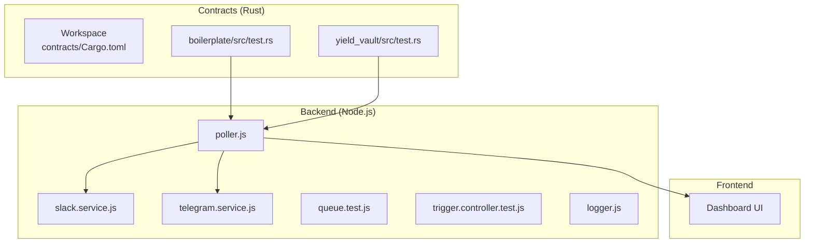
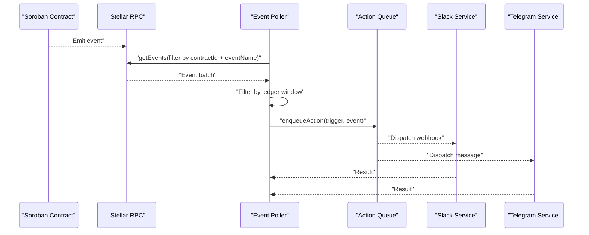
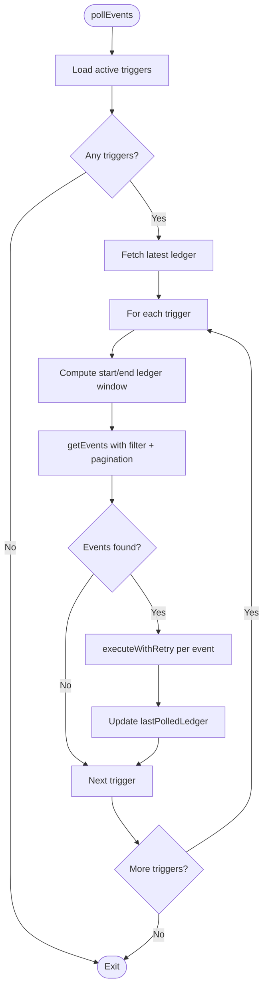
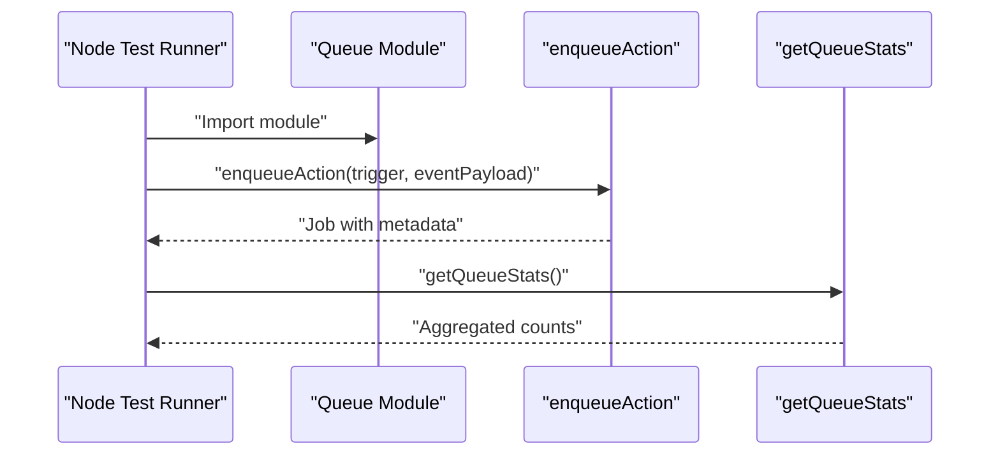
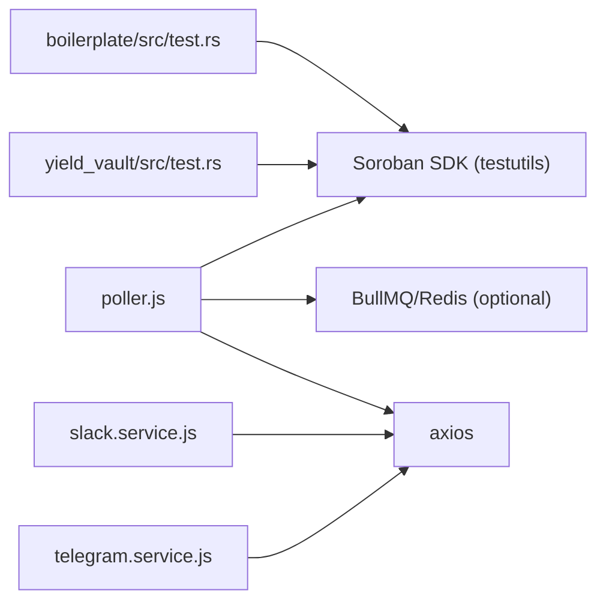

# Testing and Debugging

<cite>
**Referenced Files in This Document**
- [README.md](file://README.md)
- [Cargo.toml](file://contracts/Cargo.toml)
- [boilerplate/src/test.rs](file://contracts/boilerplate/src/test.rs)
- [yield_vault/src/test.rs](file://contracts/yield_vault/src/test.rs)
- [backend/__tests__/trigger.controller.test.js](file://backend/__tests__/trigger.controller.test.js)
- [backend/__tests__/queue.test.js](file://backend/__tests__/queue.test.js)
- [backend/__tests__/slack.test.js](file://backend/__tests__/slack.test.js)
- [backend/__tests__/telegram.test.js](file://backend/__tests__/telegram.test.js)
- [backend/src/worker/poller.js](file://backend/src/worker/poller.js)
- [backend/src/services/slack.service.js](file://backend/src/services/slack.service.js)
- [backend/src/services/telegram.service.js](file://backend/src/services/telegram.service.js)
- [backend/src/config/logger.js](file://backend/src/config/logger.js)
</cite>

## Table of Contents
1. [Introduction](#introduction)
2. [Project Structure](#project-structure)
3. [Core Components](#core-components)
4. [Architecture Overview](#architecture-overview)
5. [Detailed Component Analysis](#detailed-component-analysis)
6. [Dependency Analysis](#dependency-analysis)
7. [Performance Considerations](#performance-considerations)
8. [Troubleshooting Guide](#troubleshooting-guide)
9. [Conclusion](#conclusion)
10. [Appendices](#appendices)

## Introduction
This document provides comprehensive testing and debugging guidance for smart contract integration within EventHorizon. It focuses on:
- Unit testing strategies for event emission using the Rust contract test suites, including mock environments and test event verification.
- Integration testing approaches to validate the complete event-to-notification pipeline from contract events to external actions.
- Debugging techniques for event visibility issues, including log inspection, event polling verification, and common troubleshooting workflows.
- Practical examples of test scenarios, debugging tools usage, and performance testing methodologies tailored for event-heavy contracts.

## Project Structure
EventHorizon comprises:
- Smart contracts written in Rust under the contracts/ directory, each with dedicated tests and optional snapshot-based assertions.
- A Node.js backend that polls Soroban events, enqueues actions, and executes integrations with Slack, Telegram, Discord, email, and webhooks.
- Frontend dashboard for managing triggers and monitoring queues.
- Workspace configuration enabling shared build and profile settings across contracts.

**Diagram sources**
- [Cargo.toml:1-27](file://contracts/Cargo.toml#L1-L27)
- [boilerplate/src/test.rs:1-17](file://contracts/boilerplate/src/test.rs#L1-L17)
- [yield_vault/src/test.rs:1-146](file://contracts/yield_vault/src/test.rs#L1-L146)
- [backend/src/worker/poller.js:1-335](file://backend/src/worker/poller.js#L1-L335)
- [backend/src/services/slack.service.js:1-165](file://backend/src/services/slack.service.js#L1-L165)
- [backend/src/services/telegram.service.js:1-74](file://backend/src/services/telegram.service.js#L1-L74)
- [backend/__tests__/queue.test.js:1-69](file://backend/__tests__/queue.test.js#L1-L69)
- [backend/__tests__/trigger.controller.test.js:1-60](file://backend/__tests__/trigger.controller.test.js#L1-L60)
- [backend/src/config/logger.js:1-19](file://backend/src/config/logger.js#L1-L19)

**Section sources**
- [README.md:10-63](file://README.md#L10-L63)
- [Cargo.toml:1-27](file://contracts/Cargo.toml#L1-L27)

## Core Components
- Contract test harnesses: Use Soroban SDK test utilities to register contracts, emit events, and assert event counts and shapes.
- Backend poller: Periodically queries Soroban for contract events, filters by contract ID and event name, and enqueues or directly executes actions.
- Action services: Slack, Telegram, and webhook integrations with robust error handling and payload construction.
- Queue and controller tests: Validate job creation, queue statistics, and controller response wrapping.

Key testing artifacts:
- Unit tests for event emission in boilerplate and yield vault contracts.
- Integration tests for queue behavior and trigger controller.
- Manual integration tests for Slack and Telegram services.

**Section sources**
- [boilerplate/src/test.rs:1-17](file://contracts/boilerplate/src/test.rs#L1-L17)
- [yield_vault/src/test.rs:77-88](file://contracts/yield_vault/src/test.rs#L77-L88)
- [backend/src/worker/poller.js:177-310](file://backend/src/worker/poller.js#L177-L310)
- [backend/__tests__/queue.test.js:23-68](file://backend/__tests__/queue.test.js#L23-L68)
- [backend/__tests__/trigger.controller.test.js:16-59](file://backend/__tests__/trigger.controller.test.js#L16-L59)
- [backend/__tests__/slack.test.js:4-57](file://backend/__tests__/slack.test.js#L4-L57)
- [backend/__tests__/telegram.test.js:4-41](file://backend/__tests__/telegram.test.js#L4-L41)

## Architecture Overview
The event-to-notification pipeline:
1. Contracts emit events on-chain.
2. The poller fetches events from Soroban, filters by contract and event name, and invokes action execution.
3. Actions are either queued (BullMQ/Redis) or executed directly depending on availability.
4. Services format rich payloads and deliver notifications to Slack, Telegram, Discord, email, or webhooks.

**Diagram sources**
- [backend/src/worker/poller.js:177-310](file://backend/src/worker/poller.js#L177-L310)
- [backend/src/services/slack.service.js:97-159](file://backend/src/services/slack.service.js#L97-L159)
- [backend/src/services/telegram.service.js:15-57](file://backend/src/services/telegram.service.js#L15-L57)

## Detailed Component Analysis

### Contract Event Emission Tests
- Boilerplate contract test demonstrates registering a contract, invoking an event-emitting function, and asserting event presence via the environment’s event sink.
- Yield vault test verifies a rebalance signal emission alongside functional deposit/withdraw flows, ensuring event emission does not panic and aligns with snapshots.

Recommended unit testing strategies:
- Use the test environment to register contracts and capture emitted events.
- Assert event count and topic/symbol alignment.
- Snapshot comparisons for complex payloads to guard against regressions.

Practical examples:
- Verify single event emission in boilerplate contract test.
- Confirm rebalance signal emission in yield vault test.

**Section sources**
- [boilerplate/src/test.rs:6-16](file://contracts/boilerplate/src/test.rs#L6-L16)
- [yield_vault/src/test.rs:77-88](file://contracts/yield_vault/src/test.rs#L77-L88)

### Backend Poller and Action Execution
The poller:
- Retrieves active triggers and determines per-trigger ledger windows.
- Queries events with pagination and applies exponential backoff on retryable failures.
- Executes actions with configurable retries and tracks execution metrics.

Integration testing approaches:
- Mock environment for triggers and RPC responses.
- Verify pagination loop behavior and cursor handling.
- Validate action routing and error propagation.

**Diagram sources**
- [backend/src/worker/poller.js:177-310](file://backend/src/worker/poller.js#L177-L310)

**Section sources**
- [backend/src/worker/poller.js:177-310](file://backend/src/worker/poller.js#L177-L310)

### Queue and Controller Tests
Queue tests validate:
- Job creation with trigger and event payload metadata.
- Queue statistics aggregation across waiting, active, completed, failed, and delayed jobs.

Controller tests validate:
- Response wrapping for success payloads.
- Error forwarding semantics for missing resources.

**Diagram sources**
- [backend/__tests__/queue.test.js:23-68](file://backend/__tests__/queue.test.js#L23-L68)

**Section sources**
- [backend/__tests__/queue.test.js:23-68](file://backend/__tests__/queue.test.js#L23-L68)
- [backend/__tests__/trigger.controller.test.js:16-59](file://backend/__tests__/trigger.controller.test.js#L16-L59)

### Slack and Telegram Integration Tests
Manual integration tests:
- Slack: Generates Block Kit payloads and optionally posts to a configured webhook, handling rate limits and common API errors.
- Telegram: Validates MarkdownV2 escaping and attempts to send a test message, handling common API errors.

These tests serve as debugging tools to verify payload formatting and service connectivity.

**Section sources**
- [backend/__tests__/slack.test.js:4-57](file://backend/__tests__/slack.test.js#L4-L57)
- [backend/__tests__/telegram.test.js:4-41](file://backend/__tests__/telegram.test.js#L4-L41)
- [backend/src/services/slack.service.js:97-159](file://backend/src/services/slack.service.js#L97-L159)
- [backend/src/services/telegram.service.js:15-57](file://backend/src/services/telegram.service.js#L15-L57)

## Dependency Analysis
- Contracts depend on the Soroban SDK test utilities for mocking and event capture.
- Backend poller depends on the Stellar SDK for RPC interactions and optionally on BullMQ/Redis for queueing.
- Action services encapsulate HTTP clients and error handling for external providers.

**Diagram sources**
- [boilerplate/src/test.rs:1-5](file://contracts/boilerplate/src/test.rs#L1-L5)
- [yield_vault/src/test.rs:1-7](file://contracts/yield_vault/src/test.rs#L1-L7)
- [backend/src/worker/poller.js:1-8](file://backend/src/worker/poller.js#L1-L8)
- [backend/src/services/slack.service.js:1](file://backend/src/services/slack.service.js#L1)
- [backend/src/services/telegram.service.js:1](file://backend/src/services/telegram.service.js#L1)

**Section sources**
- [Cargo.toml:1-27](file://contracts/Cargo.toml#L1-L27)
- [backend/src/worker/poller.js:1-8](file://backend/src/worker/poller.js#L1-L8)

## Performance Considerations
- Polling window sizing: Tune MAX_LEDGERS_PER_POLL to balance responsiveness and RPC load.
- Backoff and retries: Exponential backoff reduces RPC contention; configure RPC_MAX_RETRIES and RPC_BASE_DELAY_MS appropriately.
- Pagination delays: INTER_PAGE_DELAY_MS prevents rate limiting; adjust for network conditions.
- Queue vs. direct execution: Prefer background queue for high-throughput scenarios; fallback to direct execution when Redis is unavailable.
- Payload sizes: Keep Slack/Telegram payloads within provider limits; truncate or sanitize large payloads.

[No sources needed since this section provides general guidance]

## Troubleshooting Guide

Common event visibility issues and resolutions:
- No events detected:
  - Verify trigger configuration (contract ID and event name).
  - Confirm ledger window computation and lastPolledLedger updates.
  - Inspect RPC connectivity and rate-limiting behavior.

- Action failures:
  - Review action-specific error messages and retry logs.
  - Validate provider credentials and URLs (Slack webhook, Telegram bot token/chat ID).
  - Check queue stats and job history for persistent failures.

- Payload formatting problems:
  - Use manual integration tests to validate Slack Block Kit and Telegram MarkdownV2 escaping.
  - Log and inspect payloads before dispatch.

Debugging tools and workflows:
- Enable debug logging in development to capture detailed poller logs.
- Use the Slack and Telegram manual tests to validate service connectivity and payload formatting.
- Monitor queue statistics to detect bottlenecks or backlog growth.

**Section sources**
- [backend/src/worker/poller.js:194-310](file://backend/src/worker/poller.js#L194-L310)
- [backend/src/config/logger.js:1-19](file://backend/src/config/logger.js#L1-L19)
- [backend/__tests__/slack.test.js:4-57](file://backend/__tests__/slack.test.js#L4-L57)
- [backend/__tests__/telegram.test.js:4-41](file://backend/__tests__/telegram.test.js#L4-L41)

## Conclusion
EventHorizon’s testing and debugging approach combines Rust contract unit tests with Node.js integration tests and robust backend logging. By leveraging mock environments, pagination-aware polling, and provider-specific payload validation, teams can reliably test event emission and end-to-end delivery. Adopting the recommended strategies and troubleshooting workflows ensures resilient operation under varying loads and network conditions.

[No sources needed since this section summarizes without analyzing specific files]

## Appendices

### Practical Test Scenarios
- Contract event emission:
  - Emit a test event and assert event count equals one.
  - Emit a signal event and verify it does not panic (snapshot-based validation).
- Integration pipeline:
  - Enqueue an action with trigger metadata and confirm job creation and stats aggregation.
  - Validate controller response wrapping and error forwarding.
- Provider connectivity:
  - Run Slack Block Kit payload generation and optional webhook posting.
  - Run Telegram MarkdownV2 escaping and optional message sending.

**Section sources**
- [boilerplate/src/test.rs:6-16](file://contracts/boilerplate/src/test.rs#L6-L16)
- [yield_vault/src/test.rs:77-88](file://contracts/yield_vault/src/test.rs#L77-L88)
- [backend/__tests__/queue.test.js:23-68](file://backend/__tests__/queue.test.js#L23-L68)
- [backend/__tests__/trigger.controller.test.js:16-59](file://backend/__tests__/trigger.controller.test.js#L16-L59)
- [backend/__tests__/slack.test.js:4-57](file://backend/__tests__/slack.test.js#L4-L57)
- [backend/__tests__/telegram.test.js:4-41](file://backend/__tests__/telegram.test.js#L4-L41)