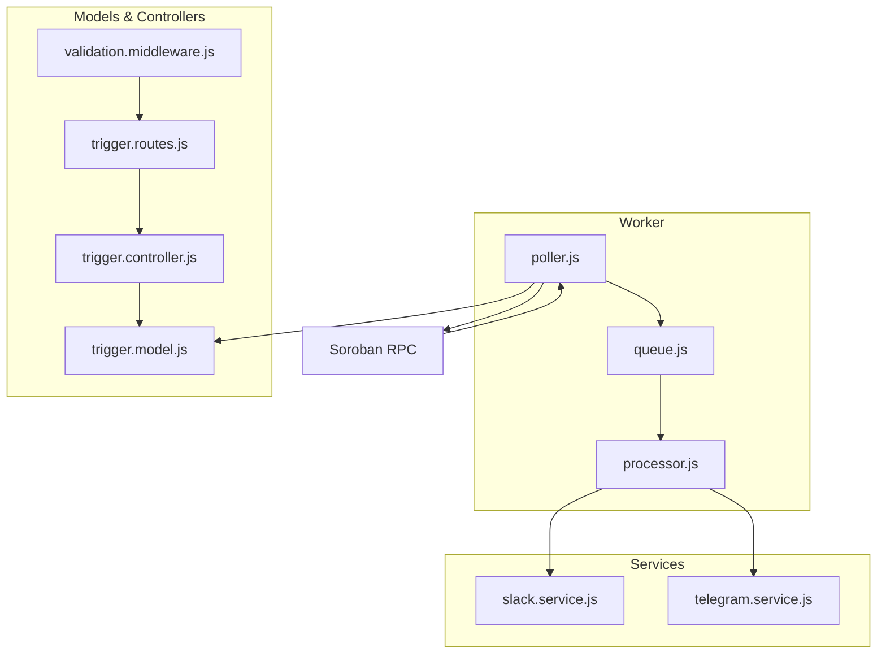
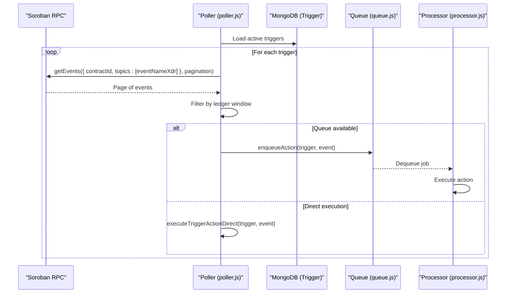
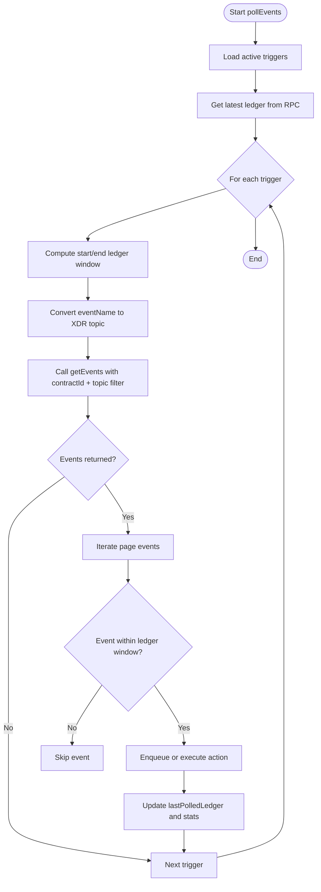
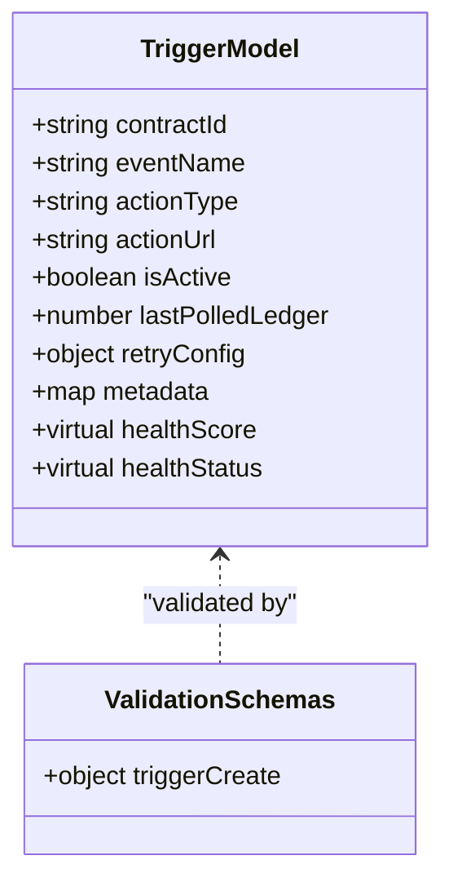
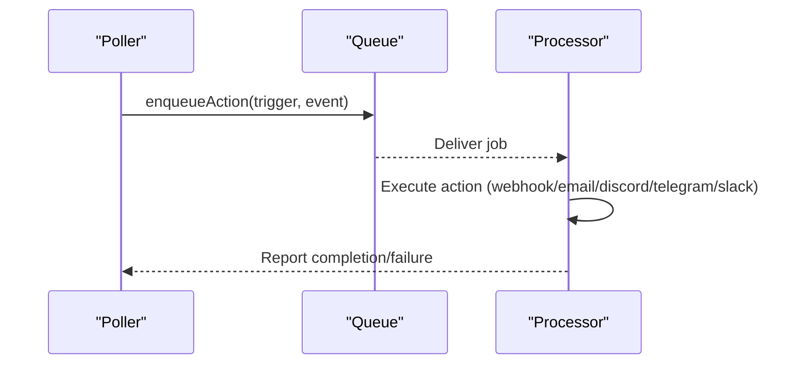
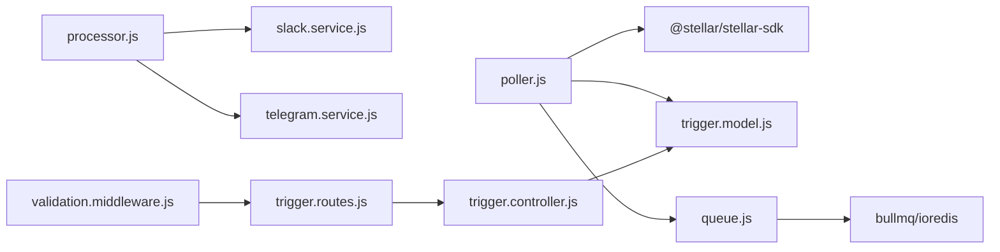

# Topic-Based Filtering

<cite>
**Referenced Files in This Document**
- [poller.js](file://backend/src/worker/poller.js)
- [trigger.model.js](file://backend/src/models/trigger.model.js)
- [trigger.controller.js](file://backend/src/controllers/trigger.controller.js)
- [trigger.routes.js](file://backend/src/routes/trigger.routes.js)
- [validation.middleware.js](file://backend/src/middleware/validation.middleware.js)
- [processor.js](file://backend/src/worker/processor.js)
- [queue.js](file://backend/src/worker/queue.js)
- [slack.service.js](file://backend/src/services/slack.service.js)
- [telegram.service.js](file://backend/src/services/telegram.service.js)
- [README.md](file://README.md)
- [package.json](file://backend/package.json)
- [queue-usage.js](file://backend/examples/queue-usage.js)
</cite>

## Table of Contents
1. [Introduction](#introduction)
2. [Project Structure](#project-structure)
3. [Core Components](#core-components)
4. [Architecture Overview](#architecture-overview)
5. [Detailed Component Analysis](#detailed-component-analysis)
6. [Dependency Analysis](#dependency-analysis)
7. [Performance Considerations](#performance-considerations)
8. [Troubleshooting Guide](#troubleshooting-guide)
9. [Conclusion](#conclusion)
10. [Appendices](#appendices)

## Introduction
This document explains how EventHorizon performs topic-based filtering for Soroban contract events. It focuses on how the event poller constructs RPC queries with topic filters, how triggers define matching criteria, and how incoming events are matched against registered triggers. It also covers configuration, performance characteristics, and optimization strategies for high-volume event streams.

## Project Structure
The topic filtering mechanism spans several backend modules:
- Worker poller: polls the Soroban RPC for events and applies topic filters.
- Trigger model and controller: define, persist, and expose trigger configurations.
- Validation middleware: ensures trigger creation conforms to supported fields.
- Queue and processor: handle asynchronous action execution when events match.
- Services: implement action-specific integrations (e.g., Slack, Telegram).

**Diagram sources**
- [poller.js:177-310](file://backend/src/worker/poller.js#L177-L310)
- [queue.js:91-121](file://backend/src/worker/queue.js#L91-L121)
- [processor.js:25-97](file://backend/src/worker/processor.js#L25-L97)
- [trigger.model.js:3-62](file://backend/src/models/trigger.model.js#L3-L62)
- [trigger.controller.js:6-28](file://backend/src/controllers/trigger.controller.js#L6-L28)
- [trigger.routes.js:57-61](file://backend/src/routes/trigger.routes.js#L57-L61)
- [validation.middleware.js:4-11](file://backend/src/middleware/validation.middleware.js#L4-L11)
- [slack.service.js:142-159](file://backend/src/services/slack.service.js#L142-L159)
- [telegram.service.js:15-57](file://backend/src/services/telegram.service.js#L15-L57)

**Section sources**
- [README.md:10-16](file://README.md#L10-L16)
- [package.json:10-23](file://backend/package.json#L10-L23)

## Core Components
- Event poller: Queries the Soroban RPC with contract and topic filters, paginates results, and executes actions for matched events.
- Trigger model: Stores contractId, eventName, actionType, actionUrl, and operational stats.
- Validation middleware: Validates trigger creation requests.
- Queue and processor: Enqueue and process actions asynchronously with retries and concurrency control.
- Services: Implement action-specific integrations.

Key implementation references:
- Topic conversion and RPC filtering: [poller.js:220](file://backend/src/worker/poller.js#L220)
- Trigger persistence and stats: [trigger.model.js:3-62](file://backend/src/models/trigger.model.js#L3-L62)
- Trigger creation route and controller: [trigger.routes.js:57-61](file://backend/src/routes/trigger.routes.js#L57-L61), [trigger.controller.js:6-28](file://backend/src/controllers/trigger.controller.js#L6-L28)
- Validation schema: [validation.middleware.js:4-11](file://backend/src/middleware/validation.middleware.js#L4-L11)
- Queue enqueue and stats: [queue.js:91-121](file://backend/src/worker/queue.js#L91-L121), [queue.js:126-143](file://backend/src/worker/queue.js#L126-L143)
- Processor action execution: [processor.js:25-97](file://backend/src/worker/processor.js#L25-L97)

**Section sources**
- [poller.js:220-238](file://backend/src/worker/poller.js#L220-L238)
- [trigger.model.js:3-62](file://backend/src/models/trigger.model.js#L3-L62)
- [trigger.controller.js:6-28](file://backend/src/controllers/trigger.controller.js#L6-L28)
- [trigger.routes.js:57-61](file://backend/src/routes/trigger.routes.js#L57-L61)
- [validation.middleware.js:4-11](file://backend/src/middleware/validation.middleware.js#L4-L11)
- [queue.js:91-121](file://backend/src/worker/queue.js#L91-L121)
- [processor.js:25-97](file://backend/src/worker/processor.js#L25-L97)

## Architecture Overview
The topic filtering pipeline:
1. Triggers are persisted with contractId and eventName.
2. The poller fetches the latest ledger and computes per-trigger ledger windows.
3. For each trigger, the poller converts eventName to an XDR topic and queries the RPC with contractId and topic filters.
4. Events returned by the RPC are filtered client-side by ledger range and then dispatched to actions (directly or via queue).
5. Actions are executed asynchronously with retries and concurrency control.

**Diagram sources**
- [poller.js:177-310](file://backend/src/worker/poller.js#L177-L310)
- [poller.js:220-238](file://backend/src/worker/poller.js#L220-L238)
- [queue.js:91-121](file://backend/src/worker/queue.js#L91-L121)
- [processor.js:25-97](file://backend/src/worker/processor.js#L25-L97)

## Detailed Component Analysis

### Poller Topic Matching and Filtering
- Topic construction: The poller converts eventName to an XDR topic using the SDK’s ScVal symbol encoding and passes it as a base64-encoded topic filter to the RPC.
- RPC query: The poller builds a getEvents request with contractId and topics filters, then paginates results.
- Ledger windowing: For each trigger, the poller determines start/end ledgers based on lastPolledLedger and the network tip, limiting the scan window.
- Client-side filtering: Events are further filtered to ensure they fall within the computed ledger window before dispatching actions.
- Action execution: Actions are enqueued (with retries) or executed directly depending on queue availability.

**Diagram sources**
- [poller.js:177-310](file://backend/src/worker/poller.js#L177-L310)
- [poller.js:220-238](file://backend/src/worker/poller.js#L220-L238)

**Section sources**
- [poller.js:177-310](file://backend/src/worker/poller.js#L177-L310)
- [poller.js:220-238](file://backend/src/worker/poller.js#L220-L238)

### Trigger Definition and Configuration
- Fields: contractId, eventName, actionType, actionUrl, isActive, lastPolledLedger, retryConfig, metadata.
- Validation: The validation middleware enforces required fields and defaults for trigger creation.
- Routes: REST endpoints expose creation and listing of triggers.

**Diagram sources**
- [trigger.model.js:3-62](file://backend/src/models/trigger.model.js#L3-L62)
- [validation.middleware.js:4-11](file://backend/src/middleware/validation.middleware.js#L4-L11)

**Section sources**
- [trigger.model.js:3-62](file://backend/src/models/trigger.model.js#L3-L62)
- [validation.middleware.js:4-11](file://backend/src/middleware/validation.middleware.js#L4-L11)
- [trigger.controller.js:6-28](file://backend/src/controllers/trigger.controller.js#L6-L28)
- [trigger.routes.js:57-61](file://backend/src/routes/trigger.routes.js#L57-L61)

### Action Execution Pipeline
- Queue path: enqueueAction adds jobs to the queue with priority and deduplication identifiers; the processor consumes jobs with concurrency and retry backoff.
- Direct path: when queue is unavailable, the poller executes actions synchronously with trigger-level retries.

**Diagram sources**
- [poller.js:59-147](file://backend/src/worker/poller.js#L59-L147)
- [queue.js:91-121](file://backend/src/worker/queue.js#L91-L121)
- [processor.js:25-97](file://backend/src/worker/processor.js#L25-L97)

**Section sources**
- [poller.js:59-147](file://backend/src/worker/poller.js#L59-L147)
- [queue.js:91-121](file://backend/src/worker/queue.js#L91-L121)
- [processor.js:25-97](file://backend/src/worker/processor.js#L25-L97)

### Services for Actions
- Slack: Builds rich Block Kit messages and sends via webhook.
- Telegram: Sends MarkdownV2-formatted messages via Bot API with escaping.

**Section sources**
- [slack.service.js:142-159](file://backend/src/services/slack.service.js#L142-L159)
- [telegram.service.js:15-57](file://backend/src/services/telegram.service.js#L15-L57)

## Dependency Analysis
- The poller depends on the SDK to encode topics and on MongoDB to persist triggers.
- Queue and processor depend on Redis via BullMQ.
- Validation middleware integrates with Express routes to sanitize trigger creation payloads.
- Services encapsulate provider-specific logic for action delivery.

**Diagram sources**
- [poller.js:1-8](file://backend/src/worker/poller.js#L1-L8)
- [trigger.model.js:1](file://backend/src/models/trigger.model.js#L1)
- [queue.js:1-3](file://backend/src/worker/queue.js#L1-L3)
- [processor.js:1-7](file://backend/src/worker/processor.js#L1-L7)
- [slack.service.js:1](file://backend/src/services/slack.service.js#L1)
- [telegram.service.js:1](file://backend/src/services/telegram.service.js#L1)
- [trigger.routes.js:1-3](file://backend/src/routes/trigger.routes.js#L1-L3)
- [trigger.controller.js:1](file://backend/src/controllers/trigger.controller.js#L1)
- [validation.middleware.js:1](file://backend/src/middleware/validation.middleware.js#L1)

**Section sources**
- [package.json:10-23](file://backend/package.json#L10-L23)
- [poller.js:1-8](file://backend/src/worker/poller.js#L1-L8)
- [queue.js:1-3](file://backend/src/worker/queue.js#L1-L3)
- [processor.js:1-7](file://backend/src/worker/processor.js#L1-L7)
- [slack.service.js:1](file://backend/src/services/slack.service.js#L1)
- [telegram.service.js:1](file://backend/src/services/telegram.service.js#L1)
- [trigger.routes.js:1-3](file://backend/src/routes/trigger.routes.js#L1-L3)
- [trigger.controller.js:1](file://backend/src/controllers/trigger.controller.js#L1)
- [validation.middleware.js:1](file://backend/src/middleware/validation.middleware.js#L1)

## Performance Considerations
- RPC pagination and rate control: The poller sleeps between pages and uses exponential backoff for RPC calls to avoid rate limits.
- Windowed polling: Per-trigger ledger windows reduce scan breadth and improve responsiveness.
- Queue-based execution: Offloads action delivery to background workers, enabling concurrency and retries without blocking the poller.
- Concurrency and backpressure: The processor enforces concurrency limits and a rate limiter to protect external APIs.
- Cost of topic filters: Using precise event names reduces RPC bandwidth and downstream processing cost.

[No sources needed since this section provides general guidance]

## Troubleshooting Guide
- Missing actionUrl or credentials: The poller and processors validate required fields and throw descriptive errors when missing.
- Queue unavailability: The poller falls back to direct execution with trigger-level retries; enable Redis to use background processing.
- Rate limits and timeouts: The poller implements exponential backoff and delays between pages; adjust POLL_INTERVAL_MS and INTER_PAGE_DELAY_MS as needed.
- Trigger misconfiguration: Ensure contractId and eventName match the contract emitting events; verify actionType and actionUrl are set correctly.

**Section sources**
- [poller.js:59-147](file://backend/src/worker/poller.js#L59-L147)
- [processor.js:25-97](file://backend/src/worker/processor.js#L25-L97)
- [slack.service.js:97-134](file://backend/src/services/slack.service.js#L97-L134)
- [telegram.service.js:15-57](file://backend/src/services/telegram.service.js#L15-L57)

## Conclusion
EventHorizon’s topic-based filtering leverages the Soroban RPC’s native topic filtering combined with per-trigger ledger windowing and client-side filtering. Triggers define the matching criteria (contractId and eventName), while the poller efficiently scans and dispatches matching events to actions, either directly or via a resilient queue. Proper configuration and queue setup enable scalable handling of high-volume event streams.

[No sources needed since this section summarizes without analyzing specific files]

## Appendices

### How to Configure Topic Filters in Triggers
- Define contractId and eventName for the trigger.
- Ensure actionType and actionUrl are set appropriately.
- Optionally tune retryConfig and metadata.

References:
- Trigger model fields: [trigger.model.js:3-62](file://backend/src/models/trigger.model.js#L3-L62)
- Validation schema: [validation.middleware.js:4-11](file://backend/src/middleware/validation.middleware.js#L4-L11)
- Trigger creation route/controller: [trigger.routes.js:57-61](file://backend/src/routes/trigger.routes.js#L57-L61), [trigger.controller.js:6-28](file://backend/src/controllers/trigger.controller.js#L6-L28)

**Section sources**
- [trigger.model.js:3-62](file://backend/src/models/trigger.model.js#L3-L62)
- [validation.middleware.js:4-11](file://backend/src/middleware/validation.middleware.js#L4-L11)
- [trigger.controller.js:6-28](file://backend/src/controllers/trigger.controller.js#L6-L28)
- [trigger.routes.js:57-61](file://backend/src/routes/trigger.routes.js#L57-L61)

### Example: Complex Topic Filtering Scenarios
- Exact event name: eventName equals the emitted event symbol; RPC topic filter matches exactly.
- Multiple triggers for the same contract: Each trigger independently tracks lastPolledLedger and scans within its own window.
- High-frequency events: Use queue-based processing and tune POLL_INTERVAL_MS and INTER_PAGE_DELAY_MS to balance latency and throughput.

References:
- Topic conversion and RPC query: [poller.js:220-238](file://backend/src/worker/poller.js#L220-L238)
- Queue usage examples: [queue-usage.js:1-223](file://backend/examples/queue-usage.js#L1-L223)

**Section sources**
- [poller.js:220-238](file://backend/src/worker/poller.js#L220-L238)
- [queue-usage.js:1-223](file://backend/examples/queue-usage.js#L1-L223)