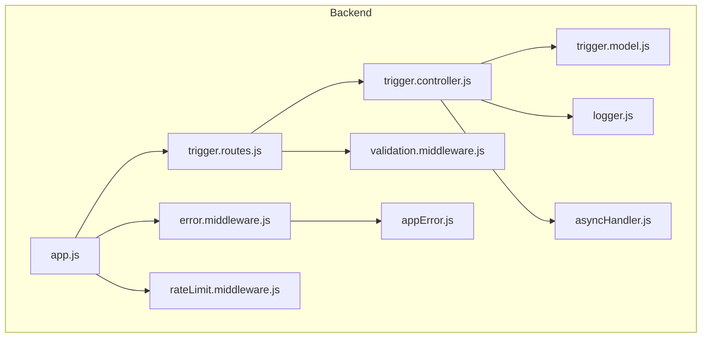
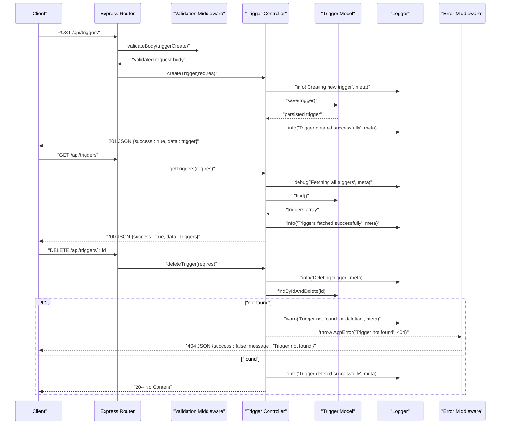
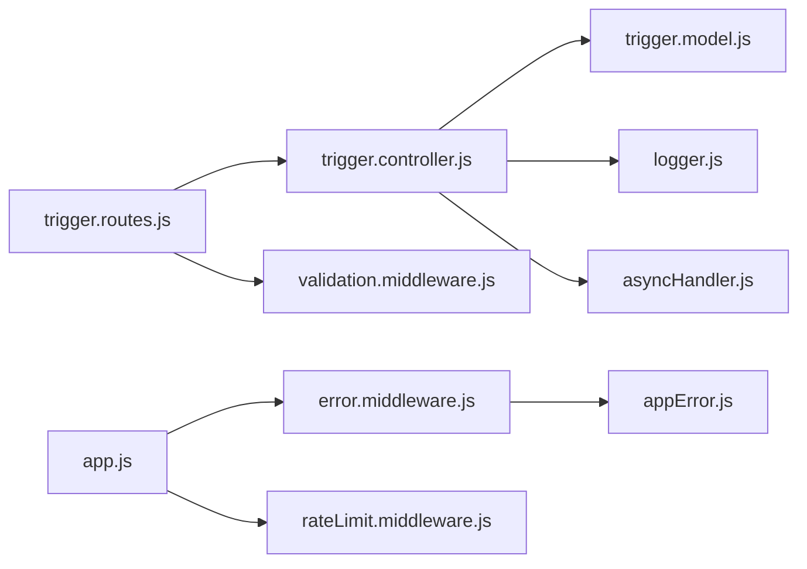

# Controller Implementation

<cite>
**Referenced Files in This Document**
- [trigger.controller.js](file://backend/src/controllers/trigger.controller.js)
- [trigger.routes.js](file://backend/src/routes/trigger.routes.js)
- [validation.middleware.js](file://backend/src/middleware/validation.middleware.js)
- [error.middleware.js](file://backend/src/middleware/error.middleware.js)
- [rateLimit.middleware.js](file://backend/src/middleware/rateLimit.middleware.js)
- [appError.js](file://backend/src/utils/appError.js)
- [asyncHandler.js](file://backend/src/utils/asyncHandler.js)
- [logger.js](file://backend/src/config/logger.js)
- [trigger.model.js](file://backend/src/models/trigger.model.js)
- [app.js](file://backend/src/app.js)
- [trigger.controller.test.js](file://backend/__tests__/trigger.controller.test.js)
</cite>

## Table of Contents
1. [Introduction](#introduction)
2. [Project Structure](#project-structure)
3. [Core Components](#core-components)
4. [Architecture Overview](#architecture-overview)
5. [Detailed Component Analysis](#detailed-component-analysis)
6. [Dependency Analysis](#dependency-analysis)
7. [Performance Considerations](#performance-considerations)
8. [Troubleshooting Guide](#troubleshooting-guide)
9. [Conclusion](#conclusion)

## Introduction
This document provides a comprehensive analysis of the trigger controller implementation in the EventHorizon backend. It focuses on the CRUD operations for triggers, including createTrigger, getTriggers, and deleteTrigger, detailing request/response handling, validation middleware integration, error handling via the AppError utility, logging patterns, security considerations, rate limiting integration, and performance optimization techniques used in the controller layer.

## Project Structure
The trigger controller resides in the controllers directory and integrates with route definitions, validation middleware, error handling, rate limiting, and logging utilities. The model defines the trigger schema and computed fields for health metrics.

**Diagram sources**
- [app.js:1-55](file://backend/src/app.js#L1-L55)
- [trigger.routes.js:1-92](file://backend/src/routes/trigger.routes.js#L1-L92)
- [trigger.controller.js:1-72](file://backend/src/controllers/trigger.controller.js#L1-L72)
- [validation.middleware.js:1-49](file://backend/src/middleware/validation.middleware.js#L1-L49)
- [error.middleware.js:1-59](file://backend/src/middleware/error.middleware.js#L1-L59)
- [rateLimit.middleware.js:1-51](file://backend/src/middleware/rateLimit.middleware.js#L1-L51)
- [logger.js:1-19](file://backend/src/config/logger.js#L1-L19)
- [trigger.model.js:1-80](file://backend/src/models/trigger.model.js#L1-L80)
- [asyncHandler.js:1-5](file://backend/src/utils/asyncHandler.js#L1-L5)
- [appError.js:1-16](file://backend/src/utils/appError.js#L1-L16)

**Section sources**
- [app.js:1-55](file://backend/src/app.js#L1-L55)
- [trigger.routes.js:1-92](file://backend/src/routes/trigger.routes.js#L1-L92)
- [trigger.controller.js:1-72](file://backend/src/controllers/trigger.controller.js#L1-L72)
- [validation.middleware.js:1-49](file://backend/src/middleware/validation.middleware.js#L1-L49)
- [error.middleware.js:1-59](file://backend/src/middleware/error.middleware.js#L1-L59)
- [rateLimit.middleware.js:1-51](file://backend/src/middleware/rateLimit.middleware.js#L1-L51)
- [logger.js:1-19](file://backend/src/config/logger.js#L1-L19)
- [trigger.model.js:1-80](file://backend/src/models/trigger.model.js#L1-L80)
- [asyncHandler.js:1-5](file://backend/src/utils/asyncHandler.js#L1-L5)
- [appError.js:1-16](file://backend/src/utils/appError.js#L1-L16)

## Core Components
This section documents the three primary controller methods and their responsibilities:

- createTrigger: Creates a new trigger from validated request body, persists it to the database, logs creation metadata, and returns a success payload with HTTP 201.
- getTriggers: Retrieves all triggers from the database, logs retrieval statistics, and returns a success payload with HTTP 200.
- deleteTrigger: Deletes a trigger by ID, handles missing records with a 404 error, logs deletion actions, and returns HTTP 204 on success.

Key integration points:
- Validation middleware enforces schema compliance for create operations.
- Async wrapper ensures errors are caught and forwarded to the error handler.
- Logger emits structured log entries for auditability and observability.
- Error handling normalizes exceptions into AppError instances for consistent responses.
- Rate limiting protects endpoints from abuse at the application level.

**Section sources**
- [trigger.controller.js:6-28](file://backend/src/controllers/trigger.controller.js#L6-L28)
- [trigger.controller.js:30-44](file://backend/src/controllers/trigger.controller.js#L30-L44)
- [trigger.controller.js:46-71](file://backend/src/controllers/trigger.controller.js#L46-L71)

## Architecture Overview
The controller layer sits between Express routes and the persistence layer. Routes define endpoint contracts and apply validation middleware. Controllers execute business logic, interact with models, and manage responses. Error handling and rate limiting are applied globally via middleware.

**Diagram sources**
- [trigger.routes.js:57-89](file://backend/src/routes/trigger.routes.js#L57-L89)
- [validation.middleware.js:24-41](file://backend/src/middleware/validation.middleware.js#L24-L41)
- [trigger.controller.js:6-71](file://backend/src/controllers/trigger.controller.js#L6-L71)
- [trigger.model.js:1-80](file://backend/src/models/trigger.model.js#L1-L80)
- [logger.js:1-19](file://backend/src/config/logger.js#L1-L19)
- [error.middleware.js:36-53](file://backend/src/middleware/error.middleware.js#L36-L53)

**Section sources**
- [trigger.routes.js:57-89](file://backend/src/routes/trigger.routes.js#L57-L89)
- [trigger.controller.js:6-71](file://backend/src/controllers/trigger.controller.js#L6-L71)
- [error.middleware.js:36-53](file://backend/src/middleware/error.middleware.js#L36-L53)

## Detailed Component Analysis

### Controller Methods and Request/Response Handling
- Method signatures and parameters:
  - createTrigger: Accepts Express request and response objects with a validated body containing trigger attributes.
  - getTriggers: Accepts Express request and response objects to list all triggers.
  - deleteTrigger: Accepts Express request and response objects with an ID parameter identifying the trigger to remove.
- Response formatting:
  - Success responses wrap data in a consistent shape with a boolean success flag and a data field.
  - HTTP status codes align with REST semantics: 201 for creation, 200 for listing, 204 for successful deletion.
- Logging patterns:
  - Structured log entries capture contextual metadata such as client IP, user agent, trigger identifiers, and counts.

Example snippet paths:
- [createTrigger method:6-28](file://backend/src/controllers/trigger.controller.js#L6-L28)
- [getTriggers method:30-44](file://backend/src/controllers/trigger.controller.js#L30-L44)
- [deleteTrigger method:46-71](file://backend/src/controllers/trigger.controller.js#L46-L71)

**Section sources**
- [trigger.controller.js:6-71](file://backend/src/controllers/trigger.controller.js#L6-L71)
- [logger.js:1-19](file://backend/src/config/logger.js#L1-L19)

### Validation Middleware Integration
- Schema enforcement:
  - The triggerCreate schema validates required fields, enumerations, defaults, and formats.
  - Unknown fields are stripped during validation for body payloads.
- Error response:
  - Validation failures return HTTP 400 with a structured error payload indicating validation failure and details per field.

Example snippet paths:
- [validation schemas:3-16](file://backend/src/middleware/validation.middleware.js#L3-L16)
- [validation pipeline:24-41](file://backend/src/middleware/validation.middleware.js#L24-L41)

**Section sources**
- [validation.middleware.js:3-16](file://backend/src/middleware/validation.middleware.js#L3-L16)
- [validation.middleware.js:24-41](file://backend/src/middleware/validation.middleware.js#L24-L41)
- [trigger.routes.js:57-61](file://backend/src/routes/trigger.routes.js#L57-L61)

### Error Handling Strategies Using AppError Utility
- Normalization:
  - The error middleware converts various error types (duplicate keys, validation errors, cast errors) into AppError instances with appropriate status codes and operational flags.
- Consistent responses:
  - Error responses include success=false, status classification, and optional details and stack traces in development mode.
- Propagation:
  - The async wrapper catches asynchronous errors and forwards them to the error handler.

Example snippet paths:
- [AppError class:1-16](file://backend/src/utils/appError.js#L1-L16)
- [error normalization:5-30](file://backend/src/middleware/error.middleware.js#L5-L30)
- [error handler:36-53](file://backend/src/middleware/error.middleware.js#L36-L53)
- [async wrapper:1-5](file://backend/src/utils/asyncHandler.js#L1-L5)

**Section sources**
- [appError.js:1-16](file://backend/src/utils/appError.js#L1-L16)
- [error.middleware.js:5-30](file://backend/src/middleware/error.middleware.js#L5-L30)
- [error.middleware.js:36-53](file://backend/src/middleware/error.middleware.js#L36-L53)
- [asyncHandler.js:1-5](file://backend/src/utils/asyncHandler.js#L1-L5)

### Logging Patterns
- Structured logging:
  - Controllers log meaningful events with contextual metadata (e.g., trigger IDs, counts, IP addresses).
  - Log levels distinguish between informational, warning, error, and debug messages.
- Environment-aware logging:
  - Debug logs are suppressed outside production environments.

Example snippet paths:
- [controller logs:7-22](file://backend/src/controllers/trigger.controller.js#L7-L22)
- [logger utility:1-19](file://backend/src/config/logger.js#L1-L19)

**Section sources**
- [trigger.controller.js:7-22](file://backend/src/controllers/trigger.controller.js#L7-L22)
- [logger.js:1-19](file://backend/src/config/logger.js#L1-L19)

### Security Considerations
- Input sanitization:
  - Validation middleware strips unknown fields from request bodies to prevent unexpected data injection.
- Authentication and authorization:
  - While the trigger routes themselves do not enforce auth, the application-level auth middleware and routes exist for protected endpoints. The trigger controller does not perform auth checks itself.
- Rate limiting:
  - Global rate limiter applies to all routes under /api.
  - Authentication-specific rate limiter is mounted at /api/auth.

Example snippet paths:
- [global rate limiter mounting](file://backend/src/app.js#L21)
- [auth rate limiter mounting](file://backend/src/app.js#L22)
- [rate limiter configuration:31-45](file://backend/src/middleware/rateLimit.middleware.js#L31-L45)

**Section sources**
- [app.js:21](file://backend/src/app.js#L21)
- [app.js:22](file://backend/src/app.js#L22)
- [rateLimit.middleware.js:31-45](file://backend/src/middleware/rateLimit.middleware.js#L31-L45)

### Performance Optimization Techniques
- Efficient queries:
  - The getTriggers operation performs a straightforward collection scan. Consider adding pagination or filtering for large datasets.
- Minimal transformations:
  - Responses avoid unnecessary transformations; data is returned as-is from the model.
- Asynchronous error handling:
  - The async wrapper reduces boilerplate and centralizes error propagation.

Example snippet paths:
- [getTriggers query](file://backend/src/controllers/trigger.controller.js#L33)
- [async wrapper usage](file://backend/src/controllers/trigger.controller.js#L6)

**Section sources**
- [trigger.controller.js:33](file://backend/src/controllers/trigger.controller.js#L33)
- [trigger.controller.js:6](file://backend/src/controllers/trigger.controller.js#L6)

### Model Integration and Health Metrics
- Schema fields:
  - The trigger model defines core attributes, action configuration, activity flags, polling metadata, and health-related counters.
- Computed fields:
  - Virtual healthScore and healthStatus provide aggregated insights into trigger reliability.

Example snippet paths:
- [trigger schema:3-62](file://backend/src/models/trigger.model.js#L3-L62)
- [healthScore virtual:65-69](file://backend/src/models/trigger.model.js#L65-L69)
- [healthStatus virtual:72-77](file://backend/src/models/trigger.model.js#L72-L77)

**Section sources**
- [trigger.model.js:3-62](file://backend/src/models/trigger.model.js#L3-L62)
- [trigger.model.js:65-77](file://backend/src/models/trigger.model.js#L65-L77)

### Route Definitions and OpenAPI Documentation
- Endpoint contracts:
  - POST /api/triggers: Validates input using the triggerCreate schema and delegates to createTrigger.
  - GET /api/triggers: Returns all triggers via getTriggers.
  - DELETE /api/triggers/:id: Removes a trigger by ID via deleteTrigger.
- OpenAPI comments:
  - Routes include OpenAPI documentation blocks describing summaries, request bodies, and response schemas.

Example snippet paths:
- [POST /api/triggers:57-61](file://backend/src/routes/trigger.routes.js#L57-L61)
- [GET /api/triggers](file://backend/src/routes/trigger.routes.js#L62)
- [DELETE /api/triggers/:id](file://backend/src/routes/trigger.routes.js#L89)

**Section sources**
- [trigger.routes.js:57-61](file://backend/src/routes/trigger.routes.js#L57-L61)
- [trigger.routes.js:62](file://backend/src/routes/trigger.routes.js#L62)
- [trigger.routes.js:89](file://backend/src/routes/trigger.routes.js#L89)

### Test Coverage Highlights
- Payload wrapping:
  - getTriggers returns a success-wrapped payload suitable for clients.
- Error forwarding:
  - deleteTrigger throws an AppError when attempting to delete a non-existent trigger, ensuring consistent error handling.

Example snippet paths:
- [getTriggers test:16-34](file://backend/__tests__/trigger.controller.test.js#L16-L34)
- [deleteTrigger error test:36-59](file://backend/__tests__/trigger.controller.test.js#L36-L59)

**Section sources**
- [trigger.controller.test.js:16-34](file://backend/__tests__/trigger.controller.test.js#L16-L34)
- [trigger.controller.test.js:36-59](file://backend/__tests__/trigger.controller.test.js#L36-L59)

## Dependency Analysis
The controller depends on the model for persistence, the logger for structured logging, and the async wrapper for error handling. Route definitions depend on the controller and validation middleware. Error handling and rate limiting are applied globally via middleware.

**Diagram sources**
- [trigger.controller.js:1-5](file://backend/src/controllers/trigger.controller.js#L1-L5)
- [trigger.routes.js:3-7](file://backend/src/routes/trigger.routes.js#L3-L7)
- [app.js:14-14](file://backend/src/app.js#L14-L14)
- [error.middleware.js:1-1](file://backend/src/middleware/error.middleware.js#L1-L1)
- [rateLimit.middleware.js:1-1](file://backend/src/middleware/rateLimit.middleware.js#L1-L1)
- [appError.js:1-1](file://backend/src/utils/appError.js#L1-L1)

**Section sources**
- [trigger.controller.js:1-5](file://backend/src/controllers/trigger.controller.js#L1-L5)
- [trigger.routes.js:3-7](file://backend/src/routes/trigger.routes.js#L3-L7)
- [app.js:14-14](file://backend/src/app.js#L14-L14)
- [error.middleware.js:1-1](file://backend/src/middleware/error.middleware.js#L1-L1)
- [rateLimit.middleware.js:1-1](file://backend/src/middleware/rateLimit.middleware.js#L1-L1)
- [appError.js:1-1](file://backend/src/utils/appError.js#L1-L1)

## Performance Considerations
- Query optimization:
  - For large datasets, implement pagination and selective filtering in getTriggers to reduce memory and network overhead.
- Index usage:
  - The model schema includes indexes on frequently queried fields (e.g., contractId, metadata). Ensure queries leverage these indexes.
- Response size:
  - Consider returning projections or paginated responses to minimize payload sizes.
- Concurrency:
  - Rate limiting prevents resource exhaustion; tune limits according to infrastructure capacity.

[No sources needed since this section provides general guidance]

## Troubleshooting Guide
Common issues and resolutions:
- Validation failures:
  - Ensure the request body conforms to the triggerCreate schema. The validator returns a structured error payload with details per field.
- Not found errors:
  - Deleting a non-existent trigger results in a 404 AppError. Verify the ID format and existence before deletion.
- Operational errors:
  - Unexpected internal errors are normalized into AppError instances with appropriate status codes and operational flags.

Example snippet paths:
- [validation error response:32-36](file://backend/src/middleware/validation.middleware.js#L32-L36)
- [not found error handling:54-61](file://backend/src/controllers/trigger.controller.js#L54-L61)
- [error normalization:25-29](file://backend/src/middleware/error.middleware.js#L25-L29)

**Section sources**
- [validation.middleware.js:32-36](file://backend/src/middleware/validation.middleware.js#L32-L36)
- [trigger.controller.js:54-61](file://backend/src/controllers/trigger.controller.js#L54-L61)
- [error.middleware.js:25-29](file://backend/src/middleware/error.middleware.js#L25-L29)

## Conclusion
The trigger controller implements clean, consistent CRUD operations with robust validation, structured logging, and centralized error handling. Integration with global rate limiting and error middleware ensures security and resilience. Future enhancements could include pagination, schema-driven filtering, and stricter authentication for sensitive endpoints.