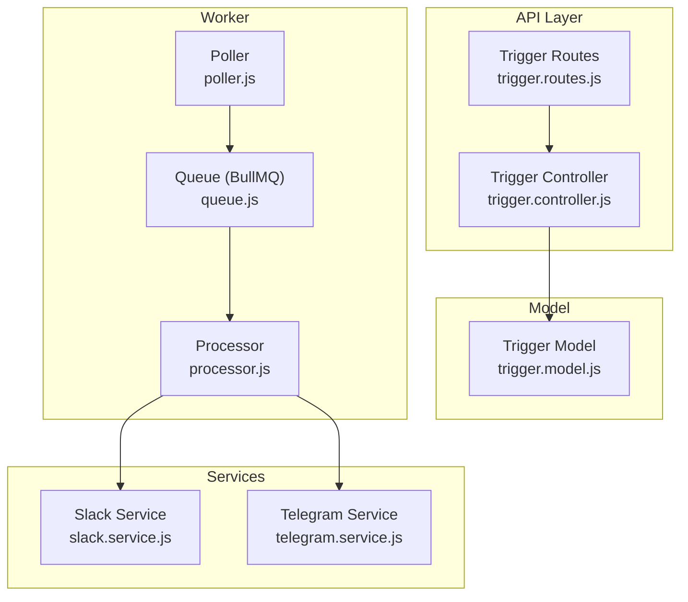
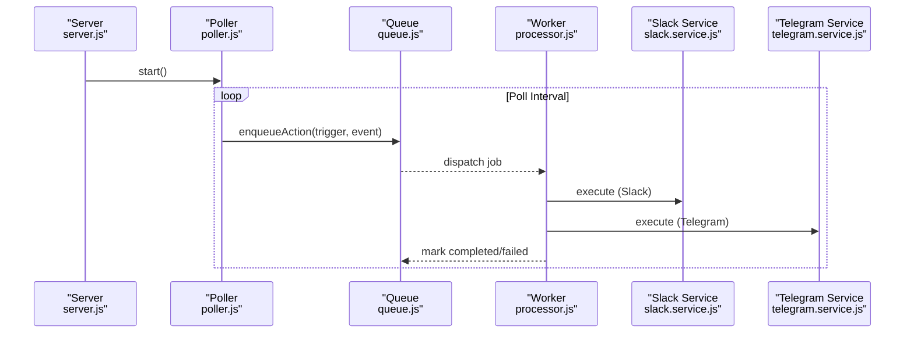
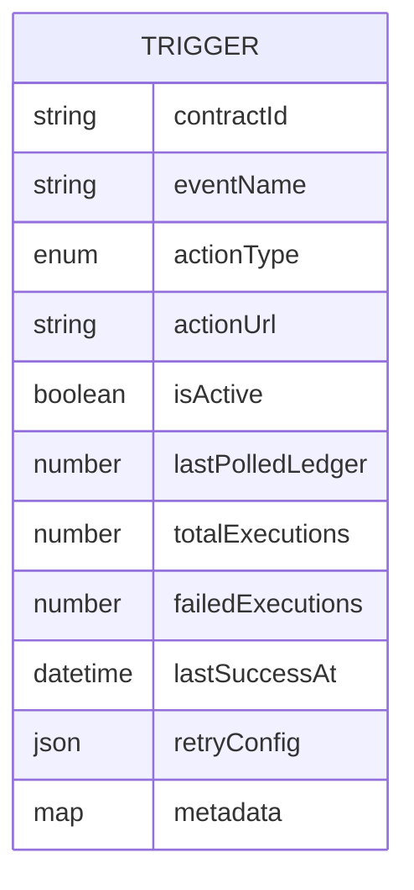
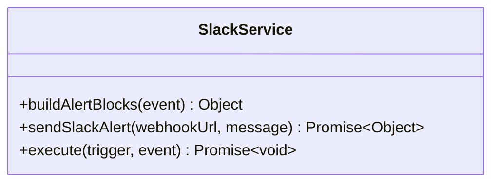
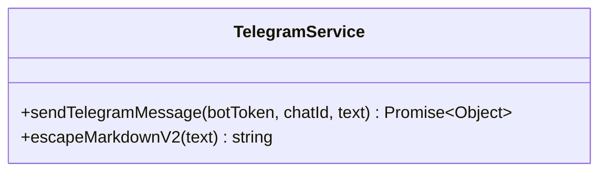
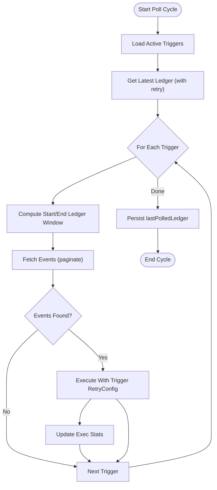
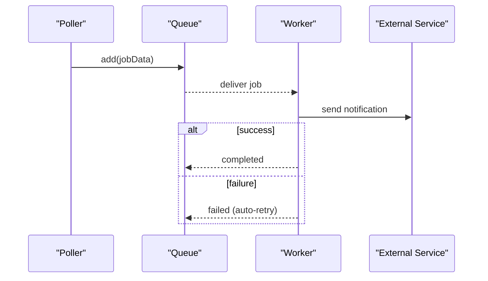
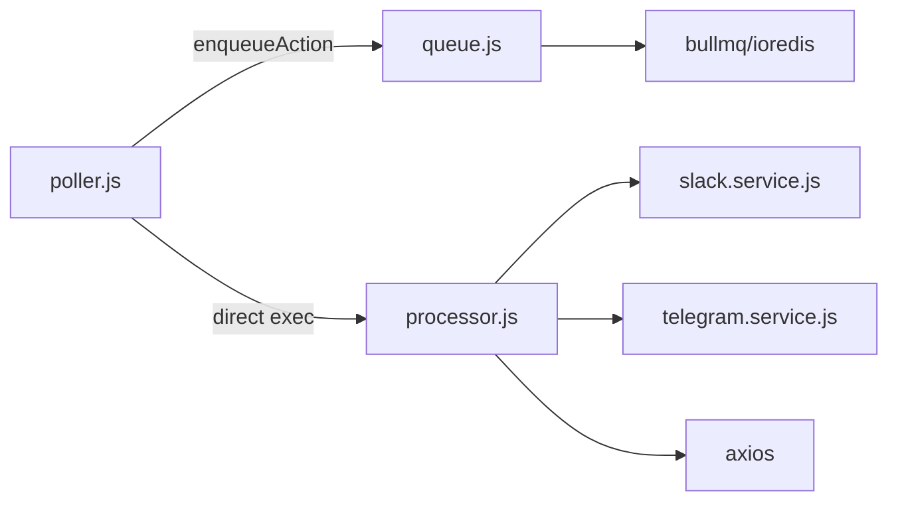

# Notification Service Integration

<cite>
**Referenced Files in This Document**
- [slack.service.js](file://backend/src/services/slack.service.js)
- [telegram.service.js](file://backend/src/services/telegram.service.js)
- [trigger.model.js](file://backend/src/models/trigger.model.js)
- [trigger.controller.js](file://backend/src/controllers/trigger.controller.js)
- [trigger.routes.js](file://backend/src/routes/trigger.routes.js)
- [poller.js](file://backend/src/worker/poller.js)
- [queue.js](file://backend/src/worker/queue.js)
- [processor.js](file://backend/src/worker/processor.js)
- [validation.middleware.js](file://backend/src/middleware/validation.middleware.js)
- [server.js](file://backend/src/server.js)
- [app.js](file://backend/src/app.js)
- [slack.test.js](file://backend/__tests__/slack.test.js)
- [telegram.test.js](file://backend/__tests__/telegram.test.js)
- [QUEUE_SETUP.md](file://backend/QUEUE_SETUP.md)
</cite>

## Table of Contents
1. [Introduction](#introduction)
2. [Project Structure](#project-structure)
3. [Core Components](#core-components)
4. [Architecture Overview](#architecture-overview)
5. [Detailed Component Analysis](#detailed-component-analysis)
6. [Dependency Analysis](#dependency-analysis)
7. [Performance Considerations](#performance-considerations)
8. [Troubleshooting Guide](#troubleshooting-guide)
9. [Conclusion](#conclusion)
10. [Appendices](#appendices)

## Introduction
This document explains how the trigger system integrates with notification services to deliver alerts to Slack, Telegram, and generic webhooks. It covers the service architecture, message formatting per platform, configuration patterns, retry and failure handling, and operational guidance for high-volume scenarios. The system separates event detection from action execution by using a background queue to ensure reliable, scalable delivery.

## Project Structure
The notification integration spans several layers:
- Triggers are defined and stored in MongoDB via a model and controller.
- The poller detects Soroban events and enqueues actions to a Redis-backed queue.
- A worker pool executes actions with retries and rate limiting.
- Platform-specific services format and send messages to external providers.

**Diagram sources**
- [trigger.routes.js:1-92](file://backend/src/routes/trigger.routes.js#L1-L92)
- [trigger.controller.js:1-72](file://backend/src/controllers/trigger.controller.js#L1-L72)
- [trigger.model.js:1-80](file://backend/src/models/trigger.model.js#L1-L80)
- [poller.js:1-335](file://backend/src/worker/poller.js#L1-L335)
- [queue.js:1-164](file://backend/src/worker/queue.js#L1-L164)
- [processor.js:1-174](file://backend/src/worker/processor.js#L1-L174)
- [slack.service.js:1-165](file://backend/src/services/slack.service.js#L1-L165)
- [telegram.service.js:1-74](file://backend/src/services/telegram.service.js#L1-L74)

**Section sources**
- [trigger.routes.js:1-92](file://backend/src/routes/trigger.routes.js#L1-L92)
- [trigger.controller.js:1-72](file://backend/src/controllers/trigger.controller.js#L1-L72)
- [trigger.model.js:1-80](file://backend/src/models/trigger.model.js#L1-L80)
- [poller.js:1-335](file://backend/src/worker/poller.js#L1-L335)
- [queue.js:1-164](file://backend/src/worker/queue.js#L1-L164)
- [processor.js:1-174](file://backend/src/worker/processor.js#L1-L174)
- [slack.service.js:1-165](file://backend/src/services/slack.service.js#L1-L165)
- [telegram.service.js:1-74](file://backend/src/services/telegram.service.js#L1-L74)

## Core Components
- Trigger model defines action types and retry configuration, including health metrics.
- Poller queries Soroban events, filters by contract and topic, and enqueues actions.
- Queue persists jobs in Redis with automatic retries and retention policies.
- Processor selects the appropriate service per action type and executes the action.
- Slack and Telegram services encapsulate message formatting and provider-specific error handling.

Key configuration points:
- Trigger actionType supports webhook, discord, email, telegram.
- Retry behavior is controlled per-trigger via retryConfig and globally via queue backoff.
- Rate limiting is applied in the processor to avoid overwhelming external APIs.

**Section sources**
- [trigger.model.js:13-57](file://backend/src/models/trigger.model.js#L13-L57)
- [poller.js:152-173](file://backend/src/worker/poller.js#L152-L173)
- [queue.js:23-36](file://backend/src/worker/queue.js#L23-L36)
- [processor.js:128-135](file://backend/src/worker/processor.js#L128-L135)

## Architecture Overview
The system uses a producer-consumer pattern:
- Producer: Poller detects events and enqueues jobs.
- Queue: BullMQ with Redis persists jobs and manages retries.
- Consumer: Worker pool executes jobs with concurrency and rate limiting.

**Diagram sources**
- [server.js:44-58](file://backend/src/server.js#L44-L58)
- [poller.js:312-329](file://backend/src/worker/poller.js#L312-L329)
- [queue.js:91-121](file://backend/src/worker/queue.js#L91-L121)
- [processor.js:102-167](file://backend/src/worker/processor.js#L102-L167)
- [slack.service.js:142-159](file://backend/src/services/slack.service.js#L142-L159)
- [telegram.service.js:15-57](file://backend/src/services/telegram.service.js#L15-L57)

## Detailed Component Analysis

### Trigger Model and Validation
- Defines supported action types and metadata for health tracking.
- Provides computed healthScore and healthStatus virtuals.
- Validation middleware ensures required fields and defaults.

**Diagram sources**
- [trigger.model.js:3-62](file://backend/src/models/trigger.model.js#L3-L62)

**Section sources**
- [trigger.model.js:13-77](file://backend/src/models/trigger.model.js#L13-L77)
- [validation.middleware.js:4-16](file://backend/src/middleware/validation.middleware.js#L4-L16)
- [trigger.routes.js:57-89](file://backend/src/routes/trigger.routes.js#L57-L89)

### Slack Notification Service
- Formats rich Slack Block Kit messages from event payloads.
- Supports severity-based emojis and contextual timestamps.
- Handles Slack-specific HTTP errors and rate limiting.

**Diagram sources**
- [slack.service.js:6-160](file://backend/src/services/slack.service.js#L6-L160)

**Section sources**
- [slack.service.js:13-88](file://backend/src/services/slack.service.js#L13-L88)
- [slack.service.js:97-134](file://backend/src/services/slack.service.js#L97-L134)
- [slack.service.js:142-159](file://backend/src/services/slack.service.js#L142-L159)

### Telegram Notification Service
- Sends MarkdownV2-formatted messages via Telegram Bot API.
- Escapes special characters required by MarkdownV2.
- Handles common Telegram API errors gracefully.

**Diagram sources**
- [telegram.service.js:6-71](file://backend/src/services/telegram.service.js#L6-L71)

**Section sources**
- [telegram.service.js:15-57](file://backend/src/services/telegram.service.js#L15-L57)
- [telegram.service.js:66-70](file://backend/src/services/telegram.service.js#L66-L70)

### Poller and Retry Strategy
- Queries Soroban events with pagination and exponential backoff for RPC calls.
- Enqueues actions via queue.enqueueAction with trigger-specific retryConfig.
- Tracks execution stats and persists lastPolledLedger.

**Diagram sources**
- [poller.js:177-310](file://backend/src/worker/poller.js#L177-L310)
- [poller.js:152-173](file://backend/src/worker/poller.js#L152-L173)

**Section sources**
- [poller.js:19-51](file://backend/src/worker/poller.js#L19-L51)
- [poller.js:177-310](file://backend/src/worker/poller.js#L177-L310)
- [poller.js:152-173](file://backend/src/worker/poller.js#L152-L173)

### Queue and Worker Execution
- Queue persists jobs with attempts, exponential backoff, and retention.
- Worker executes actions with concurrency and rate limiting.
- Supports graceful shutdown and logging.

**Diagram sources**
- [queue.js:91-121](file://backend/src/worker/queue.js#L91-L121)
- [queue.js:23-36](file://backend/src/worker/queue.js#L23-L36)
- [processor.js:102-167](file://backend/src/worker/processor.js#L102-L167)

**Section sources**
- [queue.js:19-41](file://backend/src/worker/queue.js#L19-L41)
- [queue.js:91-121](file://backend/src/worker/queue.js#L91-L121)
- [processor.js:128-135](file://backend/src/worker/processor.js#L128-L135)
- [processor.js:138-159](file://backend/src/worker/processor.js#L138-L159)

### Message Formatting Per Platform
- Slack: Rich header, severity badges, network/contract context, payload code block, contextual timestamp.
- Telegram: MarkdownV2 with escaped characters, structured fields for event, contract, and payload.
- Webhook/Discord: Simple JSON payload with contractId, eventName, and payload.

**Section sources**
- [slack.service.js:13-88](file://backend/src/services/slack.service.js#L13-L88)
- [telegram.service.js:15-57](file://backend/src/services/telegram.service.js#L15-L57)
- [processor.js:45-96](file://backend/src/worker/processor.js#L45-L96)

### API and Configuration Patterns
- Create triggers via POST /api/triggers with validation.
- List and delete triggers via GET /api/triggers and DELETE /api/triggers/:id.
- Trigger actionType supports webhook, discord, email, telegram.
- Retry behavior is configurable per trigger and enforced by the queue.

**Section sources**
- [trigger.routes.js:57-89](file://backend/src/routes/trigger.routes.js#L57-L89)
- [validation.middleware.js:4-16](file://backend/src/middleware/validation.middleware.js#L4-L16)
- [trigger.model.js:13-57](file://backend/src/models/trigger.model.js#L13-L57)

## Dependency Analysis
- The poller conditionally enqueues actions either to the queue or executes directly if Redis is unavailable.
- The processor dynamically routes to platform-specific services based on actionType.
- External dependencies include Axios for HTTP calls, BullMQ/ioredis for queueing, and Stellar SDK for RPC.

**Diagram sources**
- [poller.js:59-147](file://backend/src/worker/poller.js#L59-L147)
- [processor.js:1-7](file://backend/src/worker/processor.js#L1-L7)
- [queue.js:1-3](file://backend/src/worker/queue.js#L1-L3)

**Section sources**
- [poller.js:59-147](file://backend/src/worker/poller.js#L59-L147)
- [processor.js:1-7](file://backend/src/worker/processor.js#L1-L7)
- [queue.js:1-3](file://backend/src/worker/queue.js#L1-L3)

## Performance Considerations
- Background processing: Use Redis-backed queue to avoid blocking event polling.
- Concurrency: Tune WORKER_CONCURRENCY to match downstream provider capacity.
- Rate limiting: Built-in limiter in processor prevents bursty external API calls.
- Retries: Queue attempts plus trigger-level retries reduce permanent failures.
- Pagination and batching: Poller paginates events and sleeps between pages to respect rate limits.
- Monitoring: Use queue stats endpoints and Bull Board for observability.

[No sources needed since this section provides general guidance]

## Troubleshooting Guide
Common issues and resolutions:
- Redis connectivity: Ensure Redis is running and reachable; verify with redis-cli ping.
- Jobs stuck in waiting: Check worker logs; restart server to recover workers.
- High memory usage: Lower WORKER_CONCURRENCY or prune old jobs.
- Provider errors:
  - Slack: Inspect rate limit headers and adjust retry intervals; verify webhook URL and permissions.
  - Telegram: Validate bot token and chat ID; ensure MarkdownV2 escaping is applied.
- Health monitoring: Use trigger healthScore and healthStatus to track reliability.

Operational references:
- Queue setup and troubleshooting steps are documented in QUEUE_SETUP.md.
- Tests demonstrate payload generation and escaping logic for Slack and Telegram.

**Section sources**
- [QUEUE_SETUP.md:204-227](file://backend/QUEUE_SETUP.md#L204-L227)
- [slack.test.js:1-58](file://backend/__tests__/slack.test.js#L1-L58)
- [telegram.test.js:1-42](file://backend/__tests__/telegram.test.js#L1-L42)
- [slack.service.js:102-134](file://backend/src/services/slack.service.js#L102-L134)
- [telegram.service.js:30-57](file://backend/src/services/telegram.service.js#L30-L57)

## Conclusion
The notification integration leverages a robust, queue-driven architecture to reliably deliver alerts across Slack, Telegram, and webhooks. By combining trigger-level retry configuration with queue-level retries and rate limiting, the system achieves high throughput and resilience. Operators can monitor health, tune concurrency, and troubleshoot provider-specific issues using built-in logging and queue monitoring capabilities.

[No sources needed since this section summarizes without analyzing specific files]

## Appendices

### Practical Configuration Examples
- Slack webhook: actionType webhook with actionUrl pointing to a Slack incoming webhook; optionally supply a custom message in trigger.action.message.
- Telegram: actionType telegram with botToken and chatId configured; actionUrl can carry chatId depending on deployment.
- Webhook/Discord: actionType webhook/discord with actionUrl as the target endpoint.

**Section sources**
- [trigger.model.js:13-21](file://backend/src/models/trigger.model.js#L13-L21)
- [poller.js:111-131](file://backend/src/worker/poller.js#L111-L131)
- [processor.js:68-92](file://backend/src/worker/processor.js#L68-L92)

### Delivery Guarantees and Reliability
- Guaranteed delivery: Jobs persist in Redis until completion or failure thresholds.
- Automatic retries: Queue attempts with exponential backoff; trigger-level retries augment this.
- Idempotency: Consumers should treat duplicate deliveries safely; deduplication can be implemented at the provider level or by tracking seen event IDs.

**Section sources**
- [queue.js:23-36](file://backend/src/worker/queue.js#L23-L36)
- [poller.js:152-173](file://backend/src/worker/poller.js#L152-L173)

### High-Volume Recommendations
- Scale workers horizontally across hosts.
- Use Redis Cluster for high availability.
- Monitor queue backlog and adjust concurrency accordingly.
- Implement provider-side rate limit handling and backoff strategies.

**Section sources**
- [QUEUE_SETUP.md:221-234](file://backend/QUEUE_SETUP.md#L221-L234)
- [processor.js:128-135](file://backend/src/worker/processor.js#L128-L135)