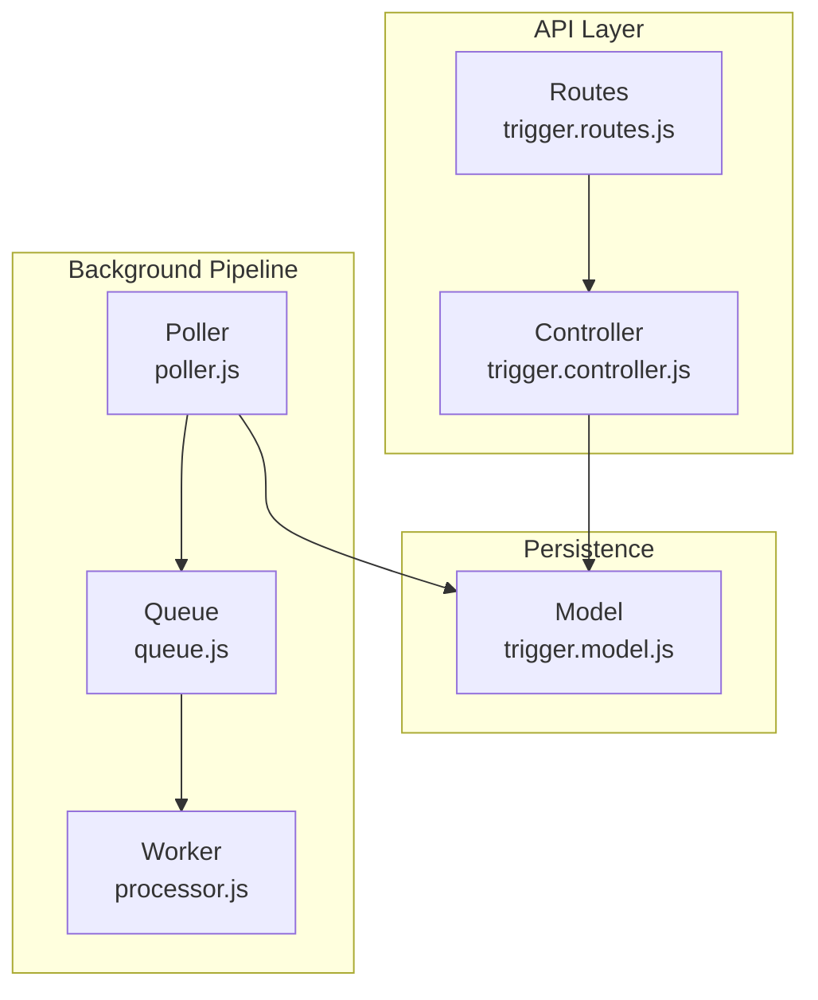
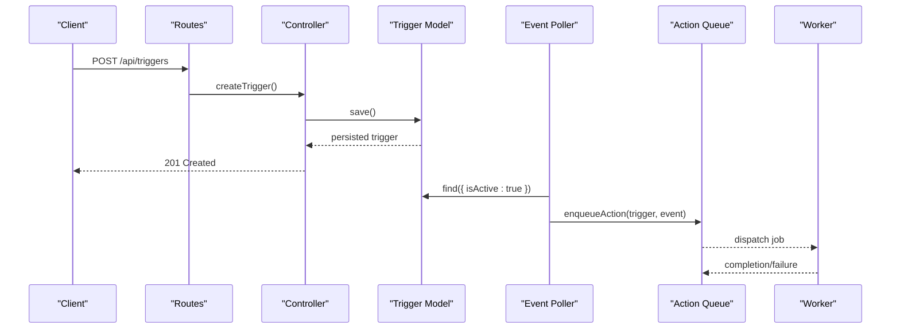
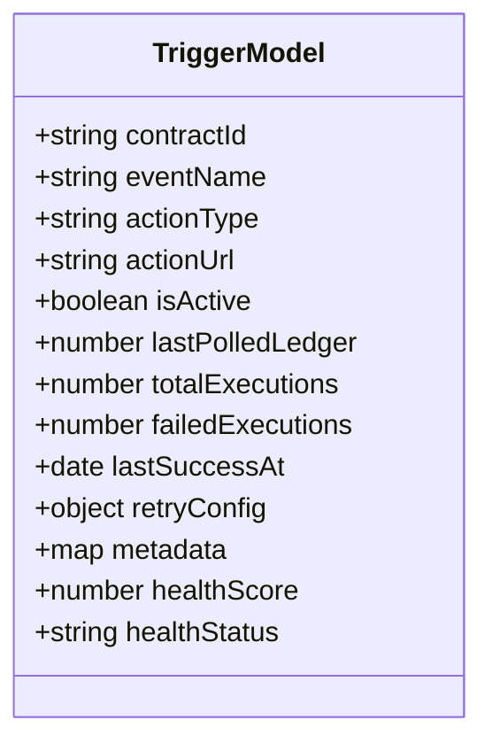
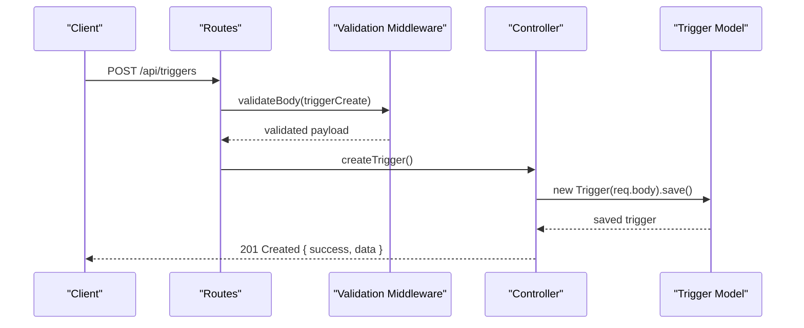
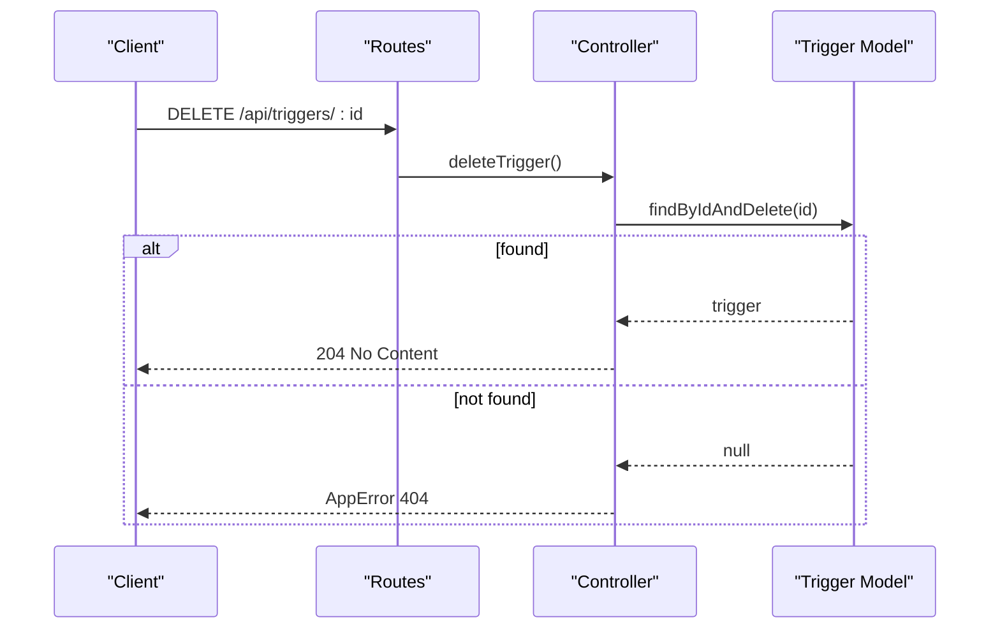
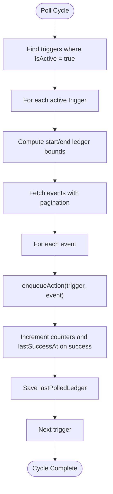
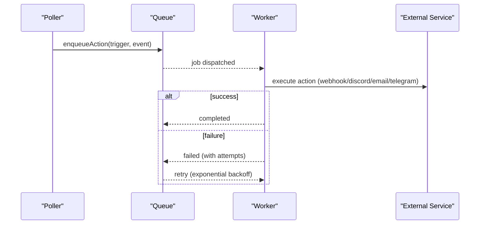
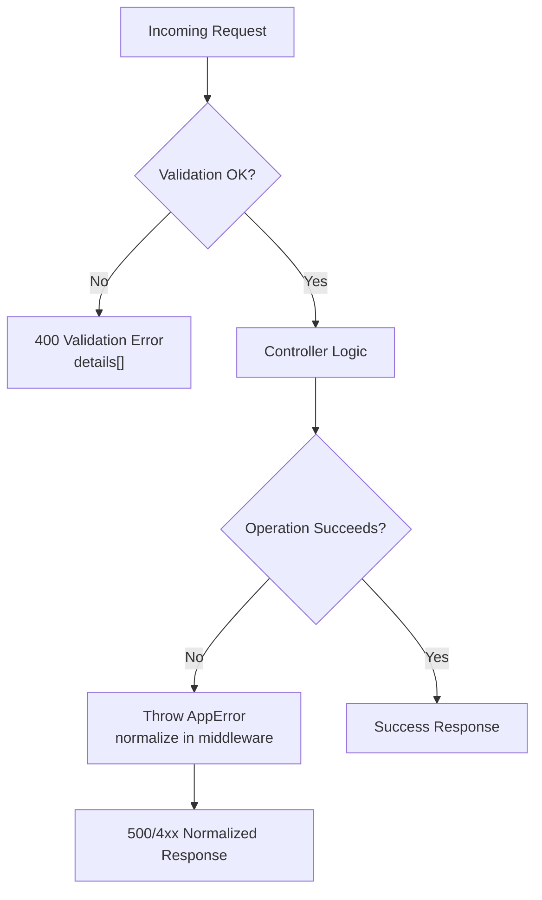
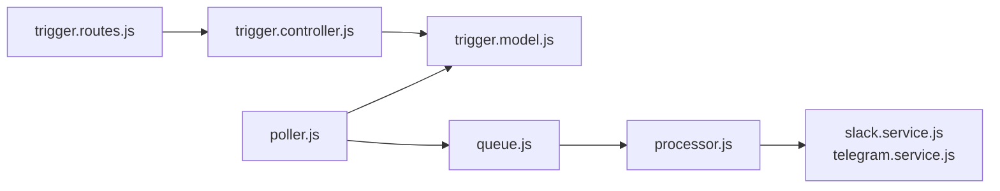

# Trigger Lifecycle Management

<cite>
**Referenced Files in This Document**
- [trigger.controller.js](file://backend/src/controllers/trigger.controller.js)
- [trigger.model.js](file://backend/src/models/trigger.model.js)
- [trigger.routes.js](file://backend/src/routes/trigger.routes.js)
- [validation.middleware.js](file://backend/src/middleware/validation.middleware.js)
- [poller.js](file://backend/src/worker/poller.js)
- [queue.js](file://backend/src/worker/queue.js)
- [processor.js](file://backend/src/worker/processor.js)
- [slack.service.js](file://backend/src/services/slack.service.js)
- [telegram.service.js](file://backend/src/services/telegram.service.js)
- [error.middleware.js](file://backend/src/middleware/error.middleware.js)
- [appError.js](file://backend/src/utils/appError.js)
- [QUICKSTART_QUEUE.md](file://backend/QUICKSTART_QUEUE.md)
</cite>

## Table of Contents
1. [Introduction](#introduction)
2. [Project Structure](#project-structure)
3. [Core Components](#core-components)
4. [Architecture Overview](#architecture-overview)
5. [Detailed Component Analysis](#detailed-component-analysis)
6. [Dependency Analysis](#dependency-analysis)
7. [Performance Considerations](#performance-considerations)
8. [Troubleshooting Guide](#troubleshooting-guide)
9. [Conclusion](#conclusion)
10. [Appendices](#appendices)

## Introduction
This document explains the complete trigger lifecycle in EventHorizon, from creation to deletion, including validation, initial status, configuration options, activation/deactivation, bulk operations, status transitions, error handling, and operational best practices. It also covers optimization strategies, performance monitoring, and troubleshooting common lifecycle issues.

## Project Structure
The trigger lifecycle spans the API surface, persistence, validation, and the background event polling and processing pipeline:
- API layer: routes and controller for trigger CRUD
- Validation: request schema enforcement
- Persistence: trigger model with health metrics and retry configuration
- Background processing: event poller, queue, and worker

**Diagram sources**
- [trigger.routes.js:1-92](file://backend/src/routes/trigger.routes.js#L1-L92)
- [trigger.controller.js:1-72](file://backend/src/controllers/trigger.controller.js#L1-L72)
- [trigger.model.js:1-80](file://backend/src/models/trigger.model.js#L1-L80)
- [poller.js:1-335](file://backend/src/worker/poller.js#L1-L335)
- [queue.js:1-164](file://backend/src/worker/queue.js#L1-L164)
- [processor.js:1-174](file://backend/src/worker/processor.js#L1-L174)

**Section sources**
- [trigger.routes.js:1-92](file://backend/src/routes/trigger.routes.js#L1-L92)
- [trigger.controller.js:1-72](file://backend/src/controllers/trigger.controller.js#L1-L72)
- [trigger.model.js:1-80](file://backend/src/models/trigger.model.js#L1-L80)
- [poller.js:1-335](file://backend/src/worker/poller.js#L1-L335)
- [queue.js:1-164](file://backend/src/worker/queue.js#L1-L164)
- [processor.js:1-174](file://backend/src/worker/processor.js#L1-L174)

## Core Components
- Trigger model defines schema, defaults, indexes, and computed health metrics.
- Controller exposes create, list, and delete endpoints with logging and error propagation.
- Routes apply validation middleware before invoking controller handlers.
- Poller queries active triggers, scans Soroban events, enqueues actions, and updates trigger state.
- Queue and Worker provide resilient background processing with retries and observability.

Key lifecycle capabilities:
- Creation with validation and default status set to active
- Deletion by ID with not-found handling
- Activation controlled by the isActive flag (used by poller)
- Bulk operations supported by listing and deleting multiple triggers
- Health metrics and status derived from execution statistics

**Section sources**
- [trigger.model.js:1-80](file://backend/src/models/trigger.model.js#L1-L80)
- [trigger.controller.js:6-71](file://backend/src/controllers/trigger.controller.js#L6-L71)
- [trigger.routes.js:57-89](file://backend/src/routes/trigger.routes.js#L57-L89)
- [poller.js:177-310](file://backend/src/worker/poller.js#L177-L310)
- [queue.js:91-121](file://backend/src/worker/queue.js#L91-L121)
- [processor.js:25-97](file://backend/src/worker/processor.js#L25-L97)

## Architecture Overview
The trigger lifecycle integrates API requests, database persistence, and background processing:
- API validates and persists triggers
- Poller reads active triggers and emits actions
- Queue enqueues actions; Worker executes them with retries
- Slack and Telegram services encapsulate external integrations

**Diagram sources**
- [trigger.routes.js:57-61](file://backend/src/routes/trigger.routes.js#L57-L61)
- [trigger.controller.js:6-28](file://backend/src/controllers/trigger.controller.js#L6-L28)
- [trigger.model.js:1-80](file://backend/src/models/trigger.model.js#L1-L80)
- [poller.js:177-310](file://backend/src/worker/poller.js#L177-L310)
- [queue.js:91-121](file://backend/src/worker/queue.js#L91-L121)
- [processor.js:102-127](file://backend/src/worker/processor.js#L102-L127)

## Detailed Component Analysis

### Trigger Model and Validation
- Schema fields include identifiers, action configuration, activation flag, polling progress, execution counters, and retry configuration.
- Computed virtuals derive health score and status from execution metrics.
- Validation schema enforces required fields and defaults for creation.

**Diagram sources**
- [trigger.model.js:3-79](file://backend/src/models/trigger.model.js#L3-L79)

**Section sources**
- [trigger.model.js:3-79](file://backend/src/models/trigger.model.js#L3-L79)
- [validation.middleware.js:4-11](file://backend/src/middleware/validation.middleware.js#L4-L11)

### Trigger Creation Workflow
- Request passes validation middleware before reaching controller.
- Controller instantiates and saves the trigger, returning 201 with the created resource.
- Logging records creation context including client IP and user agent.

**Diagram sources**
- [trigger.routes.js:57-61](file://backend/src/routes/trigger.routes.js#L57-L61)
- [validation.middleware.js:24-41](file://backend/src/middleware/validation.middleware.js#L24-L41)
- [trigger.controller.js:6-28](file://backend/src/controllers/trigger.controller.js#L6-L28)
- [trigger.model.js:14](file://backend/src/models/trigger.model.js#L14)

**Section sources**
- [trigger.routes.js:57-61](file://backend/src/routes/trigger.routes.js#L57-L61)
- [validation.middleware.js:4-11](file://backend/src/middleware/validation.middleware.js#L4-L11)
- [trigger.controller.js:6-28](file://backend/src/controllers/trigger.controller.js#L6-L28)

### Trigger Deletion Workflow
- Controller deletes by ID and returns 204 on success.
- If not found, throws an AppError with 404 status.

**Diagram sources**
- [trigger.routes.js:89](file://backend/src/routes/trigger.routes.js#L89)
- [trigger.controller.js:46-71](file://backend/src/controllers/trigger.controller.js#L46-L71)
- [appError.js:1-16](file://backend/src/utils/appError.js#L1-L16)

**Section sources**
- [trigger.routes.js:89](file://backend/src/routes/trigger.routes.js#L89)
- [trigger.controller.js:46-71](file://backend/src/controllers/trigger.controller.js#L46-L71)
- [appError.js:1-16](file://backend/src/utils/appError.js#L1-L16)

### Trigger Activation and Status Transitions
- isActive flag controls whether a trigger participates in polling.
- Poller fetches only active triggers and updates lastPolledLedger upon successful cycles.
- Health metrics reflect execution outcomes; healthScore and healthStatus are computed from counters.

**Diagram sources**
- [poller.js:177-310](file://backend/src/worker/poller.js#L177-L310)
- [trigger.model.js:64-77](file://backend/src/models/trigger.model.js#L64-L77)

**Section sources**
- [poller.js:177-310](file://backend/src/worker/poller.js#L177-L310)
- [trigger.model.js:22-25](file://backend/src/models/trigger.model.js#L22-L25)
- [trigger.model.js:64-77](file://backend/src/models/trigger.model.js#L64-L77)

### Background Processing and Retry Strategy
- Poller enqueues actions either directly or via queue depending on availability.
- Queue supports retries, backoff, and job lifecycle management.
- Worker executes actions with per-action retry logic and logging.

**Diagram sources**
- [poller.js:59-147](file://backend/src/worker/poller.js#L59-L147)
- [poller.js:152-173](file://backend/src/worker/poller.js#L152-L173)
- [queue.js:91-121](file://backend/src/worker/queue.js#L91-L121)
- [processor.js:25-97](file://backend/src/worker/processor.js#L25-L97)

**Section sources**
- [poller.js:59-147](file://backend/src/worker/poller.js#L59-L147)
- [poller.js:152-173](file://backend/src/worker/poller.js#L152-L173)
- [queue.js:91-121](file://backend/src/worker/queue.js#L91-L121)
- [processor.js:25-97](file://backend/src/worker/processor.js#L25-L97)

### Error Handling and Observability
- Validation errors return structured 400 responses with details.
- Not found and application errors are normalized and returned with appropriate status codes.
- Controllers and workers log rich context for debugging and auditing.

**Diagram sources**
- [validation.middleware.js:24-41](file://backend/src/middleware/validation.middleware.js#L24-L41)
- [error.middleware.js:5-30](file://backend/src/middleware/error.middleware.js#L5-L30)
- [trigger.controller.js:54-61](file://backend/src/controllers/trigger.controller.js#L54-L61)

**Section sources**
- [validation.middleware.js:18-41](file://backend/src/middleware/validation.middleware.js#L18-L41)
- [error.middleware.js:36-53](file://backend/src/middleware/error.middleware.js#L36-L53)
- [trigger.controller.js:54-61](file://backend/src/controllers/trigger.controller.js#L54-L61)

## Dependency Analysis
- Routes depend on validation middleware and controller.
- Controller depends on model and utilities.
- Poller depends on model, RPC client, and queue/worker.
- Queue and Worker depend on Redis and external services.

**Diagram sources**
- [trigger.routes.js:1-92](file://backend/src/routes/trigger.routes.js#L1-L92)
- [trigger.controller.js:1-72](file://backend/src/controllers/trigger.controller.js#L1-L72)
- [trigger.model.js:1-80](file://backend/src/models/trigger.model.js#L1-L80)
- [poller.js:1-335](file://backend/src/worker/poller.js#L1-L335)
- [queue.js:1-164](file://backend/src/worker/queue.js#L1-L164)
- [processor.js:1-174](file://backend/src/worker/processor.js#L1-L174)
- [slack.service.js:1-165](file://backend/src/services/slack.service.js#L1-L165)
- [telegram.service.js:1-74](file://backend/src/services/telegram.service.js#L1-L74)

**Section sources**
- [trigger.routes.js:1-92](file://backend/src/routes/trigger.routes.js#L1-L92)
- [trigger.controller.js:1-72](file://backend/src/controllers/trigger.controller.js#L1-L72)
- [trigger.model.js:1-80](file://backend/src/models/trigger.model.js#L1-L80)
- [poller.js:1-335](file://backend/src/worker/poller.js#L1-L335)
- [queue.js:1-164](file://backend/src/worker/queue.js#L1-L164)
- [processor.js:1-174](file://backend/src/worker/processor.js#L1-L174)
- [slack.service.js:1-165](file://backend/src/services/slack.service.js#L1-L165)
- [telegram.service.js:1-74](file://backend/src/services/telegram.service.js#L1-L74)

## Performance Considerations
- Polling window sizing: limit ledgers scanned per cycle to balance freshness and load.
- Concurrency and pacing: inter-trigger and inter-page delays reduce RPC pressure.
- Queue backpressure: configure worker concurrency and job attempts to match downstream capacity.
- Indexing: ensure database indexes on frequently queried fields (e.g., contractId).
- Health-aware polling: inactive or unhealthy triggers can be deprioritized or skipped.

[No sources needed since this section provides general guidance]

## Troubleshooting Guide
Common issues and remedies:
- Redis connectivity prevents queue startup; verify Redis is running and reachable.
- Worker not processing jobs: confirm Redis credentials and worker concurrency settings.
- Excessive rate limiting from external services: adjust retry intervals and queue backoff.
- Validation failures: review request payload against validation schema.
- Deletion returns 404: ensure the trigger ID exists.

Operational checks:
- Use queue stats endpoint to inspect waiting/active/completed/failed counts.
- Inspect logs for error messages and stack traces.
- Confirm environment variables for RPC, Redis, and worker settings.

**Section sources**
- [QUICKSTART_QUEUE.md:144-181](file://backend/QUICKSTART_QUEUE.md#L144-L181)
- [error.middleware.js:36-53](file://backend/src/middleware/error.middleware.js#L36-L53)
- [poller.js:27-51](file://backend/src/worker/poller.js#L27-L51)

## Conclusion
EventHorizon’s trigger lifecycle combines robust validation, persistent state, and a scalable background processing pipeline. By leveraging isActive flags, health metrics, and queue-backed retries, teams can reliably manage triggers from creation to deletion while maintaining observability and resilience.

[No sources needed since this section summarizes without analyzing specific files]

## Appendices

### API Definitions: Trigger Lifecycle Endpoints
- POST /api/triggers
  - Description: Create a new trigger
  - Body: trigger creation schema (validated)
  - Responses: 201 Created with trigger object; 400 Validation failed
- GET /api/triggers
  - Description: List all triggers
  - Responses: 200 OK with array of triggers
- DELETE /api/triggers/:id
  - Description: Delete a trigger by ID
  - Responses: 204 No Content; 404 Not Found

**Section sources**
- [trigger.routes.js:11-56](file://backend/src/routes/trigger.routes.js#L11-L56)
- [trigger.routes.js:64-88](file://backend/src/routes/trigger.routes.js#L64-L88)

### Validation Schema Reference
- Required fields: contractId, eventName, actionUrl
- Defaults: actionType defaults to webhook; isActive defaults to true; lastPolledLedger defaults to 0
- Additional fields: retryConfig with maxRetries and retryIntervalMs

**Section sources**
- [validation.middleware.js:4-11](file://backend/src/middleware/validation.middleware.js#L4-L11)
- [trigger.model.js:43-52](file://backend/src/models/trigger.model.js#L43-L52)

### Best Practices for Trigger Maintenance
- Set sensible retryConfig for noisy targets
- Monitor healthScore and healthStatus to proactively address failing triggers
- Use isActive to temporarily disable problematic triggers without deletion
- Batch-create triggers via repeated POST calls; list and filter as needed
- Clean queue periodically to control storage growth

**Section sources**
- [trigger.model.js:64-77](file://backend/src/models/trigger.model.js#L64-L77)
- [poller.js:177-310](file://backend/src/worker/poller.js#L177-L310)
- [queue.js:148-156](file://backend/src/worker/queue.js#L148-L156)