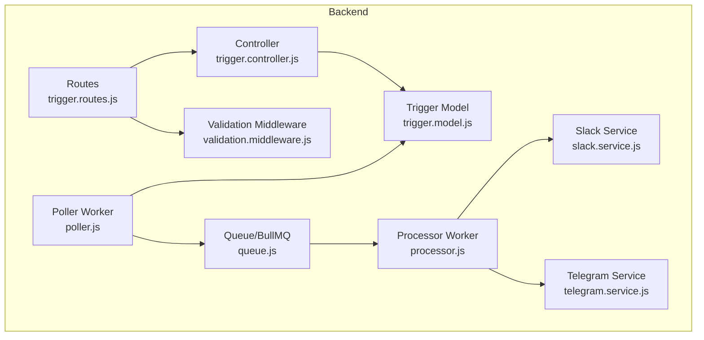
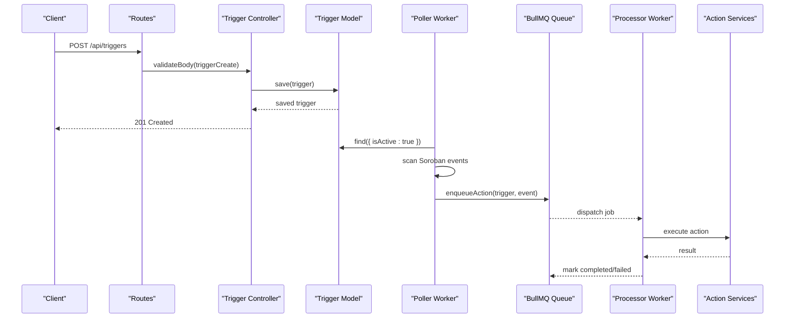
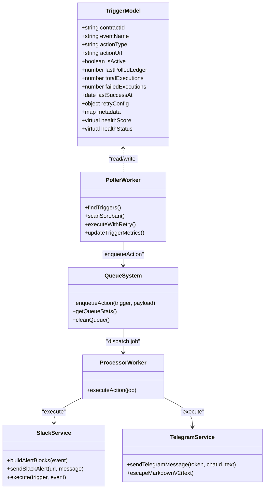
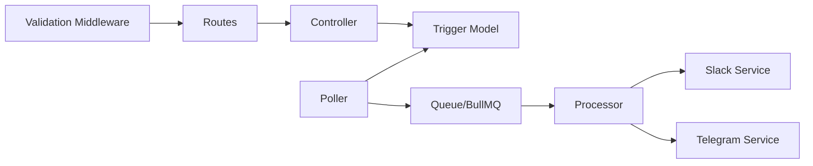

# Trigger Model Schema

<cite>
**Referenced Files in This Document**
- [trigger.model.js](file://backend/src/models/trigger.model.js)
- [trigger.controller.js](file://backend/src/controllers/trigger.controller.js)
- [trigger.routes.js](file://backend/src/routes/trigger.routes.js)
- [validation.middleware.js](file://backend/src/middleware/validation.middleware.js)
- [poller.js](file://backend/src/worker/poller.js)
- [processor.js](file://backend/src/worker/processor.js)
- [queue.js](file://backend/src/worker/queue.js)
- [slack.service.js](file://backend/src/services/slack.service.js)
- [telegram.service.js](file://backend/src/services/telegram.service.js)
- [queue-usage.js](file://backend/examples/queue-usage.js)
- [README.md](file://README.md)
</cite>

## Table of Contents
1. [Introduction](#introduction)
2. [Project Structure](#project-structure)
3. [Core Components](#core-components)
4. [Architecture Overview](#architecture-overview)
5. [Detailed Component Analysis](#detailed-component-analysis)
6. [Dependency Analysis](#dependency-analysis)
7. [Performance Considerations](#performance-considerations)
8. [Troubleshooting Guide](#troubleshooting-guide)
9. [Conclusion](#conclusion)
10. [Appendices](#appendices)

## Introduction
This document provides comprehensive data model documentation for the trigger schema used by EventHorizon to automate Web2 actions in response to Soroban smart contract events. It covers field definitions, validation rules, data types, constraints, relationships with associated entities, indexing strategies, performance optimization, schema evolution, migration strategies, and data lifecycle management. It also includes examples of trigger configurations and common query patterns.

## Project Structure
The trigger model is part of the backend’s Mongoose-based persistence layer and integrates with Express routes, validation middleware, and a polling worker that monitors the Soroban network for events. Background job processing is optional and powered by BullMQ with Redis.

**Diagram sources**
- [trigger.model.js:1-80](file://backend/src/models/trigger.model.js#L1-L80)
- [trigger.routes.js:1-92](file://backend/src/routes/trigger.routes.js#L1-L92)
- [trigger.controller.js:1-72](file://backend/src/controllers/trigger.controller.js#L1-L72)
- [validation.middleware.js:1-49](file://backend/src/middleware/validation.middleware.js#L1-L49)
- [poller.js:1-335](file://backend/src/worker/poller.js#L1-L335)
- [queue.js:1-164](file://backend/src/worker/queue.js#L1-L164)
- [processor.js:1-174](file://backend/src/worker/processor.js#L1-L174)
- [slack.service.js:1-165](file://backend/src/services/slack.service.js#L1-L165)
- [telegram.service.js:1-74](file://backend/src/services/telegram.service.js#L1-L74)

**Section sources**
- [README.md:10-17](file://README.md#L10-L17)
- [trigger.model.js:1-80](file://backend/src/models/trigger.model.js#L1-L80)
- [trigger.routes.js:1-92](file://backend/src/routes/trigger.routes.js#L1-L92)

## Core Components
- Trigger Model: Defines the schema, indexes, and computed health metrics.
- Validation Middleware: Enforces field constraints and types for trigger creation requests.
- Routes and Controller: Expose CRUD endpoints for triggers and delegate to the model.
- Poller Worker: Scans the Soroban network for events and executes actions.
- Queue/BullMQ: Optional background job processing for actions.
- Processor Worker: Consumes queued jobs and performs action execution.
- Services: Action-specific integrations (Slack, Telegram, email/webhook).

**Section sources**
- [trigger.model.js:3-79](file://backend/src/models/trigger.model.js#L3-L79)
- [validation.middleware.js:3-16](file://backend/src/middleware/validation.middleware.js#L3-L16)
- [trigger.controller.js:6-71](file://backend/src/controllers/trigger.controller.js#L6-L71)
- [poller.js:177-310](file://backend/src/worker/poller.js#L177-L310)
- [queue.js:19-83](file://backend/src/worker/queue.js#L19-L83)
- [processor.js:25-97](file://backend/src/worker/processor.js#L25-L97)

## Architecture Overview
The trigger model underpins a polling-driven automation pipeline:
- Triggers are persisted in MongoDB.
- The poller queries active triggers and scans the Soroban network for matching events.
- Matching events trigger action execution either directly or via a background queue.
- Queue workers process jobs with retries and backoff.
- Health metrics are tracked and exposed as computed virtuals.

**Diagram sources**
- [trigger.routes.js:57-61](file://backend/src/routes/trigger.routes.js#L57-L61)
- [trigger.controller.js:6-28](file://backend/src/controllers/trigger.controller.js#L6-L28)
- [trigger.model.js:1-80](file://backend/src/models/trigger.model.js#L1-L80)
- [poller.js:177-310](file://backend/src/worker/poller.js#L177-L310)
- [queue.js:91-121](file://backend/src/worker/queue.js#L91-L121)
- [processor.js:25-97](file://backend/src/worker/processor.js#L25-L97)

## Detailed Component Analysis

### Trigger Model Schema Definition
The trigger schema defines the persistent representation of automation rules and runtime metrics.

- Fields and Types
  - contractId: String, required, indexed
  - eventName: String, required
  - actionType: Enum ['webhook', 'discord', 'email', 'telegram'], default 'webhook'
  - actionUrl: String, required
  - isActive: Boolean, default true
  - lastPolledLedger: Number, default 0
  - totalExecutions: Number, default 0
  - failedExecutions: Number, default 0
  - lastSuccessAt: Date
  - retryConfig: Object
    - maxRetries: Number, default 3
    - retryIntervalMs: Number, default 5000
  - metadata: Map<String>, index enabled
  - timestamps: Mongoose timestamps (createdAt, updatedAt)

- Computed Virtuals
  - healthScore: Percentage derived from totalExecutions and failedExecutions
  - healthStatus: String enum ['healthy', 'degraded', 'critical'] based on healthScore thresholds

- Indexes
  - contractId: database index for efficient lookups by contract
  - metadata: database index for querying by metadata keys

- Notes
  - The schema does not define a dedicated priority field for queue ordering; priority is set via job options in the queue module.

**Section sources**
- [trigger.model.js:3-79](file://backend/src/models/trigger.model.js#L3-L79)

### Field Definitions, Validation Rules, and Constraints
- contractId
  - Type: String
  - Required: Yes
  - Validation: Trimmed, non-empty
  - Purpose: Identifies the Soroban contract emitting events
- eventName
  - Type: String
  - Required: Yes
  - Validation: Trimmed, non-empty
  - Purpose: Event name used to filter Soroban events
- actionType
  - Type: Enum
  - Allowed values: webhook, discord, email, telegram
  - Default: webhook
  - Validation: Must match allowed values
- actionUrl
  - Type: String
  - Required: Yes
  - Validation: URI format enforced
  - Purpose: Destination for action execution (webhook URL, chat ID, etc.)
- isActive
  - Type: Boolean
  - Default: true
  - Purpose: Controls whether the trigger participates in polling
- lastPolledLedger
  - Type: Number
  - Default: 0
  - Validation: Integer, min 0
  - Purpose: Sliding window boundary for event polling
- retryConfig
  - maxRetries: Number, default 3
  - retryIntervalMs: Number, default 5000
  - Purpose: Per-trigger retry policy during action execution
- metadata
  - Type: Map<String>
  - Index: Enabled
  - Purpose: Arbitrary key-value pairs for trigger tagging and filtering

**Section sources**
- [validation.middleware.js:4-11](file://backend/src/middleware/validation.middleware.js#L4-L11)
- [trigger.model.js:3-79](file://backend/src/models/trigger.model.js#L3-L79)

### Relationship Between Triggers and Associated Entities
- Poller Worker
  - Reads active triggers and scans Soroban events for each trigger’s contractId and eventName.
  - Updates lastPolledLedger and execution counters upon successful or failed actions.
- Queue/BullMQ
  - Optional background processing for actions; jobs carry trigger and event payload.
  - Uses trigger.priority (if present) and job options for prioritization.
- Processor Worker
  - Consumes jobs and executes actions based on actionType and actionUrl.
- Services
  - SlackService: Builds rich payloads and sends via Slack webhook.
  - TelegramService: Sends messages via Telegram Bot API with MarkdownV2 escaping.

**Diagram sources**
- [trigger.model.js:3-79](file://backend/src/models/trigger.model.js#L3-L79)
- [poller.js:177-310](file://backend/src/worker/poller.js#L177-L310)
- [queue.js:91-121](file://backend/src/worker/queue.js#L91-L121)
- [processor.js:25-97](file://backend/src/worker/processor.js#L25-L97)
- [slack.service.js:13-159](file://backend/src/services/slack.service.js#L13-L159)
- [telegram.service.js:15-71](file://backend/src/services/telegram.service.js#L15-L71)

### Indexing Strategies for Performance Optimization
- contractId: Indexed to efficiently filter triggers by contract during polling.
- metadata: Indexed to support querying by metadata keys.
- lastPolledLedger: Used as a sliding window boundary; combined with contractId for targeted polling.
- Recommendations
  - Consider compound indexes for frequent queries (e.g., { contractId, eventName }).
  - Monitor slow queries and adjust indexes based on observed access patterns.

**Section sources**
- [trigger.model.js:7](file://backend/src/models/trigger.model.js#L7)
- [trigger.model.js:56](file://backend/src/models/trigger.model.js#L56)
- [poller.js:201-217](file://backend/src/worker/poller.js#L201-L217)

### Data Access Patterns
- Create Trigger
  - Route: POST /api/triggers
  - Validation: triggerCreate schema
  - Persistence: Save to MongoDB
- List Triggers
  - Route: GET /api/triggers
  - Persistence: Read all triggers
- Delete Trigger
  - Route: DELETE /api/triggers/:id
  - Persistence: Remove by ID
- Polling and Execution
  - Poller reads active triggers and scans Soroban events.
  - Matching events trigger action execution with retries.
  - Metrics updated per execution.

**Section sources**
- [trigger.routes.js:57-89](file://backend/src/routes/trigger.routes.js#L57-L89)
- [trigger.controller.js:6-71](file://backend/src/controllers/trigger.controller.js#L6-L71)
- [poller.js:177-310](file://backend/src/worker/poller.js#L177-L310)

### Health Metrics and Computed Properties
- healthScore
  - Computed as round((totalExecutions - failedExecutions) / totalExecutions * 100)
  - Special case: 100 when totalExecutions is 0
- healthStatus
  - healthy: score >= 90
  - degraded: score >= 70
  - critical: score < 70

**Section sources**
- [trigger.model.js:64-77](file://backend/src/models/trigger.model.js#L64-L77)

### Schema Evolution Considerations
- Adding New Fields
  - Add to schema with defaults to preserve backward compatibility.
  - Ensure validation middleware includes new fields for creation/update.
- Removing Fields
  - Maintain backward compatibility by keeping fields in schema with deprecation notices.
  - Use migrations to remove unused fields after a deprecation period.
- Changing Enum Values
  - Introduce new values alongside old ones; deprecate old values after rollout.
- Index Changes
  - Add compound indexes for frequently queried combinations.
  - Rebuild indexes carefully in production environments.
- Migration Strategies
  - Use a migration script to update documents (e.g., rename fields, normalize values).
  - Backfill defaults for new fields on existing documents.
  - Validate schema changes against existing data before deployment.

**Section sources**
- [trigger.model.js:3-79](file://backend/src/models/trigger.model.js#L3-L79)
- [validation.middleware.js:4-11](file://backend/src/middleware/validation.middleware.js#L4-L11)

### Data Lifecycle Management
- Retention
  - Completed jobs retained for 24 hours; failed jobs for 7 days.
- Cleanup
  - Periodic cleaning removes old completed/failed jobs to control storage growth.
- Monitoring
  - Queue statistics expose counts for waiting, active, completed, failed, delayed jobs.

**Section sources**
- [queue.js:23-36](file://backend/src/worker/queue.js#L23-L36)
- [queue.js:148-156](file://backend/src/worker/queue.js#L148-L156)

### Examples of Trigger Configurations
- Webhook Trigger
  - actionType: webhook
  - actionUrl: HTTPS endpoint
  - Example payload shape: { contractId, eventName, payload }
- Discord Trigger
  - actionType: discord
  - actionUrl: Discord webhook URL
  - Payload: Rich embed with event details
- Telegram Trigger
  - actionType: telegram
  - actionUrl: Telegram chat ID (stored in actionUrl)
  - Requires TELEGRAM_BOT_TOKEN environment variable
- Email Trigger
  - actionType: email
  - actionUrl: Recipient email address
  - Implemented via email service

**Section sources**
- [validation.middleware.js:7](file://backend/src/middleware/validation.middleware.js#L7)
- [poller.js:77-147](file://backend/src/worker/poller.js#L77-L147)
- [processor.js:25-97](file://backend/src/worker/processor.js#L25-L97)
- [queue-usage.js:9-85](file://backend/examples/queue-usage.js#L9-L85)

### Common Query Patterns
- Find Active Triggers
  - Query: { isActive: true }
  - Use case: Poller scans active triggers
- Filter by Contract
  - Query: { contractId: "<contractId>" }
  - Use case: Targeted polling or management
- Filter by Metadata
  - Query: { metadata.key: "value" }
  - Use case: Tag-based filtering
- Sort by Health
  - Sort: { healthScore: -1 }
  - Use case: Dashboard views

**Section sources**
- [poller.js:179](file://backend/src/worker/poller.js#L179)
- [trigger.model.js:64-77](file://backend/src/models/trigger.model.js#L64-L77)

## Dependency Analysis
- Internal Dependencies
  - Routes depend on Validation Middleware and Controller.
  - Controller depends on Model.
  - Poller depends on Model and Queue/Processor.
  - Processor depends on Services.
- External Dependencies
  - Mongoose for schema and persistence.
  - BullMQ/Redis for background job processing.
  - Axios for HTTP requests.
  - Joi for validation.

**Diagram sources**
- [validation.middleware.js:1-49](file://backend/src/middleware/validation.middleware.js#L1-L49)
- [trigger.routes.js:1-92](file://backend/src/routes/trigger.routes.js#L1-L92)
- [trigger.controller.js:1-72](file://backend/src/controllers/trigger.controller.js#L1-L72)
- [trigger.model.js:1-80](file://backend/src/models/trigger.model.js#L1-L80)
- [poller.js:1-335](file://backend/src/worker/poller.js#L1-L335)
- [queue.js:1-164](file://backend/src/worker/queue.js#L1-L164)
- [processor.js:1-174](file://backend/src/worker/processor.js#L1-L174)
- [slack.service.js:1-165](file://backend/src/services/slack.service.js#L1-L165)
- [telegram.service.js:1-74](file://backend/src/services/telegram.service.js#L1-L74)

**Section sources**
- [trigger.routes.js:1-92](file://backend/src/routes/trigger.routes.js#L1-L92)
- [trigger.controller.js:1-72](file://backend/src/controllers/trigger.controller.js#L1-L72)
- [poller.js:1-335](file://backend/src/worker/poller.js#L1-L335)

## Performance Considerations
- Polling Window
  - lastPolledLedger prevents reprocessing and caps the scanning window.
  - Adjust MAX_LEDGERS_PER_POLL to balance responsiveness and RPC load.
- Concurrency and Backoff
  - Poller introduces delays between triggers and pages to avoid rate limits.
  - Queue workers use concurrency and exponential backoff for retries.
- Indexing
  - Ensure indexes on contractId and metadata keys for fast filtering.
- Queue Retention
  - Configure retention windows to control storage growth.

**Section sources**
- [poller.js:10-16](file://backend/src/worker/poller.js#L10-L16)
- [poller.js:201-217](file://backend/src/worker/poller.js#L201-L217)
- [poller.js:275-277](file://backend/src/worker/poller.js#L275-L277)
- [queue.js:128-134](file://backend/src/worker/queue.js#L128-L134)

## Troubleshooting Guide
- Validation Failures
  - Ensure contractId and eventName are provided and trimmed.
  - Verify actionUrl is a valid URI.
  - Confirm actionType matches allowed values.
- Missing Dependencies
  - For Telegram triggers, ensure TELEGRAM_BOT_TOKEN is set.
  - For Slack triggers, ensure webhookUrl is configured.
- Queue Issues
  - If Redis is unavailable, actions execute directly with reduced reliability.
  - Monitor queue stats to detect bottlenecks.
- Health Degradation
  - Review healthScore and healthStatus computed fields.
  - Investigate failedExecutions and lastSuccessAt.

**Section sources**
- [validation.middleware.js:4-11](file://backend/src/middleware/validation.middleware.js#L4-L11)
- [poller.js:64-68](file://backend/src/worker/poller.js#L64-L68)
- [poller.js:114-130](file://backend/src/worker/poller.js#L114-L130)
- [queue.js:126-143](file://backend/src/worker/queue.js#L126-L143)
- [trigger.model.js:64-77](file://backend/src/models/trigger.model.js#L64-L77)

## Conclusion
The trigger model provides a robust foundation for automating Web2 actions in response to Soroban events. Its schema, validation, computed health metrics, and optional background processing integrate seamlessly with the polling worker and queue system. By following the indexing, migration, and lifecycle recommendations, teams can evolve the schema safely while maintaining performance and reliability.

## Appendices

### API Endpoints for Triggers
- POST /api/triggers
  - Request body: TriggerInput (validated by triggerCreate schema)
  - Response: 201 Created with trigger data
- GET /api/triggers
  - Response: 200 OK with array of triggers
- DELETE /api/triggers/:id
  - Response: 204 No Content on success

**Section sources**
- [trigger.routes.js:57-89](file://backend/src/routes/trigger.routes.js#L57-L89)

### Example Trigger Configurations
- Webhook
  - actionType: webhook
  - actionUrl: HTTPS endpoint
- Discord
  - actionType: discord
  - actionUrl: Discord webhook URL
- Telegram
  - actionType: telegram
  - actionUrl: Telegram chat ID
- Email
  - actionType: email
  - actionUrl: Email address

**Section sources**
- [queue-usage.js:9-85](file://backend/examples/queue-usage.js#L9-L85)