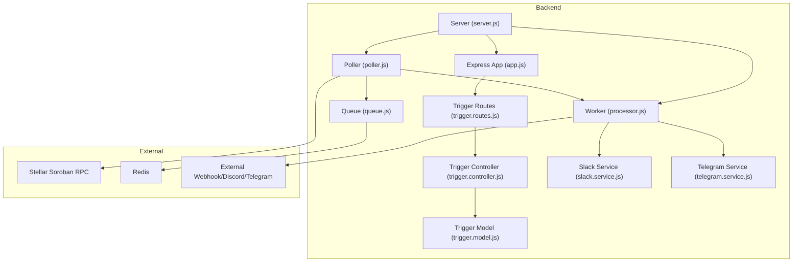
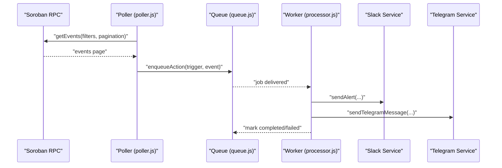
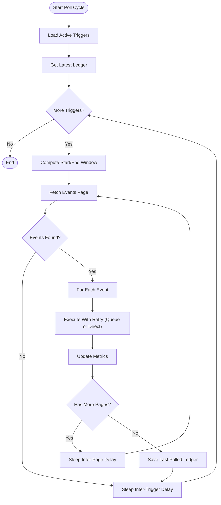
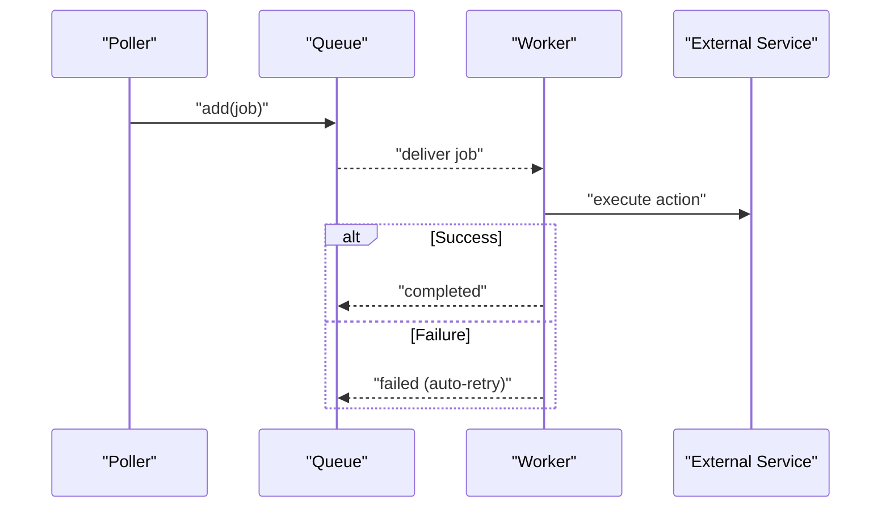
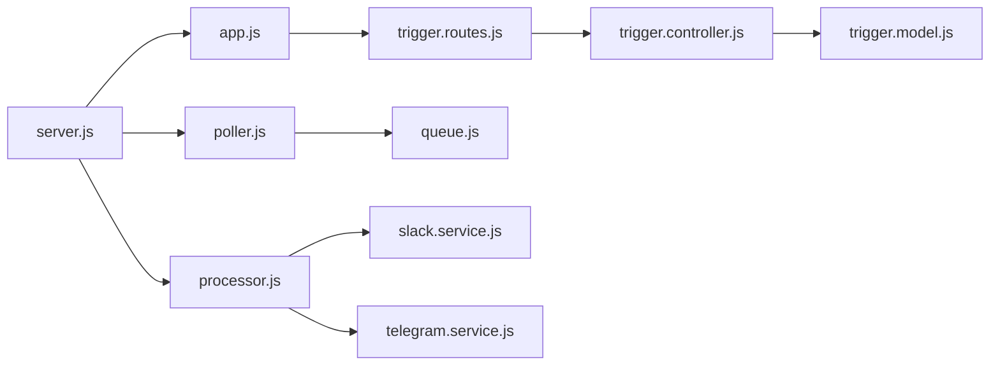

# Troubleshooting and FAQ

<cite>
**Referenced Files in This Document**
- [README.md](file://README.md)
- [backend/src/server.js](file://backend/src/server.js)
- [backend/src/app.js](file://backend/src/app.js)
- [backend/src/middleware/error.middleware.js](file://backend/src/middleware/error.middleware.js)
- [backend/src/utils/appError.js](file://backend/src/utils/appError.js)
- [backend/src/worker/poller.js](file://backend/src/worker/poller.js)
- [backend/src/worker/processor.js](file://backend/src/worker/processor.js)
- [backend/src/worker/queue.js](file://backend/src/worker/queue.js)
- [backend/src/controllers/trigger.controller.js](file://backend/src/controllers/trigger.controller.js)
- [backend/src/models/trigger.model.js](file://backend/src/models/trigger.model.js)
- [backend/src/routes/trigger.routes.js](file://backend/src/routes/trigger.routes.js)
- [backend/src/services/slack.service.js](file://backend/src/services/slack.service.js)
- [backend/src/services/telegram.service.js](file://backend/src/services/telegram.service.js)
- [backend/QUEUE_SETUP.md](file://backend/QUEUE_SETUP.md)
- [backend/REDIS_OPTIONAL.md](file://backend/REDIS_OPTIONAL.md)
</cite>

## Table of Contents
1. [Introduction](#introduction)
2. [Project Structure](#project-structure)
3. [Core Components](#core-components)
4. [Architecture Overview](#architecture-overview)
5. [Detailed Component Analysis](#detailed-component-analysis)
6. [Dependency Analysis](#dependency-analysis)
7. [Performance Considerations](#performance-considerations)
8. [Troubleshooting Guide](#troubleshooting-guide)
9. [Conclusion](#conclusion)
10. [Appendices](#appendices)

## Introduction
This document provides a comprehensive troubleshooting and FAQ guide for EventHorizon. It focuses on diagnosing and resolving common issues related to smart contract integration, trigger configuration, notification delivery, event polling, queue processing, and frontend connectivity. It also covers performance optimization, memory management, system resource monitoring, bottleneck identification, error analysis, and log interpretation. Finally, it includes frequently asked questions, escalation procedures, and community support resources.

## Project Structure
EventHorizon consists of:
- Backend: Node.js/Express server, worker poller, BullMQ-based queue, and API routes/controllers.
- Frontend: Vite/React dashboard for managing triggers.
- Contracts: Rust-based Soroban contracts for testing and integration.

Key runtime components:
- Server startup initializes MongoDB, optional BullMQ worker, and the event poller.
- The poller queries Soroban RPC for events and enqueues or executes actions.
- Queue and workers process actions asynchronously with retries and monitoring.
- API endpoints expose health checks, trigger management, and queue statistics.

**Diagram sources**
- [backend/src/server.js:1-88](file://backend/src/server.js#L1-L88)
- [backend/src/app.js:1-55](file://backend/src/app.js#L1-L55)
- [backend/src/worker/poller.js:1-335](file://backend/src/worker/poller.js#L1-L335)
- [backend/src/worker/queue.js:1-164](file://backend/src/worker/queue.js#L1-L164)
- [backend/src/worker/processor.js:1-174](file://backend/src/worker/processor.js#L1-L174)
- [backend/src/controllers/trigger.controller.js:1-72](file://backend/src/controllers/trigger.controller.js#L1-L72)
- [backend/src/models/trigger.model.js:1-80](file://backend/src/models/trigger.model.js#L1-L80)
- [backend/src/routes/trigger.routes.js:1-92](file://backend/src/routes/trigger.routes.js#L1-L92)
- [backend/src/services/slack.service.js:1-165](file://backend/src/services/slack.service.js#L1-L165)
- [backend/src/services/telegram.service.js:1-74](file://backend/src/services/telegram.service.js#L1-L74)

**Section sources**
- [README.md:1-63](file://README.md#L1-L63)
- [backend/src/server.js:1-88](file://backend/src/server.js#L1-L88)
- [backend/src/app.js:1-55](file://backend/src/app.js#L1-L55)

## Core Components
- Server and Health: Initializes MongoDB, starts the poller, and optionally the BullMQ worker. Provides a health endpoint for readiness checks.
- Poller: Queries Soroban RPC for contract events, paginates results, and enqueues or executes actions with retry logic.
- Queue and Worker: Manage background job processing with retries, concurrency, and rate limiting.
- Trigger Management: CRUD endpoints for triggers with validation and logging.
- Notification Services: Slack and Telegram services with graceful error handling and payload formatting.
- Error Handling: Centralized error normalization and response formatting.

**Section sources**
- [backend/src/server.js:34-88](file://backend/src/server.js#L34-L88)
- [backend/src/worker/poller.js:177-335](file://backend/src/worker/poller.js#L177-L335)
- [backend/src/worker/queue.js:19-164](file://backend/src/worker/queue.js#L19-L164)
- [backend/src/worker/processor.js:102-174](file://backend/src/worker/processor.js#L102-L174)
- [backend/src/controllers/trigger.controller.js:6-72](file://backend/src/controllers/trigger.controller.js#L6-L72)
- [backend/src/services/slack.service.js:97-160](file://backend/src/services/slack.service.js#L97-L160)
- [backend/src/services/telegram.service.js:15-74](file://backend/src/services/telegram.service.js#L15-L74)
- [backend/src/middleware/error.middleware.js:1-59](file://backend/src/middleware/error.middleware.js#L1-L59)

## Architecture Overview
The system separates concerns across layers:
- Data Access: MongoDB stores triggers and their metrics.
- Event Detection: Poller queries RPC and matches events per trigger.
- Action Dispatch: Queue persists jobs; workers execute actions with retries.
- External Integrations: Slack, Telegram, Discord, and generic webhooks.

**Diagram sources**
- [backend/src/worker/poller.js:227-277](file://backend/src/worker/poller.js#L227-L277)
- [backend/src/worker/queue.js:91-121](file://backend/src/worker/queue.js#L91-L121)
- [backend/src/worker/processor.js:25-97](file://backend/src/worker/processor.js#L25-L97)
- [backend/src/services/slack.service.js:97-134](file://backend/src/services/slack.service.js#L97-L134)
- [backend/src/services/telegram.service.js:15-57](file://backend/src/services/telegram.service.js#L15-L57)

## Detailed Component Analysis

### Poller: Event Discovery and Action Execution
Key behaviors:
- Retrieves latest ledger and sets sliding window per trigger.
- Paginates events with configurable delays to avoid rate limits.
- Converts event names to XDR for topic filtering.
- Enqueues actions via queue if available; otherwise executes directly with retries per trigger.
- Updates trigger metrics and last polled ledger on success.

Common issues:
- RPC timeouts or rate limits leading to partial polling windows.
- Missing actionUrl or tokens causing immediate failures.
- Extremely large payloads impacting external service acceptance.

**Diagram sources**
- [backend/src/worker/poller.js:177-335](file://backend/src/worker/poller.js#L177-L335)

**Section sources**
- [backend/src/worker/poller.js:177-335](file://backend/src/worker/poller.js#L177-L335)

### Queue and Worker: Background Processing
Key behaviors:
- Queue persists jobs with retention policies and exponential backoff.
- Worker processes jobs concurrently with rate limiting and emits completion/failed events.
- Graceful shutdown closes worker and connection.

Common issues:
- Redis connectivity preventing worker startup.
- High concurrency causing external service throttling.
- Job stuck in waiting due to worker crash.

**Diagram sources**
- [backend/src/worker/queue.js:19-164](file://backend/src/worker/queue.js#L19-L164)
- [backend/src/worker/processor.js:102-174](file://backend/src/worker/processor.js#L102-L174)

**Section sources**
- [backend/src/worker/queue.js:19-164](file://backend/src/worker/queue.js#L19-L164)
- [backend/src/worker/processor.js:102-174](file://backend/src/worker/processor.js#L102-L174)

### Trigger Management: Creation, Listing, Deletion
Key behaviors:
- Validation middleware ensures required fields.
- Logging captures IP, user agent, and operation details.
- Deletion returns 404 via AppError when not found.

Common issues:
- Validation errors due to missing fields.
- Not found errors when deleting non-existent triggers.

**Section sources**
- [backend/src/controllers/trigger.controller.js:6-72](file://backend/src/controllers/trigger.controller.js#L6-L72)
- [backend/src/routes/trigger.routes.js:57-92](file://backend/src/routes/trigger.routes.js#L57-L92)
- [backend/src/models/trigger.model.js:3-80](file://backend/src/models/trigger.model.js#L3-L80)

### Notification Services: Slack and Telegram
Key behaviors:
- Slack: Builds Block Kit payload; handles rate limits and common HTTP errors.
- Telegram: Sends MarkdownV2 messages; escapes special characters; handles common API errors.

Common issues:
- Missing credentials or invalid URLs.
- Rate limits and permission errors.
- Malformed payloads or blocked users.

**Section sources**
- [backend/src/services/slack.service.js:97-160](file://backend/src/services/slack.service.js#L97-L160)
- [backend/src/services/telegram.service.js:15-74](file://backend/src/services/telegram.service.js#L15-L74)

## Dependency Analysis
- Server depends on MongoDB and conditionally on Redis/BullMQ.
- Poller depends on RPC and optionally on Queue.
- Worker depends on Redis and external services.
- Controllers depend on models and validation middleware.
- Error handling normalizes errors and enriches responses.

**Diagram sources**
- [backend/src/server.js:1-88](file://backend/src/server.js#L1-L88)
- [backend/src/app.js:1-55](file://backend/src/app.js#L1-L55)
- [backend/src/worker/poller.js:1-335](file://backend/src/worker/poller.js#L1-L335)
- [backend/src/worker/processor.js:1-174](file://backend/src/worker/processor.js#L1-L174)
- [backend/src/controllers/trigger.controller.js:1-72](file://backend/src/controllers/trigger.controller.js#L1-L72)
- [backend/src/models/trigger.model.js:1-80](file://backend/src/models/trigger.model.js#L1-L80)
- [backend/src/routes/trigger.routes.js:1-92](file://backend/src/routes/trigger.routes.js#L1-L92)
- [backend/src/services/slack.service.js:1-165](file://backend/src/services/slack.service.js#L1-L165)
- [backend/src/services/telegram.service.js:1-74](file://backend/src/services/telegram.service.js#L1-L74)

**Section sources**
- [backend/src/server.js:1-88](file://backend/src/server.js#L1-L88)
- [backend/src/app.js:1-55](file://backend/src/app.js#L1-L55)

## Performance Considerations
- Polling cadence and window size: Tune polling interval and maximum ledgers per poll to balance responsiveness and RPC load.
- Queue concurrency: Adjust worker concurrency and rate limiter to match external service capacity.
- Retention and cleanup: Configure job retention and periodically clean old completed/failed jobs to control memory usage.
- Payload sizes: Keep event payloads concise to avoid external service rejection or timeouts.
- Resource monitoring: Track CPU, memory, and Redis utilization during peak loads.

[No sources needed since this section provides general guidance]

## Troubleshooting Guide

### Smart Contract Integration Problems
Symptoms:
- No events detected despite contract emitting them.
- Incorrect event names or contract IDs.

Diagnosis steps:
- Verify contract ID and event name casing.
- Confirm RPC URL and network passphrase.
- Check that the poller’s event topic conversion matches the emitted event name.
- Review logs for RPC errors or rate limit handling.

Resolution:
- Align event names with XDR conversion expectations.
- Ensure the contract is deployed on the configured network.
- Increase inter-page delay if rate-limited.

**Section sources**
- [backend/src/worker/poller.js:227-277](file://backend/src/worker/poller.js#L227-L277)
- [backend/src/worker/poller.js:194-199](file://backend/src/worker/poller.js#L194-L199)

### Trigger Configuration Errors
Symptoms:
- 400 validation errors when creating triggers.
- 404 when deleting non-existent triggers.

Diagnosis steps:
- Inspect validation middleware and required fields.
- Check controller logs for IP/user-agent and operation details.
- Confirm trigger model fields and enums.

Resolution:
- Provide required fields: contractId, eventName, actionType, actionUrl.
- Use supported action types and valid identifiers.

**Section sources**
- [backend/src/controllers/trigger.controller.js:6-72](file://backend/src/controllers/trigger.controller.js#L6-L72)
- [backend/src/models/trigger.model.js:3-80](file://backend/src/models/trigger.model.js#L3-L80)
- [backend/src/routes/trigger.routes.js:57-92](file://backend/src/routes/trigger.routes.js#L57-L92)

### Notification Delivery Failures
Symptoms:
- Slack/Telegram/webhook failures.
- Rate limits or permission errors.

Diagnosis steps:
- Review worker logs for job failures and attempts.
- Inspect Slack/Telegram services for handled HTTP errors.
- Verify credentials and URLs.

Resolution:
- Fix credentials and URLs.
- Implement retry logic at the trigger level.
- Reduce concurrency or apply backoff to external services.

**Section sources**
- [backend/src/worker/processor.js:145-159](file://backend/src/worker/processor.js#L145-L159)
- [backend/src/services/slack.service.js:102-134](file://backend/src/services/slack.service.js#L102-L134)
- [backend/src/services/telegram.service.js:30-57](file://backend/src/services/telegram.service.js#L30-L57)

### Event Polling Issues
Symptoms:
- Partial polling windows or skipped ledgers.
- Slow or stalled polling cycles.

Diagnosis steps:
- Check latest ledger retrieval and window computation.
- Review pagination loop and inter-page delays.
- Inspect retry logic for RPC calls.

Resolution:
- Increase RPC timeout and adjust inter-page delay.
- Reduce max ledgers per poll for stability under load.
- Investigate network connectivity and RPC availability.

**Section sources**
- [backend/src/worker/poller.js:194-199](file://backend/src/worker/poller.js#L194-L199)
- [backend/src/worker/poller.js:227-277](file://backend/src/worker/poller.js#L227-L277)
- [backend/src/worker/poller.js:27-51](file://backend/src/worker/poller.js#L27-L51)

### Queue Processing Problems
Symptoms:
- Jobs stuck in waiting.
- High memory usage.
- Worker crashes.

Diagnosis steps:
- Use queue stats endpoint to inspect waiting/active/completed/failed counts.
- Check worker logs for errors and failed job details.
- Verify Redis connectivity and credentials.

Resolution:
- Restart server to reinitialize worker.
- Reduce worker concurrency or tune rate limiter.
- Clean old jobs to reclaim memory.

**Section sources**
- [backend/QUEUE_SETUP.md:99-134](file://backend/QUEUE_SETUP.md#L99-L134)
- [backend/src/worker/processor.js:145-159](file://backend/src/worker/processor.js#L145-L159)
- [backend/src/worker/queue.js:126-143](file://backend/src/worker/queue.js#L126-L143)

### Frontend Connectivity Issues
Symptoms:
- Dashboard cannot reach API.
- CORS or rate limit errors.

Diagnosis steps:
- Confirm API base URL and CORS policy.
- Check rate limit middleware logs.
- Validate health endpoint availability.

Resolution:
- Ensure frontend and backend share the same origin or configure CORS properly.
- Adjust rate limiter settings for development.
- Verify environment variables and ports.

**Section sources**
- [backend/src/app.js:18-22](file://backend/src/app.js#L18-L22)
- [backend/src/server.js:32](file://backend/src/server.js#L32)

### Error Analysis and Log Interpretation
- Centralized error handling normalizes errors and adds operational context.
- AppError distinguishes client vs server errors and captures stack traces in development.
- Poller and worker emit structured logs with context (IDs, statuses, attempts).

Guidelines:
- Look for “Action enqueued”, “Processing action job”, “Job completed/failed” in worker logs.
- For poller, watch for “Starting event polling cycle”, “Collected events for trigger”, and “Error in event poller”.
- For API, review normalized responses with status, message, and optional details.

**Section sources**
- [backend/src/middleware/error.middleware.js:36-53](file://backend/src/middleware/error.middleware.js#L36-L53)
- [backend/src/utils/appError.js:1-16](file://backend/src/utils/appError.js#L1-L16)
- [backend/src/worker/poller.js:304-310](file://backend/src/worker/poller.js#L304-L310)
- [backend/src/worker/processor.js:138-159](file://backend/src/worker/processor.js#L138-L159)

### System Resource Monitoring
- Monitor Redis memory and connections when enabled.
- Track worker concurrency and job throughput.
- Observe MongoDB connection status and query performance.
- Use queue stats to detect backlog growth.

**Section sources**
- [backend/QUEUE_SETUP.md:229-249](file://backend/QUEUE_SETUP.md#L229-L249)
- [backend/src/worker/queue.js:126-143](file://backend/src/worker/queue.js#L126-L143)
- [backend/src/server.js:35-42](file://backend/src/server.js#L35-L42)

### Frequently Asked Questions
- Is Redis required?
  - No. The system gracefully falls back to direct execution when Redis is unavailable. See Redis optional behavior and queue setup documents.
- What action types are supported?
  - Webhook, Discord, Email, Telegram are supported in the model and worker/service implementations.
- How do I monitor queue health?
  - Use the queue stats endpoint to inspect waiting, active, completed, failed, and delayed job counts.
- Can I scale workers?
  - Yes, increase worker concurrency and run multiple worker processes behind a load balancer.
- How do I clean old jobs?
  - Use the queue clean endpoint to remove completed jobs older than 24 hours and failed jobs older than 7 days.

**Section sources**
- [backend/REDIS_OPTIONAL.md:1-203](file://backend/REDIS_OPTIONAL.md#L1-L203)
- [backend/QUEUE_SETUP.md:99-134](file://backend/QUEUE_SETUP.md#L99-L134)
- [backend/src/models/trigger.model.js:13-21](file://backend/src/models/trigger.model.js#L13-L21)
- [backend/src/worker/processor.js:128-136](file://backend/src/worker/processor.js#L128-L136)

### Escalation Procedures and Community Support
Escalation steps:
- Capture logs from server, poller, worker, and queue components.
- Provide environment details: RPC URL, MongoDB URI, Redis configuration, and worker concurrency.
- Reproduce with minimal triggers and payloads.
- Open an issue with logs, environment variables, and steps to reproduce.

Community support:
- Use the repository’s issue tracker for bug reports and feature requests.
- Reference the interactive API documentation and OpenAPI JSON for endpoint details.

**Section sources**
- [README.md:44-46](file://README.md#L44-L46)

## Conclusion
This guide consolidates actionable diagnostics and resolutions for EventHorizon across smart contract integration, trigger configuration, notification delivery, polling, queue processing, and frontend connectivity. By leveraging structured logs, queue monitoring, and environment tuning, most issues can be identified and resolved quickly. For persistent problems, escalate with comprehensive logs and environment details.

## Appendices

### API Endpoints for Diagnostics
- GET /api/health: Confirm server and queue status.
- GET /api/triggers: List triggers and verify configuration.
- GET /api/queue/stats: Inspect queue workload and job states.
- POST /api/queue/clean: Remove old completed/failed jobs.

**Section sources**
- [backend/src/server.js:32](file://backend/src/server.js#L32)
- [backend/src/routes/trigger.routes.js:62](file://backend/src/routes/trigger.routes.js#L62)
- [backend/QUEUE_SETUP.md:99-134](file://backend/QUEUE_SETUP.md#L99-L134)